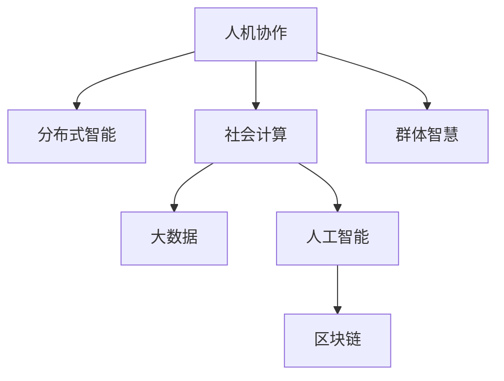

                 

# 群体智慧的力量：探索人类计算的潜力

## 1. 背景介绍

在现代信息技术飞速发展的背景下，计算能力和计算模式经历了革命性的变革。从最初的大型机时代，到后来的个人计算机时代，再到智能手机、物联网等设备的普及，计算技术正在深入到社会的每一个角落。然而，即便是计算能力达到了前所未有的高度，它始终是围绕着"人"进行的。在这场人机协作的革命中，群体智慧（Collective Intelligence）的崛起，正成为引领未来计算发展的新引擎。

群体智慧并不是一种全新计算模式，而是人类智慧和计算能力结合的产物。它利用人类的知识、经验、直觉和创新能力，通过智能系统进行数据处理和决策支持，使得计算机能够更加有效地进行任务求解。群体智慧的核心理念是"计算与人"的深度融合，旨在通过分布式协作、机器学习等技术手段，挖掘和利用大规模数据资源，实现高效、精准、智能化的决策。

## 2. 核心概念与联系

### 2.1 核心概念概述

为更好地理解群体智慧这一概念，我们首先明确几个与之紧密相关的核心概念：

- **人机协作（Human-Machine Collaboration）**：人类智慧与计算机能力相互补充、相互增强的合作方式。在协作过程中，人类担任决策者，计算机负责数据分析和辅助决策，二者共同完成复杂任务。

- **分布式智能（Distributed Intelligence）**：将计算资源和智能分布到多个节点，实现数据的并行处理和协作决策。这不仅提升了计算效率，还增强了系统的鲁棒性和可扩展性。

- **社会计算（Social Computing）**：利用人类社交网络中的互动和数据，进行群体智慧的挖掘和应用。这包括社交媒体分析、在线协作、众包任务等形式。

- **大数据（Big Data）**：从海量数据中提取有价值的信息，进行数据驱动的决策支持。大数据技术为群体智慧提供了丰富的数据源和强大的分析工具。

- **人工智能（Artificial Intelligence）**：以模拟、延伸和扩展人的智能为目的的技术体系。群体智慧正是以人工智能为基础，通过人机结合的方式，提升智能系统的综合能力。

- **区块链（Blockchain）**：一种分布式账本技术，具有去中心化、安全可靠的特点，为群体智慧提供了高效的数据协作机制。

这些概念之间的逻辑关系可以通过以下Mermaid流程图来展示：



### 2.2 核心概念原理和架构

群体智慧的实现，主要依赖于以下几大核心技术：

- **云计算**：提供弹性计算资源，支持大规模分布式协作和数据处理。
- **大数据技术**：从海量数据中提取知识，支持决策支持。
- **机器学习与深度学习**：提升数据处理和智能决策能力。
- **区块链**：确保数据安全、透明和可信。
- **自然语言处理**：支持与人类自然的交互方式，增强人机协作效率。

这些技术的融合，使得群体智慧能够在各个领域中大显身手。下面将详细讲解群体智慧的核心算法原理和具体操作步骤。

## 3. 核心算法原理 & 具体操作步骤

### 3.1 算法原理概述

群体智慧的核心在于利用人类的知识、经验和直觉，通过计算机进行数据处理和智能决策。其基本算法流程包括以下几个步骤：

1. **数据采集**：从各种数据源（如传感器、社交网络、移动设备等）中收集数据，形成数据集。
2. **数据预处理**：清洗数据，去除噪音，进行归一化处理。
3. **分布式计算**：将数据分发到多个计算节点上进行并行处理。
4. **智能分析**：利用机器学习算法对数据进行深度分析，提取有用信息。
5. **协作决策**：将分析结果汇总，通过专家系统或机器学习模型进行决策。
6. **反馈与优化**：根据决策结果进行反馈，不断调整算法和模型，提升性能。

### 3.2 算法步骤详解

具体而言，群体智慧的算法实现分为以下几个关键步骤：

**Step 1: 数据采集与预处理**

数据采集是群体智慧的基础。常用的数据采集方式包括：

- 传感器数据：通过各种传感器收集实时数据，如温度、湿度、压力等。
- 社交网络数据：通过分析社交媒体、论坛、微博等平台的用户互动信息，提取有价值的情报。
- 移动设备数据：通过分析手机、平板电脑等移动设备的使用数据，进行行为分析。

数据预处理主要包括：

- 数据清洗：去除缺失值、噪音和异常值。
- 数据归一化：将数据转换为标准化的格式，便于后续处理。
- 特征提取：从原始数据中提取有用的特征，如时间戳、位置信息、文本内容等。

**Step 2: 分布式计算与存储**

分布式计算是群体智慧的关键。常用的分布式计算框架包括：

- Hadoop与Spark：用于处理大规模批处理任务。
- Kafka与RabbitMQ：用于消息队列，支持分布式计算的协调。
- etcd与Zookeeper：用于分布式计算节点的管理与监控。

数据存储方面，常用的分布式存储系统包括：

- HDFS：用于大规模数据存储。
- Cassandra与HBase：用于高效的数据查询和实时分析。
- MongoDB与ElasticSearch：用于结构化与非结构化数据的存储。

**Step 3: 智能分析与决策**

智能分析是群体智慧的核心。常用的智能分析工具包括：

- 机器学习算法：如分类、回归、聚类等，用于数据分析和模式识别。
- 深度学习算法：如卷积神经网络（CNN）、循环神经网络（RNN）、长短期记忆网络（LSTM）等，用于复杂数据的处理和分析。
- 自然语言处理技术：如文本分类、情感分析、命名实体识别等，用于处理文本数据。

决策支持方面，常用的决策模型包括：

- 规则引擎：根据预设规则进行决策。
- 贝叶斯网络：用于概率推理和决策支持。
- 强化学习：通过学习最优策略，实现智能决策。

**Step 4: 反馈与优化**

反馈与优化是群体智慧的保障。常用的反馈机制包括：

- 实时监控：通过监控系统，实时获取决策结果，进行反馈。
- 用户反馈：通过用户反馈，调整算法和模型，提升性能。
- 模型更新：定期更新模型，保持其适应性。

### 3.3 算法优缺点

群体智慧具有以下优点：

- **高效性**：通过分布式计算，可以处理海量数据，提升计算效率。
- **鲁棒性**：分布式系统具有较高的容错性和可扩展性。
- **灵活性**：可以根据需要灵活调整算法和模型，提升性能。
- **可扩展性**：支持大规模数据的处理和分析，适合大数据场景。

同时，群体智慧也存在以下缺点：

- **成本高**：需要大量的计算资源和存储资源。
- **复杂性高**：系统设计和维护较为复杂。
- **数据安全**：需要确保数据的隐私和安全。
- **技术门槛高**：需要掌握大数据、机器学习等技术。

### 3.4 算法应用领域

群体智慧已经在多个领域中得到广泛应用，如：

- **金融科技**：通过数据分析和智能决策，实现风险控制和投资优化。
- **医疗健康**：通过数据挖掘和模式识别，支持疾病预测和精准治疗。
- **智能制造**：通过数据分析和决策支持，提升生产效率和质量。
- **城市管理**：通过数据分析和智能决策，优化城市交通和公共服务。
- **环境监测**：通过数据分析和模式识别，提升环境监测和治理能力。

## 4. 数学模型和公式 & 详细讲解 & 举例说明

### 4.1 数学模型构建

群体智慧的数学模型主要涉及以下几个部分：

- **线性回归模型**：用于处理连续型数据的回归分析。
- **逻辑回归模型**：用于处理分类问题的分类分析。
- **决策树模型**：用于处理分类和回归问题的决策支持。
- **支持向量机模型**：用于处理分类和回归问题的分类和回归分析。
- **随机森林模型**：用于处理分类和回归问题的决策支持。
- **神经网络模型**：用于处理复杂数据的分类和回归分析。

### 4.2 公式推导过程

以线性回归模型为例，公式推导如下：

设样本集为 $\{(x_i, y_i)\}_{i=1}^N$，其中 $x_i \in \mathbb{R}^d$ 为自变量，$y_i \in \mathbb{R}$ 为因变量，线性回归模型为：

$$
y_i = \theta_0 + \sum_{j=1}^d \theta_j x_{ij}
$$

其中 $\theta_0$ 为截距，$\theta_j$ 为权重系数。目标是最小化损失函数：

$$
\min_{\theta_0, \theta_j} \frac{1}{N}\sum_{i=1}^N (y_i - (\theta_0 + \sum_{j=1}^d \theta_j x_{ij}))^2
$$

通过最小二乘法，求解上述最优化问题，得到模型参数：

$$
\theta_0 = \frac{\sum_{i=1}^N y_i - \sum_{i=1}^N \sum_{j=1}^d \theta_j x_{ij}}{N}
$$

$$
\theta_j = \frac{\sum_{i=1}^N x_{ij}(y_i - \theta_0)}{\sum_{i=1}^N x_{ij}^2}
$$

### 4.3 案例分析与讲解

以股票价格预测为例，假设我们收集到了某公司过去5年的历史股价数据，以及同期宏观经济指标（如GDP增长率、利率等）。我们可以使用线性回归模型来预测未来一年该公司的股价。具体步骤如下：

1. **数据预处理**：将历史股价和宏观经济指标进行归一化处理，去除噪音。
2. **模型训练**：使用线性回归模型对历史数据进行训练，求解模型参数。
3. **数据测试**：使用最新的宏观经济指标，进行模型预测，验证模型效果。
4. **结果评估**：通过评估指标（如均方误差、R²值等），衡量模型性能。

## 5. 项目实践：代码实例和详细解释说明

### 5.1 开发环境搭建

为了进行群体智慧的开发，需要搭建一个完整的开发环境，包括硬件资源和软件工具。以下是常用的开发环境搭建流程：

1. **硬件资源**：
   - **计算资源**：使用高性能服务器或云平台（如AWS、阿里云等）进行分布式计算。
   - **存储资源**：使用高性能存储设备（如SSD、NVMe等）进行数据存储。
   - **网络资源**：确保网络带宽足够，支持高并发的数据传输。

2. **软件工具**：
   - **操作系统**：使用Linux或Windows系统。
   - **分布式计算框架**：使用Hadoop、Spark等。
   - **数据存储系统**：使用HDFS、Cassandra等。
   - **机器学习框架**：使用TensorFlow、PyTorch等。

### 5.2 源代码详细实现

以下是一个简单的线性回归模型实现，用于股票价格预测：

```python
import numpy as np
from sklearn.linear_model import LinearRegression

# 加载数据
X = np.loadtxt('stock_prices.csv', delimiter=',', skiprows=1, usecols=[1, 2, 3], dtype=float)
y = np.loadtxt('stock_prices.csv', delimiter=',', skiprows=1, usecols=[0], dtype=float)

# 分割训练集和测试集
X_train, y_train = X[:100], y[:100]
X_test, y_test = X[100:], y[100:]

# 训练模型
model = LinearRegression()
model.fit(X_train, y_train)

# 预测测试集
y_pred = model.predict(X_test)

# 评估模型
from sklearn.metrics import mean_squared_error
mse = mean_squared_error(y_test, y_pred)
print('Mean Squared Error:', mse)
```

### 5.3 代码解读与分析

这段代码实现了线性回归模型的预测功能，用于股票价格预测。主要步骤如下：

1. **数据加载**：使用numpy加载股票价格数据，并将其分割为训练集和测试集。
2. **模型训练**：使用scikit-learn的LinearRegression模型对训练集进行训练。
3. **预测测试集**：使用训练好的模型对测试集进行预测。
4. **结果评估**：使用均方误差评估模型预测结果，输出评估指标。

## 6. 实际应用场景

### 6.1 金融科技

金融科技是群体智慧的重要应用场景之一。通过数据分析和智能决策，金融科技可以提升风险控制和投资优化能力，使得金融服务更加智能化、高效化。

具体而言，金融科技的应用包括：

- **风险评估**：通过数据分析，评估借款人的信用风险，实现精准贷款。
- **投资管理**：通过智能算法，进行投资组合优化，提升投资收益。
- **智能客服**：通过自然语言处理技术，提升客服响应速度和质量。

### 6.2 医疗健康

群体智慧在医疗健康领域也有着广泛的应用，能够提升疾病预测、精准治疗和医疗管理能力。

具体而言，医疗健康的应用包括：

- **疾病预测**：通过数据分析，预测疾病的发生概率，提供早期预警。
- **精准治疗**：通过模式识别，提供个性化的治疗方案，提升治疗效果。
- **医疗管理**：通过智能分析，优化医疗资源的配置和管理。

### 6.3 智能制造

智能制造是群体智慧在工业领域的重要应用。通过数据分析和决策支持，智能制造能够提升生产效率和质量，实现智能化的生产过程。

具体而言，智能制造的应用包括：

- **生产调度**：通过数据分析，优化生产调度，提升生产效率。
- **质量控制**：通过智能检测，实现产品质量的实时监控和控制。
- **设备维护**：通过数据分析，预测设备故障，进行预防性维护。

### 6.4 城市管理

城市管理是群体智慧在城市领域的典型应用。通过数据分析和智能决策，城市管理能够提升交通管理、公共服务和社会治理能力，实现智慧城市建设。

具体而言，城市管理的应用包括：

- **交通管理**：通过数据分析，优化交通信号，提升交通效率。
- **公共服务**：通过智能分析，提升公共服务的响应速度和质量。
- **社会治理**：通过智能决策，提升社会治理的效率和效果。

### 6.5 环境监测

群体智慧在环境监测领域也有着广泛的应用，能够提升环境监测和治理能力，实现智慧环保。

具体而言，环境监测的应用包括：

- **污染监测**：通过数据分析，监测环境污染物的变化趋势。
- **生态保护**：通过智能分析，制定生态保护方案，提升生态治理效果。
- **资源管理**：通过数据分析，优化自然资源的使用和管理。

## 7. 工具和资源推荐

### 7.1 学习资源推荐

为了帮助开发者掌握群体智慧的相关技术，这里推荐一些优质的学习资源：

1. **《群体智慧：从数据到决策》**：介绍群体智慧的基本概念、关键技术和实际应用。
2. **《分布式系统设计与实现》**：介绍分布式系统架构和设计原则。
3. **《机器学习实战》**：通过实践项目，深入讲解机器学习算法和应用。
4. **《大数据分析实战》**：介绍大数据技术和分析方法，并结合案例进行讲解。
5. **《Python数据科学手册》**：详细介绍Python在数据科学中的应用，包括数据分析、机器学习、数据可视化等。

### 7.2 开发工具推荐

为了高效开发群体智慧系统，推荐使用以下工具：

1. **Jupyter Notebook**：提供交互式编程环境，便于代码调试和分析。
2. **TensorFlow**：基于数据流的机器学习框架，支持分布式计算和深度学习。
3. **PyTorch**：基于动态计算图的深度学习框架，支持高效的模型训练和推理。
4. **Scikit-learn**：基于Python的机器学习库，提供丰富的算法实现。
5. **Kaggle**：数据科学竞赛平台，提供大量数据集和项目实战机会。

### 7.3 相关论文推荐

群体智慧领域的研究成果众多，以下是几篇经典论文，推荐阅读：

1. **《大规模分布式计算》**：介绍分布式计算的基本原理和应用场景。
2. **《大数据时代的群体智慧》**：介绍大数据技术和群体智慧的结合应用。
3. **《智能决策支持系统》**：介绍智能决策系统和算法。
4. **《社会计算：基于大数据的人类行为分析》**：介绍社会计算的基本概念和技术。
5. **《区块链：从分布式账本到智能合约》**：介绍区块链的基本原理和应用场景。

## 8. 总结：未来发展趋势与挑战

### 8.1 研究成果总结

群体智慧技术已经在诸多领域中得到了广泛应用，并取得了显著的成效。其主要研究成果包括：

1. **分布式计算**：支持大规模数据的并行处理和分析。
2. **智能决策**：提升数据分析和决策支持的效率和效果。
3. **数据融合**：实现多源数据的集成和融合，提升综合分析能力。
4. **知识管理**：构建知识图谱和规则库，支持智能推理和决策。

### 8.2 未来发展趋势

未来，群体智慧技术将在以下几个方面进一步发展：

1. **深度学习与自然语言处理**：结合深度学习和自然语言处理技术，提升智能分析能力。
2. **智能决策与优化**：结合强化学习和智能优化算法，提升决策的精准性和效率。
3. **跨领域应用**：在更多领域（如金融、医疗、交通等）中实现群体智慧的落地应用。
4. **实时性提升**：通过优化算法和硬件设施，提升群体智慧系统的实时性。
5. **隐私与安全**：结合区块链和加密技术，提升数据隐私和安全。

### 8.3 面临的挑战

尽管群体智慧技术在诸多领域中取得了显著成果，但仍面临以下挑战：

1. **数据隐私**：大规模数据收集和处理过程中，数据隐私和安全问题突出。
2. **计算资源**：分布式计算和智能决策需要大量的计算资源，成本较高。
3. **技术复杂性**：群体智慧系统的设计和维护较为复杂，需要高水平的技术支持。
4. **模型透明性**：智能决策系统的透明性和可解释性不足，难以满足用户需求。
5. **伦理问题**：数据使用和模型应用中存在伦理问题，需要严格规范和管理。

### 8.4 研究展望

为了克服群体智慧技术面临的挑战，未来的研究方向包括：

1. **隐私保护**：结合区块链和加密技术，提升数据隐私和安全。
2. **计算优化**：优化算法和硬件设施，提升群体智慧系统的效率和实时性。
3. **透明性提升**：通过可解释性技术和规则库，提升智能决策的透明性和可解释性。
4. **伦理规范**：建立伦理规范和技术标准，确保群体智慧技术的合规性和公正性。
5. **跨领域融合**：结合不同领域的技术和应用，实现跨领域的数据融合和智能协同。

## 9. 附录：常见问题与解答

### Q1: 什么是群体智慧？

A: 群体智慧是指利用人类的知识、经验和直觉，通过计算机进行数据处理和智能决策的技术。它融合了分布式计算、机器学习、数据融合等技术手段，使得计算机能够更加高效、智能地处理和分析大规模数据。

### Q2: 群体智慧在金融科技中的应用有哪些？

A: 群体智慧在金融科技中的应用包括风险评估、投资管理和智能客服。通过数据分析和智能决策，金融科技能够提升风险控制和投资优化能力，使得金融服务更加智能化、高效化。

### Q3: 群体智慧技术有哪些优点？

A: 群体智慧技术的优点包括高效性、鲁棒性、灵活性和可扩展性。通过分布式计算，群体智慧可以处理海量数据，提升计算效率；通过分布式系统，提升系统的容错性和可扩展性；通过智能分析，提升决策的精准性和效率；通过数据融合，提升综合分析能力。

### Q4: 如何提升群体智慧系统的实时性？

A: 可以通过优化算法和硬件设施，提升群体智慧系统的实时性。例如，使用流式计算框架，支持实时数据处理；使用高性能计算设备，提升计算速度；优化数据传输协议，减少数据传输延迟。

### Q5: 群体智慧技术面临哪些挑战？

A: 群体智慧技术面临的挑战包括数据隐私、计算资源、技术复杂性、模型透明性和伦理问题。需要结合区块链和加密技术，提升数据隐私和安全；优化算法和硬件设施，提升系统效率和实时性；通过可解释性技术和规则库，提升智能决策的透明性和可解释性；建立伦理规范和技术标准，确保技术的合规性和公正性。

通过本文的系统梳理，我们可以看到群体智慧技术的广阔前景和深远影响。在大数据、人工智能等技术的推动下，群体智慧将在各个领域中发挥重要作用，推动社会的智能化、高效化和公平化发展。相信在未来的研究和发展中，群体智慧技术将不断突破，为人类社会带来更多的智慧和力量。

---

作者：禅与计算机程序设计艺术 / Zen and the Art of Computer Programming

