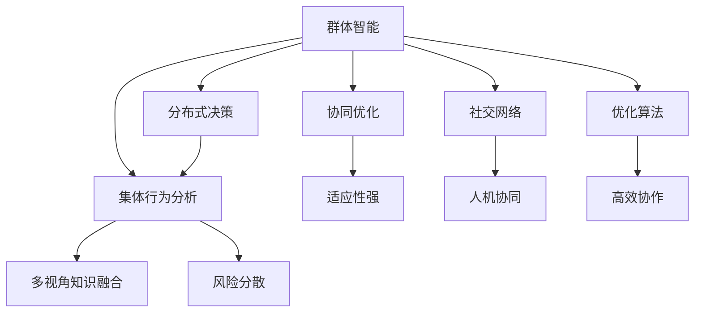

                 

# 群体智能：通向更智慧决策之路

> 关键词：群体智能, 分布式决策, 集体行为分析, 协同优化, 社交网络, 优化算法, 应用场景

## 1. 背景介绍

### 1.1 问题由来
随着人工智能（AI）技术的迅猛发展，决策问题在各个领域变得越来越复杂。过去，决策通常由单一主体进行，但在如今这个信息爆炸的时代，单个人或机器已经难以应对决策过程中涉及的庞大信息和复杂关系。因此，如何利用AI技术构建更加智慧的决策体系，成为当前的一个重要研究方向。

### 1.2 问题核心关键点
群体智能（Collective Intelligence）是一种将多个智能体（如人、机器）通过分布式协作，共同解决复杂问题的方法。该方法的核心在于如何设计高效的算法，让智能体之间能够进行有效的沟通和协作，从而在保证个体智慧的基础上，汇聚成更强大的集体智慧。

### 1.3 问题研究意义
研究群体智能对于提升决策质量和效率具有重要意义：

1. **多样化知识融合**：群体中的智能体可以提供多样化的视角和知识，帮助发现更多可能的解决方案，提高决策的多样性和全面性。
2. **风险分散**：通过分布式决策，可以有效分散决策风险，降低个体失误带来的影响。
3. **适应性强**：群体智能可以动态调整决策策略，适应外部环境的变化，提升决策的灵活性。
4. **人机协同**：结合人的创造性思维和机器的高效计算能力，实现更优的决策结果。
5. **可持续性**：群体智能系统可以通过自我学习和迭代，持续提升决策能力，具有较高的可持续性。

## 2. 核心概念与联系

### 2.1 核心概念概述

为更好地理解群体智能，本节将介绍几个核心概念：

- **群体智能（Collective Intelligence）**：通过分布式协作，集合多个智能体（如人、机器人、AI）的智慧，共同解决复杂问题。
- **分布式决策（Distributed Decision Making）**：多个智能体在相互沟通和协作的基础上，共同做出决策。
- **集体行为分析（Collective Behavior Analysis）**：分析群体中智能体的行为模式，探索群体智慧的生成机制。
- **协同优化（Collaborative Optimization）**：多个智能体共同优化目标函数，追求全局最优解。
- **社交网络（Social Network）**：智能体之间的连接关系网络，影响信息的传播和决策的达成。
- **优化算法（Optimization Algorithm）**：用于群体智能中，优化智能体之间的协作和决策过程。

这些核心概念之间通过以下Mermaid流程图联系起来：



### 2.2 核心概念原理和架构

群体智能的基本原理是通过多个智能体之间的信息交换和协作，汇聚成为集体的智慧。这种智慧不仅仅是各个智能体智慧的简单加和，而是通过协同优化过程，得到更优的解决方案。

在群体智能架构中，智能体之间通过社交网络进行连接和沟通，社交网络的构建和维护是实现群体智能的关键。智能体之间通过信息的传递和反馈，不断调整自己的决策，最终汇聚成群体的决策。

优化算法是群体智能的核心工具，用于设计智能体之间的协作和决策过程，以达成全局最优解。常用的优化算法包括粒子群优化（Particle Swarm Optimization, PSO）、蚁群优化（Ant Colony Optimization, ACO）、遗传算法（Genetic Algorithm, GA）等。

## 3. 核心算法原理 & 具体操作步骤

### 3.1 算法原理概述

群体智能的算法通常分为两个阶段：

1. **信息交换阶段**：智能体之间通过社交网络交换信息，传递知识和经验。
2. **决策优化阶段**：智能体根据接收到的信息，优化自己的决策策略，以达成集体智慧。

群体智能的算法设计旨在最大化群体智慧的生成，通常通过以下几个步骤实现：

1. **初始化**：设置初始智能体状态，包括位置、速度、决策策略等。
2. **信息交换**：智能体之间通过社交网络进行信息的传递和反馈。
3. **决策优化**：智能体根据接收到的信息，调整自己的决策策略。
4. **迭代**：重复上述步骤，直到群体达到稳定状态或满足预设条件。

### 3.2 算法步骤详解

以下以粒子群优化（PSO）算法为例，详细讲解群体智能算法的具体步骤：

**Step 1: 初始化智能体**

每个智能体初始化为一个随机位置和速度，位置表示决策变量，速度表示调整策略。

**Step 2: 信息交换**

智能体之间通过社交网络进行信息交换。每个智能体将自身位置和速度传递给邻居，接收来自邻居的信息。

**Step 3: 决策优化**

每个智能体根据接收到的信息，更新自己的位置和速度。常用的更新公式为：

$$
v_i^{t+1} = \omega v_i^t + c_1 \eta r_1 (p_i^t - x_i^t) + c_2 \eta r_2 (g_i^t - x_i^t)
$$

其中，$v_i^{t+1}$表示智能体$i$在$t+1$时刻的速度，$x_i^{t+1}$表示智能体$i$在$t+1$时刻的位置，$\omega$表示惯性权重，$c_1$和$c_2$为加速度系数，$r_1$和$r_2$为随机数生成器，$p_i^t$表示个体极值，$g_i^t$表示全局极值。

**Step 4: 迭代**

重复执行Step 2和Step 3，直到达到预设的迭代次数或群体达到稳定状态。

### 3.3 算法优缺点

群体智能算法的优点包括：

1. **灵活性高**：群体智能算法可以根据具体问题设计不同的优化策略和社交网络结构，适应性较强。
2. **多视角融合**：群体智能算法能够整合多个智能体的知识，提供多样化的视角和解决方案。
3. **鲁棒性强**：通过多个智能体的协作，群体智能算法具有一定的容错性和鲁棒性。
4. **分布式计算**：群体智能算法可以利用分布式计算的优势，加速计算过程。

缺点包括：

1. **通信开销大**：智能体之间的信息交换需要大量的通信资源，特别是在社交网络规模较大时。
2. **算法复杂度高**：设计高效的群体智能算法需要考虑多种因素，算法设计较为复杂。
3. **收敛速度慢**：在某些情况下，群体智能算法可能需要较长的迭代次数才能达到最优解。

### 3.4 算法应用领域

群体智能算法在多个领域都有广泛应用，包括：

1. **物流配送**：通过优化货物分配和运输路线，提高物流效率。
2. **金融投资**：利用群体智能算法进行市场预测和风险管理。
3. **工业制造**：通过优化生产线和资源配置，提高生产效率。
4. **医疗健康**：在多学科协作中，通过知识共享和协同决策，提升医疗水平。
5. **社交网络**：通过分析用户行为和社交关系，改进推荐系统和内容分发。
6. **智能交通**：通过优化交通信号和车辆调度，缓解交通拥堵。

## 4. 数学模型和公式 & 详细讲解 & 举例说明

### 4.1 数学模型构建

群体智能的数学模型通常包括智能体状态、社交网络结构、决策函数等组成部分。假设群体中有$n$个智能体，每个智能体$i$的状态为$x_i$，智能体之间的社交网络表示为$A$，决策函数为$F$。群体智能的目标是最大化决策函数$F(x_1, x_2, ..., x_n)$。

### 4.2 公式推导过程

以下以PSO算法为例，推导群体智能算法的数学模型和决策过程：

1. **智能体状态**

智能体$i$的位置表示为$x_i \in \mathbb{R}^d$，速度表示为$v_i \in \mathbb{R}^d$。

2. **社交网络**

社交网络$A$可以通过邻接矩阵$A_{ij}$来表示，$A_{ij} = 1$表示智能体$i$和智能体$j$之间存在连接，否则为0。

3. **决策函数**

群体智能的决策函数$F$可以根据具体问题设计。假设决策目标为最大化群体收益，则决策函数为：

$$
F(x_1, x_2, ..., x_n) = \sum_{i=1}^n r_i(x_i)
$$

其中$r_i(x_i)$表示智能体$i$的收益函数。

4. **PSO算法**

PSO算法的基本更新公式为：

$$
v_i^{t+1} = \omega v_i^t + c_1 \eta r_1 (p_i^t - x_i^t) + c_2 \eta r_2 (g_i^t - x_i^t)
$$

其中$\omega$表示惯性权重，$c_1$和$c_2$为加速度系数，$r_1$和$r_2$为随机数生成器，$p_i^t$表示个体极值，$g_i^t$表示全局极值。

### 4.3 案例分析与讲解

以下以物流配送问题为例，详细讲解群体智能算法的应用：

假设有一个配送中心需要向多个客户配送货物，每个客户的位置和需求已知。目标是最小化配送总成本，包括运输成本和分配成本。

1. **智能体状态**

智能体表示为配送中心的配送车，每个智能体的状态为位置和速度，即$x_i = (p_i, v_i)$，其中$p_i$表示配送车的位置，$v_i$表示配送车的速度。

2. **社交网络**

配送中心与客户之间通过社交网络连接，社交网络中的连接关系表示为$A$，每个客户的位置已知。

3. **决策函数**

决策目标为最小化配送总成本，包括运输成本和分配成本。运输成本与距离成正比，分配成本与分配的货车数量成正比。

4. **PSO算法**

配送中心中的配送车通过PSO算法优化配送路径和货车分配，算法流程如下：

1. 初始化配送车的速度和位置。
2. 智能体之间通过社交网络交换信息，传递客户的位置和需求。
3. 配送车根据接收到的信息，调整速度和位置，优化配送路径和货车分配。
4. 重复执行步骤2和步骤3，直到达到最优解。

## 5. 项目实践：代码实例和详细解释说明

### 5.1 开发环境搭建

在进行群体智能算法实践前，我们需要准备好开发环境。以下是使用Python进行群体智能算法的开发环境配置流程：

1. 安装Anaconda：从官网下载并安装Anaconda，用于创建独立的Python环境。

2. 创建并激活虚拟环境：
```bash
conda create -n swarm_env python=3.8 
conda activate swarm_env
```

3. 安装必要的库：
```bash
pip install numpy scipy matplotlib networkx
```

4. 安装群体智能算法库：
```bash
pip install pyswarms
```

完成上述步骤后，即可在`swarm_env`环境中开始群体智能算法的实践。

### 5.2 源代码详细实现

以下以PSO算法为例，给出使用pyswarms库进行群体智能算法开发的PyTorch代码实现。

```python
import numpy as np
import pyswarms as ps
from networkx import nx
import matplotlib.pyplot as plt

# 定义社交网络
G = nx.random_geometric_graph(20, 0.1)
# 定义决策函数
def cost_function(x):
    return np.sum([(x[i] - x[i-1])**2 for i in range(1, len(x))])

# 定义群体智能算法
options = {'c1': 0.5, 'c2': 0.3, 'w': 0.7}
optimizer = ps.single.GlobalBestPSO(n_particles=20, dimensions=2, options=options)
result = optimizer.optimize(cost_function, bounds=[(0, 1), (0, 1)])
```

在这个代码实现中，我们使用了pyswarms库来实现PSO算法，具体步骤包括：

1. 定义社交网络：使用networkx库生成一个随机几何图，表示智能体之间的连接关系。
2. 定义决策函数：通过计算智能体之间的距离平方和，表示配送总成本。
3. 定义群体智能算法：设置PSO算法的参数，包括惯性权重、加速系数、随机数生成器等。
4. 运行PSO算法：通过调用optimizer.optimize方法，运行PSO算法，求解最优解。

### 5.3 代码解读与分析

让我们再详细解读一下关键代码的实现细节：

**pyswarms库**：
- `ps.single.GlobalBestPSO`：表示全局最优粒子群优化算法。
- `n_particles`：智能体数量。
- `dimensions`：每个智能体的维度，即决策变量的个数。
- `options`：算法参数，包括惯性权重、加速系数、随机数生成器等。

**cost_function函数**：
- `(x[i] - x[i-1])**2`：计算智能体$i$与智能体$i-1$之间的距离平方，表示运输成本。

**运行PSO算法**：
- `optimizer.optimize`：调用优化器方法，运行PSO算法。
- `cost_function`：目标函数，用于评估智能体的决策。

可以看到，pyswarms库使得群体智能算法的实现变得简洁高效，开发者可以将更多精力放在算法设计和参数调优上，而不必过多关注底层的实现细节。

## 6. 实际应用场景

### 6.1 物流配送

物流配送是群体智能算法的一个重要应用场景。配送中心需要根据多个客户的需求和位置，合理分配货车和优化配送路径，以最小化配送总成本。通过群体智能算法，可以实现以下效果：

1. **货物分配优化**：通过智能体的协作，合理分配货车和货物，避免资源浪费。
2. **配送路径优化**：通过智能体的协作，找到最优的配送路径，缩短配送时间，减少运输成本。
3. **异常情况应对**：通过智能体的协作，实时应对配送过程中的异常情况，如交通堵塞、货车故障等。

### 6.2 金融投资

金融投资也是群体智能算法的重要应用场景。投资机构需要根据多个分析师的研究报告和市场数据，综合判断市场趋势，做出最优的投资决策。通过群体智能算法，可以实现以下效果：

1. **市场预测优化**：通过智能体的协作，综合多种预测模型，提高市场预测的准确性。
2. **风险管理优化**：通过智能体的协作，综合多种风险评估模型，降低投资风险。
3. **交易策略优化**：通过智能体的协作，综合多种交易策略，提高交易收益。

### 6.3 智能交通

智能交通也是群体智能算法的重要应用场景。交通管理部门需要根据实时交通数据，优化交通信号和车辆调度，缓解交通拥堵。通过群体智能算法，可以实现以下效果：

1. **交通信号优化**：通过智能体的协作，优化交通信号灯的配时，减少车辆等待时间，提高交通效率。
2. **车辆调度优化**：通过智能体的协作，优化车辆调度策略，减少交通拥堵。
3. **异常情况应对**：通过智能体的协作，实时应对交通异常情况，如交通事故、道路施工等。

### 6.4 未来应用展望

随着群体智能算法的不断发展，其在更多领域的应用前景将更加广阔：

1. **智慧城市**：通过智能体的协作，优化城市资源配置，提升城市管理效率。
2. **医疗健康**：通过智能体的协作，优化医疗资源分配，提高医疗服务水平。
3. **能源管理**：通过智能体的协作，优化能源分配和调度，提高能源利用效率。
4. **环境监测**：通过智能体的协作，优化环境监测和污染治理策略，保护环境。
5. **农业生产**：通过智能体的协作，优化农业生产资源配置，提高农业生产效率。
6. **供应链管理**：通过智能体的协作，优化供应链管理，提高供应链效率。

## 7. 工具和资源推荐

### 7.1 学习资源推荐

为了帮助开发者系统掌握群体智能的理论基础和实践技巧，这里推荐一些优质的学习资源：

1. 《Swarm Intelligence: From Nature to Algorithms》：一本全面介绍群体智能的书籍，涵盖了群体智能的基本原理、算法设计、应用场景等。
2. 《Distributed Decision Making with Particle Swarm Optimization》：一本关于PSO算法的书籍，详细介绍了PSO算法的设计和应用。
3. CS221《Machine Learning》课程：斯坦福大学开设的机器学习课程，有Lecture视频和配套作业，带你入门群体智能的基本概念和经典算法。
4. Coursera《Swarm Intelligence》课程：由加州大学欧文分校开设的群体智能课程，介绍了多种群体智能算法和应用。
5. Google Scholar：搜索学术论文，获取最新的群体智能研究成果。

通过对这些资源的学习实践，相信你一定能够快速掌握群体智能的精髓，并用于解决实际的决策问题。

### 7.2 开发工具推荐

高效的开发离不开优秀的工具支持。以下是几款用于群体智能算法开发的常用工具：

1. PyTorch：基于Python的开源深度学习框架，灵活动态的计算图，适合快速迭代研究。
2. TensorFlow：由Google主导开发的开源深度学习框架，生产部署方便，适合大规模工程应用。
3. pyswarms：一个Python库，用于实现多种群体智能算法，包括PSO算法。
4. Matplotlib：一个Python绘图库，用于绘制群体智能算法的仿真结果。
5. PyTorch Lightning：一个深度学习框架，用于快速原型设计和部署群体智能算法。

合理利用这些工具，可以显著提升群体智能算法的开发效率，加快创新迭代的步伐。

### 7.3 相关论文推荐

群体智能领域的研究始于群体动力学和动物行为学，近年来随着计算机科学的发展，逐渐成为AI领域的一个重要研究方向。以下是几篇奠基性的相关论文，推荐阅读：

1. J. Kennedy and R. Eberhart. Swarm Intelligence. 2001.
2. Eberhart, R. S., and Kennedy, J. (1995). A new optimizer using particle swarm theory. In Proceedings of the Congress on Evolutionary Computation, 1942-1948.
3. Dejan G. Kersten and Wolfgang Elser. Swarm Intelligence – An Introduction. 2010.
4. Marco Burini, Bruno Siciliano. Swarm Intelligence Techniques and Their Applications. 2016.
5. Yuichi Inoue, Andrew M. Arbib. Swarm Intelligence Algorithms: Principles and Applications in Telecommunications Engineering. 2010.

这些论文代表了大规模群体智能算法的发展脉络。通过学习这些前沿成果，可以帮助研究者把握学科前进方向，激发更多的创新灵感。

## 8. 总结：未来发展趋势与挑战

### 8.1 总结

本文对群体智能进行了全面系统的介绍。首先阐述了群体智能的研究背景和意义，明确了群体智能在提升决策质量和效率方面的独特价值。其次，从原理到实践，详细讲解了群体智能的数学模型和算法步骤，给出了群体智能算法开发的完整代码实例。同时，本文还广泛探讨了群体智能算法在多个领域的应用前景，展示了群体智能范式的巨大潜力。

通过本文的系统梳理，可以看到，群体智能算法正在成为AI领域的一个重要范式，极大地提升了决策系统的灵活性和适应性。未来，伴随群体智能算法和工具的持续演进，相信AI系统将在更多复杂决策场景中发挥更大的作用，为各行各业带来颠覆性变革。

### 8.2 未来发展趋势

展望未来，群体智能技术将呈现以下几个发展趋势：

1. **分布式计算能力提升**：随着计算资源的增长，分布式计算能力将得到进一步提升，群体智能算法的效率和可扩展性将得到大幅提升。
2. **多模态融合**：结合视觉、听觉、传感器等多种模态数据，群体智能算法将能更好地理解和融合多源信息，提升决策质量。
3. **深度学习融合**：将深度学习算法与群体智能算法结合，提升智能体的学习能力和决策能力。
4. **自适应算法设计**：设计自适应算法，根据具体问题和数据特征，自动调整算法参数和结构，提升算法的灵活性和鲁棒性。
5. **伦理和安全考虑**：在群体智能算法中引入伦理和安全约束，确保算法的公正性和安全性。
6. **人机协作**：设计更加人性化、智能化的群体智能系统，增强人机协同，提升决策效率和效果。

以上趋势凸显了群体智能技术的广阔前景。这些方向的探索发展，必将进一步提升群体智能系统的性能和应用范围，为人类决策提供更强大、更可靠的工具。

### 8.3 面临的挑战

尽管群体智能技术已经取得了瞩目成就，但在迈向更加智能化、普适化应用的过程中，它仍面临着诸多挑战：

1. **通信开销大**：群体智能算法中智能体之间的信息交换需要大量的通信资源，特别是在大规模社交网络中。
2. **算法复杂度高**：设计高效的群体智能算法需要考虑多种因素，算法设计较为复杂。
3. **收敛速度慢**：在某些情况下，群体智能算法可能需要较长的迭代次数才能达到最优解。
4. **伦理和安全问题**：群体智能算法可能存在算法偏见和数据隐私等问题，需要引入伦理和安全约束。
5. **多源信息融合难度大**：不同模态的数据具有不同的特征，如何有效融合多源信息是一个重要的研究方向。

### 8.4 研究展望

面对群体智能所面临的挑战，未来的研究需要在以下几个方面寻求新的突破：

1. **优化通信机制**：设计高效的通信机制，减少智能体之间的信息交换开销。
2. **简化算法设计**：设计更简单、高效的群体智能算法，降低算法复杂度。
3. **加速收敛速度**：引入启发式搜索和自适应算法，加速算法的收敛速度。
4. **解决伦理问题**：引入伦理和安全约束，确保群体智能算法的公正性和安全性。
5. **改进多源信息融合**：设计更有效的多源信息融合算法，提升融合效果。

这些研究方向的探索，必将引领群体智能技术迈向更高的台阶，为构建智能、公正、安全的决策系统提供有力支持。面向未来，群体智能技术还需要与其他AI技术进行更深入的融合，如知识表示、因果推理、强化学习等，多路径协同发力，共同推动群体智能技术的发展。

## 9. 附录：常见问题与解答

**Q1：群体智能是否适用于所有决策问题？**

A: 群体智能适用于大部分需要多方协作、综合多种视角的决策问题。对于一些需要高度精准、快速响应的决策问题，如实时交易决策，群体智能可能不是最优选择。

**Q2：群体智能算法的通信开销是否可以降低？**

A: 群体智能算法的通信开销可以通过优化通信机制来降低。例如，采用分布式计算架构，减少智能体之间的数据传输量；设计高效的数据结构，减少通信数据量。

**Q3：群体智能算法的收敛速度是否可以加速？**

A: 群体智能算法的收敛速度可以通过引入启发式搜索和自适应算法来加速。例如，引入局部搜索策略，加速初始阶段的收敛；自适应调整智能体的速度和位置，优化后期收敛速度。

**Q4：群体智能算法的伦理和安全问题如何解决？**

A: 群体智能算法的伦理和安全问题可以通过设计公平性约束、数据隐私保护机制来解决。例如，在算法设计中引入公平性指标，确保算法决策的公正性；采用差分隐私技术，保护用户数据隐私。

**Q5：群体智能算法的应用场景是否可以扩展？**

A: 群体智能算法在各个领域都有广泛应用，如物流配送、金融投资、智能交通、医疗健康等。随着算法的不断优化和工具的不断完善，群体智能算法的应用场景将不断扩展，提升更多领域的决策效率和效果。

---

作者：禅与计算机程序设计艺术 / Zen and the Art of Computer Programming

