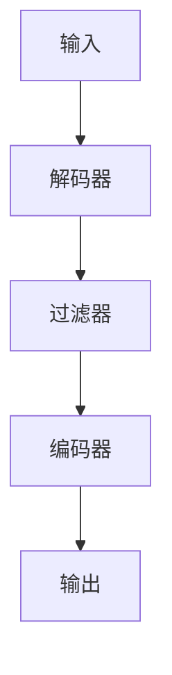
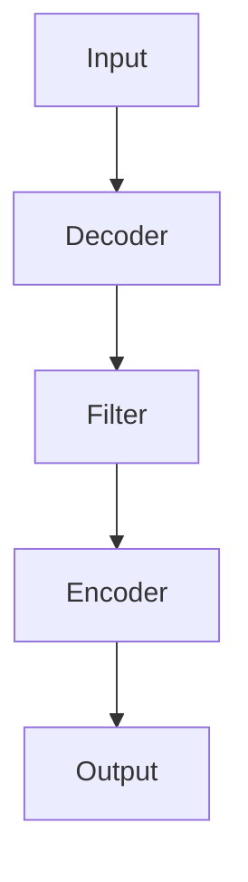

                 

# FFmpeg音视频处理：多媒体应用开发指南

> 关键词：FFmpeg、音视频处理、多媒体应用、开发指南、编解码、流媒体、实时处理、格式转换

> 摘要：本文深入探讨了FFmpeg在音视频处理领域的应用，详细介绍了其核心概念、算法原理、数学模型以及实际操作步骤。通过一系列代码实例和详细解释，读者将了解到如何使用FFmpeg进行音视频处理，从而为多媒体应用开发提供实用指南。

## 1. 背景介绍（Background Introduction）

### 1.1 FFmpeg的起源与发展

FFmpeg是一个开源的音频和视频处理软件，它起源于法国，经过多年的发展，已成为音频视频处理领域的旗舰工具。FFmpeg的核心组件包括编解码器、过滤器、播放器等，可以支持多种音视频格式和流媒体协议。

### 1.2 FFmpeg的应用领域

FFmpeg广泛应用于多媒体应用开发，如视频剪辑、流媒体传输、音视频转换、直播推流等。它能够高效地处理音视频数据，满足各种应用场景的需求。

### 1.3 FFmpeg的优势

- 高效：FFmpeg采用多线程和并行计算技术，能够充分利用现代多核处理器的性能。
- 开放性：FFmpeg是开源软件，支持多种操作系统，便于开发者进行集成和二次开发。
- 兼容性：FFmpeg支持多种音视频格式和流媒体协议，能够处理各种类型的数据。

## 2. 核心概念与联系（Core Concepts and Connections）

### 2.1 音视频编解码原理

音视频编解码是FFmpeg的核心技术之一。编解码器将原始音视频数据转换成压缩格式，以便在传输和存储过程中节省空间。解码器则将压缩的音视频数据还原成原始格式。

### 2.2 流媒体传输协议

流媒体传输协议如RTMP、HLS、DASH等，是音视频数据处理的重要环节。它们确保音视频数据能够稳定、高效地传输到客户端。

### 2.3 FFmpeg架构

FFmpeg由多个模块组成，包括编解码器、过滤器、播放器等。这些模块协同工作，完成音视频数据的处理和传输。

## 3. 核心算法原理 & 具体操作步骤（Core Algorithm Principles and Specific Operational Steps）

### 3.1 音视频解码流程

1. 读取输入文件或流。
2. 使用解码器将音视频数据解码成原始格式。
3. 使用过滤器对音视频数据进行处理，如缩放、滤镜等。
4. 使用编码器将处理后的音视频数据编码成压缩格式。
5. 输出结果到文件或流。

### 3.2 音视频编码流程

1. 读取输入文件或流。
2. 使用编码器将音视频数据编码成压缩格式。
3. 使用过滤器对音视频数据进行处理。
4. 输出结果到文件或流。

### 3.3 实时处理流程

1. 设置实时处理参数，如帧率、分辨率等。
2. 读取输入文件或流。
3. 使用解码器解码音视频数据。
4. 使用过滤器处理音视频数据。
5. 使用编码器编码音视频数据。
6. 输出结果到文件或流。

## 4. 数学模型和公式 & 详细讲解 & 举例说明（Detailed Explanation and Examples of Mathematical Models and Formulas）

### 4.1 音视频压缩算法

FFmpeg使用的音视频压缩算法包括H.264、H.265、HE-AAC等。这些算法基于数学模型和公式，对音视频数据进行压缩。

#### 4.1.1 H.264压缩算法

- 变换公式：使用离散余弦变换（DCT）对图像数据进行变换。
- 去除冗余信息：通过预测和变换，去除图像数据中的冗余信息。

#### 4.1.2 H.265压缩算法

- 变换公式：使用整数变换（INT Transform）和逆变换（INT Inverse Transform）。
- 去除冗余信息：采用多级预测和变换，提高压缩效率。

#### 4.1.3 HE-AAC压缩算法

- 变换公式：使用快速傅里叶变换（FFT）对音频数据进行变换。
- 去除冗余信息：通过子带压缩和频谱掩蔽，提高音频压缩效果。

## 5. 项目实践：代码实例和详细解释说明（Project Practice: Code Examples and Detailed Explanations）

### 5.1 开发环境搭建

1. 安装FFmpeg：在官网下载最新版本，并按照说明进行安装。
2. 配置开发环境：安装CMake和编译器，设置FFmpeg环境变量。

### 5.2 源代码详细实现

1. 创建项目：使用CMake创建项目，并编写源代码。
2. 编译项目：使用CMake编译源代码，生成可执行文件。

### 5.3 代码解读与分析

1. 音视频解码：读取输入文件，使用解码器解码音视频数据。
2. 音视频处理：使用过滤器对音视频数据进行处理。
3. 音视频编码：使用编码器编码音视频数据。
4. 输出结果：将处理后的音视频数据输出到文件或流。

### 5.4 运行结果展示

1. 运行可执行文件：执行音视频处理程序。
2. 查看输出结果：查看处理后的音视频文件或流。

## 6. 实际应用场景（Practical Application Scenarios）

### 6.1 视频剪辑

使用FFmpeg对视频进行剪辑、拼接、添加滤镜等操作，实现个性化视频制作。

### 6.2 直播推流

使用FFmpeg进行直播推流，实现实时音视频传输。

### 6.3 音视频格式转换

使用FFmpeg进行音视频格式转换，满足不同设备和平台的需求。

## 7. 工具和资源推荐（Tools and Resources Recommendations）

### 7.1 学习资源推荐

- 书籍：《FFmpeg从入门到精通》、《音视频处理技术详解》
- 论文：搜索相关领域的学术论文，了解最新技术动态。
- 博客：关注知名技术博客，学习实战经验。
- 网站：访问FFmpeg官网，获取官方文档和技术支持。

### 7.2 开发工具框架推荐

- 开发工具：Visual Studio、Eclipse、CLion等。
- 框架：使用CMake、Makefile等构建工具，提高开发效率。

### 7.3 相关论文著作推荐

- 论文：《高效音视频处理技术》、《基于FFmpeg的实时视频处理》
- 著作：《音视频处理原理与实现》、《多媒体技术教程》

## 8. 总结：未来发展趋势与挑战（Summary: Future Development Trends and Challenges）

### 8.1 发展趋势

- 音视频处理技术的不断进步，提高处理效率和质量。
- 云计算和大数据技术的应用，实现音视频处理服务的规模化。
- 边缘计算的发展，提高音视频处理在设备端的性能。

### 8.2 挑战

- 音视频处理算法的优化和升级，提高压缩效率和性能。
- 音视频处理技术的标准化和规范化，确保兼容性和互操作性。
- 音视频处理领域的隐私保护和版权问题，需要法律法规的规范和监管。

## 9. 附录：常见问题与解答（Appendix: Frequently Asked Questions and Answers）

### 9.1 FFmpeg如何安装？

答：请参考FFmpeg官方文档，根据操作系统选择合适的安装方式。

### 9.2 FFmpeg如何进行音视频格式转换？

答：使用FFmpeg的格式转换命令，如`ffmpeg -i input.mp4 output.avi`。

### 9.3 FFmpeg如何实现实时处理？

答：使用FFmpeg的实时处理参数，如`-framerate 30`，实现音视频数据的实时处理。

## 10. 扩展阅读 & 参考资料（Extended Reading & Reference Materials）

- [FFmpeg官方文档](https://ffmpeg.org/documentation.html)
- [音视频处理技术详解](https://www.cnblogs.com/ava-li/p/11947325.html)
- [基于FFmpeg的实时视频处理](https://www.cnblogs.com/sunny-orz/p/13096886.html)
- [FFmpeg从入门到精通](https://www.jianshu.com/p/bc8a094b3e79)
- [音视频处理原理与实现](https://www.bilibili.com/video/BV1xh411k7hJ)
- [多媒体技术教程](https://www.bilibili.com/video/BV1Cz4y1c7yF)

---

# FFmpeg Audio and Video Processing: A Guide for Multimedia Application Development

> Keywords: FFmpeg, audio and video processing, multimedia applications, development guide, encoding and decoding, streaming media, real-time processing, format conversion

> Abstract: This article delves into the application of FFmpeg in the field of audio and video processing, providing a detailed introduction to its core concepts, algorithm principles, mathematical models, and specific operational steps. Through a series of code examples and detailed explanations, readers will learn how to use FFmpeg for audio and video processing, providing a practical guide for multimedia application development.

## 1. Background Introduction

### 1.1 The Origin and Development of FFmpeg

FFmpeg is an open-source audio and video processing software that originated in France. After many years of development, it has become a flagship tool in the field of audio and video processing. The core components of FFmpeg include encoders, decoders, filters, and players, which support various audio and video formats and streaming media protocols.

### 1.2 Application Fields of FFmpeg

FFmpeg is widely used in multimedia application development, such as video editing, streaming media transmission, audio and video conversion, and live streaming. It can efficiently process audio and video data to meet various application requirements.

### 1.3 Advantages of FFmpeg

- Efficiency: FFmpeg uses multi-threading and parallel computing technologies to fully utilize the performance of modern multi-core processors.
- Openness: FFmpeg is an open-source software that supports various operating systems, making it easy for developers to integrate and develop it further.
- Compatibility: FFmpeg supports various audio and video formats and streaming media protocols, enabling it to process various types of data.

## 2. Core Concepts and Connections

### 2.1 Principles of Audio and Video Encoding and Decoding

Audio and video encoding and decoding are core technologies of FFmpeg. Encoders convert raw audio and video data into compressed formats for space-saving during transmission and storage. Decoders, on the other hand, decode compressed audio and video data back to their original formats.

### 2.2 Streaming Media Transmission Protocols

Streaming media transmission protocols, such as RTMP, HLS, and DASH, are crucial in the processing of audio and video data. They ensure that audio and video data can be transmitted stably and efficiently to clients.

### 2.3 Architecture of FFmpeg

FFmpeg consists of multiple modules, including encoders, decoders, filters, and players. These modules work together to process and transmit audio and video data.

## 3. Core Algorithm Principles and Specific Operational Steps

### 3.1 Audio and Video Decoding Process

1. Read the input file or stream.
2. Use the decoder to decode the audio and video data into their original formats.
3. Use filters to process the audio and video data, such as scaling and filters.
4. Use the encoder to encode the processed audio and video data into compressed formats.
5. Output the results to a file or stream.

### 3.2 Audio and Video Encoding Process

1. Read the input file or stream.
2. Use the encoder to encode the audio and video data into compressed formats.
3. Use filters to process the audio and video data.
4. Output the results to a file or stream.

### 3.3 Real-time Processing Process

1. Set the real-time processing parameters, such as frame rate and resolution.
2. Read the input file or stream.
3. Use the decoder to decode the audio and video data.
4. Use filters to process the audio and video data.
5. Use the encoder to encode the audio and video data.
6. Output the results to a file or stream.

## 4. Mathematical Models and Formulas & Detailed Explanation and Examples

### 4.1 Audio and Video Compression Algorithms

The audio and video compression algorithms used by FFmpeg include H.264, H.265, HE-AAC, etc. These algorithms are based on mathematical models and formulas, which compress audio and video data.

#### 4.1.1 H.264 Compression Algorithm

- Transformation Formula: Uses Discrete Cosine Transform (DCT) to transform image data.
- Removing Redundant Information: Through prediction and transformation, it removes redundant information from image data.

#### 4.1.2 H.265 Compression Algorithm

- Transformation Formula: Uses Integer Transform (INT Transform) and Inverse Transform (INT Inverse Transform).
- Removing Redundant Information: Through multi-level prediction and transformation, it improves compression efficiency.

#### 4.1.3 HE-AAC Compression Algorithm

- Transformation Formula: Uses Fast Fourier Transform (FFT) to transform audio data.
- Removing Redundant Information: Through sub-band compression and spectral masking, it improves audio compression effectiveness.

## 5. Project Practice: Code Examples and Detailed Explanations

### 5.1 Setting Up the Development Environment

1. Install FFmpeg: Download the latest version from the official website and install it according to the instructions.
2. Configure the development environment: Install CMake and compilers, and set the FFmpeg environment variables.

### 5.2 Detailed Implementation of the Source Code

1. Create the project: Use CMake to create the project and write the source code.
2. Compile the project: Use CMake to compile the source code and generate the executable file.

### 5.3 Code Interpretation and Analysis

1. Audio and Video Decoding: Read the input file, and use the decoder to decode the audio and video data.
2. Audio and Video Processing: Use filters to process the audio and video data.
3. Audio and Video Encoding: Use the encoder to encode the processed audio and video data.
4. Output the Results: Output the processed audio and video data to a file or stream.

### 5.4 Displaying the Running Results

1. Run the executable file: Execute the audio and video processing program.
2. View the output results: View the processed audio and video file or stream.

## 6. Practical Application Scenarios

### 6.1 Video Editing

Use FFmpeg to edit videos, such as cutting, splicing, and adding filters, to achieve personalized video production.

### 6.2 Live Streaming Pushing

Use FFmpeg for live streaming pushing to achieve real-time audio and video transmission.

### 6.3 Audio and Video Format Conversion

Use FFmpeg to convert audio and video formats to meet the needs of different devices and platforms.

## 7. Tools and Resources Recommendations

### 7.1 Recommended Learning Resources

- Books: "FFmpeg from Beginner to Expert", "In-depth Explanation of Audio and Video Processing Technology"
- Papers: Search for relevant academic papers to understand the latest technological trends.
- Blogs: Follow well-known technical blogs to learn practical experience.
- Websites: Visit the FFmpeg official website to access official documentation and technical support.

### 7.2 Recommended Development Tools and Frameworks

- Development Tools: Visual Studio, Eclipse, CLion, etc.
- Frameworks: Use CMake, Makefile, etc. to improve development efficiency.

### 7.3 Recommended Papers and Books

- Papers: "High-efficiency Audio and Video Processing Technology", "Real-time Video Processing Based on FFmpeg"
- Books: "Audio and Video Processing Principles and Implementation", "Multimedia Technology Tutorial"

## 8. Summary: Future Development Trends and Challenges

### 8.1 Development Trends

- The continuous advancement of audio and video processing technology to improve processing efficiency and quality.
- The application of cloud computing and big data technology to achieve scaled audio and video processing services.
- The development of edge computing to improve the performance of audio and video processing on devices.

### 8.2 Challenges

- The optimization and upgrading of audio and video processing algorithms to improve compression efficiency and performance.
- The standardization and normalization of audio and video processing technology to ensure compatibility and interoperability.
- Privacy protection and copyright issues in the field of audio and video processing, which require regulatory and supervisory norms of laws and regulations.

## 9. Appendix: Frequently Asked Questions and Answers

### 9.1 How to install FFmpeg?

Answer: Please refer to the FFmpeg official documentation for installation instructions based on your operating system.

### 9.2 How to perform audio and video format conversion using FFmpeg?

Answer: Use the format conversion command of FFmpeg, such as `ffmpeg -i input.mp4 output.avi`.

### 9.3 How to achieve real-time processing with FFmpeg?

Answer: Use the real-time processing parameters of FFmpeg, such as `-framerate 30` to achieve real-time processing of audio and video data.

## 10. Extended Reading & Reference Materials

- [FFmpeg Official Documentation](https://ffmpeg.org/documentation.html)
- [In-depth Explanation of Audio and Video Processing Technology](https://www.cnblogs.com/ava-li/p/11947325.html)
- [Real-time Video Processing Based on FFmpeg](https://www.cnblogs.com/sunny-orz/p/13096886.html)
- [FFmpeg from Beginner to Expert](https://www.jianshu.com/p/bc8a094b3e79)
- [Audio and Video Processing Principles and Implementation](https://www.bilibili.com/video/BV1xh411k7hJ)
- [Multimedia Technology Tutorial](https://www.bilibili.com/video/BV1Cz4y1c7yF)

