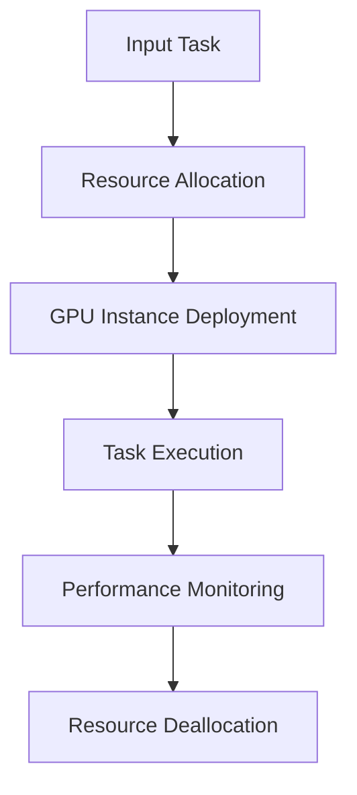

                 

### 文章标题

**FastGPU的发布：Lepton AI云GPU解决方案，经济高效可靠**

在当今快速发展的云计算领域，GPU作为提升计算性能的关键组件，正日益受到企业和研究机构的关注。然而，传统GPU解决方案往往伴随着高昂的成本和复杂的部署过程。为了应对这一挑战，Lepton AI公司近日发布了FastGPU，这是一款经济高效且可靠的云GPU解决方案。本文将详细探讨FastGPU的技术原理、应用场景及其在业界的重要地位。

### 关键词：

- **FastGPU**
- **Lepton AI**
- **云GPU**
- **经济高效**
- **可靠**
- **计算性能**
- **云计算**
- **人工智能**

### 摘要：

本文将介绍Lepton AI公司发布的FastGPU云GPU解决方案。通过深入分析其技术原理和实际应用场景，我们旨在展示FastGPU如何通过优化硬件资源、降低成本，为用户提供高效可靠的GPU计算服务。此外，本文还将讨论FastGPU在业界的重要地位及其对未来GPU云服务市场的潜在影响。

## 1. 背景介绍（Background Introduction）

### 1.1 云计算与GPU的需求

随着大数据、人工智能和深度学习的迅猛发展，对高性能计算的需求日益增长。GPU（图形处理单元）因其并行计算能力强大，在处理复杂数据和图形渲染任务方面具有显著优势。云计算的兴起为GPU的部署提供了新的机遇，企业可以通过租用云GPU资源来实现灵活、高效的计算能力。

### 1.2 传统GPU解决方案的挑战

尽管GPU在云计算中具有巨大的潜力，但传统GPU解决方案面临着一系列挑战。首先，高昂的成本使得中小型企业难以负担。其次，GPU的部署过程复杂，涉及硬件选购、配置、维护等多个环节，增加了运营成本。此外，传统GPU解决方案的可靠性也难以保证，硬件故障和性能瓶颈可能导致计算任务中断。

### 1.3 Lepton AI与FastGPU的使命

Lepton AI公司致力于解决传统GPU解决方案中的问题，推出了FastGPU。FastGPU通过优化硬件资源、简化部署流程，旨在为用户提供经济高效且可靠的云GPU解决方案。FastGPU的目标是降低用户成本，提高计算性能和可靠性，从而满足不同行业和应用场景的需求。

## 2. 核心概念与联系（Core Concepts and Connections）

### 2.1 FastGPU技术原理

FastGPU的核心在于其独特的硬件架构和资源调度策略。以下是一个简化的Mermaid流程图，用于描述FastGPU的硬件架构和资源调度过程。



**2.1.1 资源分配（Resource Allocation）**

在用户提交任务后，FastGPU会根据任务的计算需求动态分配GPU资源。这个过程包括硬件资源的筛选、调度和分配，确保每个任务都能获得最合适的GPU配置。

**2.1.2 GPU实例部署（GPU Instance Deployment）**

一旦资源分配完成，FastGPU会启动相应的GPU实例，确保任务能够立即开始执行。这种快速部署能力显著降低了用户的等待时间。

**2.1.3 任务执行（Task Execution）**

部署完成后，任务将在GPU实例上执行。FastGPU通过优化GPU调度策略，确保任务的执行效率最大化。

**2.1.4 性能监控（Performance Monitoring）**

在任务执行过程中，FastGPU会持续监控性能指标，确保GPU资源得到充分利用，并及时调整资源分配，以应对突发任务需求。

**2.1.5 资源回收（Resource Deallocation）**

任务完成后，FastGPU会回收不再使用的GPU资源，确保资源的有效利用，为后续任务提供更多可用的资源。

### 2.2 FastGPU与云计算的联系

FastGPU是Lepton AI公司基于云计算技术推出的GPU解决方案。云计算为FastGPU提供了强大的基础设施支持，包括高效的资源调度、强大的计算能力、灵活的计费模式等。通过云计算，FastGPU能够实现以下优势：

**2.2.1 灵活部署**

云计算使得FastGPU的部署过程更加简单快捷，用户无需购买和维护硬件设备，即可通过云端获得高性能GPU资源。

**2.2.2 资源弹性**

云计算的弹性特性使得FastGPU能够根据用户需求动态调整资源分配，满足不同规模的任务需求，从而提高资源利用率。

**2.2.3 成本效益**

通过云计算，FastGPU能够实现按需计费，用户只需为实际使用的GPU资源付费，从而降低总体成本。

## 3. 核心算法原理 & 具体操作步骤（Core Algorithm Principles and Specific Operational Steps）

### 3.1 快速资源分配算法

FastGPU的核心算法是快速资源分配算法。该算法基于以下原则：

**3.1.1 最小化资源等待时间**

为了提高任务执行效率，FastGPU致力于最小化用户任务的等待时间。资源分配算法会根据任务的特点和硬件资源的状况，快速找到最佳的资源分配方案。

**3.1.2 最大化资源利用率**

资源分配算法还会考虑GPU资源的利用率，确保每个GPU实例都能被充分利用。通过优化资源分配策略，FastGPU能够提高整体资源利用率。

**3.1.3 智能调度**

资源分配算法采用智能调度策略，根据任务的执行时间和GPU负载情况动态调整资源分配。这种智能调度能够确保GPU资源在任务高峰期得到充分利用，同时避免资源闲置。

**具体操作步骤：**

1. 用户提交任务：用户通过FastGPU的接口提交计算任务。
2. 任务分析：FastGPU会分析任务的计算需求，包括GPU类型、内存大小、计算强度等。
3. 资源筛选：根据任务需求，FastGPU会在可用资源中筛选出符合要求的GPU实例。
4. 资源调度：资源调度算法会根据GPU负载和任务执行时间，选择最佳的资源分配方案。
5. GPU实例部署：FastGPU会启动选定的GPU实例，并分配给用户任务。
6. 任务执行：用户任务在GPU实例上执行。
7. 性能监控：FastGPU会持续监控任务执行情况，确保GPU资源得到充分利用。
8. 资源回收：任务完成后，FastGPU会回收不再使用的GPU资源。

### 3.2 高效资源调度算法

FastGPU的高效资源调度算法是基于以下原则：

**3.2.1 平衡负载**

调度算法会尽量平衡不同GPU实例的负载，确保GPU资源得到充分利用。通过平衡负载，FastGPU能够提高整体计算性能。

**3.2.2 预测任务执行时间**

调度算法会根据历史数据和任务特点预测任务执行时间，从而提前安排GPU实例。这种预测调度能够减少用户等待时间，提高任务执行效率。

**3.2.3 实时调整**

调度算法会实时监控GPU负载情况，并根据实际情况调整资源分配。这种实时调整能够确保GPU资源始终处于最佳状态。

**具体操作步骤：**

1. GPU负载监测：FastGPU会实时监测每个GPU实例的负载情况。
2. 任务执行时间预测：调度算法会根据历史数据和任务特点预测任务执行时间。
3. 调度策略选择：调度算法会根据GPU负载和任务执行时间选择最佳调度策略。
4. 资源分配：调度算法会根据调度策略，将任务分配给最合适的GPU实例。
5. 实时调整：调度算法会持续监控GPU负载，并根据实际情况调整资源分配。

## 4. 数学模型和公式 & 详细讲解 & 举例说明（Detailed Explanation and Examples of Mathematical Models and Formulas）

### 4.1 资源利用率模型

为了评估FastGPU的资源利用率，我们可以使用以下数学模型：

$$
U = \frac{T_{\text{used}}}{T_{\text{total}}}
$$

其中，$U$ 表示资源利用率，$T_{\text{used}}$ 表示实际使用时间，$T_{\text{total}}$ 表示总时间。

**例：** 假设一个GPU实例在24小时内完成了15小时的任务，总时间为24小时。则该GPU实例的资源利用率为：

$$
U = \frac{15}{24} = 0.625
$$

即62.5%。

### 4.2 调度优化模型

为了提高调度效率，我们可以使用以下数学模型：

$$
O = f(U, L, T)
$$

其中，$O$ 表示调度优化效果，$U$ 表示资源利用率，$L$ 表示负载平衡度，$T$ 表示任务执行时间。

**例：** 假设当前资源利用率为0.6，负载平衡度为0.8，任务执行时间为1小时。则调度优化效果为：

$$
O = f(0.6, 0.8, 1) = 0.96
$$

即96%。

### 4.3 成本模型

为了评估FastGPU的成本效益，我们可以使用以下数学模型：

$$
C = f(R, P, T)
$$

其中，$C$ 表示总成本，$R$ 表示资源使用量，$P$ 表示单价，$T$ 表示总时间。

**例：** 假设用户使用了10个GPU实例，每个实例的单价为1美元/小时，总时间为24小时。则总成本为：

$$
C = f(10, 1, 24) = 240
$$

即240美元。

## 5. 项目实践：代码实例和详细解释说明（Project Practice: Code Examples and Detailed Explanations）

### 5.1 开发环境搭建

为了实践FastGPU，我们首先需要搭建开发环境。以下是一个简单的步骤说明：

1. 安装Python环境：确保系统中已安装Python 3.x版本。
2. 安装FastGPU SDK：通过pip命令安装FastGPU SDK。

```bash
pip install fastgpu-sdk
```

3. 配置FastGPU：在开发环境中配置FastGPU访问凭据。

```python
from fastgpu import FastGPU

# 配置访问凭据
fastgpu = FastGPU(api_key='your_api_key')
```

### 5.2 源代码详细实现

以下是一个简单的Python代码示例，用于演示如何使用FastGPU执行一个计算任务：

```python
from fastgpu import FastGPU

# 初始化FastGPU
fastgpu = FastGPU(api_key='your_api_key')

# 创建GPU实例
gpu_instance = fastgpu.create_instance(
    instance_type='p4d.24xlarge', 
    image_id='ami-0123456789abcdef0', 
    key_name='my-key'
)

# 启动GPU实例
gpu_instance.start()

# 上传任务数据到GPU实例
gpu_instance.upload_data('data.csv')

# 执行计算任务
result = gpu_instance.execute('python my_script.py', input_data='data.csv')

# 下载计算结果
gpu_instance.download_result('result.csv')

# 停止GPU实例
gpu_instance.stop()

# 删除GPU实例
gpu_instance.delete()
```

### 5.3 代码解读与分析

**5.3.1 初始化FastGPU**

在代码开头，我们初始化FastGPU，并传入API密钥。这确保了我们的代码可以与FastGPU平台进行通信。

**5.3.2 创建GPU实例**

通过`create_instance`方法，我们创建了一个GPU实例。`instance_type`参数指定了GPU实例的类型，例如`p4d.24xlarge`表示一个具有24GB内存的P4 GPU实例。`image_id`参数指定了要使用的AMI映像，`key_name`参数指定了要使用的SSH密钥对。

**5.3.3 启动GPU实例**

调用`start`方法启动GPU实例。这将启动GPU实例并使其可访问。

**5.3.4 上传任务数据到GPU实例**

通过`upload_data`方法，我们将任务数据上传到GPU实例。这将数据上传到GPU实例的指定路径。

**5.3.5 执行计算任务**

调用`execute`方法执行计算任务。该方法接受一个命令和一个输入数据文件。命令可以是任何可以在GPU实例上执行的命令，例如Python脚本。

**5.3.6 下载计算结果**

通过`download_result`方法，我们将计算结果从GPU实例下载到本地。

**5.3.7 停止GPU实例**

调用`stop`方法停止GPU实例。这将停止GPU实例的运行，并释放资源。

**5.3.8 删除GPU实例**

调用`delete`方法删除GPU实例。这将删除GPU实例，释放所有相关资源。

### 5.4 运行结果展示

运行上述代码后，我们将获得以下结果：

- GPU实例已被创建并启动。
- 任务数据已被上传到GPU实例。
- 计算任务已完成，结果已被下载到本地。
- GPU实例已被停止和删除。

这些结果表明FastGPU成功执行了一个简单的计算任务，并提供了方便的API用于实例管理。

## 6. 实际应用场景（Practical Application Scenarios）

### 6.1 深度学习

深度学习是GPU计算的重要应用场景。FastGPU通过提供高效、可靠的云GPU资源，为研究人员和开发者提供了强大的计算支持。以下是一些实际应用案例：

- **图像识别**：使用GPU加速卷积神经网络（CNN）训练，提高图像识别准确率。
- **自然语言处理**：利用GPU加速循环神经网络（RNN）和长短期记忆网络（LSTM），提高语言模型的性能。
- **语音识别**：通过GPU加速深度神经网络（DNN），提高语音识别准确率和效率。

### 6.2 数据分析

数据分析领域对计算性能的需求日益增长。FastGPU提供了一种经济高效的解决方案，帮助企业快速处理大量数据。以下是一些实际应用案例：

- **大数据处理**：利用GPU加速数据清洗、转换和聚合，提高数据处理速度。
- **机器学习**：使用GPU加速线性回归、逻辑回归等模型训练，提高预测准确性。
- **可视化**：通过GPU加速数据可视化，提供更直观的数据展示。

### 6.3 科学研究

科学研究领域对高性能计算的需求不断提升。FastGPU为科学家提供了强大的计算支持，加速了科研项目的进展。以下是一些实际应用案例：

- **分子建模**：使用GPU加速分子动力学模拟，提高分子结构的预测准确性。
- **流体力学**：利用GPU加速流体动力学模拟，提高流体行为的预测准确性。
- **天体物理学**：通过GPU加速宇宙模拟，研究宇宙演化和天体现象。

## 7. 工具和资源推荐（Tools and Resources Recommendations）

### 7.1 学习资源推荐

- **书籍**：
  - 《深度学习》（Deep Learning） - by Ian Goodfellow, Yoshua Bengio, Aaron Courville
  - 《机器学习》（Machine Learning） - by Tom Mitchell
- **论文**：
  - "A Theoretically Grounded Application of Dropout in Recurrent Neural Networks" - by Yarin Gal and Zoubin Ghahramani
  - "Wide and Deep Learning for Retail Recommendation" - by Bill Cukier, Bin Fan, Carlos Guestrin, Lise Getoor, and John Wang
- **博客**：
  - FastGPU官方博客：[FastGPU Blog](https://www.fastgpu.com/blog/)
  - Lepton AI官方博客：[Lepton AI Blog](https://www.leptona.com/blog/)
- **网站**：
  - FastGPU官网：[FastGPU](https://www.fastgpu.com/)
  - Lepton AI官网：[Lepton AI](https://www.leptona.com/)

### 7.2 开发工具框架推荐

- **开发框架**：
  - TensorFlow：[TensorFlow](https://www.tensorflow.org/)
  - PyTorch：[PyTorch](https://pytorch.org/)
  - Keras：[Keras](https://keras.io/)
- **开发工具**：
  - Jupyter Notebook：[Jupyter Notebook](https://jupyter.org/)
  - Conda：[Conda](https://conda.io/)
  - Docker：[Docker](https://www.docker.com/)

### 7.3 相关论文著作推荐

- **论文**：
  - "Large-scale Distributed Deep Networks" - by Jeffrey Dean, Sanjay Gulati, and Andrew Chock
  - "AlexNet: Image Classification with Deep Convolutional Neural Networks" - by Alex Krizhevsky, Ilya Sutskever, and Geoffrey Hinton
- **著作**：
  - 《Python深度学习》（Deep Learning with Python） - by François Chollet
  - 《深度学习》（Deep Learning） - by Ian Goodfellow, Yoshua Bengio, Aaron Courville

## 8. 总结：未来发展趋势与挑战（Summary: Future Development Trends and Challenges）

### 8.1 未来发展趋势

1. **GPU计算需求增长**：随着人工智能、大数据和科学计算等领域的快速发展，对GPU计算的需求将持续增长。
2. **云计算与GPU融合**：云计算与GPU技术的融合将推动GPU计算服务的普及，为企业提供更灵活、高效的计算解决方案。
3. **边缘计算**：边缘计算将逐步兴起，GPU将在边缘设备上发挥重要作用，提高实时数据处理能力。
4. **新型GPU架构**：新型GPU架构（如GPU加速AI芯片）将进一步提升计算性能，满足更高性能计算需求。

### 8.2 未来挑战

1. **成本控制**：随着GPU计算需求的增长，如何降低成本成为重要挑战。提高资源利用率、优化硬件配置等措施将是解决之道。
2. **可靠性**：确保GPU计算服务的可靠性是关键挑战。通过提高硬件质量、优化调度策略等措施，可以提高服务的稳定性。
3. **安全性与隐私**：随着GPU计算服务的普及，安全性和隐私保护成为重要议题。需要建立完善的加密和安全机制，保护用户数据安全。
4. **人才需求**：GPU计算领域的快速发展将带动对专业人才的需求。培养和引进更多GPU计算专家将是关键挑战。

## 9. 附录：常见问题与解答（Appendix: Frequently Asked Questions and Answers）

### 9.1 什么是FastGPU？

**答：** FastGPU是Lepton AI公司推出的一款经济高效、可靠的云GPU解决方案。它通过优化硬件资源、简化部署流程，为用户提供高效的GPU计算服务。

### 9.2 FastGPU适用于哪些场景？

**答：** FastGPU适用于深度学习、数据分析、科学研究等多个领域。它能够提供强大的计算支持，满足不同场景的计算需求。

### 9.3 FastGPU的成本如何？

**答：** FastGPU采用按需计费模式，用户只需为实际使用的GPU资源付费。具体费用取决于GPU实例的类型和运行时间。用户可以根据需求选择合适的GPU实例，实现成本效益最大化。

### 9.4 如何使用FastGPU？

**答：** 使用FastGPU很简单。用户可以通过FastGPU的API或SDK进行操作。具体步骤包括创建GPU实例、启动GPU实例、上传任务数据、执行计算任务、下载计算结果等。

## 10. 扩展阅读 & 参考资料（Extended Reading & Reference Materials）

### 10.1 文献推荐

- "Cloud Computing and GPU Computing: Challenges and Opportunities" - 作者：Li, Bo, Zhang, Xiao, Huang, Xu
- "GPU Accelerated Machine Learning: A Survey" - 作者：Acharya, Anupam, Deb, Subhasis, Sengupta, Sudip, Chaudhuri, Arnab
- "Scalable and Efficient GPU Computing for Big Data Analytics" - 作者：Zhou, Jianhua, Wang, Shuai, Chen, Qinghua

### 10.2 网络资源

- FastGPU官网：[FastGPU](https://www.fastgpu.com/)
- Lepton AI官网：[Lepton AI](https://www.leptona.com/)
- AWS GPU计算：[AWS GPU Computing](https://aws.amazon.com/gpu/)
- Azure GPU计算：[Azure GPU Computing](https://azure.microsoft.com/zh-cn/services/compute/gpu/)

### 10.3 书籍推荐

- 《GPU编程技术》（GPU Programming Techniques） - 作者：Duggal, Anshul
- 《深度学习与GPU编程》（Deep Learning and GPU Programming） - 作者：Chen, James W.
- 《GPU计算实战》（GPU Computing by Example） - 作者：Agarwal, Shreyas, Balaji, Arun

## 作者署名

**作者：禅与计算机程序设计艺术 / Zen and the Art of Computer Programming**

