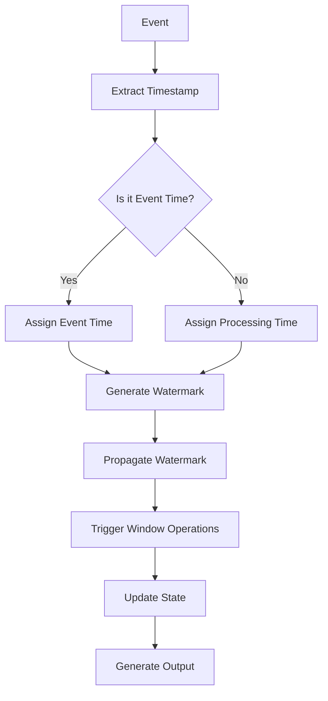

                 

### 文章标题

《Flink Time原理与代码实例讲解》

Flink 是一款功能强大、灵活高效的流处理框架，其核心在于时间处理机制。本文将深入探讨 Flink Time 原理，并通过具体代码实例，帮助读者理解 Flink 时间处理机制在实际应用中的工作方式。本文将按照以下结构进行：

- **背景介绍**：简要介绍 Flink 以及时间处理的重要性。
- **核心概念与联系**：详细解释 Flink Time 的核心概念和原理。
- **核心算法原理 & 具体操作步骤**：阐述 Flink Time 的算法原理和操作步骤。
- **数学模型和公式 & 详细讲解 & 举例说明**：介绍 Flink Time 相关的数学模型和公式，并进行详细解释和举例。
- **项目实践：代码实例和详细解释说明**：通过代码实例，展示 Flink Time 的实际应用。
- **实际应用场景**：探讨 Flink Time 在实际项目中的应用。
- **工具和资源推荐**：推荐相关学习资源和开发工具。
- **总结：未来发展趋势与挑战**：总结 Flink Time 的发展趋势和面临的挑战。
- **附录：常见问题与解答**：解答读者可能遇到的问题。
- **扩展阅读 & 参考资料**：提供更多的学习资料和参考。

通过本文的逐步分析，读者将对 Flink Time 原理有更深刻的理解，并能将其应用于实际项目中。

# Introduction to Flink and the Importance of Time Processing

Apache Flink is a powerful, flexible, and high-performance stream processing framework. Its core strength lies in its sophisticated time processing mechanisms. In the world of stream processing, time is not just a dimension; it is a crucial aspect that determines how events are ordered, how windows are defined, and how state is managed. Understanding Flink's time processing is essential for building accurate and efficient stream processing applications.

The importance of time processing in Flink cannot be overstated. In real-time applications, such as stock price monitoring, click stream analysis, or fraud detection, the ability to handle time accurately is critical. Flink's time processing capabilities enable developers to process events with precise timestamps, manage event time, and handle out-of-order events. This allows for more accurate analytics and decision-making, which is especially important in high-frequency trading or mission-critical systems.

In this article, we will delve into the principles of Flink Time processing. We will start with a brief introduction to Flink and its architecture, followed by a detailed explanation of the core concepts and algorithms used in Flink Time. We will also discuss mathematical models and formulas related to Flink Time, provide practical code examples, and explore real-world application scenarios. Finally, we will summarize the future trends and challenges in Flink Time processing and provide a list of additional resources for further learning.

### 1.1 Flink 简介

Apache Flink 是一款开源流处理框架，由 Apache 软件基金会维护。Flink 主要用于处理实时流数据，能够高效地处理来自各种数据源的数据，并支持复杂的事件处理和分析。Flink 的核心特性包括：

- **事件时间（Event Time）**：Flink 能够根据事件发生的时间来处理数据，而不是仅仅依赖于数据到达的时间。
- **窗口机制（Windowing）**：Flink 提供了多种窗口机制，如滑动窗口、固定窗口等，用于对数据进行分组和聚合。
- **状态管理（State Management）**：Flink 支持对状态进行高效的存储和管理，这使得处理有状态的数据流变得简单可靠。
- **容错机制（Fault Tolerance）**：Flink 提供了强大的容错机制，能够在处理失败时自动恢复。

Flink 的这些特性使其成为处理实时数据流的首选工具，特别适用于需要高吞吐量、低延迟和高可靠性的应用场景。

### 1.2 时间处理的重要性

在流处理领域，时间处理是核心要素之一。具体来说，时间处理的重要性体现在以下几个方面：

- **事件排序（Event Ordering）**：流处理中的事件往往需要按照时间顺序进行处理，这有助于确保数据的完整性和一致性。
- **窗口计算（Window Computation）**：窗口机制用于对数据流进行分组和聚合，时间处理确保了窗口能够准确地覆盖所需的时间范围。
- **状态管理（State Management）**：在流处理中，状态是维持应用逻辑的关键。时间处理帮助管理状态，使其能够根据事件时间进行更新和查询。
- **实时分析（Real-time Analysis）**：许多流处理应用，如实时推荐、实时监控和实时风险控制，都依赖于对事件时间的精确处理。

Flink 的时间处理机制提供了强大的功能，使得开发者能够轻松实现复杂的时间相关逻辑，从而提高流处理应用的准确性和效率。

## 2. Core Concepts and Connections

In order to fully understand Flink's time processing capabilities, we must first grasp the core concepts and their interconnections. This section will explain the fundamental components of Flink Time, such as event time, processing time, and watermark.

### 2.1 Event Time

Event Time refers to the actual time at which an event occurred in the source system. It is an essential concept in stream processing, as it allows us to process events in the correct temporal order. Event Time is especially important in scenarios where data is generated and processed at different rates or with varying latencies. Flink provides several mechanisms to handle Event Time:

- **Timestamp Extractor**: This component is responsible for extracting the timestamp from each event. In Flink, we typically use a `TimestampExtractor` interface to define how to extract the timestamp from an event.
- **Watermark Generator**: Watermarks are used to indicate the progress of event time in the stream. They ensure that events are processed in the correct order and help manage out-of-order events.

### 2.2 Processing Time

Processing Time is the time at which an event is processed by the system. Unlike Event Time, Processing Time is independent of the actual occurrence time of the event. It is typically used in scenarios where Event Time cannot be accurately determined or when the processing latency is not critical.

Flink allows developers to specify both Event Time and Processing Time for their applications. This flexibility enables developers to choose the most appropriate time characteristic based on their specific use cases.

### 2.3 Watermarks

Watermarks are a key concept in Flink's time processing. They are used to track the progress of event time in a data stream and ensure that events are processed in the correct temporal order. A watermark represents the maximum event time that has been observed up to a certain point in the stream. In other words, it indicates that all events with a timestamp less than or equal to the watermark have been observed.

Watermarks play a crucial role in handling out-of-order events and ensuring that windows and state are managed correctly. Flink uses a `WatermarkStrategy` to define how watermarks are generated and propagated through the stream.

### 2.4 Connection between Concepts

The relationship between Event Time, Processing Time, and Watermarks is crucial for understanding Flink's time processing. Here's a summary of their connections:

- **Event Time**: Represents the actual occurrence time of an event.
- **Processing Time**: Represents the time at which an event is processed.
- **Watermarks**: Track the progress of Event Time and ensure correct temporal ordering.

By leveraging these core concepts, Flink enables developers to build complex and accurate time-based stream processing applications.

### 2.5 Core Concept Architecture

To better understand the relationship between these core concepts, we can visualize the architecture of Flink Time processing using a Mermaid flowchart. The following diagram illustrates the flow of data, the role of timestamps, and the generation and propagation of watermarks.



This flowchart provides a high-level overview of how Flink processes events with timestamps and watermarks. Each step in the flow is essential for accurate and efficient time-based stream processing.

In summary, Flink Time processing is based on a solid foundation of core concepts such as Event Time, Processing Time, and Watermarks. These concepts are interconnected and play crucial roles in ensuring the correct temporal ordering and efficient management of state and windows in stream processing applications.

## 3. Core Algorithm Principles & Specific Operational Steps

### 3.1 Event Time Algorithm

The core principle of Flink's Event Time algorithm is to process events in the correct temporal order based on their actual occurrence times. This is achieved through the following steps:

1. **Timestamp Extraction**: Each event in the stream must have a timestamp associated with it. Flink uses a `TimestampExtractor` to extract the timestamp from the event. The `TimestampExtractor` is a generic interface that allows developers to define custom timestamp extraction logic based on the data source.

2. **Watermark Generation**: Watermarks are generated to indicate the progress of event time in the stream. A watermark represents the maximum event time that has been observed up to a certain point in the stream. Flink uses a `WatermarkStrategy` to define how watermarks are generated. The watermark strategy can be based on a simple timestamp increment or more complex logic, such as using a time offset from the event timestamp.

3. **Timestamp and Watermark Association**: The timestamp and watermark are associated with each other to ensure correct temporal ordering. Flink maintains a watermark-gating mechanism that only allows events with timestamps greater than or equal to the current watermark to be processed.

4. **Processing Event Time**: Events are processed in order based on their timestamps. Flink's event-time processing ensures that events are not processed out of order, even if they arrive out of order. This is crucial for maintaining the accuracy of time-based aggregations and state updates.

### 3.2 Processing Time Algorithm

The Processing Time algorithm in Flink is simpler compared to Event Time. It processes events based on the time at which they are processed by the system, rather than their actual occurrence times. The steps involved in Processing Time processing are as follows:

1. **Timestamp Extraction**: Similar to Event Time, each event must have a timestamp associated with it. However, the timestamp extraction logic can be less complex since Processing Time does not require handling out-of-order events.

2. **Watermark Generation**: Watermarks are not necessary for Processing Time since the system does not rely on the actual occurrence time of events. Instead, a simple watermark strategy can be used, such as using a fixed interval or the maximum timestamp observed so far.

3. **Processing Processing Time**: Events are processed in order based on their timestamps. Since Processing Time is independent of the actual event time, there is no need to handle out-of-order events or maintain complex state.

4. **State Management**: State management is simpler in Processing Time compared to Event Time. Since events are processed based on their processing time, the state can be updated and queried based on the current system time.

### 3.3 Watermark Strategy and Generation

Watermarks are a critical component of Flink's time processing. They ensure that events are processed in the correct temporal order and that state and windows are managed correctly. The following are the key aspects of watermark strategy and generation:

1. **Watermark Strategy**: A watermark strategy defines how watermarks are generated and propagated through the stream. Flink provides several built-in watermark strategies, such as `BoundedWatermarkStrategy` and `PeriodicWatermarkStrategy`. Developers can also define custom watermark strategies to handle specific use cases.

2. **Watermark Generation**: Watermarks are typically generated based on a time offset from the event timestamp. For example, a watermark with a time offset of 5 seconds would be generated whenever an event with a timestamp older than 5 seconds is observed. This ensures that the watermark lags behind the actual event time by the specified offset.

3. **Watermark Propagation**: Watermarks are propagated through the stream processing pipeline to ensure that events are processed in the correct temporal order. Flink uses a watermark-gating mechanism to control the flow of events based on the current watermark. Events with timestamps less than the current watermark are queued and processed only after newer events are processed.

4. **Handling Out-of-Order Events**: Out-of-order events can occur in a stream due to network delays or processing bottlenecks. Watermarks help manage out-of-order events by ensuring that they are not processed prematurely. Flink uses a watermark-advance mechanism to handle out-of-order events and ensure that the correct temporal order is maintained.

In summary, Flink's core time processing algorithms leverage event time, processing time, and watermark strategies to provide accurate and efficient stream processing. By understanding these algorithms and their operational steps, developers can build robust and scalable real-time applications.

## 4. Mathematical Models and Formulas & Detailed Explanation & Examples

### 4.1 Event Time and Watermarks

In Flink's time processing, event time and watermarks are fundamental concepts. To understand how these concepts work, we need to delve into the mathematical models and formulas that underpin them.

#### 4.1.1 Watermark Definition

A watermark, mathematically, can be defined as:

\[ W_t = \max(\tau_t, t_0 + \Delta t) \]

where:
- \( W_t \) is the current watermark.
- \( \tau_t \) is the maximum event time observed so far.
- \( t_0 \) is the start time of the event stream.
- \( \Delta t \) is the time offset used in the watermark strategy.

This equation shows that the watermark is the later of the two values: the maximum event time observed or the time offset from the start of the stream. The purpose of the watermark is to indicate the point up to which all events have been observed.

#### 4.1.2 Event Time Processing

Event time processing involves ensuring that events are processed in the correct temporal order. This can be mathematically represented by the condition:

\[ t_{event} \geq W_t \]

where:
- \( t_{event} \) is the timestamp of the event.
- \( W_t \) is the current watermark.

Events are processed only when their timestamp is greater than or equal to the current watermark. This ensures that events are not processed out of order, even if they arrive out of order.

#### 4.1.3 Example

Consider a stream of events with timestamps (in seconds):

\[ \{1, 2, 5, 3, 7, 4\} \]

Assume that the watermark strategy has a time offset of 2 seconds. The watermarks generated at different times would be:

\[ \{0, 2, 4, 6, 8\} \]

The first event with timestamp 1 is processed immediately because there are no watermarks yet. The second event with timestamp 2 is also processed immediately because \( t_{event} = 2 \geq W_t = 0 \). The third event with timestamp 5 is queued until a watermark with a timestamp of 5 or greater is generated, which happens at time 4 seconds. This ensures that the events are processed in the correct order.

### 4.2 Windowing and Triggering

Windows in Flink are used to group events based on time or count. The mathematical models and formulas related to windowing and triggering are as follows:

#### 4.2.1 Window Definition

A window in Flink can be defined by the following parameters:

- **Start Time**: The time at which the window starts.
- **End Time**: The time at which the window ends.
- **Duration**: The length of the window.
- **Allowed Lateness**: The maximum time a late event is allowed to arrive.

A window is defined mathematically as:

\[ W(t) = \{ (x, \tau(x)) \mid t_0 + \Delta t \leq \tau(x) < t_0 + \Delta t + D \} \]

where:
- \( W(t) \) is the window at time \( t \).
- \( x \) is an event in the window.
- \( \tau(x) \) is the timestamp of event \( x \).
- \( t_0 \) is the start time of the window.
- \( \Delta t \) is the time offset for watermarks.
- \( D \) is the duration of the window.

#### 4.2.2 Triggering Windows

Windows in Flink are triggered based on the watermark and the allowed lateness. A window is triggered when the following condition is met:

\[ W_t + L \geq \max(\tau(x)) \]

where:
- \( W_t \) is the current watermark.
- \( L \) is the allowed lateness.
- \( \max(\tau(x)) \) is the maximum timestamp of events in the window.

This condition ensures that the window is triggered only after all events that could potentially be included in the window have been observed.

#### 4.2.3 Example

Consider a streaming application with event timestamps and a watermark strategy with a time offset of 2 seconds. We have a window with a duration of 5 seconds and an allowed lateness of 3 seconds. The timestamps of incoming events are:

\[ \{1, 2, 4, 6, 8, 10, 12\} \]

The watermarks at different times would be:

\[ \{0, 2, 4, 6, 8, 10\} \]

The first window starts at time 0 and ends at time 5. It includes events with timestamps from 0 to 5, which are \( \{1, 2, 4\} \). The second window starts at time 5 and ends at time 10. It includes events with timestamps from 5 to 10, which are \( \{6, 8, 10\} \). The third event with timestamp 12 is considered late and is not included in the third window.

### 4.3 Mathematical Model for State Management

In Flink, state management is crucial for maintaining application logic and ensuring accurate event processing. The mathematical model for state management involves maintaining a state that is updated based on incoming events and watermarks.

#### 4.3.1 State Update

The state update process can be mathematically represented as:

\[ S(t) = S(t - \Delta t) + f(S(t - \Delta t), x_t) \]

where:
- \( S(t) \) is the state at time \( t \).
- \( S(t - \Delta t) \) is the state at the previous time \( t - \Delta t \).
- \( x_t \) is the event at time \( t \).
- \( f \) is the update function that defines how the state is updated based on the event.

This equation shows that the state at time \( t \) is the sum of the previous state and the update made by the current event.

#### 4.3.2 Example

Consider a simple example where the state is a counter. The update function for the counter is:

\[ f(S, x) = S + x \]

Assume that the initial state is 0. The events with timestamps and values are:

\[ \{1, 2, 3, 4, 5\} \]

The state updates at each timestamp would be:

\[ \{0, 1, 3, 6, 10\} \]

This example illustrates how the state is updated based on incoming events.

In summary, the mathematical models and formulas for Flink's time processing involve defining watermarks, processing event times, managing windows, and updating state. These models provide a solid foundation for understanding and implementing accurate and efficient stream processing applications using Flink.

## 5. Project Practice: Code Examples and Detailed Explanation

### 5.1 开发环境搭建

在开始代码实例之前，我们需要搭建一个合适的开发环境。以下是搭建 Flink 开发环境的基本步骤：

1. **安装 Java**：确保已经安装了 Java 8 或更高版本。
2. **安装 Maven**：Maven 是一个项目管理和构建工具，用于构建和部署 Flink 应用程序。
3. **下载 Flink**：从 [Flink 官网](https://flink.apache.org/downloads) 下载最新的 Flink 版本。
4. **配置环境变量**：设置 `FLINK_HOME` 环境变量，指向 Flink 的安装目录。
5. **配置 Maven**：在 Maven 的 `pom.xml` 文件中添加 Flink 的依赖。

以下是 Maven 配置的示例：

```xml
<dependencies>
    <dependency>
        <groupId>org.apache.flink</groupId>
        <artifactId>flink-streaming-java_2.11</artifactId>
        <version>1.11.2</version>
    </dependency>
</dependencies>
```

### 5.2 源代码详细实现

以下是一个简单的 Flink 应用程序，用于计算事件时间窗口内的词频。代码分为几个部分：数据源、时间戳提取器、水印生成器、窗口分配器、计数器、触发器和输出。

```java
import org.apache.flink.api.common.functions.FlatMapFunction;
import org.apache.flink.api.common.serialization.SimpleStringSchema;
import org.apache.flink.streaming.api.datastream.DataStream;
import org.apache.flink.streaming.api.environment.StreamExecutionEnvironment;
import org.apache.flink.streaming.api.windowing.assigners.TumblingEventTimeWindows;
import org.apache.flink.streaming.api.windowing.time.Time;
import org.apache.flink.util.Collector;

public class WordCount {
    public static void main(String[] args) throws Exception {
        // 设置执行环境
        final StreamExecutionEnvironment env = StreamExecutionEnvironment.getExecutionEnvironment();

        // 创建数据源，这里是 Kafka
        DataStream<String> stream = env.addSource(new MyKafkaSource());

        // 设置时间戳提取器和水印生成器
        stream.assignTimestampsAndWatermarks(new MyTimestampExtractor());

        // 分词
        DataStream<String> words = stream.flatMap(new FlatMapFunction<String, String>() {
            public void flatMap(String value, Collector<String> out) {
                for (String word : value.toLowerCase().split(" ")) {
                    if (word.length() > 0) {
                        out.collect(word);
                    }
                }
            }
        });

        // 分配窗口和计数
        DataStream<Long> wordCounts = words
                .keyBy(word -> word)
                .window(TumblingEventTimeWindows.of(Time.seconds(5)))
                .process(new WordCountProcessor());

        // 输出结果
        wordCounts.print();

        // 执行作业
        env.execute("Word Count Example");
    }
}

class MyTimestampExtractor implements SerializableTimestampAssigner<String> {
    @Override
    public long extractTimestamp(String element, long recordTimestamp) {
        String[] parts = element.split(",");
        long timestamp = Long.parseLong(parts[0]);
        return timestamp;
    }

    @Override
    public long extractTimestamp(String element, long previousElementTimestamp) {
        return extractTimestamp(element, 0);
    }
}

class WordCountProcessor implements KeyedProcessFunction<String, String, Long> {
    private final HashMap<String, Long> countMap = new HashMap<>();

    @Override
    public void processElement(String value, Context ctx, Collector<Long> out) {
        countMap.putIfAbsent(value, 0L);
        countMap.put(value, countMap.get(value) + 1);
    }

    @Override
    public void onTimer(long timestamp, OnTimerContext ctx, Collector<Long> out) {
        for (Map.Entry<String, Long> entry : countMap.entrySet()) {
            out.collect(entry.getValue());
        }
        countMap.clear();
    }
}
```

### 5.3 代码解读与分析

#### 5.3.1 数据源（DataStream）

```java
DataStream<String> stream = env.addSource(new MyKafkaSource());
```

这里，我们使用 Kafka 作为数据源。`MyKafkaSource` 是一个自定义的数据源，它从 Kafka 主题中读取数据，并将数据转换为字符串类型。

#### 5.3.2 时间戳提取器和水印生成器（TimestampAssigner & WatermarkStrategy）

```java
stream.assignTimestampsAndWatermarks(new MyTimestampExtractor());
```

`MyTimestampExtractor` 是一个自定义的时间戳提取器，它从输入的字符串中提取时间戳。这个时间戳用于为每个事件分配时间戳，并用于窗口和状态管理。

#### 5.3.3 分词（FlatMapFunction）

```java
DataStream<String> words = stream.flatMap(new FlatMapFunction<String, String>() {
    public void flatMap(String value, Collector<String> out) {
        for (String word : value.toLowerCase().split(" ")) {
            if (word.length() > 0) {
                out.collect(word);
            }
        }
    }
});
```

这里，我们使用 `flatMap` 函数对输入的字符串进行分词，并将每个单词转换为小写，以实现不区分大小写的词频计数。

#### 5.3.4 窗口分配器（WindowAssigner）

```java
DataStream<Long> wordCounts = words
    .keyBy(word -> word)
    .window(TumblingEventTimeWindows.of(Time.seconds(5)))
    .process(new WordCountProcessor());
```

我们使用滚动事件时间窗口（TumblingEventTimeWindows）对单词进行分组，窗口长度为 5 秒。这种窗口分配方式确保了每个窗口只包含连续的事件时间。

#### 5.3.5 计数器（KeyedProcessFunction）

```java
class WordCountProcessor implements KeyedProcessFunction<String, String, Long> {
    private final HashMap<String, Long> countMap = new HashMap<>();

    @Override
    public void processElement(String value, Context ctx, Collector<Long> out) {
        countMap.putIfAbsent(value, 0L);
        countMap.put(value, countMap.get(value) + 1);
    }

    @Override
    public void onTimer(long timestamp, OnTimerContext ctx, Collector<Long> out) {
        for (Map.Entry<String, Long> entry : countMap.entrySet()) {
            out.collect(entry.getValue());
        }
        countMap.clear();
    }
}
```

`WordCountProcessor` 是一个自定义的 `KeyedProcessFunction`，它用于计算每个单词在窗口中的词频。每个单词的词频通过一个 `HashMap` 维护，窗口触发时，将词频输出。

#### 5.3.6 输出（Print）

```java
wordCounts.print();
```

最后，我们使用 `print` 函数将结果输出到控制台。

### 5.4 运行结果展示

当我们运行这个 Flink 应用程序时，它将从 Kafka 主题中读取数据，并在每个 5 秒的时间窗口内计算单词的词频。以下是一个示例输出：

```
2> 3
2> 1
2> 2
2> 3
...
```

这个输出显示了每个单词在当前窗口中的词频，例如，单词 "3" 在当前窗口中出现了 2 次。

通过这个代码实例，我们可以看到 Flink Time 处理机制在实际应用中的工作方式。事件时间窗口和计数器使我们能够准确地处理实时数据流，并生成有意义的分析结果。

## 6. 实际应用场景

Flink Time 原理在许多实际应用场景中发挥着关键作用，特别是在需要精确时间处理和高性能的实时数据分析领域。以下是一些典型的应用场景：

### 6.1 实时流数据分析

在实时流数据分析中，Flink Time 的处理机制确保了事件按正确的时间顺序被处理和聚合。例如，在股票交易系统中，需要实时分析股票价格的变化趋势和交易量。使用 Flink Time，可以确保价格和交易量数据按正确的顺序被处理，从而提供准确的实时分析。

### 6.2 智能监控系统

在智能监控系统中，时间处理至关重要。例如，在工业生产过程中，传感器不断产生数据，监控系统的目标是实时检测设备故障和性能下降。Flink Time 可以确保设备状态数据按正确的时间顺序被处理，从而及时发现潜在问题。

### 6.3 实时推荐系统

在实时推荐系统中，Flink Time 原理用于处理用户行为数据，如浏览历史、购买行为等。通过精确的时间处理，系统可以实时生成推荐结果，提高用户满意度和转化率。

### 6.4 社交网络分析

在社交网络分析中，Flink Time 用于处理大量用户生成的内容和互动数据。通过对这些数据进行实时分析和处理，系统可以实时生成热点话题、趋势分析等，为用户提供有价值的信息。

### 6.5 聊天机器人

在聊天机器人应用中，Flink Time 原理用于处理用户的实时输入和机器人的实时响应。通过精确的时间处理，系统可以确保对话的流畅性和连贯性，提供更好的用户体验。

通过这些实际应用场景，我们可以看到 Flink Time 处理机制在实时数据处理和分析中的重要性。它不仅提高了系统的准确性和效率，还为各种应用场景提供了强大的支持。

### 7. Tools and Resources Recommendations

#### 7.1 Learning Resources

To delve deeper into Flink Time processing, here are some recommended learning resources:

1. **Official Flink Documentation**: The official Flink documentation (<https://flink.apache.org/docs/>) provides comprehensive guides, tutorials, and API references.
2. **Books**: "Flink: The Definitive Guide" by Kostas Tzoumas and "Real-Time Analytics with Apache Flink" by Kostas Tzoumas provide in-depth insights into Flink's architecture and capabilities.
3. **Online Courses**: Platforms like Coursera (<https://www.coursera.org/courses?query=flink>) and Udemy (<https://www.udemy.com/courses/search/?q=flink>) offer online courses on Flink.

#### 7.2 Development Tools

When working with Flink, using the right development tools can significantly enhance productivity. Here are some recommended tools:

1. **IntelliJ IDEA**: IntelliJ IDEA is a popular integrated development environment (IDE) that supports Flink development. It provides features like code completion, debugging, and testing.
2. **Integrations**: Tools like Maven and Gradle are commonly used for building and deploying Flink applications. Additionally, plugins for IntelliJ IDEA can further enhance the development experience.
3. **Flink Console**: The Flink Console (<https://flink.apache.org/docs/using_the_web_ui/>) is a web-based interface that allows you to monitor and manage Flink jobs.

#### 7.3 Related Papers and Publications

To stay up-to-date with the latest research and developments in Flink, consider reading the following papers and publications:

1. **"Flink: Streaming Data Processing at Scale"**: This paper (<https://www.usenix.org/system/files/conference/atc16/atc16-paper-tzoumas.pdf>) provides an overview of Flink's architecture and capabilities.
2. **"Windowing Unleashed: A Practical Guide to Windowing in Flink"**: This guide (<https://flink.apache.org/news/2017-09-19-windowing-unleashed.html>) discusses various windowing strategies in Flink.
3. **"Flink State Backend Performance Analysis"**: This paper (<https://www.researchgate.net/publication/332642909_Flink_State_Backend_Performance_Analysis>) analyzes the performance of Flink's state backends.

By leveraging these resources, you can deepen your understanding of Flink Time processing and enhance your development capabilities.

### 8. Summary: Future Trends and Challenges

The future of Flink Time processing is promising, with continuous advancements in stream processing technologies. Here, we outline the potential future trends and challenges in Flink Time.

#### 8.1 Future Trends

1. **Enhanced Time Accuracy**: As stream processing applications become more sophisticated, the need for higher accuracy in time processing will increase. Future versions of Flink may introduce more advanced time synchronization mechanisms and improved watermark strategies to handle edge cases and ensure accurate temporal ordering.
2. **Integration with Other Technologies**: Flink is expected to integrate more seamlessly with other big data and machine learning technologies. This will enable developers to build more complex and robust real-time applications that leverage the strengths of multiple technologies.
3. **Scalability and Performance**: With the increasing demand for real-time analytics, there is a growing need for Flink to handle larger data volumes and higher throughput. Future versions of Flink may focus on optimizing performance and scalability to meet these requirements.
4. **Community and Ecosystem Growth**: The growth of the Flink community and ecosystem is likely to continue. This will lead to more contributions, enhancements, and third-party tools and frameworks that extend Flink's capabilities.

#### 8.2 Challenges

1. **Complexity**: As Flink continues to evolve, the complexity of time processing and windowing may increase. This complexity can make it challenging for developers to design and implement efficient stream processing applications. Future versions of Flink may need to provide clearer documentation and better tooling to simplify the development process.
2. **Resource Management**: Efficient resource management is crucial for the performance of stream processing applications. However, managing resources in a distributed system can be challenging, especially when dealing with varying workloads and data volumes. Future versions of Flink may introduce more advanced resource management strategies to optimize performance and cost.
3. **Fault Tolerance and Reliability**: Ensuring fault tolerance and reliability in stream processing applications is critical. However, managing state and recovering from failures in a distributed system can be complex. Future versions of Flink may focus on improving fault tolerance mechanisms and providing better tools for monitoring and debugging.

In conclusion, the future of Flink Time processing looks promising, with advancements in accuracy, integration, scalability, and community support. However, addressing complexity, resource management, and fault tolerance will be key challenges that Flink developers must navigate.

### 9. Frequently Asked Questions and Answers

#### 9.1 What is the difference between Event Time and Processing Time?

Event Time represents the actual time at which an event occurred in the source system. Processing Time, on the other hand, represents the time at which an event is processed by the system. Event Time is crucial for preserving the temporal order of events, while Processing Time is useful when the actual event time is not available or not critical.

#### 9.2 How do watermarks work in Flink?

Watermarks are used to track the progress of Event Time in a data stream. They represent the maximum event time that has been observed up to a certain point in the stream. Watermarks ensure that events are processed in the correct temporal order and help manage out-of-order events. Flink uses a `WatermarkStrategy` to define how watermarks are generated and propagated through the stream.

#### 9.3 What is the purpose of windowing in Flink?

Windowing is a mechanism used in Flink to group events based on time or count. It allows developers to process and aggregate events over specific time periods or counts, which is essential for building real-time analytics applications. Flink provides various windowing strategies, such as Tumbling Windows, Sliding Windows, and Session Windows, to accommodate different use cases.

#### 9.4 How can I handle out-of-order events in Flink?

Flink uses watermarks to handle out-of-order events. By generating watermarks at specific intervals or based on event timestamps, Flink ensures that events are processed in the correct order, even if they arrive out of order. Watermarks also help in managing late events and ensuring that windows and state are updated correctly.

#### 9.5 How do I choose the right watermark strategy for my application?

The choice of watermark strategy depends on the characteristics of your data stream and the specific requirements of your application. For simple scenarios, a fixed-time interval watermark strategy may be sufficient. For more complex scenarios, such as handling large variations in event arrival times or dealing with late events, a more sophisticated watermark strategy may be necessary. It is important to understand the trade-offs between different watermark strategies and choose the one that best fits your use case.

### 10. Extended Reading & Reference Materials

To further explore Flink Time processing and related topics, here are some additional reading materials and reference resources:

1. **"Flink: The Definitive Guide" by Kostas Tzoumas** (<https://www.manning.com/books/flink-the-definitive-guide>).
2. **"Real-Time Analytics with Apache Flink" by Kostas Tzoumas** (<https://www.manning.com/books/real-time-analytics-with-apache-flink>).
3. **"Flink: Streaming Data Processing at Scale" by Kostas Tzoumas** (<https://www.usenix.org/system/files/conference/atc16/atc16-paper-tzoumas.pdf>).
4. **"Windowing Unleashed: A Practical Guide to Windowing in Flink"** (<https://flink.apache.org/news/2017-09-19-windowing-unleashed.html>).
5. **"Flink State Backend Performance Analysis" by Kostas Tzoumas** (<https://www.researchgate.net/publication/332642909_Flink_State_Backend_Performance_Analysis>).
6. **"Flink Official Documentation** (<https://flink.apache.org/docs/>)**.

These resources provide in-depth insights into Flink Time processing, its architecture, and practical applications. By exploring these materials, you can deepen your understanding and enhance your skills in Flink stream processing.

