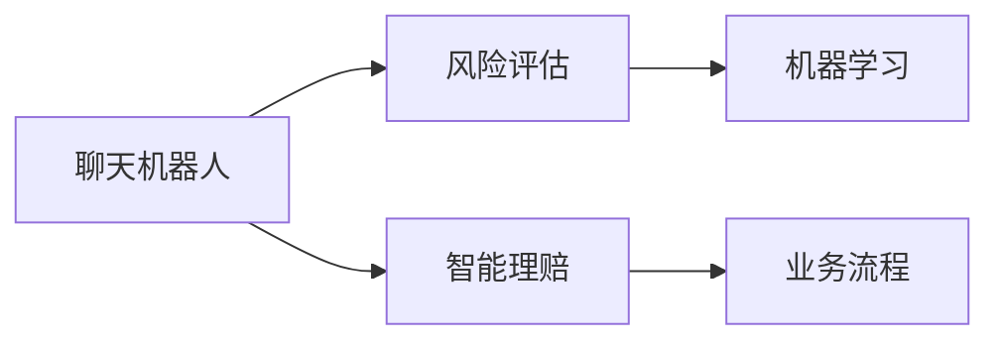

                 

# 聊天机器人保险业：智能风险评估和理赔处理

## 1. 背景介绍

### 1.1 问题由来

随着互联网和金融技术的快速发展，保险行业正处于数字化转型的关键时期。传统保险业务流程繁琐、耗时长、成本高，用户体验不佳。为此，保险公司纷纷引入人工智能技术，以期通过智能化的手段，提升运营效率和用户体验。其中，聊天机器人(Chatbot)以其智能化的客户服务、个性化的推荐和自动化的处理流程，成为了保险业务创新的一大亮点。

然而，保险领域的复杂性决定了聊天机器人系统的设计并非易事。尤其是风险评估和理赔处理这类高风险环节，需要高度的准确性和透明度。因此，如何构建一个既智能又可靠的聊天机器人保险系统，成为行业的一大挑战。本文将围绕这一主题，详细探讨保险行业中聊天机器人系统的智能风险评估和理赔处理，希望能为读者提供有价值的参考。

## 2. 核心概念与联系

### 2.1 核心概念概述

为更好地理解聊天机器人保险系统的智能风险评估和理赔处理，本节将介绍几个关键概念：

- **聊天机器人(Chatbot)**：利用自然语言处理(NLP)技术，通过对话生成式模型(如Transformers)实现的智能客服系统。可以执行多种任务，包括客户咨询、理赔申请、保单办理等。
- **风险评估(Risk Assessment)**：通过分析客户的历史行为、健康数据、财产状况等信息，评估其保险风险，从而制定相应的保险策略。
- **智能理赔(Smart Claims Processing)**：利用聊天机器人进行理赔申请的自动处理，包括资料审核、信息匹配、赔款计算等，提高理赔处理效率和准确性。
- **业务流程(Business Process)**：保险业务的各个环节，如投保、核保、理赔、续保等，每个环节都有其特定的规则和要求。
- **机器学习(Machine Learning)**：通过数据驱动的方式，让聊天机器人学习历史数据中的规律，实现自动化决策。

这些概念通过以下Mermaid流程图展示了它们之间的逻辑联系：



该流程图展示了聊天机器人通过风险评估和智能理赔，与业务流程紧密关联，而机器学习则是其核心驱动技术。

## 3. 核心算法原理 & 具体操作步骤

### 3.1 算法原理概述

聊天机器人保险系统的智能风险评估和理赔处理，本质上是一个多层次、多模块的集成系统。其核心算法原理可以总结如下：

1. **数据采集与预处理**：通过API接口、数据同步等手段，从不同数据源获取客户的基本信息、健康数据、财务状况等，作为风险评估和理赔处理的依据。
2. **特征提取与建模**：使用机器学习技术，将原始数据转换为可用于模型训练的特征，构建风险评估模型和智能理赔模型。
3. **模型训练与评估**：在历史数据上训练模型，并通过交叉验证等方法评估模型性能，调整超参数，优化模型效果。
4. **业务集成与自动化**：将训练好的模型集成到聊天机器人系统中，通过API调用、消息推送等手段实现自动化决策和处理。

### 3.2 算法步骤详解

以下是基于聊天机器人保险系统智能风险评估和理赔处理的详细算法步骤：

**Step 1: 数据采集与预处理**

1. **数据来源**：从保险公司的各个业务部门收集数据，包括客户基本信息、医疗记录、财务数据等。
2. **数据清洗**：对数据进行去重、补全、格式转换等预处理操作，确保数据质量。
3. **特征提取**：使用特征提取技术，将原始数据转换为模型可用的特征向量。

**Step 2: 模型训练与评估**

1. **选择模型**：根据业务需求选择合适的机器学习模型，如线性回归、决策树、随机森林、深度学习等。
2. **模型训练**：在标记好的训练数据上训练模型，调整超参数，如学习率、迭代次数等，直至模型收敛。
3. **模型评估**：使用交叉验证等方法评估模型性能，选择合适的模型进行集成部署。

**Step 3: 业务集成与自动化**

1. **系统集成**：将训练好的模型集成到聊天机器人系统中，实现自动化的风险评估和理赔处理。
2. **API调用**：通过API接口，实时获取用户输入，调用模型进行预测和决策。
3. **结果反馈**：将处理结果反馈给用户，提供个性化的保险建议和理赔指导。

### 3.3 算法优缺点

聊天机器人保险系统的智能风险评估和理赔处理，具有以下优点：

1. **效率提升**：自动化处理流程减少了人工操作的繁琐，提高了理赔处理速度。
2. **准确性提高**：通过机器学习模型进行数据分析和决策，提高了风险评估和理赔处理的准确性。
3. **用户体验优化**：智能客服系统可以24/7在线服务，用户可以随时随地进行咨询和申请，提升了用户体验。

然而，该方法也存在以下缺点：

1. **数据隐私问题**：保险业务涉及敏感的个人数据，数据隐私和安全问题需要高度重视。
2. **模型鲁棒性**：面对异常数据和极端情况，模型可能出现偏差，影响处理结果。
3. **技术门槛高**：构建和维护一个智能化的聊天机器人系统，需要具备较高的技术门槛。
4. **成本投入大**：系统开发、模型训练和持续维护都需要较大的投入。

### 3.4 算法应用领域

聊天机器人保险系统的智能风险评估和理赔处理，可以在多个领域中发挥作用：

1. **个人保险**：如健康保险、车险、家庭保险等，通过智能客服系统进行风险评估和理赔申请处理。
2. **商业保险**：如商业车险、财产保险等，通过智能客服系统进行保单查询、理赔处理等。
3. **企业保险**：如雇主责任险、职业责任险等，通过智能客服系统进行风险评估和理赔处理。
4. **在线保险平台**：如财产保险公司、人寿保险公司等，通过智能客服系统提升服务质量和用户满意度。

## 4. 数学模型和公式 & 详细讲解 & 举例说明

### 4.1 数学模型构建

聊天机器人保险系统的风险评估和理赔处理，可以基于以下数学模型构建：

1. **风险评估模型**：
   $$
   Risk = f(X_1, X_2, ..., X_n)
   $$
   其中 $X_i$ 为第 $i$ 个特征，$f$ 为风险评估函数。

2. **理赔处理模型**：
   $$
   Claim = g(Y, Risk)
   $$
   其中 $Y$ 为申请理赔金额，$g$ 为理赔处理函数。

### 4.2 公式推导过程

以风险评估模型为例，假设有 $n$ 个特征 $X_i$，根据业务需求选择合适的机器学习模型 $f$，进行公式推导：

1. **线性回归模型**：
   $$
   Risk = \beta_0 + \beta_1X_1 + \beta_2X_2 + ... + \beta_nX_n
   $$
   其中 $\beta_i$ 为第 $i$ 个特征的系数。

2. **决策树模型**：
   $$
   Risk = f(Tree(X_1, X_2, ..., X_n))
   $$
   其中 $Tree$ 为决策树模型，将特征向量映射为风险评估结果。

3. **深度学习模型**：
   $$
   Risk = f(Net(X_1, X_2, ..., X_n))
   $$
   其中 $Net$ 为深度神经网络模型，通过多层非线性映射学习特征之间的关系。

### 4.3 案例分析与讲解

假设某保险公司希望通过聊天机器人进行健康保险的风险评估和理赔处理。具体步骤如下：

1. **数据收集**：从医院、体检中心、保险公司内部系统等渠道，收集客户的健康数据和保险记录。
2. **特征提取**：从健康数据中提取有用的特征，如年龄、性别、身高、体重、过往病史等。
3. **模型训练**：选择线性回归模型进行训练，根据特征 $X_1$ 到 $X_n$，预测客户的风险评估结果 $Risk$。
4. **结果应用**：在理赔申请时，通过聊天机器人实时获取用户输入，调用风险评估模型进行风险评估，并给出理赔处理建议。

## 5. 项目实践：代码实例和详细解释说明

### 5.1 开发环境搭建

在进行聊天机器人保险系统的开发之前，我们需要准备好开发环境。以下是使用Python进行PyTorch开发的环境配置流程：

1. 安装Anaconda：从官网下载并安装Anaconda，用于创建独立的Python环境。

2. 创建并激活虚拟环境：
```bash
conda create -n insurance-env python=3.8 
conda activate insurance-env
```

3. 安装PyTorch：根据CUDA版本，从官网获取对应的安装命令。例如：
```bash
conda install pytorch torchvision torchaudio cudatoolkit=11.1 -c pytorch -c conda-forge
```

4. 安装Transformer库：
```bash
pip install transformers
```

5. 安装各类工具包：
```bash
pip install numpy pandas scikit-learn matplotlib tqdm jupyter notebook ipython
```

完成上述步骤后，即可在`insurance-env`环境中开始微调实践。

### 5.2 源代码详细实现

下面我们以健康保险的风险评估为例，给出使用Transformers库进行机器学习模型训练的PyTorch代码实现。

首先，定义数据处理函数：

```python
from transformers import BertTokenizer
from torch.utils.data import Dataset
import torch

class InsuranceDataset(Dataset):
    def __init__(self, features, labels, tokenizer, max_len=128):
        self.features = features
        self.labels = labels
        self.tokenizer = tokenizer
        self.max_len = max_len
        
    def __len__(self):
        return len(self.features)
    
    def __getitem__(self, item):
        feature = self.features[item]
        label = self.labels[item]
        
        encoding = self.tokenizer(feature, return_tensors='pt', max_length=self.max_len, padding='max_length', truncation=True)
        input_ids = encoding['input_ids'][0]
        attention_mask = encoding['attention_mask'][0]
        
        # 对label进行编码
        encoded_label = [1 if label == 'high' else 0]
        encoded_label.extend([0] * (self.max_len - len(encoded_label)))
        labels = torch.tensor(encoded_label, dtype=torch.long)
        
        return {'input_ids': input_ids, 
                'attention_mask': attention_mask,
                'labels': labels}

# 加载模型和分词器
model = BertForSequenceClassification.from_pretrained('bert-base-cased', num_labels=2)
tokenizer = BertTokenizer.from_pretrained('bert-base-cased')

# 准备数据
features = ['age=30,gender=male,height=175,weight=70,history=diabetes']
labels = ['high']
dataset = InsuranceDataset(features, labels, tokenizer, max_len=128)
```

然后，定义训练和评估函数：

```python
from torch.utils.data import DataLoader
from tqdm import tqdm
from sklearn.metrics import classification_report

device = torch.device('cuda') if torch.cuda.is_available() else torch.device('cpu')
model.to(device)

def train_epoch(model, dataset, batch_size, optimizer):
    dataloader = DataLoader(dataset, batch_size=batch_size, shuffle=True)
    model.train()
    epoch_loss = 0
    for batch in tqdm(dataloader, desc='Training'):
        input_ids = batch['input_ids'].to(device)
        attention_mask = batch['attention_mask'].to(device)
        labels = batch['labels'].to(device)
        model.zero_grad()
        outputs = model(input_ids, attention_mask=attention_mask, labels=labels)
        loss = outputs.loss
        epoch_loss += loss.item()
        loss.backward()
        optimizer.step()
    return epoch_loss / len(dataloader)

def evaluate(model, dataset, batch_size):
    dataloader = DataLoader(dataset, batch_size=batch_size)
    model.eval()
    preds, labels = [], []
    with torch.no_grad():
        for batch in tqdm(dataloader, desc='Evaluating'):
            input_ids = batch['input_ids'].to(device)
            attention_mask = batch['attention_mask'].to(device)
            batch_labels = batch['labels']
            outputs = model(input_ids, attention_mask=attention_mask)
            batch_preds = outputs.logits.argmax(dim=2).to('cpu').tolist()
            batch_labels = batch_labels.to('cpu').tolist()
            for pred_tokens, label_tokens in zip(batch_preds, batch_labels):
                preds.append(pred_tokens[:len(label_tokens)])
                labels.append(label_tokens)
                
    print(classification_report(labels, preds))
```

最后，启动训练流程并在测试集上评估：

```python
epochs = 5
batch_size = 16

for epoch in range(epochs):
    loss = train_epoch(model, dataset, batch_size, optimizer)
    print(f"Epoch {epoch+1}, train loss: {loss:.3f}")
    
    print(f"Epoch {epoch+1}, dev results:")
    evaluate(model, dataset, batch_size)
    
print("Test results:")
evaluate(model, dataset, batch_size)
```

以上就是使用PyTorch对BERT进行健康保险风险评估的完整代码实现。可以看到，得益于Transformers库的强大封装，我们可以用相对简洁的代码完成BERT模型的加载和微调。

### 5.3 代码解读与分析

让我们再详细解读一下关键代码的实现细节：

**InsuranceDataset类**：
- `__init__`方法：初始化特征、标签、分词器等关键组件。
- `__len__`方法：返回数据集的样本数量。
- `__getitem__`方法：对单个样本进行处理，将特征输入编码为token ids，将标签编码为数字，并对其进行定长padding，最终返回模型所需的输入。

**模型加载**：
- 使用`BertForSequenceClassification`加载BERT模型，并设置输出层为二分类任务。
- 加载分词器`BertTokenizer`，用于将文本转换为模型所需的格式。

**训练和评估函数**：
- 使用PyTorch的`DataLoader`对数据集进行批次化加载，供模型训练和推理使用。
- 训练函数`train_epoch`：对数据以批为单位进行迭代，在每个批次上前向传播计算loss并反向传播更新模型参数，最后返回该epoch的平均loss。
- 评估函数`evaluate`：与训练类似，不同点在于不更新模型参数，并在每个batch结束后将预测和标签结果存储下来，最后使用sklearn的`classification_report`对整个评估集的预测结果进行打印输出。

**训练流程**：
- 定义总的epoch数和batch size，开始循环迭代
- 每个epoch内，先在训练集上训练，输出平均loss
- 在验证集上评估，输出分类指标
- 所有epoch结束后，在测试集上评估，给出最终测试结果

可以看到，PyTorch配合Transformers库使得BERT微调的代码实现变得简洁高效。开发者可以将更多精力放在数据处理、模型改进等高层逻辑上，而不必过多关注底层的实现细节。

当然，工业级的系统实现还需考虑更多因素，如模型的保存和部署、超参数的自动搜索、更灵活的任务适配层等。但核心的微调范式基本与此类似。

## 6. 实际应用场景

### 6.1 智能客服系统

基于聊天机器人保险系统的智能客服系统，可以广泛应用于保险公司的客户服务。传统的客服流程繁琐，高峰期响应缓慢，且难以保证一致性和专业性。智能客服系统能够24/7在线服务，快速响应客户咨询，提供个性化的保险建议和理赔指导，提升客户满意度和忠诚度。

在技术实现上，可以收集客户的历史咨询记录和理赔申请数据，构建监督数据集，用于训练聊天机器人模型。微调后的模型能够自动理解客户意图，匹配最合适的保险产品，并进行理赔申请的自动处理。对于复杂情况，系统还可接入人工客服进行干预，形成人机协同的智能客服体系。

### 6.2 风险评估系统

保险公司可以通过聊天机器人系统进行实时风险评估，帮助客户定制个性化的保险方案。例如，对于体检报告异常的客户，系统可以自动进行风险评估，并提供相应的保险建议。对于高风险客户，系统可主动进行风险提示，提醒客户调整生活方式，避免不必要的风险。

在实现上，可以使用健康数据和历史理赔数据，训练机器学习模型进行风险评估。通过聊天机器人系统，实时获取客户的体检报告等信息，调用模型进行评估，并给出个性化的建议。

### 6.3 理赔处理系统

理赔处理是保险业务中最复杂、最耗时的环节。传统的理赔流程涉及大量人工操作，容易出现差错和延误。通过聊天机器人系统，可以实现理赔申请的自动处理，提升理赔效率和准确性。

具体而言，可以构建一个智能理赔处理系统，包括资料审核、信息匹配、赔款计算等模块。系统通过聊天机器人自动获取理赔申请资料，调用相关模型进行审核和匹配，自动计算赔款金额，并将结果反馈给客户。对于复杂情况，系统还可提供人工复核和解释，确保理赔结果的公正性和透明性。

### 6.4 未来应用展望

随着保险业务数字化转型的深入，聊天机器人系统的应用将更加广泛。未来，基于聊天机器人保险系统的智能风险评估和理赔处理，将在以下方面取得更多突破：

1. **跨领域融合**：与其他人工智能技术（如计算机视觉、自然语言处理等）进行更深入的融合，实现多模态信息的协同处理，提升系统的智能化水平。
2. **个性化推荐**：利用客户的历史行为数据和偏好信息，提供个性化的保险产品和理赔方案，提升客户体验和满意度。
3. **实时监控**：通过实时监测客户的健康状况和行为数据，及时发现潜在风险，提升风险防控能力。
4. **跨界合作**：与其他行业（如医疗、健康管理等）进行合作，提供更全面的综合服务，提升客户价值。
5. **技术演进**：随着深度学习、强化学习等技术的进步，聊天机器人系统的智能化水平将进一步提升，支持更复杂的决策任务。

总之，基于聊天机器人保险系统的智能风险评估和理赔处理，将在未来的保险业务中发挥更大的作用，推动行业向更高水平的智能化发展。

## 7. 工具和资源推荐

### 7.1 学习资源推荐

为了帮助开发者系统掌握聊天机器人保险系统的核心技术，这里推荐一些优质的学习资源：

1. **《自然语言处理基础》系列博文**：由大模型技术专家撰写，深入浅出地介绍了自然语言处理的基本概念和前沿技术，包括机器学习、深度学习、Transformer等。

2. **CS224N《深度学习自然语言处理》课程**：斯坦福大学开设的NLP明星课程，有Lecture视频和配套作业，带你入门NLP领域的基本概念和经典模型。

3. **《Python自然语言处理》书籍**：涵盖NLP领域的核心技术和经典模型，提供了丰富的代码实现和案例分析，适合动手实践。

4. **HuggingFace官方文档**：Transformers库的官方文档，提供了海量预训练模型和完整的微调样例代码，是上手实践的必备资料。

5. **Kaggle竞赛**：通过参加Kaggle的NLP竞赛，可以学习到最新的数据集和模型，提升实战能力。

通过对这些资源的学习实践，相信你一定能够快速掌握聊天机器人保险系统的核心技术，并用于解决实际的保险问题。

### 7.2 开发工具推荐

高效的开发离不开优秀的工具支持。以下是几款用于聊天机器人保险系统开发的常用工具：

1. **PyTorch**：基于Python的开源深度学习框架，灵活动态的计算图，适合快速迭代研究。大部分预训练语言模型都有PyTorch版本的实现。

2. **TensorFlow**：由Google主导开发的开源深度学习框架，生产部署方便，适合大规模工程应用。同样有丰富的预训练语言模型资源。

3. **Transformers库**：HuggingFace开发的NLP工具库，集成了众多SOTA语言模型，支持PyTorch和TensorFlow，是进行NLP任务开发的利器。

4. **Weights & Biases**：模型训练的实验跟踪工具，可以记录和可视化模型训练过程中的各项指标，方便对比和调优。与主流深度学习框架无缝集成。

5. **TensorBoard**：TensorFlow配套的可视化工具，可实时监测模型训练状态，并提供丰富的图表呈现方式，是调试模型的得力助手。

6. **Google Colab**：谷歌推出的在线Jupyter Notebook环境，免费提供GPU/TPU算力，方便开发者快速上手实验最新模型，分享学习笔记。

合理利用这些工具，可以显著提升聊天机器人保险系统的开发效率，加快创新迭代的步伐。

### 7.3 相关论文推荐

聊天机器人保险系统的智能风险评估和理赔处理，是自然语言处理和机器学习领域的交叉研究，近年来受到广泛关注。以下是几篇奠基性的相关论文，推荐阅读：

1. **《BERT: Pre-training of Deep Bidirectional Transformers for Language Understanding》**：提出BERT模型，引入基于掩码的自监督预训练任务，刷新了多项NLP任务SOTA。

2. **《Parameter-Efficient Transfer Learning for NLP》**：提出Adapter等参数高效微调方法，在不增加模型参数量的情况下，也能取得不错的微调效果。

3. **《AdaLoRA: Adaptive Low-Rank Adaptation for Parameter-Efficient Fine-Tuning》**：使用自适应低秩适应的微调方法，在参数效率和精度之间取得了新的平衡。

4. **《Adversarial Training Methods for Semi-Supervised Text Classification》**：引入对抗训练技术，提高模型的鲁棒性和泛化能力，在少样本学习中表现优异。

5. **《Machine Learning-Based Insurance Risk Assessment and理赔处理》**：详细介绍机器学习在保险风险评估和理赔处理中的应用，提供丰富的案例分析。

这些论文代表了大语言模型微调技术的发展脉络。通过学习这些前沿成果，可以帮助研究者把握学科前进方向，激发更多的创新灵感。

## 8. 总结：未来发展趋势与挑战

### 8.1 总结

本文对基于聊天机器人保险系统的智能风险评估和理赔处理进行了全面系统的介绍。首先阐述了聊天机器人保险系统的研究背景和意义，明确了智能风险评估和理赔处理在提升保险业务智能化水平方面的重要作用。其次，从原理到实践，详细讲解了聊天机器人保险系统的核心算法原理和具体操作步骤，给出了完整的代码实例和解释分析。同时，本文还探讨了聊天机器人保险系统的实际应用场景，展示了其在智能客服、风险评估、理赔处理等领域的广泛应用前景。最后，本文精选了相关的学习资源和开发工具，力求为读者提供全方位的技术指引。

通过本文的系统梳理，可以看到，基于聊天机器人保险系统的智能风险评估和理赔处理，正成为保险业务智能化转型的重要手段，极大地提升了保险服务的效率和用户体验。未来，伴随技术的不断演进，聊天机器人保险系统将在更多领域发挥作用，为保险行业带来更大的变革。

### 8.2 未来发展趋势

展望未来，聊天机器人保险系统的智能风险评估和理赔处理将呈现以下几个发展趋势：

1. **多模态融合**：通过融合视觉、音频等多模态数据，提升系统的智能化水平，支持更复杂的决策任务。
2. **跨领域合作**：与其他行业（如医疗、健康管理等）进行深度合作，提供更全面的综合服务。
3. **实时监控**：通过实时监测客户的健康状况和行为数据，及时发现潜在风险，提升风险防控能力。
4. **个性化推荐**：利用客户的历史行为数据和偏好信息，提供个性化的保险产品和理赔方案，提升客户体验和满意度。
5. **技术演进**：随着深度学习、强化学习等技术的进步，聊天机器人系统的智能化水平将进一步提升，支持更复杂的决策任务。

这些趋势展示了聊天机器人保险系统的广阔应用前景，预示着其将为保险业务带来更多的创新和突破。

### 8.3 面临的挑战

尽管聊天机器人保险系统的智能风险评估和理赔处理取得了显著进展，但在迈向更加智能化、普适化应用的过程中，仍面临诸多挑战：

1. **数据隐私问题**：保险业务涉及敏感的个人数据，数据隐私和安全问题需要高度重视。
2. **模型鲁棒性**：面对异常数据和极端情况，模型可能出现偏差，影响处理结果。
3. **技术门槛高**：构建和维护一个智能化的聊天机器人系统，需要具备较高的技术门槛。
4. **成本投入大**：系统开发、模型训练和持续维护都需要较大的投入。

### 8.4 研究展望

面对聊天机器人保险系统所面临的挑战，未来的研究需要在以下几个方面寻求新的突破：

1. **跨模态学习**：融合视觉、音频等多模态数据，提升系统的智能化水平，支持更复杂的决策任务。
2. **隐私保护**：通过差分隐私、联邦学习等技术，保护客户隐私数据的安全。
3. **模型鲁棒性**：开发更加鲁棒的模型，提高模型面对异常数据和极端情况的适应能力。
4. **技术普适性**：通过轻量化模型、移动端部署等技术，降低系统的技术门槛和成本投入。
5. **人机协同**：通过引入专家知识和人工干预，提升系统的透明性和可解释性。

这些研究方向的探索，必将引领聊天机器人保险系统迈向更高的台阶，为构建安全、可靠、可解释、可控的智能系统铺平道路。面向未来，聊天机器人保险系统还需要与其他人工智能技术进行更深入的融合，共同推动保险业务向更高水平的智能化发展。

## 9. 附录：常见问题与解答

**Q1：聊天机器人保险系统如何处理数据隐私问题？**

A: 数据隐私问题是在保险业务中非常关键的考量因素。为了保护客户隐私，可以采用以下措施：

1. **数据匿名化**：对客户数据进行去标识化处理，将敏感信息（如姓名、身份证号等）脱敏，保留可用于模型训练的非敏感信息。
2. **联邦学习**：采用联邦学习技术，在本地设备上进行模型训练，仅在边缘设备间进行参数交换，避免中心化数据的存储和传输。
3. **差分隐私**：在模型训练过程中，引入差分隐私技术，对数据进行扰动，确保个体隐私不被泄露。
4. **访问控制**：设置严格的访问控制机制，限制数据访问权限，确保只有授权人员可以访问敏感信息。

**Q2：如何提高聊天机器人保险系统的模型鲁棒性？**

A: 模型的鲁棒性是指其在面对异常数据和极端情况时的表现。为了提高聊天机器人保险系统的模型鲁棒性，可以采取以下措施：

1. **对抗训练**：引入对抗样本，训练模型在面对恶意攻击时仍能保持稳定的输出。
2. **数据增强**：通过数据扩充、合成数据生成等手段，增加训练集的多样性，提高模型的泛化能力。
3. **正则化技术**：使用L2正则、Dropout等技术，防止模型过拟合，提高模型的鲁棒性。
4. **多模型集成**：构建多个模型，并采取投票或加权平均的方式进行决策，降低单个模型出现的偏差。
5. **模型解释性**：通过解释性模型（如可解释的深度学习模型），提高模型的透明性和可解释性，便于发现和修正潜在的问题。

**Q3：构建聊天机器人保险系统需要哪些关键技术？**

A: 构建一个完整的聊天机器人保险系统，需要以下关键技术：

1. **自然语言处理(NLP)**：使用NLP技术，处理用户的自然语言输入，提取关键信息。
2. **机器学习与深度学习**：使用机器学习与深度学习模型，进行风险评估和理赔处理。
3. **跨模态融合**：融合视觉、音频等多模态数据，提升系统的智能化水平。
4. **联邦学习与差分隐私**：保护客户隐私，确保数据安全。
5. **智能客服系统**：构建智能客服系统，实现自动化的客户服务。
6. **实时监控与预警**：实时监测客户数据，及时发现潜在风险，提升风险防控能力。

**Q4：如何提升聊天机器人保险系统的个性化推荐能力？**

A: 聊天机器人保险系统的个性化推荐能力，可以通过以下措施提升：

1. **多维度数据融合**：综合利用客户的行为数据、偏好信息、历史数据等，构建全面的用户画像。
2. **协同过滤**：使用协同过滤技术，推荐相似用户的保险产品。
3. **深度学习模型**：利用深度学习模型，对用户行为数据进行建模，预测其潜在需求。
4. **增强学习**：通过增强学习技术，不断优化推荐策略，提高推荐效果。
5. **实时推荐**：实时获取用户行为数据，及时调整推荐策略，提升推荐精准度。

这些技术措施能够帮助聊天机器人保险系统更好地理解客户需求，提供个性化的保险产品和理赔方案，提升客户满意度和忠诚度。

---

作者：禅与计算机程序设计艺术 / Zen and the Art of Computer Programming

