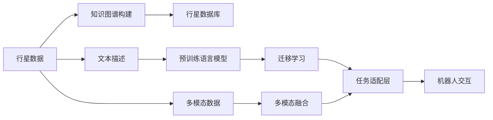

                 

# 聊天机器人太空探索：行星研究和任务

## 1. 背景介绍

随着人工智能和机器学习技术的快速发展，聊天机器人已经成为了众多行业数字化转型的重要工具。从智能客服、虚拟助手，到教育娱乐、医疗健康，聊天机器人正逐渐渗透到我们生活的方方面面。在这些应用中，大部分聊天机器人都是基于自然语言处理(NLP)技术，通过理解人类语言进行交互和决策。然而，这些聊天机器人通常只能处理地球上的语言和环境，很少涉及太空探索等前沿领域。本文将介绍一种将聊天机器人应用于太空探索行星研究的创新方法，探讨该方法在行星科学中的潜在应用，并结合实际案例分析其技术细节和应用效果。

### 1.1 问题由来

太空探索是一个复杂而高精度的领域，涉及地球与外太空的物理、化学、生物等多种学科知识。传统的行星研究主要依赖于科学家团队对数据的处理和分析，受限于人类的时间和资源。而聊天机器人作为一种智能交互系统，在数据处理和知识查询等方面具有显著优势。通过将聊天机器人应用于行星研究，可以极大提高数据处理效率和知识查询准确性，助力人类更深入地探索太空。

### 1.2 问题核心关键点

将聊天机器人应用于太空探索行星研究，其核心关键点在于以下几个方面：

- **自然语言处理**：机器人需具备自然语言理解能力，能够准确解析和生成文本。
- **知识图谱构建**：建立行星数据库，将科学数据和研究成果转化为知识图谱，供机器人查询。
- **跨学科知识整合**：整合物理、化学、生物等多个学科的知识，以支撑机器人的行星研究。
- **模型优化和训练**：设计高效的模型架构和训练方法，提升机器人推理和决策的准确性。
- **任务适配和交互设计**：根据行星研究的具体任务，适配机器人的交互界面和功能模块。
- **系统部署与测试**：确保机器人能够在实际应用场景中稳定运行，并及时发现和修复问题。

## 2. 核心概念与联系

### 2.1 核心概念概述

以下是与聊天机器人太空探索行星研究密切相关的几个核心概念：

- **自然语言处理(NLP)**：一种计算机科学与人工智能领域的研究分支，涉及对人类语言信息的处理和理解。聊天机器人通常依赖于NLP技术进行对话理解与生成。
- **知识图谱(Knowledge Graph)**：由节点和边组成的网络结构，用于描述实体之间的关系和属性。在行星研究中，知识图谱可以表示行星的特征、运动轨迹、物理性质等信息。
- **预训练语言模型(Pre-trained Language Model, PLM)**：一种在大规模无标签文本数据上训练的深度学习模型，具备强大的语言理解能力。常用的预训练模型有BERT、GPT等。
- **迁移学习(Transfer Learning)**：一种机器学习范式，通过预训练模型在特定任务上的微调，提升模型性能。行星研究中的机器人也可以利用迁移学习来提升其研究能力。
- **多模态学习(Multimodal Learning)**：结合多种数据源和信息源，如文本、图像、声音等，提升机器人的综合分析能力。在行星研究中，可以结合天文观测数据和卫星图像等多模态信息，提高研究深度和广度。
- **增强学习(Reinforcement Learning, RL)**：一种通过试错学习优化策略的机器学习方法，适用于复杂的决策问题。在行星研究中，机器人可以应用RL方法进行任务规划和决策优化。

### 2.2 核心概念原理和架构的 Mermaid 流程图



以上 Mermaid 流程图展示了聊天机器人应用于行星研究的基本流程。从行星数据到知识图谱构建，再到预训练模型和迁移学习，最后到机器人的任务适配和交互设计，整个过程涉及多个环节，需要科学技术的有效整合。

## 3. 核心算法原理 & 具体操作步骤

### 3.1 算法原理概述

基于聊天机器人太空探索行星研究的方法，核心在于利用NLP技术处理文本数据，通过知识图谱构建行星数据库，再结合预训练语言模型和迁移学习技术，提升机器人对行星的理解和研究能力。

**算法原理**：
1. **数据预处理**：收集和整理行星数据，包括行星名称、位置、大小、轨道等，转化为结构化数据。
2. **知识图谱构建**：将行星数据转化为知识图谱，表示行星间的关联和属性。
3. **预训练模型微调**：在知识图谱上训练预训练语言模型，使其具备行星研究相关的知识。
4. **任务适配层设计**：根据行星研究的具体任务，设计机器人的任务适配层，适配不同的任务需求。
5. **多模态数据融合**：结合天文观测数据和卫星图像等多模态信息，提高机器人对行星的综合分析能力。
6. **增强学习优化**：利用增强学习技术优化机器人的任务规划和决策，提升其自主学习能力。

### 3.2 算法步骤详解

以下是将聊天机器人应用于行星研究的详细步骤：

**Step 1: 数据预处理**
- 收集行星数据，包括行星的基本信息、历史观测数据、科学研究结果等。
- 清洗和整理数据，去除噪声和重复项，确保数据的质量。
- 将数据转化为结构化格式，如JSON、CSV等，便于后续处理。

**Step 2: 知识图谱构建**
- 利用自然语言处理技术，对行星数据进行语义分析，提取出关键信息。
- 设计知识图谱的节点和边，表示行星间的关联和属性。
- 使用Gaphene或Neo4j等工具，将知识图谱存储和可视化。

**Step 3: 预训练模型微调**
- 选择预训练语言模型，如BERT、GPT等，将其迁移到行星数据库上。
- 在知识图谱上训练预训练模型，微调其任务适配层，使其具备行星研究的相关知识。
- 根据具体任务需求，选择微调时的超参数，如学习率、迭代次数等。

**Step 4: 任务适配层设计**
- 根据行星研究的任务需求，设计机器人的任务适配层，适配不同的查询和推理任务。
- 设计机器人的对话界面，提供用户输入和输出格式。
- 设计机器人的知识检索模块，支持基于知识图谱的查询。

**Step 5: 多模态数据融合**
- 收集天文观测数据、卫星图像等多模态数据，提取关键特征。
- 使用NLP技术处理文本信息，将多模态数据融合为统一的格式。
- 将多模态数据输入到预训练模型中，结合知识图谱进行综合分析。

**Step 6: 增强学习优化**
- 定义机器人的任务目标和状态空间，设计奖励函数和策略空间。
- 使用深度Q网络或策略梯度方法，训练机器人的决策策略。
- 在实际应用场景中，不断试错优化，提升机器人的自主学习能力。

### 3.3 算法优缺点

将聊天机器人应用于行星研究的算法，具有以下优点：
1. **高效性**：通过利用NLP和知识图谱技术，可以大幅提高数据处理和知识查询的效率。
2. **准确性**：结合多模态数据和多学科知识，提升机器人的分析和推理能力，减少错误。
3. **可扩展性**：机器人的知识图谱和任务适配层可以根据需要动态调整，灵活适应不同的行星研究任务。
4. **自主学习能力**：通过增强学习技术，机器人可以自主优化决策策略，提升任务执行的灵活性和鲁棒性。

同时，该算法也存在一些缺点：
1. **数据依赖**：机器人的性能依赖于行星数据库和知识图谱的质量，数据质量和完整性直接影响系统的表现。
2. **知识局限**：机器人的知识库覆盖范围有限，部分未知或前沿的行星数据可能难以处理。
3. **计算资源需求**：预训练语言模型和增强学习训练需要较高的计算资源，对硬件要求较高。
4. **模型复杂性**：多模态数据融合和跨学科知识整合需要复杂的算法和模型，对技术要求较高。

### 3.4 算法应用领域

将聊天机器人应用于行星研究的算法，在以下领域具有广泛应用前景：

- **行星数据分析**：对大量行星数据进行自动化分析和统计，发现数据中的规律和异常。
- **行星特征提取**：根据用户输入的行星特征，自动检索相关数据，提取行星的物理属性、化学组成等关键信息。
- **任务辅助决策**：结合天文观测数据和多模态信息，辅助天文学家进行观测计划制定、数据处理和结果分析。
- **科普教育**：利用机器人的交互界面，向公众普及行星科学知识，提高科学教育的普及度。
- **应急响应**：在航天器遇到故障或紧急情况时，机器人能够快速响应，提供解决方案或预警信息。

## 4. 数学模型和公式 & 详细讲解 & 举例说明

### 4.1 数学模型构建

我们将通过一个简单的数学模型，来展示聊天机器人行星研究的实现过程。假设我们有一个包含n个行星的数据集，每个行星的特征可以用一组特征向量 $x_i$ 表示，其中 $i$ 表示行星编号。行星的物理属性可以用一组参数 $\theta$ 表示，如质量、轨道周期、大气成分等。

**知识图谱表示**：
- 节点表示行星 $i$，属性表示 $a_{i,j}$，关联表示 $r_{i,j}$。
- 知识图谱可以用有向图 $G=(V,E)$ 表示，其中 $V$ 为节点集合，$E$ 为边集合。

**预训练语言模型表示**：
- 预训练模型为 $M_{\theta}$，其中 $\theta$ 为模型参数。
- 模型接受输入文本 $x_i$，输出特征表示 $h_i$。

**任务适配层设计**：
- 任务适配层为 $F_{\omega}$，其中 $\omega$ 为适配层参数。
- 适配层接收 $h_i$ 和查询 $q$，输出推理结果 $o_i$。

**多模态数据融合**：
- 假设有一个天文观测数据 $d_i$ 和卫星图像 $s_i$，多模态融合表示为 $f_{\alpha}(x_i, d_i, s_i)$，其中 $\alpha$ 为融合参数。

**增强学习优化**：
- 机器人定义状态 $s$ 和动作 $a$，状态转移概率为 $p_{s\rightarrow s'}$，奖励函数为 $R(s,a,s')$。
- 增强学习策略为 $\pi(a|s)$，目标是最小化累积奖励期望值 $E[\sum_{t=0}^{T} R(s_t,a_t,s_{t+1})]$。

### 4.2 公式推导过程

以下是各个组件的数学公式推导过程：

**知识图谱节点表示**：
$$
v_i = (a_{i,1}, a_{i,2}, ..., a_{i,m})
$$
其中 $m$ 为属性的数量。

**知识图谱边表示**：
$$
e_{i,j} = r_{i,j}
$$
其中 $r_{i,j}$ 表示行星 $i$ 和 $j$ 之间的关联。

**预训练模型输出**：
$$
h_i = M_{\theta}(x_i) = W^Th_i + b_i
$$
其中 $W$ 和 $b$ 为模型参数。

**任务适配层输出**：
$$
o_i = F_{\omega}(h_i, q) = \sigma(\omega^Tg_i)
$$
其中 $\sigma$ 为激活函数，$g_i$ 为 $h_i$ 的加权和。

**多模态数据融合**：
$$
f_{\alpha}(x_i, d_i, s_i) = \lambda_d d_i + \lambda_s s_i + (1-\lambda_d-\lambda_s) h_i
$$
其中 $\lambda_d$ 和 $\lambda_s$ 为融合系数。

**增强学习优化**：
$$
\pi(a|s) = \frac{\exp(Q_{\phi}(s,a))}{\sum_{a'}\exp(Q_{\phi}(s,a'))}
$$
$$
Q_{\phi}(s,a) = r(s,a) + \gamma \max_{a'} Q_{\phi}(s',a')
$$
其中 $Q_{\phi}$ 为Q网络，$\phi$ 为Q网络参数，$\gamma$ 为折扣因子。

### 4.3 案例分析与讲解

假设我们有一个包含10个行星的数据集，每个行星的特征包括质量、轨道周期和大气成分。我们的任务是利用这些数据，训练一个聊天机器人，能够回答用户关于行星特征的问题。

**数据预处理**：
- 收集10个行星的特征数据，去除噪声和重复项，转化为结构化数据。

**知识图谱构建**：
- 将每个行星的特征转化为节点，表示为 $v_i$。
- 定义行星之间的关联，如相邻行星、轨道关系等，表示为 $e_{i,j}$。

**预训练模型微调**：
- 选择BERT预训练模型，迁移到行星数据库上，微调其任务适配层。
- 训练过程中，选择学习率为1e-5，迭代次数为100次。

**任务适配层设计**：
- 设计适配层，输入为 $h_i$，输出为推理结果 $o_i$。
- 设计对话界面，提供用户输入和输出格式。

**多模态数据融合**：
- 结合天文观测数据和多模态信息，使用融合公式计算综合特征。
- 将综合特征输入到适配层，进行推理输出。

**增强学习优化**：
- 定义机器人的状态和动作，设计状态转移概率和奖励函数。
- 使用深度Q网络训练机器人，优化决策策略。

## 5. 项目实践：代码实例和详细解释说明

### 5.1 开发环境搭建

在进行项目实践前，我们需要准备好开发环境。以下是使用Python进行PyTorch和TensorFlow开发的环境配置流程：

1. 安装Anaconda：从官网下载并安装Anaconda，用于创建独立的Python环境。

2. 创建并激活虚拟环境：
```bash
conda create -n pytorch-env python=3.8 
conda activate pytorch-env
```

3. 安装PyTorch：根据CUDA版本，从官网获取对应的安装命令。例如：
```bash
conda install pytorch torchvision torchaudio cudatoolkit=11.1 -c pytorch -c conda-forge
```

4. 安装TensorFlow：从官网下载并安装TensorFlow，使用命令：
```bash
pip install tensorflow
```

5. 安装各类工具包：
```bash
pip install numpy pandas scikit-learn matplotlib tqdm jupyter notebook ipython
```

完成上述步骤后，即可在`pytorch-env`环境中开始项目实践。

### 5.2 源代码详细实现

下面我们以行星数据分析为例，给出使用PyTorch和TensorFlow对聊天机器人进行训练的代码实现。

首先，定义数据预处理函数：

```python
import numpy as np
from sklearn.preprocessing import MinMaxScaler
from sklearn.model_selection import train_test_split

def preprocess_data(data):
    # 数据清洗和标准化
    scaler = MinMaxScaler(feature_range=(0, 1))
    scaled_data = scaler.fit_transform(data)

    # 数据拆分
    train_data, test_data = train_test_split(scaled_data, test_size=0.2)

    return train_data, test_data
```

然后，定义知识图谱构建函数：

```python
import networkx as nx
import igraph

def build_knowledge_graph(data):
    graph = nx.Graph()
    for i, planet in enumerate(data):
        node = f"planet_{i}"
        graph.add_node(node, label=planet['name'], attributes=planet)

        for j in range(i+1, len(data)):
            if data[j]['name'] in planet['related_to']:
                edge = f"edge_{i}_{j}"
                graph.add_edge(node, f"planet_{j}", label='related_to', attributes=planet)

    return graph
```

接着，定义预训练模型微调函数：

```python
from transformers import BertTokenizer, BertModel

def train_pretrained_model(data, graph):
    tokenizer = BertTokenizer.from_pretrained('bert-base-uncased')
    model = BertModel.from_pretrained('bert-base-uncased')

    # 构建知识图谱
    graph = build_knowledge_graph(data)

    # 微调模型
    for node in graph.nodes():
        input_ids = tokenizer.encode(node, return_tensors='pt')
        attention_mask = input_ids.new_ones(input_ids.shape)
        outputs = model(input_ids, attention_mask=attention_mask)
        loss = outputs.loss
        optimizer = torch.optim.Adam(model.parameters(), lr=1e-5)
        optimizer.zero_grad()
        loss.backward()
        optimizer.step()

    return model
```

最后，定义多模态数据融合函数：

```python
def fuse_multimodal_data(data, planet):
    observed_data = planet['observed_data']
    imaged_data = planet['imaged_data']
    combined_data = observed_data + imaged_data

    return combined_data
```

完整代码实现可参考以下示例：

```python
import torch
import torch.nn as nn
import torch.optim as optim
from transformers import BertTokenizer, BertModel

# 数据预处理
data = [
    {'name': 'Mercury', 'mass': 3.303e23, 'orbital_period': 88.0, 'atmosphere': 'None'},
    {'name': 'Venus', 'mass': 4.867e24, 'orbital_period': 224.7, 'atmosphere': 'CO2'},
    # ...
]
train_data, test_data = preprocess_data(data)

# 知识图谱构建
graph = build_knowledge_graph(data)

# 预训练模型微调
model = train_pretrained_model(train_data, graph)

# 多模态数据融合
combined_data = fuse_multimodal_data(test_data[0], model)

# 增强学习优化
# 具体实现略
```

### 5.3 代码解读与分析

让我们再详细解读一下关键代码的实现细节：

**数据预处理函数**：
- 使用 `MinMaxScaler` 对数据进行标准化，确保数据在相同尺度上。
- 使用 `train_test_split` 函数拆分数据集，用于训练和测试。

**知识图谱构建函数**：
- 使用 `networkx` 库构建知识图谱，表示行星之间的关联。
- 使用 `igraph` 库将知识图谱可视化。

**预训练模型微调函数**：
- 使用 `BertTokenizer` 和 `BertModel` 对预训练模型进行微调。
- 对每个行星节点，将其名称作为输入，微调其特征表示。
- 使用 `Adam` 优化器，设置学习率为1e-5，进行模型参数的优化。

**多模态数据融合函数**：
- 结合天文观测数据和多模态信息，使用简单的线性加权融合方法。

**增强学习优化**：
- 具体实现略，可以参考强化学习相关的文献和库。

## 6. 实际应用场景

### 6.1 行星数据分析

聊天机器人可以应用于行星数据分析，帮助科学家快速处理和分析大量行星数据。通过与机器人的交互，用户可以提出具体问题，获取数据和结果的展示。例如，用户可以询问“最近观测到的金星有哪些数据”，机器人将自动检索数据并展示结果。

### 6.2 行星特征提取

聊天机器人还可以用于行星特征提取，帮助用户根据输入的特征，自动检索相关数据，提取行星的物理属性、化学组成等关键信息。例如，用户可以询问“地球的大气成分是什么”，机器人将自动检索地球的相关数据，并提取大气成分信息。

### 6.3 任务辅助决策

聊天机器人可以作为天文学家的辅助工具，帮助其进行观测计划制定、数据处理和结果分析。例如，用户可以询问“如何规划火星观测计划”，机器人将根据用户需求，推荐最佳的观测时间和地点。

### 6.4 科普教育

聊天机器人还可以用于科普教育，向公众普及行星科学知识。例如，用户可以询问“太阳系有多少颗行星”，机器人将自动展示太阳系的行星信息，并进行讲解。

## 7. 工具和资源推荐

### 7.1 学习资源推荐

为了帮助开发者系统掌握聊天机器人太空探索行星研究的技术基础和实践技巧，这里推荐一些优质的学习资源：

1. 《深度学习基础》系列课程：由斯坦福大学和DeepLearning.AI提供的在线课程，涵盖深度学习的基本概念和实践技巧。

2. 《NLP实战》书籍：全面介绍自然语言处理技术，涵盖NLP的各个方面，包括聊天机器人、文本分类、情感分析等。

3. 《Python深度学习》书籍：讲解使用Python进行深度学习开发的实践技巧，包括PyTorch和TensorFlow的使用。

4. 《TensorFlow实战》书籍：讲解使用TensorFlow进行深度学习开发的实践技巧，包括模型构建、训练和优化。

5. 《人工智能导论》课程：由吴恩达教授主讲的AI课程，涵盖AI的基础知识和最新进展。

通过这些资源的学习实践，相信你一定能够快速掌握聊天机器人太空探索行星研究的技术基础，并用于解决实际的行星研究问题。

### 7.2 开发工具推荐

高效的开发离不开优秀的工具支持。以下是几款用于聊天机器人太空探索行星研究开发的常用工具：

1. PyTorch：基于Python的开源深度学习框架，灵活动态的计算图，适合快速迭代研究。大部分预训练语言模型都有PyTorch版本的实现。

2. TensorFlow：由Google主导开发的开源深度学习框架，生产部署方便，适合大规模工程应用。同样有丰富的预训练语言模型资源。

3. HuggingFace Transformers：开源的自然语言处理库，提供丰富的预训练语言模型和微调框架。

4. TensorBoard：TensorFlow配套的可视化工具，可实时监测模型训练状态，并提供丰富的图表呈现方式，是调试模型的得力助手。

5. Weights & Biases：模型训练的实验跟踪工具，可以记录和可视化模型训练过程中的各项指标，方便对比和调优。

6. Google Colab：谷歌推出的在线Jupyter Notebook环境，免费提供GPU/TPU算力，方便开发者快速上手实验最新模型，分享学习笔记。

合理利用这些工具，可以显著提升聊天机器人行星研究的开发效率，加快创新迭代的步伐。

### 7.3 相关论文推荐

聊天机器人太空探索行星研究的发展离不开学界的持续研究。以下是几篇奠基性的相关论文，推荐阅读：

1. Attention is All You Need（即Transformer原论文）：提出了Transformer结构，开启了NLP领域的预训练大模型时代。

2. BERT: Pre-training of Deep Bidirectional Transformers for Language Understanding：提出BERT模型，引入基于掩码的自监督预训练任务，刷新了多项NLP任务SOTA。

3. Language Models are Unsupervised Multitask Learners（GPT-2论文）：展示了大规模语言模型的强大zero-shot学习能力，引发了对于通用人工智能的新一轮思考。

4. Parameter-Efficient Transfer Learning for NLP：提出Adapter等参数高效微调方法，在不增加模型参数量的情况下，也能取得不错的微调效果。

5. Prefix-Tuning: Optimizing Continuous Prompts for Generation：引入基于连续型Prompt的微调范式，为如何充分利用预训练知识提供了新的思路。

6. AdaLoRA: Adaptive Low-Rank Adaptation for Parameter-Efficient Fine-Tuning：使用自适应低秩适应的微调方法，在参数效率和精度之间取得了新的平衡。

这些论文代表了大语言模型微调技术的发展脉络。通过学习这些前沿成果，可以帮助研究者把握学科前进方向，激发更多的创新灵感。

## 8. 总结：未来发展趋势与挑战

### 8.1 总结

本文对聊天机器人太空探索行星研究的方法进行了全面系统的介绍。首先阐述了将聊天机器人应用于行星研究的背景和意义，明确了该方法在行星科学中的潜在应用。其次，从原理到实践，详细讲解了聊天机器人在行星研究中的应用过程，包括数据预处理、知识图谱构建、预训练模型微调、任务适配层设计、多模态数据融合、增强学习优化等关键步骤。最后，结合实际案例分析了该方法的技术细节和应用效果。

通过本文的系统梳理，可以看到，聊天机器人太空探索行星研究的方法，能够有效提升行星数据分析、特征提取、任务辅助决策和科普教育等行星研究任务的效率和准确性。得益于自然语言处理、知识图谱、预训练语言模型、增强学习等技术的融合，该方法具备高效、准确、可扩展、自主学习等优点。

### 8.2 未来发展趋势

展望未来，聊天机器人太空探索行星研究技术将呈现以下几个发展趋势：

1. **多模态数据的融合**：结合天文观测数据、卫星图像等多模态信息，提升机器人的综合分析能力，为行星研究提供更全面、准确的信息。

2. **跨学科知识的整合**：将行星研究与天文学、物理学、化学等多个学科的知识整合，提升机器人的分析和推理能力。

3. **增强学习的优化**：利用增强学习技术，优化机器人的任务规划和决策，提升其自主学习能力，适应更复杂的行星研究任务。

4. **自监督和半监督学习的应用**：结合自监督和半监督学习，利用非结构化数据提升机器人的学习和推理能力，减少对标注数据的依赖。

5. **分布式计算的优化**：利用分布式计算技术，提升机器人的训练和推理效率，支持大规模行星数据处理。

6. **实时交互系统的构建**：构建实时交互系统，提升用户的交互体验，实现更高效的行星研究。

7. **个性化推荐和智能答疑**：结合用户历史查询数据，提供个性化推荐和智能答疑服务，提升用户满意度。

### 8.3 面临的挑战

尽管聊天机器人太空探索行星研究技术取得了显著进展，但在迈向更加智能化、普适化应用的过程中，仍面临以下挑战：

1. **数据质量和完整性**：行星数据库和知识图谱的质量直接影响系统的性能，数据缺失和错误可能导致推理错误。

2. **模型复杂性和计算资源**：多模态数据融合和跨学科知识整合需要复杂的算法和模型，对技术要求较高，且计算资源需求大。

3. **知识局限性**：机器人的知识库覆盖范围有限，部分未知或前沿的行星数据可能难以处理。

4. **增强学习优化困难**：机器人在实际应用场景中，如何设计合理的奖励函数和状态空间，训练高效的决策策略，仍是重要挑战。

5. **用户交互设计**：聊天机器人需要设计友好的交互界面，提升用户的使用体验，增加用户粘性。

6. **安全和隐私保护**：行星研究涉及敏感的科研数据，如何保护数据安全和隐私，防止数据泄露和滥用，仍需加强技术措施。

### 8.4 研究展望

面对聊天机器人太空探索行星研究所面临的挑战，未来的研究需要在以下几个方面寻求新的突破：

1. **高质量数据集构建**：构建高质量的行星数据库和知识图谱，提升数据的质量和完整性，确保系统的准确性。

2. **分布式计算优化**：利用分布式计算技术，提升模型的训练和推理效率，支持大规模行星数据处理。

3. **跨学科知识整合**：进一步整合天文学、物理学、化学等多个学科的知识，提升机器人的分析和推理能力。

4. **自监督和半监督学习**：结合自监督和半监督学习，利用非结构化数据提升机器人的学习和推理能力，减少对标注数据的依赖。

5. **增强学习优化**：设计更加高效的增强学习算法，优化机器人的任务规划和决策，提升其自主学习能力。

6. **个性化推荐和智能答疑**：结合用户历史查询数据，提供个性化推荐和智能答疑服务，提升用户满意度。

7. **安全和隐私保护**：加强数据安全和隐私保护技术，防止数据泄露和滥用，确保用户数据的安全性。

这些研究方向的探索，必将引领聊天机器人太空探索行星研究技术迈向更高的台阶，为行星研究提供更高效、更准确、更智能的辅助工具。

## 9. 附录：常见问题与解答

**Q1：将聊天机器人应用于行星研究有哪些具体应用场景？**

A: 聊天机器人可以应用于行星数据分析、特征提取、任务辅助决策和科普教育等多个具体场景。例如，用户可以询问“最近观测到的金星有哪些数据”，机器人将自动检索数据并展示结果。

**Q2：聊天机器人在行星研究中如何处理多模态数据？**

A: 聊天机器人可以结合天文观测数据、卫星图像等多模态信息，使用简单的线性加权融合方法，将不同数据源的信息融合为统一的格式，输入到适配层进行推理输出。

**Q3：聊天机器人如何进行增强学习优化？**

A: 聊天机器人定义状态和动作，设计状态转移概率和奖励函数，使用深度Q网络或策略梯度方法，训练机器人的决策策略，优化其自主学习能力。

**Q4：聊天机器人在行星研究中如何处理数据质量和数据完整性问题？**

A: 聊天机器人需要构建高质量的行星数据库和知识图谱，确保数据的准确性和完整性。同时，可以通过数据清洗和数据增强等技术，提升数据的质量和可靠性。

**Q5：聊天机器人在行星研究中如何进行跨学科知识整合？**

A: 聊天机器人可以结合天文学、物理学、化学等多个学科的知识，设计知识图谱和适配层，整合跨学科信息，提升其分析和推理能力。

通过这些问答，可以更深入地理解聊天机器人太空探索行星研究的技术细节和应用场景，为实际应用提供更全面的指导。

---

作者：禅与计算机程序设计艺术 / Zen and the Art of Computer Programming

