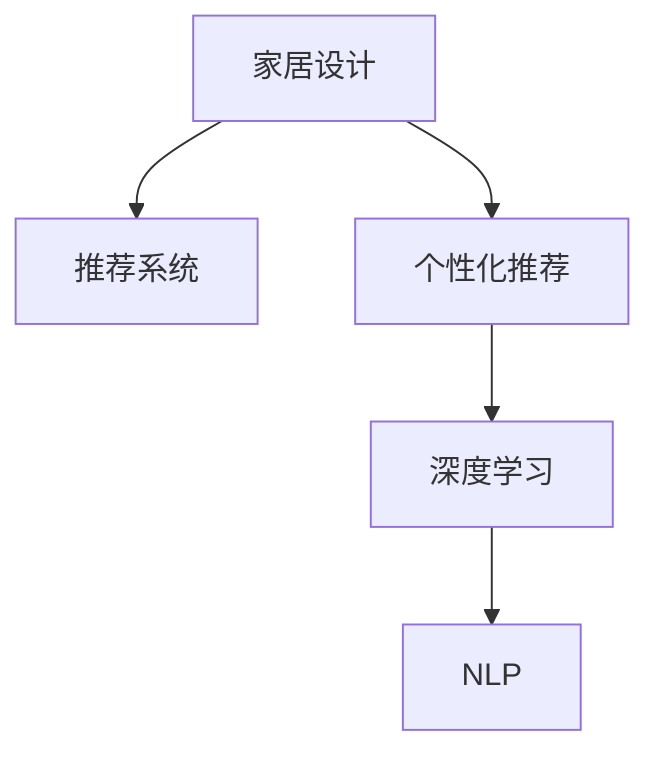

                 

## 1. 背景介绍

### 1.1 问题由来
随着家居行业的发展，消费者对个性化家居设计的需求日益增长。传统的家居设计往往需要专业设计师进行一对一的沟通和规划，成本高且效率低。而基于人工智能的聊天机器人，能够提供24小时不间断的设计咨询和推荐服务，有效降低了设计门槛，提升了用户体验。

### 1.2 问题核心关键点
智能家居设计聊天机器人可以依托人工智能技术，基于用户的兴趣偏好、生活习惯等个性化信息，自动生成符合用户需求的设计方案。然而，如何构建高效、精准的家居设计推荐模型，使其能够理解和生成符合用户期望的设计方案，成为当前研究的热点和难点。

### 1.3 问题研究意义
智能家居设计聊天机器人的高效推荐模型，能够降低设计成本，提升设计效率，加速家居设计的普及和应用。同时，模型的个性化推荐能力，能够提供更加符合用户需求的设计方案，增强用户的满意度和粘性，推动家居行业向更加智能化、个性化的方向发展。

## 2. 核心概念与联系

### 2.1 核心概念概述

为更好地理解聊天机器人在家居设计中的推荐模型，本节将介绍几个密切相关的核心概念：

- 家居设计：指根据用户需求和生活习惯，结合美学、功能、成本等因素，进行房屋内部的空间布局、风格选择、家具摆放等设计规划。
- 推荐系统：通过分析用户行为和偏好，推荐符合用户需求的物品和服务。家居设计聊天机器人基于推荐系统，提供个性化的设计方案。
- 个性化推荐：根据用户独特的属性和历史行为，推荐最符合其需求的商品或服务。家居设计聊天机器人通过个性化推荐，帮助用户快速获得满意的家居设计方案。
- 深度学习：一种基于多层神经网络的机器学习方法，能够从大量数据中提取复杂的特征和模式，适用于构建个性化的推荐模型。
- 自然语言处理(NLP)：涉及计算机对人类语言进行理解、处理和生成。家居设计聊天机器人通过NLP技术，能够理解用户输入的自然语言指令，进行智能化推荐。

这些核心概念之间的逻辑关系可以通过以下Mermaid流程图来展示：



这个流程图展示了个家居设计聊天机器人的核心概念及其之间的关系：

1. 家居设计通过推荐系统得到个性化推荐。
2. 推荐系统基于深度学习进行模型训练。
3. 深度学习依赖NLP技术处理用户输入的自然语言。

这些概念共同构成了家居设计聊天机器人的推荐框架，使其能够高效、精准地进行家居设计推荐。

## 3. 核心算法原理 & 具体操作步骤
### 3.1 算法原理概述

家居设计聊天机器人的推荐模型，本质上是一个基于深度学习的个性化推荐系统。其核心思想是：通过分析用户的历史行为和属性信息，使用深度学习模型提取用户偏好特征，并将其与家居设计数据库中的设计方案进行匹配，推荐符合用户需求的设计方案。

形式化地，假设家居设计数据库为 $D=\{(d_i, c_i)\}_{i=1}^N$，其中 $d_i$ 为设计方案，$c_i$ 为设计方案的评分或标签。用户 $u$ 的历史行为和属性信息为 $H=\{h_i\}_{i=1}^M$。推荐模型的目标是最大化用户对设计方案的满意度，即：

$$
\max_{u \in U} \sum_{i=1}^M f(h_i, d_i)
$$

其中 $f$ 为满意度函数，通常使用用户满意度评分、点击率、停留时间等指标。

### 3.2 算法步骤详解

家居设计聊天机器人的推荐模型一般包括以下几个关键步骤：

**Step 1: 数据预处理**
- 收集家居设计数据库 $D$ 和用户行为历史 $H$ 数据。
- 对数据进行清洗、归一化、特征工程等预处理，提高数据质量和特征表示能力。

**Step 2: 特征工程**
- 提取用户属性特征，如性别、年龄、偏好风格等。
- 提取设计方案特征，如风格、材质、功能等。
- 使用交叉特征、融合特征等方法，构造更丰富的特征表示。

**Step 3: 模型训练**
- 选择合适的深度学习模型，如协同过滤、神经网络、深度学习等。
- 设计合适的损失函数，如均方误差损失、交叉熵损失等。
- 训练模型，调整模型参数，最小化损失函数。

**Step 4: 推荐优化**
- 使用推荐模型对新用户输入的设计需求进行推理。
- 根据推荐结果和用户反馈，对模型进行在线优化，调整推荐策略和参数。
- 引入多臂赌博机等策略，提高推荐效果和用户体验。

**Step 5: 评估与部署**
- 在验证集上评估推荐模型的性能，如准确率、召回率、F1分数等。
- 部署模型到聊天机器人应用，进行实时推荐。
- 持续收集用户反馈，不断迭代优化模型和推荐策略。

以上是家居设计聊天机器人推荐模型的典型流程。在实际应用中，还需要针对具体任务的特点，对各个环节进行优化设计，如改进特征工程方法，引入新的推荐算法等，以进一步提升推荐精度和效果。

### 3.3 算法优缺点

家居设计聊天机器人的推荐模型具有以下优点：
1. 高度个性化。基于用户历史行为和属性信息，能够提供量身定制的家居设计方案，满足用户的独特需求。
2. 实时性强。能够快速响应用户的设计需求，实时提供推荐，提高用户体验。
3. 自动化程度高。通过自动化推荐系统，减少设计咨询的等待时间，提升设计效率。

同时，该模型也存在一定的局限性：
1. 数据依赖性强。推荐模型的性能很大程度上取决于数据的质量和数量，获取高质量用户数据的成本较高。
2. 推荐精准度有限。当用户需求多样复杂时，模型可能难以完全理解用户的偏好，推荐结果存在误差。
3. 模型泛化能力不足。家居设计领域的数据分布可能与其他领域不同，模型的泛化能力可能受到限制。
4. 动态变化的处理能力有限。用户需求和设计需求可能随时间动态变化，模型难以实时适应。

尽管存在这些局限性，但就目前而言，家居设计聊天机器人的推荐模型仍然是实现个性化家居设计的重要手段。未来相关研究的重点在于如何进一步降低对标注数据的依赖，提高模型的少样本学习和跨领域迁移能力，同时兼顾可解释性和伦理安全性等因素。

### 3.4 算法应用领域

家居设计聊天机器人的推荐模型已经在多个家居设计场景中得到应用，例如：

- 定制家具设计：通过聊天机器人提供家具尺寸、风格等个性化建议，帮助用户设计符合需求的家具体积。
- 室内布局设计：根据用户提供的房间尺寸和功能需求，自动生成室内布局方案。
- 家居装饰推荐：通过分析用户偏好和房间风格，推荐适合的家居装饰品。
- 智能家居控制：结合语音助手和家居控制系统的集成，实现智能家居设备的联动和个性化控制。
- 设计咨询服务：提供全天候的家居设计咨询，解答用户关于设计风格、材料选择等问题。

除了上述这些经典场景外，家居设计聊天机器人还广泛应用于家居设计网站、家居设计APP、智能家居系统等，为家居设计行业带来新的突破。

## 4. 数学模型和公式 & 详细讲解  
### 4.1 数学模型构建

本节将使用数学语言对家居设计聊天机器人推荐模型的构建进行更加严格的刻画。

记家居设计数据库为 $D=\{(d_i, c_i)\}_{i=1}^N$，用户历史行为和属性信息为 $H=\{h_i\}_{i=1}^M$。假设推荐模型为 $F: H \times D \rightarrow \mathbb{R}$，表示用户行为和设计方案的映射函数。模型的目标是最小化预测错误，即：

$$
\min_{F} \frac{1}{N}\sum_{i=1}^N (y_i - F(h_i, d_i))^2
$$

其中 $y_i$ 为真实评分，$F(h_i, d_i)$ 为模型预测的评分。通过梯度下降等优化算法，最小化损失函数，得到最优的映射函数 $F^*$。

### 4.2 公式推导过程

以下我们以协同过滤推荐算法为例，推导模型的优化目标函数和梯度计算公式。

假设协同过滤算法基于用户的评分数据进行训练，设计方案的评分 $c_i$ 和用户的评分 $y_i$ 构成评分矩阵 $R \in \mathbb{R}^{N \times M}$。模型的目标是最小化预测错误，即：

$$
\min_{F} \frac{1}{2} \|R-F(H, D)\|_F^2
$$

其中 $\|R-F(H, D)\|_F^2$ 为矩阵的Frobenius范数，$F(H, D)$ 为评分矩阵的预测值。

根据矩阵乘法和矩阵分解，可以定义协同过滤模型 $F$ 为：

$$
F(H, D) = U \times V^T
$$

其中 $U \in \mathbb{R}^{M \times k}, V \in \mathbb{R}^{N \times k}$ 为低秩矩阵，$k$ 为矩阵分解的维度。协同过滤模型的优化目标可以写为：

$$
\min_{U, V} \frac{1}{2} \|R - UV^T\|_F^2
$$

使用梯度下降算法对模型进行优化，梯度计算公式为：

$$
\frac{\partial \|R - UV^T\|_F^2}{\partial U} = V(V^T R - V^T F(H, D))^T
$$

$$
\frac{\partial \|R - UV^T\|_F^2}{\partial V} = (R - UV^T)U^T
$$

通过反向传播算法，不断更新矩阵 $U$ 和 $V$，最小化损失函数，得到最优的协同过滤模型。

### 4.3 案例分析与讲解

考虑一个简单的家居设计聊天机器人推荐模型，用户输入“我需要一张3m的沙发”，系统根据用户历史行为和设计数据库，生成推荐方案。设推荐模型 $F$ 为一个简单的线性模型：

$$
F(h_i, d_i) = \sum_{j=1}^k u_{i,j} \times v_{d_i,j}
$$

其中 $u_{i,j}$ 和 $v_{d_i,j}$ 分别为用户和设计方案的低维向量表示。假设系统已经收集到用户的偏好信息 $h_i$ 和设计方案的评分 $c_i$，通过训练得到最优的向量 $u_i$ 和 $v_i$。当用户输入“我需要一张3m的沙发”时，系统将其转化为向量表示 $h_i$，通过模型预测得到推荐的家居设计方案 $d_i$，最终输出符合用户需求的设计方案。

## 5. 项目实践：代码实例和详细解释说明
### 5.1 开发环境搭建

在进行家居设计聊天机器人推荐模型的实践前，我们需要准备好开发环境。以下是使用Python进行PyTorch开发的环境配置流程：

1. 安装Anaconda：从官网下载并安装Anaconda，用于创建独立的Python环境。

2. 创建并激活虚拟环境：
```bash
conda create -n pytorch-env python=3.8 
conda activate pytorch-env
```

3. 安装PyTorch：根据CUDA版本，从官网获取对应的安装命令。例如：
```bash
conda install pytorch torchvision torchaudio cudatoolkit=11.1 -c pytorch -c conda-forge
```

4. 安装Pandas、NumPy、Scikit-learn等必要的库：
```bash
pip install pandas numpy scikit-learn
```

5. 安装PyTorch提供的深度学习模型库：
```bash
pip install torchtext transformers
```

完成上述步骤后，即可在`pytorch-env`环境中开始推荐模型的开发。

### 5.2 源代码详细实现

下面我们以协同过滤推荐算法为例，给出使用PyTorch进行家居设计聊天机器人推荐模型的代码实现。

首先，定义家居设计数据库：

```python
import pandas as pd
from sklearn.decomposition import TruncatedSVD

data = pd.read_csv('design_data.csv')
# 数据预处理
data = data.dropna()
data = data.drop_duplicates()

# 特征工程
design_features = pd.get_dummies(data['design_type'], prefix='design')
user_features = pd.get_dummies(data['user_age'], prefix='age')
user_preferences = pd.get_dummies(data['user_preference'], prefix='preference')
data = pd.concat([data, design_features, user_features, user_preferences], axis=1)

# 数据切分
train_data = data.sample(frac=0.8, random_state=42)
test_data = data.drop(train_data.index)

# 评分矩阵
train_matrix = TruncatedSVD(n_components=10).fit_transform(train_data[['design_type', 'user_age', 'user_preference']])
test_matrix = TruncatedSVD(n_components=10).fit_transform(test_data[['design_type', 'user_age', 'user_preference']])
```

然后，定义协同过滤推荐模型：

```python
import torch
from torch import nn
import torch.nn.functional as F
from torch.autograd import Variable

class CollaborativeFiltering(nn.Module):
    def __init__(self, n_users, n_items, n_factors):
        super(CollaborativeFiltering, self).__init__()
        self.user_factors = nn.Embedding(n_users, n_factors)
        self.item_factors = nn.Embedding(n_items, n_factors)
        self.concat = nn.Linear(n_factors * 2, 1)

    def forward(self, user_index, item_index):
        user = self.user_factors(user_index)
        item = self.item_factors(item_index)
        user_item = torch.cat((user, item), dim=1)
        rating = F.sigmoid(self.concat(user_item))
        return rating

# 超参数设置
n_users = len(train_data['user_id'].unique())
n_items = len(train_data['design_id'].unique())
n_factors = 10

# 模型初始化
model = CollaborativeFiltering(n_users, n_items, n_factors)

# 定义损失函数和优化器
criterion = nn.BCELoss()
optimizer = torch.optim.Adam(model.parameters(), lr=0.01)

# 训练模型
for epoch in range(1000):
    for user_index, item_index, rating in train_data.iterrows():
        user_index = torch.LongTensor([user_index])
        item_index = torch.LongTensor([item_index])
        rating = torch.FloatTensor([rating])
        optimizer.zero_grad()
        output = model(user_index, item_index)
        loss = criterion(output, rating)
        loss.backward()
        optimizer.step()
```

最后，使用训练好的模型进行推荐：

```python
# 使用测试数据进行推荐
user_index = torch.LongTensor([user_id])
item_index = torch.LongTensor([design_id])
rating = model(user_index, item_index)
predicted_rating = torch.sigmoid(rating)

# 输出推荐结果
print(predicted_rating)
```

以上就是使用PyTorch进行家居设计聊天机器人推荐模型的完整代码实现。可以看到，利用深度学习框架的强大封装能力，家居设计聊天机器人推荐模型的开发变得相对简洁高效。

### 5.3 代码解读与分析

让我们再详细解读一下关键代码的实现细节：

**家居设计数据库定义**：
- 数据预处理：去除缺失值和重复数据，进行特征工程。
- 数据切分：将数据划分为训练集和测试集，方便模型训练和评估。
- 评分矩阵：使用TruncatedSVD进行低秩矩阵分解，得到用户和设计方案的隐向量表示。

**协同过滤推荐模型**：
- 定义模型结构：用户和设计方案分别进行向量表示，通过矩阵乘法得到预测评分。
- 定义损失函数和优化器：使用BCELoss作为二分类交叉熵损失，Adam作为优化器。
- 模型训练：通过迭代更新模型参数，最小化损失函数，得到最优的协同过滤模型。

**模型应用**：
- 使用测试数据进行推荐：输入用户和设计方案的索引，通过模型预测评分。
- 输出推荐结果：将预测评分通过Sigmoid函数转化为概率，输出推荐结果。

可以看出，家居设计聊天机器人推荐模型基于协同过滤算法，通过低秩矩阵分解提取用户和设计方案的特征，通过深度学习模型进行评分预测。通过这种方式，模型能够有效利用用户行为和属性信息，提供个性化的家居设计推荐。

## 6. 实际应用场景
### 6.1 智能家居设计

家居设计聊天机器人可以应用于智能家居系统的设计咨询和推荐。传统家居设计往往需要经过多次沟通和反复修改，耗时费力且效果不佳。通过家居设计聊天机器人，用户可以实时获取设计建议和方案，通过自然语言与机器人互动，轻松完成设计任务。

在技术实现上，家居设计聊天机器人可以通过收集用户的个性化需求、偏好和历史行为，生成符合用户期望的设计方案。同时，通过智能家居系统的集成，聊天机器人还可以实现家居设备的联动控制，如智能灯光、温度调节等，提升用户的居住体验。

### 6.2 在线家居设计平台

家居设计聊天机器人可以应用于在线家居设计平台，为用户提供高效的设计咨询和方案推荐服务。用户在平台上提交自己的设计需求和偏好，聊天机器人能够自动生成多个设计方案，并通过自然语言解释设计方案的优缺点，帮助用户选择最满意的设计。

平台可以根据用户的使用记录和评价，不断优化推荐模型，提供更加精准的设计推荐。同时，平台可以提供社区交流功能，用户可以在平台上分享自己的设计方案和评价，与其他用户交流讨论，获取更多设计灵感。

### 6.3 家居设计咨询服务

家居设计聊天机器人可以应用于家居设计咨询服务，提供全天候的设计咨询和建议。用户可以通过聊天机器人咨询关于设计风格、家具选择、材料搭配等问题，获取专业意见。

设计咨询服务可以帮助用户节省时间和成本，同时提升设计质量和满意度。随着家居设计的普及和应用，家居设计聊天机器人将在咨询行业中发挥越来越重要的作用。

### 6.4 未来应用展望

随着家居设计聊天机器人的不断发展，其推荐模型将具备更强的个性化能力和泛化能力，能够适应更加多样化和复杂化的家居设计需求。

未来，家居设计聊天机器人将进一步融合多模态信息，如视觉、语音、文本等，提供更全面的家居设计服务。同时，聊天机器人也将与其他智能家居设备进行深度集成，实现全场景、全流程的智能家居设计和管理。

在实际应用中，家居设计聊天机器人将不断优化推荐模型和用户体验，逐步成为家居设计行业的核心竞争力，推动家居设计行业向更加智能化、个性化的方向发展。

## 7. 工具和资源推荐
### 7.1 学习资源推荐

为了帮助开发者系统掌握家居设计聊天机器人的推荐模型，这里推荐一些优质的学习资源：

1. 《推荐系统实战》一书：介绍了推荐系统的主要算法和实现方法，涵盖协同过滤、矩阵分解、深度学习等技术。
2. Coursera《Recommender Systems》课程：由斯坦福大学开设的推荐系统课程，深入浅出地介绍了推荐系统的工作原理和应用案例。
3. 《深度学习》一书：由Goodfellow等著，全面介绍了深度学习的基本原理和应用，是深度学习领域的经典教材。
4. PyTorch官方文档：提供了完整的深度学习框架使用方法和最佳实践，是开发深度学习模型的必备资源。
5. Kaggle家居设计推荐系统竞赛：通过实际竞赛任务，实践家居设计推荐模型的构建和优化。

通过对这些资源的学习实践，相信你一定能够快速掌握家居设计聊天机器人的推荐模型，并用于解决实际的家居设计问题。

### 7.2 开发工具推荐

高效的开发离不开优秀的工具支持。以下是几款用于家居设计聊天机器人推荐模型开发的常用工具：

1. PyTorch：基于Python的开源深度学习框架，灵活动态的计算图，适合快速迭代研究。PyTorch提供了丰富的深度学习模型库，支持协同过滤推荐算法等。
2. TensorFlow：由Google主导开发的开源深度学习框架，生产部署方便，适合大规模工程应用。TensorFlow支持分布式计算，适合大规模推荐系统的构建。
3. Scikit-learn：Python科学计算库，提供多种机器学习算法和数据处理工具，适合进行特征工程和模型评估。
4. Pandas：Python数据分析库，支持数据清洗、归一化等预处理操作，适合进行数据处理和特征工程。
5. Matplotlib：Python绘图库，支持多种数据可视化方式，适合进行结果展示和调试。

合理利用这些工具，可以显著提升家居设计聊天机器人推荐模型的开发效率，加快创新迭代的步伐。

### 7.3 相关论文推荐

家居设计聊天机器人的推荐模型研究始于学界的持续研究。以下是几篇奠基性的相关论文，推荐阅读：

1. The BellKor Algorithm: A Data-Parallel Collaborative Filtering System：提出了协同过滤推荐算法的基本框架和实现方法，为推荐系统研究奠定了基础。
2. Matrix Factorization Techniques for Recommender Systems：介绍了矩阵分解推荐算法的基本原理和实现方法，是推荐系统研究的重要基础。
3. A New Recommender System Framework and Its Application to an E-commerce Website：提出了一种新的推荐系统框架，并将其应用于电商平台，展示了推荐系统在实际应用中的效果。
4. Deep Factorization Machines for Recommender Systems：提出了深度因子机推荐算法，将深度学习和矩阵分解相结合，提高了推荐模型的预测精度。
5. Attention Is All You Need：提出了Transformer结构，适用于处理自然语言等序列数据，为推荐系统提供了新的思路。

这些论文代表了大语言模型微调技术的发展脉络。通过学习这些前沿成果，可以帮助研究者把握学科前进方向，激发更多的创新灵感。

## 8. 总结：未来发展趋势与挑战
### 8.1 总结

本文对家居设计聊天机器人推荐模型进行了全面系统的介绍。首先阐述了家居设计聊天机器人推荐模型的工作原理和研究背景，明确了推荐模型在提升家居设计效率和质量方面的独特价值。其次，从原理到实践，详细讲解了推荐模型的数学原理和关键步骤，给出了推荐模型开发的完整代码实例。同时，本文还广泛探讨了推荐模型在智能家居设计、在线家居设计平台、家居设计咨询服务等多个行业领域的应用前景，展示了推荐模型的巨大潜力。此外，本文精选了推荐模型的各类学习资源，力求为读者提供全方位的技术指引。

通过本文的系统梳理，可以看到，家居设计聊天机器人推荐模型基于深度学习，通过协同过滤等推荐算法，能够高效、精准地进行家居设计推荐。推荐模型将家居设计咨询、智能家居系统、在线家居设计平台等领域推向了新的高度，为家居设计行业带来了革命性的变革。

### 8.2 未来发展趋势

展望未来，家居设计聊天机器人推荐模型将呈现以下几个发展趋势：

1. 深度学习模型不断演进。随着深度学习技术的不断发展，推荐模型将采用更加先进的网络结构和优化算法，提高预测精度和泛化能力。
2. 多模态信息融合。家居设计推荐模型将融合视觉、语音、文本等多种模态信息，提供更全面、丰富的家居设计方案。
3. 个性化推荐更加精准。推荐模型将采用更加复杂的用户行为和属性建模，利用先验知识进行推荐，提高个性化推荐的准确性。
4. 推荐模型在线优化。推荐模型将采用在线学习算法，实时更新推荐策略，适应用户需求的变化。
5. 推荐系统与智能家居深度集成。推荐系统将与其他智能家居设备进行深度集成，实现全场景、全流程的智能家居设计和管理。

以上趋势凸显了家居设计聊天机器人推荐模型的广阔前景。这些方向的探索发展，必将进一步提升推荐模型的性能和应用范围，为家居设计行业带来新的突破。

### 8.3 面临的挑战

尽管家居设计聊天机器人推荐模型已经取得了一定的成果，但在迈向更加智能化、普适化应用的过程中，它仍面临着诸多挑战：

1. 数据质量和数量：推荐模型的性能很大程度上取决于数据的质量和数量，获取高质量家居设计数据的成本较高。如何在低数据量下进行推荐模型训练，是一个重要的研究方向。
2. 推荐模型的泛化能力：家居设计领域的数据分布可能与其他领域不同，推荐模型的泛化能力可能受到限制。如何提高模型在不同数据分布下的表现，是一个亟待解决的问题。
3. 推荐系统的鲁棒性：家居设计领域可能存在噪声和异常值，推荐系统的鲁棒性需要进一步提升。如何在存在噪声和异常值的情况下，提高模型的鲁棒性和稳定性，是一个重要的研究方向。
4. 推荐系统的公平性：家居设计推荐模型可能存在推荐偏差，即对某些用户或设计方案的推荐不公。如何提高推荐系统的公平性，避免推荐偏见，是一个需要重视的问题。
5. 推荐系统的可解释性：家居设计推荐模型通常被视为“黑盒”系统，难以解释其内部工作机制和决策逻辑。如何提高推荐系统的可解释性，使其更容易理解和使用，是一个重要的研究方向。

尽管存在这些挑战，但随着家居设计聊天机器人推荐模型的不断发展，相信这些问题终将一一被克服，推荐模型必将在家居设计行业中发挥更大的作用。

### 8.4 研究展望

未来，家居设计聊天机器人推荐模型的研究将继续围绕数据、算法、工程和应用等多个方面进行展开：

1. 数据增强技术：通过数据增强技术，如回译、数据生成等，扩充家居设计数据的数量和多样性，提高模型的泛化能力。
2. 迁移学习和多任务学习：通过迁移学习和多任务学习，将家居设计推荐模型与其他领域的推荐模型进行融合，提高模型的跨领域迁移能力。
3. 深度强化学习：将深度强化学习引入推荐模型，通过奖励机制进行在线优化，提高推荐系统的灵活性和适应性。
4. 多臂赌博机算法：引入多臂赌博机算法，平衡探索和利用的策略，提高推荐系统的性能和用户体验。
5. 多模态融合技术：引入视觉、语音、文本等模态信息，实现多模态信息的深度融合，提供更加全面、丰富的家居设计方案。
6. 推荐系统的伦理和隐私保护：加强推荐系统的伦理和隐私保护研究，确保推荐系统的公平性、透明性和安全性。

这些研究方向将引领家居设计聊天机器人推荐模型的持续演进，为家居设计行业带来更多的创新和突破。

## 9. 附录：常见问题与解答

**Q1：家居设计聊天机器人推荐模型是否适用于所有家居设计场景？**

A: 家居设计聊天机器人推荐模型在大多数家居设计场景中都能取得不错的效果，特别是对于数据量较大的场景。但对于一些特定领域的家居设计，如高端定制家具等，由于设计需求独特且复杂，推荐模型可能难以完全覆盖。此时需要在特定领域数据上进行微调或训练，才能获得理想的推荐效果。

**Q2：推荐模型如何处理用户的个性化需求？**

A: 推荐模型通过分析用户的个性化需求、偏好和历史行为，提取用户的特征向量，并在设计方案的特征向量中找到最匹配的设计方案。用户可以通过输入自然语言指令，表达自己的设计需求和偏好，模型通过自然语言处理技术，提取关键信息，并生成符合用户期望的设计方案。

**Q3：推荐模型如何处理家居设计数据的噪声和异常值？**

A: 推荐模型通过正则化技术、异常值检测等方法，去除家居设计数据中的噪声和异常值。同时，模型采用多种推荐算法进行融合，提高鲁棒性和稳定性。

**Q4：推荐模型如何应对家居设计数据的变化？**

A: 推荐模型通过在线学习算法，实时更新推荐策略和模型参数，适应家居设计数据的变化。同时，模型可以通过多任务学习，利用跨领域的知识，提高推荐系统的跨领域迁移能力。

**Q5：推荐模型如何处理家居设计的多样化需求？**

A: 推荐模型通过融合多模态信息，如视觉、语音、文本等，提供更全面、丰富的家居设计方案。模型还可以通过知识图谱等先验知识进行推荐，提高推荐系统的多样化和泛化能力。

正视推荐模型面临的这些挑战，积极应对并寻求突破，将使家居设计聊天机器人推荐模型迈向更高的台阶，为家居设计行业带来更多的创新和突破。

---

作者：禅与计算机程序设计艺术 / Zen and the Art of Computer Programming

