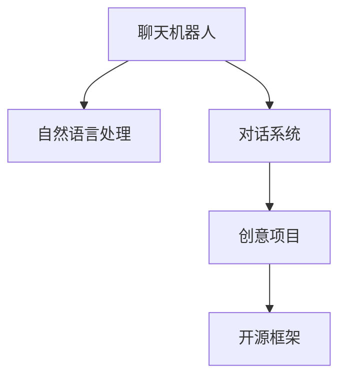

                 

# 聊天机器人手工艺：创意项目灵感和指导

> 关键词：聊天机器人,自然语言处理,NLP,对话系统,创意项目,开源框架

## 1. 背景介绍

在数字化时代，聊天机器人已经成为我们日常交流不可或缺的一部分。从简单的客服机器人，到复杂的情境对话系统，再到智能化的私人助理，聊天机器人的应用场景正不断扩展。然而，要构建一个高效、自然、富有创意的聊天机器人，并非易事。本文旨在深入探索聊天机器人的开发与优化，分享一系列创意项目和指导，助你解锁聊天机器人的手工艺精髓。

## 2. 核心概念与联系

### 2.1 核心概念概述

为更准确地理解聊天机器人开发的流程与关键技术，本节将详细介绍相关核心概念：

- **聊天机器人(Chatbot)**：一种能够通过自然语言理解用户的意图，并提供相应响应的软件。聊天机器人可以基于规则、模板、机器学习等技术实现。

- **自然语言处理(Natural Language Processing, NLP)**：涉及计算机对人类语言进行理解、处理和生成的一系列技术，是构建聊天机器人的基础。

- **对话系统(Dialogue System)**：指能够模拟人机交互的系统，通过多轮对话完成信息交换、问题解答等任务。

- **创意项目(Creative Project)**：在聊天机器人开发中，结合特定场景或需求，创新性地设计对话逻辑、生成对话内容的项目。

- **开源框架(Open Source Framework)**：如TensorFlow、PyTorch、Rasa等，提供了便捷的工具和模块，助力开发者高效构建聊天机器人。

### 2.2 核心概念原理和架构的 Mermaid 流程图



此流程图展示了聊天机器人开发的基本流程：从自然语言处理技术获取用户输入，经过对话系统进行多轮对话处理，结合创意项目实现对话逻辑与内容生成，最终通过开源框架完成系统实现。

## 3. 核心算法原理 & 具体操作步骤

### 3.1 算法原理概述

聊天机器人的核心在于其对话系统，这一系统通过以下步骤实现人机交互：

1. **理解**：使用自然语言处理技术解析用户输入，抽取关键信息。
2. **生成**：根据理解结果，生成响应内容。
3. **反馈**：展示机器人的回应，并等待下一次用户输入。

对话系统的构建通常基于以下算法原理：

- **序列到序列模型(Sequence-to-Sequence, Seq2Seq)**：一种端到端的模型，由编码器和解码器组成，主要用于机器翻译和对话系统。
- **注意力机制(Attention Mechanism)**：在解码时，根据编码器的上下文信息分配权重，确保生成的文本更加连贯和相关。
- **Transformer模型**：一种基于自注意力机制的模型，能够高效处理长序列数据，特别适用于大型语言模型。

### 3.2 算法步骤详解

构建聊天机器人的主要步骤如下：

#### 3.2.1 数据准备

- **收集语料**：收集训练数据，确保数据的多样性和覆盖性，包括对话历史、常见问题及答案等。
- **数据预处理**：清洗数据，去除噪声，分词、标注意图、实体等，转换为模型可用的格式。

#### 3.2.2 模型选择与训练

- **选择模型**：根据项目需求选择合适的对话模型，如Seq2Seq、Transformer等。
- **训练模型**：使用收集的数据对模型进行训练，调整超参数（如学习率、批次大小等），以提高模型性能。

#### 3.2.3 模型优化与评估

- **优化模型**：通过正则化、dropout等技术防止过拟合，使用早停等方法避免过拟合。
- **评估模型**：使用BLEU、ROUGE等指标评估模型生成的对话质量。

#### 3.2.4 部署与监控

- **部署模型**：将训练好的模型部署到服务器或云平台，提供API接口。
- **监控模型**：实时监控模型性能，及时调整和优化。

### 3.3 算法优缺点

**优点**：

- **自动化交互**：减少了人工干预，提高了效率。
- **全天候服务**：支持24/7服务，适应复杂业务场景。
- **灵活性高**：根据需求快速调整对话逻辑和内容。

**缺点**：

- **依赖数据**：模型的性能高度依赖于训练数据的质和量。
- **理解局限**：对于复杂或模糊的表达，模型可能理解错误或无法处理。
- **成本高**：构建和维护大规模对话系统的成本较高。

### 3.4 算法应用领域

聊天机器人广泛应用于多个领域，包括但不限于：

- **客户服务**：提供24小时客户支持，提升客户满意度。
- **医疗咨询**：提供在线诊断、预约、信息查询等服务。
- **教育辅导**：提供个性化学习建议和课程推荐。
- **电子商务**：通过智能客服提高销售转化率。
- **旅游信息**：提供旅游攻略、预订服务等。

## 4. 数学模型和公式 & 详细讲解 & 举例说明

### 4.1 数学模型构建

构建聊天机器人对话系统的数学模型，通常包括以下几个步骤：

1. **编码器(Encoder)**：将用户输入的句子转换为一系列向量表示。
2. **解码器(Decoder)**：根据编码器的输出，生成回复。
3. **注意力机制**：在解码器生成回复时，通过注意力机制关注编码器的相关信息。

### 4.2 公式推导过程

以Seq2Seq模型为例，其核心公式如下：

$$
y = f_{\theta}(x)
$$

其中 $x$ 为输入，$y$ 为输出，$f_{\theta}$ 为模型函数，$\theta$ 为模型参数。在Seq2Seq中，编码器将输入 $x$ 转换为上下文向量 $c$，解码器基于 $c$ 生成输出 $y$。

### 4.3 案例分析与讲解

以机器翻译为例，其输入为英文句子，输出为对应的中文翻译。构建Seq2Seq模型时，将英文句子转换为词向量，使用RNN或Transformer等模型编码，将编码后的向量作为上下文信息输入解码器，最终生成翻译结果。

## 5. 项目实践：代码实例和详细解释说明

### 5.1 开发环境搭建

构建聊天机器人项目，首先需搭建开发环境：

- **安装Python和相关库**：使用pip安装TensorFlow、Keras、NLTK等库。
- **设置虚拟环境**：使用venv创建虚拟环境，并激活。
- **准备数据集**：收集对话数据，并进行预处理。

### 5.2 源代码详细实现

以构建一个简单的问答系统为例，实现过程如下：

```python
import tensorflow as tf
from tensorflow.keras.layers import Input, LSTM, Dense
from tensorflow.keras.models import Model

# 定义输入和输出
input_seq = Input(shape=(None, ), name="input_seq")
output_seq = Dense(vocab_size, activation="softmax")(input_seq)

# 定义LSTM编码器和解码器
encoder_lstm = LSTM(latent_dim, return_state=True, name="encoder_lstm")
decoder_lstm = LSTM(latent_dim, return_sequences=True, return_state=True, name="decoder_lstm")

# 构建Seq2Seq模型
input_seq = Input(shape=(None, ), name="input_seq")
encoder_output, encoder_state = encoder_lstm(input_seq)
decoder_input = Input(shape=(None, ), name="decoder_input")
decoder_output, _, _ = decoder_lstm(decoder_input, initial_state=encoder_state)
decoder_output = Dense(vocab_size, activation="softmax")(decoder_output)

# 定义模型
model = Model(inputs=[input_seq, decoder_input], outputs=[decoder_output])
```

### 5.3 代码解读与分析

以上代码展示了使用LSTM构建Seq2Seq模型的基本框架。其中，`Input`用于定义输入层，`LSTM`用于定义编码器和解码器，`Dense`用于定义输出层。

### 5.4 运行结果展示

运行模型后，可以通过API接口进行测试，输入一个英文句子，模型会输出相应的中文翻译。

## 6. 实际应用场景

### 6.1 智能客服系统

智能客服系统通过聊天机器人实现自动化客户服务，提高了服务效率和客户满意度。应用场景包括在线客服、电话客服等。

**具体实现**：
- **数据收集**：收集历史客服记录，标注问题与答案。
- **模型训练**：使用Seq2Seq模型对数据进行训练。
- **系统部署**：将训练好的模型部署到客服平台，提供自然语言理解与回复功能。

**效果评估**：
- **准确率**：通过BLEU等指标评估模型的翻译准确率。
- **响应时间**：系统响应时间作为重要指标，影响用户体验。
- **用户满意度**：用户反馈和满意度调查，评估系统效果。

### 6.2 医疗咨询系统

医疗咨询系统通过聊天机器人提供在线医疗咨询，帮助用户进行初步诊断和治疗建议。

**具体实现**：
- **数据收集**：收集医疗咨询数据，包括常见问题与答案。
- **模型训练**：使用Transformer等模型对数据进行训练。
- **系统部署**：将训练好的模型部署到医疗咨询平台，提供自然语言理解与回复功能。

**效果评估**：
- **准确率**：通过准确率评估模型的诊断能力。
- **可靠性**：模型的诊断结果是否与医生建议一致。
- **用户体验**：用户反馈和满意度调查，评估系统效果。

### 6.3 教育辅导系统

教育辅导系统通过聊天机器人提供个性化学习建议和课程推荐，提高学习效率和质量。

**具体实现**：
- **数据收集**：收集学生的学习数据，包括历史成绩、兴趣等。
- **模型训练**：使用深度学习模型对数据进行训练。
- **系统部署**：将训练好的模型部署到教育平台，提供个性化推荐功能。

**效果评估**：
- **推荐准确率**：通过推荐准确率评估模型的推荐能力。
- **学习效果**：学生的学习效果和进步情况。
- **用户体验**：用户反馈和满意度调查，评估系统效果。

### 6.4 未来应用展望

未来，聊天机器人将在更多领域发挥重要作用，带来新的业务机遇和用户体验。

- **多模态交互**：结合语音、图像等多模态数据，实现更丰富的用户交互。
- **情感分析**：通过情感分析，提供更加人性化的服务。
- **智能推荐**：结合个性化推荐算法，提供更加精准的推荐服务。
- **多语言支持**：支持多种语言，拓展国际市场。
- **知识图谱**：结合知识图谱，提供更加全面和深入的信息查询和推荐。

## 7. 工具和资源推荐

### 7.1 学习资源推荐

为了帮助开发者系统掌握聊天机器人开发的理论基础和实践技巧，这里推荐一些优质的学习资源：

- **深度学习入门**：斯坦福大学《CS231n: Convolutional Neural Networks for Visual Recognition》课程，介绍深度学习的基础知识和应用。
- **NLP实践指南**：Coursera《Natural Language Processing with TensorFlow》课程，涵盖自然语言处理的基础和实践。
- **TensorFlow官方文档**：提供丰富的代码示例和API文档，帮助开发者快速上手TensorFlow。
- **Keras官方文档**：提供简单易用的API，支持快速搭建和训练深度学习模型。
- **Rasa官方文档**：Rasa是一个开源的对话系统，提供详细的文档和示例，助力开发者构建聊天机器人。

### 7.2 开发工具推荐

聊天机器人开发需要借助一系列工具和框架，提高开发效率和模型效果。以下是几款常用的开发工具：

- **TensorFlow**：由Google开发，支持构建深度学习模型，功能强大，社区活跃。
- **PyTorch**：由Facebook开发，支持动态计算图，灵活易用。
- **Keras**：基于TensorFlow和Theano，提供简单易用的API，适合快速搭建模型。
- **Rasa**：开源的对话系统框架，支持NLU、对话管理、意图识别等功能。
- **Microsoft Bot Framework**：微软提供的聊天机器人开发平台，支持多种语言和渠道。

### 7.3 相关论文推荐

聊天机器人技术的发展离不开学界的研究和探索。以下是几篇奠基性的相关论文，推荐阅读：

- **Seq2Seq模型的研究**：Cho E. et al., "Learning Phrase Representations using RNN Encoder-Decoder for Statistical Machine Translation." 2014.
- **Transformer模型的研究**：Vaswani A. et al., "Attention is All You Need." 2017.
- **多模态交互的研究**：Zhou X. et al., "Multimodal Multi-Task Learning for Cross-modal Sentiment Analysis." 2018.
- **知识图谱的应用研究**：Bordes A. et al., "Translating Embeddings for Learning Language Representations." 2014.

## 8. 总结：未来发展趋势与挑战

### 8.1 研究成果总结

聊天机器人技术在过去几年中取得了显著进步，其在客户服务、医疗咨询、教育辅导等多个领域展现了广泛的应用前景。通过自然语言处理技术和深度学习模型，聊天机器人能够理解和生成自然语言，实现高效的人机交互。

### 8.2 未来发展趋势

展望未来，聊天机器人技术将呈现以下几个发展趋势：

1. **多模态交互**：结合语音、图像等多模态数据，实现更加丰富和人性化的用户交互。
2. **情感分析**：通过情感分析，提供更加人性化、个性化的服务。
3. **智能推荐**：结合个性化推荐算法，提供更加精准的信息推荐服务。
4. **多语言支持**：支持多种语言，拓展国际市场。
5. **知识图谱**：结合知识图谱，提供更加全面和深入的信息查询和推荐。

### 8.3 面临的挑战

尽管聊天机器人技术已经取得了显著进步，但在实现高性能、高可用性的系统时，仍然面临诸多挑战：

1. **数据依赖**：模型的性能高度依赖于训练数据的质和量，获取高质量数据成本较高。
2. **理解局限**：对于复杂或模糊的表达，模型可能理解错误或无法处理。
3. **成本高**：构建和维护大规模对话系统的成本较高。
4. **可解释性**：聊天机器人模型通常难以解释其内部工作机制和决策逻辑，缺乏可解释性。
5. **安全性**：聊天机器人可能被用于传播恶意信息或欺诈，安全性问题亟待解决。

### 8.4 研究展望

面对聊天机器人面临的挑战，未来的研究需要在以下几个方面寻求新的突破：

1. **数据增强**：利用数据增强技术，提高模型的泛化能力。
2. **模型优化**：开发更加高效、灵活的对话模型，提升系统性能。
3. **知识融合**：结合知识图谱和专家知识，提高模型的准确性和鲁棒性。
4. **可解释性**：开发可解释性更强的模型，提高系统的可信度和透明度。
5. **安全防护**：结合安全技术和政策法规，保障聊天机器人的安全性。

## 9. 附录：常见问题与解答

**Q1：如何设计合适的对话逻辑？**

A: 设计合适的对话逻辑是聊天机器人的核心。可以通过以下步骤进行设计：
1. **明确用户意图**：理解用户可能提出的问题类型，如咨询、预约、投诉等。
2. **设计对话流程**：根据用户意图，设计多轮对话的流程，包括问题、回答、引出新话题等。
3. **编写对话脚本**：根据对话流程，编写对话脚本，确保逻辑连贯、语言自然。

**Q2：如何提升聊天机器人的理解能力？**

A: 提升聊天机器人的理解能力，可以通过以下方法：
1. **增加数据量**：收集更多样化的对话数据，增加模型的泛化能力。
2. **优化模型结构**：使用更高级的模型结构，如Transformer、BERT等，提升模型性能。
3. **引入上下文信息**：在对话过程中，保留上下文信息，帮助模型更好地理解用户意图。
4. **结合多模态数据**：结合语音、图像等多模态数据，提升模型对复杂表达的理解能力。

**Q3：如何评估聊天机器人的性能？**

A: 评估聊天机器人的性能，可以通过以下指标：
1. **准确率**：通过BLEU、ROUGE等指标评估模型的翻译准确率。
2. **响应时间**：系统响应时间作为重要指标，影响用户体验。
3. **用户满意度**：用户反馈和满意度调查，评估系统效果。
4. **对话质量**：通过人工评估，评估模型的对话质量，包括流畅性、相关性等。

**Q4：如何实现个性化推荐？**

A: 实现个性化推荐，可以通过以下方法：
1. **数据收集**：收集用户的兴趣、行为等数据。
2. **模型训练**：使用深度学习模型对数据进行训练，生成个性化推荐。
3. **实时推荐**：结合用户当前行为，实时生成个性化推荐。
4. **反馈机制**：收集用户反馈，优化推荐算法。

总之，聊天机器人的开发与优化是一个不断迭代、不断优化的过程。开发者需根据具体需求，灵活运用各种技术和方法，构建高效、自然、富有创意的聊天机器人系统。相信随着技术的不断进步，聊天机器人将在更多领域大放异彩，为人类带来更便捷、更高效的交流体验。

---

作者：禅与计算机程序设计艺术 / Zen and the Art of Computer Programming

