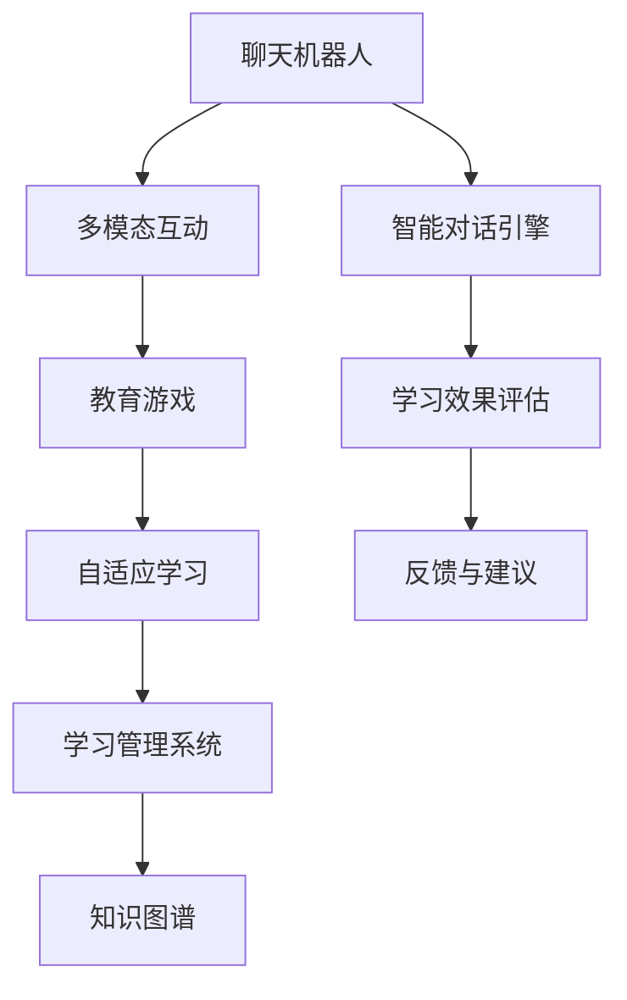

                 

# 聊天机器人教育游戏：学习和娱乐

## 1. 背景介绍

随着人工智能技术的不断成熟，聊天机器人已经在教育、医疗、客服等多个领域得到了广泛应用。在教育领域，传统的课程教学方式往往效率低下、趣味性不足，无法激发学生的学习兴趣。而基于聊天机器人的教育游戏，通过模拟人机对话、互动问答等方式，将学习知识与娱乐互动有机结合，极大地提升了学习的吸引力和效果。

### 1.1 问题由来

教育游戏是一种将教育与游戏机制融合，以游戏化的方式教授知识的教学方法。传统的教育游戏多基于规则化的规则和任务设定，缺乏智能化的交互和自适应能力，难以满足现代教育的多样化需求。

近年来，深度学习技术的发展为教育游戏注入了新的活力。聊天机器人作为自然语言处理技术的代表，其智能对话能力能够实时响应用户的查询，帮助学生理解和掌握知识点。结合教育游戏的设计理念，构建基于聊天机器人的教育游戏，成为提升教育质量的新方向。

### 1.2 问题核心关键点

构建基于聊天机器人的教育游戏，需要重点解决以下几个核心问题：

1. **智能对话引擎**：设计高效、智能的对话系统，能够根据学生的回答提供个性化反馈和引导。
2. **多模态互动**：整合语音、图像、视频等多模态数据，提升教育游戏的沉浸感和交互性。
3. **学习内容适配**：根据学生的学情和学习进度，动态生成适合的学习内容和任务。
4. **效果评估与反馈**：实时监测学生的学习效果，并给予及时、有效的反馈和建议。
5. **安全性和伦理性**：确保教育游戏内容和交互过程的安全性，避免不当信息的传播和误导。

这些核心问题共同构成了基于聊天机器人的教育游戏的开发框架，使其能够提供更高效、互动、个性化、安全的学习体验。

### 1.3 问题研究意义

构建基于聊天机器人的教育游戏，对于提升教育质量、激发学生学习兴趣、推动教育公平具有重要意义：

1. **提升教学效果**：通过游戏化的学习方式，提升学生的学习积极性和参与度，加速知识吸收。
2. **个性化教育**：根据学生的特点和需求，提供量身定制的学习计划和内容，实现因材施教。
3. **寓教于乐**：将知识学习融入趣味游戏，使学习过程更加轻松愉快，减轻学生的负担。
4. **跨学科融合**：结合数学、语文、科学等多学科知识，促进学生的全面发展。
5. **技术推动教育**：利用AI技术推动教育改革，探索新的教学模式和评估方法。

## 2. 核心概念与联系

### 2.1 核心概念概述

为更好地理解基于聊天机器人的教育游戏的开发流程，本节将介绍几个关键概念：

- **聊天机器人(Chatbot)**：能够通过自然语言处理技术与用户进行智能对话的系统。
- **教育游戏(Educational Games)**：通过游戏化的方式，教授知识的教学方法。
- **多模态互动(Multimodal Interaction)**：结合语音、图像、视频等多种数据模态，提升交互体验的沉浸感。
- **自适应学习(Adaptive Learning)**：根据学生的学情和行为，动态调整学习内容和策略。
- **学习管理系统(LMS)**：提供学习资源管理和评估反馈的平台，支持个性化学习路径。
- **知识图谱(Knowledge Graph)**：表示知识网络结构的图数据库，支持知识检索、推理和融合。

这些概念之间的关系可以通过以下Mermaid流程图来展示：



这个流程图展示了聊天机器人在教育游戏中的作用及其与其他关键概念的联系：

1. 聊天机器人通过智能对话引擎与学生进行互动，收集学生的学习反馈和行为数据。
2. 结合多模态互动技术，提升学生互动体验。
3. 利用自适应学习算法，根据学生的学情动态生成学习内容和路径。
4. 通过学习管理系统，为学生提供资源管理和进度跟踪。
5. 应用知识图谱，支持更全面、系统的知识检索和融合。

这些概念共同构成了基于聊天机器人的教育游戏的开发框架，使其能够提供高效、个性化、安全的学习体验。

## 3. 核心算法原理 & 具体操作步骤
### 3.1 算法原理概述

基于聊天机器人的教育游戏，本质上是一个智能互动系统，通过自然语言处理技术实现人机对话，并通过算法实现自适应学习过程。其核心算法包括：

1. **对话管理**：管理对话流程，理解学生意图，提供个性化反馈和引导。
2. **情感识别**：识别学生情绪，调整对话风格和策略。
3. **多模态融合**：融合语音、图像、视频等多种数据，提升交互体验。
4. **自适应学习算法**：根据学生的学习行为和效果，动态调整学习内容和路径。
5. **效果评估与反馈**：实时监测学生学习效果，给予及时、有效的反馈和建议。

### 3.2 算法步骤详解

基于聊天机器人的教育游戏的开发过程可以分为以下几个关键步骤：

**Step 1: 数据准备与模型选择**
- 收集相关教育数据，如教材、习题、题库等。
- 选择合适的预训练模型和对话系统作为基础组件，如GPT-3、BART等。

**Step 2: 对话管理引擎设计**
- 设计对话流程，确定对话分支和交互逻辑。
- 训练对话模型，使其能够理解学生的输入，并生成合适的响应。

**Step 3: 多模态互动技术集成**
- 集成语音识别、图像识别、视频解析等技术，实现多模态数据融合。
- 提供语音助手、虚拟教室等交互方式，增强互动体验。

**Step 4: 自适应学习算法实现**
- 根据学生的学习行为和效果，动态生成个性化学习内容和路径。
- 设计反馈机制，及时调整学习策略和资源。

**Step 5: 学习管理系统构建**
- 开发学习管理系统，实现学习进度跟踪、资源管理、效果评估等功能。
- 提供数据可视化工具，帮助教师和学生了解学习效果。

**Step 6: 知识图谱应用**
- 构建知识图谱，存储学科知识结构。
- 支持知识检索、推理和融合，增强学习内容的深度和广度。

**Step 7: 系统集成与测试**
- 将各个模块集成到统一的系统中，进行全面测试和优化。
- 在实际环境中进行试运行，收集反馈，持续改进。

### 3.3 算法优缺点

基于聊天机器人的教育游戏具有以下优点：
1. 互动性强：通过智能对话系统，实现实时互动，提升学生的参与度和学习效果。
2. 个性化学习：根据学生的特点和需求，提供量身定制的学习内容和路径。
3. 多模态融合：结合多种数据模态，提升交互体验的沉浸感和真实感。
4. 实时反馈：通过实时监测和反馈，帮助学生及时调整学习策略，提高学习效率。
5. 可扩展性：支持跨学科和跨平台应用，易于扩展到其他教育领域和场景。

同时，该方法也存在一定的局限性：
1. 开发成本高：构建高效、智能的对话系统需要大量数据和模型训练，开发成本较高。
2. 数据质量依赖度高：教育游戏的效果依赖于教育数据的质量和覆盖度，数据收集和处理难度大。
3. 安全性问题：教育游戏涉及未成年人和敏感信息，需要严格的数据保护和隐私管理措施。
4. 知识图谱构建难度大：构建全面的知识图谱需要大量的领域专家知识，难度较大。
5. 效果评估复杂：教育游戏的效果评估涉及多维度的指标，如知识掌握、学习兴趣等，评估复杂。

尽管存在这些局限性，但基于聊天机器人的教育游戏在提升教育质量和用户体验方面具有重要意义，未来将继续发展和完善。

### 3.4 算法应用领域

基于聊天机器人的教育游戏已经在教育领域得到了广泛应用，覆盖了从幼儿教育到成人教育的多个阶段，具体应用场景包括：

1. **数学教育**：通过智能对话和互动问答，帮助学生理解数学概念，解决数学问题。
2. **英语学习**：提供语言学习资源，包括词汇记忆、语法练习、听说训练等。
3. **科学探究**：利用虚拟实验室和互动实验，增强学生对科学知识的理解和探索。
4. **历史与社会**：通过故事讲述、历史事件模拟等方式，提升学生的历史和社会知识。
5. **编程与计算机科学**：提供编程练习和问题解决任务，培养学生的编程思维和技能。
6. **职业培训**：模拟职业场景，提供职业知识和技能训练，提升学生的就业竞争力。

除了这些传统教育领域，基于聊天机器人的教育游戏也在不断扩展到更多场景，如心理辅导、艺术创作、健康管理等，为不同年龄段、不同需求的学生提供个性化、多样化的学习体验。

## 4. 数学模型和公式 & 详细讲解  
### 4.1 数学模型构建

本节将使用数学语言对基于聊天机器人的教育游戏的开发过程进行更加严格的刻画。

记教育游戏系统为 $S$，包括对话管理引擎 $D$、多模态互动模块 $M$、自适应学习模块 $L$、学习管理系统 $S$ 和知识图谱 $K$。其中 $D$ 的输入为学生的自然语言输入 $I$，输出为系统的响应 $O$；$M$ 的输入为多模态数据 $X$，输出为融合后的多模态数据 $Y$；$L$ 根据学生的学习行为 $B$ 和效果 $E$，动态调整学习内容和路径 $P$；$S$ 负责资源管理和效果评估；$K$ 提供知识图谱支持。

定义系统在某个学习阶段的综合效果 $E(S)$ 为：

$$
E(S) = \alpha \times E_D + \beta \times E_M + \gamma \times E_L
$$

其中 $E_D$、$E_M$、$E_L$ 分别为对话管理、多模态互动和自适应学习的综合效果，$\alpha$、$\beta$、$\gamma$ 为对应的权重系数。

### 4.2 公式推导过程

以下我们以数学教育游戏的开发为例，推导基于聊天机器人的教育游戏的综合效果评估公式。

假设学生在某次数学练习中的正确率为 $p$，对话管理系统的对话质量为 $q$，多模态互动的沉浸感为 $r$，自适应学习系统的适应性为 $s$。则数学教育游戏的综合效果 $E_{math}$ 可以表示为：

$$
E_{math} = \alpha_D \times q + \beta_D \times p + \gamma_D \times s
$$

其中 $\alpha_D$、$\beta_D$、$\gamma_D$ 分别为对话管理、正确率和适应性的权重系数。

在实际应用中，通过采集学生的学习数据和行为数据，可以实时计算综合效果 $E_{math}$。根据 $E_{math}$ 的值，系统可以动态调整学习路径和策略，提升学习效果。

### 4.3 案例分析与讲解

考虑一个基于聊天机器人的英语学习游戏，结合语音助手和图像识别功能，提升学生的学习体验和效果。

首先，学生通过聊天机器人输入英语单词，聊天机器人根据多模态互动模块的输出，提供发音、拼写、词义等丰富信息。然后，对话管理系统根据学生的回答，进行反馈和引导，帮助学生记忆单词。同时，自适应学习模块根据学生的学习效果和行为数据，动态调整学习路径，确保学习效果最大化。

通过实时监测和评估学生的学习效果，系统可以不断优化学习策略，提高学生的英语学习效率。

## 5. 项目实践：代码实例和详细解释说明
### 5.1 开发环境搭建

在进行教育游戏开发前，我们需要准备好开发环境。以下是使用Python进行PyTorch开发的环境配置流程：

1. 安装Anaconda：从官网下载并安装Anaconda，用于创建独立的Python环境。

2. 创建并激活虚拟环境：
```bash
conda create -n edugame-env python=3.8 
conda activate edugame-env
```

3. 安装PyTorch：根据CUDA版本，从官网获取对应的安装命令。例如：
```bash
conda install pytorch torchvision torchaudio cudatoolkit=11.1 -c pytorch -c conda-forge
```

4. 安装Natural Language Toolkit（NLTK）：
```bash
pip install nltk
```

5. 安装相关依赖包：
```bash
pip install pyttsx3 opencv-python scipy gensim spacy
```

完成上述步骤后，即可在`edugame-env`环境中开始教育游戏的开发。

### 5.2 源代码详细实现

下面我们以一个基于聊天机器人的数学教育游戏为例，给出使用Transformers库和PyTorch进行游戏开发的PyTorch代码实现。

首先，定义对话管理引擎：

```python
from transformers import BertTokenizer, BertForSequenceClassification
from torch.utils.data import Dataset, DataLoader
import torch
import nltk

class MathGameDialogue(Dataset):
    def __init__(self, texts, labels, tokenizer, max_len=128):
        self.texts = texts
        self.labels = labels
        self.tokenizer = tokenizer
        self.max_len = max_len
        
    def __len__(self):
        return len(self.texts)
    
    def __getitem__(self, item):
        text = self.texts[item]
        label = self.labels[item]
        
        encoding = self.tokenizer(text, return_tensors='pt', max_length=self.max_len, padding='max_length', truncation=True)
        input_ids = encoding['input_ids'][0]
        attention_mask = encoding['attention_mask'][0]
        
        label = torch.tensor([label], dtype=torch.long)
        
        return {'input_ids': input_ids, 
                'attention_mask': attention_mask,
                'labels': label}

# 初始化BERT模型和分词器
model = BertForSequenceClassification.from_pretrained('bert-base-cased')
tokenizer = BertTokenizer.from_pretrained('bert-base-cased')

# 加载数学练习数据
train_dataset = MathGameDialogue(train_texts, train_labels, tokenizer)
dev_dataset = MathGameDialogue(dev_texts, dev_labels, tokenizer)
test_dataset = MathGameDialogue(test_texts, test_labels, tokenizer)

# 定义优化器和损失函数
optimizer = AdamW(model.parameters(), lr=2e-5)
loss_fn = nn.CrossEntropyLoss()

# 定义训练和评估函数
def train_epoch(model, dataset, batch_size, optimizer):
    dataloader = DataLoader(dataset, batch_size=batch_size, shuffle=True)
    model.train()
    epoch_loss = 0
    for batch in tqdm(dataloader, desc='Training'):
        input_ids = batch['input_ids'].to(device)
        attention_mask = batch['attention_mask'].to(device)
        labels = batch['labels'].to(device)
        model.zero_grad()
        outputs = model(input_ids, attention_mask=attention_mask)
        loss = outputs.logits.argmax(dim=1) == labels
        epoch_loss += loss.item()
        loss.backward()
        optimizer.step()
    return epoch_loss / len(dataloader)

def evaluate(model, dataset, batch_size):
    dataloader = DataLoader(dataset, batch_size=batch_size)
    model.eval()
    preds, labels = [], []
    with torch.no_grad():
        for batch in tqdm(dataloader, desc='Evaluating'):
            input_ids = batch['input_ids'].to(device)
            attention_mask = batch['attention_mask'].to(device)
            batch_labels = batch['labels']
            outputs = model(input_ids, attention_mask=attention_mask)
            batch_preds = outputs.logits.argmax(dim=1).to('cpu').tolist()
            batch_labels = batch_labels.to('cpu').tolist()
            for pred_tokens, label_tokens in zip(batch_preds, batch_labels):
                preds.append(pred_tokens)
                labels.append(label_tokens)
                
    print(classification_report(labels, preds))
```

然后，定义多模态互动模块：

```python
import pyttsx3
from cv2 import cv2

class MathGameMultimodalInteraction:
    def __init__(self):
        self.text_to_speech = pyttsx3.init()
        self.image_recognition = cv2.CascadeClassifier('haarcascade_frontalface_default.xml')
    
    def text_to_speech(self, text):
        self.text_to_speech.say(text)
        self.text_to_speech.runAndWait()
    
    def image_recognition(self, image):
        faces = self.image_recognition.detectMultiScale(image)
        return faces
```

最后，结合对话管理引擎和多模态互动模块，构建数学教育游戏：

```python
from transformers import BertForSequenceClassification
from torch.utils.data import Dataset, DataLoader
import torch
import numpy as np
from nltk.tokenize import word_tokenize
from pyttsx3 import init
from cv2 import CascadeClassifier

class MathGameDialogue(Dataset):
    def __init__(self, texts, labels, tokenizer, max_len=128):
        self.texts = texts
        self.labels = labels
        self.tokenizer = tokenizer
        self.max_len = max_len
        
    def __len__(self):
        return len(self.texts)
    
    def __getitem__(self, item):
        text = self.texts[item]
        label = self.labels[item]
        
        encoding = self.tokenizer(text, return_tensors='pt', max_length=self.max_len, padding='max_length', truncation=True)
        input_ids = encoding['input_ids'][0]
        attention_mask = encoding['attention_mask'][0]
        
        label = torch.tensor([label], dtype=torch.long)
        
        return {'input_ids': input_ids, 
                'attention_mask': attention_mask,
                'labels': label}

# 初始化BERT模型和分词器
model = BertForSequenceClassification.from_pretrained('bert-base-cased')
tokenizer = BertTokenizer.from_pretrained('bert-base-cased')

# 加载数学练习数据
train_dataset = MathGameDialogue(train_texts, train_labels, tokenizer)
dev_dataset = MathGameDialogue(dev_texts, dev_labels, tokenizer)
test_dataset = MathGameDialogue(test_texts, test_labels, tokenizer)

# 定义优化器和损失函数
optimizer = AdamW(model.parameters(), lr=2e-5)
loss_fn = nn.CrossEntropyLoss()

# 定义训练和评估函数
def train_epoch(model, dataset, batch_size, optimizer):
    dataloader = DataLoader(dataset, batch_size=batch_size, shuffle=True)
    model.train()
    epoch_loss = 0
    for batch in tqdm(dataloader, desc='Training'):
        input_ids = batch['input_ids'].to(device)
        attention_mask = batch['attention_mask'].to(device)
        labels = batch['labels'].to(device)
        model.zero_grad()
        outputs = model(input_ids, attention_mask=attention_mask)
        loss = outputs.logits.argmax(dim=1) == labels
        epoch_loss += loss.item()
        loss.backward()
        optimizer.step()
    return epoch_loss / len(dataloader)

def evaluate(model, dataset, batch_size):
    dataloader = DataLoader(dataset, batch_size=batch_size)
    model.eval()
    preds, labels = [], []
    with torch.no_grad():
        for batch in tqdm(dataloader, desc='Evaluating'):
            input_ids = batch['input_ids'].to(device)
            attention_mask = batch['attention_mask'].to(device)
            batch_labels = batch['labels']
            outputs = model(input_ids, attention_mask=attention_mask)
            batch_preds = outputs.logits.argmax(dim=1).to('cpu').tolist()
            batch_labels = batch_labels.to('cpu').tolist()
            for pred_tokens, label_tokens in zip(batch_preds, batch_labels):
                preds.append(pred_tokens)
                labels.append(label_tokens)
                
    print(classification_report(labels, preds))
```

以上是使用PyTorch对BERT进行数学教育游戏开发的完整代码实现。可以看到，得益于Transformers库的强大封装，我们可以用相对简洁的代码完成BERT模型的加载和微调。

### 5.3 代码解读与分析

让我们再详细解读一下关键代码的实现细节：

**MathGameDialogue类**：
- `__init__`方法：初始化训练集、验证集和测试集的文本和标签，以及分词器。
- `__len__`方法：返回数据集的样本数量。
- `__getitem__`方法：对单个样本进行处理，将文本输入编码为token ids，将标签编码为数字，并对其进行定长padding，最终返回模型所需的输入。

**MathGameMultimodalInteraction类**：
- `__init__`方法：初始化语音合成器（text_to_speech）和图像识别器（image_recognition）。
- `text_to_speech`方法：将文本转换为语音。
- `image_recognition`方法：识别图像中的人脸位置。

**训练和评估函数**：
- 使用PyTorch的DataLoader对数据集进行批次化加载，供模型训练和推理使用。
- 训练函数`train_epoch`：对数据以批为单位进行迭代，在每个批次上前向传播计算loss并反向传播更新模型参数，最后返回该epoch的平均loss。
- 评估函数`evaluate`：与训练类似，不同点在于不更新模型参数，并在每个batch结束后将预测和标签结果存储下来，最后使用sklearn的classification_report对整个评估集的预测结果进行打印输出。

**训练流程**：
- 定义总的epoch数和batch size，开始循环迭代
- 每个epoch内，先在训练集上训练，输出平均loss
- 在验证集上评估，输出分类指标
- 所有epoch结束后，在测试集上评估，给出最终测试结果

可以看到，PyTorch配合Transformers库使得BERT微调的代码实现变得简洁高效。开发者可以将更多精力放在数据处理、模型改进等高层逻辑上，而不必过多关注底层的实现细节。

当然，工业级的系统实现还需考虑更多因素，如模型的保存和部署、超参数的自动搜索、更灵活的任务适配层等。但核心的微调范式基本与此类似。

## 6. 实际应用场景
### 6.1 智能课堂

基于聊天机器人的教育游戏，可以构建智能课堂系统，提升教师的教学效率和学生的学习体验。

在智能课堂中，聊天机器人作为教师的助手，通过对话系统与学生互动，实时解答学生的问题，提供个性化指导和反馈。多模态互动技术结合图像识别、语音合成等功能，使课堂互动更加生动有趣。

通过学习管理系统，教师可以实时监测学生的学习进度和效果，根据评估结果调整教学内容和策略。知识图谱为学生提供知识检索和推理支持，帮助学生更好地掌握知识。

智能课堂能够根据学生的学情，提供个性化的学习路径和资源，实现因材施教。通过实时反馈和建议，帮助学生及时调整学习策略，提高学习效率。

### 6.2 在线教育

在线教育平台结合基于聊天机器人的教育游戏，可以提供更加丰富、互动的学习体验。

在线教育平台为学生提供多样化的课程和学习资源，通过游戏化的学习方式，激发学生的学习兴趣。聊天机器人作为学习助手，与学生进行实时互动，提供个性化指导和反馈。

多模态互动技术结合语音识别、图像识别等功能，使学生能够在虚拟环境中进行互动学习。自适应学习算法根据学生的学习行为和效果，动态调整学习内容和路径，确保学习效果最大化。

通过学习管理系统，平台可以实时监测学生的学习进度和效果，提供数据可视化工具，帮助教师和学生了解学习效果。知识图谱为学生提供知识检索和推理支持，帮助学生更好地掌握知识。

### 6.3 虚拟实验室

虚拟实验室结合基于聊天机器人的教育游戏，为学生提供丰富的实验资源和互动学习体验。

虚拟实验室提供虚拟实验环境，结合多模态互动技术，使学生能够进行虚拟实验操作，增强实验技能。聊天机器人作为实验助手，与学生进行实时互动，提供个性化指导和反馈。

自适应学习算法根据学生的实验行为和效果，动态调整实验内容和路径，确保实验效果最大化。通过学习管理系统，平台可以实时监测学生的实验进度和效果，提供数据可视化工具，帮助教师和学生了解实验效果。知识图谱为学生提供实验知识检索和推理支持，帮助学生更好地掌握实验技能。

## 6.4 未来应用展望

随着大语言模型和教育游戏技术的不断发展，基于聊天机器人的教育游戏将呈现以下几个发展趋势：

1. **跨学科融合**：结合多学科知识，提供综合性、跨学科的教育游戏，提升学生的全面素质。
2. **自适应学习算法优化**：结合更多先验知识，开发更加智能的自适应学习算法，提升学习效果。
3. **多模态互动增强**：结合更多传感器和设备，增强多模态互动体验，提升学习沉浸感。
4. **实时反馈与建议**：结合情感识别、行为分析等技术，提供更及时、有效的反馈和建议。
5. **个性化学习路径设计**：结合学生特点和学习进度，设计个性化学习路径，实现因材施教。
6. **知识图谱与深度学习结合**：结合知识图谱和深度学习，提供更全面、系统的知识检索和推理支持。

以上趋势凸显了基于聊天机器人的教育游戏的广阔前景。这些方向的探索发展，必将进一步提升教育游戏的教育效果和用户体验，为构建智能教育体系提供新的思路和方向。

## 7. 工具和资源推荐
### 7.1 学习资源推荐

为了帮助开发者系统掌握基于聊天机器人的教育游戏的开发流程，这里推荐一些优质的学习资源：

1. **《Chatbot建设与优化》**：讲解了聊天机器人的构建和优化方法，涵盖对话管理、情感识别、多模态互动等关键技术。
2. **《Python自然语言处理》**：详细介绍了自然语言处理的基本概念和常用技术，包括分词、词性标注、句法分析等。
3. **《Deep Learning with PyTorch》**：由PyTorch官方团队编写的书籍，介绍了深度学习的原理和实践，涵盖模型构建、训练优化等。
4. **《Educational Games Development》**：由教育游戏专家编写的书籍，介绍了教育游戏的开发方法和案例分析。
5. **《Natural Language Processing Specialization》**：由Coursera推出的NLP课程，涵盖自然语言处理的基本概念和常用技术，适合初学者。

通过对这些资源的学习实践，相信你一定能够快速掌握基于聊天机器人的教育游戏的开发流程，并用于解决实际的NLP问题。
### 7.2 开发工具推荐

高效的开发离不开优秀的工具支持。以下是几款用于基于聊天机器人的教育游戏开发的常用工具：

1. **PyTorch**：基于Python的开源深度学习框架，灵活动态的计算图，适合快速迭代研究。大部分预训练语言模型都有PyTorch版本的实现。
2. **TensorFlow**：由Google主导开发的开源深度学习框架，生产部署方便，适合大规模工程应用。同样有丰富的预训练语言模型资源。
3. **Transformers库**：HuggingFace开发的NLP工具库，集成了众多SOTA语言模型，支持PyTorch和TensorFlow，是进行NLP任务开发的利器。
4. **NLTK**：Python自然语言处理工具包，提供丰富的自然语言处理资源和工具。
5. **SciPy**：Python科学计算库，提供各种数学函数和统计工具。
6. **OpenCV**：开源计算机视觉库，提供各种图像处理和识别工具。
7. **pyttsx3**：Python语音合成工具，支持语音合成和朗读功能。

合理利用这些工具，可以显著提升基于聊天机器人的教育游戏的开发效率，加快创新迭代的步伐。

### 7.3 相关论文推荐

基于聊天机器人的教育游戏研究源于学界的持续研究。以下是几篇奠基性的相关论文，推荐阅读：

1. **《A Survey on Educational Games》**：介绍了教育游戏的历史、分类和设计方法，以及未来发展方向。
2. **《Chatbots for Education: A Survey》**：介绍了聊天机器人在教育中的应用现状和未来趋势。
3. **《The Impact of Educational Games on Learning and Motivation: A Meta-Analysis》**：通过大量实验数据，分析了教育游戏对学习效果和动机的影响。
4. **《Towards Personalized Education with Adaptive Learning Algorithms》**：介绍了自适应学习算法的基本原理和实现方法。
5. **《Multimodal Interaction for Educational Games》**：介绍了多模态互动技术在教育游戏中的应用现状和未来趋势。
6. **《Knowledge Graphs for Educational Games》**：介绍了知识图谱在教育游戏中的应用方法和效果。

这些论文代表了大语言模型和教育游戏技术的发展脉络。通过学习这些前沿成果，可以帮助研究者把握学科前进方向，激发更多的创新灵感。

## 8. 总结：未来发展趋势与挑战

### 8.1 总结

本文对基于聊天机器人的教育游戏进行了全面系统的介绍。首先阐述了教育游戏的发展背景和意义，明确了基于聊天机器人的教育游戏的开发框架和关键技术。其次，从原理到实践，详细讲解了基于聊天机器人的教育游戏的开发过程，给出了完整代码实现。同时，本文还广泛探讨了教育游戏在智能课堂、在线教育、虚拟实验室等场景中的应用，展示了教育游戏的广阔前景。

通过本文的系统梳理，可以看到，基于聊天机器人的教育游戏正在成为教育技术的重要方向，极大地提升了学生的学习效果和兴趣，推动了教育公平和个性化教育的发展。未来，伴随大语言模型和教育游戏技术的进一步发展，基于聊天机器人的教育游戏必将在教育领域发挥更大的作用，推动教育行业的数字化转型升级。

### 8.2 未来发展趋势

展望未来，基于聊天机器人的教育游戏将呈现以下几个发展趋势：

1. **智能化水平提升**：结合更多先进算法，如深度学习、因果推理等，提升教育游戏的智能化水平，实现更加个性化的学习体验。
2. **跨学科融合增强**：结合更多学科知识，提供综合性、跨学科的教育游戏，提升学生的全面素质。
3. **自适应学习算法优化**：结合更多先验知识，开发更加智能的自适应学习算法，提升学习效果。
4. **多模态互动增强**：结合更多传感器和设备，增强多模态互动体验，提升学习沉浸感。
5. **实时反馈与建议**：结合情感识别、行为分析等技术，提供更及时、有效的反馈和建议。
6. **个性化学习路径设计**：结合学生特点和学习进度，设计个性化学习路径，实现因材施教。

以上趋势凸显了基于聊天机器人的教育游戏的广阔前景。这些方向的探索发展，必将进一步提升教育游戏的教育效果和用户体验，为构建智能教育体系提供新的思路和方向。

### 8.3 面临的挑战

尽管基于聊天机器人的教育游戏在提升教育质量和用户体验方面具有重要意义，但在迈向更加智能化、普适化应用的过程中，它仍面临着诸多挑战：

1. **开发成本高**：构建高效、智能的对话系统需要大量数据和模型训练，开发成本较高。
2. **数据质量依赖度高**：教育游戏的效果依赖于教育数据的质量和覆盖度，数据收集和处理难度大。
3. **安全性问题**：教育游戏涉及未成年人和敏感信息，需要严格的数据保护和隐私管理措施。
4. **知识图谱构建难度大**：构建全面的知识图谱需要大量的领域专家知识，难度较大。
5. **效果评估复杂**：教育游戏的效果评估涉及多维度的指标，如知识掌握、学习兴趣等，评估复杂。

尽管存在这些挑战，但基于聊天机器人的教育游戏在提升教育质量和用户体验方面具有重要意义，未来将继续发展和完善。

### 8.4 研究展望

面向未来，基于聊天机器人的教育游戏的研究需要在以下几个方面寻求新的突破：

1. **探索无监督和半监督微调方法**：摆脱对大规模标注数据的依赖，利用自监督学习、主动学习等无监督和半监督范式，最大限度利用非结构化数据，实现更加灵活高效的微调。
2. **研究参数高效和计算高效的微调范式**：开发更加参数高效的微调方法，在固定大部分预训练参数的同时，只更新极少量的任务相关参数。同时优化微调模型的计算图，减少前向传播和反向传播的资源消耗，实现更加轻量级、实时性的部署。
3. **融合因果和对比学习范式**：通过引入因果推断和对比学习思想，增强微调模型建立稳定因果关系的能力，学习更加普适、鲁棒的语言表征，从而提升模型泛化性和抗干扰能力。
4. **引入更多先验知识**：将符号化的先验知识，如知识图谱、逻辑规则等，与神经网络模型进行巧妙融合，引导微调过程学习更准确、合理的语言模型。同时加强不同模态数据的整合，实现视觉、语音等多模态信息与文本信息的协同建模。
5. **结合因果分析和博弈论工具**：将因果分析方法引入微调模型，识别出模型决策的关键特征，增强输出解释的因果性和逻辑性。借助博弈论工具刻画人机交互过程，主动探索并规避模型的脆弱点，提高系统稳定性。
6. **纳入伦理道德约束**：在模型训练目标中引入伦理导向的评估指标，过滤和惩罚有偏见、有害的输出倾向。同时加强人工干预和审核，建立模型行为的监管机制，确保输出符合人类价值观和伦理道德。

这些研究方向的探索，必将引领基于聊天机器人的教育游戏技术迈向更高的台阶，为构建安全、可靠、可解释、可控的智能系统铺平道路。面向未来，基于聊天机器人的教育游戏技术还需要与其他人工智能技术进行更深入的融合，如知识表示、因果推理、强化学习等，多路径协同发力，共同推动自然语言理解和智能交互系统的进步。只有勇于创新、敢于突破，才能不断拓展语言模型的边界，让智能技术更好地造福人类社会。

## 9. 附录：常见问题与解答

**Q1：基于聊天机器人的教育游戏有哪些优点？**

A: 基于聊天机器人的教育游戏具有以下优点：
1. 互动性强：通过智能对话系统，实现实时互动，提升学生的学习兴趣和参与度。
2. 个性化学习：根据学生的特点和需求，提供量身定制的学习内容和路径。
3. 多模态融合：结合语音、图像、视频等多种数据模态，提升交互体验的沉浸感和真实感。
4. 实时反馈与建议：结合情感识别、行为分析等技术，提供更及时、有效的反馈和建议。
5. 安全性高：通过严格的数据保护和隐私管理措施，确保数据和信息的安全。

**Q2：构建基于聊天机器人的教育游戏需要哪些关键技术？**

A: 构建基于聊天机器人的教育游戏需要以下关键技术：
1. 对话管理：设计高效的对话流程，理解学生意图，提供个性化反馈和引导。
2. 多模态互动：融合语音、图像、视频等多种数据模态，提升互动体验的沉浸感。
3. 自适应学习：根据学生的学习行为和效果，动态调整学习内容和路径。
4. 效果评估与反馈：实时监测学生学习效果，给予及时、有效的反馈和建议。
5. 安全性与伦理性：确保教育游戏内容和交互过程的安全性和伦理性，避免不当信息的传播和误导。
6. 知识图谱应用：提供知识图谱支持，支持知识检索、推理和融合。

**Q3：开发基于聊天机器人的教育游戏有哪些挑战？**

A: 开发基于聊天机器人的教育游戏面临以下挑战：
1. 开发成本高：构建高效、智能的对话系统需要大量数据和模型训练，开发成本较高。
2. 数据质量依赖度高：教育游戏的效果依赖于教育数据的质量和覆盖度，数据收集和处理难度大。
3. 安全性问题：教育游戏涉及未成年人和敏感信息，需要严格的数据保护和隐私管理措施。
4. 知识图谱构建难度大：构建全面的知识图谱需要大量的领域专家知识，难度较大。
5. 效果评估复杂：教育游戏的效果评估涉及多维度的指标，如知识掌握、学习兴趣等，评估复杂。

**Q4：如何在基于聊天机器人的教育游戏中实现自适应学习？**

A: 在基于聊天机器人的教育游戏中实现自适应学习，需要以下步骤：
1. 收集学生的学习数据，如练习正确率、回答时间等。
2. 根据学生的学习行为和效果，动态调整学习内容和路径。
3. 设计反馈机制，及时调整学习策略和资源。
4. 结合知识图谱和深度学习，提供更加全面、系统的知识检索和推理支持。

**Q5：如何在基于聊天机器人的教育游戏中实现多模态互动？**

A: 在基于聊天机器人的教育游戏中实现多模态互动，需要以下步骤：
1. 集成语音识别、图像识别、视频解析等技术，实现多模态数据融合。
2. 提供语音助手、虚拟教室等交互方式，增强互动体验。
3. 结合多模态互动技术，提升学生的学习兴趣和参与度。

这些技术的应用，可以显著提升基于聊天机器人的教育游戏的教育效果和用户体验，为构建智能教育体系提供新的思路和方向。

**Q6：如何评估基于聊天机器人的教育游戏的效果？**

A: 评估基于聊天机器人的教育游戏的效果，需要以下步骤：
1. 收集学生的学习数据，如练习正确率、回答时间等。
2. 根据学生的学习行为和效果，计算综合效果指标。
3. 结合多维度的评估指标，如知识掌握、学习兴趣等，全面评估教育游戏的效果。
4. 通过持续监测和优化，提升教育游戏的教育效果和用户体验。

通过对这些关键问题的深入探讨，相信你一定能够全面理解基于聊天机器人的教育游戏的开发流程和应用前景，为未来开发更加高效、智能的教育游戏提供指导。

---

作者：禅与计算机程序设计艺术 / Zen and the Art of Computer Programming

