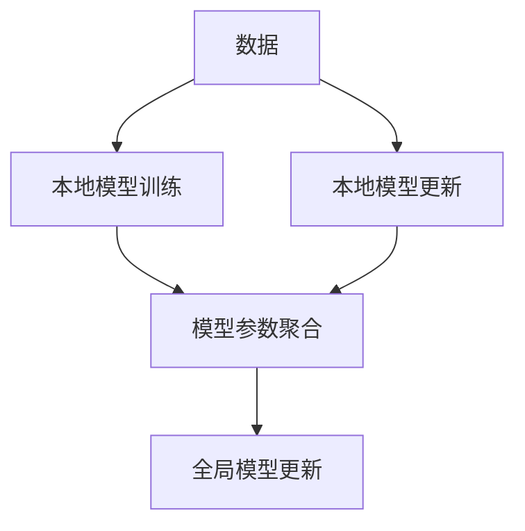

                 

## 1. 背景介绍

### 1.1 问题由来
在过去几十年中，机器学习特别是深度学习技术的飞速发展，让数据成为最为关键的生产要素。然而，数据分散在不同机构和组织手中，难以整合，单一机构收集的数据量往往不足以进行有效的训练，同时也面临隐私和安全性问题。

例如，医疗数据、用户行为数据、金融数据等，对于其拥有者来说是非常敏感且宝贵的资源。若直接将这些数据集中存储、处理，将会带来巨大的隐私泄露风险。因此，需要一种能够在数据分布式环境下进行机器学习，同时保护数据隐私的技术。

### 1.2 问题核心关键点
联邦学习(Federated Learning)就是在这一背景下产生的，它通过在本地数据上训练模型，并通过模型参数的联邦聚合，实现全局模型的优化，而不需要将所有数据汇集到中央服务器。

联邦学习强调在本地训练，同时通过分布式方式实现模型参数的共享和优化，从而在保护数据隐私的同时，实现高效的模型训练。这种方法在智能手机、物联网、医疗等领域都有广泛应用。

### 1.3 问题研究意义
联邦学习的研究意义主要体现在以下几个方面：

1. **隐私保护**：通过本地化训练，避免数据集中存储和传输，减少隐私泄露风险。
2. **数据安全性**：防止恶意攻击和数据篡改，提高系统整体安全性。
3. **模型效率**：通过分布式计算，提高训练速度，降低计算资源消耗。
4. **应用普适性**：联邦学习适用于各种分布式数据环境，包括移动设备、边缘计算等。
5. **模型鲁棒性**：由于数据多样性和异质性，联邦模型通常具有更好的泛化能力。

## 2. 核心概念与联系

### 2.1 核心概念概述

为更好地理解联邦学习，本节将介绍几个关键概念及其相互关系：

- **联邦学习(Federated Learning)**：一种分布式机器学习方法，通过本地设备或服务器训练模型，并利用分布式聚合算法优化模型参数，而不需要将数据集中到中央服务器。

- **中心化学习(Centralized Learning)**：传统机器学习方法，将数据汇集到中心服务器，集中进行模型训练和参数更新。

- **分布式学习(Distributed Learning)**：多个设备或服务器并行进行模型训练，通过定期同步模型参数，达到全局最优模型。

- **本地模型更新(Local Model Update)**：在本地数据上训练模型，更新模型参数，而不与中央服务器进行数据交换。

- **模型聚合(Model Aggregation)**：将多个本地模型的参数进行聚合，更新全局模型参数。

这些概念之间存在紧密联系：联邦学习结合了分布式学习和本地模型更新，将模型训练和参数更新分散到本地设备上，同时通过模型聚合实现全局最优。中心化学习则是集中式训练的代表，但随着数据隐私和安全性的需求，逐渐被联邦学习所取代。

### 2.2 核心概念原理和架构的 Mermaid 流程图(Mermaid 流程节点中不要有括号、逗号等特殊字符)



以上流程图展示了联邦学习的核心原理：数据分散在不同的本地设备上，每个设备独立进行模型训练，更新本地模型参数，然后将这些本地参数聚合，生成全局模型参数，更新全局模型。

## 3. 核心算法原理 & 具体操作步骤
### 3.1 算法原理概述

联邦学习的核心思想是，在多个本地设备或服务器上训练模型，并通过聚合这些本地模型的参数，得到全局最优模型。

形式化地，假设有一组本地设备$K=\{k_1,...,k_K\}$，每个设备上有本地数据$D_k=\{(x_i,y_i)\}_{i=1}^{n_k}$，每个设备上的模型为$f_k(x;\theta)$，其中$\theta$为模型参数。联邦学习的目标是最小化全局损失函数：

$$
\min_{\theta} \sum_{k=1}^K L_k(f_k(x_k;\theta),y_k)
$$

其中$L_k$为本地损失函数，表示在本地数据上模型输出的预测值与真实标签之间的差距。

### 3.2 算法步骤详解

联邦学习的具体步骤包括：

**Step 1: 初始化模型参数**
- 在每个本地设备上随机初始化模型参数$\theta^0_k$。

**Step 2: 本地训练**
- 每个本地设备使用本地数据$D_k$训练模型$f_k(x_k;\theta_k)$，并更新模型参数$\theta_k^{t+1} = \theta_k^t - \eta \nabla_{\theta_k}L_k(f_k(x_k;\theta_k),y_k)$，其中$\eta$为学习率。

**Step 3: 聚合模型参数**
- 在全局模型聚合中心，将每个本地设备上的模型参数$\theta_k^t$进行聚合，得到全局模型参数$\theta^{t+1}$。常见的聚合方法包括均值聚合、权重聚合、梯度聚合等。

**Step 4: 全局更新**
- 将全局模型参数$\theta^{t+1}$更新到所有本地设备上，为下一轮本地训练做准备。

**Step 5: 迭代优化**
- 重复上述步骤直到收敛或达到预设迭代轮数。

### 3.3 算法优缺点

联邦学习的优点包括：

1. **隐私保护**：无需集中存储和传输数据，减少隐私泄露风险。
2. **安全性强**：通过本地模型更新和聚合，防止恶意攻击和数据篡改。
3. **灵活性高**：适用于各种分布式数据环境，包括移动设备、边缘计算等。
4. **模型鲁棒**：多设备参与训练，提高了模型的泛化能力。

同时，联邦学习也存在一些缺点：

1. **通信开销大**：需要频繁进行模型参数的通信，增加网络负担。
2. **同步问题**：不同设备的计算能力和数据分布可能不均匀，导致同步困难。
3. **收敛速度慢**：相比于中心化学习，联邦学习需要更多迭代次数，收敛速度较慢。
4. **计算复杂性高**：分布式训练和聚合增加了计算复杂性，增加了实现难度。

### 3.4 算法应用领域

联邦学习在多个领域中得到了广泛应用：

- **移动应用**：智能手机、智能穿戴设备等移动设备上的数据处理，通过联邦学习可以在本地设备上训练模型，保护用户隐私。
- **医疗健康**：医疗数据分散在各个医院和诊所，通过联邦学习可以在不暴露患者数据的前提下，进行疾病预测和健康管理。
- **物联网**：分布式边缘设备上的数据处理，通过联邦学习可以在不集中数据的前提下，实现高效的数据分析。
- **金融服务**：银行和金融机构的数据分布广泛，通过联邦学习可以在保护客户隐私的前提下，进行金融风险分析和信用评估。
- **车联网**：车辆传感器数据分布广泛，通过联邦学习可以在保护隐私的前提下，进行交通流量分析和预测。

这些应用领域展示了联邦学习在保护数据隐私的同时，仍能进行高效模型训练的能力。未来，联邦学习将在更多场景中发挥其独特的优势，推动数据隐私保护技术的不断进步。

## 4. 数学模型和公式 & 详细讲解
### 4.1 数学模型构建

联邦学习的数学模型可以形式化为以下模型：

假设本地设备$k$上的数据为$D_k=\{(x_i,y_i)\}_{i=1}^{n_k}$，本地模型为$f_k(x_k;\theta_k)$，全局模型为$f(x;\theta)$，全局损失函数为$L(y,f(x))$。本地损失函数为$L_k(f_k(x_k;\theta_k),y_k)$。

本地设备上的训练过程如下：

$$
\theta_k^{t+1} = \theta_k^t - \eta \nabla_{\theta_k}L_k(f_k(x_k;\theta_k),y_k)
$$

其中$\eta$为学习率。

全局模型的更新过程如下：

$$
\theta^{t+1} = \text{Agg}(\theta_k^t)
$$

其中$\text{Agg}$为模型参数的聚合函数。

全局损失函数如下：

$$
L(y,f(x)) = \sum_{k=1}^K L_k(f_k(x_k;\theta_k),y_k)
$$

### 4.2 公式推导过程

以下推导联邦学习的核心数学公式：

设本地设备$k$上的数据为$D_k=\{(x_i,y_i)\}_{i=1}^{n_k}$，本地模型为$f_k(x_k;\theta_k)$，全局模型为$f(x;\theta)$，全局损失函数为$L(y,f(x))$。本地损失函数为$L_k(f_k(x_k;\theta_k),y_k)$。

本地设备上的训练过程如下：

$$
\theta_k^{t+1} = \theta_k^t - \eta \nabla_{\theta_k}L_k(f_k(x_k;\theta_k),y_k)
$$

其中$\eta$为学习率。

全局模型的更新过程如下：

$$
\theta^{t+1} = \text{Agg}(\theta_k^t)
$$

其中$\text{Agg}$为模型参数的聚合函数。

全局损失函数如下：

$$
L(y,f(x)) = \sum_{k=1}^K L_k(f_k(x_k;\theta_k),y_k)
$$

假设本地设备上的数据分布较为均匀，使用权重聚合法，每个本地设备的权重为$\alpha_k$。则全局模型的更新过程如下：

$$
\theta^{t+1} = \sum_{k=1}^K \alpha_k \theta_k^t
$$

其中$\alpha_k$为本地设备的权重。

### 4.3 案例分析与讲解

以一个简单的联邦学习应用为例，分析其效果：

假设有一个由两台本地设备组成的网络，每个设备上有500个数据样本。设备1和设备2上的数据分别如下：

- 设备1：{(x1,1), (x2,1), ..., (x500,1)} 
- 设备2：{(x1,2), (x2,2), ..., (x500,2)}

设备1和设备2的本地模型初始参数为$\theta_1^0$和$\theta_2^0$。假设每个设备上的损失函数为均方误差损失函数。

在第一个本地训练轮次中，设备1和设备2分别计算本地损失函数：

- 设备1：$\frac{1}{500} \sum_{i=1}^{500} (y_i - f_1(x_i;\theta_1^0))^2$
- 设备2：$\frac{1}{500} \sum_{i=1}^{500} (y_i - f_2(x_i;\theta_2^0))^2$

设备1和设备2分别更新模型参数：

- 设备1：$\theta_1^{1} = \theta_1^{0} - \eta \nabla_{\theta_1}L_1(f_1(x_1;\theta_1^{0}),y_1) + \nabla_{\theta_1}L_1(f_1(x_2;\theta_1^{0}),y_2)$
- 设备2：$\theta_2^{1} = \theta_2^{0} - \eta \nabla_{\theta_2}L_2(f_2(x_1;\theta_2^{0}),y_1) + \nabla_{\theta_2}L_2(f_2(x_2;\theta_2^{0}),y_2)$

假设每个设备上的权重为$\alpha_1=\alpha_2=\frac{1}{2}$。则全局模型参数更新为：

$$
\theta^{1} = \frac{1}{2}(\theta_1^{1} + \theta_2^{1})
$$

这个过程可以重复进行多次，直到收敛或达到预设迭代轮数。

通过这个例子可以看到，联邦学习能够在保护数据隐私的前提下，实现高效的模型训练。每个设备独立进行训练，同时通过全局参数更新，逐步逼近全局最优模型。

## 5. 项目实践：代码实例和详细解释说明
### 5.1 开发环境搭建

在进行联邦学习实践前，我们需要准备好开发环境。以下是使用Python进行TensorFlow实现联邦学习的开发环境配置流程：

1. 安装Anaconda：从官网下载并安装Anaconda，用于创建独立的Python环境。

2. 创建并激活虚拟环境：
```bash
conda create -n federated-env python=3.8 
conda activate federated-env
```

3. 安装TensorFlow和联邦学习库：
```bash
pip install tensorflow
pip install federated-learning
```

4. 安装各类工具包：
```bash
pip install numpy pandas scikit-learn matplotlib tqdm jupyter notebook ipython
```

完成上述步骤后，即可在`federated-env`环境中开始联邦学习实践。

### 5.2 源代码详细实现

下面我们以一个简单的联邦学习应用为例，给出使用TensorFlow实现联邦学习的完整代码实现。

首先，定义联邦学习环境：

```python
from federated_learning.python.argparser import parse_args
from federated_learning.python.coordinator import MultiClientCoordinator
from federated_learning.python.config import create_config

args = parse_args()
config = create_config(args)
coordinator = MultiClientCoordinator(config)
```

然后，定义模型和优化器：

```python
import tensorflow as tf
from tensorflow.keras import layers

def create_model():
    model = tf.keras.Sequential()
    model.add(layers.Dense(10, activation='relu'))
    model.add(layers.Dense(1))
    return model

def create_optimizer():
    return tf.keras.optimizers.Adam()
```

接着，定义联邦训练函数：

```python
@tf.function
def federated_train_fn(model, optimizer):
    for round in range(config['num_rounds']):
        coordinator._client_data_sets.next_round_start(round)
        for client in coordinator._client_data_sets.get_clients():
            client_data_set = coordinator._client_data_sets.get(client)
            loss = train(model, optimizer, client_data_set)
            coordinator._client_data_sets.update(round, client, loss)
        coordinator._client_data_sets.next_round_end(round)
    return coordinator._client_data_sets.aggregate(round)
```

最后，启动训练流程并在测试集上评估：

```python
def train(model, optimizer, client_data_set):
    for batch in client_data_set:
        inputs, labels = batch
        with tf.GradientTape() as tape:
            predictions = model(inputs, training=True)
            loss = tf.keras.losses.mean_squared_error(labels, predictions)
        gradients = tape.gradient(loss, model.trainable_variables)
        optimizer.apply_gradients(zip(gradients, model.trainable_variables))
    return loss

epochs = 10
federated_learning.run(federated_train_fn, create_model, create_optimizer, config)
```

以上就是使用TensorFlow实现联邦学习的完整代码实现。可以看到，通过Federated Learning库，TensorFlow的联邦学习实践变得非常简单。

### 5.3 代码解读与分析

让我们再详细解读一下关键代码的实现细节：

**MultiClientCoordinator类**：
- 负责协调多个客户端的训练过程。
- 通过`client_data_sets`属性获取本地数据集和全局聚合参数。
- 通过`next_round_start`和`next_round_end`方法控制训练轮次。

**联邦训练函数federated_train_fn**：
- 初始化本地数据集`client_data_sets`。
- 在每个训练轮次内，依次调用`next_round_start`和`next_round_end`方法。
- 在每个客户端上训练模型，更新损失和梯度，并通过`update`方法将损失和梯度信息上报。
- 在每个轮次结束时，通过`aggregate`方法聚合所有客户端的梯度和损失，更新全局模型参数。

**train函数**：
- 在本地数据集上进行模型训练。
- 使用TensorFlow的GradientTape记录梯度，并使用Adam优化器更新模型参数。
- 返回当前轮次中的损失。

可以看到，TensorFlow的Federated Learning库提供了一套完整的框架，使得联邦学习模型的实现和训练变得非常简单。开发者可以通过继承`MultiClientCoordinator`类，自行设计本地训练逻辑和聚合算法，快速构建联邦学习系统。

## 6. 实际应用场景
### 6.1 智能手机应用

联邦学习在智能手机应用中有着广泛的应用前景。智能手机的用户数据分散在不同的设备上，隐私保护非常重要。通过联邦学习，可以在本地设备上训练模型，同时保护用户隐私。

例如，在智能手机的健康应用中，用户可以通过本地设备记录健康数据，而无需将这些数据上传到中央服务器。通过联邦学习，可以在本地设备上训练疾病预测模型，从而保护用户的隐私。

### 6.2 医疗健康

医疗数据隐私保护是联邦学习的另一个重要应用场景。医疗数据分散在各个医院和诊所，集中存储和传输会带来巨大的隐私泄露风险。通过联邦学习，可以在不暴露患者数据的前提下，进行疾病预测和健康管理。

例如，在联邦学习系统中，医生可以访问聚合后的模型参数，而无需查看原始数据。这既保护了患者隐私，又提高了医疗诊断的准确性和效率。

### 6.3 物联网

物联网设备的数据分布广泛，集中存储和传输也存在隐私和安全风险。通过联邦学习，可以在分布式边缘设备上进行数据处理和模型训练，实现高效的设备管理和数据分析。

例如，在智慧城市中，传感器数据分布在各个边缘设备上，通过联邦学习，可以在本地设备上训练交通流量预测模型，从而提高城市管理的智能化水平。

### 6.4 金融服务

金融机构的数据分散在各个分支行和客户手中，集中存储和传输同样会带来隐私风险。通过联邦学习，可以在不暴露客户数据的前提下，进行金融风险分析和信用评估。

例如，在联邦学习系统中，银行可以访问聚合后的模型参数，而无需查看原始数据。这既保护了客户隐私，又提高了金融服务的准确性和效率。

## 7. 工具和资源推荐
### 7.1 学习资源推荐

为了帮助开发者系统掌握联邦学习理论基础和实践技巧，这里推荐一些优质的学习资源：

1. 《Federated Learning: Concepts and Applications》系列博文：由Google开发的官方博客，全面介绍了联邦学习的基本概念和应用场景。

2. TensorFlow官方文档：TensorFlow的联邦学习官方文档，详细介绍了TensorFlow中联邦学习模块的使用方法和最佳实践。

3. 《Federated Learning: Strategies and Algorithms》书籍：一本关于联邦学习的经典书籍，系统介绍了联邦学习的基本概念、算法和应用。

4. 《Advances in Federated Learning》论文集：由IEEE开发的联邦学习论文集，包含多个前沿研究论文，介绍了联邦学习的新进展和应用。

5. Deep Learning with Python：由François Chollet编写的深度学习教材，包括联邦学习的应用案例。

通过这些学习资源，相信你一定能够快速掌握联邦学习的精髓，并用于解决实际的机器学习问题。

### 7.2 开发工具推荐

高效的开发离不开优秀的工具支持。以下是几款用于联邦学习开发的常用工具：

1. TensorFlow：由Google主导开发的开源深度学习框架，支持联邦学习模块，提供丰富的预训练模型和算法库。

2. PyTorch：由Facebook主导的开源深度学习框架，支持联邦学习模块，灵活性强，适合研究人员使用。

3. Federated Learning库：HuggingFace开发的联邦学习工具库，提供了多种联邦学习算法和模型实现。

4. FLAMB：由DeepMind开发的联邦学习工具，支持多种联邦学习算法和模型优化。

5. SLAM：由Uber开发的联邦学习框架，支持多种联邦学习算法和模型实现。

6. FLANN：由CMU开发的联邦学习框架，支持多种联邦学习算法和模型实现。

合理利用这些工具，可以显著提升联邦学习模型的开发效率，加快创新迭代的步伐。

### 7.3 相关论文推荐

联邦学习的研究源于学界的持续研究。以下是几篇奠基性的相关论文，推荐阅读：

1. Federated Learning for Machine Intelligence：提出了联邦学习的基本框架，并阐述了其在分布式数据环境中的应用。

2. Edge Intelligence and Federated Learning：介绍了边缘计算和联邦学习的结合应用，提升了计算效率和数据隐私保护。

3. Federated Learning for Personal Health and Genomics：介绍了联邦学习在个人健康和基因组学中的应用，保护了患者隐私。

4. A Survey of Federated Learning：全面回顾了联邦学习的理论和应用，介绍了最新的研究方向和应用场景。

5. Privacy-Preserving Model Training using Multi-Party Distributed Aggregation：提出了一种多党分布式聚合算法，提高了联邦学习的安全性和隐私保护。

这些论文代表了大联邦学习技术的发展脉络。通过学习这些前沿成果，可以帮助研究者把握学科前进方向，激发更多的创新灵感。

## 8. 总结：未来发展趋势与挑战

### 8.1 总结

本文对联邦学习的基本原理和实际应用进行了全面系统的介绍。首先阐述了联邦学习的基本概念和研究意义，明确了其在数据隐私保护和分布式计算环境下的独特优势。其次，从原理到实践，详细讲解了联邦学习的核心算法和具体操作步骤，给出了联邦学习任务开发的完整代码实例。同时，本文还探讨了联邦学习在多个行业领域的应用前景，展示了联邦学习技术在分布式数据环境下的广泛应用。

通过本文的系统梳理，可以看到，联邦学习为数据隐私保护和分布式计算提供了一种高效、安全的解决方案，将在未来得到更广泛的应用。

### 8.2 未来发展趋势

展望未来，联邦学习将呈现以下几个发展趋势：

1. **分布式计算框架**：联邦学习与新兴的分布式计算框架相结合，进一步提高计算效率和系统稳定性。

2. **多模型融合**：联邦学习与模型融合技术相结合，实现更优的模型性能和泛化能力。

3. **安全性增强**：联邦学习将与加密技术、区块链技术等结合，进一步增强系统的安全性。

4. **边缘计算应用**：联邦学习将更多应用于边缘计算环境，提升物联网设备的智能处理能力。

5. **跨领域应用**：联邦学习将在更多领域得到应用，如医疗、金融、交通等，推动各行各业的智能化升级。

6. **联邦迁移学习**：联邦学习与迁移学习相结合，提高跨领域迁移能力，拓展应用场景。

这些趋势将推动联邦学习技术的不断进步，为未来的数据处理和智能应用提供更多解决方案。

### 8.3 面临的挑战

尽管联邦学习已经取得了瞩目成就，但在迈向更加智能化、普适化应用的过程中，它仍面临诸多挑战：

1. **通信开销**：联邦学习需要频繁进行模型参数的通信，增加网络负担。

2. **同步问题**：不同设备的计算能力和数据分布可能不均匀，导致同步困难。

3. **收敛速度**：相比于中心化学习，联邦学习需要更多迭代次数，收敛速度较慢。

4. **计算复杂性**：分布式训练和聚合增加了计算复杂性，增加了实现难度。

5. **模型更新**：每个设备更新模型参数的方式需要精心设计，避免模型过拟合。

6. **隐私保护**：联邦学习需要在隐私保护和安全传输方面进行更多的技术优化。

7. **可扩展性**：联邦学习需要支持大规模数据集和高维度模型，对系统扩展性要求较高。

8. **跨平台兼容性**：联邦学习需要支持多种设备和平台，实现跨平台兼容。

这些挑战需要研究者不断探索和优化，推动联邦学习技术的持续进步。

### 8.4 研究展望

未来的研究应在以下几个方面寻求新的突破：

1. **高效通信算法**：开发高效、低延迟的通信算法，减少网络带宽和时延。

2. **异构设备协同**：开发适合异构设备的联邦学习算法，提高系统兼容性。

3. **隐私保护技术**：开发更加安全的隐私保护算法，保护数据隐私。

4. **分布式优化算法**：开发高效的分布式优化算法，提高模型训练速度。

5. **模型压缩与优化**：开发高效的模型压缩与优化技术，减少计算资源消耗。

6. **联邦迁移学习**：开发联邦迁移学习算法，提高跨领域迁移能力。

7. **联邦模型部署**：开发高效的联邦模型部署技术，降低模型部署难度。

这些研究方向的探索，将推动联邦学习技术的不断进步，为构建安全、可靠、可扩展的联邦学习系统提供更多解决方案。

## 9. 附录：常见问题与解答

**Q1：联邦学习是否适用于所有分布式数据环境？**

A: 联邦学习适用于数据分布广泛的分布式数据环境，如移动设备、边缘计算等。但对于集中存储和传输数据的环境，如中央服务器存储，联邦学习并不适用。

**Q2：联邦学习与中心化学习的区别是什么？**

A: 联邦学习与中心化学习的区别在于数据存储和模型训练的方式。中心化学习将数据集中存储在中央服务器，集中进行模型训练和参数更新；联邦学习则将数据分布存储在多个本地设备上，每个设备独立进行模型训练，并通过模型参数的聚合实现全局最优模型。

**Q3：联邦学习如何保护数据隐私？**

A: 联邦学习通过在本地设备上训练模型，将数据和模型参数分布在不同设备上，避免了数据集中存储和传输，减少了隐私泄露风险。同时，通过加密技术和分布式聚合算法，进一步保护了数据隐私。

**Q4：联邦学习中如何选择合适的聚合算法？**

A: 联邦学习中聚合算法的选择取决于数据分布和设备特性。常见的聚合算法包括均值聚合、权重聚合、梯度聚合等。均值聚合适用于数据分布较为均匀的环境，权重聚合适用于设备间计算能力差异较大的环境，梯度聚合适用于数据分布不均衡的环境。

**Q5：联邦学习在实际应用中面临哪些挑战？**

A: 联邦学习在实际应用中面临通信开销、同步问题、收敛速度慢、计算复杂性高、隐私保护、可扩展性等挑战。开发者需要综合考虑这些因素，设计适合实际应用场景的联邦学习系统。

---

作者：禅与计算机程序设计艺术 / Zen and the Art of Computer Programming

