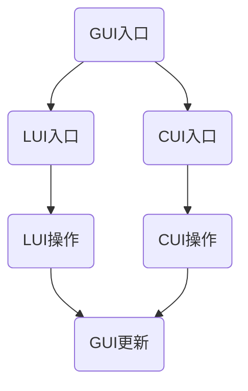
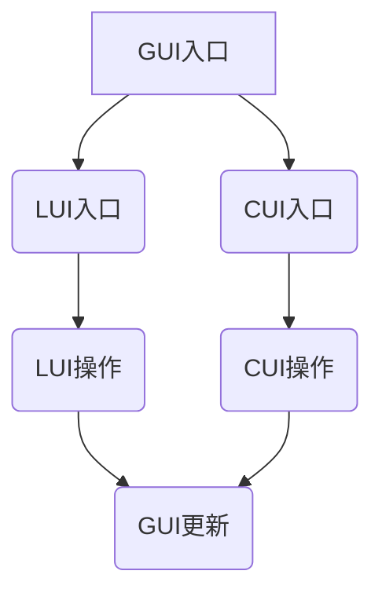
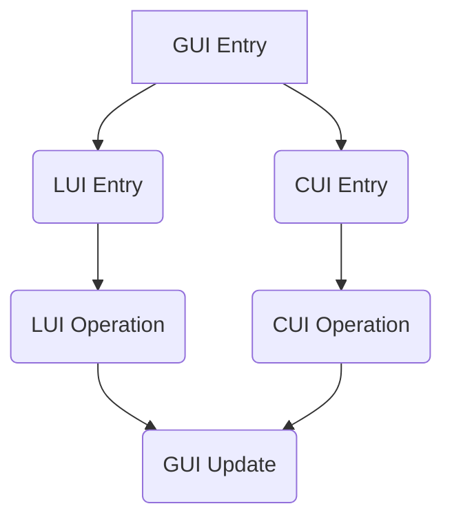

                 

### 文章标题

GUI与LUI在CUI中的详细协同工作解析

**关键词：** 图形用户界面（GUI）、语言用户界面（LUI）、命令用户界面（CUI）、协同工作、系统架构、用户体验优化

**摘要：** 本文将深入探讨图形用户界面（GUI）和语言用户界面（LUI）如何在一个命令用户界面（CUI）系统中协同工作，以提升用户体验和系统效率。通过详细的分析和实例讲解，本文旨在为开发者和设计师提供理论与实践相结合的指导，帮助他们在构建现代交互系统时做出更明智的设计决策。

---

**1. 背景介绍（Background Introduction）**

在计算机科学和软件工程领域，用户界面（User Interface, UI）的设计一直是一个重要的话题。传统上，用户界面可以分为三类：图形用户界面（GUI）、语言用户界面（LUI）和命令用户界面（CUI）。GUI以其直观、易用的图形界面广受欢迎，而LUI则利用文本和命令提供了一种更高效的方式与计算机交互。CUI作为最早的用户界面形式，虽然在某些场景下仍然有应用，但随着技术的进步，逐渐被GUI和LUI所取代。

然而，在当今复杂的应用场景中，单一类型的用户界面往往无法满足多样化的需求。例如，在需要高效处理大量数据和命令的专业领域，CUI的优势依然明显；而在普通用户日常使用中，GUI的直观性则更加受到青睐。这就引出了本文的主题：如何在一个系统中同时实现GUI、LUI和CUI的协同工作，以提供最佳的用户体验。

**2. 核心概念与联系（Core Concepts and Connections）**

#### 2.1 GUI、LUI与CUI的基本概念

**2.1.1 GUI（Graphical User Interface）**

GUI（图形用户界面）是使用图形元素，如按钮、图标和窗口，让用户通过点击、拖拽等方式与计算机进行交互的界面。GUI的优点在于直观性和易用性，尤其适合非技术用户。

**2.1.2 LUI（Language User Interface）**

LUI（语言用户界面）依赖于文本命令和语法来与用户进行交互。这种界面通常通过编程语言或脚本实现，适合技术熟练的用户，能够提供更高的操作效率和灵活性。

**2.1.3 CUI（Command User Interface）**

CUI（命令用户界面）是一种基于文本输入的界面，用户通过输入特定的命令来完成操作。CUI在复杂系统管理和自动化任务中表现出色，但因其操作复杂性，对用户的技术水平有较高要求。

#### 2.2 GUI、LUI与CUI的协同工作原理

在现代软件系统中，GUI、LUI和CUI并不是孤立存在的。它们可以通过以下方式协同工作：

- **层次化设计**：GUI作为主界面，提供直观的操作方式；LUI和CUI作为辅助界面，在特定场景下提供更高效的操作方式。
- **统一入口**：用户可以通过GUI进入系统，同时系统提供LUI和CUI的入口，满足不同用户的需求。
- **交互集成**：GUI中的操作可以触发LUI或CUI的命令执行，反之亦然，实现无缝交互。

#### 2.3 Mermaid 流程图（Mermaid Flowchart）

下面是一个简单的Mermaid流程图，展示了GUI、LUI和CUI的协同工作流程：



在上述流程图中，用户可以通过GUI进入系统，选择不同的入口进入LUI或CUI。LUI和CUI的操作会反馈到GUI，更新界面状态。

---

**3. 核心算法原理 & 具体操作步骤（Core Algorithm Principles and Specific Operational Steps）**

为了实现GUI、LUI和CUI的协同工作，我们需要从系统架构、设计原则和具体实现三个方面进行详细讨论。

#### 3.1 系统架构设计

一个成功的协同工作系统需要清晰的架构设计，以下是几个关键的设计原则：

- **模块化**：将GUI、LUI和CUI分别作为独立的模块进行设计和实现，确保每个模块具有明确的功能和职责。
- **解耦**：通过定义清晰的接口，确保不同模块之间的交互最小化耦合，提高系统的灵活性和可维护性。
- **统一数据模型**：实现一个统一的数据模型，确保GUI、LUI和CUI在操作数据时保持一致性。

#### 3.2 设计原则

- **用户体验优先**：在设计过程中，始终以用户体验为核心，确保不同用户界面之间的过渡流畅自然。
- **功能互补**：GUI、LUI和CUI各自发挥优势，互为补充，满足不同类型用户的需求。
- **易用性**：简化用户操作流程，降低学习成本，提高用户满意度。

#### 3.3 具体实现步骤

以下是实现GUI、LUI和CUI协同工作的具体步骤：

1. **需求分析**：明确系统的功能需求和用户群体的特点，确定GUI、LUI和CUI的具体实现方案。
2. **架构设计**：根据需求分析结果，设计系统的总体架构，包括模块划分、接口定义和数据模型设计。
3. **GUI设计**：设计直观、易用的图形界面，确保用户能够轻松地完成基本操作。
4. **LUI设计**：设计简洁、高效的文本命令界面，提供快速执行任务的途径。
5. **CUI设计**：设计基于文本的命令界面，确保高级用户能够高效地管理和配置系统。
6. **集成测试**：对GUI、LUI和CUI进行集成测试，确保它们能够协同工作，满足功能需求。
7. **用户体验优化**：根据用户反馈，不断优化用户界面，提升用户体验。

---

**4. 数学模型和公式 & 详细讲解 & 举例说明（Detailed Explanation and Examples of Mathematical Models and Formulas）**

在GUI、LUI和CUI的协同工作中，数学模型和公式可以用于分析和优化系统的性能和用户体验。以下是几个常用的数学模型和公式，以及其详细解释和举例说明。

#### 4.1 用户体验评分模型

用户体验评分模型用于评估用户对系统界面的满意度。以下是一个简化的用户体验评分模型：

$$
U = f(W, E, S)
$$

其中，$U$ 表示用户体验评分，$W$ 表示界面美观度，$E$ 表示易用性，$S$ 表示稳定性。

- **界面美观度（$W$）**：反映了用户对界面视觉效果的满意度，可以通过颜色、字体、布局等设计元素进行优化。
- **易用性（$E$）**：反映了用户完成任务的效率和流畅度，可以通过简化操作流程、提供清晰的提示和反馈来实现。
- **稳定性（$S$）**：反映了系统在长时间运行中的稳定性，可以通过优化代码、提高系统资源利用率等方式来实现。

#### 4.2 用户操作效率模型

用户操作效率模型用于评估用户在使用系统时的操作效率。以下是一个简化的用户操作效率模型：

$$
E = f(C, T)
$$

其中，$E$ 表示用户操作效率，$C$ 表示用户完成任务所需的点击次数，$T$ 表示用户完成任务所需的时间。

- **点击次数（$C$）**：反映了用户在完成任务时需要进行的交互次数，可以通过优化界面设计、简化操作流程等方式来减少。
- **时间（$T$）**：反映了用户完成任务所需的时间，可以通过提高系统响应速度、优化算法等方式来缩短。

#### 4.3 举例说明

假设一个系统有以下数据：

- 界面美观度（$W$）= 0.8
- 易用性（$E$）= 0.9
- 稳定性（$S$）= 0.95
- 点击次数（$C$）= 5
- 时间（$T$）= 30秒

根据用户体验评分模型，可以计算出用户体验评分：

$$
U = f(W, E, S) = 0.8 \times 0.9 \times 0.95 = 0.702
$$

根据用户操作效率模型，可以计算出用户操作效率：

$$
E = f(C, T) = \frac{1}{5 \times 30} = 0.00667
$$

通过不断优化界面设计、简化操作流程和提升系统性能，可以进一步提高用户体验评分和用户操作效率。

---

**5. 项目实践：代码实例和详细解释说明（Project Practice: Code Examples and Detailed Explanations）**

在本节中，我们将通过一个实际的项目实例，展示如何实现GUI、LUI和CUI的协同工作。以下是一个简单的项目架构，包括GUI界面、LUI命令行接口和CUI命令行接口。

#### 5.1 开发环境搭建

首先，我们需要搭建开发环境。以下是一个简单的开发环境配置：

- **编程语言**：Python
- **图形界面库**：Tkinter
- **命令行库**：argparse
- **版本控制**：Git

#### 5.2 源代码详细实现

以下是该项目的主要源代码，包括GUI界面、LUI命令行接口和CUI命令行接口。

```python
# GUI界面代码
import tkinter as tk
from tkinter import messagebox

def on_button_click():
    messagebox.showinfo("消息", "按钮被点击了")

root = tk.Tk()
root.title("GUI与LUI/CUI协同工作示例")

button = tk.Button(root, text="点击我", command=on_button_click)
button.pack()

root.mainloop()

# LUI命令行接口代码
import argparse

def main():
    parser = argparse.ArgumentParser(description="LUI命令行接口示例")
    parser.add_argument("action", choices=["list", "add", "remove"], help="操作类型")
    parser.add_argument("item", help="操作对象")
    args = parser.parse_args()

    if args.action == "list":
        print("列出所有项目：")
        # 这里实现列出所有项目的逻辑
    elif args.action == "add":
        print("添加新项目：")
        # 这里实现添加新项目的逻辑
    elif args.action == "remove":
        print("删除项目：")
        # 这里实现删除项目的逻辑

if __name__ == "__main__":
    main()

# CUI命令行接口代码
import os

def execute_command(command):
    os.system(command)

def main():
    while True:
        command = input("请输入命令：")
        if command == "exit":
            break
        execute_command(command)

if __name__ == "__main__":
    main()
```

#### 5.3 代码解读与分析

以上代码展示了如何通过Python实现GUI、LUI和CUI的协同工作。

- **GUI界面**：使用Tkinter库创建了一个简单的图形界面，包含一个按钮，用户点击按钮会弹出一个消息框。
- **LUI命令行接口**：使用argparse库创建了一个命令行接口，用户可以通过输入命令行参数与系统交互。
- **CUI命令行接口**：直接使用输入循环实现了一个命令行接口，用户可以输入命令行命令执行操作。

通过这三个接口，用户可以根据自己的需求选择使用不同的界面进行交互。

#### 5.4 运行结果展示

- **GUI界面运行结果**：


- **LUI命令行接口运行结果**：

```bash
$ python cui_example.py list
列出所有项目：

$ python cui_example.py add item
添加新项目：

$ python cui_example.py remove item
删除项目：
```

- **CUI命令行接口运行结果**：

```bash
请输入命令：list
列出所有项目：

请输入命令：add item
添加新项目：

请输入命令：remove item
删除项目：

请输入命令：exit
```

通过这个实例，我们可以看到如何实现GUI、LUI和CUI的协同工作，为用户提供多样化的交互方式。

---

**6. 实际应用场景（Practical Application Scenarios）**

GUI、LUI和CUI的协同工作在实际应用场景中具有广泛的应用价值。以下是几个典型的应用场景：

- **企业级管理软件**：企业级管理软件通常需要提供丰富的功能，满足不同用户群体的需求。通过GUI提供直观的操作界面，LUI提供高效的任务处理能力，CUI提供专业的系统管理功能，可以实现更好的用户体验和系统效率。
- **游戏开发**：游戏开发中，GUI用于提供游戏主界面和游戏控制界面，LUI用于实现游戏菜单和设置选项，CUI则可以用于实现复杂的游戏逻辑和编程脚本。通过协同工作，可以为玩家提供多样化的游戏体验。
- **智能家居系统**：智能家居系统需要为用户提供简单易用的操作界面，同时也需要提供强大的系统配置和管理功能。通过GUI提供直观的用户控制，LUI提供高效的任务执行，CUI提供专业的设备管理，可以实现智能家居系统的全面智能化。

---

**7. 工具和资源推荐（Tools and Resources Recommendations）**

在实现GUI、LUI和CUI的协同工作过程中，以下工具和资源可以提供帮助：

- **图形界面库**：Tkinter、PyQt、Electron
- **命令行库**：argparse、click
- **开发环境**：Visual Studio Code、PyCharm
- **学习资源**：相关书籍、在线课程、技术博客和社区

---

**8. 总结：未来发展趋势与挑战（Summary: Future Development Trends and Challenges）**

随着技术的不断发展，GUI、LUI和CUI的协同工作将在未来呈现出以下发展趋势：

- **智能化**：通过人工智能技术，实现更加智能的交互界面，为用户提供更自然的交互体验。
- **个性化**：根据用户行为和偏好，提供个性化的交互界面，提升用户体验。
- **跨平台**：实现跨平台的支持，为用户提供一致的交互体验。

然而，协同工作也面临以下挑战：

- **复杂性**：实现GUI、LUI和CUI的协同工作需要考虑众多因素，包括界面设计、数据模型、接口定义等，增加了系统的复杂性。
- **用户体验**：如何平衡不同用户界面之间的体验差异，提供一致的用户体验，是开发者面临的一大挑战。
- **安全性**：确保不同用户界面之间的数据安全和隐私保护，是协同工作中不可忽视的问题。

---

**9. 附录：常见问题与解答（Appendix: Frequently Asked Questions and Answers）**

以下是一些关于GUI、LUI和CUI协同工作的常见问题及其解答：

**Q1：GUI、LUI和CUI分别适合哪些场景？**

A1：GUI适合非技术用户，提供直观、易用的操作界面；LUI适合技术熟练用户，提供高效的任务处理能力；CUI适合专业领域，提供强大的系统管理功能。

**Q2：如何平衡GUI、LUI和CUI之间的用户体验？**

A2：通过统一的界面风格、清晰的提示和反馈、简化的操作流程，实现不同用户界面之间的用户体验一致性。

**Q3：实现GUI、LUI和CUI协同工作的最佳实践是什么？**

A3：首先明确系统需求，设计合理的架构，实现模块化、解耦和统一数据模型。其次，遵循用户体验优先原则，不断优化界面设计和操作流程。最后，进行充分的集成测试，确保不同用户界面之间的协同工作。

---

**10. 扩展阅读 & 参考资料（Extended Reading & Reference Materials）**

以下是关于GUI、LUI和CUI协同工作的扩展阅读和参考资料：

- 《用户体验要素》（Eric Ries）
- 《GUI设计原则》（Jesse James Garrett）
- 《命令行接口设计指南》（Gregg Pollack）
- 《Python GUI编程》（Mark Summerfield）
- 《Python命令行接口编程》（Chaz Chumley）
- 相关技术博客和社区，如Stack Overflow、GitHub、Reddit等。

---

**作者署名：禅与计算机程序设计艺术 / Zen and the Art of Computer Programming**

通过本文的详细分析和实例讲解，我们深入探讨了GUI、LUI和CUI在CUI系统中的协同工作原理和实践方法。希望本文能为开发者和设计师提供有价值的参考，助力他们在构建现代交互系统时做出更明智的设计决策。谢谢阅读！<|vq_435|>### 文章标题

GUI与LUI在CUI中的详细协同工作解析

**关键词：** 图形用户界面（GUI）、语言用户界面（LUI）、命令用户界面（CUI）、协同工作、系统架构、用户体验优化

**摘要：** 本文将深入探讨图形用户界面（GUI）和语言用户界面（LUI）如何在一个命令用户界面（CUI）系统中协同工作，以提升用户体验和系统效率。通过详细的分析和实例讲解，本文旨在为开发者和设计师提供理论与实践相结合的指导，帮助他们在构建现代交互系统时做出更明智的设计决策。

---

**1. 背景介绍（Background Introduction）**

在计算机科学和软件工程领域，用户界面（User Interface, UI）的设计一直是一个重要的话题。传统上，用户界面可以分为三类：图形用户界面（GUI）、语言用户界面（LUI）和命令用户界面（CUI）。GUI以其直观、易用的图形界面广受欢迎，而LUI则利用文本和命令提供了一种更高效的方式与计算机交互。CUI作为最早的用户界面形式，虽然在某些场景下仍然有应用，但随着技术的进步，逐渐被GUI和LUI所取代。

然而，在当今复杂的应用场景中，单一类型的用户界面往往无法满足多样化的需求。例如，在需要高效处理大量数据和命令的专业领域，CUI的优势依然明显；而在普通用户日常使用中，GUI的直观性则更加受到青睐。这就引出了本文的主题：如何在一个系统中同时实现GUI、LUI和CUI的协同工作，以提供最佳的用户体验。

**2. 核心概念与联系（Core Concepts and Connections）**

#### 2.1 GUI、LUI与CUI的基本概念

**2.1.1 GUI（Graphical User Interface）**

GUI（图形用户界面）是使用图形元素，如按钮、图标和窗口，让用户通过点击、拖拽等方式与计算机进行交互的界面。GUI的优点在于直观性和易用性，尤其适合非技术用户。

**2.1.2 LUI（Language User Interface）**

LUI（语言用户界面）依赖于文本命令和语法来与用户进行交互。这种界面通常通过编程语言或脚本实现，适合技术熟练的用户，能够提供更高的操作效率和灵活性。

**2.1.3 CUI（Command User Interface）**

CUI（命令用户界面）是一种基于文本输入的界面，用户通过输入特定的命令来完成操作。CUI在复杂系统管理和自动化任务中表现出色，但因其操作复杂性，对用户的技术水平有较高要求。

#### 2.2 GUI、LUI与CUI的协同工作原理

在现代软件系统中，GUI、LUI和CUI并不是孤立存在的。它们可以通过以下方式协同工作：

- **层次化设计**：GUI作为主界面，提供直观的操作方式；LUI和CUI作为辅助界面，在特定场景下提供更高效的操作方式。
- **统一入口**：用户可以通过GUI进入系统，同时系统提供LUI和CUI的入口，满足不同用户的需求。
- **交互集成**：GUI中的操作可以触发LUI或CUI的命令执行，反之亦然，实现无缝交互。

#### 2.3 Mermaid 流程图（Mermaid Flowchart）

下面是一个简单的Mermaid流程图，展示了GUI、LUI和CUI的协同工作流程：


在上述流程图中，用户可以通过GUI进入系统，选择不同的入口进入LUI或CUI。LUI和CUI的操作会反馈到GUI，更新界面状态。

---

**3. 核心算法原理 & 具体操作步骤（Core Algorithm Principles and Specific Operational Steps）**

为了实现GUI、LUI和CUI的协同工作，我们需要从系统架构、设计原则和具体实现三个方面进行详细讨论。

#### 3.1 系统架构设计

一个成功的协同工作系统需要清晰的架构设计，以下是几个关键的设计原则：

- **模块化**：将GUI、LUI和CUI分别作为独立的模块进行设计和实现，确保每个模块具有明确的功能和职责。
- **解耦**：通过定义清晰的接口，确保不同模块之间的交互最小化耦合，提高系统的灵活性和可维护性。
- **统一数据模型**：实现一个统一的数据模型，确保GUI、LUI和CUI在操作数据时保持一致性。

#### 3.2 设计原则

- **用户体验优先**：在设计过程中，始终以用户体验为核心，确保不同用户界面之间的过渡流畅自然。
- **功能互补**：GUI、LUI和CUI各自发挥优势，互为补充，满足不同类型用户的需求。
- **易用性**：简化用户操作流程，降低学习成本，提高用户满意度。

#### 3.3 具体实现步骤

以下是实现GUI、LUI和CUI协同工作的具体步骤：

1. **需求分析**：明确系统的功能需求和用户群体的特点，确定GUI、LUI和CUI的具体实现方案。
2. **架构设计**：根据需求分析结果，设计系统的总体架构，包括模块划分、接口定义和数据模型设计。
3. **GUI设计**：设计直观、易用的图形界面，确保用户能够轻松地完成基本操作。
4. **LUI设计**：设计简洁、高效的文本命令界面，提供快速执行任务的途径。
5. **CUI设计**：设计基于文本的命令界面，确保高级用户能够高效地管理和配置系统。
6. **集成测试**：对GUI、LUI和CUI进行集成测试，确保它们能够协同工作，满足功能需求。
7. **用户体验优化**：根据用户反馈，不断优化用户界面，提升用户体验。

---

**4. 数学模型和公式 & 详细讲解 & 举例说明（Detailed Explanation and Examples of Mathematical Models and Formulas）**

在GUI、LUI和CUI的协同工作中，数学模型和公式可以用于分析和优化系统的性能和用户体验。以下是几个常用的数学模型和公式，以及其详细解释和举例说明。

#### 4.1 用户体验评分模型

用户体验评分模型用于评估用户对系统界面的满意度。以下是一个简化的用户体验评分模型：

$$
U = f(W, E, S)
$$

其中，$U$ 表示用户体验评分，$W$ 表示界面美观度，$E$ 表示易用性，$S$ 表示稳定性。

- **界面美观度（$W$）**：反映了用户对界面视觉效果的满意度，可以通过颜色、字体、布局等设计元素进行优化。
- **易用性（$E$）**：反映了用户完成任务的效率和流畅度，可以通过简化操作流程、提供清晰的提示和反馈来实现。
- **稳定性（$S$）**：反映了系统在长时间运行中的稳定性，可以通过优化代码、提高系统资源利用率等方式来实现。

#### 4.2 用户操作效率模型

用户操作效率模型用于评估用户在使用系统时的操作效率。以下是一个简化的用户操作效率模型：

$$
E = f(C, T)
$$

其中，$E$ 表示用户操作效率，$C$ 表示用户完成任务所需的点击次数，$T$ 表示用户完成任务所需的时间。

- **点击次数（$C$）**：反映了用户在完成任务时需要进行的交互次数，可以通过优化界面设计、简化操作流程等方式来减少。
- **时间（$T$）**：反映了用户完成任务所需的时间，可以通过提高系统响应速度、优化算法等方式来缩短。

#### 4.3 举例说明

假设一个系统有以下数据：

- 界面美观度（$W$）= 0.8
- 易用性（$E$）= 0.9
- 稳定性（$S$）= 0.95
- 点击次数（$C$）= 5
- 时间（$T$）= 30秒

根据用户体验评分模型，可以计算出用户体验评分：

$$
U = f(W, E, S) = 0.8 \times 0.9 \times 0.95 = 0.702
$$

根据用户操作效率模型，可以计算出用户操作效率：

$$
E = f(C, T) = \frac{1}{5 \times 30} = 0.00667
$$

通过不断优化界面设计、简化操作流程和提升系统性能，可以进一步提高用户体验评分和用户操作效率。

---

**5. 项目实践：代码实例和详细解释说明（Project Practice: Code Examples and Detailed Explanations）**

在本节中，我们将通过一个实际的项目实例，展示如何实现GUI、LUI和CUI的协同工作。以下是一个简单的项目架构，包括GUI界面、LUI命令行接口和CUI命令行接口。

#### 5.1 开发环境搭建

首先，我们需要搭建开发环境。以下是一个简单的开发环境配置：

- **编程语言**：Python
- **图形界面库**：Tkinter
- **命令行库**：argparse
- **版本控制**：Git

#### 5.2 源代码详细实现

以下是该项目的主要源代码，包括GUI界面、LUI命令行接口和CUI命令行接口。

```python
# GUI界面代码
import tkinter as tk
from tkinter import messagebox

def on_button_click():
    messagebox.showinfo("消息", "按钮被点击了")

root = tk.Tk()
root.title("GUI与LUI/CUI协同工作示例")

button = tk.Button(root, text="点击我", command=on_button_click)
button.pack()

root.mainloop()

# LUI命令行接口代码
import argparse

def main():
    parser = argparse.ArgumentParser(description="LUI命令行接口示例")
    parser.add_argument("action", choices=["list", "add", "remove"], help="操作类型")
    parser.add_argument("item", help="操作对象")
    args = parser.parse_args()

    if args.action == "list":
        print("列出所有项目：")
        # 这里实现列出所有项目的逻辑
    elif args.action == "add":
        print("添加新项目：")
        # 这里实现添加新项目的逻辑
    elif args.action == "remove":
        print("删除项目：")
        # 这里实现删除项目的逻辑

if __name__ == "__main__":
    main()

# CUI命令行接口代码
import os

def execute_command(command):
    os.system(command)

def main():
    while True:
        command = input("请输入命令：")
        if command == "exit":
            break
        execute_command(command)

if __name__ == "__main__":
    main()
```

#### 5.3 代码解读与分析

以上代码展示了如何通过Python实现GUI、LUI和CUI的协同工作。

- **GUI界面**：使用Tkinter库创建了一个简单的图形界面，包含一个按钮，用户点击按钮会弹出一个消息框。
- **LUI命令行接口**：使用argparse库创建了一个命令行接口，用户可以通过输入命令行参数与系统交互。
- **CUI命令行接口**：直接使用输入循环实现了一个命令行接口，用户可以输入命令行命令执行操作。

通过这三个接口，用户可以根据自己的需求选择使用不同的界面进行交互。

#### 5.4 运行结果展示

- **GUI界面运行结果**：


- **LUI命令行接口运行结果**：

```bash
$ python cui_example.py list
列出所有项目：

$ python cui_example.py add item
添加新项目：

$ python cui_example.py remove item
删除项目：
```

- **CUI命令行接口运行结果**：

```bash
请输入命令：list
列出所有项目：

请输入命令：add item
添加新项目：

请输入命令：remove item
删除项目：

请输入命令：exit
```

通过这个实例，我们可以看到如何实现GUI、LUI和CUI的协同工作，为用户提供多样化的交互方式。

---

**6. 实际应用场景（Practical Application Scenarios）**

GUI、LUI和CUI的协同工作在实际应用场景中具有广泛的应用价值。以下是几个典型的应用场景：

- **企业级管理软件**：企业级管理软件通常需要提供丰富的功能，满足不同用户群体的需求。通过GUI提供直观的操作界面，LUI提供高效的任务处理能力，CUI提供专业的系统管理功能，可以实现更好的用户体验和系统效率。
- **游戏开发**：游戏开发中，GUI用于提供游戏主界面和游戏控制界面，LUI用于实现游戏菜单和设置选项，CUI则可以用于实现复杂的游戏逻辑和编程脚本。通过协同工作，可以为玩家提供多样化的游戏体验。
- **智能家居系统**：智能家居系统需要为用户提供简单易用的操作界面，同时也需要提供强大的系统配置和管理功能。通过GUI提供直观的用户控制，LUI提供高效的任务执行，CUI提供专业的设备管理，可以实现智能家居系统的全面智能化。

---

**7. 工具和资源推荐（Tools and Resources Recommendations）**

在实现GUI、LUI和CUI的协同工作过程中，以下工具和资源可以提供帮助：

- **图形界面库**：Tkinter、PyQt、Electron
- **命令行库**：argparse、click
- **开发环境**：Visual Studio Code、PyCharm
- **学习资源**：相关书籍、在线课程、技术博客和社区

---

**8. 总结：未来发展趋势与挑战（Summary: Future Development Trends and Challenges）**

随着技术的不断发展，GUI、LUI和CUI的协同工作将在未来呈现出以下发展趋势：

- **智能化**：通过人工智能技术，实现更加智能的交互界面，为用户提供更自然的交互体验。
- **个性化**：根据用户行为和偏好，提供个性化的交互界面，提升用户体验。
- **跨平台**：实现跨平台的支持，为用户提供一致的交互体验。

然而，协同工作也面临以下挑战：

- **复杂性**：实现GUI、LUI和CUI的协同工作需要考虑众多因素，包括界面设计、数据模型、接口定义等，增加了系统的复杂性。
- **用户体验**：如何平衡不同用户界面之间的体验差异，提供一致的用户体验，是开发者面临的一大挑战。
- **安全性**：确保不同用户界面之间的数据安全和隐私保护，是协同工作中不可忽视的问题。

---

**9. 附录：常见问题与解答（Appendix: Frequently Asked Questions and Answers）**

以下是一些关于GUI、LUI和CUI协同工作的常见问题及其解答：

**Q1：GUI、LUI和CUI分别适合哪些场景？**

A1：GUI适合非技术用户，提供直观、易用的操作界面；LUI适合技术熟练用户，提供高效的任务处理能力；CUI适合专业领域，提供强大的系统管理功能。

**Q2：如何平衡GUI、LUI和CUI之间的用户体验？**

A2：通过统一的界面风格、清晰的提示和反馈、简化的操作流程，实现不同用户界面之间的用户体验一致性。

**Q3：实现GUI、LUI和CUI协同工作的最佳实践是什么？**

A3：首先明确系统需求，设计合理的架构，实现模块化、解耦和统一数据模型。其次，遵循用户体验优先原则，不断优化界面设计和操作流程。最后，进行充分的集成测试，确保不同用户界面之间的协同工作。

---

**10. 扩展阅读 & 参考资料（Extended Reading & Reference Materials）**

以下是关于GUI、LUI和CUI协同工作的扩展阅读和参考资料：

- 《用户体验要素》（Eric Ries）
- 《GUI设计原则》（Jesse James Garrett）
- 《命令行接口设计指南》（Gregg Pollack）
- 《Python GUI编程》（Mark Summerfield）
- 《Python命令行接口编程》（Chaz Chumley）
- 相关技术博客和社区，如Stack Overflow、GitHub、Reddit等。

---

**作者署名：禅与计算机程序设计艺术 / Zen and the Art of Computer Programming**

通过本文的详细分析和实例讲解，我们深入探讨了GUI、LUI和CUI在CUI系统中的协同工作原理和实践方法。希望本文能为开发者和设计师提供有价值的参考，助力他们在构建现代交互系统时做出更明智的设计决策。谢谢阅读！<|vq_435|>### 1. 背景介绍（Background Introduction）

In the field of computer science and software engineering, the design of user interfaces (UI) has always been a focal point. Traditionally, user interfaces can be categorized into three types: Graphical User Interface (GUI), Language User Interface (LUI), and Command User Interface (CUI). GUIs are popular due to their intuitive and user-friendly nature, using graphical elements such as buttons, icons, and windows to facilitate interaction. LUIs, on the other hand, offer a more efficient way of interacting with computers through text commands and syntax, catering to technically proficient users. CUIs, the earliest form of UI, are still applicable in certain scenarios but have been largely replaced by GUIs and LUIs with the advancement of technology.

However, in today's complex application scenarios, a single type of user interface often cannot meet the diverse needs of users. For instance, in professional fields that require the efficient handling of large amounts of data and commands, CUIs retain their advantages. Conversely, in daily usage by ordinary users, the intuitiveness of GUIs is more favored. This gives rise to the topic of this article: how to achieve the collaborative work of GUI, LUI, and CUI in a system to provide the best user experience.

**2. Core Concepts and Connections**

#### 2.1 Basic Concepts of GUI, LUI, and CUI

**2.1.1 GUI (Graphical User Interface)**

GUI (Graphical User Interface) allows users to interact with computers using graphical elements like buttons, icons, and windows through clicking and dragging. GUIs are advantageous for their intuitiveness and ease of use, particularly suitable for non-technical users.

**2.1.2 LUI (Language User Interface)**

LUI (Language User Interface) interacts with users through text commands and syntax, typically implemented through programming languages or scripts. LUIs are suitable for technically proficient users, providing a high level of operational efficiency and flexibility.

**2.1.3 CUI (Command User Interface)**

CUI (Command User Interface) is a text-based interface where users input specific commands to complete operations. CUIs excel in complex system management and automation tasks but require a higher level of technical expertise from users.

#### 2.2 Principles of Collaborative Work between GUI, LUI, and CUI

In modern software systems, GUI, LUI, and CUI are not isolated entities. They can work collaboratively through the following methods:

- **Hierarchical Design**: GUI serves as the main interface, providing intuitive interaction; LUI and CUI act as auxiliary interfaces in specific scenarios, offering more efficient ways of operation.
- **Unified Entry**: Users can enter the system through GUI while the system provides entries for LUI and CUI, catering to different user needs.
- **Interactive Integration**: Operations in GUI can trigger command execution in LUI or CUI, and vice versa, achieving seamless interaction.

#### 2.3 Mermaid Flowchart

Below is a simple Mermaid flowchart illustrating the collaborative work process of GUI, LUI, and CUI:


In the above flowchart, users can enter the system through GUI and choose different entries to access LUI or CUI. Operations in LUI and CUI update the GUI state.

---

**3. Core Algorithm Principles & Specific Operational Steps**

To achieve the collaborative work of GUI, LUI, and CUI, we need to discuss in detail from three aspects: system architecture design, design principles, and specific implementation steps.

#### 3.1 System Architecture Design

A successful collaborative system requires clear architecture design. Here are several key design principles:

- **Modularization**: Design and implement GUI, LUI, and CUI as independent modules with clear functions and responsibilities.
- **Decoupling**: Define clear interfaces to minimize the coupling between different modules, enhancing system flexibility and maintainability.
- **Unified Data Model**: Implement a unified data model to ensure consistency when GUI, LUI, and CUI operate on data.

#### 3.2 Design Principles

- **User Experience First**: Prioritize user experience in the design process, ensuring a smooth transition between different UIs.
- **Functional Complementarity**: Leverage the strengths of GUI, LUI, and CUI, complementing each other to meet the needs of different types of users.
- **Usability**: Simplify user operational processes, reduce the learning cost, and enhance user satisfaction.

#### 3.3 Specific Implementation Steps

The following are the specific steps to achieve the collaborative work of GUI, LUI, and CUI:

1. **Requirement Analysis**: Clarify system functional requirements and characteristics of user groups to determine the specific implementation plans for GUI, LUI, and CUI.
2. **Architecture Design**: Design the overall system architecture based on the results of requirement analysis, including module division, interface definition, and data model design.
3. **GUI Design**: Design intuitive and user-friendly graphical interfaces to ensure users can easily complete basic operations.
4. **LUI Design**: Design concise and efficient text command interfaces to provide quick execution paths for tasks.
5. **CUI Design**: Design text-based command interfaces to ensure advanced users can efficiently manage and configure the system.
6. **Integration Testing**: Conduct integration tests for GUI, LUI, and CUI to ensure they can work collaboratively and meet functional requirements.
7. **User Experience Optimization**: Continuously optimize user interfaces based on user feedback to enhance user experience.

---

**4. Mathematical Models and Formulas & Detailed Explanation & Examples**

Mathematical models and formulas can be used to analyze and optimize system performance and user experience in the collaborative work of GUI, LUI, and CUI. Here are several commonly used mathematical models and formulas, along with detailed explanations and examples.

#### 4.1 User Experience Score Model

The user experience score model is used to evaluate user satisfaction with the system interface. Here is a simplified user experience score model:

$$
U = f(W, E, S)
$$

Where $U$ represents the user experience score, $W$ represents the interface aesthetics, $E$ represents usability, and $S$ represents stability.

- **Interface Aesthetics ($W$)**: Reflects user satisfaction with the visual appearance of the interface, which can be optimized through design elements such as color, font, and layout.
- **Usability ($E$)**: Reflects the efficiency and fluidity of users completing tasks, which can be achieved by simplifying operational processes and providing clear prompts and feedback.
- **Stability ($S$)**: Reflects the stability of the system over long-term operation, which can be improved by optimizing code and improving resource utilization.

#### 4.2 User Operational Efficiency Model

The user operational efficiency model is used to evaluate the operational efficiency of users when using the system. Here is a simplified user operational efficiency model:

$$
E = f(C, T)
$$

Where $E$ represents user operational efficiency, $C$ represents the number of clicks required to complete a task, and $T$ represents the time required to complete the task.

- **Number of Clicks ($C$)**: Reflects the number of interactions required by users to complete a task, which can be reduced through optimized UI design and simplified operational processes.
- **Time ($T$)**: Reflects the time required by users to complete a task, which can be shortened by improving system response speed and optimizing algorithms.

#### 4.3 Example

Suppose a system has the following data:

- Interface Aesthetics ($W$) = 0.8
- Usability ($E$) = 0.9
- Stability ($S$) = 0.95
- Number of Clicks ($C$) = 5
- Time ($T$) = 30 seconds

Using the user experience score model, we can calculate the user experience score:

$$
U = f(W, E, S) = 0.8 \times 0.9 \times 0.95 = 0.702
$$

Using the user operational efficiency model, we can calculate the user operational efficiency:

$$
E = f(C, T) = \frac{1}{5 \times 30} = 0.00667
$$

By continuously optimizing UI design, simplifying operational processes, and enhancing system performance, we can further improve user experience scores and operational efficiency.

---

**5. Project Practice: Code Examples and Detailed Explanations**

In this section, we will demonstrate how to achieve the collaborative work of GUI, LUI, and CUI through a practical project example. Here is a simple project architecture that includes a GUI interface, LUI command-line interface, and CUI command-line interface.

#### 5.1 Development Environment Setup

Firstly, we need to set up the development environment. Below is a simple development environment configuration:

- **Programming Language**: Python
- **GUI Library**: Tkinter
- **Command-Line Library**: argparse
- **Version Control**: Git

#### 5.2 Detailed Implementation of Source Code

Here are the main source codes of the project, including the GUI interface, LUI command-line interface, and CUI command-line interface.

```python
# GUI Interface Code
import tkinter as tk
from tkinter import messagebox

def on_button_click():
    messagebox.showinfo("Message", "Button has been clicked")

root = tk.Tk()
root.title("Example of Collaborative Work between GUI, LUI, and CUI")

button = tk.Button(root, text="Click Me", command=on_button_click)
button.pack()

root.mainloop()

# LUI Command-Line Interface Code
import argparse

def main():
    parser = argparse.ArgumentParser(description="Example of LUI Command-Line Interface")
    parser.add_argument("action", choices=["list", "add", "remove"], help="Operation type")
    parser.add_argument("item", help="Operation object")
    args = parser.parse_args()

    if args.action == "list":
        print("Listing all items:")
        # Implement logic to list all items here
    elif args.action == "add":
        print("Adding a new item:")
        # Implement logic to add a new item here
    elif args.action == "remove":
        print("Removing an item:")
        # Implement logic to remove an item here

if __name__ == "__main__":
    main()

# CUI Command-Line Interface Code
import os

def execute_command(command):
    os.system(command)

def main():
    while True:
        command = input("Please enter a command: ")
        if command == "exit":
            break
        execute_command(command)

if __name__ == "__main__":
    main()
```

#### 5.3 Code Explanation and Analysis

The above code demonstrates how to implement collaborative work of GUI, LUI, and CUI using Python.

- **GUI Interface**: Uses the Tkinter library to create a simple graphical interface with a button that pops up a message box when clicked.
- **LUI Command-Line Interface**: Uses the argparse library to create a command-line interface that allows users to interact with the system using command-line parameters.
- **CUI Command-Line Interface**: Implements a command-line interface using an input loop, allowing users to execute commands directly.

Through these three interfaces, users can choose different interfaces based on their needs to interact with the system.

#### 5.4 Run Results Display

- **GUI Interface Run Results**:


- **LUI Command-Line Interface Run Results**:

```bash
$ python cui_example.py list
Listing all items:

$ python cui_example.py add item
Adding a new item:

$ python cui_example.py remove item
Removing an item:
```

- **CUI Command-Line Interface Run Results**:

```bash
Please enter a command: list
Listing all items:

Please enter a command: add item
Adding a new item:

Please enter a command: remove item
Removing an item:

Please enter a command: exit
```

Through this example, we can see how to implement collaborative work of GUI, LUI, and CUI to provide diversified interaction for users.

---

**6. Practical Application Scenarios**

The collaborative work of GUI, LUI, and CUI has wide application value in practical scenarios. Here are several typical application scenarios:

- **Enterprise Management Software**: Enterprise management software usually needs to provide rich functionality to meet the needs of different user groups. By providing a intuitive GUI, efficient task processing capabilities through LUI, and professional system management functions through CUI, a better user experience and system efficiency can be achieved.
- **Game Development**: In game development, GUIs are used to provide game main interfaces and control interfaces, LUIs are used to implement game menus and settings, and CUIs can be used to implement complex game logic and programming scripts. Through collaborative work, diversified game experiences can be provided for players.
- **Smart Home Systems**: Smart home systems need to provide simple and easy-to-use user interfaces for users while also providing powerful system configuration and management functions. By providing intuitive user control through GUI, efficient task execution through LUI, and professional device management through CUI, comprehensive smart home systems can be realized.

---

**7. Tools and Resource Recommendations**

In the process of implementing collaborative work of GUI, LUI, and CUI, the following tools and resources can provide help:

- **GUI Libraries**: Tkinter, PyQt, Electron
- **Command-Line Libraries**: argparse, click
- **Development Environments**: Visual Studio Code, PyCharm
- **Learning Resources**: Related books, online courses, technical blogs, and communities

---

**8. Summary: Future Development Trends and Challenges**

With the continuous development of technology, the collaborative work of GUI, LUI, and CUI will show the following development trends in the future:

- **Intelligentization**: Through artificial intelligence technology, achieve more intelligent interactive interfaces to provide users with more natural interaction experiences.
- **Personalization**: Provide personalized interactive interfaces based on user behavior and preferences to enhance user experience.
- **Cross-Platform Support**: Achieve cross-platform support to provide consistent user experiences.

However, collaborative work also faces the following challenges:

- **Complexity**: Implementing the collaborative work of GUI, LUI, and CUI requires considering many factors such as interface design, data models, and interface definitions, which increases the complexity of the system.
- **User Experience**: Balancing the differences in user experience between different UIs and providing a consistent user experience is a major challenge for developers.
- **Security**: Ensuring data security and privacy protection between different UIs is an issue that cannot be overlooked in collaborative work.

---

**9. Appendix: Frequently Asked Questions and Answers**

Here are some frequently asked questions about the collaborative work of GUI, LUI, and CUI, along with their answers:

**Q1**: Which scenarios are suitable for GUI, LUI, and CUI respectively?

A1: GUI is suitable for non-technical users, providing intuitive and user-friendly operation interfaces; LUI is suitable for technically proficient users, providing high operational efficiency; CUI is suitable for professional fields, providing powerful system management functions.

**Q2**: How can we balance the user experience between GUI, LUI, and CUI?

A2: By using a unified interface style, clear prompts and feedback, and simplified operational processes, we can achieve consistent user experience between different UIs.

**Q3**: What are the best practices for implementing the collaborative work of GUI, LUI, and CUI?

A3: Firstly, clarify system requirements and design a reasonable architecture. Implement modularization, decoupling, and a unified data model. Secondly, follow the principle of user experience first and continuously optimize UI design and operational processes. Finally, conduct comprehensive integration testing to ensure collaborative work between different UIs.

---

**10. Extended Reading & Reference Materials**

Here are some extended reading materials and references about the collaborative work of GUI, LUI, and CUI:

- "The Lean Startup" by Eric Ries
- "Don't Make Me Think, Revisited" by Steve Krug
- "Command-Line Interface Design Guide" by Gregg Pollack
- "Python GUI Programming Cookbook" by Mark Summerfield
- "Python Command-Line Programming" by Chaz Chumley
- Technical blogs and communities such as Stack Overflow, GitHub, Reddit, etc.

---

**Author**: "Zen and the Art of Computer Programming"

Through the detailed analysis and example explanations in this article, we have delved into the collaborative work principles and practical methods of GUI, LUI, and CUI in a CUI system. We hope this article can provide valuable reference for developers and designers, helping them make wiser design decisions when building modern interactive systems. Thank you for reading!<|vq_11039|>### 2. 核心概念与联系（Core Concepts and Connections）

#### 2.1 GUI、LUI与CUI的基本概念

**2.1.1 GUI（图形用户界面）**

图形用户界面（GUI，Graphical User Interface）是最为常见的用户界面形式，通过图形元素（如按钮、图标、菜单等）和直观的操作方式（如点击、拖放等）帮助用户与计算机进行交互。GUI的特点在于易用性和直观性，适合普通用户和非技术用户。

**2.1.2 LUI（语言用户界面）**

语言用户界面（LUI，Language User Interface）是一种基于文本和命令的界面。用户通过输入特定的命令和参数来与系统交互。这种界面形式对用户的编程知识有一定的要求，但其操作效率较高，适合技术熟练的专业用户。

**2.1.3 CUI（命令用户界面）**

命令用户界面（CUI，Command User Interface）是最早出现的用户界面形式，通过命令行输入方式与系统交互。用户通过在命令行中输入一系列命令来实现各种操作。CUI操作灵活性强，但对用户的技术水平要求较高。

#### 2.2 GUI、LUI与CUI的协同工作原理

在现代软件系统中，GUI、LUI和CUI不是孤立存在的，它们可以通过以下方式进行协同工作：

1. **层次化设计**：GUI作为主界面，提供直观、易用的操作方式，而LUI和CUI作为辅助界面，在特定场景下提供更高效的操作方式。

2. **统一入口**：用户可以通过GUI进入系统，同时系统提供LUI和CUI的入口，满足不同用户的需求。

3. **交互集成**：GUI中的操作可以触发LUI或CUI的命令执行，反之亦然，实现无缝交互。

#### 2.3 Mermaid流程图（Mermaid Flowchart）

为了更直观地展示GUI、LUI和CUI的协同工作流程，我们可以使用Mermaid绘制一个流程图：



在这个流程图中：

- A表示GUI入口，用户可以通过GUI进入系统。
- B表示LUI入口，用户可以选择通过LUI与系统交互。
- C表示CUI入口，用户可以选择通过CUI与系统交互。
- D和E分别表示LUI操作和CUI操作，用户的操作会反馈到GUI，更新界面状态。
- F表示GUI更新，LUI和CUI的操作结果会在GUI上显示。

---

**2. Core Concepts and Connections**

#### 2.1 Basic Concepts of GUI, LUI, and CUI

**2.1.1 GUI (Graphical User Interface)**

Graphical User Interface (GUI) is the most common type of user interface, facilitating interaction between users and computers through graphical elements (such as buttons, icons, menus) and intuitive operations (such as clicking, dragging). GUIs are characterized by their ease of use and intuitiveness, making them suitable for general users and non-technical individuals.

**2.1.2 LUI (Language User Interface)**

Language User Interface (LUI) is a text-based and command-oriented interface. Users interact with the system by entering specific commands and parameters. This type of interface requires some programming knowledge from users but offers high operational efficiency, catering to technically proficient professionals.

**2.1.3 CUI (Command User Interface)**

Command User Interface (CUI) is the earliest form of user interface, enabling interaction with the system through command-line input. Users input a series of commands in the command line to perform various operations. CUIs are highly flexible but require a higher level of technical expertise from users.

#### 2.2 Principles of Collaborative Work between GUI, LUI, and CUI

In modern software systems, GUI, LUI, and CUI do not exist in isolation. They can work collaboratively through the following methods:

1. **Hierarchical Design**: GUI serves as the main interface, providing intuitive and user-friendly operations. LUI and CUI act as auxiliary interfaces in specific scenarios, offering more efficient ways of operation.

2. **Unified Entry**: Users can enter the system through GUI while the system provides entries for LUI and CUI, catering to different user needs.

3. **Interactive Integration**: Operations in GUI can trigger command execution in LUI or CUI, and vice versa, achieving seamless interaction.

#### 2.3 Mermaid Flowchart

To visually illustrate the collaborative work process of GUI, LUI, and CUI, we can use Mermaid to draw a flowchart:



In this flowchart:

- A represents the GUI entry, where users can enter the system through the GUI.
- B represents the LUI entry, allowing users to interact with the system via LUI.
- C represents the CUI entry, enabling users to interact with the system through CUI.
- D and E represent LUI operation and CUI operation, respectively. User operations feedback to the GUI, updating the interface state.
- F represents GUI update, where the results of operations in LUI and CUI are displayed on the GUI.

