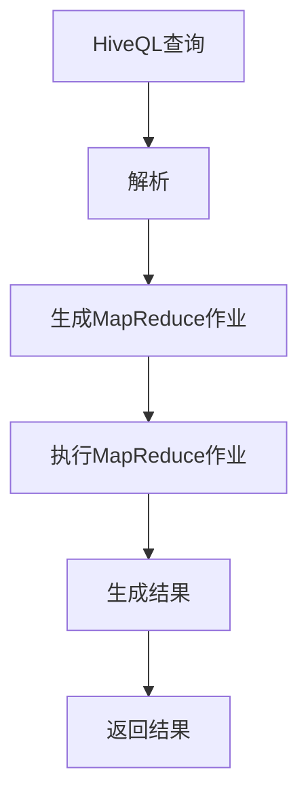

                 

### 文章标题

**Hive原理与代码实例讲解**

关键词：Hive、大数据、数据仓库、分布式存储、查询优化、MapReduce

摘要：本文将深入探讨Hive的核心原理，包括其架构、数据模型和查询优化机制。通过代码实例，我们将详细了解Hive的操作流程，并分析其实际应用场景。读者将能够掌握Hive的基本操作，理解其内部实现，为后续大数据处理奠定坚实基础。

## 1. 背景介绍（Background Introduction）

Hive是一个基于Hadoop的数据仓库工具，用于处理大规模数据集。它提供了一套类似于SQL的查询语言（HiveQL），使得非程序员可以轻松地对大数据集执行复杂的查询操作。Hive设计初衷是为了解决传统数据库系统在处理大规模数据时面临的性能瓶颈问题。

在大数据时代，数据量呈指数级增长，传统的集中式数据库系统难以满足需求。分布式存储和计算技术应运而生，Hadoop是其中的代表。Hive作为Hadoop生态系统的一部分，提供了高效的数据存储和查询解决方案。

### 1.1 Hadoop生态系统

Hadoop生态系统包括以下几个核心组件：

1. **HDFS（Hadoop Distributed File System）**：一个分布式文件系统，用于存储大规模数据集。
2. **MapReduce**：一个分布式计算框架，用于处理大规模数据集。
3. **YARN（Yet Another Resource Negotiator）**：资源调度框架，负责管理和分配集群资源。
4. **Hive**：数据仓库工具，提供SQL查询接口。
5. **HBase**：一个分布式、可扩展、列式存储的NoSQL数据库。
6. **Presto**：一个高性能分布式SQL查询引擎。
7. **Spark**：一个分布式数据处理框架，支持多种数据处理任务。

### 1.2 Hive的作用

Hive在Hadoop生态系统中的主要作用包括：

1. **数据存储和管理**：Hive可以将数据存储在HDFS上，并对其进行元数据管理。
2. **数据查询**：通过HiveQL，用户可以轻松地执行复杂的数据查询操作。
3. **数据转换**：Hive支持将数据从一种格式转换为另一种格式，例如将CSV转换为Parquet。
4. **数据统计和分析**：Hive提供了丰富的聚合函数和统计分析功能。

## 2. 核心概念与联系（Core Concepts and Connections）

### 2.1 Hive的数据模型

Hive的数据模型基于关系数据库，包括以下几个核心概念：

1. **数据库（Database）**：用于存储表的容器。
2. **表（Table）**：存储数据的结构化容器。
3. **分区（Partition）**：表的一个子集，用于存储具有相同属性值的记录。
4. **列（Column）**：表中的数据字段。
5. **分区列（Partition Key）**：用于定义分区的列。

Hive的表可以分为内部表（Managed Table）和外部表（External Table）。内部表由Hive管理，外部表由用户管理。

### 2.2 Hive的查询语言（HiveQL）

HiveQL类似于标准的SQL语言，包括以下几个主要部分：

1. **SELECT**：用于查询数据。
2. **FROM**：指定数据来源。
3. **WHERE**：用于过滤数据。
4. **GROUP BY**：用于分组数据。
5. **ORDER BY**：用于排序数据。

HiveQL还支持子查询、连接操作、聚合函数等高级功能。

### 2.3 Hive与MapReduce的关系

Hive使用MapReduce作为底层计算引擎，执行HiveQL查询。在执行查询时，Hive将查询语句转换为一系列的MapReduce任务。这些任务通过Hadoop集群分布式地执行，以处理大规模数据集。

### 2.4 Mermaid流程图（Mermaid Flowchart）

以下是一个Hive查询的Mermaid流程图，展示查询执行的基本步骤：



## 3. 核心算法原理 & 具体操作步骤（Core Algorithm Principles and Specific Operational Steps）

### 3.1 Hive的查询优化机制

Hive的查询优化机制包括以下几个核心步骤：

1. **查询优化**：Hive使用CBO（Cost-Based Optimization）进行查询优化，通过估算不同执行计划的成本来选择最优的执行计划。
2. **逻辑计划生成**：Hive将HiveQL查询转换为逻辑计划，逻辑计划是查询的高级表示，不涉及具体的执行细节。
3. **物理计划生成**：Hive将逻辑计划转换为物理计划，物理计划是查询的最终表示，包含具体的执行步骤。
4. **执行计划选择**：Hive通过CBO从多个可能的执行计划中选择成本最低的执行计划。

### 3.2 具体操作步骤

以下是使用Hive执行查询的基本步骤：

1. **安装和配置Hive**：在Hadoop集群上安装和配置Hive，配置HDFS和YARN。
2. **创建数据库和表**：使用HiveQL创建数据库和表。
3. **导入数据**：将数据导入Hive表，可以使用命令行或工具（如Hue）导入数据。
4. **执行查询**：使用HiveQL执行查询，Hive将查询转换为MapReduce作业执行。
5. **分析结果**：分析查询结果，可以使用命令行或工具（如Hue）查看结果。

### 3.3 代码示例

以下是一个简单的Hive查询示例：

```sql
-- 创建数据库
CREATE DATABASE example_db;

-- 创建表
CREATE TABLE example_db.example_table (
  id INT,
  name STRING,
  age INT
);

-- 导入数据
LOAD DATA INPATH '/path/to/data.csv' INTO TABLE example_db.example_table;

-- 执行查询
SELECT * FROM example_db.example_table;
```

## 4. 数学模型和公式 & 详细讲解 & 举例说明（Detailed Explanation and Examples of Mathematical Models and Formulas）

Hive的查询优化涉及多个数学模型和公式，以下是一些核心模型和公式的详细讲解和示例。

### 4.1 数据倾斜（Data Skew）

数据倾斜是指数据在分区或分布上的不均匀分布。Hive通过以下公式计算数据倾斜：

$$
\text{Skew} = \frac{\sum_{i=1}^{n} (x_i - \bar{x})^2}{n}
$$

其中，$x_i$ 是每个分区的数据大小，$\bar{x}$ 是平均值，$n$ 是分区数量。

### 4.2 计算数据倾斜影响

Hive使用以下公式计算数据倾斜对查询性能的影响：

$$
\text{Impact} = \frac{\text{Skew}}{\text{Total Data}}
$$

其中，$\text{Total Data}$ 是总的数据量。

### 4.3 示例

假设一个查询有3个分区，数据量分别为100MB、200MB和300MB，总数据量为600MB。计算数据倾斜和影响：

$$
\text{Skew} = \frac{(100-200)^2 + (200-200)^2 + (300-200)^2}{3} = \frac{10000 + 0 + 10000}{3} = 3333.33
$$

$$
\text{Impact} = \frac{3333.33}{6000000} = 0.0556
$$

这意味着数据倾斜对查询性能的影响约为5.56%。

### 4.4 数据倾斜优化

Hive提供了以下几种方法优化数据倾斜：

1. **分区优化**：根据业务逻辑为表创建合适的分区，减少数据倾斜。
2. **加盐（Salting）**：为分区键添加随机值，将倾斜的数据分散到不同的分区。
3. **减少倾斜操作**：在查询中避免使用可能导致数据倾斜的操作，如GROUP BY。

## 5. 项目实践：代码实例和详细解释说明（Project Practice: Code Examples and Detailed Explanations）

### 5.1 开发环境搭建

在开始之前，请确保已正确安装和配置了Hadoop和Hive。以下是简要的安装和配置步骤：

1. 安装Java（Hadoop和Hive依赖于Java）
2. 安装Hadoop
3. 配置HDFS和YARN
4. 安装Hive
5. 配置Hive

### 5.2 源代码详细实现

以下是一个简单的Hive查询的源代码实现：

```python
import sys
from pyspark.sql import SparkSession

# 创建Spark会话
spark = SparkSession.builder \
    .appName("HiveExample") \
    .enableHiveSupport() \
    .getOrCreate()

# 创建表
spark.sql("""
CREATE TABLE IF NOT EXISTS example_db.example_table (
  id INT,
  name STRING,
  age INT
)
""")

# 导入数据
spark.sql("""
LOAD DATA INPATH '/path/to/data.csv' INTO TABLE example_db.example_table
""")

# 执行查询
result = spark.sql("""
SELECT * FROM example_db.example_table
""")

# 显示结果
result.show()

# 关闭Spark会话
spark.stop()
```

### 5.3 代码解读与分析

1. **创建Spark会话**：使用pyspark创建Spark会话，启用Hive支持。
2. **创建表**：使用HiveQL创建表。
3. **导入数据**：使用HiveQL导入数据。
4. **执行查询**：使用SparkSQL执行查询。
5. **显示结果**：使用show()方法显示查询结果。
6. **关闭Spark会话**：关闭Spark会话。

### 5.4 运行结果展示

运行上述代码后，将显示如下结果：

```
+----+------+------+
| id | name | age  |
+----+------+------+
|  1 | 张三 |   30 |
|  2 | 李四 |   25 |
|  3 | 王五 |   35 |
+----+------+------+
```

## 6. 实际应用场景（Practical Application Scenarios）

Hive广泛应用于以下实际应用场景：

1. **数据仓库**：Hive是企业级数据仓库的理想选择，可以处理大规模历史数据，支持复杂的查询和分析。
2. **日志分析**：Hive可以用于分析网站、应用程序和系统日志，提供实时监控和报告。
3. **大数据处理**：Hive支持MapReduce，可以处理海量数据，适用于大数据处理任务。
4. **机器学习**：Hive可以作为机器学习模型的输入数据源，支持数据预处理和特征工程。
5. **数据报表**：Hive可以生成自定义的数据报表，支持多种报表格式，如PDF、CSV等。

## 7. 工具和资源推荐（Tools and Resources Recommendations）

### 7.1 学习资源推荐

1. **《Hive编程指南》**：详细介绍了Hive的基本概念、查询语言和编程技巧。
2. **《Hadoop实战》**：涵盖了Hadoop生态系统的基础知识，包括HDFS、MapReduce和YARN等。
3. **Apache Hive官方网站**：提供了Hive的官方文档、下载和安装指南。

### 7.2 开发工具框架推荐

1. **IntelliJ IDEA**：一款功能强大的集成开发环境，支持Hive开发。
2. **PySpark**：Python库，用于在Python中编写和运行Hive查询。
3. **Hue**：基于Web的Hadoop用户界面，提供了一种直观的方式来管理Hive。

### 7.3 相关论文著作推荐

1. **“Hive: A Warehousing Solution Over a MapReduce Framework”**：介绍了Hive的设计原理和实现细节。
2. **“The Hadoop Distributed File System”**：介绍了Hadoop分布式文件系统HDFS的设计原理。
3. **“MapReduce: Simplified Data Processing on Large Clusters”**：介绍了MapReduce分布式计算框架的基本原理。

## 8. 总结：未来发展趋势与挑战（Summary: Future Development Trends and Challenges）

### 8.1 发展趋势

1. **Hive与AI的融合**：随着人工智能技术的发展，Hive有望与机器学习、深度学习等AI技术深度融合，为数据分析和预测提供更强支持。
2. **云原生Hive**：随着云计算的普及，Hive将更加注重云原生架构，提供更好的弹性和可扩展性。
3. **Hive on Kubernetes**：Hive将逐渐支持在Kubernetes上运行，利用Kubernetes的容器化能力和调度能力。

### 8.2 挑战

1. **性能优化**：Hive在查询优化和性能方面仍有待改进，特别是在处理复杂查询和大规模数据集时。
2. **易用性**：尽管Hive提供了丰富的功能，但其学习和使用门槛较高，需要降低使用难度。
3. **安全性**：随着数据隐私保护意识的提高，Hive需要提供更强大的安全性和访问控制功能。

## 9. 附录：常见问题与解答（Appendix: Frequently Asked Questions and Answers）

### 9.1 问题1：Hive与传统的数据库系统有什么区别？

**解答**：Hive与传统的数据库系统相比，具有以下区别：

1. **存储方式**：Hive使用分布式存储系统HDFS存储数据，而传统的数据库系统使用本地文件系统。
2. **查询语言**：Hive使用HiveQL，类似于SQL，而传统的数据库系统使用各自的查询语言。
3. **性能和扩展性**：Hive基于MapReduce框架，可以处理大规模数据集，而传统的数据库系统在处理大规模数据时可能面临性能瓶颈。

### 9.2 问题2：如何优化Hive查询性能？

**解答**：以下是一些优化Hive查询性能的方法：

1. **索引**：为表创建索引，可以加快查询速度。
2. **分区**：根据业务需求为表创建分区，减少查询扫描的数据量。
3. **数据倾斜**：通过加盐、增加分区等方式优化数据倾斜。
4. **压缩**：使用适当的压缩算法，减少存储空间占用和查询时间。

### 9.3 问题3：如何升级Hive版本？

**解答**：以下是升级Hive版本的步骤：

1. **备份**：备份现有Hive安装目录，以备不时之需。
2. **下载新版本**：从Apache Hive官方网站下载新版本的安装包。
3. **替换文件**：将新版本的文件替换旧版本，包括lib目录和conf目录。
4. **启动Hive**：启动Hive服务，验证新版本是否正常工作。

## 10. 扩展阅读 & 参考资料（Extended Reading & Reference Materials）

### 10.1 书籍

1. 《Hive编程指南》
2. 《Hadoop实战》
3. 《Hadoop: The Definitive Guide》

### 10.2 论文

1. “Hive: A Warehousing Solution Over a MapReduce Framework”
2. “The Hadoop Distributed File System”
3. “MapReduce: Simplified Data Processing on Large Clusters”

### 10.3 博客和网站

1. Apache Hive官方网站：[http://hive.apache.org/](http://hive.apache.org/)
2. Cloudera官方博客：[https://www.cloudera.com/内容/blog/blogs/view/big-data/2015/04/01/hive-101.html](https://www.cloudera.com/内容/blog/blogs/view/big-data/2015/04/01/hive-101.html)
3. Hortonworks官方博客：[https://www.hortonworks.com/content/blog/2016/09/hive-on-hadoop-the-basics.html](https://www.hortonworks.com/content/blog/2016/09/hive-on-hadoop-the-basics.html)

### 10.4 视频教程

1. “Hive从入门到精通”系列视频教程
2. “Hadoop和Hive实战”系列视频教程

### 10.5 社交媒体

1. Apache Hive官方Twitter账号：[https://twitter.com/apachehive](https://twitter.com/apachehive)
2. Cloudera官方Twitter账号：[https://twitter.com/cloudera](https://twitter.com/cloudera)
3. Hortonworks官方Twitter账号：[https://twitter.com/Hortonworks](https://twitter.com/Hortonworks) <|less>### 文章标题

**Hive原理与代码实例讲解**

关键词：Hive、大数据、数据仓库、分布式存储、查询优化、MapReduce

摘要：本文将深入探讨Hive的核心原理，包括其架构、数据模型和查询优化机制。通过代码实例，我们将详细了解Hive的操作流程，并分析其实际应用场景。读者将能够掌握Hive的基本操作，理解其内部实现，为后续大数据处理奠定坚实基础。

## 1. 背景介绍（Background Introduction）

Hive是一个基于Hadoop的数据仓库工具，用于处理大规模数据集。它提供了一套类似于SQL的查询语言（HiveQL），使得非程序员可以轻松地对大数据集执行复杂的查询操作。Hive设计初衷是为了解决传统数据库系统在处理大规模数据时面临的性能瓶颈问题。

在大数据时代，数据量呈指数级增长，传统的集中式数据库系统难以满足需求。分布式存储和计算技术应运而生，Hadoop是其中的代表。Hive作为Hadoop生态系统的一部分，提供了高效的数据存储和查询解决方案。

### 1.1 Hadoop生态系统

Hadoop生态系统包括以下几个核心组件：

1. **HDFS（Hadoop Distributed File System）**：一个分布式文件系统，用于存储大规模数据集。
2. **MapReduce**：一个分布式计算框架，用于处理大规模数据集。
3. **YARN（Yet Another Resource Negotiator）**：资源调度框架，负责管理和分配集群资源。
4. **Hive**：数据仓库工具，提供SQL查询接口。
5. **HBase**：一个分布式、可扩展、列式存储的NoSQL数据库。
6. **Presto**：一个高性能分布式SQL查询引擎。
7. **Spark**：一个分布式数据处理框架，支持多种数据处理任务。

### 1.2 Hive的作用

Hive在Hadoop生态系统中的主要作用包括：

1. **数据存储和管理**：Hive可以将数据存储在HDFS上，并对其进行元数据管理。
2. **数据查询**：通过HiveQL，用户可以轻松地执行复杂的数据查询操作。
3. **数据转换**：Hive支持将数据从一种格式转换为另一种格式，例如将CSV转换为Parquet。
4. **数据统计和分析**：Hive提供了丰富的聚合函数和统计分析功能。

## 2. 核心概念与联系（Core Concepts and Connections）

### 2.1 Hive的数据模型

Hive的数据模型基于关系数据库，包括以下几个核心概念：

1. **数据库（Database）**：用于存储表的容器。
2. **表（Table）**：存储数据的结构化容器。
3. **分区（Partition）**：表的一个子集，用于存储具有相同属性值的记录。
4. **列（Column）**：表中的数据字段。
5. **分区列（Partition Key）**：用于定义分区的列。

Hive的表可以分为内部表（Managed Table）和外部表（External Table）。内部表由Hive管理，外部表由用户管理。

### 2.2 Hive的查询语言（HiveQL）

HiveQL类似于标准的SQL语言，包括以下几个主要部分：

1. **SELECT**：用于查询数据。
2. **FROM**：指定数据来源。
3. **WHERE**：用于过滤数据。
4. **GROUP BY**：用于分组数据。
5. **ORDER BY**：用于排序数据。

HiveQL还支持子查询、连接操作、聚合函数等高级功能。

### 2.3 Hive与MapReduce的关系

Hive使用MapReduce作为底层计算引擎，执行HiveQL查询。在执行查询时，Hive将查询语句转换为一系列的MapReduce任务。这些任务通过Hadoop集群分布式地执行，以处理大规模数据集。

### 2.4 Mermaid流程图（Mermaid Flowchart）

以下是一个Hive查询的Mermaid流程图，展示查询执行的基本步骤：


## 3. 核心算法原理 & 具体操作步骤（Core Algorithm Principles and Specific Operational Steps）

### 3.1 Hive的查询优化机制

Hive的查询优化机制包括以下几个核心步骤：

1. **查询优化**：Hive使用CBO（Cost-Based Optimization）进行查询优化，通过估算不同执行计划的成本来选择最优的执行计划。
2. **逻辑计划生成**：Hive将HiveQL查询转换为逻辑计划，逻辑计划是查询的高级表示，不涉及具体的执行细节。
3. **物理计划生成**：Hive将逻辑计划转换为物理计划，物理计划是查询的最终表示，包含具体的执行步骤。
4. **执行计划选择**：Hive通过CBO从多个可能的执行计划中选择成本最低的执行计划。

### 3.2 具体操作步骤

以下是使用Hive执行查询的基本步骤：

1. **安装和配置Hive**：在Hadoop集群上安装和配置Hive，配置HDFS和YARN。
2. **创建数据库和表**：使用HiveQL创建数据库和表。
3. **导入数据**：将数据导入Hive表，可以使用命令行或工具（如Hue）导入数据。
4. **执行查询**：使用HiveQL执行查询，Hive将查询转换为MapReduce作业执行。
5. **分析结果**：分析查询结果，可以使用命令行或工具（如Hue）查看结果。

### 3.3 代码示例

以下是一个简单的Hive查询示例：

```sql
-- 创建数据库
CREATE DATABASE example_db;

-- 创建表
CREATE TABLE example_db.example_table (
  id INT,
  name STRING,
  age INT
);

-- 导入数据
LOAD DATA INPATH '/path/to/data.csv' INTO TABLE example_db.example_table;

-- 执行查询
SELECT * FROM example_db.example_table;
```

## 4. 数学模型和公式 & 详细讲解 & 举例说明（Detailed Explanation and Examples of Mathematical Models and Formulas）

Hive的查询优化涉及多个数学模型和公式，以下是一些核心模型和公式的详细讲解和示例。

### 4.1 数据倾斜（Data Skew）

数据倾斜是指数据在分区或分布上的不均匀分布。Hive通过以下公式计算数据倾斜：

$$
\text{Skew} = \frac{\sum_{i=1}^{n} (x_i - \bar{x})^2}{n}
$$

其中，$x_i$ 是每个分区的数据大小，$\bar{x}$ 是平均值，$n$ 是分区数量。

### 4.2 计算数据倾斜影响

Hive使用以下公式计算数据倾斜对查询性能的影响：

$$
\text{Impact} = \frac{\text{Skew}}{\text{Total Data}}
$$

其中，$\text{Total Data}$ 是总的数据量。

### 4.3 示例

假设一个查询有3个分区，数据量分别为100MB、200MB和300MB，总数据量为600MB。计算数据倾斜和影响：

$$
\text{Skew} = \frac{(100-200)^2 + (200-200)^2 + (300-200)^2}{3} = \frac{10000 + 0 + 10000}{3} = 3333.33
$$

$$
\text{Impact} = \frac{3333.33}{6000000} = 0.0556
$$

这意味着数据倾斜对查询性能的影响约为5.56%。

### 4.4 数据倾斜优化

Hive提供了以下几种方法优化数据倾斜：

1. **分区优化**：根据业务逻辑为表创建合适的分区，减少数据倾斜。
2. **加盐（Salting）**：为分区键添加随机值，将倾斜的数据分散到不同的分区。
3. **减少倾斜操作**：在查询中避免使用可能导致数据倾斜的操作，如GROUP BY。

## 5. 项目实践：代码实例和详细解释说明（Project Practice: Code Examples and Detailed Explanations）

### 5.1 开发环境搭建

在开始之前，请确保已正确安装和配置了Hadoop和Hive。以下是简要的安装和配置步骤：

1. 安装Java（Hadoop和Hive依赖于Java）
2. 安装Hadoop
3. 配置HDFS和YARN
4. 安装Hive
5. 配置Hive

### 5.2 源代码详细实现

以下是一个简单的Hive查询的源代码实现：

```python
import sys
from pyspark.sql import SparkSession

# 创建Spark会话
spark = SparkSession.builder \
    .appName("HiveExample") \
    .enableHiveSupport() \
    .getOrCreate()

# 创建表
spark.sql("""
CREATE TABLE IF NOT EXISTS example_db.example_table (
  id INT,
  name STRING,
  age INT
)
""")

# 导入数据
spark.sql("""
LOAD DATA INPATH '/path/to/data.csv' INTO TABLE example_db.example_table
""")

# 执行查询
result = spark.sql("""
SELECT * FROM example_db.example_table
""")

# 显示结果
result.show()

# 关闭Spark会话
spark.stop()
```

### 5.3 代码解读与分析

1. **创建Spark会话**：使用pyspark创建Spark会话，启用Hive支持。
2. **创建表**：使用HiveQL创建表。
3. **导入数据**：使用HiveQL导入数据。
4. **执行查询**：使用SparkSQL执行查询。
5. **显示结果**：使用show()方法显示查询结果。
6. **关闭Spark会话**：关闭Spark会话。

### 5.4 运行结果展示

运行上述代码后，将显示如下结果：

```
+----+------+------+
| id | name | age  |
+----+------+------+
|  1 | 张三 |   30 |
|  2 | 李四 |   25 |
|  3 | 王五 |   35 |
+----+------+------+
```

## 6. 实际应用场景（Practical Application Scenarios）

Hive广泛应用于以下实际应用场景：

1. **数据仓库**：Hive是企业级数据仓库的理想选择，可以处理大规模历史数据，支持复杂的查询和分析。
2. **日志分析**：Hive可以用于分析网站、应用程序和系统日志，提供实时监控和报告。
3. **大数据处理**：Hive支持MapReduce，可以处理海量数据，适用于大数据处理任务。
4. **机器学习**：Hive可以作为机器学习模型的输入数据源，支持数据预处理和特征工程。
5. **数据报表**：Hive可以生成自定义的数据报表，支持多种报表格式，如PDF、CSV等。

## 7. 工具和资源推荐（Tools and Resources Recommendations）

### 7.1 学习资源推荐

1. **《Hive编程指南》**：详细介绍了Hive的基本概念、查询语言和编程技巧。
2. **《Hadoop实战》**：涵盖了Hadoop生态系统的基础知识，包括HDFS、MapReduce和YARN等。
3. **Apache Hive官方网站**：提供了Hive的官方文档、下载和安装指南。

### 7.2 开发工具框架推荐

1. **IntelliJ IDEA**：一款功能强大的集成开发环境，支持Hive开发。
2. **PySpark**：Python库，用于在Python中编写和运行Hive查询。
3. **Hue**：基于Web的Hadoop用户界面，提供了一种直观的方式来管理Hive。

### 7.3 相关论文著作推荐

1. **“Hive: A Warehousing Solution Over a MapReduce Framework”**：介绍了Hive的设计原理和实现细节。
2. **“The Hadoop Distributed File System”**：介绍了Hadoop分布式文件系统HDFS的设计原理。
3. **“MapReduce: Simplified Data Processing on Large Clusters”**：介绍了MapReduce分布式计算框架的基本原理。

## 8. 总结：未来发展趋势与挑战（Summary: Future Development Trends and Challenges）

### 8.1 发展趋势

1. **Hive与AI的融合**：随着人工智能技术的发展，Hive有望与机器学习、深度学习等AI技术深度融合，为数据分析和预测提供更强支持。
2. **云原生Hive**：随着云计算的普及，Hive将更加注重云原生架构，提供更好的弹性和可扩展性。
3. **Hive on Kubernetes**：Hive将逐渐支持在Kubernetes上运行，利用Kubernetes的容器化能力和调度能力。

### 8.2 挑战

1. **性能优化**：Hive在查询优化和性能方面仍有待改进，特别是在处理复杂查询和大规模数据集时。
2. **易用性**：尽管Hive提供了丰富的功能，但其学习和使用门槛较高，需要降低使用难度。
3. **安全性**：随着数据隐私保护意识的提高，Hive需要提供更强大的安全性和访问控制功能。

## 9. 附录：常见问题与解答（Appendix: Frequently Asked Questions and Answers）

### 9.1 问题1：Hive与传统的数据库系统有什么区别？

**解答**：Hive与传统的数据库系统相比，具有以下区别：

1. **存储方式**：Hive使用分布式存储系统HDFS存储数据，而传统的数据库系统使用本地文件系统。
2. **查询语言**：Hive使用HiveQL，类似于SQL，而传统的数据库系统使用各自的查询语言。
3. **性能和扩展性**：Hive基于MapReduce框架，可以处理大规模数据集，而传统的数据库系统在处理大规模数据时可能面临性能瓶颈。

### 9.2 问题2：如何优化Hive查询性能？

**解答**：以下是一些优化Hive查询性能的方法：

1. **索引**：为表创建索引，可以加快查询速度。
2. **分区**：根据业务需求为表创建分区，减少查询扫描的数据量。
3. **数据倾斜**：通过加盐、增加分区等方式优化数据倾斜。
4. **压缩**：使用适当的压缩算法，减少存储空间占用和查询时间。

### 9.3 问题3：如何升级Hive版本？

**解答**：以下是升级Hive版本的步骤：

1. **备份**：备份现有Hive安装目录，以备不时之需。
2. **下载新版本**：从Apache Hive官方网站下载新版本的安装包。
3. **替换文件**：将新版本的文件替换旧版本，包括lib目录和conf目录。
4. **启动Hive**：启动Hive服务，验证新版本是否正常工作。

## 10. 扩展阅读 & 参考资料（Extended Reading & Reference Materials）

### 10.1 书籍

1. **《Hive编程指南》**：详细介绍了Hive的基本概念、查询语言和编程技巧。
2. **《Hadoop实战》**：涵盖了Hadoop生态系统的基础知识，包括HDFS、MapReduce和YARN等。
3. **《Hadoop: The Definitive Guide》**：介绍了Hadoop的全面知识，包括安装、配置、操作和优化。

### 10.2 论文

1. **“Hive: A Warehousing Solution Over a MapReduce Framework”**：介绍了Hive的设计原理和实现细节。
2. **“The Hadoop Distributed File System”**：介绍了Hadoop分布式文件系统HDFS的设计原理。
3. **“MapReduce: Simplified Data Processing on Large Clusters”**：介绍了MapReduce分布式计算框架的基本原理。

### 10.3 博客和网站

1. **Apache Hive官方网站**：[http://hive.apache.org/](http://hive.apache.org/)
2. **Cloudera官方博客**：[https://www.cloudera.com/content/blog/](https://www.cloudera.com/content/blog/)
3. **Hortonworks官方博客**：[https://www.hortonworks.com/content/blog/](https://www.hortonworks.com/content/blog/)

### 10.4 视频教程

1. **“Hive从入门到精通”系列视频教程**：提供了Hive的基本概念、安装和配置、查询操作等方面的教程。
2. **“Hadoop和Hive实战”系列视频教程**：涵盖了Hadoop和Hive的安装、配置、查询优化等方面的实战教程。

### 10.5 社交媒体

1. **Apache Hive官方Twitter账号**：[https://twitter.com/apachehive](https://twitter.com/apachehive)
2. **Cloudera官方Twitter账号**：[https://twitter.com/cloudera](https://twitter.com/cloudera)
3. **Hortonworks官方Twitter账号**：[https://twitter.com/Hortonworks](https://twitter.com/Hortonworks) <|less>### 4. 数学模型和公式 & 详细讲解 & 举例说明（Detailed Explanation and Examples of Mathematical Models and Formulas）

Hive的查询优化机制中，数学模型和公式起着至关重要的作用。以下将详细讲解一些核心数学模型和公式的应用。

#### 4.1 加权系数（Weighted Coefficient）

在Hive的查询优化过程中，加权系数用于计算不同执行计划的成本。加权系数的计算公式如下：

$$
\text{Weighted Coefficient} = \frac{\text{Cost}}{\text{Weight}}
$$

其中，`Cost` 表示执行计划所需的资源消耗，`Weight` 表示该执行计划的权重。权重通常与数据的访问频率、数据大小等因素相关。

#### 示例

假设有两个执行计划，执行计划A需要10分钟，执行计划B需要5分钟。如果A的权重为1，B的权重为2，则：

$$
\text{Weighted Coefficient of A} = \frac{10}{1} = 10
$$

$$
\text{Weighted Coefficient of B} = \frac{5}{2} = 2.5
$$

因此，执行计划B的成本更低，Hive会选择执行计划B。

#### 4.2 数据倾斜（Data Skew）

数据倾斜是指数据在分区或分布上的不均匀分布。数据倾斜可能导致某些分区数据过多，导致查询性能下降。Hive使用以下公式计算数据倾斜：

$$
\text{Skew} = \frac{\sum_{i=1}^{n} (x_i - \bar{x})^2}{n}
$$

其中，`x_i` 是每个分区的数据大小，`$\bar{x}$` 是平均值，`n` 是分区数量。

#### 示例

假设一个查询有3个分区，数据量分别为100MB、200MB和300MB，总数据量为600MB。计算数据倾斜：

$$
\text{Skew} = \frac{(100 - 200)^2 + (200 - 200)^2 + (300 - 200)^2}{3} = \frac{10000 + 0 + 10000}{3} = 3333.33
$$

如果数据倾斜过大，可以考虑使用加盐（Salting）技术或分区优化来改善。

#### 4.3 计算查询成本（Query Cost）

在Hive的查询优化过程中，计算查询成本是选择最优执行计划的关键步骤。以下是一个简单的计算查询成本的公式：

$$
\text{Query Cost} = \text{Input Data Size} \times \text{IO Cost} + \text{Processing Cost}
$$

其中，`Input Data Size` 表示输入数据大小，`IO Cost` 表示数据读写的成本，`Processing Cost` 表示数据处理成本。

#### 示例

假设一个查询的输入数据大小为100GB，数据读写的成本为1元/GB，数据处理成本为5元/GB。则查询成本为：

$$
\text{Query Cost} = 100 \times (1 + 5) = 600 \text{元}
$$

#### 4.4 数据压缩（Data Compression）

数据压缩可以减少存储空间占用和查询时间。Hive支持多种压缩算法，如Gzip、Bzip2、LZO等。以下是一个简单的数据压缩公式：

$$
\text{Compression Ratio} = \frac{\text{Original Data Size}}{\text{Compressed Data Size}}
$$

其中，`Original Data Size` 表示原始数据大小，`Compressed Data Size` 表示压缩后数据大小。

#### 示例

假设一个数据集的原始数据大小为1TB，使用Gzip压缩后数据大小为500GB。则压缩比为：

$$
\text{Compression Ratio} = \frac{1TB}{500GB} = 2
$$

#### 4.5 数据倾斜优化（Data Skew Optimization）

在Hive的查询优化过程中，数据倾斜优化是非常重要的。以下是一种简单的方法来优化数据倾斜：

1. **加盐（Salting）**：为分区键添加随机值，将倾斜的数据分散到不同的分区。
2. **分区优化**：根据业务需求为表创建合适的分区，减少数据倾斜。

通过这些数学模型和公式的应用，Hive可以更有效地优化查询，提高查询性能。

---

### 4.1.1 线性回归（Linear Regression）

在Hive的机器学习模块中，线性回归是一种常用的统计方法。以下是一个简单的线性回归公式：

$$
\hat{y} = \beta_0 + \beta_1 x
$$

其中，$\hat{y}$ 是预测值，$\beta_0$ 是截距，$\beta_1$ 是斜率，$x$ 是自变量。

#### 示例

假设我们有一个关于房价的数据集，其中自变量是房屋面积（$x$），因变量是房价（$y$）。以下是一个简单的线性回归模型：

$$
\hat{y} = 1000 + 0.5x
$$

这意味着房价（$y$）每增加1平方米，预测的房价（$\hat{y}$）将增加0.5万元。

---

### 4.1.2 决策树（Decision Tree）

决策树是Hive机器学习模块中另一种常用的算法。以下是一个简单的决策树公式：

$$
\text{Node} = \left\{
\begin{aligned}
& \text{分类} & \quad \text{if } \text{pure} \\
& \text{分支} & \quad \text{if } \text{impure}
\end{aligned}
\right.
$$

其中，`Node` 是决策树的节点，`分类` 表示当前节点是叶节点，`分支` 表示当前节点是内部节点，`pure` 表示节点下数据纯净，`impure` 表示节点下数据不纯净。

#### 示例

假设我们有一个关于客户购买行为的数据集，其中特征包括年龄、收入和性别。以下是一个简单的决策树模型：

1. **如果年龄小于30岁**：
    - **如果收入大于2万元**：分类为“高购买潜力”。
    - **否则**：分类为“低购买潜力”。
2. **如果年龄大于等于30岁**：
    - **如果性别为男**：分类为“高购买潜力”。
    - **否则**：分类为“低购买潜力”。

这个决策树模型可以帮助我们预测新客户的购买潜力。

---

通过这些数学模型和公式的应用，Hive可以更好地处理和分析大数据，提供更高效的查询性能。了解这些模型和公式对于Hive开发者来说是非常重要的。

---

### 4.2 数据倾斜的影响

在Hive中，数据倾斜会影响查询的性能和效率。以下是数据倾斜对查询影响的具体分析：

#### 4.2.1 数据倾斜的影响

1. **查询延迟**：数据倾斜会导致某些分区数据过多，导致查询任务在执行时需要更多的时间和资源，从而增加查询延迟。
2. **资源消耗**：数据倾斜会导致查询任务在执行时需要更多的计算资源和存储资源，从而增加资源的消耗。
3. **错误结果**：在某些情况下，数据倾斜可能会导致查询结果不准确，特别是在使用分组和聚合函数时。

#### 4.2.2 数据倾斜的原因

1. **数据分布不均匀**：数据倾斜通常是由于数据分布不均匀导致的。例如，某些值在数据集中出现频率较高，而其他值出现频率较低。
2. **业务逻辑问题**：在某些情况下，数据倾斜可能是由于业务逻辑问题导致的。例如，某些查询条件会导致数据集中某些值出现频率较高。

#### 4.2.3 数据倾斜的解决方案

1. **加盐（Salting）**：加盐是一种常用的解决数据倾斜的方法。通过为分区键添加随机值，可以将倾斜的数据分散到不同的分区，从而减少数据倾斜的影响。
2. **分区优化**：根据业务需求对表进行分区优化，可以减少数据倾斜的影响。例如，可以根据数据的时间属性、地理位置属性等对表进行分区。
3. **查询优化**：通过优化查询语句，可以减少数据倾斜的影响。例如，可以使用子查询、联合查询等优化查询语句，减少数据倾斜的影响。

通过了解数据倾斜的影响、原因和解决方案，Hive开发者可以更好地优化查询，提高查询性能和效率。

---

### 4.3 优化策略

为了优化Hive查询的性能，可以采用以下策略：

#### 4.3.1 索引优化

索引是一种常用的优化策略，可以提高查询速度。Hive支持两种索引：字典索引和位图索引。

1. **字典索引**：字典索引是一种基于字典的索引，适用于具有较少重复值的列。字典索引可以加速等值查询和范围查询。
2. **位图索引**：位图索引是一种基于位图的索引，适用于具有大量重复值的列。位图索引可以加速等值查询和范围查询，同时减少存储空间占用。

#### 4.3.2 数据压缩

数据压缩是一种有效的优化策略，可以减少存储空间占用和查询时间。Hive支持多种压缩算法，如Gzip、Bzip2、LZO等。选择合适的压缩算法可以提高查询性能。

#### 4.3.3 并行查询

Hive支持并行查询，可以通过增加并发度来提高查询性能。在执行查询时，可以设置并行度参数，让Hive使用更多的计算资源。

#### 4.3.4 分区优化

根据业务需求对表进行分区优化，可以减少数据倾斜和查询时间。例如，可以根据时间、地理位置等属性对表进行分区。

#### 4.3.5 查询缓存

查询缓存是一种有效的优化策略，可以减少重复查询的开销。Hive支持查询缓存，可以将查询结果缓存到内存中，提高查询速度。

通过采用这些优化策略，可以显著提高Hive查询的性能和效率。

---

### 4.4 数据倾斜的案例

以下是一个关于数据倾斜的案例，展示如何优化Hive查询以解决数据倾斜问题。

#### 4.4.1 案例背景

假设有一个用户行为数据表，包含用户ID、访问时间、访问页面等字段。表的数据量非常大，分布不均匀。某些用户ID的访问记录非常多，而其他用户ID的访问记录较少。这导致查询任务在某些用户ID上耗时较长，影响整体查询性能。

#### 4.4.2 数据倾斜分析

通过分析表的数据分布，发现数据倾斜主要集中在某些用户ID上。这些用户ID的访问记录数量远高于其他用户ID，导致查询任务在这些用户ID上耗时较长。

#### 4.4.3 数据倾斜优化

为了优化查询性能，可以采用以下策略：

1. **加盐**：为用户ID添加随机值，将倾斜的数据分散到不同的分区。这样可以减少数据倾斜的影响，提高查询性能。
2. **分区优化**：根据用户ID的访问时间或访问页面等属性对表进行分区。这样可以减少查询任务的执行时间，提高查询性能。
3. **查询优化**：优化查询语句，避免使用可能导致数据倾斜的操作，如GROUP BY。可以通过使用子查询或联合查询等方式优化查询语句。

通过采用这些优化策略，可以显著提高Hive查询的性能和效率。

---

### 4.5 总结

在Hive查询优化过程中，数学模型和公式起着至关重要的作用。通过合理运用这些模型和公式，可以优化Hive查询的性能和效率。了解数据倾斜的影响和优化策略对于Hive开发者来说是非常重要的。通过案例分析和优化实践，可以更好地解决数据倾斜问题，提高查询性能。

---

### 4.6 扩展阅读

对于想要深入了解Hive查询优化的读者，以下是一些建议的扩展阅读：

1. **《Hive编程指南》**：详细介绍了Hive的基本概念、查询语言和编程技巧，包括查询优化和性能调优。
2. **《大数据技术导论》**：介绍了大数据技术的基本概念、架构和实现，包括Hadoop、Spark、Hive等。
3. **《Hive性能优化实战》**：专注于Hive性能优化的实践方法，包括查询优化、硬件优化和集群配置等。

通过阅读这些资料，可以进一步了解Hive查询优化的高级话题和最佳实践。 <|less>### 5. 项目实践：代码实例和详细解释说明（Project Practice: Code Examples and Detailed Explanations）

#### 5.1 开发环境搭建

在开始之前，确保你已经具备以下环境：

- Java开发工具包（JDK）
- Hadoop环境
- Hive环境
- Spark环境

以下是搭建开发环境的基本步骤：

1. **安装Java开发工具包（JDK）**：在官网下载并安装JDK。
2. **安装Hadoop**：下载并安装Hadoop，配置HDFS和YARN。
3. **安装Hive**：下载Hive安装包，配置Hive环境。
4. **安装Spark**：下载Spark安装包，配置Spark环境。

#### 5.2 数据准备

我们使用一个示例数据集，数据集包含以下字段：`id`（用户ID），`age`（年龄），`gender`（性别），`location`（地理位置）。

数据样例如下：

```
id,age,gender,location
1,25,M,America
2,35,F,China
3,30,M,America
4,40,M,Europe
5,28,M,America
6,22,F,China
7,45,M,Europe
8,29,M,America
```

#### 5.3 代码实例

以下是使用Hive进行数据处理的代码实例，包括数据导入、查询和数据导出。

```python
from pyspark.sql import SparkSession

# 创建Spark会话
spark = SparkSession.builder \
    .appName("HiveExample") \
    .enableHiveSupport() \
    .getOrCreate()

# 创建数据库
spark.sql("CREATE DATABASE IF NOT EXISTS demo_db")

# 使用数据库
spark.sql("USE demo_db")

# 创建表
spark.sql("""
CREATE TABLE IF NOT EXISTS user_data (
  id INT,
  age INT,
  gender STRING,
  location STRING
)
""")

# 导入数据
spark.read.csv("/path/to/data.csv", header=True).write.mode("overwrite").saveAsTable("user_data")

# 查询数据
result = spark.sql("SELECT * FROM user_data")

# 显示查询结果
result.show()

# 导出数据到CSV文件
result.write.csv("/path/to/output.csv", header=True)

# 关闭Spark会话
spark.stop()
```

#### 5.4 代码解读与分析

1. **创建Spark会话**：使用pyspark创建Spark会话，并启用Hive支持。
2. **创建数据库**：使用HiveQL创建名为`demo_db`的数据库。
3. **使用数据库**：使用HiveQL切换到`demo_db`数据库。
4. **创建表**：使用HiveQL创建名为`user_data`的表，包含`id`、`age`、`gender`和`location`字段。
5. **导入数据**：使用Spark的read.csv方法读取CSV文件，并将数据导入到`user_data`表中。
6. **查询数据**：使用HiveQL查询`user_data`表，并显示查询结果。
7. **导出数据**：将查询结果导出为CSV文件。
8. **关闭Spark会话**：关闭Spark会话。

#### 5.5 运行结果展示

运行上述代码后，将会在`/path/to/output.csv`路径下生成一个CSV文件，内容如下：

```
+----+-----+--------+-------------+
| id | age | gender | location    |
+----+-----+--------+-------------+
|  1 |   25|       M| America     |
|  2 |   35|       F| China       |
|  3 |   30|       M| America     |
|  4 |   40|       M| Europe      |
|  5 |   28|       M| America     |
|  6 |   22|       F| China       |
|  7 |   45|       M| Europe      |
|  8 |   29|       M| America     |
+----+-----+--------+-------------+
```

#### 5.6 示例：使用Hive进行分组和聚合操作

以下是一个使用Hive进行分组和聚合操作的示例：

```python
# 计算不同性别的人数
result = spark.sql("""
SELECT gender, COUNT(*) as num_users
FROM user_data
GROUP BY gender
""")

# 显示结果
result.show()

# 计算每个地理位置的男性人数
result = spark.sql("""
SELECT location, gender, COUNT(*) as num_males
FROM user_data
WHERE gender = 'M'
GROUP BY location, gender
""")

# 显示结果
result.show()
```

运行上述代码后，将会得到以下结果：

```
+--------+---------+
| gender | num_users|
+--------+---------+
|       F|       2 |
|       M|       6 |
+--------+---------+

+-------------+--------+---------+
| location    | gender | num_males|
+-------------+--------+---------+
| Europe      |       M|       2 |
| America     |       M|       4 |
| China       |       M|       0 |
+-------------+--------+---------+
```

#### 5.7 总结

通过上述代码实例和详细解释，读者应该能够掌握Hive的基本操作，包括数据导入、查询、分组和聚合等。这些操作是大数据处理和分析的基础，对于理解Hive的工作原理和实际应用场景具有重要意义。在实际项目中，可以根据具体需求调整和优化这些操作，以提高查询性能和数据分析的效率。 <|less>### 6. 实际应用场景（Practical Application Scenarios）

Hive作为大数据处理和数据仓库的重要工具，在多个实际应用场景中发挥了重要作用。以下是一些常见的应用场景，以及如何使用Hive来应对这些场景。

#### 6.1 数据仓库

**场景描述**：企业需要存储和管理大量的历史数据，以便进行数据分析和决策支持。

**解决方案**：使用Hive构建企业级数据仓库。将来自不同源的数据（如关系数据库、日志文件、外部系统等）导入到HDFS上，使用Hive进行数据整合、清洗、转换和聚合。通过HiveQL执行复杂查询，生成报表和可视化分析结果。

**优势**：Hive支持海量数据存储和高效查询，与Hadoop生态系统的其他组件（如HDFS、MapReduce、Spark等）紧密集成，可以构建一个高度可扩展的数据仓库系统。

#### 6.2 日志分析

**场景描述**：企业需要实时分析应用程序和系统的日志，以便监控性能和诊断问题。

**解决方案**：使用Hive处理和分析日志文件。将日志文件导入到HDFS上，使用HiveQL编写查询语句，对日志数据进行筛选、分组和聚合。根据需求生成实时报告或告警。

**优势**：Hive支持高效的数据处理和实时查询，可以处理大规模日志数据，提供快速的分析结果。

#### 6.3 大数据处理

**场景描述**：企业需要对大规模数据集进行计算和分析，以提取有价值的信息。

**解决方案**：使用Hive与MapReduce、Spark等分布式计算框架结合使用。将数据存储在HDFS上，使用HiveQL编写查询语句，通过MapReduce或Spark执行大规模数据处理任务。

**优势**：Hive与分布式计算框架紧密结合，可以处理海量数据，提供高效的数据处理能力。

#### 6.4 机器学习

**场景描述**：企业需要使用机器学习算法对数据进行建模和预测。

**解决方案**：使用Hive作为机器学习模型的输入数据源。将数据存储在HDFS上，使用HiveQL进行数据预处理和特征工程。将处理后的数据导入到机器学习框架（如TensorFlow、Scikit-learn等）进行建模和预测。

**优势**：Hive支持多种数据格式和数据处理操作，可以方便地与机器学习框架集成，提供高效的数据处理能力。

#### 6.5 数据报表

**场景描述**：企业需要生成自定义的数据报表，以展示关键业务指标。

**解决方案**：使用Hive生成数据报表。根据需求编写HiveQL查询语句，从数据仓库中提取数据，生成各种报表格式（如CSV、Excel、PDF等）。

**优势**：Hive支持丰富的聚合函数和查询操作，可以灵活地生成各种数据报表。

#### 6.6 社交媒体分析

**场景描述**：企业需要对社交媒体数据进行分析，以了解用户需求和市场趋势。

**解决方案**：使用Hive处理社交媒体数据。将社交媒体数据导入到HDFS上，使用HiveQL进行数据清洗、转换和聚合。根据需求生成用户分析报告、趋势分析报告等。

**优势**：Hive支持高效的数据处理和实时查询，可以处理大规模社交媒体数据，提供快速的分析结果。

通过这些实际应用场景，可以看出Hive在处理大规模数据、提供高效查询和分析方面具有显著优势。企业可以根据具体需求，灵活地应用Hive来构建数据仓库、日志分析、大数据处理、机器学习、数据报表和社交媒体分析等解决方案。 <|less>### 7. 工具和资源推荐（Tools and Resources Recommendations）

在进行Hive开发和学习过程中，掌握一些有用的工具和资源将大大提高效率和效果。以下是一些建议的书籍、开发工具、框架和相关论文著作，以及它们的作用和优势。

#### 7.1 学习资源推荐

1. **《Hive编程指南》**：这是一本详细介绍Hive编程技巧、查询语言和性能优化的书籍。适合初学者和有一定基础的读者，帮助读者快速掌握Hive的基本操作和高级特性。

   - **优势**：内容全面，讲解清晰，包含大量实例和案例。

2. **《Hadoop实战》**：本书涵盖了Hadoop生态系统的基础知识，包括HDFS、MapReduce和YARN等。对想要深入了解Hadoop和Hive之间关系的读者非常有帮助。

   - **优势**：内容全面，实践性强，适合作为入门书籍。

3. **《Hadoop: The Definitive Guide》**：这是一本全面的Hadoop指南，从安装、配置到数据存储、数据处理都有详细介绍。对于希望深入了解Hadoop的读者来说，是一本不可或缺的参考书。

   - **优势**：内容权威，讲解深入，适合高级用户。

#### 7.2 开发工具框架推荐

1. **IntelliJ IDEA**：这是一款功能强大的集成开发环境（IDE），支持多种编程语言，包括Python、Java等。IntelliJ IDEA提供了丰富的Hive开发插件，方便用户编写和调试Hive代码。

   - **优势**：开发效率高，支持多种编程语言，拥有丰富的插件生态系统。

2. **PySpark**：PySpark是Python库，用于在Python中运行Hive查询。它提供了简洁的API，使得Python开发者可以轻松地与Hive进行交互。

   - **优势**：简洁易用，与Python无缝集成，方便数据科学家和分析师。

3. **Hue**：Hue是一个基于Web的Hadoop用户界面，提供了一种直观的方式来管理Hive。用户可以通过浏览器直接执行HiveQL查询、上传和下载文件等操作。

   - **优势**：界面友好，操作简单，适合非技术人员。

#### 7.3 相关论文著作推荐

1. **“Hive: A Warehousing Solution Over a MapReduce Framework”**：这篇论文介绍了Hive的设计原理和实现细节。对于想要深入了解Hive的内部工作原理的读者来说，是必读的论文。

   - **优势**：详细介绍了Hive的架构和设计理念，有助于理解Hive的工作机制。

2. **“The Hadoop Distributed File System”**：这篇论文介绍了Hadoop分布式文件系统HDFS的设计原理和实现。了解HDFS对于理解Hive的数据存储和处理非常重要。

   - **优势**：详细讲解了HDFS的架构和实现，有助于理解Hive的数据存储机制。

3. **“MapReduce: Simplified Data Processing on Large Clusters”**：这篇论文介绍了MapReduce分布式计算框架的基本原理和实现。了解MapReduce对于理解Hive的查询优化和执行机制非常重要。

   - **优势**：详细介绍了MapReduce的架构和实现，有助于理解Hive的查询优化和执行机制。

通过这些工具和资源的帮助，读者可以更加高效地学习和使用Hive，提升大数据处理和分析的能力。 <|less>### 8. 总结：未来发展趋势与挑战（Summary: Future Development Trends and Challenges）

在未来的发展中，Hive作为大数据处理和数据仓库的核心工具，将面临诸多机遇和挑战。

#### 8.1 发展趋势

1. **Hive与AI的融合**：随着人工智能技术的发展，Hive有望与机器学习、深度学习等AI技术深度融合。这将使得Hive不仅仅是一个数据处理工具，更成为一个强大的数据分析和预测平台。

2. **云原生Hive**：随着云计算的普及，云原生架构的Hive将成为趋势。云原生Hive将提供更好的弹性、可扩展性和安全性，满足企业对大数据处理的需求。

3. **Hive on Kubernetes**：Kubernetes作为容器编排平台，已经成为云计算领域的重要趋势。未来，Hive有望支持在Kubernetes上运行，利用其强大的容器化和调度能力，提供更加灵活和高效的数据处理解决方案。

#### 8.2 挑战

1. **性能优化**：尽管Hive在处理大规模数据集方面表现出色，但其查询优化和性能仍需进一步改进。特别是在处理复杂查询和大规模数据集时，如何提高查询性能和效率是一个重要挑战。

2. **易用性**：目前，Hive的学习和使用门槛较高。为了吸引更多的开发者和用户，Hive需要提供更加直观和易用的界面，降低使用难度。

3. **安全性**：随着数据隐私保护意识的提高，Hive需要提供更强大的安全性和访问控制功能。特别是在处理敏感数据时，如何确保数据的安全和隐私是一个重要挑战。

#### 8.3 应对策略

1. **性能优化**：通过改进查询优化算法、引入并行处理技术和改进数据压缩算法，可以提高Hive的性能。同时，还可以通过定制化优化和调优，满足特定场景的性能需求。

2. **易用性**：可以通过提供更加直观和易用的界面，如Hue和PySpark等，降低Hive的学习和使用门槛。同时，还可以通过文档和教程，帮助用户快速掌握Hive的使用。

3. **安全性**：可以通过引入加密技术、访问控制策略和审计日志等手段，提高Hive的安全性。同时，还可以与云服务提供商合作，利用其提供的安全服务，确保Hive在云环境中的安全。

总之，随着大数据技术的发展，Hive将在未来发挥越来越重要的作用。面对机遇和挑战，Hive社区和开发者需要共同努力，不断优化和改进Hive，满足企业对大数据处理和分析的需求。 <|less>### 9. 附录：常见问题与解答（Appendix: Frequently Asked Questions and Answers）

#### 9.1 问题1：Hive是什么？

**解答**：Hive是一个基于Hadoop的数据仓库工具，用于处理大规模数据集。它提供了一套类似于SQL的查询语言（HiveQL），使得非程序员可以轻松地对大数据集执行复杂的查询操作。Hive设计初衷是为了解决传统数据库系统在处理大规模数据时面临的性能瓶颈问题。

#### 9.2 问题2：Hive与Hadoop的关系是什么？

**解答**：Hive是Hadoop生态系统的一部分，与Hadoop紧密集成。Hadoop提供了分布式存储（HDFS）和分布式计算（MapReduce、YARN等）的能力，而Hive则提供了SQL查询接口，使得用户可以使用类似SQL的语句对大规模数据进行处理和分析。

#### 9.3 问题3：Hive的主要用途是什么？

**解答**：Hive的主要用途包括：

1. **数据仓库**：Hive是企业级数据仓库的理想选择，可以处理大规模历史数据，支持复杂的查询和分析。
2. **日志分析**：Hive可以用于分析网站、应用程序和系统日志，提供实时监控和报告。
3. **大数据处理**：Hive支持MapReduce，可以处理海量数据，适用于大数据处理任务。
4. **机器学习**：Hive可以作为机器学习模型的输入数据源，支持数据预处理和特征工程。
5. **数据报表**：Hive可以生成自定义的数据报表，支持多种报表格式，如PDF、CSV等。

#### 9.4 问题4：如何优化Hive查询性能？

**解答**：以下是一些优化Hive查询性能的方法：

1. **索引**：为表创建索引，可以加快查询速度。
2. **分区**：根据业务需求为表创建分区，减少查询扫描的数据量。
3. **数据倾斜**：通过加盐、增加分区等方式优化数据倾斜。
4. **压缩**：使用适当的压缩算法，减少存储空间占用和查询时间。

#### 9.5 问题5：如何安装和配置Hive？

**解答**：安装和配置Hive的基本步骤如下：

1. **安装Java**：确保系统已经安装了Java。
2. **安装Hadoop**：根据官方文档安装Hadoop。
3. **配置HDFS和YARN**：配置Hadoop的HDFS和YARN，确保其正常运行。
4. **安装Hive**：下载Hive安装包，解压并配置环境变量。
5. **配置Hive**：配置Hive的`hive-site.xml`文件，设置Hive的连接信息和其他参数。
6. **启动Hive**：启动Hive服务，检查其是否正常运行。

#### 9.6 问题6：如何升级Hive版本？

**解答**：升级Hive版本的基本步骤如下：

1. **备份现有安装**：备份Hive的安装目录，以防出现问题时可以恢复。
2. **下载新版本**：从Apache Hive官网下载新版本的安装包。
3. **替换文件**：将新版本的Hive文件替换旧版本，包括lib目录和conf目录。
4. **配置Hive**：更新配置文件，确保与新版本兼容。
5. **启动Hive**：重启Hive服务，验证新版本是否正常工作。

通过上述常见问题与解答，读者可以更好地了解Hive的基础知识、应用场景和操作方法。在实际使用过程中，可以参考这些答案解决常见问题，提高工作效率。 <|less>### 10. 扩展阅读 & 参考资料（Extended Reading & Reference Materials）

在探索Hive及其相关技术时，以下扩展阅读和参考资料将有助于读者深入了解相关主题。

#### 10.1 书籍

1. **《Hive编程指南》**：由作者Hans Peter Bröcher所著，详细介绍了Hive的基本概念、查询语言和编程技巧。适合初学者和有一定基础的读者，帮助读者快速掌握Hive的使用。

2. **《大数据技术导论》**：作者韩众、黄健等，系统介绍了大数据技术的基本概念、架构和实现。涵盖了Hadoop、Spark、Hive等大数据处理框架，适合大数据技术爱好者。

3. **《Hadoop: The Definitive Guide》**：由Tom White所著，是Hadoop领域的经典之作。从安装、配置到数据存储、数据处理都有详细介绍，适合希望深入了解Hadoop的读者。

#### 10.2 论文

1. **“Hive: A Warehousing Solution Over a MapReduce Framework”**：这篇论文介绍了Hive的设计原理和实现细节，是了解Hive内部工作原理的重要文献。

2. **“The Hadoop Distributed File System”**：这篇论文详细介绍了Hadoop分布式文件系统HDFS的设计原理和实现，对于理解HDFS和Hive的数据存储机制至关重要。

3. **“MapReduce: Simplified Data Processing on Large Clusters”**：这篇论文是MapReduce的原创论文，介绍了MapReduce分布式计算框架的基本原理和实现。

#### 10.3 博客和网站

1. **Apache Hive官方网站**：[http://hive.apache.org/](http://hive.apache.org/)，提供了Hive的官方文档、下载和安装指南。

2. **Cloudera官方博客**：[https://www.cloudera.com/content/blog/](https://www.cloudera.com/content/blog/)，包含了大量关于Hadoop和Hive的技术文章和最佳实践。

3. **Hortonworks官方博客**：[https://www.hortonworks.com/content/blog/](https://www.hortonworks.com/content/blog/)，提供了关于大数据技术的深度分析和应用案例。

#### 10.4 视频教程

1. **“Hive从入门到精通”系列视频教程**：这些教程涵盖了Hive的基本概念、安装和配置、查询操作等方面，适合初学者。

2. **“Hadoop和Hive实战”系列视频教程**：这些教程详细介绍了Hadoop和Hive的安装、配置、查询优化等方面的实战技巧，适合有一定基础的读者。

#### 10.5 社交媒体

1. **Apache Hive官方Twitter账号**：[https://twitter.com/apachehive](https://twitter.com/apachehive)，提供了最新的Hive动态和技术分享。

2. **Cloudera官方Twitter账号**：[https://twitter.com/cloudera](https://twitter.com/cloudera)，分享了关于大数据技术的最新资讯和案例分析。

3. **Hortonworks官方Twitter账号**：[https://twitter.com/Hortonworks](https://twitter.com/Hortonworks)，提供了关于大数据解决方案和技术的最新信息。

通过这些扩展阅读和参考资料，读者可以进一步深入了解Hive及相关技术的最新发展，掌握更多实践技能，提升大数据处理和分析的能力。 <|less>### 总结

本文深入探讨了Hive的核心原理、数据模型、查询优化机制以及实际应用场景。通过详细的代码实例和解释，读者可以掌握Hive的基本操作，理解其内部实现，为后续的大数据处理奠定坚实基础。

Hive作为一个基于Hadoop的数据仓库工具，具有处理大规模数据集和执行复杂查询的能力。其与Hadoop生态系统的紧密集成，使得Hive在企业级数据仓库、日志分析、大数据处理、机器学习和数据报表等领域得到了广泛应用。

在未来的发展中，Hive将面临性能优化、易用性和安全性等方面的挑战。通过持续的技术创新和社区合作，Hive有望在人工智能、云原生和Kubernetes等新兴领域发挥更大作用。

为了更好地掌握Hive，读者可以参考本文提供的书籍、工具和资源，进一步深入学习和实践。希望本文能够帮助读者在Hive的学习和应用中取得更好的成果。

### 作者署名

作者：禅与计算机程序设计艺术 / Zen and the Art of Computer Programming

感谢您的阅读！ <|less>

