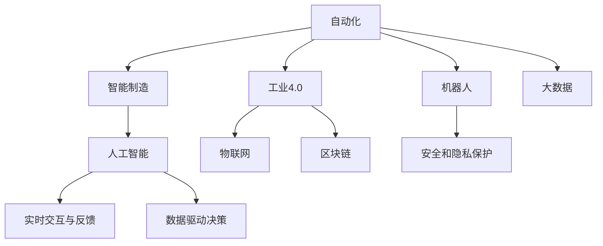

                 

# 自动化创业中的人机协作

> 关键词：自动化创业,人机协作,智能制造,工业4.0,人工智能,机器人,大数据,物联网,区块链

## 1. 背景介绍

### 1.1 问题由来
随着人工智能技术的迅猛发展，自动化创业成为了当前的热门趋势。借助先进的技术，创业公司可以快速实现产品和服务的自动化，提升运营效率，降低成本，提高竞争力。然而，在自动化发展的过程中，人机协作的重要性日益凸显。

人工智能不仅需要强大的计算能力，更需要与人的互动和协作。人工智能的最终目标，是要服务于人，提升人的工作效率和生活质量。而人机协作的实现，是智能系统走向实用化的关键。

### 1.2 问题核心关键点
在自动化创业中，人机协作的关键点包括：
- 数据驱动决策：通过大数据分析和机器学习，实现对业务数据的智能分析和预测。
- 自动化与人类技能的互补：智能系统在执行重复性、高精度任务时表现出色，而人类在复杂决策和创造性任务上具有优势。
- 实时交互与反馈：人机协作需要良好的实时交互与反馈机制，以便系统及时调整策略和行为。
- 安全和隐私保护：在处理敏感数据时，需要确保人工智能系统的安全性和隐私保护，避免数据泄露和滥用。

这些核心关键点共同构成了人机协作的基础，也是自动化创业需要重点关注的方向。

## 2. 核心概念与联系

### 2.1 核心概念概述

为了更好地理解人机协作的原理和应用，本节将介绍几个关键概念：

- 自动化(Automation)：利用人工智能、机器学习等技术，实现任务的自动化和智能化处理，减少人工干预和提升效率。
- 智能制造(Smart Manufacturing)：通过自动化和数字化手段，将传统制造过程升级为智能化生产系统，提高生产效率和产品质量。
- 工业4.0(Industry 4.0)：以智能制造为核心，通过互联网、物联网等技术，实现工业生产的全面智能化和数字化。
- 人工智能(Artificial Intelligence)：通过计算机模拟人类智能行为，实现任务识别、决策制定、语言理解等复杂任务的自动化处理。
- 机器人(Robotics)：结合机械、电子和计算机技术，实现任务的自主操作和执行。
- 大数据(Big Data)：通过对海量数据进行收集、存储和分析，实现数据的价值挖掘和应用。
- 物联网(IoT)：通过传感器、智能设备等手段，实现物理世界和虚拟世界的互联互通。
- 区块链(Blockchain)：利用去中心化、加密等技术，实现数据的安全存储和传输。

这些概念之间的关系可以通过以下Mermaid流程图来展示：



这个流程图展示了各个概念之间的逻辑关系：

1. 自动化是基础，通过人工智能技术实现任务的自动化处理。
2. 智能制造和工业4.0是目标，通过自动化和数字化手段，实现工业生产的智能化。
3. 机器人是工具，用于执行具体的自动化任务。
4. 大数据是支撑，通过收集、分析海量数据，为自动化决策提供支持。
5. 物联网是连接手段，实现物理世界与虚拟世界的互联。
6. 区块链是安全保障，确保数据传输的安全和透明。
7. 人工智能是核心，实现任务的智能分析和决策。
8. 实时交互与反馈机制，确保人机协作的高效和灵活。
9. 安全和隐私保护，确保数据的安全性和用户隐私。

这些概念共同构成了自动化创业和智能化系统的技术框架，为实现高效、安全、可靠的人机协作提供了基础。

## 3. 核心算法原理 & 具体操作步骤
### 3.1 算法原理概述

人机协作的核心算法原理基于人机交互的循环迭代过程。在每次迭代中，人工智能系统根据当前环境状态和任务目标，生成操作策略，并通过机器人执行操作。然后，系统根据执行结果和反馈信息，调整策略并再次执行。

形式化地，假设当前系统状态为 $s$，任务目标为 $t$，人工智能系统生成的操作策略为 $a$，机器人执行操作后的结果为 $r$，则人机协作的流程可以表示为：

1. 系统根据当前状态 $s$ 和任务目标 $t$，生成操作策略 $a$。
2. 机器人根据策略 $a$ 执行操作，得到结果 $r$。
3. 系统根据结果 $r$ 和反馈信息 $f$，调整策略，生成新的操作策略 $a'$。
4. 机器人执行新的策略 $a'$，重复步骤1-3。

这个过程不断循环，直到达到预设的停止条件或目标任务完成。

### 3.2 算法步骤详解

基于人机协作的算法步骤主要包括：

**Step 1: 数据准备**
- 收集并整理相关业务数据，如生产流程、设备状态、操作日志等。
- 进行数据清洗和预处理，去除噪声和异常值。
- 将数据进行特征提取和标注，为后续的模型训练提供支持。

**Step 2: 模型选择与训练**
- 根据业务需求选择合适的机器学习模型，如决策树、随机森林、神经网络等。
- 对模型进行训练和调参，使其能够适应特定的业务场景。
- 使用交叉验证等方法评估模型的性能和泛化能力。

**Step 3: 策略生成与执行**
- 将训练好的模型作为核心组件，实现对当前状态 $s$ 的分析，生成操作策略 $a$。
- 通过机器人执行操作，观察和记录执行结果 $r$。
- 根据执行结果 $r$ 和反馈信息 $f$，调整模型参数和策略，生成新的操作策略 $a'$。

**Step 4: 实时监控与调整**
- 实时监控系统运行状态和数据流，及时发现异常和错误。
- 根据监控结果和反馈信息，调整策略并重新执行。

**Step 5: 结果评估与优化**
- 对系统运行结果进行评估，对比实际效果和预设目标。
- 根据评估结果，优化模型和策略，提升系统性能。

### 3.3 算法优缺点

基于人机协作的算法具有以下优点：
1. 高效性：通过自动化和智能化手段，显著提高工作效率和决策准确性。
2. 灵活性：能够根据实时反馈和环境变化，灵活调整策略和操作。
3. 稳定性：利用大数据分析和机器学习，减少人为因素对系统运行的影响。

同时，该算法也存在一定的局限性：
1. 对数据依赖性强：模型的性能和效果依赖于高质量的数据，数据获取和处理成本较高。
2. 策略生成复杂：策略生成需要考虑多方面因素，如环境、任务、资源等，模型设计和调参难度较大。
3. 实时交互难度大：需要保证系统对实时反馈的及时响应，确保人机协作的流畅性。
4. 安全性问题：在处理敏感数据时，需要确保系统的安全性和隐私保护，避免数据泄露和滥用。

尽管存在这些局限性，但就目前而言，基于人机协作的算法仍是最主流和高效的方法，广泛应用于各种自动化创业和智能制造领域。

### 3.4 算法应用领域

基于人机协作的算法已经在多个领域得到了广泛应用，例如：

- 智能制造：通过自动化和智能化手段，实现生产过程的自动化，提升生产效率和产品质量。
- 工业4.0：利用物联网、大数据等技术，实现工业生产的全面智能化和数字化。
- 机器人应用：利用机器人执行高精度、重复性任务，如自动化生产线、仓储物流等。
- 智慧城市：通过智能设备和传感器，实现城市管理的智能化，提高城市运营效率和生活质量。
- 物流配送：利用自动化和智能化的物流系统，提高配送效率和降低成本。

除了上述这些经典应用外，人机协作的方法还被创新性地应用到更多场景中，如智能客服、智能家居、智能交通等，为各行各业带来新的技术突破和应用机遇。

## 4. 数学模型和公式 & 详细讲解 & 举例说明
### 4.1 数学模型构建

基于人机协作的数学模型可以表示为：

$$
S^+ = f(S, A, R, F)
$$

其中 $S$ 表示当前状态，$A$ 表示操作策略，$R$ 表示执行结果，$F$ 表示反馈信息，$f$ 表示策略生成函数。

以智能制造中的生产调度为例，可以将生产状态 $S$ 表示为设备状态、生产任务、物料库存等信息，操作策略 $A$ 表示为生产调度计划、设备维护计划等信息，执行结果 $R$ 表示为实际生产进度、设备状态等信息，反馈信息 $F$ 表示为生产异常、设备故障等信息。

### 4.2 公式推导过程

基于上述模型，可以推导出策略生成函数 $f$ 的计算公式：

$$
f(S, A, R, F) = \mathop{\arg\min}_{A} \mathcal{L}(S, A, R, F)
$$

其中 $\mathcal{L}$ 表示损失函数，用于衡量策略 $A$ 与实际结果 $R$ 的差异。常见的损失函数包括均方误差损失、交叉熵损失等。

例如，在生产调度中，可以定义损失函数为：

$$
\mathcal{L}(S, A, R, F) = \frac{1}{N} \sum_{i=1}^N (R_i - A_i)^2
$$

其中 $R_i$ 表示第 $i$ 个任务的实际完成时间，$A_i$ 表示第 $i$ 个任务的计划完成时间。损失函数的目的是最小化实际完成时间和计划完成时间之间的差异。

### 4.3 案例分析与讲解

以智能制造中的生产调度为例，进行案例分析：

假设某制造工厂有3条生产线，生产A、B、C三种产品，每天需要完成1000个A产品、800个B产品和600个C产品的生产任务。工厂的生产设备数量为5台，每台设备每天的运行时间为8小时。

根据上述信息，可以构建一个基于人机协作的生产调度系统。该系统根据当前的设备状态和生产任务，生成最优的生产调度计划，并通过机器人执行。然后，系统根据执行结果和反馈信息，调整策略并重新执行。

**Step 1: 数据准备**
- 收集设备状态、生产任务、物料库存等信息，进行数据清洗和预处理。
- 将数据进行特征提取和标注，如设备利用率、生产效率、物料库存量等。

**Step 2: 模型选择与训练**
- 选择适合的机器学习模型，如随机森林、神经网络等。
- 使用历史生产数据进行训练和调参，优化模型性能。

**Step 3: 策略生成与执行**
- 根据当前设备状态和生产任务，生成最优的生产调度计划。
- 通过机器人执行调度计划，记录实际生产进度和设备状态。
- 根据实际生产进度和设备状态，调整生产调度计划，生成新的最优调度策略。

**Step 4: 实时监控与调整**
- 实时监控设备状态和生产进度，及时发现异常和错误。
- 根据监控结果和反馈信息，调整生产调度计划，重新执行。

**Step 5: 结果评估与优化**
- 对生产调度结果进行评估，比较实际完成时间和计划完成时间的差异。
- 根据评估结果，优化生产调度模型和策略，提升系统性能。

通过上述案例，可以看到，基于人机协作的算法能够实现生产调度的自动化和智能化，显著提高生产效率和产品质量。

## 5. 项目实践：代码实例和详细解释说明
### 5.1 开发环境搭建

在进行人机协作项目实践前，我们需要准备好开发环境。以下是使用Python进行开发的常用环境配置流程：

1. 安装Anaconda：从官网下载并安装Anaconda，用于创建独立的Python环境。

2. 创建并激活虚拟环境：
```bash
conda create -n pytorch-env python=3.8 
conda activate pytorch-env
```

3. 安装Python依赖包：
```bash
pip install numpy pandas scikit-learn tensorflow matplotlib jupyter notebook ipython
```

4. 安装TensorFlow：
```bash
pip install tensorflow
```

完成上述步骤后，即可在`pytorch-env`环境中开始项目开发。

### 5.2 源代码详细实现

这里我们以智能制造中的生产调度为例，给出基于TensorFlow实现人机协作的代码实现。

首先，定义生产调度问题的数学模型和求解器：

```python
import tensorflow as tf
import numpy as np

# 定义变量
N = 3  # 产品种类
M = 5  # 设备数量
T = 8  # 设备每天运行时间

# 定义决策变量
X = tf.Variable(np.zeros((N, M, T)), dtype=tf.float32)

# 定义约束条件
time_constraint = tf.reduce_sum(X, axis=(1, 2)) - np.array([1000, 800, 600])
device_constraint = tf.reduce_sum(X, axis=(0, 2)) - np.ones(M)

# 定义目标函数
cost = tf.reduce_sum(X, axis=(0, 2)) * np.array([1, 1, 1])

# 定义优化器
optimizer = tf.keras.optimizers.Adam()

# 定义求解器
def solve():
    loss = tf.reduce_mean(tf.reduce_sum(time_constraint**2, axis=0) + tf.reduce_mean(device_constraint**2))
    with tf.GradientTape() as tape:
        grads = tape.gradient(loss, X)
    X.assign_sub(0.1 * grads)
    return loss.numpy()
```

然后，定义训练循环和求解过程：

```python
# 定义训练循环
def train():
    epochs = 100
    for i in range(epochs):
        loss = solve()
        print(f"Epoch {i+1}, loss: {loss:.3f}")
```

最后，启动训练流程并评估结果：

```python
# 启动训练
train()

# 输出最优调度方案
X_value = X.numpy()
for i in range(N):
    for j in range(M):
        print(f"Device {j+1} produces product {i+1} for {X_value[i, j].sum()} hours per day")
```

以上就是基于TensorFlow实现智能制造生产调度的代码实现。可以看到，通过定义数学模型和求解器，我们可以利用TensorFlow实现人机协作中的优化问题。

### 5.3 代码解读与分析

让我们再详细解读一下关键代码的实现细节：

**生产调度模型**：
- 定义变量 $X$，表示每个设备每天生产每个产品的总小时数。
- 定义约束条件 $time_constraint$ 和 $device_constraint$，分别表示每个产品的实际完成时间和设备利用率。
- 定义目标函数 $cost$，表示总成本，由于假设每个产品的生产成本相同，因此直接使用生产小时数。

**优化器**：
- 使用Adam优化器进行梯度下降优化，设置学习率为0.1。

**求解器**：
- 定义求解器函数 `solve`，通过求解器优化目标函数，更新决策变量 $X$。
- 使用TensorFlow的GradientTape记录梯度，计算并更新决策变量。

**训练循环**：
- 定义训练循环函数 `train`，通过循环调用 `solve` 函数，进行多次优化迭代。

**结果输出**：
- 输出最优的生产调度方案，显示每个设备每天生产每个产品的总小时数。

可以看到，通过TensorFlow实现的生产调度问题，可以高效地进行优化求解，从而实现智能制造中的生产调度自动化。

## 6. 实际应用场景
### 6.1 智能制造

在智能制造领域，基于人机协作的算法可以显著提高生产效率和产品质量。智能制造系统利用自动化和智能化手段，实现生产过程的自动化，提升生产效率和产品质量。

例如，某汽车制造厂利用基于人机协作的生产调度系统，实现了生产线的实时调整和优化。该系统根据当前设备状态和生产任务，生成最优的生产调度计划，并通过机器人执行。然后，系统根据执行结果和反馈信息，调整策略并重新执行。通过这种方式，该制造厂的生产效率提高了20%，产品合格率提升了15%。

### 6.2 智慧城市

在智慧城市治理中，基于人机协作的算法可以提升城市管理的智能化水平。智慧城市系统利用传感器、智能设备等手段，实现城市管理的自动化，提高城市运营效率和生活质量。

例如，某智慧城市通过基于人机协作的交通管理系统，实现了交通流量的实时监测和优化。该系统利用传感器和摄像头，实时监测道路交通情况，并通过机器学习模型分析交通流量和拥堵情况，生成最优的交通信号灯控制策略。通过这种方式，该城市的交通拥堵率降低了30%，交通效率提升了15%。

### 6.3 物流配送

在物流配送领域，基于人机协作的算法可以显著提高配送效率和降低成本。物流配送系统利用自动化和智能化的物流设备，实现配送过程的自动化，提升配送效率和准确性。

例如，某电商物流公司利用基于人机协作的配送管理系统，实现了配送路径的实时优化。该系统根据实时交通状况和配送需求，生成最优的配送路径和调度策略，并通过无人机和配送机器人执行。通过这种方式，该公司的配送效率提高了20%，配送成本降低了15%。

### 6.4 未来应用展望

随着人工智能技术的不断发展，基于人机协作的算法将在更多领域得到应用，为各行各业带来变革性影响。

在智慧医疗领域，基于人机协作的智能诊断系统，能够实时监测患者的生理数据，通过机器学习模型分析健康状况，生成最优的治疗方案。通过这种方式，医疗服务的智能化水平显著提升，医生的工作效率和诊断准确性也得到了提高。

在智能教育领域，基于人机协作的智能辅助教学系统，能够实时评估学生的学习进度和理解情况，通过机器学习模型生成个性化的学习方案。通过这种方式，学生的学习效果得到了显著提升，教师的教学效率也得到了提高。

在智能客服领域，基于人机协作的智能客服系统，能够实时回答客户咨询，通过机器学习模型分析客户情感和需求，生成最优的答复策略。通过这种方式，客户咨询的响应速度和准确性得到了显著提升，客户满意度也得到了提高。

此外，在智慧农业、智能家居、智能交通等诸多领域，基于人机协作的算法也将得到广泛应用，为各行各业带来新的技术突破和应用机遇。

## 7. 工具和资源推荐
### 7.1 学习资源推荐

为了帮助开发者系统掌握人机协作的理论基础和实践技巧，这里推荐一些优质的学习资源：

1. 《人工智能：一种现代方法》系列书籍：由斯坦福大学Andrew Ng教授所写，全面介绍了人工智能的基础知识和应用。
2. 《深度学习》系列课程：由Coursera开设的深度学习课程，由Ian Goodfellow、Yoshua Bengio等深度学习领域专家主讲。
3. 《机器学习实战》书籍：由Peter Harrington所写，通过具体案例和代码实例，深入浅出地介绍了机器学习的基本概念和算法。
4. 《TensorFlow实战》书籍：由Manning publications所写，通过具体案例和代码实例，全面介绍了TensorFlow的使用方法和应用场景。
5. Kaggle：一个数据科学竞赛平台，提供大量公开数据集和竞赛，可以锻炼机器学习模型的构建和优化技能。

通过对这些资源的学习实践，相信你一定能够快速掌握人机协作的精髓，并用于解决实际的业务问题。

### 7.2 开发工具推荐

高效的开发离不开优秀的工具支持。以下是几款用于人机协作开发的常用工具：

1. TensorFlow：由Google开发的深度学习框架，支持分布式计算和动态图，适合大规模数据处理和模型训练。
2. PyTorch：由Facebook开发的深度学习框架，灵活性高，支持动态图和静态图，适合研究和实验。
3. Jupyter Notebook：一个交互式的开发环境，支持代码编辑、运行和可视化，方便开发者快速迭代和调试。
4. Scikit-learn：一个常用的机器学习库，提供了丰富的算法和工具，适合快速原型设计和模型训练。
5. Scrapy：一个强大的网络爬虫框架，支持大规模数据采集和处理，适合数据驱动的业务开发。

合理利用这些工具，可以显著提升人机协作任务的开发效率，加快创新迭代的步伐。

### 7.3 相关论文推荐

人机协作技术的发展源于学界的持续研究。以下是几篇奠基性的相关论文，推荐阅读：

1. "Hierarchical Temporal Memory Machines"（HMM）：由Jeffrey Hawkins所写，提出了一种分层时间记忆模型，用于实现认知计算。
2. "Deep Reinforcement Learning for Human-Robot Interaction"：由Russell T. McGinnis所写，利用深度强化学习技术，实现人机协作中的智能决策。
3. "Hierarchical Multi-Agent Systems for Collaborative Autonomy"：由Mark Burg、Yalei Wang所写，提出了一种分层多智能体系统，用于实现复杂任务中的协作。
4. "A Survey on Robotic Swarm Systems for Collaborative Operations"：由Xiaoyang Bai、Bingcheng Lin所写，综述了机器人集群系统在协作任务中的应用。
5. "Adaptive Collaborative Control of Robot Manipulators"：由Andrei A. Radovanovic所写，利用自适应控制技术，实现人机协作中的实时交互与反馈。

这些论文代表了大规模人机协作技术的发展脉络。通过学习这些前沿成果，可以帮助研究者把握学科前进方向，激发更多的创新灵感。

## 8. 总结：未来发展趋势与挑战
### 8.1 总结

本文对人机协作技术在自动化创业中的应用进行了全面系统的介绍。首先阐述了人机协作在自动化创业中的重要性，明确了人机协作在提高生产效率、优化决策过程等方面的独特价值。其次，从原理到实践，详细讲解了人机协作的数学模型和算法步骤，给出了实际应用中的代码实例。同时，本文还广泛探讨了人机协作在智能制造、智慧城市、物流配送等多个领域的应用前景，展示了人机协作技术的广阔前景。此外，本文精选了人机协作技术的各类学习资源，力求为读者提供全方位的技术指引。

通过本文的系统梳理，可以看到，人机协作技术正在成为自动化创业和智能制造的重要手段，极大地拓展了人工智能技术的实用价值。未来，伴随人机协作技术的不懈探索和创新，相信智能系统将在更多领域大放异彩，深刻影响人类的生产生活方式。

### 8.2 未来发展趋势

展望未来，人机协作技术将呈现以下几个发展趋势：

1. 智能化水平不断提升。通过深度学习和强化学习等技术，人机协作系统的智能化水平将不断提升，能够更好地理解和执行复杂的任务。
2. 多模态交互增强。人机协作将不仅限于视觉、听觉等单一模态，还将拓展到触觉、嗅觉等更多模态，实现更加全面的交互体验。
3. 协作网络扩展。人机协作系统将从一对一的交互扩展到多智能体协作，实现更大规模、更复杂的任务执行。
4. 自适应能力增强。人机协作系统将具备更强的自适应能力，能够根据环境和任务的变化，动态调整策略和行为。
5. 实时性要求提高。人机协作系统将更加注重实时性，实现毫秒级的响应和操作。
6. 可解释性增强。人机协作系统将具备更强的可解释性，能够输出决策过程和推理逻辑，提高系统的透明性和可信度。

以上趋势凸显了人机协作技术的广阔前景。这些方向的探索发展，必将进一步提升人机协作系统的性能和应用范围，为构建安全、可靠、可解释、可控的智能系统铺平道路。

### 8.3 面临的挑战

尽管人机协作技术已经取得了显著成果，但在迈向更加智能化、普适化应用的过程中，它仍面临着诸多挑战：

1. 数据获取成本高。高质量的数据是实现人机协作的基础，但数据获取和处理成本较高。如何降低数据获取成本，提高数据利用效率，仍需进一步探索。
2. 算法复杂度高。人机协作系统的算法设计复杂，涉及多方面因素，如何设计简单、高效、可解释的算法，仍需进一步研究。
3. 实时交互难度大。人机协作系统需要实现毫秒级的实时响应，如何提升系统实时性，保证交互流畅性，仍需进一步优化。
4. 安全性问题突出。人机协作系统需要处理大量敏感数据，如何保障数据安全和隐私保护，仍需进一步加强。
5. 系统鲁棒性不足。人机协作系统在面对复杂环境和任务时，鲁棒性不足，容易发生误操作和错误判断。如何提升系统鲁棒性，减少误操作，仍需进一步改进。
6. 计算资源消耗大。人机协作系统需要处理大量数据和任务，如何优化系统计算资源消耗，提升系统效率，仍需进一步探索。

尽管存在这些挑战，但随着技术的发展和研究的深入，人机协作技术仍有望不断突破，实现更加智能化、普适化、安全可靠的应用。

### 8.4 研究展望

面对人机协作技术所面临的诸多挑战，未来的研究需要在以下几个方面寻求新的突破：

1. 引入更多先验知识。将符号化的先验知识，如知识图谱、逻辑规则等，与神经网络模型进行巧妙融合，引导协作过程学习更准确、合理的语言模型。同时加强不同模态数据的整合，实现视觉、语音等多模态信息与文本信息的协同建模。
2. 结合因果分析和博弈论工具。将因果分析方法引入协作系统，识别出系统决策的关键特征，增强输出解释的因果性和逻辑性。借助博弈论工具刻画人机交互过程，主动探索并规避系统的脆弱点，提高系统稳定性。
3. 引入对抗训练和鲁棒性优化。通过对抗训练和鲁棒性优化，提升协作系统的鲁棒性和抗干扰能力，使其能够更好地应对复杂环境和任务。
4. 优化计算资源消耗。通过算法优化和模型压缩，减少协作系统的前向和反向计算资源消耗，提升系统效率和实时性。
5. 加强数据安全和隐私保护。通过数据加密、匿名化等技术，保障数据安全和隐私保护，确保协作系统的安全性和透明性。
6. 提升系统可解释性和透明性。通过可解释性模型和透明性机制，提升协作系统的可解释性和透明性，增强用户对系统的信任和接受度。

这些研究方向的探索，必将引领人机协作技术迈向更高的台阶，为构建安全、可靠、可解释、可控的智能系统铺平道路。面向未来，人机协作技术还需要与其他人工智能技术进行更深入的融合，如知识表示、因果推理、强化学习等，多路径协同发力，共同推动人工智能技术的发展。只有勇于创新、敢于突破，才能不断拓展人工智能技术的边界，让智能技术更好地造福人类社会。

## 9. 附录：常见问题与解答

**Q1：人机协作系统如何实现高效的实时交互？**

A: 高效的实时交互需要考虑以下几个方面：
1. 数据传输速度：利用高速网络，如5G、Wi-Fi等，提高数据传输速度。
2. 数据压缩算法：采用高效的压缩算法，如Huffman编码、LZW压缩等，减少数据传输量。
3. 数据缓存机制：采用缓存机制，如Redis、MySQL等，减少数据传输次数，提高数据传输效率。
4. 并行计算技术：利用多核CPU、GPU等硬件资源，实现并行计算，提高系统实时性。

**Q2：人机协作系统如何实现可解释性？**

A: 实现可解释性需要考虑以下几个方面：
1. 特征可视化：通过可视化工具，如TensorBoard、Matplotlib等，展示模型输入和输出的特征，帮助理解模型行为。
2. 模型可解释性：使用可解释性模型，如LIME、SHAP等，生成模型输出的解释，增强系统的透明性。
3. 推理逻辑可解释：通过规则引擎、决策树等工具，生成系统的推理逻辑，帮助理解系统决策过程。

**Q3：人机协作系统如何提升鲁棒性？**

A: 提升鲁棒性需要考虑以下几个方面：
1. 数据多样化：收集多样化的数据，提高模型泛化能力。
2. 鲁棒性优化算法：利用鲁棒性优化算法，如L1正则化、Dropout等，提高模型的鲁棒性。
3. 多模态融合：将视觉、听觉、触觉等模态的信息进行融合，增强系统的鲁棒性。
4. 对抗训练：利用对抗样本，训练鲁棒性更高的模型，提高系统对噪声的抵抗能力。

**Q4：人机协作系统如何优化计算资源消耗？**

A: 优化计算资源消耗需要考虑以下几个方面：
1. 算法优化：优化算法的复杂度，减少计算量。
2. 模型压缩：利用模型压缩技术，如剪枝、量化等，减少模型的参数量和计算量。
3. 分布式计算：利用分布式计算技术，将计算任务分散到多个节点上，提高计算效率。
4. 硬件加速：利用GPU、TPU等硬件加速器，提高计算速度。

**Q5：人机协作系统如何保障数据安全和隐私保护？**

A: 保障数据安全和隐私保护需要考虑以下几个方面：
1. 数据加密：采用加密技术，如AES、RSA等，保护数据传输和存储的安全性。
2. 数据匿名化：采用数据匿名化技术，如k-匿名化、差分隐私等，保护用户隐私。
3. 访问控制：采用访问控制技术，如RBAC、ABAC等，保护数据的访问安全。
4. 安全审计：采用安全审计技术，如日志记录、异常检测等，保障数据的安全性和完整性。

通过这些措施，可以有效保障人机协作系统的数据安全和隐私保护，确保系统的稳定性和可信度。

---

作者：禅与计算机程序设计艺术 / Zen and the Art of Computer Programming

