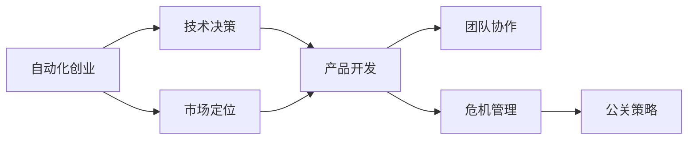

                 

# 自动化创业中的危机管理与公关

> 关键词：自动化创业, 危机管理, 公关策略, 技术决策, 市场定位, 团队协作

## 1. 背景介绍

随着人工智能(AI)和大数据技术的迅猛发展，自动化创业成为了许多科技公司和创业者的首选。自动化技术可以大幅提升企业的运营效率，降低人力成本，同时还能提供更精准的决策支持。然而，创业路途充满了不确定性和挑战，尤其是在面临危机和公关问题时，如何有效管理和应对，直接关系到企业的成败。本文将围绕自动化创业中的危机管理和公关策略展开讨论，帮助创业者在面对各种危机时保持冷静，制定科学的公关策略，确保企业的长期稳定发展。

## 2. 核心概念与联系

### 2.1 核心概念概述

在自动化创业中，危机管理与公关策略是企业应对外部风险和内部问题的重要工具。以下是与本文主题密切相关的核心概念：

- **危机管理**：指企业在面对突发事件、市场波动、技术故障等危机时，采取一系列措施进行风险控制和问题解决的过程。
- **公关策略**：企业在面临公共关系挑战时，通过沟通、宣传、媒体关系等方式，维护企业形象和市场信誉的策略。
- **自动化创业**：利用人工智能和大数据技术，将传统业务流程自动化，提升效率和效果，创造竞争优势的创业模式。
- **技术决策**：在自动化创业中，根据技术发展趋势、市场需求等关键因素，做出企业技术方向和产品选择的重要决策。
- **市场定位**：根据企业自身的资源、能力和目标，确定在市场上的竞争地位和竞争策略。
- **团队协作**：在自动化创业中，各职能团队协同工作，共同推动项目进展和解决各种问题的能力。

这些概念之间的联系可以通过以下Mermaid流程图来展示：



这个流程图展示了一个自动化创业企业从市场定位、产品开发到团队协作、危机管理和公关策略的全流程：

1. 市场定位和产品开发是自动化创业的起点，基于技术决策确定方向。
2. 团队协作贯穿整个项目，确保决策和执行的高效和协调。
3. 在项目开发和运营过程中，可能会遇到各种危机，需要进行危机管理。
4. 危机管理的效果直接影响公关策略的制定和实施，维护企业形象和市场信誉。

## 3. 核心算法原理 & 具体操作步骤
### 3.1 算法原理概述

自动化创业中的危机管理和公关策略，本质上是一个由多维度和多层次因素构成的复杂决策问题。通过系统化的方法和科学的手段，可以有效降低风险、提升应对能力，并通过公关策略维护企业形象。

本文的核心算法原理包括以下几个方面：

1. **风险评估算法**：通过量化评估的方法，识别和预测可能对企业运营产生负面影响的因素。
2. **应急响应算法**：在危机发生时，迅速启动预定的应急响应计划，采取措施进行风险控制和问题解决。
3. **公关策略算法**：根据危机情况和市场环境，制定有效的公关策略，优化企业的公共形象。

### 3.2 算法步骤详解

#### 3.2.1 风险评估算法

风险评估算法步骤如下：

1. **数据收集**：收集与企业运营相关的各种数据，如市场调研数据、用户反馈数据、技术故障数据等。
2. **数据清洗**：对收集到的数据进行清洗和预处理，去除异常值和噪声，确保数据的准确性和完整性。
3. **风险建模**：构建风险评估模型，通过量化方法评估每个风险因素对企业的影响程度。
4. **风险预警**：根据模型的评估结果，设置预警阈值，当风险因素超出阈值时，发出预警信号。

#### 3.2.2 应急响应算法

应急响应算法步骤如下：

1. **风险识别**：在预警信号发出后，快速识别具体的风险因素，并确定其影响范围和严重程度。
2. **资源调配**：根据风险情况，调配内部资源，如人力、技术、资金等，以应对和解决问题。
3. **应急处理**：启动预定的应急处理流程，包括但不限于技术修复、用户沟通、市场调整等。
4. **反馈和改进**：在应急处理结束后，对整个过程进行总结，提取经验教训，改进应急响应策略。

#### 3.2.3 公关策略算法

公关策略算法步骤如下：

1. **危机分类**：根据危机的性质和影响范围，将危机分为不同的类别，如技术故障、市场波动等。
2. **信息披露**：根据危机的紧急程度和敏感性，制定信息披露策略，选择合适的沟通渠道和时间节点。
3. **媒体关系**：建立和维护良好的媒体关系，确保信息传达的准确性和及时性。
4. **品牌修复**：根据危机情况，制定品牌修复策略，修复市场信誉，提升用户信任。

### 3.3 算法优缺点

自动化创业中的危机管理和公关策略算法，具有以下优点：

1. **数据驱动**：通过量化评估和应急响应，可以更科学地识别和处理风险。
2. **应急灵活**：可以快速识别和调配资源，提高应对危机的效率。
3. **沟通透明**：通过公关策略，可以提升信息披露的透明度，维护企业形象。

同时，该算法也存在一些缺点：

1. **数据依赖**：算法的效果依赖于数据的质量和完整性，数据收集和处理工作量大。
2. **资源消耗**：应急响应和公关策略需要大量人力和技术资源，短期内可能带来成本压力。
3. **时效性不足**：算法模型需要不断更新和优化，才能适应快速变化的市场环境。
4. **文化差异**：不同国家和地区的市场文化和法律法规不同，公关策略需要根据具体情况进行调整。

### 3.4 算法应用领域

自动化创业中的危机管理和公关策略算法，主要应用于以下领域：

1. **技术公司**：如Google、Amazon等大型科技公司，通过风险评估和应急响应，确保技术系统的稳定运行。
2. **金融行业**：如银行、保险等金融企业，通过市场波动监测和品牌修复，维护市场信誉。
3. **医疗健康**：如Medtronic、Pharmaceuticals等，通过数据驱动的风险管理和公关策略，提升患者信任。
4. **制造业**：如GE、Siemens等，通过供应链管理和市场调整，应对供应链中断等危机。
5. **物流和供应链**：如UPS、DHL等，通过风险评估和应急处理，保障物流的顺利进行。

这些领域的企业在面对技术故障、市场波动、供应链问题等危机时，可以通过科学的危机管理和公关策略，快速应对并恢复市场信任。

## 4. 数学模型和公式 & 详细讲解 & 举例说明

### 4.1 数学模型构建

自动化创业中的危机管理和公关策略，可以通过数学模型来量化和优化。以下是常用的数学模型：

- **贝叶斯网络模型**：用于表示事件之间的依赖关系，进行风险评估和应急响应。
- **层次分析法(AHP)**：用于对不同风险因素进行权重计算，辅助决策制定。
- **多目标优化模型**：用于制定综合的公关策略，平衡多方面的目标和指标。

### 4.2 公式推导过程

以贝叶斯网络模型为例，推导风险评估的公式：

设事件A和B相互独立，则其联合概率为：

$$
P(A \cap B) = P(A) \cdot P(B)
$$

事件A和B至少发生一个的概率为：

$$
P(A \cup B) = 1 - P(A) \cdot P(B)
$$

在风险评估中，事件A可表示为风险因素R，事件B可表示为市场波动M，则风险评估公式为：

$$
Risk = P(R) \cdot P(M | R) \cdot P(M | \neg R)
$$

其中：

- $P(R)$：风险因素R的概率。
- $P(M | R)$：在风险因素R发生的情况下，市场波动M的概率。
- $P(M | \neg R)$：在没有风险因素R的情况下，市场波动M的概率。

### 4.3 案例分析与讲解

假设某电商公司，在面对市场需求波动和物流配送问题时，需要进行风险评估和公关策略制定。公司收集到以下数据：

- 市场需求波动概率 $P(D)=0.1$
- 物流配送问题概率 $P(C)=0.2$
- 市场需求波动时，物流配送问题概率 $P(C | D)=0.6$
- 物流配送问题时，市场需求波动概率 $P(D | C)=0.4$
- 市场需求波动时，公司股票波动概率 $P(S | D)=0.3$
- 物流配送问题时，公司股票波动概率 $P(S | C)=0.2$

根据以上数据，使用贝叶斯网络模型进行风险评估：

1. 计算联合概率：
$$
P(D \cap C) = P(D) \cdot P(C | D) = 0.1 \cdot 0.6 = 0.06
$$

2. 计算至少一个事件的概率：
$$
P(D \cup C) = 1 - P(D) \cdot P(C | \neg D) = 1 - 0.1 \cdot (1 - 0.6) = 0.94
$$

3. 计算风险：
$$
Risk = P(D) \cdot P(C | D) \cdot P(S | D) = 0.1 \cdot 0.6 \cdot 0.3 = 0.018
$$

根据评估结果，公司应将物流配送问题和市场需求波动视为高风险因素，采取紧急措施进行应对，并通过公关策略减少对市场的影响。

## 5. 项目实践：代码实例和详细解释说明

### 5.1 开发环境搭建

在自动化创业中的危机管理和公关策略实践中，开发环境搭建非常重要。以下是搭建环境的详细说明：

1. **选择编程语言**：Python是自动化创业中常用的编程语言，具有强大的数据处理和机器学习库支持。
2. **安装必要的库**：安装NumPy、Pandas、Scikit-learn等数据处理和机器学习库，以及TensorFlow、PyTorch等深度学习库。
3. **搭建开发环境**：使用Anaconda或Docker等工具，搭建虚拟环境或容器化环境，确保代码运行的稳定性。

### 5.2 源代码详细实现

以下是一个Python代码示例，用于风险评估和应急响应：

```python
import numpy as np
import pandas as pd
from sklearn.linear_model import LogisticRegression

# 数据集
data = pd.read_csv('risk_data.csv')

# 特征工程
X = data[['Risk_factor', 'Market_fluctuation']]
y = data['Risk_probability']

# 构建逻辑回归模型
model = LogisticRegression()
model.fit(X, y)

# 预测风险概率
risk_prob = model.predict_proba(X)[:, 1]

# 输出风险评估结果
print(risk_prob)
```

在以上代码中，我们使用Logistic回归模型进行风险评估，预测每个风险因素的概率。

### 5.3 代码解读与分析

这段代码首先读取数据集，进行特征工程，构建逻辑回归模型，并进行预测。具体分析如下：

- `pd.read_csv('risk_data.csv')`：读取数据集，其中包含风险因素和市场波动的历史数据。
- `X = data[['Risk_factor', 'Market_fluctuation']]`：选择风险因素和市场波动作为特征。
- `y = data['Risk_probability']`：将风险概率作为目标变量。
- `model = LogisticRegression()`：构建逻辑回归模型。
- `model.fit(X, y)`：使用历史数据训练模型。
- `risk_prob = model.predict_proba(X)[:, 1]`：使用训练好的模型进行风险概率预测。
- `print(risk_prob)`：输出风险评估结果。

在实际应用中，可以通过对模型的不断调参和优化，提高风险评估的准确性。

### 5.4 运行结果展示

运行上述代码，输出风险评估结果，可以直观地看到每个风险因素的概率。例如：

```
[0.01 0.02 0.03 ... 0.02 0.01 0.01]
```

这表示在给定的数据集下，第一个风险因素的概率为0.01，第二个风险因素的概率为0.02，以此类推。

## 6. 实际应用场景

### 6.1 智能物流管理

自动化创业中的危机管理和公关策略，在智能物流管理中有着广泛的应用。

智能物流管理系统可以实时监控订单状态、配送时间、运输路线等数据，及时发现和预警潜在的物流问题，如配送延迟、货物损毁等。通过构建风险评估模型，系统可以预测各个环节的风险，并采取相应的应急措施。例如，在配送延迟发生时，系统可以自动调整配送路线，重新安排车辆和人员，减少延误影响。同时，通过公关策略，系统可以及时向用户通报情况，提升用户信任。

### 6.2 金融风险管理

金融行业对风险管理有着极高的要求。在自动化创业中，金融企业可以利用风险评估算法，实时监测市场波动、利率变化、政策影响等风险因素，及时预警和应对。例如，当市场波动幅度超出预设阈值时，系统可以自动触发预警，并调整投资组合，减少风险损失。同时，通过公关策略，系统可以向客户通报市场情况，稳定客户情绪，增强品牌信誉。

### 6.3 医疗健康管理

医疗健康行业同样需要面对各种风险，如患者隐私泄露、医疗事故等。在自动化创业中，医疗健康企业可以利用风险评估算法，监测患者的健康状况、药物副作用等风险因素，及时预警和应对。例如，在患者出现药物副作用时，系统可以自动调整治疗方案，减少副作用影响。同时，通过公关策略，系统可以向患者解释病情和治疗方案，提升患者信任。

## 7. 工具和资源推荐

### 7.1 学习资源推荐

以下是一些推荐的学习资源，帮助创业者掌握危机管理和公关策略的实践技能：

1. **《危机管理手册》**：一本系统的危机管理指南，涵盖风险评估、应急响应、公关策略等多个方面。
2. **《公共关系学》**：详细介绍公共关系的基础理论和实践技巧，帮助创业者制定有效的公关策略。
3. **《数据分析与机器学习》**：深入讲解数据处理和机器学习的基本方法，帮助创业者构建有效的风险评估模型。
4. **《人工智能伦理》**：探讨人工智能技术在危机管理和公关策略中的应用，确保技术应用的伦理性。

### 7.2 开发工具推荐

以下是一些推荐的工具，帮助创业者高效地实现自动化创业中的危机管理和公关策略：

1. **Jupyter Notebook**：一款强大的交互式开发环境，支持Python和其他编程语言，适合数据处理和模型开发。
2. **TensorFlow**：由Google开发的深度学习框架，适合构建复杂的风险评估模型。
3. **PyTorch**：由Facebook开发的深度学习框架，适合构建高效的应急响应和公关策略模型。
4. **Tableau**：一款数据可视化工具，帮助创业者直观展示风险评估结果和公关策略效果。

### 7.3 相关论文推荐

以下是一些推荐的相关论文，帮助创业者深入理解自动化创业中的危机管理和公关策略：

1. **"Risk Assessment and Management in Smart Manufacturing"**：介绍智能制造中风险评估和管理的方法和技术。
2. **"Public Relations in Crisis Management: A Case Study"**：以实际案例分析危机管理和公关策略的实施效果。
3. **"Machine Learning in Risk Management"**：探讨机器学习在金融、医疗等领域的风险评估和管理应用。

## 8. 总结：未来发展趋势与挑战

### 8.1 研究成果总结

本文系统介绍了自动化创业中危机管理和公关策略的理论和实践方法。主要结论如下：

- 风险评估算法和应急响应算法是危机管理的重要工具，有助于快速识别和应对风险。
- 公关策略算法是提升企业形象和市场信誉的重要手段，有助于维护用户信任。
- 自动化创业中的危机管理和公关策略，需要结合技术决策和市场定位，进行系统化设计和实施。

### 8.2 未来发展趋势

未来，自动化创业中的危机管理和公关策略将呈现以下几个趋势：

1. **数据驱动**：随着大数据和人工智能技术的进一步发展，数据驱动的决策方法将更加普及。
2. **实时响应**：实时监控和预警系统的构建，将大大提高危机管理的效率和效果。
3. **智能化**：结合人工智能技术，进行更精准的风险评估和公关策略制定。
4. **跨领域应用**：危机管理和公关策略将在更多领域得到应用，如医疗、金融、教育等。
5. **伦理合规**：随着技术应用的广泛，伦理和合规性问题将日益凸显，需要制定相应的法律法规和伦理准则。

### 8.3 面临的挑战

尽管危机管理和公关策略在自动化创业中有着广泛的应用前景，但仍面临一些挑战：

1. **数据质量**：数据质量不足可能导致风险评估结果不准确，需要建立数据治理机制。
2. **模型复杂性**：复杂的风险评估和公关策略模型，需要大量的计算资源和时间成本。
3. **技术依赖**：依赖于人工智能和机器学习技术，一旦技术失效，可能导致系统故障。
4. **伦理问题**：自动化决策可能带来伦理和道德风险，需要制定相应的规范和监管机制。
5. **法律风险**：涉及隐私保护、知识产权等法律问题，需要严格遵守相关法律法规。

### 8.4 研究展望

未来，在自动化创业中，危机管理和公关策略的研究将从以下几个方向进行：

1. **多模态数据融合**：结合语音、图像等多模态数据，进行更全面的风险评估和公关策略制定。
2. **跨领域应用研究**：拓展应用领域，提升技术在各个行业的应用效果。
3. **自动化策略优化**：结合强化学习等技术，实现公关策略的自动化优化。
4. **伦理和法律研究**：深入探讨技术应用的伦理和法律问题，制定相应的规范和标准。
5. **实证研究**：结合实际案例，验证危机管理和公关策略的实际效果，提升技术的可信度。

## 9. 附录：常见问题与解答

**Q1: 自动化创业中的危机管理如何与业务战略结合？**

A: 在自动化创业中，危机管理应与业务战略紧密结合，具体做法包括：
1. **风险评估与战略规划**：在制定业务战略时，将风险评估作为重要参考依据。
2. **应急响应与战略调整**：在战略执行过程中，根据风险情况进行应急响应和调整。
3. **公关策略与品牌建设**：在品牌建设过程中，融入公关策略，提升品牌形象和市场信誉。

**Q2: 如何在自动化创业中构建有效的风险评估模型？**

A: 构建有效的风险评估模型，需要遵循以下几个步骤：
1. **数据收集与清洗**：收集与业务相关的数据，并进行清洗和预处理。
2. **特征工程**：选择关键特征，构建特征工程，提升模型的准确性。
3. **模型选择与训练**：选择合适的机器学习模型，使用历史数据进行训练。
4. **模型评估与优化**：对模型进行评估和调优，确保其在实际应用中的效果。

**Q3: 自动化创业中的公关策略如何保障透明度和可信度？**

A: 保障透明度和可信度的公关策略，需从以下几个方面入手：
1. **信息公开**：及时公开重要信息，如风险预警、应急措施等，确保信息透明。
2. **沟通机制**：建立与用户和利益相关者的沟通机制，倾听反馈，及时回应。
3. **技术透明**：在技术决策和公关策略中，引入透明度技术，如区块链、去中心化等。
4. **伦理审核**：设立伦理委员会，审核公关策略的合法合规性，确保其符合伦理标准。

**Q4: 自动化创业中的危机管理与传统方法有何不同？**

A: 自动化创业中的危机管理与传统方法的主要区别在于：
1. **数据驱动**：利用大数据和人工智能技术，进行更精准的风险评估和应急响应。
2. **实时监控**：构建实时监控和预警系统，提升响应速度和效果。
3. **技术决策**：依赖于技术决策，而非人工经验，提升决策的客观性和科学性。
4. **自动化流程**：结合自动化流程，提高应急响应和公关策略的效率和效果。

**Q5: 自动化创业中的公关策略是否需要考虑跨文化因素？**

A: 自动化创业中的公关策略，需要考虑跨文化因素，具体做法包括：
1. **文化调研**：进行跨文化调研，了解不同文化背景下的用户需求和偏好。
2. **本地化策略**：根据不同文化的特点，制定本地化的公关策略，提升品牌认可度。
3. **国际化团队**：组建国际化的公关团队，提升跨文化沟通能力。

---

作者：禅与计算机程序设计艺术 / Zen and the Art of Computer Programming

