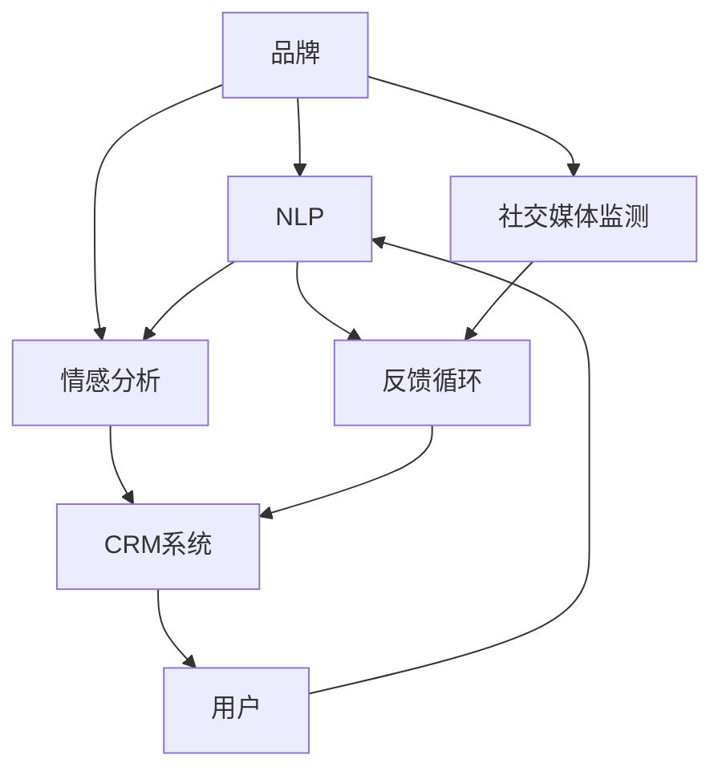

                 

# 自动化创业中的品牌口碑管理

> 关键词：自动化创业,品牌口碑,用户反馈,客户关系管理,情感分析,自然语言处理

## 1. 背景介绍

### 1.1 问题由来

在当今快速变化的商业环境中，品牌口碑对于自动化创业公司至关重要。优秀的品牌口碑不仅能提高市场认知度，吸引潜在客户，还能增强客户忠诚度，提高业务复购率和口碑传播率。然而，随着自动化业务的不断扩展，品牌面临的口碑管理挑战也日益增多。如何有效收集、分析和利用用户反馈，提升品牌声誉，成为自动化创业公司的重要课题。

### 1.2 问题核心关键点

品牌口碑管理的关键在于精准获取和有效分析用户反馈。自动化创业公司可以借助先进的自然语言处理(NLP)和情感分析技术，自动识别和理解用户在社交媒体、评论网站、客服记录等渠道上的情感倾向，从而指导品牌策略的调整和优化。

本文聚焦于基于自动化手段的品牌口碑管理方法，探讨了如何通过NLP技术实时监测和评估用户反馈，利用机器学习算法提取有价值的信息，并采取相应的品牌策略，以提升品牌口碑和市场竞争力。

## 2. 核心概念与联系

### 2.1 核心概念概述

为更好地理解自动化创业中品牌口碑管理的原理和流程，本节将介绍几个核心概念：

- 自然语言处理（NLP）：一种涉及计算机处理、理解、生成人类语言的技术。NLP技术能够分析和理解自然语言数据，广泛应用于文本分类、情感分析、命名实体识别等任务。
- 情感分析：通过NLP技术自动识别文本中的情感倾向（如正面、负面、中性），常用于品牌口碑管理中，以评估用户对品牌的情感态度。
- 客户关系管理（CRM）：一种管理客户关系的技术和方法，通过收集和分析客户反馈，改善客户体验，提升品牌忠诚度。
- 社交媒体监测：利用自动化工具和算法监测社交媒体上的品牌提及、用户评论和口碑，识别品牌声誉的变化趋势。
- 反馈循环（Feedback Loop）：品牌与用户之间的互动过程，通过分析用户反馈，调整品牌策略，形成正向的循环反馈机制。

这些概念之间的逻辑关系可以通过以下Mermaid流程图来展示：



这个流程图展示了自动化创业公司品牌口碑管理的核心流程：品牌通过NLP技术获取用户反馈，进行情感分析，监测社交媒体舆情，利用CRM系统进行客户关系管理，形成正向的反馈循环，持续优化品牌策略。

## 3. 核心算法原理 & 具体操作步骤

### 3.1 算法原理概述

品牌口碑管理的核心在于通过NLP技术从大量文本数据中提取和分析用户反馈，利用情感分析工具判断情感倾向，从而指导品牌策略的调整。这一过程通常包括以下几个步骤：

1. **数据收集**：从社交媒体、评论网站、客服记录等渠道自动采集用户反馈数据。
2. **文本预处理**：清洗和标准化文本数据，包括去除停用词、词干提取、词性标注等预处理步骤。
3. **情感分析**：利用机器学习模型识别文本中的情感倾向，生成情感评分。
4. **结果分析**：结合情感评分和其他业务指标（如客户满意度、复购率等），综合评估品牌声誉。
5. **策略调整**：根据情感分析和结果分析的结论，调整品牌策略，优化用户体验。

### 3.2 算法步骤详解

以下是基于自动化手段的品牌口碑管理算法详细步骤：

**Step 1: 数据收集与预处理**

- **数据收集**：使用API接口或爬虫工具，自动从社交媒体平台（如Twitter、Facebook、微信）、评论网站（如Yelp、豆瓣）、客服记录（如工单、聊天记录）等渠道收集用户反馈数据。
- **文本预处理**：清洗和标准化文本数据，去除噪音和无关信息，进行分词、词干提取、词性标注等预处理。

**Step 2: 情感分析**

- **特征提取**：将预处理后的文本数据转化为模型可接受的特征向量。常见的特征提取方法包括TF-IDF、Word2Vec、BERT等。
- **模型训练**：使用有标注的情感数据集训练情感分类模型。常用的模型包括朴素贝叶斯、逻辑回归、支持向量机等。
- **情感评分**：将待分析的文本数据输入训练好的情感分类模型，输出情感评分。

**Step 3: 结果分析与策略调整**

- **情感分析结果**：结合情感评分和其他业务指标，生成品牌口碑的综合评估报告。
- **品牌策略调整**：根据情感分析结果，调整品牌策略，优化用户体验，如改进产品功能、提升客户服务、加强社交媒体互动等。
- **反馈循环**：定期评估策略调整效果，持续优化品牌口碑管理流程。

### 3.3 算法优缺点

基于自动化手段的品牌口碑管理算法具有以下优点：

1. **高效性**：自动化工具能够实时处理大量数据，快速识别情感倾向，提供即时的反馈和分析结果。
2. **准确性**：利用机器学习模型进行情感分析，能够识别复杂的情感表达，减少人工分析的误差。
3. **全面性**：覆盖社交媒体、评论网站、客服记录等多个渠道的数据，全面了解用户反馈。
4. **可扩展性**：随着数据量的增加，算法可以不断优化和改进，适应更多的品牌和市场环境。

同时，该算法也存在一些局限性：

1. **依赖数据质量**：情感分析模型的准确性高度依赖于训练数据的丰富度和质量。
2. **上下文理解**：一些复杂的情感表达和隐喻，情感分析模型可能无法准确识别。
3. **模型偏见**：情感分析模型可能存在一定的偏见，如性别、种族、文化等差异。
4. **资源消耗**：处理大规模数据集需要较高的计算资源和存储资源。
5. **算法透明性**：部分情感分析模型的内部机制不透明，难以解释其决策过程。

尽管存在这些局限性，但基于自动化手段的品牌口碑管理算法，在实时监测和分析用户反馈方面表现优异，有助于品牌快速响应市场变化，提升品牌竞争力和用户满意度。

### 3.4 算法应用领域

基于自动化手段的品牌口碑管理算法广泛应用于各个自动化创业领域，包括但不限于：

- **电商领域**：通过分析用户评论、客服记录等数据，优化产品设计、改进客户体验，提升用户满意度。
- **金融服务**：监测社交媒体和客户反馈，识别潜在风险，优化服务流程，提高客户忠诚度。
- **旅游行业**：分析旅游评论和客户反馈，优化旅游产品和服务，提升品牌声誉。
- **健康医疗**：利用患者反馈和医生评论，改进医疗服务，提升患者体验。
- **教育培训**：监测学生反馈和家长评论，优化课程设计，提高教育质量。

以上领域中，基于自动化手段的品牌口碑管理算法均展现出其强大的应用潜力和市场价值。

## 4. 数学模型和公式 & 详细讲解 & 举例说明

### 4.1 数学模型构建

品牌口碑管理的数学模型构建主要基于文本情感分析的原理，以下公式中，$X$ 为输入文本，$y$ 为情感标签，$\theta$ 为模型参数：

$$
P(y|X, \theta) = \sigma\left(\sum_{i=1}^{n} w_i \cdot f_i(X, \theta)\right)
$$

其中，$f_i(X, \theta)$ 为模型第 $i$ 个特征的权重函数，$w_i$ 为第 $i$ 个特征的权重，$\sigma$ 为激活函数，通常使用sigmoid函数。

### 4.2 公式推导过程

以朴素贝叶斯分类器为例，其情感分类过程如下：

1. **数据准备**：收集标注情感数据集 $\{(X_i, y_i)\}_{i=1}^N$，进行文本预处理和特征提取。
2. **模型训练**：计算特征在各情感类别下的条件概率 $P(X|y)$，即：

$$
P(X|y) = \frac{\sum_{i=1}^N P(X_i|y_i) \cdot P(y_i)}{\sum_{j=1}^M P(X_j|y_j)}
$$

其中，$M$ 为情感类别数，$P(y_i)$ 为情感标签 $y_i$ 在训练集中的先验概率。
3. **情感分类**：对于待分类文本 $X$，计算其属于各情感类别的后验概率 $P(y|X)$，选择后验概率最大的情感标签作为分类结果。

### 4.3 案例分析与讲解

以某电商品牌为例，假设通过社交媒体监测到以下几条用户评论：

1. "产品很好，性价比高！" （正面情感）
2. "物流太慢了，影响了用户体验。" （负面情感）
3. "客服态度差，投诉无果。" （负面情感）

使用朴素贝叶斯分类器进行情感分析，可以构建训练集和测试集，分别计算文本的情感概率，并得出以下结果：

1. 正面情感的概率 $P^+$ = 0.8
2. 负面情感的概率 $P^-$ = 0.2

对于新的评论 "产品一般，服务态度不错。"，可以计算其情感概率，得出：

$$
P^+(X) = 0.8 \times P^+(X|y=+1) + 0.2 \times P^+(X|y=-1)
$$

根据最大化后验概率的原则，可以判断该评论为正面情感。

## 5. 项目实践：代码实例和详细解释说明

### 5.1 开发环境搭建

在进行品牌口碑管理的项目实践前，我们需要准备好开发环境。以下是使用Python进行NLP开发的环境配置流程：

1. 安装Anaconda：从官网下载并安装Anaconda，用于创建独立的Python环境。

2. 创建并激活虚拟环境：
```bash
conda create -n nlp-env python=3.8 
conda activate nlp-env
```

3. 安装NLP相关的库：
```bash
conda install scikit-learn nltk spaCy
```

4. 安装情感分析模型：
```bash
conda install joblib -c conda-forge
```

5. 安装相关依赖库：
```bash
pip install pandas numpy matplotlib beautifulsoup4
```

完成上述步骤后，即可在`nlp-env`环境中开始项目实践。

### 5.2 源代码详细实现

以下是使用朴素贝叶斯分类器进行情感分析的Python代码实现：

```python
from sklearn.feature_extraction.text import CountVectorizer
from sklearn.naive_bayes import MultinomialNB
from sklearn.metrics import accuracy_score
import pandas as pd
import re

# 数据准备
df = pd.read_csv('reviews.csv')
df['text'] = df['text'].apply(lambda x: re.sub(r'\W+', ' ', x))
df['label'] = df['label'].astype(int)

# 特征提取
vectorizer = CountVectorizer(stop_words='english')
X = vectorizer.fit_transform(df['text'])
y = df['label']

# 模型训练
clf = MultinomialNB()
clf.fit(X, y)

# 情感分类
def classify_text(text):
    X_new = vectorizer.transform([text])
    pred = clf.predict(X_new)
    return pred[0]

# 测试数据
test_text = ["This product is amazing!", "The delivery was slow.", "The customer service was terrible."]
for t in test_text:
    print(f"Sentence: {t}")
    print(f"Classification: {classify_text(t)}\n")
```

在代码中，首先从CSV文件中读取评论数据，并进行基本的文本预处理，包括去除标点和停用词。接着，使用CountVectorizer进行特征提取，将文本转化为词频矩阵，并使用MultinomialNB训练情感分类器。最后，定义`classify_text`函数，用于对新文本进行情感分类。

### 5.3 代码解读与分析

让我们再详细解读一下关键代码的实现细节：

**数据准备**：
- `read_csv`函数：从CSV文件中读取评论数据。
- `apply`函数：对每条评论进行文本预处理，去除标点和停用词。

**特征提取**：
- `CountVectorizer`：将文本转化为词频矩阵，其中`stop_words='english'`表示去除英文停用词。
- `fit_transform`方法：训练并转换文本特征。

**模型训练**：
- `MultinomialNB`：朴素贝叶斯分类器，用于情感分类。
- `fit`方法：训练模型。

**情感分类**：
- `classify_text`函数：接收新文本，使用训练好的模型进行情感分类，并输出分类结果。

**测试数据**：
- `test_text`列表：包含几条待分类的测试文本。

可以看到，代码实现了基本的情感分类功能，通过朴素贝叶斯分类器对用户评论进行情感分析，并输出分类结果。这为品牌口碑管理提供了数据支持，但实际应用中还需要进一步的优化和扩展。

## 6. 实际应用场景

### 6.1 社交媒体监测

社交媒体是品牌口碑管理的重要渠道之一。通过自动化工具实时监测社交媒体平台上的品牌提及和用户评论，可以及时发现品牌形象受损或提升的趋势，采取相应的公关措施。

例如，某电商平台可以通过Twitter API获取用户对品牌的实时评论，使用情感分析算法判断情感倾向，快速响应负面评论，维护品牌声誉。同时，可以主动在社交媒体上发布正面内容，提升品牌曝光度。

### 6.2 客户关系管理

客户关系管理是品牌口碑管理的重要环节。利用NLP技术自动分析客户服务记录和反馈，可以优化客户服务流程，提高客户满意度。

例如，某在线教育平台可以使用自然语言处理技术，自动分析在线课程的评价和反馈，识别常见问题和建议，快速迭代改进课程内容和教学方法。同时，通过情感分析技术，对学生反馈进行情感分类，了解学生的满意度和期望，提升教学质量。

### 6.3 情感分析应用

情感分析技术广泛应用于品牌口碑管理中，可以帮助品牌快速了解用户对产品的情感倾向，指导产品优化和市场策略调整。

例如，某汽车品牌可以通过情感分析算法，对用户对新车的评价进行分析，快速发现产品的优缺点，并进行针对性的改进。同时，可以根据情感分析结果，调整市场推广策略，提升品牌形象和销量。

## 7. 工具和资源推荐

### 7.1 学习资源推荐

为了帮助开发者系统掌握品牌口碑管理的理论基础和实践技巧，这里推荐一些优质的学习资源：

1. 《自然语言处理综述》书籍：全面介绍NLP的基本概念和常用技术，适合初学者系统学习。
2. Coursera《自然语言处理与情感分析》课程：斯坦福大学开设的NLP课程，涵盖情感分析等重要内容。
3. NLP论文库：包含大量NLP领域的经典论文，提供丰富的理论知识和实践案例。
4. HuggingFace官方文档：介绍各种NLP工具和库的使用方法，提供大量预训练模型和应用案例。
5. Python NLP Cookbook：提供NLP开发的实战教程和代码示例，适合快速上手。

通过对这些资源的学习实践，相信你一定能够快速掌握品牌口碑管理的精髓，并用于解决实际的NLP问题。

### 7.2 开发工具推荐

高效的开发离不开优秀的工具支持。以下是几款用于NLP开发常用的工具：

1. Python：NLP开发的常用语言，提供丰富的库和框架支持。
2. scikit-learn：Python的机器学习库，提供高效的文本特征提取和分类算法。
3. pandas：Python的数据处理库，适合处理和分析大量文本数据。
4. nltk：Python的自然语言处理库，提供词性标注、命名实体识别等常用功能。
5. SpaCy：高效的NLP库，提供先进的文本处理和分类功能，支持GPU加速。

合理利用这些工具，可以显著提升NLP开发的效率，加速品牌口碑管理系统的构建。

### 7.3 相关论文推荐

品牌口碑管理的NLP技术不断发展，以下是几篇奠基性的相关论文，推荐阅读：

1. Sentiment Analysis with Deep Learning：介绍使用深度学习模型进行情感分析的方法。
2. A Survey on Sentiment Analysis：总结了NLP领域情感分析的最新进展和应用案例。
3. Text Classification with Convolutional Neural Networks：提出使用卷积神经网络进行文本分类的方法。
4. Deep Learning for NLP：介绍深度学习在NLP中的应用，包括情感分析、文本生成等任务。
5. Sequence-to-Sequence Learning with Neural Networks：提出使用序列到序列模型进行文本生成和翻译的方法。

这些论文代表了大语言模型微调技术的发展脉络。通过学习这些前沿成果，可以帮助研究者把握学科前进方向，激发更多的创新灵感。

## 8. 总结：未来发展趋势与挑战

### 8.1 研究成果总结

本文对基于自动化手段的品牌口碑管理方法进行了全面系统的介绍。首先阐述了品牌口碑管理的背景和意义，明确了NLP技术在其中的核心作用。其次，从原理到实践，详细讲解了品牌口碑管理的数学模型和操作步骤，给出了情感分析的代码实现。同时，本文还探讨了品牌口碑管理的实际应用场景，展示了NLP技术在多个自动化创业领域中的应用潜力。

通过本文的系统梳理，可以看到，基于自动化手段的品牌口碑管理技术正在成为自动化创业公司的核心竞争力，其高效性、准确性和全面性为其品牌管理提供了有力的技术支持。

### 8.2 未来发展趋势

展望未来，品牌口碑管理技术将呈现以下几个发展趋势：

1. **智能化提升**：利用机器学习和深度学习技术，提升情感分析模型的准确性和泛化能力。
2. **多模态融合**：结合语音识别、图像识别等技术，进行多模态的情感分析，提升用户反馈的理解能力。
3. **实时监测**：实现实时监测和分析，及时响应市场变化，快速调整品牌策略。
4. **跨平台集成**：集成多种社交媒体平台和反馈渠道，提供全方位的品牌舆情分析。
5. **个性化推荐**：根据用户反馈和行为数据，进行个性化推荐，提升用户体验和品牌忠诚度。
6. **伦理与安全**：引入伦理和安全机制，确保用户数据隐私和安全，避免误判和歧视。

这些趋势凸显了品牌口碑管理技术的广泛应用前景，为其在自动化创业领域提供了更广阔的发展空间。

### 8.3 面临的挑战

尽管品牌口碑管理技术已经取得了一定的进展，但在迈向更加智能化和全面化的过程中，仍面临诸多挑战：

1. **数据质量和多样性**：高质量、多样化的数据是情感分析模型准确性的基础，但数据的获取和标注成本较高。
2. **模型复杂性**：深度学习模型虽然准确性高，但模型复杂度大，计算资源消耗高。
3. **上下文理解**：复杂的情感表达和隐喻难以理解，模型的上下文理解能力有待提高。
4. **算法透明性**：情感分析模型的决策过程不透明，难以解释和理解。
5. **跨文化差异**：不同文化背景下的情感表达差异较大，情感分析模型的泛化能力需要进一步提升。
6. **用户隐私**：用户数据的隐私保护和数据安全问题，是品牌口碑管理技术应用中的重要挑战。

这些挑战需要进一步的研究和探索，以推动品牌口碑管理技术的不断进步和成熟。

### 8.4 研究展望

面对品牌口碑管理技术所面临的挑战，未来的研究需要在以下几个方面寻求新的突破：

1. **多模态融合**：结合语音、图像等多模态数据，提升品牌口碑管理的理解和分析能力。
2. **模型简化**：简化深度学习模型的复杂度，提高模型的实时性和可解释性。
3. **伦理与隐私**：引入伦理和安全机制，确保用户数据隐私和数据安全。
4. **上下文理解**：研究上下文理解算法，提升情感分析模型的泛化能力。
5. **跨文化差异**：开发跨文化情感分析模型，适应不同文化背景下的品牌口碑管理需求。

这些研究方向将推动品牌口碑管理技术的发展，帮助自动化创业公司更好地理解和优化用户反馈，提升品牌声誉和市场竞争力。

## 9. 附录：常见问题与解答

**Q1：情感分析模型如何处理多模态数据？**

A: 多模态情感分析模型通常采用融合不同模态特征的方式，将文本、语音、图像等数据整合在一起进行情感分析。具体实现方法包括：
1. **特征提取**：对不同模态数据进行特征提取，如文本使用TF-IDF、语音使用MFCC、图像使用卷积神经网络。
2. **数据融合**：将不同模态的特征进行融合，生成综合的情感特征向量。
3. **情感分类**：使用机器学习模型对综合特征向量进行情感分类。

**Q2：情感分析模型如何处理噪声数据？**

A: 噪声数据对情感分析模型的准确性有较大影响，常见的处理方法包括：
1. **数据清洗**：去除无意义的噪音和无关信息，保留关键特征。
2. **特征选择**：选择对情感分类影响较大的特征，去除冗余特征。
3. **模型训练**：使用噪声数据进行模型训练，提高模型的鲁棒性。
4. **集成学习**：使用多个模型对噪声数据进行分类，提高分类的准确性和鲁棒性。

**Q3：情感分析模型如何处理长文本？**

A: 长文本通常需要截断或分块处理，以适应模型的输入限制。具体方法包括：
1. **截断**：将长文本截断为固定长度的子串，每个子串独立进行情感分析。
2. **分块**：将长文本分成多个块，每个块独立进行情感分析，最后汇总结果。
3. **句法分析**：对长文本进行句法分析，提取关键句子和短语，进行情感分析。

**Q4：情感分析模型如何处理多语言文本？**

A: 多语言情感分析通常采用以下方法：
1. **多语言预训练**：使用多语言语料进行预训练，构建多语言情感分类模型。
2. **机器翻译**：使用机器翻译技术，将不同语言的文本转化为标准语言，再进行情感分析。
3. **多语言融合**：对不同语言的情感分类结果进行融合，生成综合的情感分析结果。

这些方法可以帮助品牌口碑管理技术处理多语言文本，拓展其应用范围。

**Q5：品牌口碑管理如何保护用户隐私？**

A: 品牌口碑管理需要处理大量的用户数据，保护用户隐私至关重要。常见的隐私保护方法包括：
1. **数据匿名化**：对用户数据进行匿名化处理，去除可识别信息。
2. **数据加密**：对用户数据进行加密存储和传输，防止数据泄露。
3. **用户授权**：获取用户授权，仅在用户同意的情况下处理其数据。
4. **数据审计**：对数据处理过程进行审计，确保数据使用的合规性和透明性。

通过以上措施，可以有效保护用户隐私，确保品牌口碑管理技术的合法合规使用。

---

作者：禅与计算机程序设计艺术 / Zen and the Art of Computer Programming

