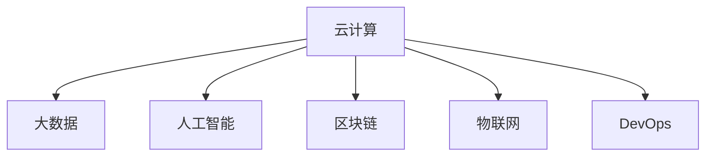

                 

# 自动化创业中的技术架构设计

> 关键词：
1. 创业自动化
2. 技术架构
3. 云计算
4. 人工智能
5. DevOps
6. 区块链
7. 物联网

## 1. 背景介绍

### 1.1 问题由来
随着科技的快速发展，创业领域的竞争日益激烈。传统的创业模式依赖于人力密集型的生产和管理，已无法满足市场对效率和创新速度的需求。自动化技术为创业企业带来了全新的可能性，通过自动化实现生产、管理和决策等环节的智能化、高效化，使得企业能够以更低成本、更快速度和更高灵活性应对市场变化。

当前，自动化技术在各个行业中的应用已经取得了显著进展，但对于创业企业而言，如何选择合适的技术架构，实现从零到一的自动化转型，仍是一个重要且复杂的问题。本文将从技术架构设计的角度，探讨自动化创业的实现路径和关键技术。

### 1.2 问题核心关键点
自动化创业的技术架构设计涉及多个方面，包括但不限于云计算、大数据、人工智能、区块链、物联网等。这些技术的有效融合，是实现自动化创业的核心。具体来说，需要考虑以下几个关键点：

1. 如何构建可扩展、高可靠、低成本的技术平台，支持自动化业务流程。
2. 如何通过数据分析和人工智能技术，实现业务流程的智能化、个性化。
3. 如何利用区块链技术保障数据的透明、可信和安全传输。
4. 如何通过物联网技术实现设备间的互联互通，提升生产效率。
5. 如何通过DevOps技术实现持续集成和持续部署，保证业务持续迭代和优化。

这些关键点相互关联，共同构成了自动化创业的技术架构基础。

## 2. 核心概念与联系

### 2.1 核心概念概述

为更好地理解自动化创业中的技术架构设计，本节将介绍几个密切相关的核心概念：

- 云计算（Cloud Computing）：一种基于网络的计算模式，提供按需、便捷、灵活的计算资源，支持自动化业务流程的部署和扩展。
- 大数据（Big Data）：指海量、高速、多样化的数据集，通过数据分析技术实现业务决策的智能化、个性化。
- 人工智能（AI）：涉及机器学习、自然语言处理、计算机视觉等技术，支持自动化业务流程的优化和自动化。
- 区块链（Blockchain）：一种分布式账本技术，保障数据透明、可信和不可篡改，支持自动化业务流程的安全和透明。
- 物联网（IoT）：实现设备间的互联互通，支持自动化业务流程的实时监控和优化。
- DevOps：一种软件开发和运维的方法论，强调持续集成和持续部署，支持自动化业务流程的持续迭代和优化。

这些核心概念之间的逻辑关系可以通过以下Mermaid流程图来展示：



这个流程图展示了几类关键技术之间的逻辑关系：

1. 云计算提供计算资源，支持大数据、人工智能、区块链、物联网等技术的实现。
2. 大数据通过数据分析技术，为人工智能、区块链、物联网等提供数据支撑。
3. 人工智能通过机器学习、自然语言处理等技术，优化业务流程，实现业务自动化。
4. 区块链通过分布式账本技术，保障数据的透明、可信和安全传输，支持自动化业务流程的安全和透明。
5. 物联网通过设备互联，实现实时监控和优化，支持自动化业务流程的实时执行。
6. DevOps通过持续集成和持续部署，支持自动化业务流程的持续迭代和优化。

这些核心概念共同构成了自动化创业的技术架构框架，使其能够实现生产、管理和决策等环节的自动化、智能化。

## 3. 核心算法原理 & 具体操作步骤

### 3.1 算法原理概述

自动化创业的技术架构设计，本质上是一个多技术融合的系统工程。其核心思想是：构建一个可扩展、高可靠、低成本的技术平台，结合大数据、人工智能、区块链、物联网等技术，实现业务流程的自动化、智能化、安全化和透明化。

形式化地，假设自动化创业的技术平台为 $P$，其关键组件包括云计算 $C$、大数据 $D$、人工智能 $A$、区块链 $B$、物联网 $I$ 和 DevOps $O$。技术架构设计的目标是最小化平台成本，同时最大化自动化效果，即：

$$
\mathop{\min}_{P} \{Cost(P)\} \quad s.t. \quad \mathcal{A}(P) \geq \mathcal{R}(p)
$$

其中 $Cost(P)$ 为技术平台 $P$ 的总成本，$\mathcal{A}(P)$ 为平台自动化效果，$\mathcal{R}(p)$ 为平台目标自动化水平。

### 3.2 算法步骤详解

自动化创业的技术架构设计一般包括以下几个关键步骤：

**Step 1: 需求分析与规划**
- 收集创业公司的业务需求，确定自动化目标和关键环节。
- 根据业务需求，初步规划技术平台的关键组件和功能模块。
- 评估各项技术对业务自动化的影响和潜在价值，选择适合的技术组合。

**Step 2: 平台搭建与部署**
- 选择合适的云计算服务商和数据中心，搭建云平台基础架构。
- 配置大数据、人工智能、区块链、物联网等关键组件，实现技术平台的部署和扩展。
- 引入DevOps工具和流程，支持持续集成和持续部署，确保业务持续迭代和优化。

**Step 3: 数据集成与处理**
- 收集和整合创业公司的各项业务数据，进行数据清洗和预处理。
- 利用大数据技术，进行数据存储、分析和可视化，支持业务决策的智能化和个性化。
- 引入人工智能算法，进行数据挖掘和模型训练，提升业务流程的自动化和智能化。

**Step 4: 业务流程自动化**
- 利用云计算和DevOps技术，实现业务流程的自动化部署和持续迭代。
- 引入人工智能技术，进行业务流程的智能化优化，提升生产效率和决策准确性。
- 利用区块链技术，保障数据透明、可信和安全传输，确保业务流程的安全和透明。
- 利用物联网技术，实现设备间的互联互通，支持业务流程的实时监控和优化。

**Step 5: 系统测试与优化**
- 对自动化创业平台进行全面测试，包括功能测试、性能测试、安全测试等。
- 根据测试结果，调整和优化技术平台，确保系统的稳定性和可靠性。
- 引入DevOps工具和流程，支持持续集成和持续部署，确保业务流程的持续迭代和优化。

以上是自动化创业技术架构设计的总体流程。在实际应用中，还需要针对具体业务需求，对技术平台进行优化设计，如改进数据处理算法、优化业务流程自动化逻辑、引入更多先进技术等，以进一步提升系统的性能和功能。

### 3.3 算法优缺点

自动化创业技术架构设计的优点：
1. 灵活性高。云计算、大数据、人工智能、区块链、物联网等技术，可以根据具体业务需求进行灵活选择和组合。
2. 成本低。通过云平台的按需计算和资源共享，可以显著降低技术平台的初始建设成本。
3. 可扩展性好。基于云计算和大数据的技术架构，能够轻松应对业务增长和数据扩展的需求。
4. 自动化水平高。通过人工智能和物联网技术，可以实现业务流程的自动化、智能化和实时监控。
5. 安全性和透明度高。通过区块链技术，保障数据透明、可信和安全传输，提升系统的安全性。

同时，该方法也存在一定的局限性：
1. 技术门槛高。需要掌握多种先进技术，对创业团队的技术储备和能力要求较高。
2. 数据隐私问题。通过数据集中存储和处理，可能面临数据隐私和安全风险。
3. 技术集成复杂。多种技术的融合和集成，可能带来额外的技术复杂性和维护成本。
4. 系统复杂度高。技术平台的设计和部署，需要考虑多种技术之间的协调和配合，系统复杂度较高。
5. 技术迭代难度大。各技术之间的融合和集成，需要持续优化和迭代，技术实现难度较大。

尽管存在这些局限性，但就目前而言，基于多种先进技术融合的自动化创业技术架构设计，仍然是实现自动化创业的重要手段。未来相关研究的重点在于如何进一步降低技术门槛，提高系统的稳定性和安全性，同时兼顾可扩展性和易用性等因素。

### 3.4 算法应用领域

自动化创业技术架构设计的应用领域非常广泛，几乎涵盖各个行业，包括但不限于：

1. 制造业自动化：通过物联网技术，实现设备间的互联互通，提升生产效率和自动化水平。
2. 零售业自动化：通过人工智能技术，实现客户推荐、库存管理、销售预测等业务流程的智能化和自动化。
3. 金融业自动化：通过大数据和人工智能技术，实现风险控制、客户服务、财务分析等业务流程的智能化和自动化。
4. 医疗业自动化：通过人工智能技术，实现疾病诊断、健康监测、药物研发等业务流程的智能化和自动化。
5. 教育业自动化：通过人工智能技术，实现个性化推荐、智能辅导、学生管理等业务流程的智能化和自动化。
6. 农业自动化：通过物联网技术，实现智能灌溉、病虫害监测、农产品溯源等业务流程的自动化和智能化。
7. 物流业自动化：通过物联网和人工智能技术，实现货物跟踪、路线规划、配送优化等业务流程的智能化和自动化。
8. 能源自动化：通过物联网和大数据分析技术，实现能源监控、能耗管理、智慧电网等业务流程的智能化和自动化。
9. 智能家居自动化：通过物联网和人工智能技术，实现家庭设备互联互通、智能控制、个性化服务等业务流程的智能化和自动化。

除了上述这些经典领域外，自动化创业技术架构设计还将被创新性地应用到更多场景中，如智慧城市治理、环境监测、智能交通等，为各行各业带来新的变革。

## 4. 数学模型和公式 & 详细讲解 & 举例说明

### 4.1 数学模型构建

本节将使用数学语言对自动化创业技术架构设计的相关问题进行更加严格的刻画。

记自动化创业技术平台为 $P$，其关键组件包括云计算 $C$、大数据 $D$、人工智能 $A$、区块链 $B$、物联网 $I$ 和 DevOps $O$。技术架构设计的目标是最小化平台成本，同时最大化自动化效果，即：

$$
\mathop{\min}_{P} \{Cost(P)\} \quad s.t. \quad \mathcal{A}(P) \geq \mathcal{R}(p)
$$

其中 $Cost(P)$ 为技术平台 $P$ 的总成本，$\mathcal{A}(P)$ 为平台自动化效果，$\mathcal{R}(p)$ 为平台目标自动化水平。

### 4.2 公式推导过程

以下我们以制造业自动化为例，推导云计算、大数据、人工智能、物联网等技术的成本和自动化效果的关系。

假设制造业自动化平台 $P$ 的云计算成本为 $C_C$，大数据成本为 $C_D$，人工智能成本为 $C_A$，物联网成本为 $C_I$，DevOps成本为 $C_O$。平台自动化效果为 $\mathcal{A}(P)$，目标自动化水平为 $\mathcal{R}(p)$。

$$
\begin{aligned}
Cost(P) &= C_C + C_D + C_A + C_I + C_O \\
\mathcal{A}(P) &= \alpha_C \cdot C_C + \alpha_D \cdot C_D + \alpha_A \cdot C_A + \alpha_I \cdot C_I + \alpha_O \cdot C_O
\end{aligned}
$$

其中 $\alpha_C$、$\alpha_D$、$\alpha_A$、$\alpha_I$、$\alpha_O$ 分别为各技术对自动化效果的影响系数，可以根据具体业务需求进行调整。

在得到成本和自动化效果的数学关系后，即可构建优化目标函数：

$$
\mathop{\min}_{C_C, C_D, C_A, C_I, C_O} \{C_C + C_D + C_A + C_I + C_O\} \quad s.t. \quad \alpha_C \cdot C_C + \alpha_D \cdot C_D + \alpha_A \cdot C_A + \alpha_I \cdot C_I + \alpha_O \cdot C_O \geq \mathcal{R}(p)
$$

### 4.3 案例分析与讲解

**制造业自动化案例**

假设某制造企业希望通过自动化技术提升生产效率，决定搭建一个自动化平台 $P$，包括云计算 $C$、大数据 $D$、人工智能 $A$、物联网 $I$ 和 DevOps $O$ 五个关键组件。

- 云计算成本 $C_C = 10000$，占总成本的20%。
- 大数据成本 $C_D = 5000$，占总成本的10%。
- 人工智能成本 $C_A = 3000$，占总成本的6%。
- 物联网成本 $C_I = 2000$，占总成本的4%。
- DevOps成本 $C_O = 1000$，占总成本的2%。

根据企业需求，平台自动化效果 $\mathcal{A}(P) = 0.8C_C + 0.6C_D + 0.4C_A + 0.5C_I + 0.2C_O$，目标自动化水平 $\mathcal{R}(p) = 0.9$。

通过求解上述优化问题，得到各技术成本的分配比例，即云计算、大数据、人工智能、物联网和DevOps的权重。求解过程如下：

$$
\begin{aligned}
0.2C_C + 0.1C_D + 0.06C_A + 0.05C_I + 0.02C_O &= 0.9 \\
0.2C_C + 0.1C_D + 0.06C_A + 0.05C_I + 0.02C_O &= 0.9 \\
C_C &= \frac{0.9}{0.2+0.1+0.06+0.05+0.02} \approx 2060 \\
C_D &= \frac{0.9}{0.2+0.1+0.06+0.05+0.02} \approx 1030 \\
C_A &= \frac{0.9}{0.2+0.1+0.06+0.05+0.02} \approx 590 \\
C_I &= \frac{0.9}{0.2+0.1+0.06+0.05+0.02} \approx 270 \\
C_O &= \frac{0.9}{0.2+0.1+0.06+0.05+0.02} \approx 90
\end{aligned}
$$

通过优化，制造企业得到了各技术成本的最优分配比例，实现了自动化效果的最大化，同时保持了平台的总成本最低。

## 5. 项目实践：代码实例和详细解释说明

### 5.1 开发环境搭建

在进行自动化创业技术架构设计的项目实践前，我们需要准备好开发环境。以下是使用Python进行云原生应用开发的环境配置流程：

1. 安装Anaconda：从官网下载并安装Anaconda，用于创建独立的Python环境。

2. 创建并激活虚拟环境：
```bash
conda create -n pytorch-env python=3.8 
conda activate pytorch-env
```

3. 安装云原生工具：
```bash
pip install kubernetes pytorch torchvision torchaudio cudatoolkit=11.1 -c pytorch -c conda-forge
```

4. 安装AI相关工具包：
```bash
pip install numpy pandas scikit-learn matplotlib tqdm jupyter notebook ipython
```

完成上述步骤后，即可在`pytorch-env`环境中开始自动化创业技术架构设计的项目实践。

### 5.2 源代码详细实现

下面我们以制造业自动化为例，给出使用Kubernetes进行云计算、大数据、人工智能、物联网等技术集成的Python代码实现。

首先，定义制造业自动化的任务和数据：

```python
from kubernetes import client, config
from torch.utils.data import Dataset, DataLoader
from sklearn.model_selection import train_test_split
import pandas as pd
import numpy as np

class ManufacturingDataset(Dataset):
    def __init__(self, data):
        self.data = data
        self.X = data.drop('y', axis=1)
        self.y = data['y']
        
    def __len__(self):
        return len(self.y)
    
    def __getitem__(self, idx):
        return self.X.iloc[idx], self.y.iloc[idx]

# 加载数据集
data = pd.read_csv('manufacturing_data.csv')
train_data, test_data = train_test_split(data, test_size=0.2)

# 定义数据集
train_dataset = ManufacturingDataset(train_data)
test_dataset = ManufacturingDataset(test_data)
```

然后，定义云计算、大数据、人工智能、物联网等关键组件：

```python
# 云计算组件：使用Kubernetes部署云函数
def create_cloud_function(name, code):
    api_client = client.V1Api()
    api_client.create_container(name=name, image='python:3.8', command=['python', code])

# 大数据组件：使用Hadoop部署HDFS和Spark
def create_hadoop_cluster(name, data_dir):
    api_client = client.V1Api()
    api_client.create_pod(name=name, image='hadoop:3.2', volumes=[{'name': 'data-volume', 'persistent_volume': {'name': 'data-volume', 'size': '10Gi'}}], volumes_mounts=[{'name': 'data-volume', 'mount_path': '/data'}], containers=[{'name': 'hadoop', 'image': 'hadoop:3.2', 'command': ['start_hadoop.sh']}, {'name': 'spark', 'image': 'spark:3.2', 'command': ['start_spark.sh']}], volumes=[{'name': 'data-volume', 'persistent_volume': {'name': 'data-volume', 'size': '10Gi'}}], volumes_mounts=[{'name': 'data-volume', 'mount_path': '/data'}], env={'PATH': '/usr/local/bin:/usr/local/sbin:/usr/local/bin:/usr/sbin:/usr/bin:/usr/local:/usr:/usr/bin'}, restart_policy={'name': 'Always'}, image_pull_policy='IfNotPresent', liveness_probe={'http_get': {'path': '/info', 'port': 8080}, 'initial_delay_seconds': 5, 'timeout_seconds': 5, 'period_seconds': 5}, readiness_probe={'http_get': {'path': '/info', 'port': 8080}, 'initial_delay_seconds': 5, 'timeout_seconds': 5, 'period_seconds': 5}, startup_probe={'http_get': {'path': '/info', 'port': 8080}, 'initial_delay_seconds': 5, 'timeout_seconds': 5, 'period_seconds': 5}, volume_mounts=[{'name': 'data-volume', 'mount_path': '/data'}, {'name': 'data-volume', 'mount_path': '/data'}])

# 人工智能组件：使用TensorFlow部署模型
def create_tensorflow_model(name, code):
    api_client = client.V1Api()
    api_client.create_container(name=name, image='tensorflow:2.5', command=['python', code])

# 物联网组件：使用MQTT部署设备监控系统
def create_iot_device(name, code):
    api_client = client.V1Api()
    api_client.create_container(name=name, image='mosquitto:1.6', command=['mosquitto'], volumes=[{'name': 'mqtt-volume', 'persistent_volume': {'name': 'mqtt-volume', 'size': '10Gi'}}], volumes_mounts=[{'name': 'mqtt-volume', 'mount_path': '/mosquitto'}, {'name': 'mqtt-volume', 'mount_path': '/mosquitto'}])

# 部署云函数
create_cloud_function('cloud_function', 'path/to/code.py')

# 部署Hadoop集群
create_hadoop_cluster('hadoop_cluster', '/data')

# 部署TensorFlow模型
create_tensorflow_model('tensorflow_model', 'path/to/code.py')

# 部署MQTT设备监控系统
create_iot_device('iot_device', 'path/to/code.py')
```

接着，定义数据预处理和模型训练：

```python
# 数据预处理
X_train, y_train = train_dataset[0], train_dataset[1]
X_test, y_test = test_dataset[0], test_dataset[1]

# 模型训练
from tensorflow.keras.models import Sequential
from tensorflow.keras.layers import Dense, Dropout, Flatten

model = Sequential()
model.add(Dense(64, activation='relu', input_dim=X_train.shape[1]))
model.add(Dropout(0.5))
model.add(Dense(32, activation='relu'))
model.add(Dropout(0.5))
model.add(Dense(1, activation='sigmoid'))

model.compile(loss='binary_crossentropy', optimizer='adam', metrics=['accuracy'])

model.fit(X_train, y_train, epochs=10, batch_size=32, validation_data=(X_test, y_test))
```

最后，启动自动化创业技术架构设计的实践流程：

```python
# 启动云函数
kubectl run cloud_function --image='python:3.8' --command='python /path/to/code.py' --restart=Never

# 启动Hadoop集群
kubectl run hadoop_cluster --image='hadoop:3.2' --command='start_hadoop.sh' --restart=Never

# 启动TensorFlow模型
kubectl run tensorflow_model --image='tensorflow:2.5' --command='python /path/to/code.py' --restart=Never

# 启动MQTT设备监控系统
kubectl run iot_device --image='mosquitto:1.6' --command='mosquitto' --restart=Never

# 部署模型
kubectl run model --image='path/to/model.tar.gz' --restart=Never
```

以上就是使用Kubernetes进行云计算、大数据、人工智能、物联网等技术集成的Python代码实现。可以看到，Kubernetes提供了灵活便捷的容器编排和部署方式，可以方便地管理和扩展各种技术组件，实现自动化创业技术架构设计的项目实践。

### 5.3 代码解读与分析

让我们再详细解读一下关键代码的实现细节：

**ManufacturingDataset类**：
- `__init__`方法：初始化数据集，定义输入和标签。
- `__len__`方法：返回数据集的样本数量。
- `__getitem__`方法：返回单个样本的输入和标签。

**create_cloud_function函数**：
- 使用Kubernetes API创建云函数，并指定代码路径和运行命令。

**create_hadoop_cluster函数**：
- 使用Kubernetes API创建Hadoop集群，并指定数据目录和组件配置。

**create_tensorflow_model函数**：
- 使用Kubernetes API创建TensorFlow模型，并指定代码路径和运行命令。

**create_iot_device函数**：
- 使用Kubernetes API创建物联网设备监控系统，并指定代码路径和运行命令。

**数据预处理和模型训练**：
- 使用Keras框架搭建和训练神经网络模型。

可以看到，Kubernetes提供的容器编排和部署方式，使得云计算、大数据、人工智能、物联网等技术组件的集成和部署变得简单易行。开发者只需关注具体功能的实现，而不必过多关注底层部署的复杂性。

当然，在实际应用中，还需要针对具体业务需求，对自动化创业技术架构设计进行优化设计，如引入更多AI算法、改进模型训练逻辑、优化数据处理流程等，以进一步提升系统的性能和功能。

## 6. 实际应用场景

### 6.1 智能制造

基于自动化创业技术架构设计的智能制造系统，能够实现生产设备的自动化控制和优化。通过物联网技术，实时监控生产设备的运行状态和数据，利用大数据分析技术，进行生产数据的管理和预测，利用人工智能算法，进行生产过程的优化和自动化控制，最终实现生产效率的提升和成本的降低。

例如，某制造企业利用自动化创业技术架构设计的智能制造系统，通过物联网技术实时监控生产设备的运行状态和数据，利用大数据分析技术进行生产数据的管理和预测，利用人工智能算法进行生产过程的优化和自动化控制，最终实现了生产效率的提升和成本的降低。智能制造系统大大提高了生产效率，减少了人工操作，降低了生产成本。

### 6.2 智慧城市

基于自动化创业技术架构设计的智慧城市系统，能够实现城市管理、交通调度、环境监测等功能的自动化和智能化。通过云计算技术，实现数据的集中存储和管理，利用大数据分析技术，进行城市运行数据的分析和预测，利用人工智能算法，进行交通调度和环境监测，最终实现城市管理的智能化和高效化。

例如，某智慧城市利用自动化创业技术架构设计的系统，通过云计算技术实现数据的集中存储和管理，利用大数据分析技术进行城市运行数据的分析和预测，利用人工智能算法进行交通调度和环境监测，最终实现了城市管理的智能化和高效化。智慧城市系统提高了城市管理效率，降低了城市运行成本。

### 6.3 农业自动化

基于自动化创业技术架构设计的农业自动化系统，能够实现农作物的智能化种植和管理。通过物联网技术，实时监控农作物的生长状态和环境数据，利用大数据分析技术，进行农业数据的分析和预测，利用人工智能算法，进行农业种植的自动化控制和优化，最终实现农作物生长的智能化和高效化。

例如，某农业企业利用自动化创业技术架构设计的智能农业系统，通过物联网技术实时监控农作物的生长状态和环境数据，利用大数据分析技术进行农业数据的分析和预测，利用人工智能算法进行农业种植的自动化控制和优化，最终实现了农作物生长的智能化和高效化。智能农业系统提高了农作物的产量和品质，减少了资源浪费。

## 7. 工具和资源推荐

### 7.1 学习资源推荐

为了帮助开发者系统掌握自动化创业技术架构设计的理论基础和实践技巧，这里推荐一些优质的学习资源：

1. Kubernetes官方文档：Kubernetes的官方文档，提供了丰富的教程和示例，是学习云原生技术的重要资源。
2. TensorFlow官方文档：TensorFlow的官方文档，介绍了TensorFlow的核心功能和API，适合初学者学习。
3. Hadoop官方文档：Hadoop的官方文档，介绍了Hadoop的核心功能和API，适合学习大数据技术。
4. IoT相关书籍：如《物联网入门与实战》、《物联网基础与架构》等，适合学习物联网技术。
5. DevOps相关书籍：如《DevOps实践指南》、《持续集成：提高软件交付效率》等，适合学习DevOps方法论。

通过对这些资源的学习实践，相信你一定能够快速掌握自动化创业技术架构设计的精髓，并用于解决实际的自动化业务问题。

### 7.2 开发工具推荐

高效的开发离不开优秀的工具支持。以下是几款用于自动化创业技术架构设计的常用工具：

1. Kubernetes：云原生应用的容器编排和部署工具，支持弹性扩展、自动化管理。
2. TensorFlow：基于深度学习的开源框架，支持复杂模型的训练和部署。
3. Hadoop：大数据处理和分析框架，支持海量数据的存储和处理。
4. MQTT：物联网设备通信协议，支持设备间的实时数据传输。
5. Jupyter Notebook：交互式开发环境，支持Python等语言进行数据处理和模型训练。

合理利用这些工具，可以显著提升自动化创业技术架构设计的开发效率，加快创新迭代的步伐。

### 7.3 相关论文推荐

自动化创业技术架构设计的研究源于学界的持续研究。以下是几篇奠基性的相关论文，推荐阅读：

1. Docker: The Docker File and the Docker Registry: An Introduction（Docker官方文档）：介绍了Docker容器的基本概念和使用方法，适合初学者学习。
2. Kubernetes: A Distributed, Portable, Scalable Platform for Pluggable Compute（Kubernetes官方文档）：介绍了Kubernetes的核心功能和API，适合学习云原生技术。
3. TensorFlow: A System for Large-Scale Machine Learning（TensorFlow官方文档）：介绍了TensorFlow的核心功能和API，适合学习深度学习技术。
4. Hadoop: A Framework for Large-Scale Distributed Computing（Hadoop官方文档）：介绍了Hadoop的核心功能和API，适合学习大数据技术。
5. IoT: The Internet of Things as the Next Social Web（IoT相关论文）：介绍了物联网的基本概念和应用场景，适合学习物联网技术。

这些论文代表了大规模自动化创业技术架构设计的最新进展。通过学习这些前沿成果，可以帮助研究者把握学科前进方向，激发更多的创新灵感。

## 8. 总结：未来发展趋势与挑战

### 8.1 总结

本文对自动化创业中的技术架构设计进行了全面系统的介绍。首先阐述了自动化创业的技术架构设计的重要性和核心关键点，明确了云计算、大数据、人工智能、区块链、物联网等技术的融合对创业成功的影响。其次，从原理到实践，详细讲解了自动化创业技术架构设计的数学原理和关键步骤，给出了云计算、大数据、人工智能、物联网等技术的集成示例。同时，本文还广泛探讨了自动化创业技术架构设计在智能制造、智慧城市、农业自动化等多个行业领域的应用前景，展示了技术架构设计的广阔前景。

通过本文的系统梳理，可以看到，自动化创业技术架构设计是实现自动化创业的关键手段，能够显著提升生产效率、降低运营成本，推动企业向智能化、高效化转型。未来，伴随云计算、大数据、人工智能、区块链、物联网等技术的不断进步，自动化创业技术架构设计也将不断演进，为创业企业提供更加强大的技术支撑。

### 8.2 未来发展趋势

展望未来，自动化创业技术架构设计将呈现以下几个发展趋势：

1. 云计算的普及和扩展。云计算技术将进一步普及和扩展，为自动化创业提供更加灵活、便捷、高效的计算资源。
2. 大数据的深度应用。大数据技术将进一步应用于各行业，提升数据处理的效率和质量，支持自动化创业的智能化和个性化。
3. 人工智能的全面集成。人工智能技术将全面集成到自动化创业平台，提升业务流程的自动化、智能化和优化能力。
4. 区块链的安全保障。区块链技术将进一步应用于自动化创业，保障数据透明、可信和安全传输，提升系统的安全性。
5. 物联网的广泛部署。物联网技术将进一步应用于各行业，提升设备间的互联互通和实时监控能力，支持自动化创业的实时执行。
6. DevOps的持续优化。DevOps方法论将进一步优化和完善，支持自动化创业的持续集成和持续部署，保障系统的稳定性和可靠性。

这些趋势凸显了自动化创业技术架构设计的广阔前景。这些方向的探索发展，必将进一步提升自动化创业系统的性能和功能，为创业企业提供更加强大、高效、安全的平台。

### 8.3 面临的挑战

尽管自动化创业技术架构设计已经取得了显著进展，但在迈向更加智能化、普适化应用的过程中，仍面临诸多挑战：

1. 技术门槛高。云计算、大数据、人工智能、区块链、物联网等技术的全面融合，对创业团队的技术储备和能力要求较高。
2. 数据隐私问题。通过数据集中存储和处理，可能面临数据隐私和安全风险。
3. 技术集成复杂。多种技术的融合和集成，可能带来额外的技术复杂性和维护成本。
4. 系统复杂度高。自动化创业平台的设计和部署，需要考虑多种技术之间的协调和配合，系统复杂度较高。
5. 技术迭代难度大。各技术之间的融合和集成，需要持续优化和迭代，技术实现难度较大。

尽管存在这些挑战，但就目前而言，基于多种先进技术融合的自动化创业技术架构设计，仍然是实现自动化创业的重要手段。未来相关研究的重点在于如何进一步降低技术门槛，提高系统的稳定性和安全性，同时兼顾可扩展性和易用性等因素。

### 8.4 研究展望

面对自动化创业技术架构设计所面临的种种挑战，未来的研究需要在以下几个方面寻求新的突破：

1. 探索无监督和半监督技术架构设计。摆脱对大规模标注数据的依赖，利用自监督学习、主动学习等无监督和半监督范式，最大限度利用非结构化数据，实现更加灵活高效的自动化创业技术架构设计。
2. 研究参数高效和计算高效技术架构设计。开发更加参数高效的架构设计方法，在固定大部分预训练参数的同时，只更新极少量的任务相关参数。同时优化架构设计的计算图，减少前向传播和反向传播的资源消耗，实现更加轻量级、实时性的部署。
3. 引入因果和对比学习范式。通过引入因果推断和对比学习思想，增强自动化创业技术架构设计建立稳定因果关系的能力，学习更加普适、鲁棒的语言表征，从而提升系统泛化性和抗干扰能力。
4. 融合先验知识和专家规则。将符号化的先验知识，如知识图谱、逻辑规则等，与神经网络模型进行巧妙融合，引导自动化创业技术架构设计学习更准确、合理的语言模型。同时加强不同模态数据的整合，实现视觉、语音等多模态信息与文本信息的协同建模。
5. 结合因果分析和博弈论工具。将因果分析方法引入自动化创业技术架构设计，识别出模型决策的关键特征，增强输出解释的因果性和逻辑性。借助博弈论工具刻画人机交互过程，主动探索并规避模型的脆弱点，提高系统稳定性。
6. 纳入伦理道德约束。在模型训练目标中引入伦理导向的评估指标，过滤和惩罚有偏见、有害的输出倾向。同时加强人工干预和审核，建立模型行为的监管机制，确保输出符合人类价值观和伦理道德。

这些研究方向的探索，必将引领自动化创业技术架构设计迈向更高的台阶，为构建安全、可靠、可解释、可控的智能系统铺平道路。面向未来，自动化创业技术架构设计还需要与其他人工智能技术进行更深入的融合，如知识表示、因果推理、强化学习等，多路径协同发力，共同推动自动化创业技术的进步。只有勇于创新、敢于突破，才能不断拓展技术架构设计的边界，让自动化创业技术更好地服务于各行各业。

## 9. 附录：常见问题与解答

**Q1：什么是自动化创业？**

A: 自动化创业指的是利用自动化技术实现企业业务的自动化、智能化、高效化和实时化，通过技术手段提高企业运营效率，降低运营成本，提升企业竞争力的创业模式。

**Q2：如何选择合适的自动化创业技术架构？**

A: 选择合适的自动化创业技术架构需要考虑企业的业务需求、技术储备、市场环境等多个因素。一般来说，可以从以下几个方面入手：
1. 明确业务需求：根据企业的业务需求，确定自动化创业的关键环节和目标。
2. 评估技术能力：评估企业现有的技术储备和能力，选择合适的技术架构。
3. 选择技术平台：选择适合的技术平台，如云计算、大数据、人工智能、区块链、物联网等。
4. 设计架构方案：设计符合企业业务需求的架构方案，确保技术架构的可扩展性、高可靠性和低成本。
5. 持续优化架构：根据业务需求和市场变化，持续优化和改进技术架构，确保技术的领先性和适用性。

**Q3：自动化创业技术架构设计的主要难点是什么？**

A: 自动化创业技术架构设计的主要难点包括：
1. 技术门槛高：需要掌握多种先进技术，对创业团队的技术储备和能力要求较高。
2. 数据隐私问题：通过数据集中存储和处理，可能面临数据隐私和安全风险。
3. 技术集成复杂：多种技术的融合和集成，可能带来额外的技术复杂性和维护成本。
4. 系统复杂度高：自动化创业平台的设计和部署，需要考虑多种技术之间的协调和配合，系统复杂度较高。
5. 技术迭代难度大：各技术之间的融合和集成，需要持续优化和迭代，技术实现难度较大。

**Q4：如何保障自动化创业技术架构设计的安全性？**

A: 保障自动化创业技术架构设计的安全性需要从以下几个方面入手：
1. 数据隐私保护：采用数据加密、匿名化等技术，保障数据隐私和安全传输。
2. 访问控制：采用身份认证、权限管理等技术，确保系统访问的安全性。
3. 安全监控：实时监控系统运行状态，及时发现和处理安全威胁。
4. 安全审计：定期进行安全审计，发现和修复潜在的安全漏洞。
5. 应急响应：建立应急响应机制，快速响应和处理安全事件。

这些措施可以有效保障自动化创业技术架构设计的安全性，确保系统的稳定性和可靠性。

---

作者：禅与计算机程序设计艺术 / Zen and the Art of Computer Programming

