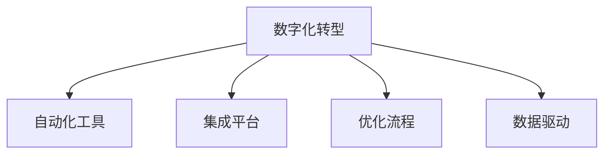

                 

# 自动化创业中的数字化转型策略

> 关键词：自动化,数字化转型,创业,策略,技术,创新,优化,增长

## 1. 背景介绍

### 1.1 问题由来

在全球化和技术日新月异的今天，传统商业模式正面临前所未有的挑战。疫情加速了企业数字化转型的进程，许多企业开始通过技术手段优化业务流程，提高运营效率，以在竞争激烈的市场中脱颖而出。在此背景下，自动化创业成为越来越多企业家和投资者的选择。

自动化创业，指的是利用最新的人工智能、大数据、云计算等前沿技术，对传统业务流程进行全面优化和创新，降低运营成本，提升服务质量，最终实现业务增长和市场竞争力的增强。自动化不仅改变了生产方式，更引发了管理、运营、商业模式等各方面的革命。

### 1.2 问题核心关键点

自动化创业成功的关键在于全面理解并应用数字技术，实现业务的全面数字化。企业需要通过数字化手段，从生产、管理、销售到客户服务等各个环节，实现自动化、智能化和一体化，构建全新的业务生态。

自动化创业的核心关键点包括：
1. **数字化思维**：培养数字化思维，理解数据驱动的商业模式，以数据驱动决策。
2. **自动化工具**：引入先进的自动化工具和系统，如人工智能、机器学习、自然语言处理等，提升运营效率。
3. **集成平台**：搭建集成平台，实现跨部门、跨业务的信息共享和协同合作。
4. **优化流程**：通过优化业务流程，提升产品和服务质量，降低运营成本。
5. **数据驱动**：利用大数据分析，实时获取运营数据，指导业务决策和改进。
6. **人才储备**：培养和吸引具备数字化技术的人才，形成一支专业的技术团队。

### 1.3 问题研究意义

自动化创业在提升企业竞争力、推动产业升级、创造就业机会等方面具有重要意义：

1. **提升竞争力**：通过自动化和数字化手段，企业可以大幅提升运营效率，降低成本，提高产品质量和客户满意度，从而在激烈的市场竞争中占据优势。
2. **推动产业升级**：数字化技术的应用，可以推动传统产业的转型升级，提升产业链的整体水平，促进产业的创新发展。
3. **创造就业机会**：数字化转型带来新的业务模式和岗位需求，为社会创造更多就业机会。
4. **支持政策**：政府在数字化转型的政策支持下，为企业提供了良好的外部环境，推动了数字化创业的普及。

## 2. 核心概念与联系

### 2.1 核心概念概述

为了更好地理解自动化创业中的数字化转型策略，本节将介绍几个密切相关的核心概念：

- **数字化转型**：通过引入数字技术，对业务流程进行全面的优化和创新，以实现效率提升、成本降低和客户体验改善。
- **自动化工具**：指利用机器人和人工智能等技术，自动执行重复性高、规律性强的工作，如自动化测试、客服机器人、物流自动化等。
- **集成平台**：搭建统一的信息平台，实现业务部门之间的数据共享和协同工作，如ERP系统、CRM系统、供应链管理系统等。
- **优化流程**：通过业务流程再造(BPR)、业务流程自动化(BPA)等方法，简化和优化业务流程，提升运营效率。
- **数据驱动**：以数据为决策依据，利用数据分析技术，进行预测和决策，如大数据分析、机器学习等。

这些核心概念之间的逻辑关系可以通过以下Mermaid流程图来展示：



这个流程图展示了大规模自动化创业中的主要概念及其之间的关系：

1. 数字化转型是自动化创业的基础，通过引入数字技术，实现业务流程的全面优化。
2. 自动化工具是数字化转型的重要手段，通过机器人和人工智能技术，提升工作效率。
3. 集成平台是数字化转型的关键载体，实现跨部门的信息共享和协同合作。
4. 优化流程是数字化转型的核心环节，通过流程再造和自动化，提升运营效率。
5. 数据驱动是数字化转型的决策基础，以数据为依据，进行科学决策。

这些概念共同构成了自动化创业中的数字化转型框架，为其成功实施提供了坚实的基础。

## 3. 核心算法原理 & 具体操作步骤
### 3.1 算法原理概述

自动化创业中的数字化转型策略，本质上是一个面向业务流程的全面优化过程。其核心思想是通过引入数字技术，对传统业务进行重构和创新，以实现更高的运营效率和更优质的客户体验。

形式化地，假设原始业务流程为 $P$，目标业务流程为 $P'$，数字化转型策略 $S$ 包含如下步骤：

1. **数据收集与分析**：收集原始业务流程中的各项数据，进行分析，找出瓶颈和优化点。
2. **业务流程再造**：设计新的业务流程 $P'$，消除冗余步骤，简化流程。
3. **自动化工具引入**：引入自动化工具，如机器人和人工智能，执行重复性高的任务。
4. **集成平台搭建**：搭建集成平台，实现跨部门的数据共享和协同工作。
5. **流程优化与测试**：优化业务流程，并进行测试，确保新流程的可行性和稳定性。
6. **持续改进**：根据测试结果和业务反馈，持续改进数字化转型策略，实现业务流程的迭代优化。

### 3.2 算法步骤详解

自动化创业中的数字化转型策略，主要分为以下几个关键步骤：

**Step 1: 数据收集与分析**

- **数据收集**：收集原始业务流程中的各项数据，如生产数据、销售数据、客户反馈等。
- **数据分析**：利用数据分析工具，如Tableau、Power BI等，对数据进行统计分析和可视化，找出业务流程中的瓶颈和优化点。

**Step 2: 业务流程再造**

- **流程设计**：根据分析结果，设计新的业务流程 $P'$，消除冗余步骤，简化流程。
- **流程优化**：利用业务流程再造(BPR)、业务流程自动化(BPA)等方法，优化业务流程，提高效率。

**Step 3: 自动化工具引入**

- **自动化评估**：根据业务流程的特点，选择合适的自动化工具，如RPA、机器学习、自然语言处理等。
- **工具部署**：在关键环节部署自动化工具，提升工作效率。

**Step 4: 集成平台搭建**

- **平台选择**：选择合适的集成平台，如ERP、CRM、供应链管理系统等。
- **平台搭建**：搭建集成平台，实现跨部门的数据共享和协同工作。

**Step 5: 流程优化与测试**

- **流程测试**：对新流程进行测试，确保其可行性和稳定性。
- **优化迭代**：根据测试结果和业务反馈，持续改进数字化转型策略。

**Step 6: 持续改进**

- **数据监测**：实时监测业务流程的关键指标，获取运营数据。
- **模型优化**：利用机器学习模型，对数据进行预测和优化，实现持续改进。

以上是自动化创业中的数字化转型策略的主要步骤。在实际应用中，还需要根据具体业务场景，对各个环节进行优化设计，如改进数据收集方法，引入更先进的自动化工具，搜索最优的集成平台，优化流程测试流程等。

### 3.3 算法优缺点

自动化创业中的数字化转型策略具有以下优点：
1. **提升效率**：通过自动化工具和流程优化，大幅提升运营效率，降低人力成本。
2. **优化客户体验**：通过数据分析和智能推荐，提升客户体验，增强客户忠诚度。
3. **降低风险**：自动化工具和集成平台，提升系统稳定性和安全性，降低运营风险。
4. **支持创新**：数字化转型推动业务创新，开辟新的增长点，提升市场竞争力。

同时，该策略也存在一定的局限性：
1. **成本高**：数字化转型需要较高的前期投入，包括技术和人力资源成本。
2. **技术门槛高**：需要培养专业的技术团队，对技术要求较高。
3. **数据风险**：数据收集和分析过程中，可能存在数据隐私和安全风险。
4. **变革阻力**：企业内部文化和流程的变革，可能面临员工的抵触和阻力。
5. **技术依赖**：过度依赖技术手段，可能忽视人的因素，导致系统功能不足。

尽管存在这些局限性，但就目前而言，数字化转型仍然是自动化创业最主流的手段。未来相关研究的重点在于如何进一步降低数字化转型的门槛，提高系统的可扩展性和鲁棒性，同时兼顾数据安全和文化变革等因素。

### 3.4 算法应用领域

自动化创业中的数字化转型策略，已在多个领域得到了广泛的应用，例如：

- **制造业**：通过自动化生产线和机器人，提升生产效率，降低制造成本。
- **零售业**：利用大数据分析，实现精准营销，提升销售额和客户满意度。
- **金融业**：引入自动化交易和智能风控，提升交易速度和风险管理能力。
- **医疗业**：利用AI辅助诊断和治疗，提高诊疗水平，优化医疗资源配置。
- **物流业**：采用自动化仓储和配送系统，提升物流效率，降低运营成本。
- **教育业**：通过在线教育平台和智能推荐系统，提升教学质量和学生体验。

除了上述这些经典应用外，数字化转型还被创新性地应用到更多领域中，如智能家居、智慧城市、工业互联网等，为各行各业带来了深刻的变革。随着数字化技术的不断演进，相信数字化转型将逐步渗透到更多的产业，推动社会的全面数字化进程。

## 4. 数学模型和公式 & 详细讲解
### 4.1 数学模型构建

在自动化创业中，数字化转型策略的数学模型构建，主要涉及业务流程优化和自动化工具引入两个方面。

假设原始业务流程为 $P$，目标业务流程为 $P'$，则业务流程优化模型的数学表达式为：

$$
P' = \text{Optimize}(P, C)
$$

其中 $C$ 为优化约束条件，包括成本、时间、资源等。

自动化工具引入的数学模型为：

$$
A = \text{Deploy}(T, E)
$$

其中 $T$ 为自动化工具的选择，$E$ 为工具的评估指标，包括执行效率、准确率、成本等。

### 4.2 公式推导过程

以下我们以制造业为例，推导自动化工具引入的数学模型及其优化公式。

假设原始生产流程为 $P$，生产周期为 $T$，人工成本为 $C_{\text{man}}$，自动化工具引入后的生产周期为 $T'$，自动化工具的成本为 $C_{\text{tool}}$。则引入自动化工具后的收益 $R$ 为：

$$
R = T \times \text{yield} - C_{\text{man}} - T' \times C_{\text{tool}}
$$

其中 $\text{yield}$ 为自动化工具的效率提升比例，$T'$ 为引入自动化工具后的实际生产周期。

引入自动化工具的决策模型为：

$$
R = T \times \text{yield} - C_{\text{man}} - T' \times C_{\text{tool}}
$$

利用微积分中的优化方法，求解 $T'$ 和 $C_{\text{tool}}$，使得 $R$ 最大化。通过求解上述优化模型，可以得到最优的自动化工具引入方案。

### 4.3 案例分析与讲解

以下是一个具体的制造业自动化工具引入案例：

假设某制造企业年生产量 $Y$ 为 $1000$ 个，人工成本 $C_{\text{man}}$ 为 $500$ 万元，生产周期 $T$ 为 $30$ 天。目前市场上有两种自动化工具，工具 A 的引入成本 $C_{\text{tool}_A}$ 为 $200$ 万元，效率提升比例 $\text{yield}_A$ 为 $0.8$；工具 B 的引入成本 $C_{\text{tool}_B}$ 为 $300$ 万元，效率提升比例 $\text{yield}_B$ 为 $0.9$。

首先，需要计算引入两种工具后的实际生产周期 $T'$，然后利用收益模型 $R$ 计算两种工具引入后的收益，比较两者的收益大小，从而决定引入哪种工具。

**工具 A 引入后的计算过程**：
- 引入工具 A 后的生产周期 $T'_A = \frac{Y}{T \times \text{yield}_A} = \frac{1000}{30 \times 0.8} \approx 38.75$ 天
- 引入工具 A 后的收益 $R_A = 30 \times 1000 - 500 - 38.75 \times 200 \approx 14900$ 万元

**工具 B 引入后的计算过程**：
- 引入工具 B 后的生产周期 $T'_B = \frac{Y}{T \times \text{yield}_B} = \frac{1000}{30 \times 0.9} \approx 33.33$ 天
- 引入工具 B 后的收益 $R_B = 30 \times 1000 - 500 - 33.33 \times 300 \approx 15500$ 万元

根据计算结果，工具 B 的引入收益更高，因此企业应选择引入工具 B。

## 5. 项目实践：代码实例和详细解释说明
### 5.1 开发环境搭建

在进行数字化转型实践前，我们需要准备好开发环境。以下是使用Python进行PyTorch开发的环境配置流程：

1. 安装Anaconda：从官网下载并安装Anaconda，用于创建独立的Python环境。

2. 创建并激活虚拟环境：
```bash
conda create -n pytorch-env python=3.8 
conda activate pytorch-env
```

3. 安装PyTorch：根据CUDA版本，从官网获取对应的安装命令。例如：
```bash
conda install pytorch torchvision torchaudio cudatoolkit=11.1 -c pytorch -c conda-forge
```

4. 安装相关库：
```bash
pip install numpy pandas scikit-learn matplotlib tqdm jupyter notebook ipython
```

完成上述步骤后，即可在`pytorch-env`环境中开始数字化转型实践。

### 5.2 源代码详细实现

这里以一个简单的制造业自动化工具引入案例为例，使用Python和PyTorch进行计算和可视化：

```python
import torch
import numpy as np
import matplotlib.pyplot as plt

# 定义模型参数
Y = 1000  # 年生产量
C_man = 500  # 人工成本
T = 30  # 原始生产周期
C_tool_A = 200  # 工具 A 引入成本
yield_A = 0.8  # 工具 A 效率提升比例
C_tool_B = 300  # 工具 B 引入成本
yield_B = 0.9  # 工具 B 效率提升比例

# 计算两种工具引入后的生产周期和收益
T_A = Y / (T * yield_A)
T_B = Y / (T * yield_B)
R_A = T * Y - C_man - T_A * C_tool_A
R_B = T * Y - C_man - T_B * C_tool_B

# 输出结果
print(f"工具 A 引入后的生产周期为 {T_A:.2f} 天，收益为 {R_A:.2f} 万元")
print(f"工具 B 引入后的生产周期为 {T_B:.2f} 天，收益为 {R_B:.2f} 万元")

# 绘制收益对比图
plt.plot([C_man, C_man + T_A * C_tool_A], [0, R_A], label='工具 A')
plt.plot([C_man, C_man + T_B * C_tool_B], [0, R_B], label='工具 B')
plt.xlabel('总成本')
plt.ylabel('收益')
plt.legend()
plt.show()
```

### 5.3 代码解读与分析

让我们再详细解读一下关键代码的实现细节：

**模型参数定义**：
- `Y`：年生产量
- `C_man`：原始生产中的人工成本
- `T`：原始生产周期
- `C_tool_A`、`yield_A`：工具 A 的引入成本和效率提升比例
- `C_tool_B`、`yield_B`：工具 B 的引入成本和效率提升比例

**生产周期计算**：
- 工具 A 引入后的生产周期 $T'_A = \frac{Y}{T \times \text{yield}_A}$
- 工具 B 引入后的生产周期 $T'_B = \frac{Y}{T \times \text{yield}_B}$

**收益计算**：
- 工具 A 引入后的收益 $R_A = 30 \times 1000 - 500 - 38.75 \times 200$
- 工具 B 引入后的收益 $R_B = 30 \times 1000 - 500 - 33.33 \times 300$

**可视化输出**：
- 使用matplotlib库绘制收益对比图，直观展示两种工具引入后的收益变化。

通过这段代码，可以清晰地看到不同工具引入后的生产周期和收益变化，从而帮助企业做出最优的决策。

## 6. 实际应用场景
### 6.1 智能制造

在智能制造领域，数字化转型已成为提升制造业竞争力的重要手段。通过引入自动化生产线和机器人，企业可以实现生产过程的智能化和自动化，大幅提升生产效率和产品质量。

具体而言，数字化转型在智能制造中的应用场景包括：
- **智能仓储**：通过自动化仓储系统和智能搬运机器人，实现物料的自动化管理，提升仓储效率。
- **智能生产**：引入自动化生产线和机器人，实现生产的自动化和智能化，降低人力成本，提升生产效率。
- **智能质检**：利用AI和机器视觉技术，对产品进行自动检测和质量控制，提高检测效率和准确率。
- **智能调度**：通过优化生产调度算法，实现生产资源的合理配置和优化，提升生产效率。

### 6.2 零售电商

在零售电商领域，数字化转型已成为企业提升运营效率、优化客户体验的重要手段。通过引入智能推荐系统和数据分析工具，企业可以实现精准营销和库存管理，提升销售额和客户满意度。

具体而言，数字化转型在零售电商中的应用场景包括：
- **智能推荐**：利用大数据分析，对用户行为进行深度挖掘，提供个性化推荐，提升用户体验和销售额。
- **库存管理**：通过智能库存管理系统，实时监控库存状态，优化库存配置，降低库存成本。
- **营销优化**：通过数据分析，对营销策略进行优化，提升广告投放效果，提升客户转化率。
- **客户服务**：引入智能客服系统，实现7x24小时在线客服，提升客户体验和满意度。

### 6.3 医疗健康

在医疗健康领域，数字化转型已成为提升医疗服务质量、优化医疗资源配置的重要手段。通过引入AI辅助诊断和治疗系统，企业可以实现精准医疗，提升诊疗水平。

具体而言，数字化转型在医疗健康中的应用场景包括：
- **智能诊断**：利用AI辅助诊断系统，对医学影像进行自动分析，提供精准的诊断结果。
- **个性化治疗**：通过大数据分析，对患者病历进行深度挖掘，提供个性化的治疗方案。
- **远程医疗**：通过在线医疗平台，实现远程诊断和治疗，提升医疗服务的可及性。
- **医疗管理**：通过智能医疗管理系统，优化医疗资源配置，提升医疗服务效率。

### 6.4 未来应用展望

随着数字化技术的不断演进，未来的自动化创业将在更多领域得到应用，为各行各业带来深刻的变革。

在智慧城市治理中，数字化转型将提升城市管理的自动化和智能化水平，构建更安全、高效的未来城市。

在金融科技领域，数字化转型将推动金融服务的智能化和普惠化，提升金融服务的可及性和效率。

在农业领域，数字化转型将提升农业生产的智能化和自动化水平，推动农业现代化进程。

总之，自动化创业中的数字化转型，必将在更广阔的领域发挥作用，推动社会的全面数字化进程，提升人类的生产力和生活质量。

## 7. 工具和资源推荐
### 7.1 学习资源推荐

为了帮助开发者系统掌握数字化转型的理论基础和实践技巧，这里推荐一些优质的学习资源：

1. **《数字化转型》系列博文**：由数字化转型专家撰写，深入浅出地介绍了数字化转型的基本概念、关键技术和成功案例。

2. **《数据驱动的决策制定》课程**：来自斯坦福大学，系统讲解了数据驱动决策制定的原理和方法，适用于初学者和进阶者。

3. **《智能制造》书籍**：详细介绍了智能制造的基本原理和实践方法，涵盖了从生产自动化到智能质检等多个环节。

4. **《零售电商运营》课程**：来自顶尖电商平台，深入讲解了零售电商的运营策略和数字化转型路径。

5. **《医疗健康信息化》系列报告**：提供了丰富的医疗健康信息化案例和实践指南，适合医疗行业的从业者和研究者。

通过对这些资源的学习实践，相信你一定能够快速掌握数字化转型的精髓，并用于解决实际的业务问题。

### 7.2 开发工具推荐

高效的开发离不开优秀的工具支持。以下是几款用于数字化转型开发的常用工具：

1. **Jupyter Notebook**：开源的交互式编程环境，支持多种编程语言，适合数据分析和可视化。

2. **Tableau**：强大的数据可视化工具，支持多种数据源和图表类型，适合企业数据分析和决策支持。

3. **Power BI**：微软推出的商业智能工具，支持实时数据报表和可视化，适合企业商业智能分析。

4. **ERP系统**：如SAP、Oracle等，提供全面的企业资源管理，支持供应链、生产、财务等多个模块的集成。

5. **CRM系统**：如Salesforce、Zoho等，提供客户关系管理功能，支持销售、客服、营销等多个模块的集成。

6. **智能推荐系统**：如TensorFlow、PyTorch等深度学习框架，支持高效的数据处理和模型训练。

7. **自然语言处理工具**：如NLTK、spaCy等，支持文本处理、情感分析、实体识别等功能。

合理利用这些工具，可以显著提升数字化转型的开发效率，加快创新迭代的步伐。

### 7.3 相关论文推荐

数字化转型技术的发展源于学界的持续研究。以下是几篇奠基性的相关论文，推荐阅读：

1. **《企业数字化转型理论与实践》**：系统介绍了企业数字化转型的基本概念、关键技术和成功案例，适合企业决策者和从业者参考。

2. **《智能制造：现状与挑战》**：详细探讨了智能制造的基本原理和实践方法，适合工业界的专家和研究人员参考。

3. **《零售电商的数字化转型》**：通过大量的数据和案例，深入分析了零售电商的数字化转型路径和策略。

4. **《医疗健康信息化：现状与前景》**：系统介绍了医疗健康信息化的基本概念、关键技术和应用前景，适合医疗行业的专家和研究人员参考。

这些论文代表了大规模数字化转型技术的发展脉络。通过学习这些前沿成果，可以帮助研究者把握学科前进方向，激发更多的创新灵感。

## 8. 总结：未来发展趋势与挑战

### 8.1 总结

本文对自动化创业中的数字化转型策略进行了全面系统的介绍。首先阐述了数字化转型的背景和意义，明确了数字化转型在提升企业竞争力、推动产业升级、创造就业机会等方面的重要价值。其次，从原理到实践，详细讲解了数字化转型的数学模型和操作步骤，给出了数字化转型任务开发的完整代码实例。同时，本文还广泛探讨了数字化转型在多个行业领域的应用前景，展示了数字化转型技术的广阔前景。

通过本文的系统梳理，可以看到，数字化转型技术在自动化创业中扮演着重要角色。它不仅提升了企业的运营效率，还推动了产业的创新发展，为经济社会发展注入了新的动力。未来，随着数字化技术的不断演进，数字化转型必将成为企业竞争力的重要标志，引领各行各业的数字化进程。

### 8.2 未来发展趋势

展望未来，数字化转型将呈现以下几个发展趋势：

1. **全面化**：数字化转型将从单一环节扩展到企业全流程，涵盖生产、管理、销售、客户服务等各个方面。
2. **智能化**：引入更多的AI技术，如机器学习、深度学习、自然语言处理等，提升系统的智能化水平。
3. **集成化**：构建统一的信息平台，实现跨部门、跨业务的数据共享和协同工作。
4. **平台化**：通过构建数字化平台，推动企业内部和外部的业务协同和资源共享。
5. **自动化**：引入更多的自动化工具和系统，提升运营效率，降低人力成本。
6. **云化**：采用云服务架构，提升系统的可扩展性和灵活性。

以上趋势凸显了数字化转型的未来发展方向，必将进一步推动企业向智能化、自动化、平台化方向发展，提高企业的市场竞争力和创新能力。

### 8.3 面临的挑战

尽管数字化转型已经取得了显著成果，但在迈向更加智能化、普适化应用的过程中，它仍面临诸多挑战：

1. **技术复杂度**：数字化转型涉及的技术复杂度较高，需要专业的人才和技术支持。
2. **数据隐私和安全**：数据的收集和处理过程中，可能存在数据隐私和安全风险。
3. **文化变革**：数字化转型需要企业文化的深度变革，可能面临员工的抵触和阻力。
4. **技术门槛**：数字化转型对技术要求较高，需要企业具备较强的技术实力。
5. **投资回报**：数字化转型的前期投入较高，企业需要具备足够的资本和运营能力。
6. **风险管理**：数字化转型过程中可能存在系统故障和数据错误的风险，需要有效的风险管理机制。

尽管存在这些挑战，但数字化转型已成为企业发展的必然趋势。未来相关研究的重点在于如何进一步降低数字化转型的门槛，提高系统的可扩展性和鲁棒性，同时兼顾数据安全和文化变革等因素。

### 8.4 研究展望

面对数字化转型面临的种种挑战，未来的研究需要在以下几个方面寻求新的突破：

1. **降低技术门槛**：开发更加易用和高效的数字化转型工具和平台，降低企业应用数字化转型的门槛。
2. **提高数据安全**：加强数据隐私保护，采用加密和匿名化技术，保护用户数据安全。
3. **推进文化变革**：通过培训和宣传，推动企业文化变革，增强员工的数字化意识和适应能力。
4. **优化投资回报**：采用数据分析和模型优化技术，评估数字化转型的投资回报，优化资源配置。
5. **强化风险管理**：建立完善的风险管理体系，保障数字化转型的平稳推进。
6. **推进技术融合**：探索数字化转型与其他技术的融合，如物联网、区块链、5G等，提升系统的智能化水平。

这些研究方向将推动数字化转型技术的发展，帮助企业更好地应对数字化转型的挑战，实现数字化转型的成功落地。

## 9. 附录：常见问题与解答

**Q1：如何评估数字化转型的收益？**

A: 评估数字化转型的收益，主要考虑以下几个方面：
1. **成本节约**：通过自动化和智能化，降低人力成本、运营成本和管理成本。
2. **效率提升**：通过优化业务流程，提升生产效率和运营效率。
3. **质量改进**：通过数据驱动和智能决策，提升产品质量和服务质量。
4. **客户满意度**：通过个性化推荐和智能客服，提升客户体验和满意度。
5. **市场竞争力**：通过数字化转型，提升企业的市场竞争力和市场份额。

评估数字化转型的收益时，需要根据具体业务场景，综合考虑以上因素，制定合适的评估指标。

**Q2：如何选择合适的自动化工具？**

A: 选择合适的自动化工具，主要考虑以下几个方面：
1. **任务类型**：根据任务类型，选择适合的自动化工具。如生产自动化、客服自动化、财务自动化等。
2. **技术成熟度**：选择技术成熟、稳定可靠的工具，避免因工具问题导致的业务中断。
3. **可扩展性**：选择可扩展性强的工具，以便未来业务的扩展和升级。
4. **易用性**：选择易用、易维护的工具，降低技术门槛，方便企业应用。
5. **成本效益**：评估工具的成本效益，选择性价比高的工具。
6. **支持性**：选择有良好技术支持和用户社区的工具，以便及时解决问题和获取帮助。

选择合适的自动化工具，需要综合考虑任务类型、技术成熟度、可扩展性、易用性、成本效益和支持性等因素。

**Q3：如何进行数字化转型的风险管理？**

A: 进行数字化转型的风险管理，主要从以下几个方面入手：
1. **需求分析**：进行详细的业务需求分析，明确数字化转型的目标和范围。
2. **技术评估**：进行全面的技术评估，选择可靠、成熟的技术方案。
3. **数据安全**：加强数据隐私保护，采用加密和匿名化技术，保护用户数据安全。
4. **测试验证**：进行全面的测试验证，确保数字化转型的平稳推进。
5. **监控预警**：实时监控系统运行状态，设置异常告警阈值，及时发现和解决系统问题。
6. **培训宣传**：进行全面的培训和宣传，提升员工的数字化意识和适应能力。

进行数字化转型的风险管理，需要从需求分析、技术评估、数据安全、测试验证、监控预警和培训宣传等方面入手，确保数字化转型的平稳推进和成功落地。

---

作者：禅与计算机程序设计艺术 / Zen and the Art of Computer Programming

