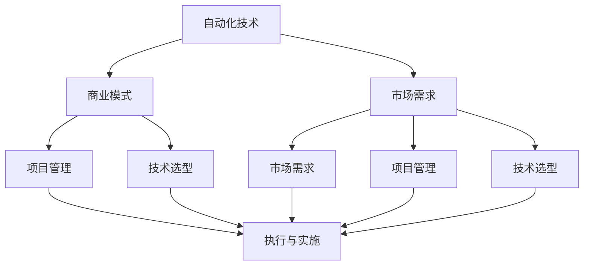

                 

# 自动化创业失败案例分析与经验总结

> 关键词：自动化创业,失败案例,技术问题,商业模式,项目管理,经验总结

## 1. 背景介绍

在当下高度竞争的商业环境中，创新和创业成为推动企业发展的重要动力。然而，并非所有的自动化创业都能成功。本文将分析几个自动化创业失败的案例，深入探讨其背后的原因，并通过系统的经验总结，为未来的创业者提供宝贵的借鉴。

### 1.1 问题由来
自动化创业，指的是利用自动化技术驱动的创新企业。这类企业通常专注于提升生产效率、优化运营流程、增强用户体验等方面，旨在通过技术革新带来商业模式的创新。然而，由于技术复杂、市场动态、资源限制等多方面因素的交织，自动化创业面临诸多挑战，成功案例少，失败案例多。本文将深入剖析其中的关键问题，为自动化创业者提供有价值的参考。

### 1.2 问题核心关键点
自动化创业失败的案例通常集中在以下关键点：
1. **技术选型不当**：未能充分评估技术成熟度、适用性，导致项目技术风险较高。
2. **市场需求与技术落地的错位**：技术产品未能精准对接市场需求，或用户接受度低。
3. **资金链断裂**：项目资金投入过大，但市场反馈不佳，导致资金链断裂。
4. **项目管理不善**：项目进度延迟、成本超支、团队协作问题频发。
5. **商业模式不清晰**：缺乏有效的盈利模式，无法形成可持续的收入来源。
6. **市场竞争激烈**：同行业竞争者众多，市场份额争夺激烈，难以突出自身优势。

本文将重点围绕以上几个核心问题，分析失败的自动化创业案例，并总结成功经验，供未来的创业者参考。

## 2. 核心概念与联系

### 2.1 核心概念概述

自动化创业的核心概念包括自动化技术、商业模式、市场需求、项目管理、技术选型等多个方面。这些概念之间相互关联，共同影响着创业项目的成败。

- **自动化技术**：利用自动化技术提高生产效率、优化运营流程、提升用户体验等。
- **商业模式**：基于技术创新，形成可持续的收入模式，如SaaS、订阅服务、数据分析服务等。
- **市场需求**：产品或服务是否满足市场和用户需求，直接影响项目的成功与否。
- **项目管理**：项目规划、资源配置、进度管理、风险控制等，确保项目按时、按预算完成。
- **技术选型**：选择合适的技术框架、工具和平台，以降低项目风险。

这些概念之间的逻辑关系可以通过以下Mermaid流程图来展示：



这个流程图展示了一个典型的自动化创业过程：技术是创业的基础，市场需求驱动技术落地，商业模型确保收入，项目管理保障执行，技术选型提升效率。这些因素共同作用，决定着项目的成败。

## 3. 核心算法原理 & 具体操作步骤

### 3.1 算法原理概述

自动化创业涉及的算法原理主要包括自动化流程优化、机器学习与数据挖掘、用户体验优化等多个方面。这里重点探讨以下几个关键算法：

1. **过程挖掘**：通过数据分析技术，自动发现和优化业务流程。
2. **预测分析**：利用机器学习算法，预测市场需求和用户行为，指导产品开发。
3. **优化算法**：如遗传算法、粒子群优化等，用于调整系统参数，提升性能。
4. **自然语言处理**：利用NLP技术，优化用户体验，如智能客服、推荐系统等。

### 3.2 算法步骤详解

自动化创业的算法实现通常包含以下几个关键步骤：

**Step 1: 需求调研与分析**
- 深入了解市场需求和用户痛点，制定项目规划和目标。
- 分析竞争对手和市场环境，评估自身优劣势。

**Step 2: 技术选型与架构设计**
- 选择合适的技术栈和工具，评估其适用性和成熟度。
- 设计系统的架构和技术方案，确保高效、可扩展。

**Step 3: 算法模型构建**
- 确定算法模型类型，选择合适的算法和数据集。
- 构建和训练模型，进行模型调优和评估。

**Step 4: 系统实现与集成**
- 开发软件系统和硬件设备，集成第三方服务。
- 进行系统测试和用户测试，收集反馈并进行优化。

**Step 5: 市场推广与运营**
- 制定市场推广策略，进行产品宣传和推广。
- 监控用户反馈和市场动态，及时调整产品和服务。

### 3.3 算法优缺点

自动化创业中的算法具有以下优点：
1. **高效性**：通过自动化技术，可以大幅提升生产效率和运营效率。
2. **可扩展性**：基于云计算和微服务架构，系统可快速扩展，满足市场需求。
3. **数据驱动**：通过数据分析和机器学习，可以精准定位市场需求，优化产品设计。

同时，也存在以下缺点：
1. **技术复杂性**：自动化技术往往涉及复杂算法和系统架构，开发和维护成本较高。
2. **市场风险**：算法模型和产品设计需精准对接市场需求，否则难以成功。
3. **资源消耗**：自动化系统通常需要大量计算资源，初期投入较大。
4. **用户体验不足**：算法模型的效果直接取决于数据质量，需持续优化。

### 3.4 算法应用领域

自动化创业的算法和思想广泛应用于多个领域，包括但不限于：

- **制造业自动化**：利用机器人和自动化设备，优化生产流程，提高生产效率。
- **物流与供应链管理**：通过智能仓储和运输管理系统，优化物流网络，降低成本。
- **金融科技**：利用大数据和机器学习，进行风险评估、信用评分、智能投顾等。
- **医疗健康**：通过数据分析和智能推荐系统，优化诊疗流程，提升医疗服务质量。
- **智能客服与推荐系统**：利用NLP和推荐算法，提升用户互动体验，提高转化率。

## 4. 数学模型和公式 & 详细讲解 & 举例说明

### 4.1 数学模型构建

自动化创业的数学模型主要涉及机器学习、数据分析、优化算法等领域。这里以一个简单的预测分析模型为例，介绍其构建过程。

设已知历史数据集 $D=\{(x_i,y_i)\}_{i=1}^N$，其中 $x_i$ 为输入特征，$y_i$ 为输出目标，任务为建立预测模型 $f(x) = y$。常见的数学模型包括线性回归、决策树、神经网络等。

**线性回归模型**：
$$
y_i = \beta_0 + \beta_1 x_{i1} + \cdots + \beta_p x_{ip} + \epsilon_i
$$
其中 $\beta_0, \beta_1, \ldots, \beta_p$ 为回归系数，$\epsilon_i$ 为随机误差项。

**模型训练与评估**：
- 通过最小化损失函数 $L(\theta) = \frac{1}{2N} \sum_{i=1}^N (y_i - f(x_i))^2$ 来拟合模型。
- 使用交叉验证和均方误差等指标评估模型性能。

### 4.2 公式推导过程

以线性回归模型为例，推导其最优参数估计公式：

1. **损失函数推导**：
$$
L(\theta) = \frac{1}{2N} \sum_{i=1}^N (y_i - \hat{y}_i)^2
$$
其中 $\hat{y}_i = \beta_0 + \beta_1 x_{i1} + \cdots + \beta_p x_{ip}$ 为预测值。

2. **梯度下降法**：
$$
\frac{\partial L}{\partial \beta_j} = \frac{1}{N} \sum_{i=1}^N (y_i - \hat{y}_i) x_{ij}
$$

3. **求解最优参数**：
$$
\beta_j = \frac{1}{N} \sum_{i=1}^N (y_i - \hat{y}_i) x_{ij}
$$

### 4.3 案例分析与讲解

以智能推荐系统为例，分析其数学模型和应用场景：

1. **模型构建**：
- 用户行为数据：点击、浏览、购买等。
- 物品特征数据：商品ID、价格、类别等。
- 预测目标：用户购买概率。
- 模型类型：协同过滤、基于内容的推荐、混合推荐等。

2. **模型训练与评估**：
- 使用交叉验证，评估模型的预测精度和计算效率。
- 调整模型参数和特征权重，提升推荐效果。

3. **实际应用**：
- 电商平台的商品推荐：根据用户历史行为，推荐相关商品。
- 视频平台的推荐系统：根据用户观看记录，推荐相似视频。
- 社交媒体的个性化推荐：根据用户兴趣，推荐相关内容。

## 5. 项目实践：代码实例和详细解释说明

### 5.1 开发环境搭建

在进行自动化创业项目实践前，需要准备好开发环境。以下是Python和机器学习项目常用的开发环境配置流程：

1. **安装Python**：从官网下载并安装最新版本的Python。
2. **安装PyTorch**：用于深度学习任务开发，可以从官网下载安装包或使用conda命令安装。
3. **安装NumPy、Pandas、Scikit-learn等第三方库**：用于数据处理和模型评估。
4. **安装TensorBoard**：用于可视化模型训练过程和结果。

### 5.2 源代码详细实现

以下是一个简单的线性回归模型代码实现，包括数据加载、模型训练、预测和评估等步骤：

```python
import pandas as pd
import numpy as np
from sklearn.linear_model import LinearRegression
from sklearn.model_selection import train_test_split
from sklearn.metrics import mean_squared_error

# 数据加载
data = pd.read_csv('data.csv')

# 数据预处理
X = data.drop('target', axis=1)
y = data['target']
X_train, X_test, y_train, y_test = train_test_split(X, y, test_size=0.2, random_state=42)

# 模型训练
model = LinearRegression()
model.fit(X_train, y_train)

# 模型评估
y_pred = model.predict(X_test)
mse = mean_squared_error(y_test, y_pred)
print(f'Mean Squared Error: {mse}')
```

### 5.3 代码解读与分析

**数据加载**：
- 使用pandas库加载CSV格式的数据文件，提取特征和目标变量。

**数据预处理**：
- 使用sklearn库进行特征和目标变量的分离，并进行数据分割，保留20%的数据用于测试。

**模型训练**：
- 使用scikit-learn库中的LinearRegression模型进行模型拟合。

**模型评估**：
- 使用均方误差（MSE）评估模型预测精度。

**代码优化**：
- 增加交叉验证、特征工程、模型调参等步骤，进一步提升模型性能。

## 6. 实际应用场景

### 6.1 智能推荐系统

智能推荐系统通过数据分析和机器学习，精准推荐用户感兴趣的商品、视频、内容等，提升用户满意度，提高转化率。常见的应用场景包括：

- **电商平台**：推荐用户可能感兴趣的商品，增加用户购买量。
- **视频平台**：根据用户观看记录，推荐相关视频，提高用户粘性。
- **社交媒体**：推荐用户感兴趣的内容，增加用户活跃度。

### 6.2 智能客服

智能客服通过NLP和机器学习技术，自动化处理用户咨询，提供快速、准确的解决方案。常见应用场景包括：

- **企业客服**：自动回复常见问题，减轻人工客服压力。
- **在线客服**：24/7不间断服务，提升用户满意度。
- **智能客服机器人**：使用多轮对话技术，理解用户意图，提供个性化回复。

### 6.3 智能生产

智能生产通过自动化技术优化生产流程，提高生产效率，降低成本。常见应用场景包括：

- **制造业**：自动化生产线，提高生产效率。
- **物流行业**：智能仓储和运输管理系统，优化物流网络。
- **农业**：自动化设备，提高农作物产量和质量。

### 6.4 未来应用展望

随着自动化技术的发展，未来将在更多领域得到应用，为各行各业带来变革性影响。以下是一些未来应用展望：

- **医疗健康**：利用自动化技术优化诊疗流程，提升医疗服务质量。
- **金融科技**：通过智能分析，降低金融风险，提升金融服务体验。
- **教育**：智能化教育平台，个性化推荐学习资源，提升教育质量。
- **能源**：智能电网，提高能源利用效率，降低环境污染。
- **智能家居**：自动化控制家电，提升生活品质。

## 7. 工具和资源推荐

### 7.1 学习资源推荐

自动化创业需要系统掌握多项技术，以下是一些推荐的优质学习资源：

1. **《Python深度学习》**：由深度学习专家Ian Goodfellow撰写，系统介绍深度学习的基本原理和应用。
2. **《机器学习实战》**：介绍机器学习算法的实现和应用，适合实战练习。
3. **Coursera和Udacity**：提供多个自动化和机器学习课程，涵盖基础知识和实战技能。
4. **Kaggle**：提供海量数据集和竞赛，锻炼数据处理和模型构建能力。
5. **GitHub**：搜索和学习自动化项目的代码实现和最佳实践。

### 7.2 开发工具推荐

自动化创业开发过程中常用的工具包括：

1. **Jupyter Notebook**：提供交互式编程环境，支持代码调试和文档编写。
2. **TensorBoard**：可视化模型训练和评估过程，便于调试和优化。
3. **PyCharm**：功能强大的IDE，支持Python开发和调试。
4. **AWS**：提供云资源，支持模型训练和部署。
5. **Git**：版本控制工具，便于团队协作和管理。

### 7.3 相关论文推荐

自动化创业涉及的算法和技术不断发展，以下是一些经典和前沿的论文推荐：

1. **深度学习理论基础**：《Deep Learning》，Ian Goodfellow等著。
2. **推荐系统算法**：《Top-k Ranking for Recommender Systems》，Ye Qiang等著。
3. **智能客服算法**：《Intelligent Customer Service Systems Based on Natural Language Processing》，Elena Korenko等著。
4. **自动化生产系统**：《Automated Manufacturing Systems》，Eduardo Antunes等著。

## 8. 总结：未来发展趋势与挑战

### 8.1 总结

自动化创业结合了技术创新和商业模式的变革，为各行各业带来了新的发展机遇。然而，成功的自动化创业需要系统的理论支持和实际经验的积累。本文通过分析失败案例，总结了技术选型、市场需求、项目管理等多个关键因素，为未来的创业者提供了宝贵的经验。

### 8.2 未来发展趋势

自动化创业的未来发展趋势主要包括以下几个方面：

1. **技术自动化**：随着技术自动化水平的提高，更多的商业流程将实现自动化，提升生产效率和运营效率。
2. **人工智能融合**：人工智能技术与自动化技术深度融合，带来更智能、更高效的解决方案。
3. **多模态融合**：结合视觉、语音、文本等多种模态数据，提升系统的综合能力。
4. **边缘计算**：边缘计算技术的普及，实现更快速、更灵活的自动化解决方案。
5. **数据驱动**：数据驱动的决策模式将成为自动化创业的重要方向，通过数据挖掘和分析优化决策过程。

### 8.3 面临的挑战

自动化创业在发展的过程中，仍然面临诸多挑战：

1. **技术复杂性**：自动化创业涉及多种技术，技术难度和开发成本较高。
2. **市场需求不确定**：市场环境复杂多变，需求预测和产品匹配难度较大。
3. **资源消耗大**：自动化系统需要大量计算资源和人力资源，初期投入较大。
4. **用户体验不足**：自动化系统的用户友好性需要不断优化，提高用户接受度。
5. **安全性与隐私保护**：自动化系统处理大量敏感数据，需加强安全性与隐私保护措施。

### 8.4 研究展望

未来的自动化创业需要在以下方面进行进一步的研究和探索：

1. **技术自动化**：进一步提升技术的自动化水平，减少人工干预，提升系统可靠性。
2. **多模态融合**：结合多种模态数据，提升系统的综合能力，实现更智能的自动化解决方案。
3. **数据驱动**：加强数据驱动的决策模式，通过大数据和机器学习优化决策过程。
4. **用户体验优化**：提升系统的用户友好性，增强用户体验，提高用户接受度。
5. **安全性与隐私保护**：加强安全性与隐私保护措施，确保数据和系统的安全。

## 9. 附录：常见问题与解答

**Q1：如何选择合适的技术栈和工具？**

A: 选择合适的技术栈和工具需要综合考虑技术成熟度、适用性、开发成本、维护难度等因素。可以参考同行业成功项目的技术栈，同时进行技术选型对比和评估。

**Q2：如何处理数据质量和数据量不足的问题？**

A: 数据质量和数据量不足是自动化创业中的常见问题。可以通过数据增强、数据清洗、特征工程等手段提升数据质量。同时，利用更高效的数据处理和分析方法，最大化利用可用数据。

**Q3：如何优化模型性能？**

A: 模型性能优化需要多方面考虑，包括特征选择、模型调参、算法优化等。可以使用交叉验证、网格搜索等技术进行模型调优，同时采用更好的算法和模型结构提升性能。

**Q4：如何管理项目进度和成本？**

A: 项目管理需要明确项目目标、时间表和资源配置。可以采用敏捷开发、项目管理工具如JIRA等，进行实时监控和调整。同时，制定详细的预算计划，及时跟踪和控制成本。

**Q5：如何评估项目成功与否？**

A: 项目成功评估需要综合考虑技术实现、市场反馈、用户满意度等多个方面。可以通过KPI、用户反馈、市场份额等指标进行评估，及时调整项目方向。

---

作者：禅与计算机程序设计艺术 / Zen and the Art of Computer Programming

