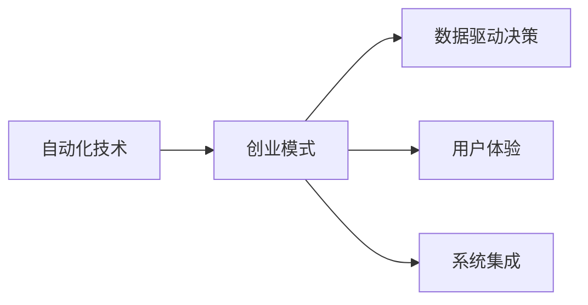

                 

# 自动化创业：未来商业的新范式

在过去的几年里，全球各地都见证了自动化技术对各行各业的革命性影响。从制造业的机器人到金融业的算法交易，再到零售业的智能推荐系统，自动化技术在提升效率、降低成本、增强客户体验方面展现了强大的潜力。然而，真正的革命在于如何将自动化技术结合到创业模式中，从而开辟一种全新的商业模式。本文将从自动化创业的原理、操作方法、实际应用场景以及未来趋势等方面进行详细探讨。

## 1. 背景介绍

### 1.1 自动化技术的崛起

随着人工智能、机器学习和大数据技术的发展，自动化技术正逐渐从简单的重复性任务向更加复杂和多样化的任务演进。这些技术不仅在提高生产效率方面发挥了巨大作用，还为创业者提供了一种全新的商业机会。自动化技术可以帮助企业快速响应市场变化，降低成本，并为客户提供更加个性化和高效的服务。

### 1.2 自动化创业的优势

自动化创业相比传统创业模式具有以下优势：

1. **降低成本**：自动化技术可以显著降低企业的运营成本，特别是在人力成本、物流成本等方面。
2. **提高效率**：自动化流程能够快速处理大量数据和任务，极大地提升工作效率。
3. **个性化服务**：通过自动化技术，企业可以提供更加精准和个性化的客户服务。
4. **实时决策**：自动化系统能够实时分析数据，为企业提供准确的决策支持。
5. **快速迭代**：自动化系统可以快速迭代和优化，迅速适应市场变化。

## 2. 核心概念与联系

### 2.1 核心概念概述

自动化创业主要涉及以下几个关键概念：

- **自动化技术**：包括机器学习、自然语言处理、计算机视觉、机器人等技术。
- **创业模式**：指企业通过技术创新和商业模式的创新，实现快速发展和扩张。
- **数据驱动决策**：通过收集和分析大量数据，帮助企业做出科学的商业决策。
- **用户体验**：自动化系统在提升客户体验方面的作用，如智能客服、个性化推荐等。
- **系统集成**：将自动化技术应用于企业的各个环节，实现系统间的无缝集成。

这些概念之间的关系可以用以下Mermaid流程图表示：



### 2.2 核心概念原理和架构

自动化创业的核心原理在于利用先进的技术手段，自动化地执行企业经营管理的各个环节，从而实现效率的提升和成本的降低。其架构通常包括以下几个部分：

1. **数据采集与处理**：通过传感器、API接口等方式，从企业内部和外部收集数据，并进行清洗和预处理。
2. **自动化决策引擎**：利用机器学习算法，对收集到的数据进行分析，自动做出决策。
3. **执行与监控**：将决策结果转化为具体的执行步骤，并实时监控执行情况，确保任务顺利完成。
4. **用户界面**：提供直观的用户界面，让用户能够轻松地操作和使用自动化系统。

## 3. 核心算法原理 & 具体操作步骤

### 3.1 算法原理概述

自动化创业的算法原理主要涉及机器学习、自然语言处理和计算机视觉等领域的核心技术。这些技术能够帮助企业自动化地处理和分析数据，从而做出更加科学的决策。以下是几个核心算法的概述：

1. **监督学习**：利用标注数据训练机器学习模型，使其能够自动识别和分类新的数据。
2. **无监督学习**：利用未标注数据进行训练，发现数据的内在结构，如聚类、降维等。
3. **强化学习**：通过奖励和惩罚机制，训练模型在不同环境下的决策策略。
4. **自然语言处理**：利用自然语言处理技术，自动理解和生成自然语言文本，如文本分类、情感分析、机器翻译等。

### 3.2 算法步骤详解

自动化创业的算法步骤大致可以分为以下几个环节：

1. **数据收集与预处理**：通过传感器、API接口等方式，收集企业的运营数据，并进行清洗和预处理，确保数据的质量和完整性。
2. **模型训练与优化**：选择适合的机器学习算法，利用标注数据进行训练，并根据性能进行优化。
3. **部署与监控**：将训练好的模型部署到生产环境中，并实时监控模型的性能和效果。
4. **用户反馈与迭代**：收集用户的使用反馈，对模型进行迭代优化，不断提升系统的性能和用户体验。

### 3.3 算法优缺点

自动化创业的算法具有以下优点：

1. **高效性**：自动化技术能够快速处理和分析大量数据，提高企业决策的速度和效率。
2. **精准性**：利用先进的机器学习算法，自动化系统能够做出更加精准和科学的决策。
3. **可扩展性**：自动化系统可以轻松扩展到不同的业务场景和行业，具有广泛的应用前景。

然而，也存在一些缺点：

1. **数据依赖**：自动化系统的性能高度依赖于数据的质量和量，数据的偏差可能导致错误的决策。
2. **技术复杂性**：自动化技术需要较高的技术门槛，对企业的技术能力和资金投入提出了较高的要求。
3. **安全风险**：自动化系统可能存在安全漏洞，如数据泄露、系统故障等。

### 3.4 算法应用领域

自动化创业的算法可以应用于多个领域，如：

1. **金融科技**：利用机器学习算法进行风险评估、反欺诈检测、智能投顾等。
2. **制造业**：利用机器人自动化生产线，提高生产效率和产品质量。
3. **零售业**：通过智能推荐系统，提升用户体验和销售额。
4. **医疗健康**：利用自然语言处理技术，自动化分析和诊断患者信息，提供精准的医疗服务。
5. **物流与供应链**：利用优化算法和机器学习，提升物流效率和供应链管理。

## 4. 数学模型和公式 & 详细讲解 & 举例说明

### 4.1 数学模型构建

自动化创业的数学模型通常涉及以下几个方面：

1. **线性回归模型**：用于预测连续变量的值，如销售预测、成本控制等。
2. **决策树模型**：用于分类和预测离散变量，如客户分类、产品推荐等。
3. **神经网络模型**：用于处理非线性关系和复杂数据结构，如图像识别、语音识别等。

### 4.2 公式推导过程

以线性回归模型为例，其公式推导过程如下：

假设有一个线性回归模型 $y = \theta_0 + \theta_1 x_1 + \theta_2 x_2 + \cdots + \theta_n x_n$，其中 $y$ 为预测值，$x_i$ 为输入特征，$\theta_i$ 为模型参数。根据最小二乘法，模型的参数可以通过以下公式求解：

$$
\theta = (X^TX)^{-1}X^Ty
$$

其中 $X$ 为特征矩阵，$y$ 为样本标签。

### 4.3 案例分析与讲解

假设有一个零售商，希望通过预测销售额来优化库存管理。他们收集了过去一年的销售数据，包括销售日期、商品类别、促销活动等信息，利用线性回归模型进行销售预测。具体步骤如下：

1. 收集数据，构建特征矩阵 $X$ 和标签矩阵 $y$。
2. 利用最小二乘法求解模型参数 $\theta$。
3. 将新数据代入模型进行预测，计算实际销售与预测销售的差异，优化模型参数。

通过这个过程，零售商可以实时调整库存，避免过剩或缺货的情况，提高资金周转率和客户满意度。

## 5. 项目实践：代码实例和详细解释说明

### 5.1 开发环境搭建

自动化创业的开发环境搭建通常需要以下步骤：

1. **选择编程语言**：如Python、R等，这些语言拥有丰富的机器学习和数据处理库。
2. **安装依赖库**：如NumPy、Pandas、Scikit-learn等。
3. **配置开发环境**：如设置虚拟环境、安装IDE等。

### 5.2 源代码详细实现

以线性回归模型为例，以下是使用Python和Scikit-learn库实现线性回归模型的代码：

```python
from sklearn.linear_model import LinearRegression
from sklearn.datasets import make_regression

# 生成数据
X, y = make_regression(n_samples=1000, n_features=5, noise=10, random_state=0)

# 训练模型
model = LinearRegression()
model.fit(X, y)

# 预测新数据
new_X = [[1, 2, 3, 4, 5]]
predicted_y = model.predict(new_X)

print(predicted_y)
```

### 5.3 代码解读与分析

1. 导入必要的库和数据集。
2. 使用make_regression生成随机数据集。
3. 创建线性回归模型，并使用fit方法进行训练。
4. 使用predict方法对新数据进行预测。

### 5.4 运行结果展示

运行上述代码，可以得到预测的销售值。如果模型训练充分，预测值应该接近真实值。

## 6. 实际应用场景

### 6.1 金融科技

自动化创业在金融科技领域具有广泛应用，例如：

- **智能投顾**：利用机器学习算法分析市场数据，自动生成投资建议，帮助客户做出最优投资决策。
- **反欺诈检测**：利用自然语言处理和机器学习技术，自动识别和防范金融欺诈行为。
- **信用评估**：通过分析用户的历史行为和信用记录，自动评估用户信用等级，优化贷款审批流程。

### 6.2 制造业

在制造业中，自动化创业可以应用于以下几个方面：

- **智能生产线**：利用机器人自动化生产线，提高生产效率和产品质量。
- **设备维护**：通过数据分析，预测设备故障，提前进行维护，避免停机损失。
- **供应链优化**：利用优化算法，优化库存管理和物流配送，降低成本和提高效率。

### 6.3 零售业

自动化创业在零售业的应用包括：

- **智能推荐系统**：通过分析用户行为和偏好，自动推荐商品，提高销售转化率。
- **库存管理**：利用预测模型，优化库存水平，避免过剩或缺货。
- **客户服务**：利用智能客服系统，提高客户满意度和响应速度。

### 6.4 医疗健康

自动化创业在医疗健康领域的应用包括：

- **病历分析**：利用自然语言处理技术，自动分析和诊断患者病历，提供精准的医疗服务。
- **药物研发**：通过数据分析，发现潜在的新药候选，加速药物研发进程。
- **健康监测**：利用传感器和智能设备，实时监测患者的健康数据，提供个性化的健康管理建议。

## 7. 工具和资源推荐

### 7.1 学习资源推荐

为了帮助开发者系统掌握自动化创业的理论基础和实践技巧，这里推荐一些优质的学习资源：

1. **Coursera《机器学习》课程**：由斯坦福大学Andrew Ng教授讲授，涵盖机器学习的基础理论和应用实践。
2. **DeepLearning.AI《深度学习专项课程》**：由黄仁勋、吴恩达等大咖联合讲授，深入浅出地介绍深度学习技术的原理和应用。
3. **《动手学深度学习》书籍**：由李沐、陈奎等大牛编写，通过丰富的代码示例，帮助读者快速上手深度学习技术。
4. **《Python机器学习》书籍**：由Sebastian Raschka和Vahid Mirjalili撰写，涵盖Python机器学习的应用实践和代码实现。
5. **Kaggle竞赛平台**：提供大量的数据集和竞赛任务，帮助开发者提升数据处理和机器学习技能。

### 7.2 开发工具推荐

自动化创业的开发工具通常包括：

1. **Jupyter Notebook**：免费的交互式编程环境，支持Python、R等语言的代码编写和执行。
2. **PyCharm**：专业的Python开发工具，提供代码高亮、自动补全等功能，提升开发效率。
3. **RStudio**：专业的R语言开发工具，支持数据分析和可视化，适用于数据驱动的自动化创业项目。
4. **TensorFlow**：由Google开发的深度学习框架，支持GPU加速，适用于大规模机器学习项目。
5. **PyTorch**：由Facebook开发的深度学习框架，支持动态图和GPU加速，适用于复杂模型的开发。

### 7.3 相关论文推荐

自动化创业的研究主要涉及以下几个领域：

1. **机器学习**：包括监督学习、无监督学习、强化学习等算法的研究，如《A Survey on Machine Learning Algorithms》。
2. **自然语言处理**：包括文本分类、情感分析、机器翻译等技术的研究，如《Transformers: State-of-the-Art Natural Language Processing》。
3. **计算机视觉**：包括图像识别、目标检测等技术的研究，如《Deep Residual Learning for Image Recognition》。

## 8. 总结：未来发展趋势与挑战

### 8.1 研究成果总结

自动化创业作为一种新兴的商业模式，已经在多个领域展现出了巨大的潜力。通过结合自动化技术和商业创新，企业能够实现更高效、更精准的运营管理，提升客户体验和市场竞争力。

### 8.2 未来发展趋势

未来的自动化创业将呈现以下几个发展趋势：

1. **跨领域融合**：自动化技术将与其他技术如物联网、区块链等结合，拓展应用场景。
2. **人工智能与人类协作**：自动化系统将与人类共同协作，提升工作效率和决策质量。
3. **自动化决策**：自动化系统将能够处理更复杂的决策问题，如财务分析、市场预测等。
4. **个性化服务**：通过自动化技术，提供更加精准和个性化的服务，提升用户体验。
5. **实时数据处理**：利用大数据和云计算技术，实现实时数据处理和分析，快速响应市场变化。

### 8.3 面临的挑战

自动化创业在发展过程中也面临着一些挑战：

1. **数据隐私和安全**：自动化系统需要处理大量敏感数据，如何保护数据隐私和安全是一个重要问题。
2. **技术复杂性**：自动化创业需要较高的技术门槛，对企业的技术能力和资金投入提出了较高的要求。
3. **系统兼容性**：自动化系统需要与现有的业务系统和第三方服务进行兼容，确保系统的稳定性和可靠性。
4. **用户体验**：自动化系统需要提供良好的用户体验，避免因为操作复杂而影响用户的使用。
5. **法规合规**：自动化创业需要遵守相关法律法规，如数据保护、隐私法规等。

### 8.4 研究展望

未来的自动化创业研究需要在以下几个方面进行深入探索：

1. **自动化与人类协作**：研究如何更好地将自动化技术与人类协作结合，提升工作效率和决策质量。
2. **跨领域应用**：研究自动化技术在跨领域场景中的应用，如医疗、金融、制造等。
3. **安全性与隐私保护**：研究如何提升自动化系统的安全性和隐私保护能力，确保数据安全和用户隐私。
4. **可解释性与透明性**：研究如何提高自动化系统的可解释性和透明性，增强用户对系统的信任。
5. **技术生态建设**：推动自动化技术的标准化和生态建设，促进技术的快速发展和应用推广。

## 9. 附录：常见问题与解答

### 9.1 Q1: 自动化创业是否适合所有企业？

A: 自动化创业并非适合所有企业。它主要适用于那些拥有大量数据、需要处理复杂任务、且具备一定技术能力的行业。中小企业在没有足够的技术支持和数据基础时，可能难以大规模实施自动化创业。

### 9.2 Q2: 自动化创业与传统创业的区别在哪里？

A: 自动化创业与传统创业的主要区别在于自动化技术的运用。自动化创业通过自动化技术提升效率、降低成本、提高客户体验，而传统创业主要依赖人力和资金。

### 9.3 Q3: 自动化创业是否需要高昂的初始投资？

A: 自动化创业确实需要一定的初始投资，包括技术开发、设备采购、系统部署等。但长远来看，自动化创业可以显著降低运营成本，提升业务效率，具有较高的投资回报率。

### 9.4 Q4: 自动化创业如何保护数据隐私和安全？

A: 自动化创业在处理敏感数据时，需要采用数据脱敏、加密、访问控制等措施，确保数据隐私和安全。同时，企业应定期进行安全审计，及时修复安全漏洞。

### 9.5 Q5: 自动化创业如何提升用户体验？

A: 自动化创业可以通过智能推荐、个性化服务、实时反馈等方式提升用户体验。例如，智能推荐系统可以为用户提供个性化推荐，提高用户满意度。

---

作者：禅与计算机程序设计艺术 / Zen and the Art of Computer Programming

