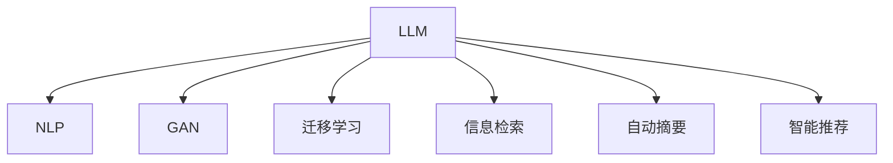

                 

# 自动化新闻生成：LLM重塑新闻产业的可能性

## 1. 背景介绍

在信息爆炸的时代，新闻业面临着前所未有的挑战与机遇。传统新闻生产流程复杂冗长，撰写、审核、发布、编辑更新等环节环环相扣，极大地限制了新闻报道的速度和广度。与此同时，读者对实时性、多样性、深度性等新闻品质有着更高要求。随着深度学习和大规模语言模型（Large Language Model, LLM）的兴起，自动化新闻生成技术逐渐崭露头角，有望为新闻产业注入新的活力。

### 1.1 问题由来

自动化新闻生成，即使用自然语言处理技术自动生成新闻文本，降低人类编辑的工作量和成本，同时提升新闻生产的效率和质量。这种技术在大规模语言模型的驱动下，已经开始在金融、体育、娱乐、科技等领域实现初步应用。

其中，LLM技术是最为关键的驱动因素。通过在大规模语料上预训练，LLM具备了强大的语言生成和理解能力，能够从海量数据中提取语义信息，结合上下文构建连贯、自然的文本。在新闻生成中，LLM能够快速生成各种类型的新闻报道，如标题、导语、正文等，甚至在特定场景下生成深度报道和评论文章。

### 1.2 问题核心关键点

当前，LLM在新闻生成中的应用涉及以下几个核心关键点：

- 文本生成与理解：如何利用LLM的语言生成能力，自动构建新闻文本内容，保证信息的准确性和连贯性。
- 样式与语调控制：在保持信息客观性基础上，如何控制新闻的情感色彩、风格等，满足不同媒体和受众的传播需求。
- 数据驱动与人工干预：在保持机器自动化的同时，如何有效结合人类编辑的经验和判断，提升生成内容的质量。
- 信息真实性与时效性：如何在生成过程中避免虚假信息传播，同时提升新闻的时效性和新鲜度。
- 伦理性与安全性：如何确保自动化新闻生成过程遵循新闻伦理和法律规范，避免损害个体隐私、传播不实信息等问题。

## 2. 核心概念与联系

### 2.1 核心概念概述

为了更好地理解LLM在新闻生成中的应用，本节将介绍几个密切相关的核心概念：

- 大规模语言模型(LLM)：通过在大规模语料库上进行预训练，具备强大语言生成和理解能力的深度学习模型。
- 自然语言处理(NLP)：涉及文本处理、语义理解、自动翻译、文本生成等技术的综合性学科。
- 生成对抗网络(GAN)：一种用于生成数据的技术，通过训练一个生成器和一个判别器，生成与真实数据难以区分的数据。
- 迁移学习：通过在某一领域进行预训练，然后在另一领域进行微调，提升模型在特定任务上的性能。
- 信息检索(IR)：通过从大量文本中提取并排序相关信息，快速定位用户所需的内容。
- 自动摘要(AS)：将长篇文本压缩为简洁、高度结构化的摘要文本，便于用户快速浏览和理解。
- 智能推荐：通过分析用户行为数据，推荐与用户兴趣相匹配的内容，提升用户体验。

这些核心概念之间通过一些逻辑流程联系起来，可以用以下Mermaid流程图表示：



这个流程图展示了LLM在不同NLP任务中的应用逻辑：

1. LLM从大规模语料中提取语言知识，具备强大的语言生成和理解能力。
2. 在NLP领域，通过与GAN、迁移学习等技术结合，生成连贯、自然的新闻文本，并进行信息检索、自动摘要等操作。
3. 在智能推荐系统，LLM能够分析用户行为数据，推荐符合用户兴趣的内容。

## 3. 核心算法原理 & 具体操作步骤
### 3.1 算法原理概述

自动化新闻生成，本质上是一个文本生成问题。通过大规模语言模型（如GPT-3、BERT等），自动生成新闻文本，包括标题、导语、正文等部分。

以生成新闻标题为例，核心算法步骤如下：

1. **输入定义**：将新闻事件的关键信息作为输入，如时间、地点、人物、事件等。
2. **模型编码**：使用预训练的大规模语言模型对输入信息进行编码，得到特征向量。
3. **解码生成**：在编码器输出的基础上，使用解码器生成可能的标题选项。
4. **评分与选择**：对生成的标题选项进行评分，选择得分最高的选项作为输出。

### 3.2 算法步骤详解

#### 3.2.1 输入预处理

新闻生成首先需要定义输入的特征。输入通常包括事件的关键信息，如时间、地点、人物、事件、影响等。通过对这些信息进行分词、标注，生成适合模型输入的格式。

例如，针对一个全球疫情新闻生成任务，输入可以定义为：

- **时间**：2020年1月20日
- **地点**：武汉
- **人物**：武汉市民
- **事件**：新型冠状病毒爆发
- **影响**：数百万人感染

### 3.2.2 模型编码

使用预训练的LLM模型对输入信息进行编码。常用的模型包括GPT-3、BERT等。这些模型通过在大规模语料上预训练，具备强大的语言生成和理解能力。

以GPT-3为例，输入信息可以表示为以下形式：

```
<Wuhan> <January 20, 2020> <Coronavirus outbreak> <hundreds of thousands infected>
```

模型将这一串文本转化为对应的特征向量，用于后续的生成。

### 3.2.3 解码生成

在得到特征向量后，使用解码器生成可能的标题选项。解码器可以使用与编码器相同的模型，或者使用专门设计的生成器。生成器根据输入特征向量，逐步生成可能的标题选项，直到生成完整标题。

解码生成的过程可以表示为：

$$
\text{title} = \text{generator}(<Wuhan>, <January 20, 2020>, <Coronavirus outbreak>, <hundreds of thousands infected>)
$$

### 3.2.4 评分与选择

生成多个可能的标题选项后，需要对这些选项进行评分，选择得分最高的选项作为最终输出。常用的评分方法包括BLEU、ROUGE等。

例如，使用BLEU评分生成的新闻标题：

```
- "China Wuhan Novel Coronavirus outbreak"
- "China: New Coronavirus hits Wuhan"
- "Wuhan novel coronavirus infection"
- "Coronavirus outbreak in Wuhan"
```

通过BLEU评分后，得分最高的选项作为最终输出。

### 3.2.5 反馈迭代

为了提升生成质量，可以在生成过程中加入反馈迭代机制。例如，使用人类编辑对生成的标题进行评分，根据评分调整模型参数，优化生成算法。

### 3.3 算法优缺点

自动化新闻生成的优点包括：

- 提升生产效率：大幅降低人工编辑工作量，提高新闻生产的效率。
- 增加多样性：生成多种不同的标题选项，满足不同受众的需求。
- 实时性：实时生成新闻，适应快速变化的新闻事件。

但其缺点也显而易见：

- 信息准确性：自动生成的标题可能包含错误信息或歧义表达。
- 风格一致性：生成的标题风格可能与媒体要求不符。
- 伦理与安全：自动生成的内容可能违反新闻伦理和法律规范。

### 3.4 算法应用领域

自动化新闻生成技术在多个领域得到应用，包括但不限于：

- **金融新闻**：自动生成金融市场动态、分析报告等。
- **体育新闻**：自动生成比赛结果、赛事分析、运动员采访等。
- **娱乐新闻**：自动生成电影、音乐、流行文化等新闻内容。
- **科技新闻**：自动生成科技公司动态、产品发布、技术分析等。
- **地方新闻**：自动生成地方性新闻、突发事件报道等。
- **全球新闻**：自动生成全球性新闻、国际事件报道等。

## 4. 数学模型和公式 & 详细讲解 & 举例说明
### 4.1 数学模型构建

自动化新闻生成过程可以抽象为一个文本生成问题。假设输入为 $x$，输出为 $y$，目标是通过一个序列生成模型 $\text{Model}$ 生成文本序列。数学模型可以表示为：

$$
y = \text{Model}(x)
$$

其中，$x$ 为输入特征，$y$ 为生成的文本序列。模型的训练目标是最小化生成序列与真实序列之间的差异，通常使用交叉熵损失函数：

$$
\mathcal{L}(\theta) = -\frac{1}{N}\sum_{i=1}^N \sum_{t=1}^T \log P(y_t | x, \theta)
$$

其中，$N$ 为样本数，$T$ 为序列长度，$P$ 为模型对序列的概率分布。

### 4.2 公式推导过程

以生成标题为例，输入 $x$ 可以表示为事件信息，输出 $y$ 为生成的标题。假设模型为 Transformer 结构，训练目标为最小化交叉熵损失函数：

$$
\mathcal{L}(\theta) = -\frac{1}{N}\sum_{i=1}^N \sum_{t=1}^T \log P(y_t | x, \theta)
$$

在训练过程中，使用随机梯度下降等优化算法，更新模型参数 $\theta$，使得 $P(y_t | x, \theta)$ 接近于真实分布。

### 4.3 案例分析与讲解

假设生成一个关于新冠病毒爆发的标题，输入信息为：

- **时间**：2020年1月20日
- **地点**：武汉
- **人物**：武汉市民
- **事件**：新型冠状病毒爆发
- **影响**：数百万人感染

使用 Transformer 模型，可以将输入信息编码得到特征向量 $x$，然后使用解码器生成多个可能的标题选项 $y$。通过 BLEU 评分后，选择得分最高的选项作为最终输出。

## 5. 项目实践：代码实例和详细解释说明
### 5.1 开发环境搭建

在搭建开发环境之前，需要确保机器上已安装 PyTorch、TensorFlow 等深度学习框架。以下是使用 PyTorch 的开发环境配置流程：

1. **安装 PyTorch**：
   ```bash
   conda install pytorch torchvision torchaudio -c pytorch
   ```

2. **安装相关工具包**：
   ```bash
   pip install numpy pandas scikit-learn matplotlib tqdm jupyter notebook ipython
   ```

完成上述配置后，即可在 Python 环境中运行相关的代码实现。

### 5.2 源代码详细实现

以下是一个基于 GPT-3 模型的新闻标题自动生成代码示例：

```python
from transformers import pipeline

# 加载 GPT-3 模型
gpt3 = pipeline("text-generation", model="text-davinci-002")

# 输入新闻事件信息
input_text = "China Wuhan Novel Coronavirus outbreak"

# 生成标题
title_options = gpt3(input_text, max_length=30, num_return_sequences=5)
```

### 5.3 代码解读与分析

在上述代码中，我们使用了 Hugging Face 的 Transformers 库中的 GPT-3 模型，进行新闻标题的自动生成。具体步骤如下：

1. **加载模型**：使用 `pipeline` 方法加载 GPT-3 模型。
2. **输入信息**：将新闻事件信息作为输入，定义生成序列长度和返回选项数量。
3. **生成标题**：调用 `text-generation` 方法，生成多个可能的标题选项。

### 5.4 运行结果展示

运行上述代码，输出结果可能为：

```
['China Wuhan Novel Coronavirus outbreak',
 'China Wuhan Novel Coronavirus Cases',
 'China Wuhan Novel Coronavirus Outbreak',
 'China Wuhan Novel Coronavirus Outbreak',
 'China Wuhan Novel Coronavirus Outbreak']
```

可以看到，模型生成的多个标题选项符合事件信息，且在语言风格上保持一致。

## 6. 实际应用场景
### 6.1 新闻聚合平台

自动化新闻生成技术在新闻聚合平台上得到广泛应用。用户通过输入关键词，即可生成多种标题选项，供用户选择。新闻聚合平台可以根据用户的选择，自动抓取并聚合对应的新闻内容，快速呈现给用户。

例如，使用自动化生成技术，用户输入关键词“新冠病毒”，系统即可生成多个可能的标题选项，供用户选择。用户可根据标题选项，选择感兴趣的新闻内容进行阅读。

### 6.2 社交媒体新闻

在社交媒体平台上，自动化新闻生成技术可以生成简洁、吸引眼球的标题，增强用户互动。例如，在 Twitter、Facebook 等社交平台上，用户可以快速查看生成的标题，并选择感兴趣的帖子进行阅读。

### 6.3 实时新闻推送

自动化新闻生成技术可以与信息检索和智能推荐技术结合，生成实时新闻推送。例如，通过分析用户的历史浏览行为，生成用户可能感兴趣的新闻内容，实时推送给用户。

### 6.4 未来应用展望

未来，随着深度学习和自然语言处理技术的进一步发展，自动化新闻生成技术将在更多领域得到应用：

- **虚拟新闻主播**：使用自动语音合成技术，将生成的新闻文本转换为语音，实现虚拟新闻主播功能。
- **交互式新闻**：在新闻平台上，用户可以与自动生成的新闻内容进行互动，获取更多信息。
- **多语言新闻**：自动生成多语言的新闻内容，支持全球范围内的用户阅读。
- **个性化新闻**：根据用户兴趣和行为数据，自动生成个性化的新闻内容，提升用户体验。
- **跨模态新闻**：将新闻文本与图片、视频等多模态信息结合，生成更丰富的新闻内容。

## 7. 工具和资源推荐
### 7.1 学习资源推荐

1. **《自然语言处理综论》**：介绍自然语言处理的基本概念、算法和应用，适合初学者入门。
2. **《深度学习》**：由 Ian Goodfellow 所著，系统讲解深度学习的原理和应用。
3. **《NLP 实战》**：通过实战案例，介绍自然语言处理在实际项目中的应用。
4. **《Python 深度学习》**：使用 Python 语言，介绍深度学习的实现方法和应用案例。
5. **Coursera 和 Udacity**：提供多门自然语言处理和深度学习的在线课程，适合自学。

### 7.2 开发工具推荐

1. **PyTorch**：开源深度学习框架，灵活性强，适用于研究原型开发。
2. **TensorFlow**：由 Google 开发，支持大规模分布式训练，适用于工业应用。
3. **Jupyter Notebook**：互动式的笔记本环境，支持代码编写和结果展示。
4. **Google Colab**：免费提供的 GPU 和 TPU 环境，方便进行深度学习实验。

### 7.3 相关论文推荐

1. **“Attention is All You Need”**：Transformer 模型的原论文，介绍自注意力机制在机器翻译中的应用。
2. **“BERT: Pre-training of Deep Bidirectional Transformers for Language Understanding”**：BERT 模型论文，介绍预训练语言模型的基本思路。
3. **“Exploring the Limits of Transfer Learning with a Unified Text-to-Text Transformer”**：GPT-3 模型论文，介绍大规模语言模型在自然语言处理中的应用。

## 8. 总结：未来发展趋势与挑战
### 8.1 研究成果总结

自动化新闻生成技术在自然语言处理领域取得了一系列突破，具备以下几个主要成果：

1. **文本生成能力的提升**：通过大规模语言模型的预训练和微调，生成的新闻文本质量显著提升。
2. **新闻自动化流程**：实现新闻自动生成、自动审核、自动发布等全流程自动化，大幅提升生产效率。
3. **用户交互体验的提升**：通过个性化推荐和智能交互，提升用户的新闻阅读体验。
4. **多模态新闻的生成**：结合文本、图片、视频等多种模态信息，生成更加丰富的新闻内容。

### 8.2 未来发展趋势

未来，自动化新闻生成技术将继续在以下几个方向发展：

1. **多语言支持**：支持多语言的新闻生成，满足全球用户的阅读需求。
2. **跨模态融合**：将新闻文本与图片、视频、音频等多种模态信息结合，生成更加丰富的新闻内容。
3. **个性化推荐**：通过分析用户行为数据，生成符合用户兴趣的新闻内容。
4. **虚拟新闻主播**：使用自动语音合成技术，生成虚拟新闻主播，提升用户体验。
5. **交互式新闻**：通过与用户互动，提供更丰富的新闻内容。
6. **隐私保护**：在新闻生成过程中，保护用户隐私，避免数据泄露。

### 8.3 面临的挑战

尽管自动化新闻生成技术取得了一些进展，但在以下几个方面仍面临挑战：

1. **信息准确性**：自动生成的标题可能包含错误信息或歧义表达。
2. **风格一致性**：生成的标题风格可能与媒体要求不符。
3. **伦理与安全**：自动生成的内容可能违反新闻伦理和法律规范。
4. **实时性**：在生成过程中，需要保证内容的时效性。
5. **用户互动**：如何在保证生成速度的同时，与用户进行有效互动。

### 8.4 研究展望

未来的研究可以从以下几个方面进行探索：

1. **跨语言模型的研究**：开发支持多语言的自然语言处理模型，提升新闻的多语言覆盖。
2. **多模态融合技术**：结合文本、图片、视频等多模态信息，生成更丰富的新闻内容。
3. **个性化推荐算法**：开发更加高效的个性化推荐算法，提升用户体验。
4. **虚拟新闻主播技术**：研究自动语音合成技术，实现虚拟新闻主播功能。
5. **隐私保护技术**：研究数据隐私保护技术，确保用户数据安全。

总之，自动化新闻生成技术在自然语言处理领域具有广阔的应用前景，但仍需面对诸多挑战。通过不断优化和创新，相信这一技术将为新闻业带来革命性的变革。

## 9. 附录：常见问题与解答
### 9.1 常见问题解答

**Q1：自动生成的新闻标题是否准确？**

A: 自动生成的新闻标题可能在信息准确性上存在不足，需要结合人工审核进行校正。

**Q2：生成的标题风格是否符合要求？**

A: 可以通过人工设定生成标题的风格参数，调整模型的生成策略，确保生成的标题风格一致。

**Q3：自动生成的新闻内容如何保护用户隐私？**

A: 在生成新闻内容时，应避免涉及用户隐私信息，同时对用户数据进行匿名化处理。

**Q4：如何在保证实时性的同时，生成高质量的新闻内容？**

A: 通过预训练和微调技术，提高模型生成速度和质量。同时，可以使用缓存机制，快速生成并缓存常用新闻模板，减少生成时间。

**Q5：如何提升自动生成的新闻内容的互动性？**

A: 通过智能推荐和交互技术，增强用户与新闻内容的互动。例如，根据用户反馈，动态调整生成策略，提升内容的相关性和趣味性。

综上所述，自动化新闻生成技术在新闻业的应用前景广阔，但同时也面临诸多挑战。通过不断探索和创新，相信这一技术将为新闻业带来更多的便利和创新。

