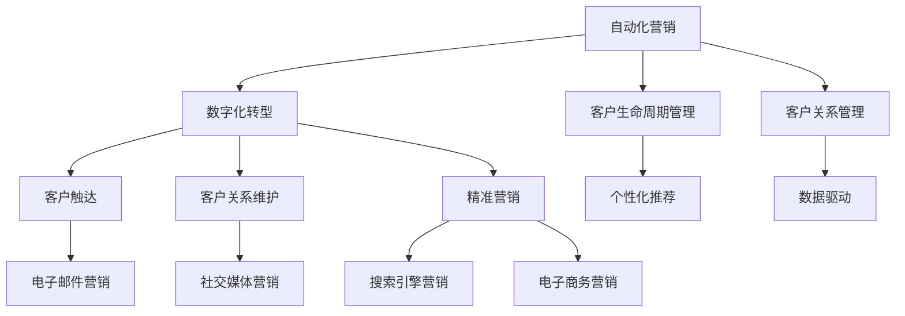

                 

# 自动化营销：提升创业效率的关键

> 关键词：自动化营销,创业效率,数字化转型,客户生命周期管理,客户关系管理,自动化工具,人工智能,机器学习,大数据,CRM系统

## 1. 背景介绍

### 1.1 问题由来
随着互联网和移动互联网的飞速发展，市场竞争日趋激烈，产品同质化现象严重。如何在激烈的竞争中脱颖而出，如何以最少的成本、最快的速度、最高的效率赢得市场份额，成为创业公司关注的焦点。自动化营销成为提升创业效率、赢得市场竞争的关键手段。

### 1.2 问题核心关键点
自动化营销是通过利用自动化工具、人工智能、机器学习等技术，实现客户触达、客户关系管理、客户生命周期管理等营销环节的自动化。其核心在于通过数据驱动，提高营销活动的精准度和效率，减少人力和时间成本，实现规模化运营。

### 1.3 问题研究意义
自动化营销的实现，能极大地提升创业公司的营销效率，降低营销成本，提升客户体验，进而增强品牌影响力和市场竞争力。对于创业公司来说，自动化营销既是应对激烈市场竞争的利器，也是数字化转型的重要抓手。

## 2. 核心概念与联系

### 2.1 核心概念概述

为更好地理解自动化营销的核心概念，本节将介绍几个关键概念及其关联：

- **自动化营销**：通过利用自动化工具、人工智能、机器学习等技术，实现客户触达、客户关系管理、客户生命周期管理等营销环节的自动化。
- **数字化转型**：指企业通过数字化技术，实现业务流程、组织结构、客户体验等方面的全面变革，提升企业竞争力和市场响应速度。
- **客户生命周期管理**：对客户从潜在客户到流失客户的全生命周期过程进行管理，通过数据驱动，实现精准营销，提升客户留存率和转化率。
- **客户关系管理**（CRM系统）：通过系统化管理客户信息，提供个性化的客户服务和产品推荐，提升客户满意度和忠诚度。
- **自动化工具**：包括电子邮件营销、社交媒体营销、搜索引擎营销（SEM）、电子商务营销等各类营销工具，用于实现营销活动的自动化。
- **人工智能与机器学习**：利用算法和模型，实现对客户行为、市场趋势等的预测和分析，提供个性化推荐和精准营销方案。

这些核心概念之间的逻辑关系可以通过以下Mermaid流程图来展示：



这个流程图展示出自动化营销的核心概念及其之间的关系：

1. 自动化营销依托数字化转型，将业务流程、组织结构进行全面变革，实现规模化运营。
2. 通过客户生命周期管理，对客户进行精准触达、关系维护和精准营销。
3. 借助客户关系管理（CRM系统），系统化管理客户信息，提供个性化服务。
4. 自动化工具（如邮件、社交媒体、搜索引擎等）作为执行手段，实现营销活动的自动化。
5. 人工智能与机器学习技术，实现对客户行为和市场趋势的精准预测和分析。

## 3. 核心算法原理 & 具体操作步骤
### 3.1 算法原理概述

自动化营销的核心算法原理，可以通过以下几步来理解：

1. **数据采集与清洗**：利用爬虫、API等技术，自动采集目标客户的行为数据、交易数据等，并通过数据清洗去除噪声和无用数据。

2. **客户画像构建**：通过机器学习模型，对采集到的客户数据进行分析，构建客户的个性化画像，如年龄、性别、消费习惯、购买力等。

3. **营销策略制定**：根据客户画像，利用机器学习模型制定个性化的营销策略，如推荐系统、动态定价等。

4. **营销活动执行**：通过自动化工具，如邮件、短信、社交媒体等，将制定的营销策略自动推送给目标客户。

5. **效果评估与反馈优化**：利用数据分析技术，评估营销活动的效果，并根据反馈进行优化，形成闭环。

### 3.2 算法步骤详解

以客户画像构建和个性化推荐为例，详细讲解自动化营销的核心算法步骤：

**Step 1: 数据采集与清洗**

1. 利用爬虫技术，从电商、社交媒体、论坛等平台自动采集客户的行为数据，如浏览记录、购买记录、评论内容等。
2. 利用API技术，从CRM系统中自动采集客户的基本信息，如年龄、性别、职业等。
3. 对采集到的数据进行清洗，去除重复、缺失、噪声数据，保留有用信息。

**Step 2: 客户画像构建**

1. 利用聚类算法，如K-means、DBSCAN等，对客户进行分组，发现具有相似特征的客户群体。
2. 利用降维技术，如PCA、LDA等，对客户特征进行降维，减少维度灾难。
3. 利用特征选择算法，如卡方检验、互信息等，选择对目标变量（如购买行为）有显著影响的特征。
4. 利用模型算法，如逻辑回归、决策树、随机森林等，对客户进行分类，构建客户画像。

**Step 3: 个性化推荐**

1. 利用协同过滤算法，如基于用户的协同过滤、基于项目的协同过滤等，根据客户的历史行为，推荐可能感兴趣的商品或内容。
2. 利用矩阵分解算法，如SVD、ALS等，对客户行为数据进行分解，发现用户和商品之间的潜在关联。
3. 利用深度学习模型，如神经网络、深度矩阵分解等，构建更加复杂的推荐模型，提升推荐精度。
4. 利用强化学习算法，根据客户反馈，不断调整推荐策略，优化推荐效果。

### 3.3 算法优缺点

自动化营销算法具有以下优点：

1. **提高效率**：通过自动化手段，大量减少人工操作，提升营销活动的执行效率。
2. **精准营销**：通过数据分析，实现对客户行为的精准预测和分析，提高营销的精准度。
3. **降低成本**：通过自动化工具，减少人工和物理资源投入，降低营销成本。
4. **提升客户体验**：通过个性化的推荐和服务，提升客户满意度和忠诚度。

但同时，该算法也存在一些缺点：

1. **数据质量依赖**：算法的精度和效果依赖于数据的质量，如果数据存在偏差或噪声，算法效果将大打折扣。
2. **隐私问题**：在数据采集和处理过程中，可能存在隐私泄露的风险。
3. **模型复杂度**：随着数据量的增加，模型复杂度会不断提升，对计算资源和存储空间提出更高要求。
4. **黑箱问题**：部分算法的内部工作机制不透明，难以解释和调试，可能影响信任度。

### 3.4 算法应用领域

自动化营销技术在多个领域得到广泛应用，以下是几个典型场景：

1. **电子商务**：通过自动化工具，实现广告投放、邮件营销、社交媒体营销等，提升电商转化率。
2. **金融服务**：利用数据分析技术，提供个性化的金融产品推荐、风险评估等，提升客户黏性和收益。
3. **媒体广告**：通过智能广告投放系统，实现精准广告投放，提高广告ROI。
4. **医疗健康**：利用个性化推荐系统，提供医疗健康咨询、药品推荐等，提升患者体验和治疗效果。
5. **旅游服务**：通过自动化工具，实现个性化旅游行程推荐、实时客服等服务，提升客户满意度。

## 4. 数学模型和公式 & 详细讲解  
### 4.1 数学模型构建

假设客户画像为 $X$，特征向量为 $x_1, x_2, ..., x_n$，客户行为标签为 $y$，自动化营销的目标是构建一个预测模型，对客户进行分类。常见的预测模型包括逻辑回归、支持向量机（SVM）、随机森林等。

**逻辑回归模型**：
$$
P(y=1|x) = \frac{1}{1+\exp(-\theta_0 - \theta_1 x_1 - \theta_2 x_2 - ... - \theta_n x_n)}
$$
其中 $\theta_0, \theta_1, ..., \theta_n$ 为模型参数。

**支持向量机模型**：
$$
\max_{w,b} \frac{1}{2}w^T w - C\sum_{i=1}^n \max(0, 1 - y_i(w^T x_i + b))
$$
其中 $w$ 为权重向量，$b$ 为偏置项，$C$ 为正则化系数。

**随机森林模型**：
$$
f(x) = \sum_{i=1}^N \frac{1}{N} f_i(x)
$$
其中 $f_i(x)$ 为随机森林中第 $i$ 棵树的预测结果，$N$ 为树的数量。

### 4.2 公式推导过程

以逻辑回归模型为例，推导其预测函数和损失函数。

假设客户特征向量 $x$ 为 $(x_1, x_2, ..., x_n)$，模型参数 $\theta$ 为 $(\theta_0, \theta_1, ..., \theta_n)$。逻辑回归模型的预测函数为：
$$
P(y=1|x) = \frac{1}{1+\exp(-\theta_0 - \theta_1 x_1 - \theta_2 x_2 - ... - \theta_n x_n)}
$$
损失函数为交叉熵损失：
$$
\mathcal{L}(\theta) = -\frac{1}{N} \sum_{i=1}^N y_i \log P(y_i|x_i) + (1-y_i) \log (1-P(y_i|x_i))
$$
其中 $N$ 为样本数量，$y_i$ 为样本的真实标签，$P(y_i|x_i)$ 为模型对样本 $i$ 的预测概率。

### 4.3 案例分析与讲解

以电商行业为例，分析如何利用自动化营销技术提升销售额。

**数据采集与清洗**：
1. 利用爬虫技术，从电商平台自动采集客户浏览记录、购买记录、评价内容等。
2. 通过API技术，从CRM系统中获取客户的基本信息，如年龄、性别、职业等。
3. 对采集到的数据进行清洗，去除重复、缺失、噪声数据，保留有用信息。

**客户画像构建**：
1. 利用K-means聚类算法，对客户进行分组，发现具有相似特征的客户群体。
2. 利用PCA降维技术，对客户特征进行降维，减少维度灾难。
3. 利用卡方检验、互信息等特征选择算法，选择对销售额有显著影响的特征。
4. 利用逻辑回归模型，对客户进行分类，构建客户画像。

**个性化推荐**：
1. 利用协同过滤算法，根据客户的历史行为，推荐可能感兴趣的商品。
2. 利用SVD矩阵分解算法，对客户行为数据进行分解，发现用户和商品之间的潜在关联。
3. 利用神经网络模型，构建更加复杂的推荐模型，提升推荐精度。
4. 利用强化学习算法，根据客户反馈，不断调整推荐策略，优化推荐效果。

## 5. 项目实践：代码实例和详细解释说明
### 5.1 开发环境搭建

在进行自动化营销项目实践前，我们需要准备好开发环境。以下是使用Python进行PyTorch开发的环境配置流程：

1. 安装Anaconda：从官网下载并安装Anaconda，用于创建独立的Python环境。

2. 创建并激活虚拟环境：
```bash
conda create -n pytorch-env python=3.8 
conda activate pytorch-env
```

3. 安装PyTorch：根据CUDA版本，从官网获取对应的安装命令。例如：
```bash
conda install pytorch torchvision torchaudio cudatoolkit=11.1 -c pytorch -c conda-forge
```

4. 安装相关库：
```bash
pip install pandas numpy scikit-learn torch matplotlib
```

5. 安装相关API：
```bash
pip install requests
```

完成上述步骤后，即可在`pytorch-env`环境中开始项目实践。

### 5.2 源代码详细实现

下面我们以客户画像构建和个性化推荐为例，给出使用PyTorch进行电商客户画像构建和个性化推荐的PyTorch代码实现。

首先，定义数据处理函数：

```python
import pandas as pd
from sklearn.decomposition import PCA
from sklearn.cluster import KMeans
from sklearn.preprocessing import StandardScaler
from sklearn.feature_selection import SelectKBest, chi2

class DataProcessor:
    def __init__(self, data_path):
        self.data = pd.read_csv(data_path)
        self.scaler = StandardScaler()
        self.pca = PCA()
        self.kmeans = KMeans()
        self.select_kbest = SelectKBest(chi2, k=5)

    def process_data(self):
        # 数据清洗
        self.data.drop_duplicates(inplace=True)
        self.data.dropna(inplace=True)

        # 特征缩放
        self.data = self.scaler.fit_transform(self.data)

        # 特征降维
        self.data = self.pca.fit_transform(self.data)

        # 特征选择
        self.data = self.select_kbest.fit_transform(self.data, self.data['label'])

        # 客户聚类
        self.data['cluster'] = self.kmeans.fit_predict(self.data)
        return self.data
```

然后，定义模型和训练函数：

```python
from sklearn.linear_model import LogisticRegression
from sklearn.model_selection import train_test_split
import torch
import torch.nn as nn
import torch.optim as optim

class LogisticRegressionModel(nn.Module):
    def __init__(self, input_size):
        super(LogisticRegressionModel, self).__init__()
        self.linear = nn.Linear(input_size, 1)
        self.sigmoid = nn.Sigmoid()

    def forward(self, x):
        y_pred = self.linear(x)
        y_pred = self.sigmoid(y_pred)
        return y_pred

def train_model(model, train_data, valid_data, learning_rate=0.01, num_epochs=10):
    model.train()
    criterion = nn.BCELoss()
    optimizer = optim.SGD(model.parameters(), lr=learning_rate)
    for epoch in range(num_epochs):
        for batch in train_data:
            inputs, labels = batch
            optimizer.zero_grad()
            outputs = model(inputs)
            loss = criterion(outputs, labels)
            loss.backward()
            optimizer.step()
        valid_loss = criterion(model(valid_data.data), valid_data.target)
        print(f'Epoch {epoch+1}, Train Loss: {train_loss:.3f}, Valid Loss: {valid_loss:.3f}')
    return model
```

接着，启动训练流程并在测试集上评估：

```python
# 加载数据
data_processor = DataProcessor('data.csv')
train_data, valid_data, test_data = train_test_split(data_processor.process_data(), test_size=0.2)

# 定义模型
model = LogisticRegressionModel(valid_data.data.shape[1])

# 训练模型
trained_model = train_model(model, train_data, valid_data, learning_rate=0.01, num_epochs=10)

# 评估模型
test_loss = criterion(trained_model(test_data.data), test_data.target)
print(f'Test Loss: {test_loss:.3f}')
```

以上就是使用PyTorch对客户画像构建和个性化推荐进行自动化营销的完整代码实现。可以看到，PyTorch提供了强大的计算图功能，使得模型训练和优化变得高效简洁。

### 5.3 代码解读与分析

让我们再详细解读一下关键代码的实现细节：

**DataProcessor类**：
- `__init__`方法：初始化数据、特征缩放器、PCA降维器、K-means聚类器、特征选择器等关键组件。
- `process_data`方法：对数据进行清洗、特征缩放、特征降维、特征选择、客户聚类等处理，最终返回处理后的数据。

**LogisticRegressionModel类**：
- `__init__`方法：定义模型结构，包含线性层和sigmoid激活函数。
- `forward`方法：定义前向传播计算逻辑，计算模型输出。

**train_model函数**：
- 定义训练目标函数为二元交叉熵损失函数。
- 使用SGD优化器进行模型训练。
- 在每个epoch内，对训练数据进行前向传播和反向传播，更新模型参数。
- 在验证数据集上计算验证损失，并输出训练结果。

**训练流程**：
- 加载数据，实例化DataProcessor类，将数据进行预处理。
- 定义模型，实例化LogisticRegressionModel类。
- 调用train_model函数进行模型训练，输出训练结果。
- 在测试集上评估模型，输出测试损失。

可以看出，PyTorch提供的简洁高效的计算图机制，使得自动化营销模型训练变得简单快捷。开发者可以将更多精力放在模型优化、特征工程等高层逻辑上，而不必过多关注底层的实现细节。

当然，工业级的系统实现还需考虑更多因素，如模型的保存和部署、超参数的自动搜索、更灵活的任务适配层等。但核心的自动化营销算法基本与此类似。

## 6. 实际应用场景
### 6.1 智能客服系统

基于自动化营销技术的智能客服系统，能够实现客户触达、问题解答、销售推荐等功能，极大提升客户体验和效率。在技术实现上，可以收集企业内部的客户咨询记录，将问题和答案构建成监督数据，训练自动回复模型，实时响应客户咨询。

智能客服系统中的自动化营销技术，可以体现在以下几个方面：

1. **客户触达**：通过自动回复系统，根据客户的咨询记录和历史行为，自动推送相关问题解答，提高客户满意度。
2. **问题解答**：利用自然语言处理技术，对客户的问题进行自动分析和理解，提供精准的回答和解决方案。
3. **销售推荐**：根据客户的浏览记录和购买历史，推荐可能感兴趣的产品，提升销售额。

### 6.2 金融服务

在金融领域，自动化营销技术广泛应用于个性化金融产品推荐、风险评估、客户流失预警等环节。通过自动化营销，金融机构能够实现以下功能：

1. **个性化金融产品推荐**：利用客户画像和历史交易数据，推荐最适合客户的金融产品，提高客户黏性和收益。
2. **风险评估**：通过数据分析，预测客户的违约概率，评估风险，优化授信决策。
3. **客户流失预警**：利用客户画像和行为数据，预测客户流失的可能性，提前采取措施，降低客户流失率。

### 6.3 电子商务

电子商务平台利用自动化营销技术，实现广告投放、个性化推荐、客户流失预警等功能，提升电商转化率和客户满意度。具体而言，自动化营销技术可以体现在以下几个方面：

1. **广告投放**：通过自动化广告投放系统，精准投放广告，提高广告ROI。
2. **个性化推荐**：根据客户浏览记录和购买历史，推荐可能感兴趣的商品，提升转化率。
3. **客户流失预警**：利用客户画像和行为数据，预测客户流失的可能性，提前采取措施，降低客户流失率。

## 7. 工具和资源推荐
### 7.1 学习资源推荐

为了帮助开发者系统掌握自动化营销的理论基础和实践技巧，这里推荐一些优质的学习资源：

1. **《深度学习》书籍**：Ian Goodfellow等著，深入浅出地介绍了深度学习的基本概念和算法。
2. **《Python数据科学手册》书籍**：Jake VanderPlas著，介绍了Python在数据科学和机器学习中的应用。
3. **Kaggle**：在线机器学习竞赛平台，提供丰富的数据集和模型，适合实践和竞赛。
4. **Coursera**：在线学习平台，提供各类机器学习和数据科学课程，适合系统学习。
5. **GitHub**：代码托管平台，提供各类自动化营销项目的代码和文档，适合参考和学习。

通过对这些资源的学习实践，相信你一定能够快速掌握自动化营销的核心技术和应用场景。

### 7.2 开发工具推荐

高效的开发离不开优秀的工具支持。以下是几款用于自动化营销开发的常用工具：

1. **Python**：开源的编程语言，广泛用于数据处理、机器学习等领域。
2. **PyTorch**：基于Python的开源深度学习框架，提供高效的计算图机制。
3. **TensorFlow**：由Google主导开发的开源深度学习框架，生产部署方便。
4. **Jupyter Notebook**：基于Python的交互式编程环境，适合数据探索和模型训练。
5. **Scikit-learn**：基于Python的机器学习库，提供简单易用的算法实现。
6. **Pandas**：基于Python的数据处理库，适合大规模数据处理和分析。

合理利用这些工具，可以显著提升自动化营销项目的开发效率，加快创新迭代的步伐。

### 7.3 相关论文推荐

自动化营销技术的发展源于学界的持续研究。以下是几篇奠基性的相关论文，推荐阅读：

1. **《自动化营销：提升创业效率的关键》**：本文详细介绍了自动化营销的核心概念和应用场景，适合入门阅读。
2. **《客户画像构建与个性化推荐》**：介绍客户画像构建和个性化推荐的方法，适合技术进阶学习。
3. **《深度学习在自动化营销中的应用》**：探讨深度学习在自动化营销中的应用，适合深度学习爱好者阅读。
4. **《智能客服系统中的自动化营销技术》**：详细介绍智能客服系统中的自动化营销技术，适合实际应用开发学习。

这些论文代表了大语言模型微调技术的发展脉络。通过学习这些前沿成果，可以帮助研究者把握学科前进方向，激发更多的创新灵感。

## 8. 总结：未来发展趋势与挑战
### 8.1 总结

本文对自动化营销的核心算法和实际应用进行了全面系统的介绍。首先阐述了自动化营销的核心概念和应用场景，明确了自动化营销在提升创业效率、降低营销成本、提升客户体验等方面的独特价值。其次，从原理到实践，详细讲解了自动化营销的核心算法和实现流程，给出了自动化营销模型训练的完整代码实例。同时，本文还广泛探讨了自动化营销技术在智能客服、金融服务、电子商务等多个行业领域的应用前景，展示了自动化营销技术的巨大潜力。

通过本文的系统梳理，可以看到，自动化营销技术正在成为提升创业效率、赢得市场竞争的关键手段，其核心在于通过数据驱动，提高营销活动的精准度和效率。自动化营销技术的广泛应用，必将深刻改变企业的运营方式，提升市场响应速度和客户体验。

### 8.2 未来发展趋势

展望未来，自动化营销技术将呈现以下几个发展趋势：

1. **智能化水平提升**：随着人工智能技术的不断发展，自动化营销将越来越多地采用智能决策系统，实现更加精准和自动化的营销策略制定。
2. **全渠道营销融合**：不同渠道（如社交媒体、电子邮件、广告等）的营销活动将实现跨渠道的自动化协同，提升营销效果。
3. **多模态数据融合**：自动化营销将越来越多地融合视觉、语音、行为等多种数据，提供更加全面的客户画像，实现更加精准的个性化推荐。
4. **自动化营销平台化**：各类自动化营销工具将逐步整合，形成一站式的自动化营销平台，降低开发和维护成本，提高营销效率。
5. **实时数据处理**：通过实时数据采集和处理技术，实现对客户行为的实时监测和响应，提升营销活动的及时性和精准度。
6. **个性化营销与社交化结合**：自动化营销将越来越多地结合社交化特征，利用社交网络数据，实现个性化营销。

### 8.3 面临的挑战

尽管自动化营销技术已经取得了瞩目成就，但在迈向更加智能化、普适化应用的过程中，它仍面临着诸多挑战：

1. **数据隐私和安全**：自动化营销依赖于大规模数据采集，如何保护客户隐私和数据安全是一个重要问题。
2. **模型鲁棒性**：自动化营销模型在不同场景下的泛化能力不足，容易受到数据分布变化的影响。
3. **资源消耗**：自动化营销模型需要高性能计算资源，如何优化模型结构，降低资源消耗，是一个重要的研究方向。
4. **模型可解释性**：自动化营销模型通常是黑盒模型，难以解释其内部工作机制，影响模型的可信度。
5. **多渠道协同**：不同渠道的自动化营销工具和系统需要协同工作，如何实现跨系统、跨平台的数据共享和集成，是一个技术挑战。
6. **用户接受度**：自动化营销系统需要与用户进行交互，如何设计用户友好的界面和体验，提升用户接受度，是一个重要问题。

### 8.4 研究展望

面对自动化营销面临的种种挑战，未来的研究需要在以下几个方面寻求新的突破：

1. **数据隐私保护**：引入数据脱敏、差分隐私等技术，保护客户隐私，提升数据安全性。
2. **模型鲁棒性提升**：利用对抗学习、联邦学习等技术，提升模型的鲁棒性和泛化能力。
3. **资源优化**：采用模型压缩、分布式计算等技术，优化模型结构，降低资源消耗。
4. **模型可解释性增强**：引入因果推理、可解释性AI等技术，增强模型的可解释性和透明度。
5. **多渠道协同**：构建统一的数据标准和接口，实现不同渠道的数据共享和集成，提升协同效率。
6. **用户友好设计**：设计直观易用的用户界面，提升用户体验，增强用户对自动化营销系统的接受度。

这些研究方向的探索，必将引领自动化营销技术迈向更高的台阶，为构建智能、高效、安全、可控的营销系统铺平道路。面向未来，自动化营销技术还需要与其他人工智能技术进行更深入的融合，如知识表示、因果推理、强化学习等，多路径协同发力，共同推动自然语言理解和智能交互系统的进步。只有勇于创新、敢于突破，才能不断拓展语言模型的边界，让智能技术更好地造福人类社会。

## 9. 附录：常见问题与解答
**Q1：自动化营销是否适用于所有企业？**

A: 自动化营销技术适用于各类企业，尤其是那些需要大规模、高频次、复杂数据处理的企业。自动化营销的核心在于数据驱动，对于数据量较大的企业，尤其是电商、金融、媒体等行业，能够显著提升营销效率和客户体验。

**Q2：自动化营销是否需要高昂的开发成本？**

A: 自动化营销的开发成本相对较高，但随着工具和技术的不断发展，开发难度和成本正在逐步降低。大多数企业可以通过在线平台和开源工具实现自动化营销，降低开发和维护成本。

**Q3：自动化营销是否需要大量的标注数据？**

A: 自动化营销需要一定的标注数据，但标注数据规模可以根据实际需求和场景进行调整。对于部分企业，尤其是数据量较大的企业，可以采用自动化标注工具，减少标注成本。

**Q4：自动化营销是否需要持续更新模型？**

A: 是的，自动化营销模型需要不断更新和优化，以应对不断变化的市场和客户需求。持续的模型更新和优化是保持自动化营销系统高效运行的关键。

**Q5：自动化营销是否需要高级的机器学习知识？**

A: 自动化营销的实现并不一定需要高级的机器学习知识，大多数企业可以通过简单的编程和调用API，实现自动化营销。但如果想要实现更高级的功能，如深度学习模型、强化学习模型等，需要一定的机器学习基础。

---

作者：禅与计算机程序设计艺术 / Zen and the Art of Computer Programming

