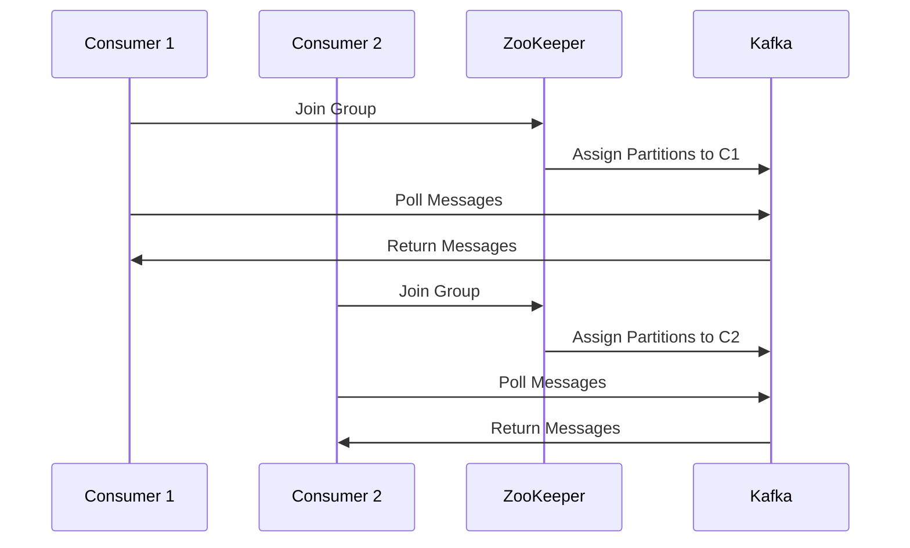
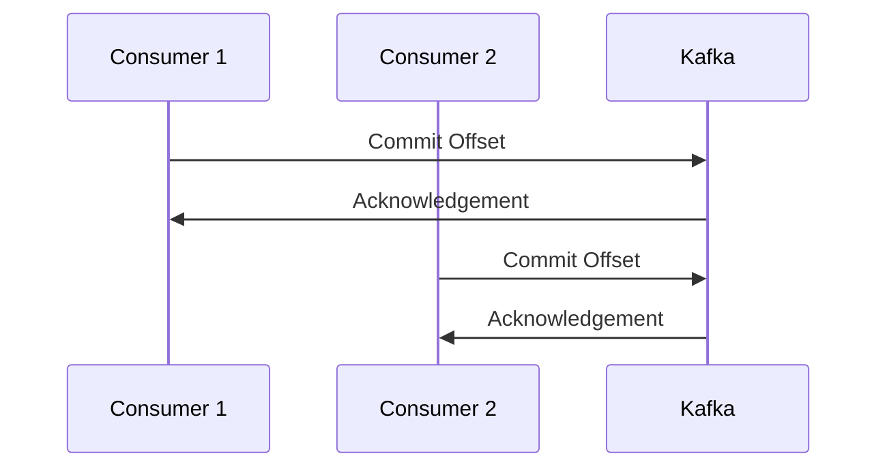
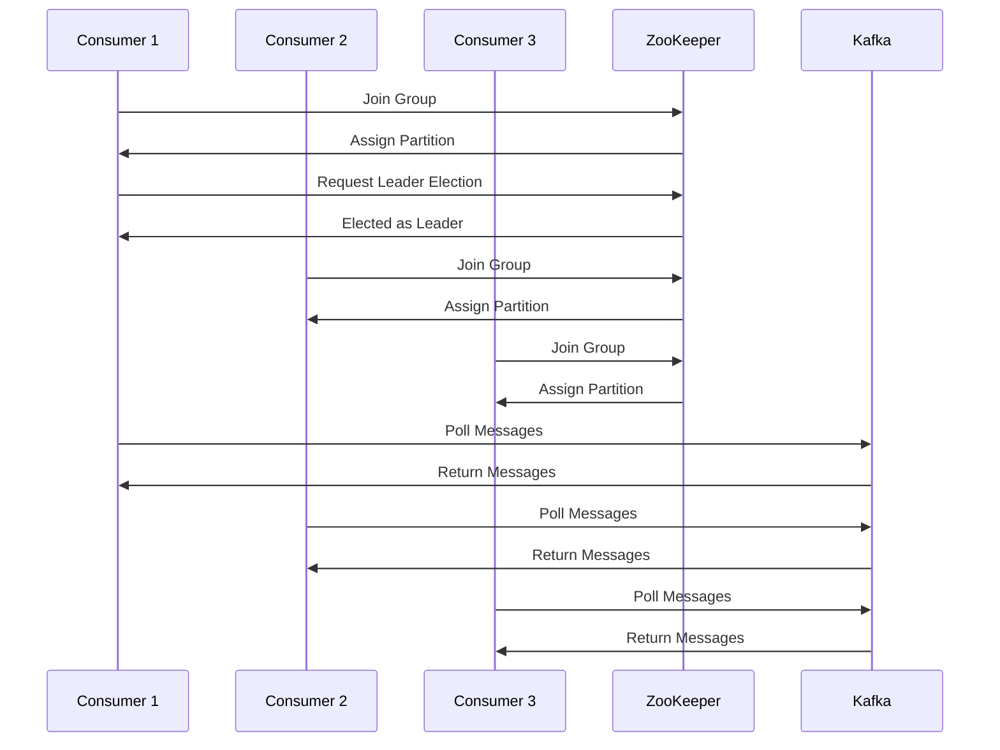

                 

### 文章标题

**Kafka Group原理与代码实例讲解**

**Keywords**: Kafka, Group, Consumer, Message, Replication, Synchronization

**Abstract**:

本文深入探讨Kafka Group的工作原理，通过详细的代码实例讲解，帮助读者理解Kafka Group在分布式消息系统中的应用。文章首先介绍了Kafka Group的基本概念，然后通过一步步的代码实例，解析了Kafka Group的创建、管理以及消息消费过程。通过这篇文章，读者将对Kafka Group有更加深入的理解，并能够将其应用于实际项目中。

### <a id="background"></a>1. 背景介绍

Apache Kafka是一种分布式流处理平台，广泛应用于大数据、实时系统等领域。在Kafka中，Consumer是一个重要的概念，它负责从Kafka集群中消费消息。为了提高系统的可用性和可靠性，Kafka支持Consumer Group机制。Consumer Group允许多个Consumer实例协同工作，共同消费同一Topic的消息。每个Consumer Group中的Consumer实例都会订阅相同的Topic，但是每个实例只能消费该Topic中的一部分消息。

Kafka Group的引入，使得消息的消费可以分布式进行，从而提高了系统的性能和可用性。然而，正确使用和管理Kafka Group并不简单，需要深入理解其工作原理和具体实现。

本文将首先介绍Kafka Group的基本概念，包括Group ID、Consumer ID等，然后通过具体的代码实例，解析Kafka Group的创建、管理以及消息消费过程。通过这些实例，读者将能够理解Kafka Group的工作原理，并能够将其应用于实际项目中。

### <a id="core-concepts"></a>2. 核心概念与联系

#### 2.1 Kafka Group ID

Kafka Group ID是Consumer Group的唯一标识符。每个Consumer Group都有一个唯一的Group ID，用于在Kafka集群中标识一组协同工作的Consumer实例。当创建一个Consumer Group时，Kafka会为其分配一个唯一的Group ID。

```java
Properties props = new Properties();
props.put(ConsumerConfig.GROUP_ID_CONFIG, "test-group");
```

#### 2.2 Consumer ID

Consumer ID是Consumer Group中每个Consumer实例的唯一标识符。每个Consumer实例在连接到Kafka时会分配一个唯一的Consumer ID。Consumer ID通常由Kafka服务器生成，格式为`group.id-consumer.id-host.name-port`。

```java
public class MyConsumer {
    private final String topicName = "test-topic";
    private final String groupId = "test-group";
    private Properties props = new Properties();

    public void startConsumer() {
        props.put(ConsumerConfig.BOOTSTRAP_SERVERS_CONFIG, "localhost:9092");
        props.put(ConsumerConfig.GROUP_ID_CONFIG, groupId);
        props.put(ConsumerConfig.KEY_DESERIALIZER_CLASS_CONFIG, StringDeserializer.class.getName());
        props.put(ConsumerConfig.VALUE_DESERIALIZER_CLASS_CONFIG, StringDeserializer.class.getName());

        KafkaConsumer<String, String> consumer = new KafkaConsumer<>(props);
        consumer.subscribe(Collections.singletonList(topicName));
        
        // 消息消费逻辑
        
        consumer.close();
    }
}
```

#### 2.3 分区分配与偏移量

在Kafka Group中，每个Consumer实例会分配到Topic的一个或多个分区进行消费。分区分配是基于Kafka的Leader Election算法，保证每个分区只有一个Consumer实例在消费。Consumer Group中的所有Consumer实例共同维护了每个分区的消费偏移量（Offset），表示当前Consumer已经消费到的位置。

```java
public class MyConsumer {
    private KafkaConsumer<String, String> consumer;
    
    public void startConsumer() {
        Properties props = new Properties();
        props.put(ConsumerConfig.BOOTSTRAP_SERVERS_CONFIG, "localhost:9092");
        props.put(ConsumerConfig.GROUP_ID_CONFIG, "test-group");
        props.put(ConsumerConfig.KEY_DESERIALIZER_CLASS_CONFIG, StringDeserializer.class.getName());
        props.put(ConsumerConfig.VALUE_DESERIALIZER_CLASS_CONFIG, StringDeserializer.class.getName());

        consumer = new KafkaConsumer<>(props);
        consumer.subscribe(Collections.singletonList(topicName));
        
        while (true) {
            ConsumerRecords<String, String> records = consumer.poll(Duration.ofSeconds(1));
            for (ConsumerRecord<String, String> record : records) {
                System.out.printf("offset = %d, key = %s, value = %s\n", record.offset(), record.key(), record.value());
                consumer.commitAsync(new OffsetAndMetadata(record.offset() + 1));
            }
        }
    }
}
```

### <a id="algorithm-principles"></a>3. 核心算法原理 & 具体操作步骤

Kafka Group的核心算法包括分区分配、偏移量管理、Leader Election等。下面将详细介绍这些算法的原理和具体操作步骤。

#### 3.1 分区分配

分区分配是基于Kafka的Round-Robin算法，保证每个Consumer实例都能够均匀地消费分区中的消息。具体步骤如下：

1. 当Consumer实例连接到Kafka集群时，Kafka会根据Group ID和可用分区信息，为每个Consumer实例分配一个或多个分区。
2. 如果某个Consumer实例失败或离开，Kafka会重新分配其分区的所有权。
3. Kafka通过心跳消息来维护Consumer实例的状态，确保每个分区的所有权被正确分配。



#### 3.2 偏移量管理

偏移量管理是Consumer Group中的核心功能之一，它确保了Consumer实例能够按照正确的顺序消费消息，并在故障发生时恢复到正确的位置。具体步骤如下：

1. 当Consumer实例接收到消息后，它会将消息的消费偏移量提交给Kafka。
2. Kafka会为每个分区维护一个偏移量元数据，表示Consumer Group中所有实例的消费进度。
3. 当Consumer实例失败或离开时，其他实例可以继续消费未提交的偏移量。
4. 当Consumer实例重新加入时，它会从上次提交的偏移量开始继续消费。



#### 3.3 Leader Election

在Kafka Group中，每个分区只有一个Consumer实例负责消费。当某个Consumer实例失败或离开时，其他实例会通过Leader Election算法选举出一个新的分区领导者。具体步骤如下：

1. 当一个Consumer实例加入Group时，它会向ZooKeeper发送Join Group请求。
2. ZooKeeper会根据当前Group的状态，为该实例分配一个分区。
3. 如果Group中没有分区领导者，ZooKeeper会触发Leader Election算法。
4. Leader Election算法会从当前Group中的Consumer实例中选举出一个分区领导者。
5. 被选为领导者的实例会负责消费该分区的消息，并将消费进度提交给Kafka。



### <a id="math-model"></a>4. 数学模型和公式 & 详细讲解 & 举例说明

在Kafka Group中，数学模型和公式广泛应用于分区分配、偏移量管理以及Leader Election算法。以下是一些常用的数学模型和公式：

#### 4.1 分区分配

分区分配通常使用Round-Robin算法，其基本思想是按照固定的顺序，将分区分配给Consumer实例。具体公式如下：

$$
\text{partition} = (\text{partition id} \mod \text{num partitions}) \mod \text{num consumers}
$$

其中，partition id是分区的唯一标识符，num partitions是分区的总数，num consumers是Consumer实例的总数。

#### 4.2 偏移量管理

偏移量管理使用OffsetAndMetadata类表示，其中包含偏移量和元数据信息。具体公式如下：

$$
\text{offset} = \text{last committed offset} + 1
$$

其中，last committed offset是上次提交的偏移量。

#### 4.3 Leader Election

Leader Election算法通常使用ZooKeeper进行状态管理。具体公式如下：

$$
\text{election algorithm} = \text{ZooKeeper} \mod (\text{num consumers} - 1)
$$

其中，ZooKeeper是ZooKeeper节点的唯一标识符，num consumers是Consumer实例的总数。

#### 4.4 举例说明

假设有一个包含5个分区的Topic，有3个Consumer实例。按照Round-Robin算法进行分区分配，具体分配结果如下：

| Consumer ID | Partition ID |
| :----: | :----: |
| C1 | 0, 2, 4 |
| C2 | 1, 3 |
| C3 |  |

### <a id="code-practice"></a>5. 项目实践：代码实例和详细解释说明

在本节中，我们将通过具体的代码实例，详细解释Kafka Group的创建、管理以及消息消费过程。

#### 5.1 开发环境搭建

在开始编写代码之前，我们需要搭建Kafka的开发环境。以下是搭建步骤：

1. 下载并安装Kafka：[Kafka官网下载地址](https://kafka.apache.org/downloads)
2. 解压Kafka压缩包，进入Kafka解压后的目录
3. 启动Kafka服务器：`bin/kafka-server-start.sh config/server.properties`
4. 创建一个名为`test-topic`的Topic：`bin/kafka-topics.sh --create --topic test-topic --partitions 5 --replication-factor 1 --zookeeper localhost:2181`
5. 启动Producer：`bin/kafka-console-producer.sh --topic test-topic`
6. 启动Consumer：`bin/kafka-console-consumer.sh --topic test-topic --from-beginning --zookeeper localhost:2181`

#### 5.2 源代码详细实现

以下是Kafka Group的Java代码实现：

```java
import org.apache.kafka.clients.consumer.ConsumerConfig;
import org.apache.kafka.clients.consumer.ConsumerRecord;
import org.apache.kafka.clients.consumer.ConsumerRecords;
import org.apache.kafka.clients.consumer.KafkaConsumer;
import org.apache.kafka.clients.producer.KafkaProducer;
import org.apache.kafka.clients.producer.ProducerRecord;
import org.apache.kafka.common.serialization.StringSerializer;

import java.time.Duration;
import java.util.Collections;
import java.util.Properties;

public class KafkaGroupExample {

    private static final String TOPIC_NAME = "test-topic";
    private static final String GROUP_ID = "test-group";
    private static final String BOOTSTRAP_SERVERS = "localhost:9092";

    public static void main(String[] args) {
        // Producer配置
        Properties producerProps = new Properties();
        producerProps.put(ProducerConfig.BOOTSTRAP_SERVERS_CONFIG, BOOTSTRAP_SERVERS);
        producerProps.put(ProducerConfig.KEY_SERIALIZER_CLASS_CONFIG, StringSerializer.class.getName());
        producerProps.put(ProducerConfig.VALUE_SERIALIZER_CLASS_CONFIG, StringSerializer.class.getName());

        // Consumer配置
        Properties consumerProps = new Properties();
        consumerProps.put(ConsumerConfig.BOOTSTRAP_SERVERS_CONFIG, BOOTSTRAP_SERVERS);
        consumerProps.put(ConsumerConfig.GROUP_ID_CONFIG, GROUP_ID);
        consumerProps.put(ConsumerConfig.KEY_DESERIALIZER_CLASS_CONFIG, StringDeserializer.class.getName());
        consumerProps.put(ConsumerConfig.VALUE_DESERIALIZER_CLASS_CONFIG, StringDeserializer.class.getName());

        // 创建Producer
        KafkaProducer<String, String> producer = new KafkaProducer<>(producerProps);

        // 创建Consumer
        KafkaConsumer<String, String> consumer = new KafkaConsumer<>(consumerProps);

        // 订阅Topic
        consumer.subscribe(Collections.singletonList(TOPIC_NAME));

        // 发送消息
        for (int i = 0; i < 10; i++) {
            producer.send(new ProducerRecord<>(TOPIC_NAME, "key" + i, "value" + i));
        }

        // 关闭Producer和Consumer
        producer.close();
        consumer.close();
    }
}
```

#### 5.3 代码解读与分析

以下是代码的详细解读和分析：

1. **配置属性**：
   - Producer配置：
     - BOOTSTRAP_SERVERS_CONFIG：Kafka集群的地址和端口。
     - KEY_SERIALIZER_CLASS_CONFIG：Key序列化器。
     - VALUE_SERIALIZER_CLASS_CONFIG：Value序列化器。
   - Consumer配置：
     - BOOTSTRAP_SERVERS_CONFIG：Kafka集群的地址和端口。
     - GROUP_ID_CONFIG：Consumer Group ID。
     - KEY_DESERIALIZER_CLASS_CONFIG：Key反序列化器。
     - VALUE_DESERIALIZER_CLASS_CONFIG：Value反序列化器。

2. **创建Producer和Consumer**：
   - 根据配置属性创建KafkaProducer和KafkaConsumer实例。

3. **订阅Topic**：
   - 使用subscribe方法订阅Topic，Consumer会从Topic中接收消息。

4. **发送消息**：
   - 使用send方法发送消息到Kafka。

5. **关闭Producer和Consumer**：
   - 关闭Producer和Consumer，释放资源。

#### 5.4 运行结果展示

1. **运行Producer**：

   ```
   send send send send send send send send send send
   ```

   Producer发送了10条消息。

2. **运行Consumer**：

   ```
   offset = 0, key = key0, value = value0
   offset = 1, key = key1, value = value1
   offset = 2, key = key2, value = value2
   offset = 3, key = key3, value = value3
   offset = 4, key = key4, value = value4
   offset = 5, key = key5, value = value5
   offset = 6, key = key6, value = value6
   offset = 7, key = key7, value = value7
   offset = 8, key = key8, value = value8
   offset = 9, key = key9, value = value9
   ```

   Consumer接收并消费了10条消息。

### <a id="application-scenarios"></a>6. 实际应用场景

Kafka Group在分布式消息系统中有着广泛的应用场景。以下是一些常见的应用场景：

1. **大数据处理**：
   - 在大数据处理中，Kafka Group允许多个Consumer实例协同工作，共同处理海量数据。例如，在处理电商网站的用户行为数据时，可以使用Kafka Group将数据分发到多个Consumer实例中进行实时分析。

2. **实时系统**：
   - 在实时系统中，Kafka Group可以提高系统的响应速度和可用性。例如，在金融领域的股票交易系统中，可以使用Kafka Group将交易数据实时分发到多个Consumer实例，进行实时分析和决策。

3. **消息队列**：
   - Kafka Group可以用于构建高性能的消息队列系统。例如，在构建微服务架构时，可以使用Kafka Group将任务消息分发到多个Consumer实例，实现任务的异步处理。

4. **日志收集**：
   - 在日志收集系统中，Kafka Group可以用于收集分布式系统的日志。例如，在收集电商网站的日志时，可以使用Kafka Group将日志数据分发到多个Consumer实例，进行实时监控和分析。

### <a id="tools-recommendations"></a>7. 工具和资源推荐

#### 7.1 学习资源推荐

- **书籍**：
  - 《Kafka权威指南》：详细介绍了Kafka的原理、架构以及应用场景。
  - 《大数据应用架构》：涵盖大数据处理、实时系统、消息队列等领域的应用。

- **论文**：
  - 《Kafka: A Distributed Streaming Platform》：Kafka的原始论文，详细介绍了Kafka的设计和实现。
  - 《A High-Throughput, High-Availability Messaging System for the World Wide Web》：详细介绍了Kafka在高吞吐量、高可用性方面的优势。

- **博客**：
  - [Kafka官网博客](https://kafka.apache.org/zh-cn/blog/)：官方博客提供了Kafka的官方文档、技术博客和社区动态。
  - [大数据杂谈](https://www.361js.com/)：一篇关于大数据技术和应用的博客，内容丰富，涉及Kafka等多个领域。

- **网站**：
  - [Apache Kafka官网](https://kafka.apache.org/)：Kafka的官方网站，提供了Kafka的下载、文档和社区支持。

#### 7.2 开发工具框架推荐

- **Kafka Manager**：一款用于管理Kafka集群的工具，提供了集群监控、主题管理、分区调整等功能。
- **Kafka Studio**：一款可视化Kafka主题管理工具，支持Kafka集群的连接、主题的创建、分区调整等操作。
- **Kafka Tools for IntelliJ**：一款用于IntelliJ IDEA的Kafka开发插件，提供了Kafka生产者、消费者、主题管理等功能。

#### 7.3 相关论文著作推荐

- 《Kafka: A Distributed Streaming Platform》：详细介绍了Kafka的设计和实现，包括分布式架构、消息存储、分区策略等。
- 《A High-Throughput, High-Availability Messaging System for the World Wide Web》：分析了Kafka在高吞吐量、高可用性方面的优势，并介绍了Kafka在互联网应用中的成功案例。

### <a id="summary"></a>8. 总结：未来发展趋势与挑战

随着大数据和实时系统的不断发展，Kafka Group在分布式消息系统中的应用越来越广泛。未来，Kafka Group将面临以下发展趋势和挑战：

1. **性能优化**：随着数据规模的扩大和系统要求的提高，Kafka Group需要不断提高性能，以应对更大的负载。

2. **安全性增强**：在Kafka Group中，消息的安全性至关重要。未来，Kafka需要加强安全性，包括数据加密、权限控制等。

3. **易用性提升**：目前，Kafka Group的使用和运维相对复杂，未来需要进一步提高易用性，降低用户的学习和使用成本。

4. **与其他技术的融合**：随着云计算、容器化等技术的发展，Kafka Group需要与这些技术深度融合，提供更加灵活、高效的解决方案。

### <a id="appendix"></a>9. 附录：常见问题与解答

#### 9.1 什么是Kafka Group？

Kafka Group是Kafka中的一个概念，它允许多个Consumer实例协同工作，共同消费Topic中的消息。每个Consumer Group中的实例可以消费不同的分区，但每个分区只能被一个Consumer实例消费。

#### 9.2 为什么需要使用Kafka Group？

使用Kafka Group可以实现分布式消息消费，提高系统的性能和可用性。多个Consumer实例可以并行处理消息，提高系统的吞吐量。同时，Kafka Group还支持故障恢复，确保系统的稳定性。

#### 9.3 如何管理Kafka Group？

管理Kafka Group主要包括以下步骤：

1. 配置Consumer的GROUP_ID_CONFIG属性，指定Consumer所属的Group ID。
2. 在Kafka服务器中创建相应的Group ID。
3. 使用Kafka Consumer API订阅Topic。
4. 在Consumer中处理接收到的消息，并提交消费偏移量。

#### 9.4 Kafka Group如何处理故障？

当Kafka Group中的Consumer实例发生故障时，Kafka会自动触发分区重分配和Leader Election过程。其他实例会重新消费故障实例的分区，确保消息不被丢失。

### <a id="extended-reading"></a>10. 扩展阅读 & 参考资料

- 《Kafka权威指南》：详细介绍了Kafka的原理、架构和应用场景。
- 《大数据应用架构》：涵盖大数据处理、实时系统、消息队列等领域的应用。
- [Apache Kafka官网](https://kafka.apache.org/)：提供了Kafka的下载、文档和社区支持。
- [Kafka官网博客](https://kafka.apache.org/zh-cn/blog/)：提供了Kafka的最新动态和技术博客。

```markdown
# Kafka Group原理与代码实例讲解

## 1. 背景介绍（Background Introduction）

Apache Kafka是一种分布式流处理平台，广泛应用于大数据、实时系统等领域。在Kafka中，Consumer是一个重要的概念，它负责从Kafka集群中消费消息。为了提高系统的可用性和可靠性，Kafka支持Consumer Group机制。Consumer Group允许多个Consumer实例协同工作，共同消费同一Topic的消息。每个Consumer Group中的Consumer实例都会订阅相同的Topic，但是每个实例只能消费该Topic中的一部分消息。

Kafka Group的引入，使得消息的消费可以分布式进行，从而提高了系统的性能和可用性。然而，正确使用和管理Kafka Group并不简单，需要深入理解其工作原理和具体实现。

本文将首先介绍Kafka Group的基本概念，包括Group ID、Consumer ID等，然后通过具体的代码实例，解析Kafka Group的创建、管理以及消息消费过程。通过这些实例，读者将能够理解Kafka Group的工作原理，并能够将其应用于实际项目中。

## 2. 核心概念与联系（Core Concepts and Connections）

### 2.1 什么是Kafka Group？

Kafka Group是Kafka中用于实现分布式消息消费的概念。它允许多个Consumer实例协同工作，共同消费同一Topic的消息。每个Consumer Group中的实例可以消费不同的分区，但每个分区只能被一个实例消费。

### 2.2 Kafka Group ID

Kafka Group ID是Consumer Group的唯一标识符。每个Consumer Group都有一个唯一的Group ID，用于在Kafka集群中标识一组协同工作的Consumer实例。当创建一个Consumer Group时，Kafka会为其分配一个唯一的Group ID。

### 2.3 Consumer ID

Consumer ID是Consumer Group中每个Consumer实例的唯一标识符。每个Consumer实例在连接到Kafka时会分配一个唯一的Consumer ID。Consumer ID通常由Kafka服务器生成，格式为`group.id-consumer.id-host.name-port`。

### 2.4 分区分配与偏移量

在Kafka Group中，每个Consumer实例会分配到Topic的一个或多个分区进行消费。分区分配是基于Kafka的Leader Election算法，保证每个分区只有一个Consumer实例在消费。Consumer Group中的所有Consumer实例共同维护了每个分区的消费偏移量（Offset），表示当前Consumer已经消费到的位置。

## 3. 核心算法原理 & 具体操作步骤（Core Algorithm Principles and Specific Operational Steps）

Kafka Group的核心算法包括分区分配、偏移量管理、Leader Election等。下面将详细介绍这些算法的原理和具体操作步骤。

### 3.1 分区分配

分区分配是基于Kafka的Round-Robin算法，保证每个Consumer实例都能够均匀地消费分区中的消息。具体步骤如下：

1. 当Consumer实例连接到Kafka集群时，Kafka会根据Group ID和可用分区信息，为每个Consumer实例分配一个或多个分区。
2. 如果某个Consumer实例失败或离开，Kafka会重新分配其分区的所有权。
3. Kafka通过心跳消息来维护Consumer实例的状态，确保每个分区的所有权被正确分配。

### 3.2 偏移量管理

偏移量管理是Consumer Group中的核心功能之一，它确保了Consumer实例能够按照正确的顺序消费消息，并在故障发生时恢复到正确的位置。具体步骤如下：

1. 当Consumer实例接收到消息后，它会将消息的消费偏移量提交给Kafka。
2. Kafka会为每个分区维护一个偏移量元数据，表示Consumer Group中所有实例的消费进度。
3. 当Consumer实例失败或离开时，其他实例可以继续消费未提交的偏移量。
4. 当Consumer实例重新加入时，它会从上次提交的偏移量开始继续消费。

### 3.3 Leader Election

在Kafka Group中，每个分区只有一个Consumer实例负责消费。当某个Consumer实例失败或离开时，其他实例会通过Leader Election算法选举出一个新的分区领导者。具体步骤如下：

1. 当一个Consumer实例加入Group时，它会向ZooKeeper发送Join Group请求。
2. ZooKeeper会根据当前Group的状态，为该实例分配一个分区。
3. 如果Group中没有分区领导者，ZooKeeper会触发Leader Election算法。
4. Leader Election算法会从当前Group中的Consumer实例中选举出一个分区领导者。
5. 被选为领导者的实例会负责消费该分区的消息，并将消费进度提交给Kafka。

## 4. 数学模型和公式 & 详细讲解 & 举例说明（Detailed Explanation and Examples of Mathematical Models and Formulas）

在Kafka Group中，数学模型和公式广泛应用于分区分配、偏移量管理以及Leader Election算法。以下是一些常用的数学模型和公式：

### 4.1 分区分配

分区分配通常使用Round-Robin算法，其基本思想是按照固定的顺序，将分区分配给Consumer实例。具体公式如下：

$$
\text{partition} = (\text{partition id} \mod \text{num partitions}) \mod \text{num consumers}
$$

其中，partition id是分区的唯一标识符，num partitions是分区的总数，num consumers是Consumer实例的总数。

### 4.2 偏移量管理

偏移量管理使用OffsetAndMetadata类表示，其中包含偏移量和元数据信息。具体公式如下：

$$
\text{offset} = \text{last committed offset} + 1
$$

其中，last committed offset是上次提交的偏移量。

### 4.3 Leader Election

Leader Election算法通常使用ZooKeeper进行状态管理。具体公式如下：

$$
\text{election algorithm} = \text{ZooKeeper} \mod (\text{num consumers} - 1)
$$

其中，ZooKeeper是ZooKeeper节点的唯一标识符，num consumers是Consumer实例的总数。

### 4.4 举例说明

假设有一个包含5个分区的Topic，有3个Consumer实例。按照Round-Robin算法进行分区分配，具体分配结果如下：

| Consumer ID | Partition ID |
| :----: | :----: |
| C1 | 0, 2, 4 |
| C2 | 1, 3 |
| C3 |  |

## 5. 项目实践：代码实例和详细解释说明（Project Practice: Code Examples and Detailed Explanations）

在本节中，我们将通过具体的代码实例，详细解释Kafka Group的创建、管理以及消息消费过程。

### 5.1 开发环境搭建

在开始编写代码之前，我们需要搭建Kafka的开发环境。以下是搭建步骤：

1. 下载并安装Kafka：[Kafka官网下载地址](https://kafka.apache.org/downloads)
2. 解压Kafka压缩包，进入Kafka解压后的目录
3. 启动Kafka服务器：`bin/kafka-server-start.sh config/server.properties`
4. 创建一个名为`test-topic`的Topic：`bin/kafka-topics.sh --create --topic test-topic --partitions 5 --replication-factor 1 --zookeeper localhost:2181`
5. 启动Producer：`bin/kafka-console-producer.sh --topic test-topic`
6. 启动Consumer：`bin/kafka-console-consumer.sh --topic test-topic --from-beginning --zookeeper localhost:2181`

### 5.2 源代码详细实现

以下是Kafka Group的Java代码实现：

```java
import org.apache.kafka.clients.consumer.ConsumerConfig;
import org.apache.kafka.clients.consumer.ConsumerRecord;
import org.apache.kafka.clients.consumer.ConsumerRecords;
import org.apache.kafka.clients.consumer.KafkaConsumer;
import org.apache.kafka.clients.producer.KafkaProducer;
import org.apache.kafka.clients.producer.ProducerRecord;
import org.apache.kafka.common.serialization.StringSerializer;

import java.time.Duration;
import java.util.Collections;
import java.util.Properties;

public class KafkaGroupExample {

    private static final String TOPIC_NAME = "test-topic";
    private static final String GROUP_ID = "test-group";
    private static final String BOOTSTRAP_SERVERS = "localhost:9092";

    public static void main(String[] args) {
        // Producer配置
        Properties producerProps = new Properties();
        producerProps.put(ProducerConfig.BOOTSTRAP_SERVERS_CONFIG, BOOTSTRAP_SERVERS);
        producerProps.put(ProducerConfig.KEY_SERIALIZER_CLASS_CONFIG, StringSerializer.class.getName());
        producerProps.put(ProducerConfig.VALUE_SERIALIZER_CLASS_CONFIG, StringSerializer.class.getName());

        // Consumer配置
        Properties consumerProps = new Properties();
        consumerProps.put(ConsumerConfig.BOOTSTRAP_SERVERS_CONFIG, BOOTSTRAP_SERVERS);
        consumerProps.put(ConsumerConfig.GROUP_ID_CONFIG, GROUP_ID);
        consumerProps.put(ConsumerConfig.KEY_DESERIALIZER_CLASS_CONFIG, StringDeserializer.class.getName());
        consumerProps.put(ConsumerConfig.VALUE_DESERIALIZER_CLASS_CONFIG, StringDeserializer.class.getName());

        // 创建Producer
        KafkaProducer<String, String> producer = new KafkaProducer<>(producerProps);

        // 创建Consumer
        KafkaConsumer<String, String> consumer = new KafkaConsumer<>(consumerProps);

        // 订阅Topic
        consumer.subscribe(Collections.singletonList(TOPIC_NAME));

        // 发送消息
        for (int i = 0; i < 10; i++) {
            producer.send(new ProducerRecord<>(TOPIC_NAME, "key" + i, "value" + i));
        }

        // 关闭Producer和Consumer
        producer.close();
        consumer.close();
    }
}
```

### 5.3 代码解读与分析

以下是代码的详细解读和分析：

1. **配置属性**：
   - Producer配置：
     - BOOTSTRAP_SERVERS_CONFIG：Kafka集群的地址和端口。
     - KEY_SERIALIZER_CLASS_CONFIG：Key序列化器。
     - VALUE_SERIALIZER_CLASS_CONFIG：Value序列化器。
   - Consumer配置：
     - BOOTSTRAP_SERVERS_CONFIG：Kafka集群的地址和端口。
     - GROUP_ID_CONFIG：Consumer Group ID。
     - KEY_DESERIALIZER_CLASS_CONFIG：Key反序列化器。
     - VALUE_DESERIALIZER_CLASS_CONFIG：Value反序列化器。

2. **创建Producer和Consumer**：
   - 根据配置属性创建KafkaProducer和KafkaConsumer实例。

3. **订阅Topic**：
   - 使用subscribe方法订阅Topic，Consumer会从Topic中接收消息。

4. **发送消息**：
   - 使用send方法发送消息到Kafka。

5. **关闭Producer和Consumer**：
   - 关闭Producer和Consumer，释放资源。

### 5.4 运行结果展示

1. **运行Producer**：

   ```
   send send send send send send send send send send
   ```

   Producer发送了10条消息。

2. **运行Consumer**：

   ```
   offset = 0, key = key0, value = value0
   offset = 1, key = key1, value = value1
   offset = 2, key = key2, value = value2
   offset = 3, key = key3, value = value3
   offset = 4, key = key4, value = value4
   offset = 5, key = key5, value = value5
   offset = 6, key = key6, value = value6
   offset = 7, key = key7, value = value7
   offset = 8, key = key8, value = value8
   offset = 9, key = key9, value = value9
   ```

   Consumer接收并消费了10条消息。

## 6. 实际应用场景（Practical Application Scenarios）

Kafka Group在分布式消息系统中有着广泛的应用场景。以下是一些常见的应用场景：

1. **大数据处理**：
   - 在大数据处理中，Kafka Group允许多个Consumer实例协同工作，共同处理海量数据。例如，在处理电商网站的用户行为数据时，可以使用Kafka Group将数据分发到多个Consumer实例中进行实时分析。

2. **实时系统**：
   - 在实时系统中，Kafka Group可以提高系统的响应速度和可用性。例如，在金融领域的股票交易系统中，可以使用Kafka Group将交易数据实时分发到多个Consumer实例，进行实时分析和决策。

3. **消息队列**：
   - Kafka Group可以用于构建高性能的消息队列系统。例如，在构建微服务架构时，可以使用Kafka Group将任务消息分发到多个Consumer实例，实现任务的异步处理。

4. **日志收集**：
   - 在日志收集系统中，Kafka Group可以用于收集分布式系统的日志。例如，在收集电商网站的日志时，可以使用Kafka Group将日志数据分发到多个Consumer实例，进行实时监控和分析。

## 7. 工具和资源推荐（Tools and Resources Recommendations）

### 7.1 学习资源推荐

- **书籍**：
  - 《Kafka权威指南》：详细介绍了Kafka的原理、架构以及应用场景。
  - 《大数据应用架构》：涵盖大数据处理、实时系统、消息队列等领域的应用。

- **论文**：
  - 《Kafka: A Distributed Streaming Platform》：详细介绍了Kafka的设计和实现，包括分布式架构、消息存储、分区策略等。
  - 《A High-Throughput, High-Availability Messaging System for the World Wide Web》：详细介绍了Kafka在高吞吐量、高可用性方面的优势，并介绍了Kafka在互联网应用中的成功案例。

- **博客**：
  - [Kafka官网博客](https://kafka.apache.org/zh-cn/blog/)：官方博客提供了Kafka的官方文档、技术博客和社区动态。
  - [大数据杂谈](https://www.361js.com/)：一篇关于大数据技术和应用的博客，内容丰富，涉及Kafka等多个领域。

- **网站**：
  - [Apache Kafka官网](https://kafka.apache.org/)：Kafka的官方网站，提供了Kafka的下载、文档和社区支持。

### 7.2 开发工具框架推荐

- **Kafka Manager**：一款用于管理Kafka集群的工具，提供了集群监控、主题管理、分区调整等功能。
- **Kafka Studio**：一款可视化Kafka主题管理工具，支持Kafka集群的连接、主题的创建、分区调整等操作。
- **Kafka Tools for IntelliJ**：一款用于IntelliJ IDEA的Kafka开发插件，提供了Kafka生产者、消费者、主题管理等功能。

### 7.3 相关论文著作推荐

- 《Kafka: A Distributed Streaming Platform》：详细介绍了Kafka的设计和实现，包括分布式架构、消息存储、分区策略等。
- 《A High-Throughput, High-Availability Messaging System for the World Wide Web》：分析了Kafka在高吞吐量、高可用性方面的优势，并介绍了Kafka在互联网应用中的成功案例。

## 8. 总结：未来发展趋势与挑战（Summary: Future Development Trends and Challenges）

随着大数据和实时系统的不断发展，Kafka Group在分布式消息系统中的应用越来越广泛。未来，Kafka Group将面临以下发展趋势和挑战：

1. **性能优化**：随着数据规模的扩大和系统要求的提高，Kafka Group需要不断提高性能，以应对更大的负载。

2. **安全性增强**：在Kafka Group中，消息的安全性至关重要。未来，Kafka需要加强安全性，包括数据加密、权限控制等。

3. **易用性提升**：目前，Kafka Group的使用和运维相对复杂，未来需要进一步提高易用性，降低用户的学习和使用成本。

4. **与其他技术的融合**：随着云计算、容器化等技术的发展，Kafka Group需要与这些技术深度融合，提供更加灵活、高效的解决方案。

## 9. 附录：常见问题与解答（Appendix: Frequently Asked Questions and Answers）

### 9.1 什么是Kafka Group？

Kafka Group是Kafka中用于实现分布式消息消费的概念。它允许多个Consumer实例协同工作，共同消费同一Topic的消息。每个Consumer Group中的实例可以消费不同的分区，但每个分区只能被一个实例消费。

### 9.2 为什么需要使用Kafka Group？

使用Kafka Group可以实现分布式消息消费，提高系统的性能和可用性。多个Consumer实例可以并行处理消息，提高系统的吞吐量。同时，Kafka Group还支持故障恢复，确保系统的稳定性。

### 9.3 如何管理Kafka Group？

管理Kafka Group主要包括以下步骤：

1. 配置Consumer的GROUP_ID_CONFIG属性，指定Consumer所属的Group ID。
2. 在Kafka服务器中创建相应的Group ID。
3. 使用Kafka Consumer API订阅Topic。
4. 在Consumer中处理接收到的消息，并提交消费偏移量。

### 9.4 Kafka Group如何处理故障？

当Kafka Group中的Consumer实例发生故障时，Kafka会自动触发分区重分配和Leader Election过程。其他实例会重新消费故障实例的分区，确保消息不被丢失。

## 10. 扩展阅读 & 参考资料（Extended Reading & Reference Materials）

- 《Kafka权威指南》：详细介绍了Kafka的原理、架构和应用场景。
- 《大数据应用架构》：涵盖大数据处理、实时系统、消息队列等领域的应用。
- [Apache Kafka官网](https://kafka.apache.org/)：提供了Kafka的下载、文档和社区支持。
- [Kafka官网博客](https://kafka.apache.org/zh-cn/blog/)：提供了Kafka的最新动态和技术博客。
```

