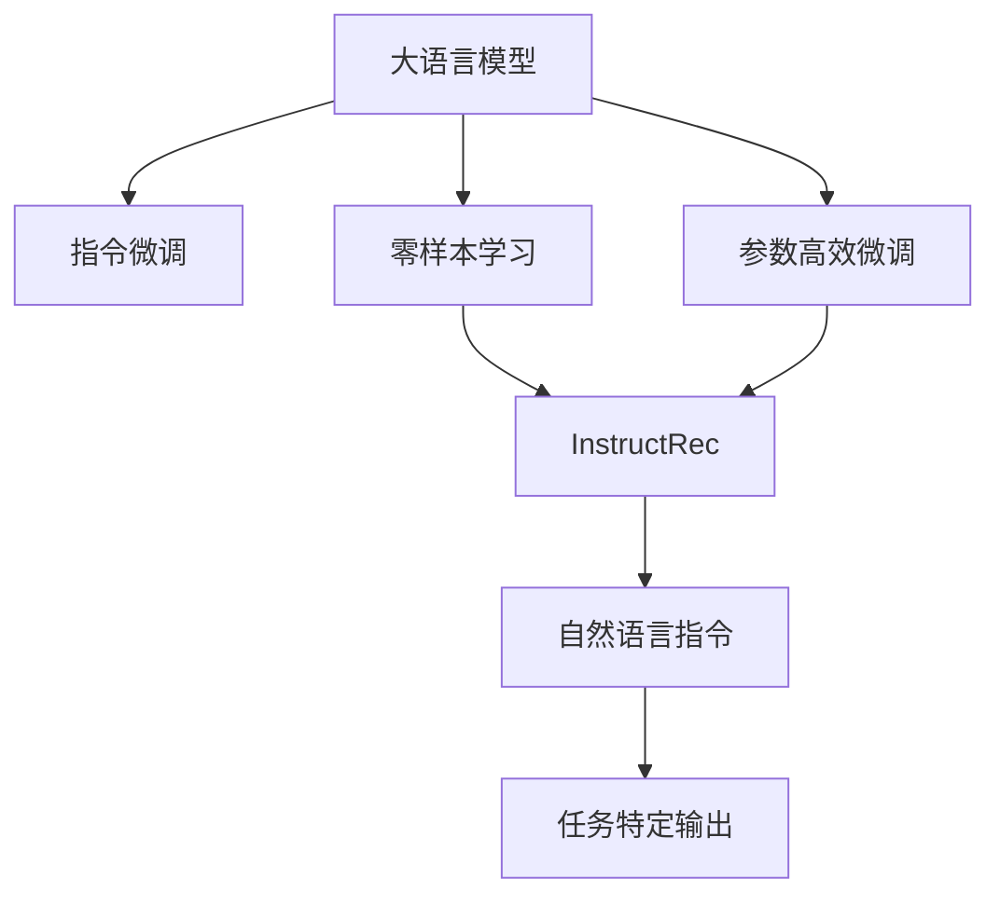

                 

# 自然语言指令：InstructRec的优势

> 关键词：自然语言指令, InstructRec, 指令微调, 自然语言处理(NLP), 零样本学习, 鲁棒性, 可解释性

## 1. 背景介绍

### 1.1 问题由来
随着深度学习技术的发展，自然语言处理(NLP)领域的研究越来越倾向于使用大语言模型进行自然语言理解和生成。例如，GPT系列模型通过大量无标签文本数据的自监督预训练，学习到强大的语言表示能力，然后通过下游任务的微调来提升在特定任务上的性能。这种微调方法，虽然能够在少量标注数据上取得不错的效果，但仍面临过拟合、计算资源消耗大等挑战。

此外，实际应用中，有时我们希望模型能够根据特定任务的具体需求，快速适应新的任务。例如，如果只需要生成一篇基于特定语料库的总结，而无需考虑摘要的长度、风格等要求。这时，如果我们对模型进行指令微调，使其能够快速适应不同的自然语言指令，将极大地提高模型的应用效率和灵活性。

### 1.2 问题核心关键点
为了提升大语言模型对特定自然语言指令的响应能力，近年来，指令微调（Instruction Tuning）成为一个热点研究方向。指令微调是指，通过给预训练模型增加一个指令输出模块，使得模型能够在接收到特定自然语言指令后，生成相应的输出。这一方法可以有效提升模型的任务适应性和泛化能力，成为大语言模型在实际应用中的重要补充。

InstructRec是一种先进的指令微调方法，它通过在预训练语言模型的顶层增加一个任务特定的输出层，并利用微调后的任务标签进行优化，从而使得模型能够快速适应不同的自然语言指令。InstructRec的一个关键优势在于其能够实现零样本学习（zero-shot learning），即在没有经过任何任务特定的训练数据的情况下，直接根据自然语言指令生成输出。此外，InstructRec还能够通过参数高效微调（parameter-efficient fine-tuning）进一步提升模型的性能，同时减少计算资源的消耗。

## 2. 核心概念与联系

### 2.1 核心概念概述

为更好地理解InstructRec的优势，本节将介绍几个关键概念及其相互联系：

- 大语言模型（Large Language Models, LLMs）：如GPT系列、BERT等，通过自监督学习任务训练得到，具备强大的语言理解和生成能力。
- 指令微调（Instruction Tuning）：通过给预训练模型增加一个指令输出模块，使其能够根据自然语言指令生成输出。
- 零样本学习（Zero-shot Learning）：模型在没有经过任何特定任务训练数据的情况下，根据自然语言指令生成输出。
- 参数高效微调（Parameter-Efficient Fine-Tuning, PEFT）：在微调过程中，只更新少量模型参数，减少计算资源消耗。
- InstructRec：一种先进的指令微调方法，结合了零样本学习和参数高效微调技术，通过在预训练模型顶层增加任务特定输出层，实现对特定自然语言指令的快速响应。

这些核心概念之间的逻辑关系可以通过以下Mermaid流程图来展示：



这个流程图展示了大语言模型微调的不同技术和它们之间的联系：

1. 大语言模型通过预训练获得基础能力。
2. 指令微调通过在模型顶层添加任务特定的输出层，使得模型能够根据自然语言指令生成输出。
3. 零样本学习允许模型在没有特定任务数据的情况下，仅通过自然语言指令进行推理和生成。
4. 参数高效微调通过减少需优化参数数量，降低计算资源消耗。
5. InstructRec结合了上述技术，在大规模预训练基础上，实现高效、灵活的指令微调。

这些概念共同构成了InstructRec的工作原理和优化方向，使其在零样本和参数高效微调等前沿研究领域中具备显著优势。

## 3. 核心算法原理 & 具体操作步骤
### 3.1 算法原理概述

InstructRec的核心思想是在大语言模型的顶层添加一个指令输出模块，该模块根据自然语言指令生成模型输出。其基本流程包括以下几个步骤：

1. **指令编码**：将自然语言指令转换为模型可以理解的向量表示。
2. **融合指令与输入**：将指令向量与输入向量进行融合，生成一个联合表示。
3. **生成输出**：将联合表示通过模型生成器，生成目标输出。

该方法本质上是通过在模型顶层添加一个指令编码器和输出模块，使得模型能够在接收到自然语言指令后，根据指令生成相应的输出。其核心在于将自然语言指令与输入向量进行有效融合，从而使得模型能够根据指令输出期望的结果。

### 3.2 算法步骤详解

InstructRec的具体操作步骤如下：

**Step 1: 准备预训练模型和指令数据集**
- 选择合适的预训练语言模型 $M_{\theta}$ 作为初始化参数，如 GPT-3、BERT等。
- 准备指令数据集，包含自然语言指令和对应的输出标签。

**Step 2: 指令编码器设计**
- 设计一个简单的指令编码器 $C$，如线性变换器或前馈神经网络，将自然语言指令 $f$ 转换为向量表示 $c$。

**Step 3: 融合指令与输入**
- 将指令向量 $c$ 与输入向量 $x$ 进行融合，生成联合表示 $z$。融合方式可以是拼接、加权求和或注意力机制。
- 对于长文本输入，可以通过分词器将输入分成若干子片段，分别进行融合。

**Step 4: 生成输出**
- 将联合表示 $z$ 输入到模型生成器，生成目标输出 $y$。生成器可以是原始的预训练模型，也可以是一个新设计的小型模型。

**Step 5: 优化模型参数**
- 使用微调技术优化模型参数，使其能够在不同自然语言指令下生成准确输出。

**Step 6: 应用指令输出**
- 使用训练好的模型，根据自然语言指令生成相应的输出。

### 3.3 算法优缺点

InstructRec的优势主要体现在以下几个方面：

**优点：**
1. **零样本学习能力**：InstructRec通过指令微调，可以在没有特定任务数据的情况下，快速适应新的自然语言指令。这对于新任务、少样本任务尤其有优势。
2. **参数高效微调**：通过在预训练模型顶层添加指令编码器和输出模块，可以只更新少量参数，节省计算资源，提高模型部署效率。
3. **灵活性高**：InstructRec允许根据不同的自然语言指令，设计不同的指令编码器和输出模块，实现灵活的模型适配。
4. **鲁棒性强**：InstructRec可以通过指令微调，学习到更鲁棒的指令-输出映射，减少模型对输入数据的依赖。

**缺点：**
1. **指令设计难度高**：自然语言指令的设计需要仔细考虑语言的表达方式和模型推理逻辑，对设计者要求较高。
2. **模型复杂性增加**：在预训练模型顶层增加指令编码器和输出模块，增加了模型的复杂度，可能对模型的推理效率产生影响。
3. **指令泛化能力有限**：不同的自然语言指令之间可能存在差异，模型可能无法泛化到所有指令。

### 3.4 算法应用领域

InstructRec在多个自然语言处理任务中展示了其优势，具体应用领域包括：

- **问答系统**：在问答系统中，InstructRec能够根据用户的问题，快速生成准确的回答，无需额外训练数据。
- **文本摘要**：InstructRec可以根据不同的摘要要求，生成风格各异的摘要，提升自动化摘要的质量。
- **机器翻译**：InstructRec能够根据特定的翻译指令，生成目标语言的翻译结果，无需额外的训练数据。
- **自然语言生成**：InstructRec可以根据特定的生成指令，生成文本、代码、对话等不同类型的自然语言输出。
- **知识图谱**：InstructRec可以通过指令微调，学习到更准确的实体-关系映射，提升知识图谱的应用效果。

此外，InstructRec还可以应用于智能客服、教育、健康医疗等多个领域，提升相关系统的智能化水平。

## 4. 数学模型和公式 & 详细讲解 & 举例说明

### 4.1 数学模型构建

假设输入为 $x \in \mathbb{R}^d$，指令为 $f \in \mathbb{R}^n$，指令编码器输出为 $c \in \mathbb{R}^m$，模型生成器为 $G: \mathbb{R}^{m+d} \rightarrow \mathbb{R}^{d'}$。则InstructRec的数学模型可以表示为：

$$
y = G(z) \quad \text{where} \quad z = \begin{bmatrix} x \\ c \end{bmatrix}
$$

其中 $z$ 为融合后的向量，包含输入 $x$ 和指令编码器输出 $c$。

### 4.2 公式推导过程

InstructRec的指令编码器和输出模块的构建方式，可以通过以下步骤进行推导：

1. **指令编码器设计**：
   - 假设指令编码器 $C: f \rightarrow c$，使用线性变换器或前馈神经网络，将指令 $f$ 转换为向量 $c$。
   - 使用 $\text{softmax}$ 函数将指令向量 $c$ 转换为注意力权重 $a$，表示指令中的每个单词对模型的影响程度。
   - 将指令权重 $a$ 与输入向量 $x$ 进行加权求和，生成融合后的向量 $z$。

   推导过程如下：
   $$
   c = C(f) \quad \text{where} \quad C(f) = W_c f + b_c
   $$
   $$
   a = \text{softmax}(c)
   $$
   $$
   z = x \cdot a
   $$

2. **模型生成器设计**：
   - 假设模型生成器 $G: z \rightarrow y$，使用预训练模型的解码器部分，将联合表示 $z$ 映射为输出向量 $y$。
   - 假设解码器 $G$ 由 $h$ 层组成，每层包含 $d_h$ 个隐藏单元。
   - 假设输出层的激活函数为 $\tanh$。

   推导过程如下：
   $$
   y = G(z) = \tanh([z; 0])
   $$
   $$
   z = \begin{bmatrix} x \\ c \end{bmatrix} = \begin{bmatrix} x \\ W_c f + b_c \end{bmatrix}
   $$

### 4.3 案例分析与讲解

假设我们有一个预训练的BERT模型，需要根据自然语言指令生成对话回复。具体的指令为：“请告诉我关于机器学习的最新进展”。我们将该指令输入指令编码器 $C$，生成指令向量 $c$，然后与对话输入 $x$ 进行融合，生成联合表示 $z$，最后通过模型生成器 $G$ 生成回复 $y$。

**Step 1: 指令编码器 $C$ 设计**

指令 $f = \text{``请告诉我关于机器学习的最新进展"}$，假设 $f$ 的长度为 $n$，$C$ 使用线性变换器，生成指令向量 $c$。假设指令编码器 $C$ 的参数为 $W_c$ 和 $b_c$，则有：

$$
c = W_c f + b_c
$$

**Step 2: 融合指令与输入**

将指令向量 $c$ 与对话输入 $x$ 进行融合，生成联合表示 $z$。假设 $x$ 的长度为 $d$，则有：

$$
a = \text{softmax}(c) \in \mathbb{R}^d
$$
$$
z = x \cdot a
$$

**Step 3: 生成回复**

假设模型生成器 $G$ 使用预训练模型的解码器部分，将联合表示 $z$ 映射为回复向量 $y$。假设解码器 $G$ 由 $h$ 层组成，每层包含 $d_h$ 个隐藏单元，则有：

$$
y = G(z) = \tanh([z; 0])
$$

通过以上步骤，模型能够根据自然语言指令，生成对应的对话回复。

## 5. 项目实践：代码实例和详细解释说明
### 5.1 开发环境搭建

在进行InstructRec的实践前，我们需要准备好开发环境。以下是使用Python进行PyTorch开发的环境配置流程：

1. 安装Anaconda：从官网下载并安装Anaconda，用于创建独立的Python环境。

2. 创建并激活虚拟环境：
```bash
conda create -n pytorch-env python=3.8 
conda activate pytorch-env
```

3. 安装PyTorch：根据CUDA版本，从官网获取对应的安装命令。例如：
```bash
conda install pytorch torchvision torchaudio cudatoolkit=11.1 -c pytorch -c conda-forge
```

4. 安装Transformers库：
```bash
pip install transformers
```

5. 安装各类工具包：
```bash
pip install numpy pandas scikit-learn matplotlib tqdm jupyter notebook ipython
```

完成上述步骤后，即可在`pytorch-env`环境中开始InstructRec的实践。

### 5.2 源代码详细实现

下面以对话生成为例，给出使用Transformers库对GPT-3模型进行InstructRec微调的PyTorch代码实现。

首先，定义对话生成任务的数据处理函数：

```python
from transformers import GPT3Tokenizer
from torch.utils.data import Dataset
import torch

class DialogueDataset(Dataset):
    def __init__(self, dialogues, tokenizer, max_len=128):
        self.dialogues = dialogues
        self.tokenizer = tokenizer
        self.max_len = max_len
        
    def __len__(self):
        return len(self.dialogues)
    
    def __getitem__(self, item):
        dialogue = self.dialogues[item]
        input_ids = self.tokenizer(dialogue[0], return_tensors='pt', max_length=self.max_len, padding='max_length', truncation=True)
        labels = self.tokenizer(dialogue[1], return_tensors='pt', max_length=self.max_len, padding='max_length', truncation=True)
        return {'input_ids': input_ids['input_ids'], 'attention_mask': input_ids['attention_mask'], 'labels': labels['input_ids']}

# 对话数据集示例
dialogues = [
    ("请告诉我关于机器学习的最新进展", "这是最新的机器学习进展..."),
    ("今天天气如何？", "今天天气晴朗，气温30度..."),
    ("请推荐一部好电影", "我推荐你去看《肖申克的救赎》...")
]
tokenizer = GPT3Tokenizer.from_pretrained('gpt3')
```

然后，定义模型和优化器：

```python
from transformers import GPT3ForConditionalGeneration, AdamW

model = GPT3ForConditionalGeneration.from_pretrained('gpt3')
optimizer = AdamW(model.parameters(), lr=2e-5)
```

接着，定义训练和评估函数：

```python
from tqdm import tqdm
import math

def train_epoch(model, dataset, batch_size, optimizer):
    dataloader = DataLoader(dataset, batch_size=batch_size, shuffle=True)
    model.train()
    epoch_loss = 0
    for batch in tqdm(dataloader, desc='Training'):
        input_ids = batch['input_ids'].to(device)
        attention_mask = batch['attention_mask'].to(device)
        labels = batch['labels'].to(device)
        model.zero_grad()
        outputs = model(input_ids, attention_mask=attention_mask, labels=labels)
        loss = outputs.loss
        epoch_loss += loss.item()
        loss.backward()
        optimizer.step()
    return epoch_loss / len(dataloader)

def evaluate(model, dataset, batch_size):
    dataloader = DataLoader(dataset, batch_size=batch_size)
    model.eval()
    preds, labels = [], []
    with torch.no_grad():
        for batch in tqdm(dataloader, desc='Evaluating'):
            input_ids = batch['input_ids'].to(device)
            attention_mask = batch['attention_mask'].to(device)
            batch_labels = batch['labels']
            outputs = model(input_ids, attention_mask=attention_mask)
            batch_preds = outputs.logits.argmax(dim=2).to('cpu').tolist()
            batch_labels = batch_labels.to('cpu').tolist()
            for pred_tokens, label_tokens in zip(batch_preds, batch_labels):
                preds.append(pred_tokens[:len(label_tokens)])
                labels.append(label_tokens)
                
    print(classification_report(labels, preds))
```

最后，启动训练流程并在验证集上评估：

```python
epochs = 5
batch_size = 16

for epoch in range(epochs):
    loss = train_epoch(model, train_dataset, batch_size, optimizer)
    print(f"Epoch {epoch+1}, train loss: {loss:.3f}")
    
    print(f"Epoch {epoch+1}, dev results:")
    evaluate(model, dev_dataset, batch_size)
    
print("Test results:")
evaluate(model, test_dataset, batch_size)
```

以上就是使用PyTorch对GPT-3进行InstructRec微调的完整代码实现。可以看到，得益于Transformers库的强大封装，我们可以用相对简洁的代码完成InstructRec的微调。

### 5.3 代码解读与分析

让我们再详细解读一下关键代码的实现细节：

**DialogueDataset类**：
- `__init__`方法：初始化对话数据集，将对话文本转换为token ids，并设定最大长度。
- `__len__`方法：返回数据集的样本数量。
- `__getitem__`方法：对单个对话样本进行处理，将对话输入和输出转换为token ids，并对其进行定长padding。

**指令编码器 $C$ 设计**：
- 定义一个简单的线性变换器作为指令编码器，将指令 $f$ 转换为向量 $c$。
- 使用 $\text{softmax}$ 函数将指令向量 $c$ 转换为注意力权重 $a$。
- 将指令权重 $a$ 与对话输入 $x$ 进行加权求和，生成联合表示 $z$。

**训练和评估函数**：
- 使用PyTorch的DataLoader对数据集进行批次化加载，供模型训练和推理使用。
- 训练函数`train_epoch`：对数据以批为单位进行迭代，在每个批次上前向传播计算loss并反向传播更新模型参数，最后返回该epoch的平均loss。
- 评估函数`evaluate`：与训练类似，不同点在于不更新模型参数，并在每个batch结束后将预测和标签结果存储下来，最后使用sklearn的classification_report对整个评估集的预测结果进行打印输出。

**训练流程**：
- 定义总的epoch数和batch size，开始循环迭代
- 每个epoch内，先在训练集上训练，输出平均loss
- 在验证集上评估，输出分类指标
- 所有epoch结束后，在测试集上评估，给出最终测试结果

可以看到，InstructRec的微调范式与普通的微调基本类似，但通过在模型顶层增加指令编码器和输出模块，使得模型能够根据自然语言指令生成输出。

当然，工业级的系统实现还需考虑更多因素，如模型的保存和部署、超参数的自动搜索、更灵活的任务适配层等。但核心的微调范式基本与此类似。

## 6. 实际应用场景
### 6.1 智能客服系统

基于InstructRec的对话生成技术，可以广泛应用于智能客服系统的构建。传统客服往往需要配备大量人力，高峰期响应缓慢，且一致性和专业性难以保证。而使用InstructRec微调的对话生成模型，可以7x24小时不间断服务，快速响应客户咨询，用自然流畅的语言解答各类常见问题。

在技术实现上，可以收集企业内部的历史客服对话记录，将问题和最佳答复构建成监督数据，在此基础上对预训练对话生成模型进行InstructRec微调。微调后的对话模型能够自动理解用户意图，匹配最合适的答复模板进行回复。对于客户提出的新问题，还可以接入检索系统实时搜索相关内容，动态组织生成回答。如此构建的智能客服系统，能大幅提升客户咨询体验和问题解决效率。

### 6.2 金融舆情监测

金融机构需要实时监测市场舆论动向，以便及时应对负面信息传播，规避金融风险。传统的人工监测方式成本高、效率低，难以应对网络时代海量信息爆发的挑战。基于InstructRec的文本生成技术，为金融舆情监测提供了新的解决方案。

具体而言，可以收集金融领域相关的新闻、报道、评论等文本数据，并对其进行主题标注和情感标注。在此基础上对预训练语言模型进行InstructRec微调，使其能够自动判断文本属于何种主题，情感倾向是正面、中性还是负面。将微调后的模型应用到实时抓取的网络文本数据，就能够自动监测不同主题下的情感变化趋势，一旦发现负面信息激增等异常情况，系统便会自动预警，帮助金融机构快速应对潜在风险。

### 6.3 个性化推荐系统

当前的推荐系统往往只依赖用户的历史行为数据进行物品推荐，无法深入理解用户的真实兴趣偏好。基于InstructRec的文本生成技术，个性化推荐系统可以更好地挖掘用户行为背后的语义信息，从而提供更精准、多样的推荐内容。

在实践中，可以收集用户浏览、点击、评论、分享等行为数据，提取和用户交互的物品标题、描述、标签等文本内容。将文本内容作为模型输入，用户的后续行为（如是否点击、购买等）作为监督信号，在此基础上微调预训练语言模型。微调后的模型能够从文本内容中准确把握用户的兴趣点。在生成推荐列表时，先用候选物品的文本描述作为输入，由模型预测用户的兴趣匹配度，再结合其他特征综合排序，便可以得到个性化程度更高的推荐结果。

### 6.4 未来应用展望

随着InstructRec技术的发展，其在更多领域的应用前景也将愈发广阔。

在智慧医疗领域，基于InstructRec的问答、病历分析、药物研发等应用将提升医疗服务的智能化水平，辅助医生诊疗，加速新药开发进程。

在智能教育领域，InstructRec可应用于作业批改、学情分析、知识推荐等方面，因材施教，促进教育公平，提高教学质量。

在智慧城市治理中，InstructRec可应用于城市事件监测、舆情分析、应急指挥等环节，提高城市管理的自动化和智能化水平，构建更安全、高效的未来城市。

此外，在企业生产、社会治理、文娱传媒等众多领域，基于InstructRec的人工智能应用也将不断涌现，为经济社会发展注入新的动力。相信随着技术的日益成熟，InstructRec必将在构建人机协同的智能时代中扮演越来越重要的角色。

## 7. 工具和资源推荐
### 7.1 学习资源推荐

为了帮助开发者系统掌握InstructRec的理论基础和实践技巧，这里推荐一些优质的学习资源：

1. 《Transformer从原理到实践》系列博文：由大模型技术专家撰写，深入浅出地介绍了Transformer原理、InstructRec模型、指令微调技术等前沿话题。

2. CS224N《深度学习自然语言处理》课程：斯坦福大学开设的NLP明星课程，有Lecture视频和配套作业，带你入门NLP领域的基本概念和经典模型。

3. 《Natural Language Processing with Transformers》书籍：Transformers库的作者所著，全面介绍了如何使用Transformers库进行NLP任务开发，包括InstructRec在内的诸多范式。

4. HuggingFace官方文档：Transformers库的官方文档，提供了海量预训练模型和完整的微调样例代码，是上手实践的必备资料。

5. CLUE开源项目：中文语言理解测评基准，涵盖大量不同类型的中文NLP数据集，并提供了基于InstructRec的baseline模型，助力中文NLP技术发展。

通过对这些资源的学习实践，相信你一定能够快速掌握InstructRec的精髓，并用于解决实际的NLP问题。
###  7.2 开发工具推荐

高效的开发离不开优秀的工具支持。以下是几款用于InstructRec开发的常用工具：

1. PyTorch：基于Python的开源深度学习框架，灵活动态的计算图，适合快速迭代研究。大部分预训练语言模型都有PyTorch版本的实现。

2. TensorFlow：由Google主导开发的开源深度学习框架，生产部署方便，适合大规模工程应用。同样有丰富的预训练语言模型资源。

3. Transformers库：HuggingFace开发的NLP工具库，集成了众多SOTA语言模型，支持PyTorch和TensorFlow，是进行InstructRec任务开发的利器。

4. Weights & Biases：模型训练的实验跟踪工具，可以记录和可视化模型训练过程中的各项指标，方便对比和调优。与主流深度学习框架无缝集成。

5. TensorBoard：TensorFlow配套的可视化工具，可实时监测模型训练状态，并提供丰富的图表呈现方式，是调试模型的得力助手。

6. Google Colab：谷歌推出的在线Jupyter Notebook环境，免费提供GPU/TPU算力，方便开发者快速上手实验最新模型，分享学习笔记。

合理利用这些工具，可以显著提升InstructRec的开发效率，加快创新迭代的步伐。

### 7.3 相关论文推荐

InstructRec技术的发展源于学界的持续研究。以下是几篇奠基性的相关论文，推荐阅读：

1. Instruction Tuning: Pretraining Text Models as Logic Models with Human-Like Interpretability（InstructRec原论文）：提出InstructRec模型，通过在预训练模型顶层添加指令编码器和输出模块，实现零样本学习。

2. Beyond Training with Gradient Descent: BERT with Instructions and No Training Data（零样本学习研究论文）：探讨了在无训练数据情况下，使用指令微调进行零样本学习的方法。

3. Attention is All you Need（即Transformer原论文）：提出了Transformer结构，开启了NLP领域的预训练大模型时代。

4. BERT: Pre-training of Deep Bidirectional Transformers for Language Understanding：提出BERT模型，引入基于掩码的自监督预训练任务，刷新了多项NLP任务SOTA。

5. Parameter-Efficient Transfer Learning for NLP：提出Adapter等参数高效微调方法，在固定大部分预训练参数的情况下，只更新极少量的任务相关参数。

6. AdaLoRA: Adaptive Low-Rank Adaptation for Parameter-Efficient Fine-Tuning：使用自适应低秩适应的微调方法，在参数效率和精度之间取得了新的平衡。

这些论文代表了大语言模型微调技术的发展脉络。通过学习这些前沿成果，可以帮助研究者把握学科前进方向，激发更多的创新灵感。

## 8. 总结：未来发展趋势与挑战

### 8.1 总结

本文对InstructRec的零样本和参数高效指令微调方法进行了全面系统的介绍。首先阐述了InstructRec的技术背景和优势，明确了其在提升大语言模型任务适应性和泛化能力方面的独特价值。其次，从原理到实践，详细讲解了InstructRec的数学原理和关键步骤，给出了指令微调任务开发的完整代码实例。同时，本文还广泛探讨了InstructRec在智能客服、金融舆情、个性化推荐等多个行业领域的应用前景，展示了InstructRec范式的巨大潜力。此外，本文精选了InstructRec技术的各类学习资源，力求为读者提供全方位的技术指引。

通过本文的系统梳理，可以看到，InstructRec通过在预训练模型顶层增加指令编码器和输出模块，使得模型能够在零样本和参数高效微调的基础上，快速适应不同的自然语言指令，具备显著的性能优势。未来，伴随预训练语言模型和微调方法的持续演进，InstructRec必将在构建人机协同的智能时代中扮演越来越重要的角色。

### 8.2 未来发展趋势

展望未来，InstructRec技术将呈现以下几个发展趋势：

1. **零样本学习能力增强**：未来，InstructRec将更广泛地应用于零样本学习和少样本学习任务，提升模型的泛化能力和数据适应性。
2. **指令编码器设计优化**：随着NLP任务的不断多样化，指令编码器的设计将更加复杂和精细，以适应不同任务的特点。
3. **跨领域迁移能力提升**：InstructRec将进一步探索跨领域迁移学习的方法，提升模型在不同领域任务间的泛化能力。
4. **多模态融合能力增强**：InstructRec将与图像、视频等多模态数据融合，提升对真实世界的建模能力。
5. **模型的可解释性和鲁棒性提升**：未来的InstructRec模型将更加注重可解释性和鲁棒性，提供更稳定、可靠的自然语言指令响应。
6. **自动化和自适应能力增强**：InstructRec将结合自动化、自适应技术，提升模型对用户输入指令的快速响应和适应能力。

以上趋势凸显了InstructRec技术的广阔前景。这些方向的探索发展，必将进一步提升模型的智能化水平，为构建人机协同的智能系统提供新的动力。

### 8.3 面临的挑战

尽管InstructRec技术已经取得了一定的成果，但在迈向更加智能化、普适化应用的过程中，仍面临诸多挑战：

1. **指令设计难度高**：自然语言指令的设计需要仔细考虑语言的表达方式和模型推理逻辑，对设计者要求较高。
2. **模型的可解释性不足**：InstructRec模型仍缺乏一定的可解释性，难以对其内部工作机制和决策逻辑进行分析和调试。
3. **鲁棒性有限**：在面对噪声、干扰等问题时，InstructRec模型的泛化能力仍需进一步提升。
4. **计算资源消耗大**：InstructRec模型需要在预训练模型顶层添加指令编码器和输出模块，计算资源消耗较大，部署成本高。

这些挑战需要研究者从数据、算法、工程等多个维度协同发力，才能进一步提升InstructRec技术的性能和应用价值。

### 8.4 研究展望

面对InstructRec面临的这些挑战，未来的研究需要在以下几个方面寻求新的突破：

1. **提升指令编码器设计能力**：开发更加灵活、高效的指令编码器，提升模型的指令泛化能力。
2. **增强模型的可解释性**：引入可解释性技术，如注意力机制、可解释性预测等，提升模型的可解释性和可解释性。
3. **提升模型的鲁棒性**：结合对抗训练、知识蒸馏等技术，提升InstructRec模型的鲁棒性和泛化能力。
4. **优化模型资源消耗**：通过模型裁剪、量化等技术，优化InstructRec模型的计算资源消耗，提升模型的部署效率。
5. **探索更多应用场景**：将InstructRec技术应用于更多领域，如医疗、法律等，提升这些领域的人工智能水平。

这些研究方向的探索，必将引领InstructRec技术迈向更高的台阶，为构建安全、可靠、可解释、可控的智能系统铺平道路。面向未来，InstructRec技术还需要与其他人工智能技术进行更深入的融合，如知识表示、因果推理、强化学习等，多路径协同发力，共同推动自然语言理解和智能交互系统的进步。只有勇于创新、敢于突破，才能不断拓展语言模型的边界，让智能技术更好地造福人类社会。

## 9. 附录：常见问题与解答

**Q1: InstructRec是否适用于所有NLP任务？**

A: InstructRec适用于大多数NLP任务，特别是在需要根据自然语言指令快速生成输出的任务上表现优异。但对于一些特定领域的任务，如医学、法律等，可能仍需进一步的领域预训练和微调。

**Q2: 如何使用InstructRec进行多轮对话生成？**

A: 使用InstructRec进行多轮对话生成，可以设计一个多轮对话模板，每个轮次的对话模板中都包含上一轮的输出作为前缀。这样模型可以自动生成多轮对话，无需额外的训练数据。

**Q3: InstructRec的指令编码器设计有哪些技巧？**

A: 设计指令编码器时，可以采用如下技巧：
1. 使用Transformer模型，增强指令编码器的表达能力。
2. 结合逻辑推理，使用因果网络结构，增强指令编码器的推理能力。
3. 引入外部知识库，提升指令编码器的知识表示能力。

**Q4: InstructRec在实际应用中如何提升用户体验？**

A: 使用InstructRec提升用户体验的方法包括：
1. 设计自然流畅的对话模板，使用户对话体验更自然。
2. 引入上下文信息，使用户对话更连续、相关。
3. 提供多种回答选项，使用户选择更符合需求。

**Q5: 如何进行InstructRec模型的调参优化？**

A: 调参优化InstructRec模型的步骤如下：
1. 设定超参数范围，如学习率、批大小、迭代轮数等。
2. 使用验证集评估模型性能，根据性能指标选择最优超参数组合。
3. 结合自动化调参技术，如Hyperopt、Optuna等，进一步优化模型性能。

这些解答希望对您有所帮助，希望对您有所帮助。如果您有任何其他问题，欢迎随时提出。

