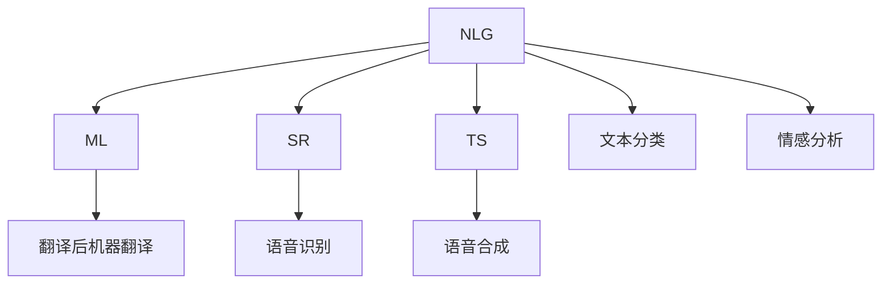

                 

# 自然语言生成在内容创作中的应用：AI辅助写作

> 关键词：自然语言生成, 内容创作, AI辅助写作, 对话生成, 自动摘要, 智能生成新闻, 文学创作, 企业报告

## 1. 背景介绍

### 1.1 问题由来

随着人工智能技术的快速发展，自然语言生成(Natural Language Generation, NLG)在内容创作领域的应用日益广泛。从自动摘要、智能生成新闻到文学创作，AI辅助写作技术正在深刻改变传统的创作方式，推动内容生产流程的自动化和智能化。

然而，尽管AI辅助写作技术在内容创作上展现了巨大潜力，但仍存在诸多挑战和限制。例如，生成的内容质量参差不齐，模型难以理解复杂语义，对特定领域知识的掌握有限等问题。本文将系统介绍自然语言生成技术在内容创作中的应用，并对现有技术进行全面分析。

### 1.2 问题核心关键点

自然语言生成在内容创作中的应用，主要集中在以下几个方面：

1. 对话生成：通过模型生成与用户的交互对话，提升用户体验，如智能客服、虚拟助手等。
2. 自动摘要：将长篇文本自动压缩为简洁摘要，提高阅读效率，如新闻摘要、报告摘要等。
3. 智能生成新闻：根据给定信息自动生成新闻报道，提升内容生成速度，如新闻写作机器人。
4. 文学创作：生成具有一定文采和逻辑的文学作品，如诗歌、小说等。
5. 企业报告：自动生成公司财报、市场分析报告等，辅助决策支持。

这些应用涵盖了从日常生活到企业运营的多个领域，展现了AI辅助写作技术的强大潜力和广阔前景。

## 2. 核心概念与联系

### 2.1 核心概念概述

为更好地理解自然语言生成技术在内容创作中的应用，本节将介绍几个关键概念：

- 自然语言生成(NLG)：指使用计算机模型自动生成自然语言文本的过程。常见的应用包括对话生成、自动摘要、新闻生成等。
- 机器翻译(ML)：指使用计算机模型将一种语言的文本翻译成另一种语言的过程。常见的应用包括即时翻译、文档翻译等。
- 语音识别(SR)：指使用计算机模型将语音信号转换成文本的过程。常见的应用包括智能音箱、语音助手等。
- 语音合成(TS)：指使用计算机模型将文本转换成语音信号的过程。常见的应用包括语音导航、智能客服等。
- 文本分类：指使用计算机模型将文本分为不同类别的任务。常见的应用包括新闻分类、垃圾邮件过滤等。
- 情感分析：指使用计算机模型分析文本中情感倾向的任务。常见的应用包括舆情监测、用户情绪分析等。

这些核心概念之间的逻辑关系可以通过以下Mermaid流程图来展示：



这个流程图展示了自然语言生成与其他几个关键NLP技术的联系：

1. 自然语言生成与机器翻译互相补充，可以互相提高效率。
2. 自然语言生成与语音识别、语音合成结合，实现语音-文本-语音的完整闭环。
3. 自然语言生成可以与文本分类、情感分析等任务融合，实现多模态内容创作。

## 3. 核心算法原理 & 具体操作步骤

### 3.1 算法原理概述

自然语言生成技术基于深度学习模型，包括序列到序列(Seq2Seq)模型、变分自编码器(VAE)、生成对抗网络(GAN)等。其核心思想是，通过学习大量自然语言文本数据，模型自动掌握语言规律和表达技巧，进而生成具有语义连贯和逻辑合理的新文本。

形式化地，设 $X$ 为输入文本， $Y$ 为生成文本，则自然语言生成模型 $P_{\theta}(Y|X)$ 的训练目标是最小化数据分布 $P_{data}(X,Y)$ 与模型生成分布 $P_{\theta}(X,Y)$ 之间的KL散度：

$$
\min_{\theta} KL(P_{data}(X,Y) || P_{\theta}(X,Y))
$$

其中，$K$ 为KL散度，$L$ 为交叉熵损失。

### 3.2 算法步骤详解

自然语言生成技术在内容创作中的应用，主要包括以下几个步骤：

**Step 1: 准备数据集**
- 收集目标任务的数据集，如对话数据、新闻数据、报告数据等。
- 进行数据预处理，包括文本清洗、分词、词向量转换等。

**Step 2: 设计模型架构**
- 选择合适的深度学习模型架构，如Seq2Seq模型、Transformer模型等。
- 设计模型的输入输出接口，如token embedding、decoding策略等。

**Step 3: 模型训练**
- 使用准备好的数据集训练模型，通过前向传播和反向传播更新模型参数。
- 监控训练过程中的各种指标，如loss、bleu、rouge等。
- 根据需求调整训练策略，如调整学习率、批次大小、正则化参数等。

**Step 4: 模型评估与优化**
- 在测试集上评估模型生成文本的质量，如BLEU、ROUGE等指标。
- 根据评估结果调整模型架构或训练策略，进一步提升生成效果。

**Step 5: 内容创作**
- 将模型应用于实际创作场景，生成目标内容。
- 根据需要进行后处理，如去重、润色、格式化等。

### 3.3 算法优缺点

自然语言生成技术在内容创作中的应用具有以下优点：

1. 自动化程度高：可以自动化生成大量文本内容，提高生产效率。
2. 质量逐步提升：随着数据量的增加和模型的优化，生成的内容质量逐步提升。
3. 适用场景广泛：适用于各种文本创作任务，如对话、新闻、报告、文学等。
4. 灵活性高：可以根据具体需求进行模型定制和调整。

然而，该技术也存在一些局限性：

1. 依赖高质量数据：生成效果依赖于训练数据的质量和多样性，数据质量较差时生成效果可能不佳。
2. 缺乏人类创意：生成的内容缺乏人类的独特视角和创意，难以完全替代人类创作。
3. 鲁棒性不足：生成的内容在特定领域或场景下可能不具有通用性，鲁棒性有待提高。
4. 可解释性不足：模型生成的文本缺乏明确的推理路径和解释，难以进行调试和优化。

尽管存在这些局限性，自然语言生成技术在内容创作中的应用潜力依然巨大。未来需要进一步探索优化模型结构、改进训练策略、增强可解释性等方向，以克服现有挑战。

### 3.4 算法应用领域

自然语言生成技术在内容创作中的应用已经覆盖了多个领域，例如：

- 智能客服：自动生成客户对话内容，提高响应速度和客户满意度。
- 自动摘要：自动生成新闻、报告等长篇文本的简洁摘要，提高阅读效率。
- 智能写作：自动生成新闻报道、企业报告、学术论文等文本内容，辅助创作。
- 文学创作：生成诗歌、小说等文学作品，拓展创作灵感。
- 广告文案：自动生成广告文案和营销文本，提升品牌宣传效果。

随着技术的不断发展，自然语言生成技术将在更多领域得到应用，为内容创作带来新的变革。

## 4. 数学模型和公式 & 详细讲解 & 举例说明

### 4.1 数学模型构建

自然语言生成模型的构建，通常采用Seq2Seq框架，包括编码器(Encoder)和解码器(Decoder)。其中，编码器负责将输入文本转换为固定长度的向量表示，解码器则根据该向量生成目标文本。

设输入文本 $X = (x_1, x_2, ..., x_n)$，目标文本 $Y = (y_1, y_2, ..., y_m)$，编码器输出为 $H = (h_1, h_2, ..., h_n)$，解码器输出为 $S = (s_1, s_2, ..., s_m)$。模型结构如下：

```
input -> Encoder -> H -> Decoder -> output
```

其中，Encoder和Decoder可以采用不同的网络结构，如RNN、LSTM、GRU、Transformer等。

### 4.2 公式推导过程

以Transformer模型为例，其解码器部分包括多头自注意力机制、点积注意力机制、位置编码、残差连接、层归一化等模块。其计算过程可以表示为：

$$
s_t = \mathop{\arg\min}_{s_t} \ell(s_t, y_t)
$$

其中，$s_t$ 为解码器在时间步 $t$ 的输出，$\ell$ 为损失函数。

在解码器中，每个时间步的输出 $s_t$ 可以表示为：

$$
s_t = \sum_{i=1}^n \alpha_{it} h_i + c_t
$$

其中，$\alpha_{it}$ 为解码器输出 $s_t$ 与编码器输出 $h_i$ 之间的注意力权重，$c_t$ 为位置编码向量。

### 4.3 案例分析与讲解

以对话生成为例，设对话数据集为 $D = \{(x_i, y_i)\}_{i=1}^N$，其中 $x_i$ 为输入，$y_i$ 为输出。模型结构如下：

```
input -> Encoder -> Attention -> Decoder -> output
```

编码器输出 $H$ 为固定长度的向量表示，解码器使用自注意力机制生成 $s_t$，目标输出为 $y_t$。模型训练时，目标为最小化生成输出与真实输出的差异。

以下是一个使用Transformer模型进行对话生成的示例代码：

```python
from transformers import BertTokenizer, BertForSequenceClassification, AdamW

tokenizer = BertTokenizer.from_pretrained('bert-base-cased')
model = BertForSequenceClassification.from_pretrained('bert-base-cased')

input_ids = tokenizer.encode(input_text, add_special_tokens=True)
attention_mask = [1] * len(input_ids)

optimizer = AdamW(model.parameters(), lr=2e-5)

output = model(input_ids, attention_mask=attention_mask)
loss = output.loss
loss.backward()
optimizer.step()
```

以上代码展示了使用Bert模型进行对话生成的基本流程。通过逐步优化模型结构、调整超参数、增加数据多样性等手段，可以逐步提升模型生成对话的质量。

## 5. 项目实践：代码实例和详细解释说明

### 5.1 开发环境搭建

在进行自然语言生成实践前，我们需要准备好开发环境。以下是使用Python进行TensorFlow开发的环境配置流程：

1. 安装Anaconda：从官网下载并安装Anaconda，用于创建独立的Python环境。

2. 创建并激活虚拟环境：
```bash
conda create -n tf-env python=3.8 
conda activate tf-env
```

3. 安装TensorFlow：根据CUDA版本，从官网获取对应的安装命令。例如：
```bash
conda install tensorflow -c pytorch -c conda-forge
```

4. 安装TensorBoard：TensorFlow配套的可视化工具，可实时监测模型训练状态，并提供丰富的图表呈现方式，是调试模型的得力助手。

5. 安装各类工具包：
```bash
pip install numpy pandas scikit-learn matplotlib tqdm jupyter notebook ipython
```

完成上述步骤后，即可在`tf-env`环境中开始自然语言生成任务的开发。

### 5.2 源代码详细实现

这里我们以新闻生成为例，给出使用TensorFlow进行自然语言生成的PyTorch代码实现。

首先，定义新闻生成任务的数据处理函数：

```python
import tensorflow as tf
from tensorflow.keras.preprocessing.text import Tokenizer
from tensorflow.keras.preprocessing.sequence import pad_sequences

class NewsDataset(tf.data.Dataset):
    def __init__(self, texts, titles):
        self.texts = texts
        self.titles = titles
        self.tokenizer = Tokenizer(num_words=10000)
        self.tokenizer.fit_on_texts(self.texts)
        self.text_sequences = self.tokenizer.texts_to_sequences(self.texts)
        self.title_sequences = self.tokenizer.texts_to_sequences(self.titles)
        
    def __len__(self):
        return len(self.text_sequences)
    
    def __getitem__(self, item):
        text_sequence = self.text_sequences[item]
        title_sequence = self.title_sequences[item]
        return {
            'input': pad_sequences(text_sequence, maxlen=200, padding='post'),
            'title': pad_sequences(title_sequence, maxlen=20, padding='post'),
            'labels': self.title_sequences[item]
        }

# 加载数据集
train_dataset = NewsDataset(train_texts, train_titles)
dev_dataset = NewsDataset(dev_texts, dev_titles)
test_dataset = NewsDataset(test_texts, test_titles)

# 定义模型架构
def build_model(input_dim, output_dim):
    model = tf.keras.Sequential([
        tf.keras.layers.Embedding(input_dim, 128, input_length=200),
        tf.keras.layers.LSTM(128, return_sequences=True),
        tf.keras.layers.Dense(64, activation='relu'),
        tf.keras.layers.Dense(output_dim, activation='softmax')
    ])
    return model

# 加载模型
model = build_model(input_dim=10000, output_dim=10000)
model.summary()

# 定义优化器和损失函数
optimizer = tf.keras.optimizers.Adam()
loss = tf.keras.losses.SparseCategoricalCrossentropy(from_logits=True)

# 定义训练函数
@tf.function
def train_step(inputs, labels):
    with tf.GradientTape() as tape:
        predictions = model(inputs, training=True)
        loss_value = loss(labels, predictions)
    gradients = tape.gradient(loss_value, model.trainable_variables)
    optimizer.apply_gradients(zip(gradients, model.trainable_variables))
    return loss_value

# 训练模型
epochs = 10
batch_size = 32

for epoch in range(epochs):
    total_loss = 0
    for batch in tqdm(dataset):
        inputs, title, labels = batch
        loss = train_step(inputs, labels)
        total_loss += loss
    
    print(f"Epoch {epoch+1}, loss: {total_loss/len(dataset)}")
    
# 评估模型
@tf.function
def evaluate(inputs, labels):
    predictions = model(inputs, training=False)
    loss_value = loss(labels, predictions)
    return loss_value

# 测试集评估
test_dataset = NewsDataset(test_texts, test_titles)
test_loss = evaluate(test_dataset)
print(f"Test loss: {test_loss}")
```

以上代码展示了使用TensorFlow进行新闻生成的基本流程。通过逐步优化模型结构、调整超参数、增加数据多样性等手段，可以逐步提升模型生成新闻的质量。

### 5.3 代码解读与分析

让我们再详细解读一下关键代码的实现细节：

**NewsDataset类**：
- `__init__`方法：初始化文本和标题数据，进行分词并转换为序列，同时生成tokenizer。
- `__len__`方法：返回数据集长度。
- `__getitem__`方法：对单个样本进行处理，将文本和标题序列化为固定长度，并进行填充。

**build_model函数**：
- 定义模型架构，包括嵌入层、LSTM层、全连接层和softmax层。
- 调用模型自带的summary方法，展示模型结构。

**train_step函数**：
- 定义前向传播和反向传播过程，计算损失值，更新模型参数。
- 使用tf.GradientTape记录梯度，以便自动求导。

**evaluate函数**：
- 定义前向传播和反向传播过程，计算损失值，输出评估结果。

**训练流程**：
- 定义总的epoch数和批次大小，开始循环迭代
- 每个epoch内，在训练集上训练，输出平均loss
- 在测试集上评估，输出模型评估结果

可以看到，TensorFlow提供的高阶API和丰富的模型组件，使得自然语言生成代码实现变得简洁高效。开发者可以专注于模型设计、数据处理等核心任务，而不必过多关注底层实现细节。

当然，工业级的系统实现还需考虑更多因素，如模型的保存和部署、超参数的自动搜索、更灵活的任务适配层等。但核心的自然语言生成范式基本与此类似。

## 6. 实际应用场景

### 6.1 智能客服系统

基于自然语言生成技术的智能客服系统，正在逐步改变传统客服模式。系统通过学习历史对话数据，自动生成客户对话内容，实时回复客户咨询。智能客服系统可以7x24小时不间断服务，快速响应客户需求，提升客户满意度。

### 6.2 自动摘要

自动摘要技术在新闻报道、学术论文等长文本中的应用非常广泛。通过模型学习文本结构和内容，自动生成简洁摘要，提高阅读效率。自动化摘要技术可以用于自动化新闻、研究报告等长篇文本的摘要生成，提升信息获取速度。

### 6.3 广告文案

广告文案是企业品牌推广的重要工具。通过自然语言生成技术，自动生成有吸引力的广告文案，提升广告效果。根据不同目标用户的特征和需求，模型自动生成符合用户期望的广告内容，提高广告投放的精准度和转化率。

### 6.4 文学创作

自然语言生成技术在文学创作中的应用日益广泛。通过学习大量文学作品，模型自动生成具有一定文采和逻辑的文学作品，拓展创作灵感。自动生成的文学作品可以用于辅助创作、小说生成、诗歌创作等，提升创作效率。

### 6.5 企业报告

企业报告是决策支持的重要工具。通过自然语言生成技术，自动生成公司财报、市场分析报告等文本内容，辅助决策支持。自动生成的企业报告可以用于企业内部管理、股东报告、市场分析等，提高决策效率和准确性。

## 7. 工具和资源推荐

### 7.1 学习资源推荐

为了帮助开发者系统掌握自然语言生成技术的理论基础和实践技巧，这里推荐一些优质的学习资源：

1. 《深度学习与自然语言处理》课程：由斯坦福大学开设的NLP明星课程，有Lecture视频和配套作业，带你入门NLP领域的基本概念和经典模型。

2. 《自然语言处理综述》书籍：介绍了自然语言处理的基本概念、核心技术和应用，是一本非常全面的NLP入门书籍。

3. 《Attention is All You Need》论文：Transformer模型的原始论文，介绍了Transformer的基本原理和应用，是深度学习领域的经典之作。

4. 《Transformers》书籍：HuggingFace开发的NLP工具库的官方文档，详细介绍了使用Transformer进行NLP任务开发的实践经验。

5. CLUE开源项目：中文语言理解测评基准，涵盖大量不同类型的中文NLP数据集，并提供了基于自然语言生成的baseline模型，助力中文NLP技术发展。

通过对这些资源的学习实践，相信你一定能够快速掌握自然语言生成技术的精髓，并用于解决实际的NLP问题。

### 7.2 开发工具推荐

高效的开发离不开优秀的工具支持。以下是几款用于自然语言生成开发的常用工具：

1. TensorFlow：由Google主导开发的开源深度学习框架，生产部署方便，适合大规模工程应用。提供了丰富的NLP组件，如Transformer、Bert等。

2. PyTorch：基于Python的开源深度学习框架，灵活动态的计算图，适合快速迭代研究。提供丰富的NLP组件，如LSTM、GRU等。

3. Weights & Biases：模型训练的实验跟踪工具，可以记录和可视化模型训练过程中的各项指标，方便对比和调优。与主流深度学习框架无缝集成。

4. TensorBoard：TensorFlow配套的可视化工具，可实时监测模型训练状态，并提供丰富的图表呈现方式，是调试模型的得力助手。

5. Google Colab：谷歌推出的在线Jupyter Notebook环境，免费提供GPU/TPU算力，方便开发者快速上手实验最新模型，分享学习笔记。

合理利用这些工具，可以显著提升自然语言生成任务的开发效率，加快创新迭代的步伐。

### 7.3 相关论文推荐

自然语言生成技术的发展源于学界的持续研究。以下是几篇奠基性的相关论文，推荐阅读：

1. Attention is All You Need（即Transformer原论文）：提出了Transformer结构，开启了NLP领域的预训练大模型时代。

2. Generating Sequences with Recurrent Neural Networks：提出了基于RNN的文本生成模型，是深度学习模型在自然语言生成领域应用的经典之作。

3. Language Modeling with Transformers：介绍了使用Transformer进行语言建模的方法，展示了Transformer在自然语言生成任务上的优势。

4. Neural Machine Translation by Jointly Learning to Align and Translate：提出了使用Transformer进行机器翻译的方法，展示了Transformer在序列生成任务上的优越性。

5. The Transformer Is All You Need for Generating Context-Aware Responses in Conversational AI：介绍了使用Transformer进行对话生成的方法，展示了Transformer在生成任务上的应用潜力。

这些论文代表了大语言生成技术的发展脉络。通过学习这些前沿成果，可以帮助研究者把握学科前进方向，激发更多的创新灵感。

## 8. 总结：未来发展趋势与挑战

### 8.1 总结

本文对自然语言生成技术在内容创作中的应用进行了全面系统的介绍。首先阐述了自然语言生成技术在内容创作中的重要作用，明确了其在对话生成、自动摘要、智能生成新闻、文学创作、企业报告等领域的独特价值。其次，从原理到实践，详细讲解了自然语言生成模型的数学模型和算法步骤，给出了自然语言生成任务开发的完整代码实例。同时，本文还广泛探讨了自然语言生成技术在智能客服、自动摘要、广告文案、文学创作、企业报告等多个领域的应用前景，展示了其强大的潜力和广泛的应用空间。

通过本文的系统梳理，可以看到，自然语言生成技术正在成为内容创作的重要工具，极大地提升了内容生产流程的自动化和智能化水平，推动了人工智能技术在实际应用中的落地。未来，伴随自然语言生成技术的不断进步，内容创作将更加高效、智能、个性化，为社会各行各业带来深远影响。

### 8.2 未来发展趋势

展望未来，自然语言生成技术将呈现以下几个发展趋势：

1. 多模态生成：将语音、图像、视频等多模态信息与文本信息结合，实现更丰富、更复杂的内容生成。

2. 个性化生成：根据用户的历史行为和偏好，生成个性化的内容，提升用户满意度。

3. 实时生成：基于实时数据流，动态生成内容，提高信息的时效性和相关性。

4. 多领域应用：自然语言生成技术将在更多领域得到应用，如医疗、教育、金融等，为各行各业带来变革性影响。

5. 安全性增强：增强自然语言生成技术的安全性，避免有害内容生成，保障信息安全。

6. 可解释性提升：增强自然语言生成技术的可解释性，方便调试和优化，提高系统的可靠性。

这些趋势凸显了自然语言生成技术的广阔前景。这些方向的探索发展，必将进一步提升自然语言生成系统的性能和应用范围，为人工智能技术在实际应用中的落地提供新的思路。

### 8.3 面临的挑战

尽管自然语言生成技术已经取得了瞩目成就，但在迈向更加智能化、普适化应用的过程中，它仍面临着诸多挑战：

1. 依赖高质量数据：生成效果依赖于训练数据的质量和多样性，数据质量较差时生成效果可能不佳。

2. 缺乏人类创意：生成的内容缺乏人类的独特视角和创意，难以完全替代人类创作。

3. 鲁棒性不足：生成的内容在特定领域或场景下可能不具有通用性，鲁棒性有待提高。

4. 可解释性不足：模型生成的文本缺乏明确的推理路径和解释，难以进行调试和优化。

5. 安全性问题：生成的内容可能包含有害信息、偏见等，给实际应用带来安全隐患。

6. 计算资源消耗大：自然语言生成模型参数量巨大，计算资源消耗高，限制了其在实际应用中的部署。

这些挑战需要研究者不断探索和优化，才能进一步推动自然语言生成技术的发展。只有不断克服这些挑战，才能实现自然语言生成技术在更广泛的应用场景中的落地。

### 8.4 研究展望

面对自然语言生成技术所面临的种种挑战，未来的研究需要在以下几个方面寻求新的突破：

1. 探索无监督和半监督生成方法：摆脱对大规模标注数据的依赖，利用自监督学习、主动学习等方法，最大限度利用非结构化数据，实现更加灵活高效的生成。

2. 研究参数高效和计算高效的生成范式：开发更加参数高效的生成方法，在固定大部分预训练参数的同时，只更新极少量的生成相关参数。同时优化生成模型的计算图，减少前向传播和反向传播的资源消耗，实现更加轻量级、实时性的部署。

3. 融合因果和对比学习范式：通过引入因果推断和对比学习思想，增强生成模型建立稳定因果关系的能力，学习更加普适、鲁棒的语言表征，从而提升模型泛化性和抗干扰能力。

4. 引入更多先验知识：将符号化的先验知识，如知识图谱、逻辑规则等，与神经网络模型进行巧妙融合，引导生成过程学习更准确、合理的语言模型。同时加强不同模态数据的整合，实现视觉、语音等多模态信息与文本信息的协同建模。

5. 结合因果分析和博弈论工具：将因果分析方法引入生成模型，识别出模型决策的关键特征，增强输出解释的因果性和逻辑性。借助博弈论工具刻画人机交互过程，主动探索并规避模型的脆弱点，提高系统稳定性。

6. 纳入伦理道德约束：在模型训练目标中引入伦理导向的评估指标，过滤和惩罚有害的输出倾向。同时加强人工干预和审核，建立模型行为的监管机制，确保输出符合人类价值观和伦理道德。

这些研究方向的探索，必将引领自然语言生成技术迈向更高的台阶，为构建安全、可靠、可解释、可控的智能系统铺平道路。面向未来，自然语言生成技术还需要与其他人工智能技术进行更深入的融合，如知识表示、因果推理、强化学习等，多路径协同发力，共同推动自然语言生成系统的进步。只有勇于创新、敢于突破，才能不断拓展自然语言生成的边界，让智能技术更好地造福人类社会。

## 9. 附录：常见问题与解答

**Q1：自然语言生成技术可以替代人类创作吗？**

A: 自然语言生成技术可以在一定程度上辅助创作，但无法完全替代人类创作。人类具有独特的创造力和想象力，能够根据复杂环境和情感变化，生成具有高度独特性和创新性的内容。自然语言生成技术虽然可以生成高质量的文本，但在创造性和情感表达方面仍存在不足，难以完全替代人类的创作。

**Q2：自然语言生成技术有哪些优缺点？**

A: 自然语言生成技术在内容创作中的应用具有以下优点：

1. 自动化程度高：可以自动化生成大量文本内容，提高生产效率。
2. 质量逐步提升：随着数据量的增加和模型的优化，生成的内容质量逐步提升。
3. 适用场景广泛：适用于各种文本创作任务，如对话、新闻、报告、文学等。
4. 灵活性高：可以根据具体需求进行模型定制和调整。

然而，该技术也存在一些局限性：

1. 依赖高质量数据：生成效果依赖于训练数据的质量和多样性，数据质量较差时生成效果可能不佳。
2. 缺乏人类创意：生成的内容缺乏人类的独特视角和创意，难以完全替代人类创作。
3. 鲁棒性不足：生成的内容在特定领域或场景下可能不具有通用性，鲁棒性有待提高。
4. 可解释性不足：模型生成的文本缺乏明确的推理路径和解释，难以进行调试和优化。

尽管存在这些局限性，自然语言生成技术在内容创作中的应用潜力依然巨大。未来需要进一步探索优化模型结构、改进训练策略、增强可解释性等方向，以克服现有挑战。

**Q3：自然语言生成技术在智能客服中的应用如何？**

A: 自然语言生成技术在智能客服中的应用非常广泛。系统通过学习历史对话数据，自动生成客户对话内容，实时回复客户咨询。智能客服系统可以7x24小时不间断服务，快速响应客户需求，提升客户满意度。通过自然语言生成技术，系统可以根据客户的问题和历史行为，自动生成符合客户期望的回答，提高客服效率和质量。

**Q4：自然语言生成技术在文学创作中的应用如何？**

A: 自然语言生成技术在文学创作中的应用日益广泛。通过学习大量文学作品，模型自动生成具有一定文采和逻辑的文学作品，拓展创作灵感。自动生成的文学作品可以用于辅助创作、小说生成、诗歌创作等，提升创作效率。自然语言生成技术可以为文学创作提供新的思路和工具，帮助作家探索更多可能性，促进文学创新和多样化。

**Q5：自然语言生成技术在企业报告中的应用如何？**

A: 自然语言生成技术在企业报告中的应用非常广泛。通过自然语言生成技术，自动生成公司财报、市场分析报告等文本内容，辅助决策支持。自动生成的企业报告可以用于企业内部管理、股东报告、市场分析等，提高决策效率和准确性。通过自然语言生成技术，系统可以根据不同目标用户的特征和需求，生成符合用户期望的报告内容，提升报告的针对性和可读性。

---

作者：禅与计算机程序设计艺术 / Zen and the Art of Computer Programming

