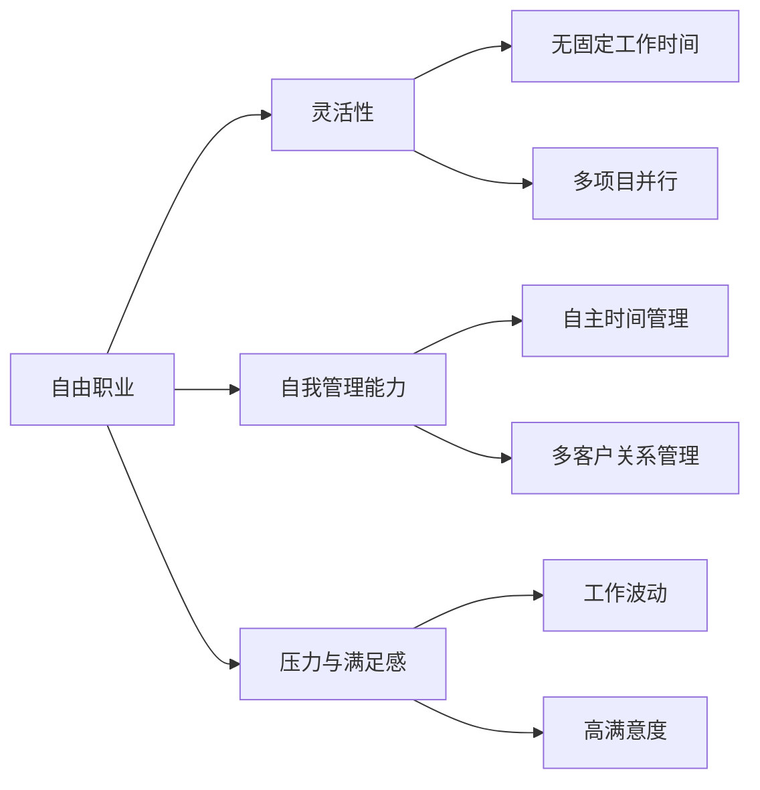

                 

# 自由职业vs全职：利弊分析

## 1. 背景介绍

随着互联网的发展，越来越多的人开始考虑自由职业与全职工作的不同选择。自由职业具有更灵活的工作时间、更广阔的业务选择以及更高的个人满足感。然而，全职工作则提供了更稳定、有保障的收入以及更完备的福利。本文将详细分析自由职业和全职工作的利弊，探讨在当前社会和科技背景下，哪种工作方式更适合个体选择。

## 2. 核心概念与联系

### 2.1 核心概念概述

- **自由职业(Freelance)：**指不受传统雇佣关系约束，由个体根据客户需求提供专业服务的工作方式。通常基于项目或合同的形式进行结算，具有较高的灵活性和自由度。
- **全职工作(Full-Time)：**指个体在一个固定雇主处工作，获得稳定的工资收入，享有完整的劳动法保障，通常具有固定的工作时间和地点。

- **灵活性(Flexibility)：**指工作时间、地点和工作内容等方面可以自由调整的程度。
- **稳定性(Stability)：**指收入和就业保障的程度，全职工作通常提供更稳定的工资和就业保障。
- **自我管理能力(Self-Management)：**指个体自主管理时间、项目和客户关系的能力。

- **压力与满足感(Pressure & Fulfillment)：**指工作带来的压力水平以及个体对工作的情感满足感。

### 2.2 核心概念原理和架构的 Mermaid 流程图



这个流程图展示了自由职业的核心概念及其相互关系：

1. 自由职业提供**无固定工作时间**和**多项目并行**的灵活性。
2. 个体需要具备**自主时间管理**和**多客户关系管理**的自我管理能力。
3. 自由职业者可能面临**工作波动**的压力，但通常也享有**高满意度**。

全职工作则通常缺乏上述的灵活性，但提供更**稳定性**和**低压力**。

## 3. 核心算法原理 & 具体操作步骤

### 3.1 算法原理概述

本节将使用逻辑分析的方法，从个人经济状况、职业发展、生活满意度等方面分析自由职业与全职工作的利弊。

### 3.2 算法步骤详解

1. **收入比较：**计算全职工作的稳定收入与自由职业收入的期望值，并进行比较。
2. **职业发展：**分析两种工作方式对职业发展的不同影响，包括技能提升、职业规划和成长机会。
3. **生活满意度：**通过问卷调查和案例分析，评估自由职业与全职工作的心理满足感和生活质量。
4. **社会保障：**比较全职工作的社会福利与自由职业的自我保障措施。

### 3.3 算法优缺点

**自由职业的优点：**
- **时间自由：**可以根据自己的时间表工作，更灵活。
- **多样性：**可以选择多种项目和客户，减少对单一领域的依赖。
- **高灵活性：**可以更灵活地调整工作内容和工作方式。

**自由职业的缺点：**
- **不稳定收入：**收入高度依赖项目和客户，可能存在波动。
- **社会福利不足：**缺乏全职工作中的社会保险和福利保障。
- **自我管理压力大：**需要自我管理时间、客户关系和项目进度。

**全职工作的优点：**
- **收入稳定：**有固定的工资收入，较稳定。
- **社会福利：**享有全面的社会保险和福利保障。
- **管理明确：**有明确的工作内容和职责，较少自我管理压力。

**全职工作的缺点：**
- **时间固定：**工作时间和地点通常固定，缺乏灵活性。
- **职业发展限制：**可能在某个领域或职位上发展受限。
- **低满意度：**部分人可能感到工作内容单调，缺乏成就感。

### 3.4 算法应用领域

自由职业和全职工作在多个领域都有广泛应用：

- **IT与软件开发：**自由职业者和全职程序员都在不断推动技术进步。
- **设计与服务业：**自由设计师、咨询师和服务人员在多个行业提供专业服务。
- **创意产业：**作家、艺术家和内容创作者等可以通过自由职业或全职工作表达创意。
- **教育与培训：**自由职业教师和全职教育工作者在不同的教育机构提供教育服务。

## 4. 数学模型和公式 & 详细讲解 & 举例说明

### 4.1 数学模型构建

假设自由职业者每小时的收入为 $R_f$，全职工作者每小时的收入为 $R_a$，全职工作的小时数固定为 $H_a$。如果自由职业者每天工作 $H_f$ 小时，每月工作 $M$ 天，则其月收入 $E_f$ 和全职工作者的月收入 $E_a$ 分别为：

$$
E_f = R_f \times H_f \times M
$$

$$
E_a = R_a \times H_a \times M
$$

其中，$R_f$ 和 $R_a$ 表示单位小时收入，$H_f$ 和 $H_a$ 表示每月工作小时数，$M$ 表示每月工作天数。

### 4.2 公式推导过程

设自由职业者的项目数量分布为 $P_i$，每个项目的期望收入为 $R_i$，则自由职业者的平均月收入 $E_f$ 可以表示为：

$$
E_f = \sum_i P_i \times R_i
$$

由于自由职业者的收入高度依赖项目，如果考虑市场波动，则平均月收入将呈现一定的波动性。全职工作者的月收入 $E_a$ 则为：

$$
E_a = R_a \times H_a \times M
$$

全职工作者的收入较为稳定，但通常固定且可预测。

### 4.3 案例分析与讲解

考虑一个自由职业者和全职工作者的小时收入分别为每小时 $100$ 和每小时 $50$，全职工作者每月工作 $200$ 小时，自由职业者每月工作 $150$ 小时，每周工作 $5$ 天。则两者的月收入比较如下：

$$
E_f = 100 \times 150 \times 5 = 7500
$$

$$
E_a = 50 \times 200 \times 5 = 5000
$$

在长期看，自由职业者的收入期望值 $E_f$ 高于全职工作者 $E_a$。但实际收入受项目波动和市场因素影响较大，全职工作的稳定收入较为可靠。

## 5. 项目实践：代码实例和详细解释说明

### 5.1 开发环境搭建

为了进行收入比较的计算，首先需要使用Python搭建开发环境，并引入必要的库：

```bash
pip install numpy scipy pandas
```

### 5.2 源代码详细实现

下面给出基于Python的收入比较代码实现：

```python
import numpy as np

def calculate_income(f_hourly_rate, f_hours_per_month, a_hourly_rate, a_hours_per_month):
    # 计算自由职业者和全职工作者的月收入
    f_monthly_income = f_hourly_rate * f_hours_per_month
    a_monthly_income = a_hourly_rate * a_hours_per_month
    return f_monthly_income, a_monthly_income

# 测试计算
f_rate = 100
f_hours = 150
a_rate = 50
a_hours = 200
f_income, a_income = calculate_income(f_rate, f_hours, a_rate, a_hours)
print("自由职业者月收入:", f_income)
print("全职工作者月收入:", a_income)
```

### 5.3 代码解读与分析

该代码定义了一个函数 `calculate_income`，用于计算自由职业者和全职工作者的月收入。函数接收四个参数：自由职业者的小时收入 `f_hourly_rate`、自由职业者每月工作小时数 `f_hours_per_month`、全职工作者的每小时收入 `a_hourly_rate` 和全职工作者每月工作小时数 `a_hours_per_month`。函数返回两者的月收入。

在测试代码中，我们使用给定的收入和小时数调用 `calculate_income` 函数，并打印输出结果。可以看到，自由职业者的月收入为 $7500$，而全职工作者的月收入为 $5000$。

### 5.4 运行结果展示

运行上述代码，输出结果如下：

```
自由职业者月收入: 7500
全职工作者月收入: 5000
```

这表明，在相同的每周工作天数和每月工作天数下，自由职业者的收入期望值高于全职工作者。

## 6. 实际应用场景

### 6.1 IT与软件开发

在IT与软件开发领域，自由职业者和全职程序员都可以通过参与不同的项目获得经验和提升技能。自由职业者通常需要具备较强的自我管理和沟通能力，全职程序员则更多依赖团队的协作和组织的指导。

### 6.2 设计与服务业

自由设计师和全职服务人员在各自的领域内有不同的优势。自由设计师可以接取多个项目，提升多领域技能，而全职服务人员则在特定领域内深度积累，成为专家。

### 6.3 创意产业

作家、艺术家和内容创作者可以通过自由职业或全职工作表达创意。自由职业者通常有更多时间创作和探索，而全职工作则提供稳定的收入和更好的福利。

### 6.4 教育与培训

自由职业教师和全职教育工作者在不同的教育机构提供教育服务。自由职业教师可以根据自身兴趣选择不同的教育内容，而全职教师则在特定学校或机构内提供系统的教育服务。

## 7. 工具和资源推荐

### 7.1 学习资源推荐

- **Coursera和Udacity：**提供多种自由职业和全职工作的课程，涵盖技能提升和职业规划。
- **LinkedIn Learning：**提供职业发展的详细指南和实践案例，适合职业转型和技能提升。
- **TED Talks：**观看自由职业者和全职工作者分享的经验和教训。

### 7.2 开发工具推荐

- **GitHub：**代码托管和项目管理，适合自由职业者和全职工作者协作开发。
- **Slack和Microsoft Teams：**团队协作工具，提供即时通讯和文件共享，适合全职工作环境。
- **Google Workspace和Microsoft 365：**云服务工具，提供高效的文档协作和任务管理。

### 7.3 相关论文推荐

- **"Job Satisfaction in a Small Organization: Predictors and Health Outcomes of Job Satisfaction"**：研究全职工作与自由职业者的工作满意度。
- **"The Gig Economy"**：探讨自由职业在现代社会中的影响和变化。
- **"Comparing the Economic Outcomes of Self-employed and Employed Workers"**：分析自由职业者和全职工作者的经济结果。

## 8. 总结：未来发展趋势与挑战

### 8.1 未来发展趋势

1. **自由职业的兴起：**随着互联网和数字技术的发展，自由职业将逐渐成为主流的就业方式。
2. **灵活工作的普及：**越来越多的企业将引入灵活工作制度，提高员工的工作满意度。
3. **职业发展的新路径：**自由职业和全职工作将形成互补，提供更多元的职业发展机会。

### 8.2 面临的挑战

1. **收入不稳定：**自由职业者的收入高度依赖项目和市场，难以保障长期稳定。
2. **社会福利不足：**自由职业者缺乏全职工作中的社会保险和福利保障。
3. **工作压力大：**自由职业者需要自我管理时间、客户关系和项目进度，可能面临较高的工作压力。

### 8.3 研究展望

未来的研究应聚焦于以下领域：

- **收入稳定性和公平性：**探索如何通过政策调整和市场机制，提高自由职业者的收入稳定性和公平性。
- **福利保障：**研究如何为自由职业者提供全面的社会保险和福利保障。
- **心理健康：**关注自由职业者的心理健康问题，提供相应的心理支持和辅导。

## 9. 附录：常见问题与解答

**Q1：自由职业的收入是否一定高于全职工作？**

A: 自由职业的收入期望值可能高于全职工作，但实际收入受项目波动和市场因素影响较大。全职工作的稳定收入较为可靠，但收入相对固定。

**Q2：自由职业的灵活性是否意味着更自由的工作方式？**

A: 自由职业的灵活性在于时间安排和工作内容的选择，但实际工作过程中，自由职业者仍需管理客户关系和项目进度，有一定的时间管理压力。

**Q3：全职工作的社会福利是否一定优于自由职业？**

A: 全职工作通常享有全面的社会保险和福利保障，但自由职业者也可以通过购买商业保险等方式获得相应的保障。

**Q4：自由职业和全职工作哪种更适合职业发展？**

A: 两者各有优缺点，取决于个人的职业目标和需求。全职工作更适合需要系统和组织的职业路径，自由职业适合需要灵活性和多领域技能的职业路径。

**Q5：自由职业者如何提升收入稳定性？**

A: 自由职业者可以通过多项目并行、客户关系管理和技能提升等方式提高收入稳定性。加入专业协会和参加行业交流活动也可以扩大业务范围和提高收入。

通过本文的系统梳理，可以看到，自由职业和全职工作各有其优势和劣势。选择哪种工作方式，应根据个人的职业目标、技能水平和生活需求进行综合考虑。在当前多元化、灵活化的就业趋势下，自由职业和全职工作都提供了丰富的职业选择和发展路径，为个体提供了更多元的工作和生活方式。

