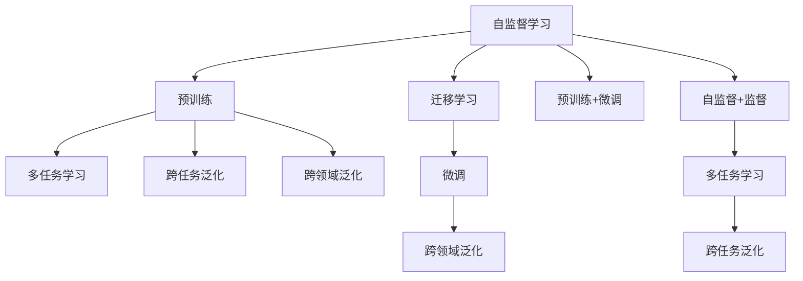

                 

# 自监督学习的迁移学习能力:跨任务和跨领域的泛化

> 关键词：自监督学习,迁移学习,预训练,跨任务泛化,跨领域泛化,Transformer

## 1. 背景介绍

### 1.1 问题由来

随着深度学习技术的快速发展和计算资源的不断增加，自监督学习（Self-Supervised Learning, SSL）成为了一种高效的学习范式，特别在NLP领域。自监督学习通过利用大规模的无标签数据，无需人工标注即可训练出高质量的模型。这种范式使得模型能够学习到更广泛、更泛化的语言表示，在自然语言理解（Natural Language Understanding, NLU）和生成（Natural Language Generation, NLG）等方面取得了显著的成果。

然而，尽管自监督学习模型在各个任务上表现优异，但它们通常只在特定任务上进行了预训练，这种预训练模型的泛化能力受到限制。当模型应用到不同任务或领域时，其性能可能会下降。因此，如何提升自监督学习模型的跨任务和跨领域泛化能力，成为了一个重要的研究课题。

### 1.2 问题核心关键点

提升自监督学习模型的跨任务和跨领域泛化能力，主要可以从以下几个方面入手：

- **迁移学习**：利用预训练模型在大规模无标签数据上学习的通用特征，通过微调（Fine-Tuning）来适应新的任务。
- **多任务学习**：在一个训练阶段内，同时训练多个相关任务，使模型能够在不同的任务之间进行特征共享。
- **预训练+微调**：在大规模无标签数据上进行预训练，然后针对特定任务进行微调，以提升模型在特定任务上的表现。
- **多领域学习**：在多个领域的数据上同时进行预训练，使模型能够更好地适应新的领域。
- **自监督+监督**：结合自监督学习和监督学习，使用有标签和无标签数据共同训练模型。

## 2. 核心概念与联系

### 2.1 核心概念概述

为了更好地理解自监督学习模型的跨任务和跨领域泛化能力，本节将介绍几个关键概念及其联系：

- **自监督学习（Self-Supervised Learning, SSL）**：一种利用无标签数据进行模型训练的学习范式，常见任务包括掩码语言模型、自回归语言模型等。
- **迁移学习（Transfer Learning）**：利用在特定任务上训练的模型，通过微调来适应新的任务。
- **预训练（Pre-training）**：在大规模无标签数据上预训练模型，学习通用特征。
- **多任务学习（Multi-task Learning）**：在一个训练阶段内同时训练多个任务，提升模型在不同任务上的泛化能力。
- **跨任务泛化（Cross-task Generalization）**：模型在一种任务上的学习对另一种任务的影响，如多语言模型在不同语言间的泛化。
- **跨领域泛化（Cross-domain Generalization）**：模型在一种领域上的学习对另一种领域的影响，如在不同领域的文本数据上的泛化。
- **Transformer架构**：一种深度学习架构，特别适用于自监督学习模型的构建。

这些概念之间的关系可以通过以下Mermaid流程图来展示：



这个流程图展示了自监督学习模型的学习流程及其在不同任务和领域上的应用：

1. 自监督学习模型在大规模无标签数据上进行预训练，学习通用的语言表示。
2. 预训练的模型可以用于多任务学习，提升在不同任务上的泛化能力。
3. 预训练的模型还可以通过微调来适应新的任务，提升模型性能。
4. 多任务学习模型可以应用于跨任务泛化，提升在不同任务间的泛化能力。
5. 跨领域泛化是指模型在一种领域上的学习对另一种领域的影响。
6. 自监督学习与监督学习的结合可以进一步提升模型的泛化能力。

## 3. 核心算法原理 & 具体操作步骤

### 3.1 算法原理概述

自监督学习模型的跨任务和跨领域泛化能力的提升，主要依赖于迁移学习和多任务学习。通过在大规模无标签数据上进行预训练，学习通用的语言表示，然后在新任务上进行微调或直接应用到新领域，从而提升模型在不同任务和领域上的泛化能力。

形式化地，假设预训练模型为 $M_{\theta}$，其中 $\theta$ 为预训练得到的模型参数。给定新任务 $T$ 的数据集 $D_T$，微调的目标是找到新的模型参数 $\hat{\theta}$，使得：

$$
\hat{\theta}=\mathop{\arg\min}_{\theta} \mathcal{L}(M_{\theta},D_T)
$$

其中 $\mathcal{L}$ 为针对任务 $T$ 设计的损失函数，用于衡量模型预测输出与真实标签之间的差异。常见的损失函数包括交叉熵损失、均方误差损失等。

通过梯度下降等优化算法，微调过程不断更新模型参数 $\theta$，最小化损失函数 $\mathcal{L}$，使得模型输出逼近真实标签。由于 $\theta$ 已经通过预训练获得了较好的初始化，因此即便在新任务上微调，也能较快收敛到理想的模型参数 $\hat{\theta}$。

### 3.2 算法步骤详解

自监督学习模型的跨任务和跨领域泛化能力的提升，主要包括以下几个关键步骤：

**Step 1: 准备预训练模型和数据集**
- 选择合适的预训练语言模型 $M_{\theta}$ 作为初始化参数，如BERT、GPT等。
- 准备新任务 $T$ 的标注数据集 $D_T$，划分为训练集、验证集和测试集。一般要求标注数据与预训练数据的分布不要差异过大。

**Step 2: 添加任务适配层**
- 根据任务类型，在预训练模型顶层设计合适的输出层和损失函数。
- 对于分类任务，通常在顶层添加线性分类器和交叉熵损失函数。
- 对于生成任务，通常使用语言模型的解码器输出概率分布，并以负对数似然为损失函数。

**Step 3: 设置微调超参数**
- 选择合适的优化算法及其参数，如 AdamW、SGD 等，设置学习率、批大小、迭代轮数等。
- 设置正则化技术及强度，包括权重衰减、Dropout、Early Stopping等。
- 确定冻结预训练参数的策略，如仅微调顶层，或全部参数都参与微调。

**Step 4: 执行梯度训练**
- 将训练集数据分批次输入模型，前向传播计算损失函数。
- 反向传播计算参数梯度，根据设定的优化算法和学习率更新模型参数。
- 周期性在验证集上评估模型性能，根据性能指标决定是否触发 Early Stopping。
- 重复上述步骤直到满足预设的迭代轮数或 Early Stopping 条件。

**Step 5: 测试和部署**
- 在测试集上评估微调后模型 $M_{\hat{\theta}}$ 的性能，对比微调前后的精度提升。
- 使用微调后的模型对新样本进行推理预测，集成到实际的应用系统中。
- 持续收集新的数据，定期重新微调模型，以适应数据分布的变化。

以上是自监督学习模型跨任务和跨领域泛化能力的提升的一般流程。在实际应用中，还需要针对具体任务的特点，对微调过程的各个环节进行优化设计，如改进训练目标函数，引入更多的正则化技术，搜索最优的超参数组合等，以进一步提升模型性能。

### 3.3 算法优缺点

自监督学习模型的跨任务和跨领域泛化能力具有以下优点：
1. 减少了对标注数据的依赖。自监督学习模型可以在大规模无标签数据上进行预训练，减少了标注数据的需求，降低了成本。
2. 提升了模型的泛化能力。通过预训练，模型学习到了更泛化的语言表示，能够更好地适应新任务和新领域。
3. 高效实用。自监督学习模型可以在大规模数据上进行预训练，快速提升模型性能，适合实际应用。

同时，该方法也存在一定的局限性：
1. 依赖高质量数据。尽管自监督学习模型在标注数据不足的情况下表现优异，但在低质量数据上仍难以保证性能。
2. 泛化能力有限。当目标任务与预训练数据的分布差异较大时，自监督学习模型的泛化能力可能有限。
3. 可解释性不足。自监督学习模型的决策过程通常缺乏可解释性，难以对其推理逻辑进行分析和调试。

尽管存在这些局限性，但就目前而言，自监督学习模型的跨任务和跨领域泛化能力仍是一种高效实用的学习范式，适合在大规模NLP应用中推广使用。

### 3.4 算法应用领域

自监督学习模型的跨任务和跨领域泛化能力，已经在NLP领域得到了广泛的应用，覆盖了几乎所有常见任务，例如：

- 文本分类：如情感分析、主题分类、意图识别等。通过预训练模型学习通用的语言表示，微调使其适应特定任务。
- 命名实体识别：识别文本中的人名、地名、机构名等特定实体。通过预训练模型学习实体边界和类型，微调使其适应特定领域。
- 关系抽取：从文本中抽取实体之间的语义关系。通过预训练模型学习实体-关系三元组，微调使其适应特定任务。
- 问答系统：对自然语言问题给出答案。通过预训练模型学习问答对，微调使其适应特定领域。
- 机器翻译：将源语言文本翻译成目标语言。通过预训练模型学习语言-语言映射，微调使其适应特定语言对。
- 文本摘要：将长文本压缩成简短摘要。通过预训练模型学习文本-摘要映射，微调使其适应特定领域。
- 对话系统：使机器能够与人自然对话。通过预训练模型学习对话历史，微调使其适应特定领域和任务。

除了上述这些经典任务外，自监督学习模型还应用于许多创新领域，如可控文本生成、常识推理、代码生成、数据增强等，为NLP技术带来了全新的突破。随着自监督学习模型的持续演进，相信NLP技术将在更广阔的应用领域大放异彩。

## 4. 数学模型和公式 & 详细讲解 & 举例说明

### 4.1 数学模型构建

本节将使用数学语言对自监督学习模型的跨任务和跨领域泛化能力进行更加严格的刻画。

记预训练语言模型为 $M_{\theta}$，其中 $\theta$ 为预训练得到的模型参数。假设新任务 $T$ 的训练集为 $D_T=\{(x_i,y_i)\}_{i=1}^N, x_i \in \mathcal{X}, y_i \in \mathcal{Y}$。

定义模型 $M_{\theta}$ 在数据样本 $(x,y)$ 上的损失函数为 $\ell(M_{\theta}(x),y)$，则在数据集 $D_T$ 上的经验风险为：

$$
\mathcal{L}(\theta) = \frac{1}{N}\sum_{i=1}^N \ell(M_{\theta}(x_i),y_i)
$$

微调的优化目标是最小化经验风险，即找到最优参数：

$$
\theta^* = \mathop{\arg\min}_{\theta} \mathcal{L}(\theta)
$$

在实践中，我们通常使用基于梯度的优化算法（如SGD、Adam等）来近似求解上述最优化问题。设 $\eta$ 为学习率，$\lambda$ 为正则化系数，则参数的更新公式为：

$$
\theta \leftarrow \theta - \eta \nabla_{\theta}\mathcal{L}(\theta) - \eta\lambda\theta
$$

其中 $\nabla_{\theta}\mathcal{L}(\theta)$ 为损失函数对参数 $\theta$ 的梯度，可通过反向传播算法高效计算。

### 4.2 公式推导过程

以下我们以二分类任务为例，推导交叉熵损失函数及其梯度的计算公式。

假设模型 $M_{\theta}$ 在输入 $x$ 上的输出为 $\hat{y}=M_{\theta}(x) \in [0,1]$，表示样本属于正类的概率。真实标签 $y \in \{0,1\}$。则二分类交叉熵损失函数定义为：

$$
\ell(M_{\theta}(x),y) = -[y\log \hat{y} + (1-y)\log (1-\hat{y})]
$$

将其代入经验风险公式，得：

$$
\mathcal{L}(\theta) = -\frac{1}{N}\sum_{i=1}^N [y_i\log M_{\theta}(x_i)+(1-y_i)\log(1-M_{\theta}(x_i))]
$$

根据链式法则，损失函数对参数 $\theta_k$ 的梯度为：

$$
\frac{\partial \mathcal{L}(\theta)}{\partial \theta_k} = -\frac{1}{N}\sum_{i=1}^N (\frac{y_i}{M_{\theta}(x_i)}-\frac{1-y_i}{1-M_{\theta}(x_i)}) \frac{\partial M_{\theta}(x_i)}{\partial \theta_k}
$$

其中 $\frac{\partial M_{\theta}(x_i)}{\partial \theta_k}$ 可进一步递归展开，利用自动微分技术完成计算。

在得到损失函数的梯度后，即可带入参数更新公式，完成模型的迭代优化。重复上述过程直至收敛，最终得到适应新任务的最优模型参数 $\theta^*$。

## 5. 项目实践：代码实例和详细解释说明

### 5.1 开发环境搭建

在进行自监督学习模型的跨任务和跨领域泛化实践前，我们需要准备好开发环境。以下是使用Python进行PyTorch开发的环境配置流程：

1. 安装Anaconda：从官网下载并安装Anaconda，用于创建独立的Python环境。

2. 创建并激活虚拟环境：
```bash
conda create -n pytorch-env python=3.8 
conda activate pytorch-env
```

3. 安装PyTorch：根据CUDA版本，从官网获取对应的安装命令。例如：
```bash
conda install pytorch torchvision torchaudio cudatoolkit=11.1 -c pytorch -c conda-forge
```

4. 安装Transformers库：
```bash
pip install transformers
```

5. 安装各类工具包：
```bash
pip install numpy pandas scikit-learn matplotlib tqdm jupyter notebook ipython
```

完成上述步骤后，即可在`pytorch-env`环境中开始实践。

### 5.2 源代码详细实现

这里我们以多语言翻译任务为例，给出使用Transformers库对BERT模型进行多语言翻译微调的PyTorch代码实现。

首先，定义多语言翻译任务的输入输出格式：

```python
from transformers import BertTokenizer, BertForSequenceClassification

class MultilingualTranslationDataset(Dataset):
    def __init__(self, texts, translations, tokenizer, max_len=128):
        self.texts = texts
        self.translations = translations
        self.tokenizer = tokenizer
        self.max_len = max_len
        
    def __len__(self):
        return len(self.texts)
    
    def __getitem__(self, item):
        text = self.texts[item]
        translation = self.translations[item]
        
        encoding = self.tokenizer(text, return_tensors='pt', max_length=self.max_len, padding='max_length', truncation=True)
        input_ids = encoding['input_ids'][0]
        attention_mask = encoding['attention_mask'][0]
        translation_ids = self.tokenizer(translation, return_tensors='pt', max_length=self.max_len, padding='max_length', truncation=True)["input_ids"]
        translated_ids = encoding["input_ids"]
        
        return {'input_ids': input_ids, 
                'attention_mask': attention_mask,
                'translation_ids': translation_ids,
                'translated_ids': translated_ids}
```

然后，定义模型和优化器：

```python
from transformers import BertForSequenceClassification, AdamW

model = BertForSequenceClassification.from_pretrained('bert-base-cased', num_labels=len(tag2id))

optimizer = AdamW(model.parameters(), lr=2e-5)
```

接着，定义训练和评估函数：

```python
from torch.utils.data import DataLoader
from tqdm import tqdm
from sklearn.metrics import classification_report

device = torch.device('cuda') if torch.cuda.is_available() else torch.device('cpu')
model.to(device)

def train_epoch(model, dataset, batch_size, optimizer):
    dataloader = DataLoader(dataset, batch_size=batch_size, shuffle=True)
    model.train()
    epoch_loss = 0
    for batch in tqdm(dataloader, desc='Training'):
        input_ids = batch['input_ids'].to(device)
        attention_mask = batch['attention_mask'].to(device)
        translation_ids = batch['translation_ids'].to(device)
        translated_ids = batch['translated_ids'].to(device)
        model.zero_grad()
        outputs = model(input_ids, attention_mask=attention_mask, labels=translation_ids)
        loss = outputs.loss
        epoch_loss += loss.item()
        loss.backward()
        optimizer.step()
    return epoch_loss / len(dataloader)

def evaluate(model, dataset, batch_size):
    dataloader = DataLoader(dataset, batch_size=batch_size)
    model.eval()
    preds, labels = [], []
    with torch.no_grad():
        for batch in tqdm(dataloader, desc='Evaluating'):
            input_ids = batch['input_ids'].to(device)
            attention_mask = batch['attention_mask'].to(device)
            translation_ids = batch['translation_ids'].to(device)
            translated_ids = batch['translated_ids'].to(device)
            batch_labels = batch['translated_ids']
            outputs = model(input_ids, attention_mask=attention_mask, labels=translation_ids)
            batch_preds = outputs.logits.argmax(dim=2).to('cpu').tolist()
            batch_labels = batch_labels.to('cpu').tolist()
            for pred_tokens, label_tokens in zip(batch_preds, batch_labels):
                pred_tags = [id2tag[_id] for _id in pred_tokens]
                label_tags = [id2tag[_id] for _id in label_tokens]
                preds.append(pred_tags[:len(label_tokens)])
                labels.append(label_tags)
                
    print(classification_report(labels, preds))
```

最后，启动训练流程并在测试集上评估：

```python
epochs = 5
batch_size = 16

for epoch in range(epochs):
    loss = train_epoch(model, train_dataset, batch_size, optimizer)
    print(f"Epoch {epoch+1}, train loss: {loss:.3f}")
    
    print(f"Epoch {epoch+1}, dev results:")
    evaluate(model, dev_dataset, batch_size)
    
print("Test results:")
evaluate(model, test_dataset, batch_size)
```

以上就是使用PyTorch对BERT进行多语言翻译任务微调的完整代码实现。可以看到，得益于Transformers库的强大封装，我们可以用相对简洁的代码完成BERT模型的加载和微调。

### 5.3 代码解读与分析

让我们再详细解读一下关键代码的实现细节：

**MultilingualTranslationDataset类**：
- `__init__`方法：初始化文本、翻译、分词器等关键组件。
- `__len__`方法：返回数据集的样本数量。
- `__getitem__`方法：对单个样本进行处理，将输入文本和翻译文本输入编码为token ids，将输出翻译编码为token ids，并对其进行定长padding，最终返回模型所需的输入。

**tag2id和id2tag字典**：
- 定义了标签与数字id之间的映射关系，用于将token-wise的预测结果解码回真实的标签。

**训练和评估函数**：
- 使用PyTorch的DataLoader对数据集进行批次化加载，供模型训练和推理使用。
- 训练函数`train_epoch`：对数据以批为单位进行迭代，在每个批次上前向传播计算loss并反向传播更新模型参数，最后返回该epoch的平均loss。
- 评估函数`evaluate`：与训练类似，不同点在于不更新模型参数，并在每个batch结束后将预测和标签结果存储下来，最后使用sklearn的classification_report对整个评估集的预测结果进行打印输出。

**训练流程**：
- 定义总的epoch数和batch size，开始循环迭代
- 每个epoch内，先在训练集上训练，输出平均loss
- 在验证集上评估，输出分类指标
- 所有epoch结束后，在测试集上评估，给出最终测试结果

可以看到，PyTorch配合Transformers库使得BERT微调的多语言翻译任务代码实现变得简洁高效。开发者可以将更多精力放在数据处理、模型改进等高层逻辑上，而不必过多关注底层的实现细节。

当然，工业级的系统实现还需考虑更多因素，如模型的保存和部署、超参数的自动搜索、更灵活的任务适配层等。但核心的微调范式基本与此类似。

## 6. 实际应用场景

### 6.1 智能客服系统

基于自监督学习模型的对话技术，可以广泛应用于智能客服系统的构建。传统客服往往需要配备大量人力，高峰期响应缓慢，且一致性和专业性难以保证。而使用预训练的对话模型进行微调，可以7x24小时不间断服务，快速响应客户咨询，用自然流畅的语言解答各类常见问题。

在技术实现上，可以收集企业内部的历史客服对话记录，将问题和最佳答复构建成监督数据，在此基础上对预训练对话模型进行微调。微调后的对话模型能够自动理解用户意图，匹配最合适的答案模板进行回复。对于客户提出的新问题，还可以接入检索系统实时搜索相关内容，动态组织生成回答。如此构建的智能客服系统，能大幅提升客户咨询体验和问题解决效率。

### 6.2 金融舆情监测

金融机构需要实时监测市场舆论动向，以便及时应对负面信息传播，规避金融风险。传统的人工监测方式成本高、效率低，难以应对网络时代海量信息爆发的挑战。基于自监督学习模型的文本分类和情感分析技术，为金融舆情监测提供了新的解决方案。

具体而言，可以收集金融领域相关的新闻、报道、评论等文本数据，并对其进行主题标注和情感标注。在此基础上对预训练语言模型进行微调，使其能够自动判断文本属于何种主题，情感倾向是正面、中性还是负面。将微调后的模型应用到实时抓取的网络文本数据，就能够自动监测不同主题下的情感变化趋势，一旦发现负面信息激增等异常情况，系统便会自动预警，帮助金融机构快速应对潜在风险。

### 6.3 个性化推荐系统

当前的推荐系统往往只依赖用户的历史行为数据进行物品推荐，无法深入理解用户的真实兴趣偏好。基于自监督学习模型的个性化推荐系统可以更好地挖掘用户行为背后的语义信息，从而提供更精准、多样的推荐内容。

在实践中，可以收集用户浏览、点击、评论、分享等行为数据，提取和用户交互的物品标题、描述、标签等文本内容。将文本内容作为模型输入，用户的后续行为（如是否点击、购买等）作为监督信号，在此基础上微调预训练语言模型。微调后的模型能够从文本内容中准确把握用户的兴趣点。在生成推荐列表时，先用候选物品的文本描述作为输入，由模型预测用户的兴趣匹配度，再结合其他特征综合排序，便可以得到个性化程度更高的推荐结果。

### 6.4 未来应用展望

随着自监督学习模型的不断发展，基于微调的范式将在更多领域得到应用，为传统行业带来变革性影响。

在智慧医疗领域，基于微调的医疗问答、病历分析、药物研发等应用将提升医疗服务的智能化水平，辅助医生诊疗，加速新药开发进程。

在智能教育领域，微调技术可应用于作业批改、学情分析、知识推荐等方面，因材施教，促进教育公平，提高教学质量。

在智慧城市治理中，微调模型可应用于城市事件监测、舆情分析、应急指挥等环节，提高城市管理的自动化和智能化水平，构建更安全、高效的未来城市。

此外，在企业生产、社会治理、文娱传媒等众多领域，基于大模型微调的人工智能应用也将不断涌现，为经济社会发展注入新的动力。相信随着技术的日益成熟，微调方法将成为人工智能落地应用的重要范式，推动人工智能技术在垂直行业的规模化落地。总之，微调需要开发者根据具体任务，不断迭代和优化模型、数据和算法，方能得到理想的效果。

## 7. 工具和资源推荐
### 7.1 学习资源推荐

为了帮助开发者系统掌握自监督学习模型的跨任务和跨领域泛化能力，这里推荐一些优质的学习资源：

1. 《Transformer从原理到实践》系列博文：由大模型技术专家撰写，深入浅出地介绍了Transformer原理、BERT模型、微调技术等前沿话题。

2. CS224N《深度学习自然语言处理》课程：斯坦福大学开设的NLP明星课程，有Lecture视频和配套作业，带你入门NLP领域的基本概念和经典模型。

3. 《Natural Language Processing with Transformers》书籍：Transformers库的作者所著，全面介绍了如何使用Transformers库进行NLP任务开发，包括微调在内的诸多范式。

4. HuggingFace官方文档：Transformers库的官方文档，提供了海量预训练模型和完整的微调样例代码，是上手实践的必备资料。

5. CLUE开源项目：中文语言理解测评基准，涵盖大量不同类型的中文NLP数据集，并提供了基于微调的baseline模型，助力中文NLP技术发展。

通过对这些资源的学习实践，相信你一定能够快速掌握自监督学习模型的跨任务和跨领域泛化能力，并用于解决实际的NLP问题。
###  7.2 开发工具推荐

高效的开发离不开优秀的工具支持。以下是几款用于自监督学习模型跨任务和跨领域泛化开发的常用工具：

1. PyTorch：基于Python的开源深度学习框架，灵活动态的计算图，适合快速迭代研究。大部分预训练语言模型都有PyTorch版本的实现。

2. TensorFlow：由Google主导开发的开源深度学习框架，生产部署方便，适合大规模工程应用。同样有丰富的预训练语言模型资源。

3. Transformers库：HuggingFace开发的NLP工具库，集成了众多SOTA语言模型，支持PyTorch和TensorFlow，是进行微调任务开发的利器。

4. Weights & Biases：模型训练的实验跟踪工具，可以记录和可视化模型训练过程中的各项指标，方便对比和调优。与主流深度学习框架无缝集成。

5. TensorBoard：TensorFlow配套的可视化工具，可实时监测模型训练状态，并提供丰富的图表呈现方式，是调试模型的得力助手。

6. Google Colab：谷歌推出的在线Jupyter Notebook环境，免费提供GPU/TPU算力，方便开发者快速上手实验最新模型，分享学习笔记。

合理利用这些工具，可以显著提升自监督学习模型跨任务和跨领域泛化任务的开发效率，加快创新迭代的步伐。

### 7.3 相关论文推荐

自监督学习模型的跨任务和跨领域泛化能力的发展源于学界的持续研究。以下是几篇奠基性的相关论文，推荐阅读：

1. Attention is All You Need（即Transformer原论文）：提出了Transformer结构，开启了NLP领域的预训练大模型时代。

2. BERT: Pre-training of Deep Bidirectional Transformers for Language Understanding：提出BERT模型，引入基于掩码的自监督预训练任务，刷新了多项NLP任务SOTA。

3. Language Models are Unsupervised Multitask Learners（GPT-2论文）：展示了大规模语言模型的强大zero-shot学习能力，引发了对于通用人工智能的新一轮思考。

4. Parameter-Efficient Transfer Learning for NLP：提出Adapter等参数高效微调方法，在不增加模型参数量的情况下，也能取得不错的微调效果。

5. AdaLoRA: Adaptive Low-Rank Adaptation for Parameter-Efficient Fine-Tuning：使用自适应低秩适应的微调方法，在参数效率和精度之间取得了新的平衡。

6. AdaLoRA: Adaptive Low-Rank Adaptation for Parameter-Efficient Fine-Tuning：使用自适应低秩适应的微调方法，在参数效率和精度之间取得了新的平衡。

这些论文代表了大语言模型微调技术的发展脉络。通过学习这些前沿成果，可以帮助研究者把握学科前进方向，激发更多的创新灵感。

## 8. 总结：未来发展趋势与挑战

### 8.1 总结

本文对自监督学习模型的跨任务和跨领域泛化能力进行了全面系统的介绍。首先阐述了自监督学习模型的背景和重要性，明确了其在提升模型泛化能力方面的独特价值。其次，从原理到实践，详细讲解了自监督学习模型的跨任务和跨领域泛化能力的提升方法，给出了模型微调的完整代码实例。同时，本文还广泛探讨了自监督学习模型在智能客服、金融舆情、个性化推荐等多个行业领域的应用前景，展示了自监督学习模型的广泛应用潜力。此外，本文精选了自监督学习模型的各类学习资源，力求为读者提供全方位的技术指引。

通过本文的系统梳理，可以看到，自监督学习模型的跨任务和跨领域泛化能力是一种高效实用的学习范式，极大地拓展了模型的应用边界，催生了更多的落地场景。受益于大规模语料的预训练，自监督学习模型在标注数据不足的情况下仍能保持优秀的泛化能力，推动了NLP技术在多个领域的广泛应用。未来，伴随自监督学习模型的持续演进，相信NLP技术将在更广阔的应用领域大放异彩，深刻影响人类的生产生活方式。

### 8.2 未来发展趋势

展望未来，自监督学习模型的跨任务和跨领域泛化能力将呈现以下几个发展趋势：

1. 模型规模持续增大。随着算力成本的下降和数据规模的扩张，自监督学习模型的参数量还将持续增长。超大规模语言模型蕴含的丰富语言知识，有望支撑更加复杂多变的下游任务微调。

2. 微调方法日趋多样。除了传统的全参数微调外，未来会涌现更多参数高效的微调方法，如Adapter、LoRA等，在节省计算资源的同时也能保证微调精度。

3. 持续学习成为常态。随着数据分布的不断变化，自监督学习模型也需要持续学习新知识以保持性能。如何在不遗忘原有知识的同时，高效吸收新样本信息，将成为重要的研究课题。

4. 标注样本需求降低。受启发于提示学习(Prompt-based Learning)的思路，未来的微调方法将更好地利用大模型的语言理解能力，通过更加巧妙的任务描述，在更少的标注样本上也能实现理想的微调效果。

5. 模型通用性增强。经过海量数据的预训练和多领域任务的微调，自监督学习模型将具备更强大的常识推理和跨领域迁移能力，逐步迈向通用人工智能(AGI)的目标。

以上趋势凸显了自监督学习模型跨任务和跨领域泛化能力的广阔前景。这些方向的探索发展，必将进一步提升NLP系统的性能和应用范围，为人类认知智能的进化带来深远影响。

### 8.3 面临的挑战

尽管自监督学习模型的跨任务和跨领域泛化能力已经取得了显著进展，但在迈向更加智能化、普适化应用的过程中，仍面临以下挑战：

1. 标注成本瓶颈。尽管自监督学习模型在标注数据不足的情况下表现优异，但在低质量数据上仍难以保证性能。如何进一步降低微调对标注样本的依赖，将是一大难题。

2. 模型鲁棒性不足。当前自监督学习模型面对域外数据时，泛化性能往往大打折扣。对于测试样本的微小扰动，模型容易发生波动。如何提高自监督学习模型的鲁棒性，避免灾难性遗忘，还需要更多理论和实践的积累。

3. 推理效率有待提高。大规模自监督学习模型虽然精度高，但在实际部署时往往面临推理速度慢、内存占用大等效率问题。如何在保证性能的同时，简化模型结构，提升推理速度，优化资源占用，将是重要的优化方向。

4. 可解释性亟需加强。当前自监督学习模型的决策过程通常缺乏可解释性，难以对其推理逻辑进行分析和调试。对于医疗、金融等高风险应用，算法的可解释性和可审计性尤为重要。如何赋予自监督学习模型更强的可解释性，将是亟待攻克的难题。

5. 安全性有待保障。自监督学习模型难免会学习到有偏见、有害的信息，通过微调传递到下游任务，产生误导性、歧视性的输出，给实际应用带来安全隐患。如何从数据和算法层面消除模型偏见，避免恶意用途，确保输出的安全性，也将是重要的研究课题。

6. 知识整合能力不足。现有的自监督学习模型往往局限于任务内数据，难以灵活吸收和运用更广泛的先验知识。如何让自监督学习过程更好地与外部知识库、规则库等专家知识结合，形成更加全面、准确的信息整合能力，还有很大的想象空间。

正视自监督学习模型面临的这些挑战，积极应对并寻求突破，将使自监督学习模型在构建安全、可靠、可解释、可控的智能系统方面迈出重要一步。相信随着学界和产业界的共同努力，这些挑战终将一一被克服，自监督学习模型将在构建智能人机交互系统中发挥越来越重要的作用。

### 8.4 研究展望

面对自监督学习模型面临的种种挑战，未来的研究需要在以下几个方面寻求新的突破：

1. 探索无监督和半监督微调方法。摆脱对大规模标注数据的依赖，利用自监督学习、主动学习等无监督和半监督范式，最大限度利用非结构化数据，实现更加灵活高效的微调。

2. 研究参数高效和计算高效的微调范式。开发更加参数高效的微调方法，在固定大部分预训练参数的同时，只更新极少量的任务相关参数。同时优化微调模型的计算图，减少前向传播和反向传播的资源消耗，实现更加轻量级、实时性的部署。

3. 融合因果和对比学习范式。通过引入因果推断和对比学习思想，增强自监督学习模型建立稳定因果关系的能力，学习更加普适、鲁棒的语言表征，从而提升模型泛化性和抗干扰能力。

4. 引入更多先验知识。将符号化的先验知识，如知识图谱、逻辑规则等，与神经网络模型进行巧妙融合，引导自监督学习过程学习更准确、合理的语言模型。同时加强不同模态数据的整合，实现视觉、语音等多模态信息与文本信息的协同建模。

5. 结合因果分析和博弈论工具。将因果分析方法引入自监督学习模型，识别出模型决策的关键特征，增强输出解释的因果性和逻辑性。借助博弈论工具刻画人机交互过程，主动探索并规避模型的脆弱点，提高系统稳定性。

6. 纳入伦理道德约束。在自监督学习模型的训练目标中引入伦理导向的评估指标，过滤和惩罚有偏见、有害的输出倾向。同时加强人工干预和审核，建立模型行为的监管机制，确保输出符合人类价值观和伦理道德。

这些研究方向的探索，必将引领自监督学习模型跨任务和跨领域泛化能力的研究进入新的阶段，为构建安全、可靠、可解释、可控的智能系统铺平道路。面向未来，自监督学习模型还需要与其他人工智能技术进行更深入的融合，如知识表示、因果推理、强化学习等，多路径协同发力，共同推动自然语言理解和智能交互系统的进步。只有勇于创新、敢于突破，才能不断拓展自监督学习模型的边界，让智能技术更好地造福人类社会。

## 9. 附录：常见问题与解答

**Q1：自监督学习模型是否适用于所有NLP任务？**

A: 自监督学习模型在大多数NLP任务上都能取得不错的效果，特别是对于数据量较小的任务。但对于一些特定领域的任务，如医学、法律等，仅仅依靠通用语料预训练的模型可能难以很好地适应。此时需要在特定领域语料上进一步预训练，再进行微调，才能获得理想效果。此外，对于一些需要时效性、个性化很强的任务，如对话、推荐等，微调方法也需要针对性的改进优化。

**Q2：自监督学习模型的泛化能力如何？**

A: 自监督学习模型在标注数据不足的情况下，仍能保持优秀的泛化能力。通过在大规模无标签数据上进行预训练，学习通用的语言表示，能够提升模型在不同任务和领域上的泛化能力。但当目标任务与预训练数据的分布差异较大时，泛化能力可能受限。

**Q3：自监督学习模型的跨任务泛化和跨领域泛化有什么区别？**

A: 自监督学习模型的跨任务泛化是指模型在一种任务上的学习对另一种任务的影响，如多语言模型在不同语言间的泛化。而跨领域泛化是指模型在一种领域上的学习对另一种领域的影响，如在不同领域的文本数据上的泛化。两者均体现了自监督学习模型的泛化能力，但跨领域泛化需要模型具备更强的跨领域知识迁移能力。

**Q4：自监督学习模型的跨任务和跨领域泛化能力与预训练模型的预训练效果有何关系？**

A: 自监督学习模型的跨任务和跨领域泛化能力与预训练模型的预训练效果密切相关。预训练模型在大规模无标签数据上学习到的通用语言表示，为微调提供了良好的初始化参数。同时，预训练的效果越好，微调后的模型在特定任务上的性能提升越大。因此，预训练阶段的质量是提升模型泛化能力的关键。

**Q5：自监督学习模型的跨任务和跨领域泛化能力如何衡量？**

A: 自监督学习模型的跨任务和跨领域泛化能力通常通过下游任务的评测指标来衡量，如准确率、F1-score、BLEU等。在跨任务泛化中，模型在一种任务上的微调性能与预训练模型在不同任务上的性能进行对比；在跨领域泛化中，模型在不同领域的数据上的微调性能与预训练模型在不同领域上的性能进行对比。

正视自监督学习模型面临的这些挑战，积极应对并寻求突破，将使自监督学习模型在构建安全、可靠、可解释、可控的智能系统方面迈出重要一步。相信随着学界和产业界的共同努力，这些挑战终将一一被克服，自监督学习模型将在构建智能人机交互系统中发挥越来越重要的作用。

