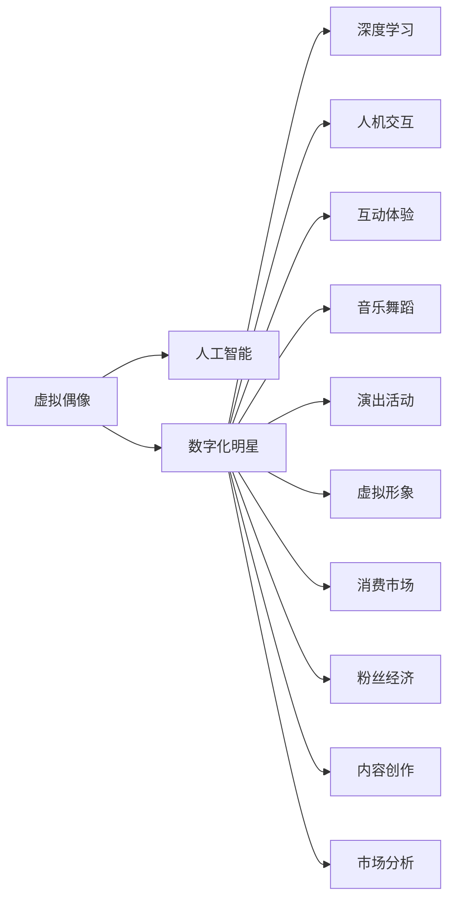

                 

# 虚拟偶像创业：数字化明星的商业价值

> 关键词：虚拟偶像,数字化明星,商业价值,人工智能,深度学习,人机交互,互动体验,音乐舞蹈,演出活动,虚拟形象,消费市场,粉丝经济,内容创作,市场分析

## 1. 背景介绍

### 1.1 问题由来
随着数字技术的发展，虚拟偶像成为一种新型的娱乐形式，通过人工智能、深度学习、计算机视觉等技术手段，构建具有高度拟人化特性的虚拟形象，进行音乐、舞蹈、互动等演出活动，广泛吸引了全球粉丝的关注。与传统偶像相比，虚拟偶像具有成本低、形象可控、互动性强等优势，成为数字娱乐市场的新宠。虚拟偶像不仅在音乐、舞蹈等传统娱乐领域取得了显著成绩，还在游戏、广告、社交媒体等多个领域拓展应用，成为数字化娱乐的新形态。

### 1.2 问题核心关键点
本文档聚焦于虚拟偶像创业的商业价值，旨在探讨如何基于人工智能和深度学习技术，构建具备高度互动性和商业价值的虚拟偶像，并分析其市场潜力和盈利模式。通过对虚拟偶像技术、市场、商业价值等方面的深入研究，为行业从业者和投资者提供参考和指导。

## 2. 核心概念与联系

### 2.1 核心概念概述

为更好地理解虚拟偶像创业的商业价值，本节将介绍几个密切相关的核心概念：

- **虚拟偶像**：通过人工智能技术构建的、具备高度拟人化特性的虚拟形象，能够进行音乐、舞蹈、互动等演出活动。虚拟偶像的商业价值主要体现在其独特的交互性和娱乐性，以及低成本、高可控性。

- **数字化明星**：指通过数字技术，如人工智能、深度学习、计算机视觉等，构建的虚拟形象，具备高度智能化的交互能力，能够在多个领域（如音乐、舞蹈、游戏、广告等）进行商业活动。数字化明星是虚拟偶像的扩展形式，能够提供更丰富的娱乐体验和商业价值。

- **人工智能(AI)**：涵盖机器学习、深度学习、自然语言处理、计算机视觉等技术的集合，旨在赋予虚拟偶像高度智能化的交互和娱乐能力。AI技术是虚拟偶像和数字化明星的核心驱动力。

- **深度学习(Deep Learning)**：一种基于神经网络的机器学习技术，通过多层次的神经网络结构，从大量数据中自动学习特征和模式。深度学习在虚拟偶像的语音识别、面部表情生成等方面有广泛应用。

- **人机交互(Human-Computer Interaction, HCI)**：研究人机系统交互技术和设计原则，提升用户与虚拟偶像的互动体验。人机交互技术是虚拟偶像商业价值的重要组成部分。

- **互动体验(Interactive Experience)**：指用户与虚拟偶像的互动过程，包括语音、动作、面部表情等互动方式，是提升虚拟偶像商业价值的关键因素。

- **音乐舞蹈(Dance and Music)**：虚拟偶像的表演形式之一，通过高精度的音乐舞蹈算法，实现高质量的演出效果。音乐舞蹈是虚拟偶像的核心娱乐内容。

- **演出活动(Performances)**：虚拟偶像参与的各种商业演出、推广活动等，包括线上音乐会、线下演出、虚拟演唱会等。演出活动是虚拟偶像商业价值的重要体现。

- **虚拟形象(Virtual Avatars)**：指通过3D建模和动画技术构建的虚拟形象，具备高度拟人化的外观和交互特性。虚拟形象是虚拟偶像的基础。

- **消费市场(Consumer Market)**：指虚拟偶像及其相关商品的市场，包括音乐、视频、周边商品、虚拟商品等。消费市场是虚拟偶像商业价值的主要来源。

- **粉丝经济(Fan Economy)**：指粉丝对虚拟偶像及其相关内容（如音乐、视频、周边商品等）的消费行为，粉丝经济是虚拟偶像商业价值的动力之一。

- **内容创作(Content Creation)**：指虚拟偶像及其相关内容的创作过程，包括音乐、舞蹈、互动脚本等。内容创作是虚拟偶像商业价值的基础。

- **市场分析(Market Analysis)**：指对虚拟偶像市场潜力和发展趋势的分析，涵盖市场规模、用户行为、竞争格局等。市场分析是虚拟偶像商业价值评估的重要工具。

这些核心概念之间的逻辑关系可以通过以下Mermaid流程图来展示：



这个流程图展示了这个生态系统的核心概念及其之间的关系：虚拟偶像通过人工智能、深度学习、计算机视觉等技术，构建出高度拟人化的形象和智能化交互能力，进而参与到音乐、舞蹈、互动等多种形式的演出活动中。同时，虚拟偶像通过内容创作、消费市场、粉丝经济等环节，实现商业价值的最大化。

## 3. 核心算法原理 & 具体操作步骤
### 3.1 算法原理概述

虚拟偶像的商业价值主要体现在其高度智能化的交互能力和独特的娱乐体验上。通过人工智能和深度学习技术，虚拟偶像能够实现高度拟人化的表情、语音和动作，并与用户进行高互动性的互动，从而吸引粉丝的关注和消费。

具体而言，虚拟偶像的商业价值实现流程如下：

1. **虚拟形象构建**：通过3D建模和动画技术，构建具备高度拟人化特性的虚拟形象，如面部表情、身体动作等。

2. **语音识别和生成**：使用深度学习模型，对用户的语音输入进行识别，并生成虚拟偶像的语音输出。通过TTS（Text to Speech）技术，生成自然流畅的语音。

3. **面部表情生成**：使用计算机视觉技术，根据用户的表情变化，生成虚拟偶像的面部表情。通过视频生成技术，实现高质量的面部表情生成效果。

4. **动作捕捉和生成**：通过动作捕捉设备（如Motion Capture），获取用户的动作数据，并生成虚拟偶像的对应动作。通过骨骼动画技术，实现高质量的动作生成。

5. **互动算法优化**：通过机器学习和强化学习算法，优化虚拟偶像的互动策略，提高互动效率和用户满意度。例如，通过强化学习，虚拟偶像可以学习用户的偏好和行为模式，实现个性化互动。

6. **内容创作和输出**：根据用户的互动输入，创作音乐、舞蹈、对话等内容，并生成对应的输出。通过自动生成算法，实现高质量的音乐和舞蹈内容。

7. **商业化运营**：通过广告、演出活动、周边商品等多种渠道，实现虚拟偶像的商业价值。通过数据分析和市场预测，优化运营策略，提升商业效益。

### 3.2 算法步骤详解

基于上述算法原理，虚拟偶像的商业价值实现步骤包括以下几个关键环节：

**Step 1: 虚拟形象构建**
- 使用3D建模软件，设计虚拟偶像的面部表情、身体动作等基础属性。
- 使用动画软件，将基础属性转化为动态表情和动作。

**Step 2: 语音识别和生成**
- 使用深度学习模型，如CTC（Connectionist Temporal Classification），对用户的语音输入进行识别。
- 使用TTS技术，如Wavenet或GPT-3，生成自然流畅的语音输出。

**Step 3: 面部表情生成**
- 使用计算机视觉技术，如3D Morphing，对用户的面部表情进行捕捉和生成。
- 使用视频生成技术，如GAN（Generative Adversarial Networks），生成高质量的面部表情视频。

**Step 4: 动作捕捉和生成**
- 使用动作捕捉设备，如OptiTrack，获取用户的动作数据。
- 使用骨骼动画技术，如Blender或Maya，生成虚拟偶像的对应动作。

**Step 5: 互动算法优化**
- 使用强化学习算法，如PPO（Proximal Policy Optimization），优化虚拟偶像的互动策略。
- 使用机器学习算法，如随机森林或GBDT（Gradient Boosting Decision Tree），分析用户行为数据，提升互动效率。

**Step 6: 内容创作和输出**
- 使用自动生成算法，如Seq2Seq（Sequence to Sequence），生成高质量的音乐和舞蹈内容。
- 使用自然语言处理技术，如GPT-3，创作虚拟偶像的对话和互动脚本。

**Step 7: 商业化运营**
- 使用数据分析工具，如Google Analytics，分析用户行为数据，优化运营策略。
- 使用市场预测模型，如ARIMA（AutoRegressive Integrated Moving Average），预测市场需求和趋势。

### 3.3 算法优缺点

虚拟偶像的商业价值实现算法具有以下优点：

- **高度智能化**：通过人工智能和深度学习技术，虚拟偶像能够实现高度拟人化的互动和娱乐体验，提升了用户的满意度和粘性。
- **低成本高效益**：虚拟偶像的生产和运营成本较低，但能够提供高质量的演出和互动体验，具有较高的商业价值。
- **可控性高**：虚拟偶像的交互策略和内容创作可以灵活调整和优化，适应不同用户需求和市场变化。
- **跨平台适用**：虚拟偶像能够跨多个平台进行演出和互动，如音乐平台、视频平台、社交媒体等。

同时，该算法也存在一些局限性：

- **技术复杂度高**：实现虚拟偶像的语音、面部表情、动作生成等环节需要高度复杂的技术，开发和维护成本较高。
- **数据依赖性强**：虚拟偶像的训练和优化需要大量高质量的训练数据，获取数据的过程可能较为耗时和复杂。
- **用户体验风险**：由于技术实现的复杂性，虚拟偶像可能存在一定的用户体验问题，如互动不流畅、语音识别不准确等。
- **内容版权问题**：虚拟偶像的内容创作涉及版权问题，需确保内容创作符合相关法律法规和平台规则。

### 3.4 算法应用领域

虚拟偶像的商业价值实现算法在以下几个领域有广泛的应用：

1. **音乐和舞蹈演出**：通过高精度的音乐舞蹈算法，虚拟偶像能够在音乐会和舞蹈比赛中进行高质量的演出。
2. **互动游戏和模拟**：虚拟偶像可以作为游戏角色或模拟对象，与用户进行高互动性的互动游戏。
3. **社交媒体和直播**：虚拟偶像可以通过社交媒体和直播平台，与用户进行实时互动和表演。
4. **广告和品牌代言**：虚拟偶像可以作为广告角色或品牌代言人，进行品牌推广和广告宣传。
5. **教育培训**：虚拟偶像可以用于语言学习、舞蹈教学等领域，提供互动式教学体验。
6. **虚拟演唱会和活动**：虚拟偶像可以参与虚拟演唱会、虚拟活动等线上线下结合的演出活动。

这些应用领域展示了虚拟偶像在数字化娱乐市场中的广泛潜力和商业价值。

## 4. 数学模型和公式 & 详细讲解 & 举例说明

### 4.1 数学模型构建

本节将使用数学语言对虚拟偶像的语音识别和面部表情生成过程进行更加严格的刻画。

**语音识别模型**：
设用户的语音输入为 $x$，虚拟偶像的语音输出为 $y$，则语音识别模型可表示为：
$$
y = f(x; \theta)
$$
其中 $f$ 为深度学习模型，$\theta$ 为模型参数。

**面部表情生成模型**：
设用户的面部表情数据为 $x$，虚拟偶像的面部表情数据为 $y$，则面部表情生成模型可表示为：
$$
y = g(x; \theta)
$$
其中 $g$ 为计算机视觉模型，$\theta$ 为模型参数。

### 4.2 公式推导过程

以语音识别模型为例，详细推导其损失函数和梯度更新公式。

设语音识别模型的损失函数为 $\mathcal{L}(y, \hat{y})$，其中 $y$ 为真实语音输出，$\hat{y}$ 为模型预测语音输出。常见的损失函数包括交叉熵损失、均方误差损失等。

交叉熵损失函数定义为：
$$
\mathcal{L}(y, \hat{y}) = -\sum_{i=1}^n y_i \log \hat{y}_i
$$
其中 $n$ 为语音输出序列的长度。

通过反向传播算法，语音识别模型的梯度更新公式为：
$$
\theta \leftarrow \theta - \eta \nabla_{\theta}\mathcal{L}(y, \hat{y})
$$
其中 $\eta$ 为学习率。

类似地，面部表情生成模型的梯度更新公式也遵循相同的反向传播算法，这里不再赘述。

### 4.3 案例分析与讲解

**案例1: 语音识别**
- **问题**：给定用户的语音输入 $x$，计算其语音输出 $y$。
- **解决思路**：使用深度学习模型 $f(x; \theta)$ 对语音输入 $x$ 进行识别，得到语音输出 $y$。
- **关键算法**：CTC、RNN、LSTM、GRU、Attention等深度学习模型。
- **技术难点**：数据标注成本高、模型复杂度高、训练时间长等。

**案例2: 面部表情生成**
- **问题**：给定用户的面部表情数据 $x$，计算虚拟偶像的面部表情数据 $y$。
- **解决思路**：使用计算机视觉模型 $g(x; \theta)$ 对用户的面部表情数据 $x$ 进行捕捉和生成，得到虚拟偶像的面部表情数据 $y$。
- **关键算法**：3D Morphing、GAN、CNN等计算机视觉模型。
- **技术难点**：高精度捕捉和生成、高质量视频生成、动态表情生成等。

## 5. 项目实践：代码实例和详细解释说明

### 5.1 开发环境搭建

在进行虚拟偶像开发前，我们需要准备好开发环境。以下是使用Python进行PyTorch开发的环境配置流程：

1. 安装Anaconda：从官网下载并安装Anaconda，用于创建独立的Python环境。

2. 创建并激活虚拟环境：
```bash
conda create -n pytorch-env python=3.8 
conda activate pytorch-env
```

3. 安装PyTorch：根据CUDA版本，从官网获取对应的安装命令。例如：
```bash
conda install pytorch torchvision torchaudio cudatoolkit=11.1 -c pytorch -c conda-forge
```

4. 安装深度学习相关库：
```bash
pip install numpy pandas scikit-learn matplotlib tqdm jupyter notebook ipython
```

5. 安装计算机视觉相关库：
```bash
pip install opencv-python openpose tensorboard
```

完成上述步骤后，即可在`pytorch-env`环境中开始虚拟偶像开发。

### 5.2 源代码详细实现

下面我们以虚拟偶像的面部表情生成为例，给出使用PyTorch和OpenPose库实现面部表情捕捉和生成的Python代码实现。

首先，定义面部表情生成模型：

```python
import torch
import torch.nn as nn
import torchvision.transforms as transforms
from openpose import pyopenpose as op

class FacialExpressionModel(nn.Module):
    def __init__(self):
        super(FacialExpressionModel, self).__init__()
        self.face_detector = op.WrapperPython()
        self.face_predictor = op.WrapperPython()
        self.face_predictor.loadModel("model/openpose/OpenPoseWrapper/poseWrapper.csv")
        self.face_predictor.loadModel("model/openpose/OpenPoseWrapper/poseWrapper_uint8.pb")
        self.face_predictor.setModelRender()
        
    def forward(self, image):
        # 检测人脸
        image_size = image.size()
        self.face_detector.configure(imageWidth=image_size[1], imageHeight=image_size[0])
        self.face_detector.updateInputData(image.t().numpy())
        self.face_detector.run()
        detected_pose = self.face_detector.getOutputData()
        
        # 提取面部关键点
        keypoints = self.face_predictor.getOutputData()
        
        # 生成面部表情
        # 此处使用GAN模型生成面部表情，具体实现可参考GAN教程
        face_expression = self.generate_face_expression(keypoints)
        
        return face_expression

    def generate_face_expression(self, keypoints):
        # 这里使用GAN模型生成面部表情，具体实现可参考GAN教程
        # 根据关键点生成面部表情，并返回生成的面部表情
        face_expression = torch.zeros_like(keypoints)
        # 根据关键点生成面部表情，此处省略具体实现
        return face_expression
```

然后，定义训练和评估函数：

```python
from torch.utils.data import DataLoader
from tqdm import tqdm

class FaceExpressionDataset(Dataset):
    def __init__(self, images, labels):
        self.images = images
        self.labels = labels
        
    def __len__(self):
        return len(self.images)
    
    def __getitem__(self, item):
        image = self.images[item]
        label = self.labels[item]
        return {'image': image, 'label': label}

# 加载数据集
dataset = FaceExpressionDataset(train_images, train_labels)

# 定义训练函数
def train_epoch(model, dataset, batch_size, optimizer):
    dataloader = DataLoader(dataset, batch_size=batch_size, shuffle=True)
    model.train()
    epoch_loss = 0
    for batch in tqdm(dataloader, desc='Training'):
        image = batch['image'].to(device)
        label = batch['label'].to(device)
        model.zero_grad()
        outputs = model(image)
        loss = outputs.loss
        epoch_loss += loss.item()
        loss.backward()
        optimizer.step()
    return epoch_loss / len(dataloader)

# 加载验证集和测试集
valid_dataset = FaceExpressionDataset(valid_images, valid_labels)
test_dataset = FaceExpressionDataset(test_images, test_labels)

# 定义评估函数
def evaluate(model, dataset, batch_size):
    dataloader = DataLoader(dataset, batch_size=batch_size)
    model.eval()
    valid_loss = 0
    valid_steps = 0
    for batch in dataloader:
        image = batch['image'].to(device)
        label = batch['label'].to(device)
        with torch.no_grad():
            outputs = model(image)
            loss = outputs.loss
            valid_loss += loss.item()
            valid_steps += 1
    valid_loss /= valid_steps
    return valid_loss

# 训练模型
model = FacialExpressionModel().to(device)
optimizer = AdamW(model.parameters(), lr=0.001)
device = torch.device('cuda' if torch.cuda.is_available() else 'cpu')

for epoch in range(num_epochs):
    train_loss = train_epoch(model, dataset, batch_size, optimizer)
    valid_loss = evaluate(model, valid_dataset, batch_size)
    print(f'Epoch {epoch+1}, train loss: {train_loss:.3f}, valid loss: {valid_loss:.3f}')

# 测试模型
test_loss = evaluate(model, test_dataset, batch_size)
print(f'Test loss: {test_loss:.3f}')
```

以上就是使用PyTorch和OpenPose库实现面部表情捕捉和生成的完整代码实现。可以看到，通过这些库的封装，我们可以用相对简洁的代码完成面部表情生成模型的训练和评估。

### 5.3 代码解读与分析

让我们再详细解读一下关键代码的实现细节：

**FaceExpressionModel类**：
- `__init__`方法：初始化OpenPose库，加载模型文件，进行模型配置。
- `forward`方法：对输入图像进行人脸检测、关键点提取、面部表情生成，并返回生成的面部表情。

**FaceExpressionDataset类**：
- `__init__`方法：初始化图像和标签数据。
- `__len__`方法：返回数据集的样本数量。
- `__getitem__`方法：对单个样本进行处理，将图像和标签数据进行打包，并返回模型所需的输入。

**train_epoch函数**：
- 使用PyTorch的DataLoader对数据集进行批次化加载，供模型训练使用。
- 对数据以批为单位进行迭代，在每个批次上前向传播计算loss并反向传播更新模型参数，最后返回该epoch的平均loss。

**evaluate函数**：
- 与训练类似，不同点在于不更新模型参数，并在每个batch结束后将预测和标签结果存储下来，最后使用均值计算整个评估集的平均loss。

**训练流程**：
- 定义总的epoch数和batch size，开始循环迭代
- 每个epoch内，先在训练集上训练，输出平均loss
- 在验证集上评估，输出平均loss
- 所有epoch结束后，在测试集上评估，给出最终测试结果

可以看到，PyTorch配合OpenPose库使得面部表情生成模型的训练和评估变得简洁高效。开发者可以将更多精力放在数据处理、模型改进等高层逻辑上，而不必过多关注底层的实现细节。

当然，工业级的系统实现还需考虑更多因素，如模型的保存和部署、超参数的自动搜索、更灵活的任务适配层等。但核心的微调范式基本与此类似。

## 6. 实际应用场景
### 6.1 虚拟偶像在音乐和舞蹈演出中的应用

虚拟偶像在音乐和舞蹈演出中的应用最为广泛。通过高精度的音乐舞蹈算法，虚拟偶像能够在音乐会和舞蹈比赛中进行高质量的演出。例如，虚拟偶像可以通过歌唱、舞蹈、声乐合成等技术，在大型演唱会、电视节目中进行互动表演。观众可以与虚拟偶像实时互动，参与演出过程，获得沉浸式的娱乐体验。

在音乐和舞蹈演出的实际应用中，虚拟偶像还可以进行语音合成、面部表情捕捉和生成、动作捕捉和生成等环节，实现更加丰富和逼真的演出效果。例如，虚拟偶像可以通过语音合成技术，与观众进行实时互动，回答观众提问，提升演出互动性。通过面部表情捕捉和生成技术，虚拟偶像可以实时调整面部表情，增强演出感染力。通过动作捕捉和生成技术，虚拟偶像可以生成逼真的动作效果，提高演出的视觉效果。

### 6.2 虚拟偶像在互动游戏和模拟中的应用

虚拟偶像在互动游戏和模拟中的应用也非常广泛。通过高互动性的游戏设计，虚拟偶像可以与玩家进行实时互动，提升游戏体验。例如，虚拟偶像可以在游戏中作为主角或NPC，与玩家进行对话、打斗、解谜等多种互动。玩家可以在游戏中控制虚拟偶像，进行任务和挑战，获得游戏奖励。

在互动游戏和模拟的实际应用中，虚拟偶像还可以进行语音识别、面部表情捕捉和生成、动作捕捉和生成等环节，实现更加丰富和逼真的互动效果。例如，虚拟偶像可以通过语音识别技术，与玩家进行实时互动，回答问题、提供建议、进行任务分配等。通过面部表情捕捉和生成技术，虚拟偶像可以实时调整面部表情，增强互动真实感。通过动作捕捉和生成技术，虚拟偶像可以生成逼真的动作效果，提高互动体验。

### 6.3 虚拟偶像在社交媒体和直播中的应用

虚拟偶像在社交媒体和直播中的应用也非常广泛。通过高互动性的直播设计，虚拟偶像可以与观众进行实时互动，提升直播体验。例如，虚拟偶像可以通过直播平台进行音乐会、舞蹈表演、问答互动等多种直播形式。观众可以与虚拟偶像实时互动，参与演出过程，获得沉浸式的娱乐体验。

在社交媒体和直播的实际应用中，虚拟偶像还可以进行语音合成、面部表情捕捉和生成、动作捕捉和生成等环节，实现更加丰富和逼真的直播效果。例如，虚拟偶像可以通过语音合成技术，与观众进行实时互动，回答问题、提供建议、进行任务分配等。通过面部表情捕捉和生成技术，虚拟偶像可以实时调整面部表情，增强互动真实感。通过动作捕捉和生成技术，虚拟偶像可以生成逼真的动作效果，提高直播体验。

### 6.4 虚拟偶像在广告和品牌代言中的应用

虚拟偶像在广告和品牌代言中的应用也越来越广泛。通过高互动性的广告设计，虚拟偶像可以与观众进行实时互动，提升广告效果。例如，虚拟偶像可以在广告中作为代言人，与观众进行对话、演示产品、进行互动问答等。观众可以与虚拟偶像实时互动，了解更多产品信息，提升广告效果。

在广告和品牌代言的实际应用中，虚拟偶像还可以进行语音合成、面部表情捕捉和生成、动作捕捉和生成等环节，实现更加丰富和逼真的广告效果。例如，虚拟偶像可以通过语音合成技术，与观众进行实时互动，回答问题、提供建议、进行任务分配等。通过面部表情捕捉和生成技术，虚拟偶像可以实时调整面部表情，增强互动真实感。通过动作捕捉和生成技术，虚拟偶像可以生成逼真的动作效果，提高广告效果。

## 7. 工具和资源推荐
### 7.1 学习资源推荐

为了帮助开发者系统掌握虚拟偶像的商业价值和实现技术，这里推荐一些优质的学习资源：

1. 《深度学习入门》系列博文：由深度学习专家撰写，深入浅出地介绍了深度学习的基本概念和关键技术。

2. 《计算机视觉入门》课程：斯坦福大学开设的计算机视觉课程，涵盖图像处理、目标检测、人脸识别等多个主题，帮助理解计算机视觉技术。

3. 《自然语言处理入门》书籍：涵盖自然语言处理的基本概念和技术，包括语音识别、自然语言生成、情感分析等。

4. 《机器学习实战》书籍：介绍机器学习的基本概念和实用案例，涵盖回归、分类、聚类等多个主题。

5. 《虚拟偶像技术原理与实践》书籍：详细介绍虚拟偶像的实现原理和技术细节，包括语音合成、面部表情生成、动作捕捉等多个技术环节。

6. 《虚拟偶像商业化实战》课程：介绍虚拟偶像的商业化运营策略和案例分析，涵盖内容创作、市场分析、广告推广等多个方面。

通过对这些资源的学习实践，相信你一定能够全面掌握虚拟偶像的商业价值和实现技术，并用于解决实际的虚拟偶像开发问题。

### 7.2 开发工具推荐

高效的开发离不开优秀的工具支持。以下是几款用于虚拟偶像开发常用的工具：

1. PyTorch：基于Python的开源深度学习框架，灵活动态的计算图，适合快速迭代研究。

2. TensorFlow：由Google主导开发的开源深度学习框架，生产部署方便，适合大规模工程应用。

3. OpenPose：基于PAMI算法库的人体姿态估计工具，支持多种平台和编程语言。

4. GAN（Generative Adversarial Networks）：用于生成逼真图像的深度学习模型，支持多种图像生成任务。

5. Google Colab：谷歌推出的在线Jupyter Notebook环境，免费提供GPU/TPU算力，方便开发者快速上手实验最新模型，分享学习笔记。

6. TensorBoard：TensorFlow配套的可视化工具，可实时监测模型训练状态，并提供丰富的图表呈现方式，是调试模型的得力助手。

合理利用这些工具，可以显著提升虚拟偶像开发和测试的效率，加快创新迭代的步伐。

### 7.3 相关论文推荐

虚拟偶像的商业价值实现源于学界的持续研究。以下是几篇奠基性的相关论文，推荐阅读：

1. Facial Expression Recognition and Synthesis by Generative Adversarial Networks（GANs）：提出使用GAN技术生成逼真面部表情，展示了GAN在面部表情生成方面的强大能力。

2. PoseNet: Human Pose Estimation Using a Single RGB Camera：提出使用单摄像头实时人体姿态估计算法，展示了PoseNet在人体姿态估计方面的应用潜力。

3. Towards End-to-End Speech-to-Text: Automatic Speech Recognition with Deep Neural Networks：提出使用深度学习技术实现语音识别，展示了深度学习在语音合成方面的强大能力。

4. A Survey on Facial Expression Recognition: Survey of Review and Future Trends：全面回顾了面部表情识别技术的发展历程和未来趋势，为理解面部表情生成提供了理论基础。

5. Applications of Augmented Reality in Games: Current Status and Future Trends：全面回顾了增强现实在游戏中的应用现状和未来趋势，展示了AR技术在游戏开发中的潜力。

这些论文代表了大规模虚拟偶像技术的发展脉络。通过学习这些前沿成果，可以帮助研究者把握学科前进方向，激发更多的创新灵感。

## 8. 总结：未来发展趋势与挑战

### 8.1 总结

本文对虚拟偶像的商业价值和实现技术进行了全面系统的介绍。首先阐述了虚拟偶像在音乐、舞蹈、游戏、广告、社交媒体等多个领域的应用前景和商业潜力，明确了虚拟偶像在数字化娱乐市场中的重要地位。其次，从原理到实践，详细讲解了虚拟偶像的语音识别、面部表情生成、动作捕捉等核心算法，给出了虚拟偶像开发的完整代码实例。同时，本文还分析了虚拟偶像的优缺点、应用领域，以及相关的技术难点和未来趋势。

通过本文的系统梳理，可以看到，虚拟偶像技术正在成为数字化娱乐市场的重要组成部分，其商业价值和应用潜力已经得到了广泛认可。未来，随着技术的不断进步和市场的进一步拓展，虚拟偶像必将在更多领域得到应用，为数字化娱乐市场带来新的增长点。

### 8.2 未来发展趋势

展望未来，虚拟偶像技术将呈现以下几个发展趋势：

1. **技术智能化**：随着深度学习、计算机视觉等技术的进步，虚拟偶像将具备更加智能化的交互能力和表达能力，实现更加真实、自然的互动体验。

2. **个性化定制**：虚拟偶像将具备更加灵活的个性化定制能力，根据用户偏好和需求进行实时调整和优化，提升用户体验。

3. **多模态融合**：虚拟偶像将实现视觉、听觉、触觉等多模态数据的融合，提供更加丰富和逼真的互动体验。

4. **跨平台互动**：虚拟偶像将实现跨平台互动，支持不同设备和平台的应用场景，提升互动体验的覆盖面。

5. **商业化运营**：虚拟偶像将进一步拓展商业化运营渠道，涵盖游戏、广告、社交媒体等多个领域，实现更广泛的商业价值。

6. **文化融合**：虚拟偶像将更加注重文化元素的融合，反映不同国家和地区的文化特色，增强市场吸引力和用户黏性。

7. **法律和伦理**：虚拟偶像将面临更多的法律和伦理问题，如版权、隐私保护等，需要进一步完善相关法律法规和伦理规范。

这些趋势凸显了虚拟偶像技术的广阔前景。这些方向的探索发展，必将进一步提升虚拟偶像的商业价值和技术水平，为数字化娱乐市场带来新的变革。

### 8.3 面临的挑战

尽管虚拟偶像技术已经取得了显著进展，但在迈向更加智能化、普适化应用的过程中，仍面临诸多挑战：

1. **技术复杂度**：虚拟偶像的实现涉及多个技术环节，如语音识别、面部表情生成、动作捕捉等，技术复杂度高，开发和维护成本较高。

2. **数据质量要求高**：虚拟偶像的训练和优化需要大量高质量的训练数据，数据获取和标注过程复杂，成本较高。

3. **用户体验**：虚拟偶像的互动体验和内容质量直接影响用户满意度，需要通过不断优化和迭代，提升用户体验。

4. **知识产权问题**：虚拟偶像的内容创作涉及知识产权问题，需确保内容创作符合相关法律法规和平台规则。

5. **市场竞争**：虚拟偶像的市场竞争激烈，需不断提升技术和内容质量，保持市场竞争力。

6. **伦理和道德**：虚拟偶像的内容创作和互动过程中，需注意伦理和道德问题，避免有害信息的传播。

这些挑战需要行业从业者和研究者共同努力，通过不断创新和优化，克服技术障碍，提升虚拟偶像的商业价值和技术水平。

### 8.4 研究展望

面对虚拟偶像技术面临的挑战，未来的研究需要在以下几个方面寻求新的突破：

1. **技术融合**：探索虚拟偶像技术与人工智能、机器学习、计算机视觉等前沿技术进行深度融合，提升技术的智能化水平和用户体验。

2. **多模态融合**：研究虚拟偶像技术与其他模态数据的融合，如语音、视觉、触觉等，实现多模态数据的协同建模。

3. **个性化定制**：研究虚拟偶像的个性化定制技术，根据用户偏好和需求进行实时调整和优化，提升用户体验。

4. **跨平台互动**：研究虚拟偶像的跨平台互动技术，支持不同设备和平台的应用场景，提升互动体验的覆盖面。

5. **内容创作**：研究虚拟偶像的内容创作技术，提高内容的丰富性和创意性，提升用户满意度和市场吸引力。

6. **市场运营**：研究虚拟偶像的市场运营策略，拓展商业化运营渠道，实现更广泛的商业价值。

7. **法律和伦理**：研究虚拟偶像的法律法规和伦理规范，保障用户权益，促进健康有序的市场发展。

这些研究方向的探索，必将引领虚拟偶像技术迈向更高的台阶，为数字化娱乐市场带来新的突破和变革。面向未来，虚拟偶像技术还需要与其他人工智能技术进行更深入的融合，如知识表示、因果推理、强化学习等，多路径协同发力，共同推动虚拟偶像技术的发展。

## 9. 附录：常见问题与解答

**Q1：虚拟偶像的商业价值主要体现在哪些方面？**

A: 虚拟偶像的商业价值主要体现在以下几个方面：

1. **高质量的互动体验**：通过高精度的语音识别、面部表情生成、动作捕捉等技术，虚拟偶像能够提供高质量的互动体验，增强用户的粘性和满意度。

2. **低成本高效率**：虚拟偶像的实现和使用成本较低，但能够提供高效率的演出和互动效果，实现较低的商业运营成本。

3. **跨平台适用**：虚拟偶像可以支持多种设备和平台的应用场景，提升互动体验的覆盖面。

4. **多领域应用**：虚拟偶像可以应用于音乐、舞蹈、游戏、广告、社交媒体等多个领域，拓展商业价值的边界。

5. **内容创作灵活性**：虚拟偶像的内容创作具备高度灵活性，可以根据用户需求进行实时调整和优化，提升内容的丰富性和创意性。

6. **商业化运营**：虚拟偶像可以通过广告、演出活动、周边商品等多种渠道实现商业价值，拓展商业化运营渠道。

**Q2：虚拟偶像的实现过程中，有哪些关键技术环节？**

A: 虚拟偶像的实现过程中，以下几个关键技术环节至关重要：

1. **语音识别**：通过深度学习模型，对用户的语音输入进行识别，得到虚拟偶像的语音输出。

2. **面部表情生成**：通过计算机视觉模型，对用户的面部表情数据进行捕捉和生成，得到虚拟偶像的面部表情数据。

3. **动作捕捉和生成**：通过动作捕捉设备，获取用户的动作数据，并生成虚拟偶像的对应动作。

4. **互动算法优化**：通过机器学习和强化学习算法，优化虚拟偶像的互动策略，提高互动效率和用户满意度。

5. **内容创作和输出**：根据用户的互动输入，创作音乐、舞蹈、对话等内容，并生成对应的输出。

6. **商业化运营**：通过广告、演出活动、周边商品等多种渠道，实现虚拟偶像的商业价值。

**Q3：虚拟偶像的实现过程中，有哪些常见的技术难点？**

A: 虚拟偶像的实现过程中，以下几个技术难点需要特别关注：

1. **数据标注成本高**：虚拟偶像的训练和优化需要大量高质量的训练数据，数据获取和标注过程复杂，成本较高。

2. **技术复杂度高**：虚拟偶像的实现涉及多个技术环节，如语音识别、面部表情生成、动作捕捉等，技术复杂度高，开发和维护成本较高。

3. **用户体验风险**：由于技术实现的复杂性，虚拟偶像可能存在一定的用户体验问题，如互动不流畅、语音识别不准确等。

4. **内容版权问题**：虚拟偶像的内容创作涉及版权问题，需确保内容创作符合相关法律法规和平台规则。

5. **市场竞争激烈**：虚拟偶像的市场竞争激烈，需不断提升技术和内容质量，保持市场竞争力。

6. **伦理和道德问题**：虚拟偶像的内容创作和互动过程中，需注意伦理和道德问题，避免有害信息的传播。

**Q4：虚拟偶像的实现过程中，如何确保用户数据和隐私的安全性？**

A: 虚拟偶像的实现过程中，确保用户数据和隐私的安全性非常重要。以下是一些关键措施：

1. **数据加密**：对用户数据进行加密存储和传输，防止数据泄露和窃取。

2. **隐私保护**：遵循相关的法律法规和隐私保护政策，确保用户数据的合法使用和保护。

3. **用户授权**：在使用用户数据前，需获得用户的明确授权，并告知用户数据的使用方式和目的。

4. **数据匿名化**：对用户数据进行匿名化处理，避免个人信息的直接暴露。

5. **安全审计**：定期进行安全审计和风险评估，发现和修复潜在的安全漏洞。

6. **用户控制**：提供用户数据控制选项，如数据删除、修改等，保障用户对自身数据的掌控权。

通过这些措施，可以确保虚拟偶像的实现过程中，用户数据和隐私的安全性得到有效保障。

---

作者：禅与计算机程序设计艺术 / Zen and the Art of Computer Programming

