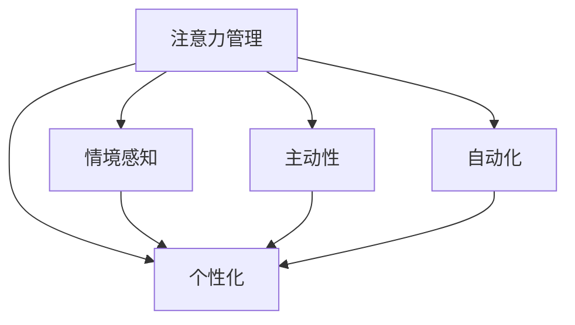
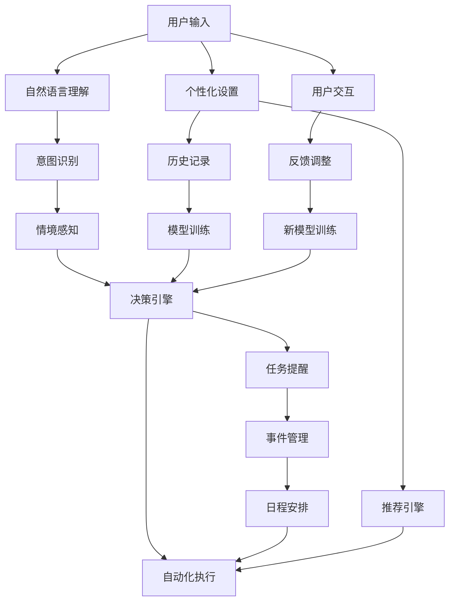

                 

# 虚拟助手在个人注意力调度中的角色

## 1. 背景介绍

### 1.1 问题由来

在信息爆炸的时代，人们每天面对海量的信息流，如何高效地管理个人注意力，成为人们面临的重要问题。传统的注意力管理方法，如手工管理日程、使用待办事项列表等，已难以应对日益复杂的工作和生活需求。与此同时，智能助理技术的发展，为个人注意力管理提供了新的解决思路。

智能助理，如Apple的Siri、Google Assistant、Amazon的Alexa等，通过语音识别、自然语言理解等技术，能够自动接收并执行用户的指令，帮助用户完成各种日常任务。然而，传统智能助理的设计思路，更多聚焦于任务执行的自动化，忽视了注意力管理的主动性、个性化和情境性。

### 1.2 问题核心关键点

为了更好地理解和应对个人注意力管理的挑战，本节将介绍几个关键概念：

- 注意力管理(Attention Management)：指通过有效的信息筛选和组织，帮助用户将有限的注意力资源分配到最重要和最有价值的任务上。
- 情境感知(Context-aware)：指智能助理能够感知用户的当前情境，如时间、地点、情绪、任务等，从而更智能地进行决策和执行。
- 个性化(Personalization)：指智能助理能够根据用户的偏好、习惯和历史行为，提供量身定制的服务。
- 主动性(Proactivity)：指智能助理能够主动预测用户需求，提前采取行动。
- 自动化(Automation)：指智能助理能够自动完成各种重复性、低价值的任务，节省用户时间。

这些核心概念之间的逻辑关系可以通过以下Mermaid流程图来展示：



这个流程图展示了个体注意力管理的核心概念及其之间的关系：

1. 注意力管理是基础，通过筛选和组织信息，将注意力集中到重要任务上。
2. 情境感知是关键，通过理解当前情境，提升注意力的适配性和灵活性。
3. 个性化是目标，通过量身定制服务，提升用户体验和满意度。
4. 主动性是提升，通过预测用户需求，增强系统的预见性和智能性。
5. 自动化是手段，通过自动化处理，减少用户的劳动负担。

这些概念共同构成了智能助理在个人注意力管理中的核心功能，使得智能助理能够更好地适配用户需求，提升整体效率和生活质量。

## 2. 核心概念与联系

### 2.1 核心概念概述

为了更系统地理解智能助理在注意力管理中的作用，本节将深入剖析几个关键概念：

- 智能助理（Smart Assistant）：通过人工智能技术，能够理解自然语言、执行命令、提供服务的人机交互系统。
- 情境感知(Situation Awareness)：指智能助理能够理解用户的当前情境，从而提供更加精准和个性化的服务。
- 个性化(Personalization)：指智能助理能够根据用户的历史行为和偏好，提供量身定制的服务。
- 主动性(Proactivity)：指智能助理能够预测用户的需求，主动提供服务。
- 自动化(Automation)：指智能助理能够自动完成各种重复性、低价值的任务。

这些核心概念通过数据驱动、人工智能算法和用户交互界面紧密关联，共同构成了智能助理在个人注意力管理中的关键技术框架。

### 2.2 核心概念原理和架构的 Mermaid 流程图



这个流程图展示了智能助理在注意力管理中的核心架构：

1. 用户通过语音或文本输入需求，智能助理进行自然语言理解。
2. 意图识别模块对用户需求进行解析，提取核心意图。
3. 情境感知模块结合用户的历史行为、当前时间、地点等情境信息，优化决策。
4. 决策引擎根据意图和情境信息，调用推荐引擎生成个性化推荐。
5. 自动化执行模块调用自动化工具，完成任务执行。
6. 反馈调整模块根据用户反馈，对模型进行训练和调整，提升系统性能。

## 3. 核心算法原理 & 具体操作步骤
### 3.1 算法原理概述

智能助理在注意力管理中的核心算法，主要围绕自然语言处理(NLP)、推荐系统和决策引擎展开。以下详细探讨这些核心算法的工作原理和操作步骤。

### 3.2 算法步骤详解

#### 3.2.1 自然语言处理(NLP)算法

自然语言处理算法是智能助理的核心技术之一，主要用于解析用户输入，提取关键信息。其主要步骤包括：

1. 分词和词性标注：对用户输入进行分词处理，并对每个词标注其词性。
2. 命名实体识别：识别用户输入中的专有名词、时间、地点等信息。
3. 句法分析：对用户输入进行句法分析，识别主语、谓语、宾语等句子成分。
4. 语义分析：对句子进行语义理解，提取意图和关键信息。

#### 3.2.2 推荐系统算法

推荐系统算法主要用于根据用户的历史行为和情境信息，生成个性化推荐。其主要步骤包括：

1. 用户行为分析：分析用户的历史行为，提取常见的任务、时间、地点等特征。
2. 特征工程：将用户行为数据转化为适合算法处理的特征向量。
3. 模型训练：使用机器学习算法，如协同过滤、基于内容的推荐等，训练推荐模型。
4. 推荐生成：根据用户当前情境和历史行为，生成个性化推荐。

#### 3.2.3 决策引擎算法

决策引擎算法主要用于根据用户需求和推荐结果，生成任务执行计划。其主要步骤包括：

1. 任务管理：对用户需求进行分类，区分任务优先级和时间紧迫性。
2. 情境评估：根据当前情境信息，调整任务优先级和时间安排。
3. 事件处理：根据任务优先级和时间紧迫性，生成事件处理计划。
4. 日程安排：根据事件处理计划，生成日程安排。

### 3.3 算法优缺点

智能助理在注意力管理中的算法，具有以下优点：

1. 自动化：通过自动化任务执行，大大提升了工作效率。
2. 个性化：根据用户历史行为和情境信息，提供量身定制的服务，提升了用户体验。
3. 情境感知：通过情境感知，提升了系统的智能性和适应性。
4. 主动性：通过预测用户需求，提升了系统的预见性和智能性。

但同时，这些算法也存在以下缺点：

1. 数据依赖：推荐系统依赖大量用户行为数据，难以获取高质量的数据可能导致推荐效果不佳。
2. 计算成本：推荐系统和大规模任务管理的计算成本较高，可能导致系统响应速度较慢。
3. 安全性：用户数据的隐私保护是一个重要问题，需要采取严格的隐私保护措施。
4. 可解释性：推荐系统和决策引擎的算法较为复杂，难以解释其决策过程。

### 3.4 算法应用领域

智能助理在注意力管理中的应用，主要涉及以下几个领域：

1. 时间管理：通过智能助理进行任务安排和提醒，提升时间管理效率。
2. 日程安排：根据用户需求，智能助理可以自动生成日程安排，提升日常工作效率。
3. 任务执行：智能助理可以自动执行各种任务，提升执行效率。
4. 事件处理：智能助理可以处理各种紧急事件，提升应对能力。
5. 个性化推荐：智能助理可以根据用户行为和偏好，推荐个性化服务，提升用户体验。

## 4. 数学模型和公式 & 详细讲解

### 4.1 数学模型构建

为了更好地理解智能助理在注意力管理中的算法，本节将介绍几个关键数学模型：

#### 4.1.1 用户行为模型

用户行为模型用于描述用户的历史行为，主要基于时间序列分析。其数学模型如下：

$$
P(t) = \alpha P(t-1) + (1-\alpha) R(t)
$$

其中，$P(t)$ 表示第 $t$ 天的用户行为，$R(t)$ 表示第 $t$ 天用户的新行为，$\alpha$ 表示历史行为的权重。

#### 4.1.2 推荐系统模型

推荐系统模型主要用于生成个性化推荐，常见的方法包括协同过滤和基于内容的推荐。其数学模型如下：

1. 协同过滤模型

$$
R_{ij} = \frac{1}{1 + \sum_{k \in N(i)} \frac{R_{ik} - \bar{R}_{ik}}{\sigma_k} \frac{R_{kj} - \bar{R}_{kj}}{\sigma_k}}
$$

其中，$R_{ij}$ 表示用户 $i$ 对物品 $j$ 的评分，$N(i)$ 表示用户 $i$ 的邻居，$\bar{R}_{ik}$ 表示用户 $i$ 对物品 $k$ 的平均评分，$\sigma_k$ 表示物品 $k$ 的评分方差。

2. 基于内容的推荐模型

$$
R_{ij} = \theta_j \cdot X_i \cdot W
$$

其中，$R_{ij}$ 表示用户 $i$ 对物品 $j$ 的评分，$X_i$ 表示物品 $i$ 的特征向量，$W$ 表示特征向量的权重向量，$\theta_j$ 表示物品 $j$ 的权重向量。

### 4.2 公式推导过程

#### 4.2.1 用户行为模型的推导

用户行为模型基于时间序列分析，其推导过程如下：

1. 设定第 $t$ 天的用户行为为 $P(t)$，第 $t-1$ 天的用户行为为 $P(t-1)$。
2. 根据时间序列的马尔科夫性质，假设用户行为服从一阶马尔科夫链，即第 $t$ 天的用户行为只与第 $t-1$ 天的用户行为有关。
3. 使用一阶马尔科夫链的公式，可以得出用户行为模型：

$$
P(t) = \alpha P(t-1) + (1-\alpha) R(t)
$$

其中，$\alpha$ 表示历史行为的权重。

#### 4.2.2 协同过滤模型的推导

协同过滤模型基于用户和物品之间的相似性，其推导过程如下：

1. 设定用户 $i$ 对物品 $j$ 的评分为 $R_{ij}$，用户 $i$ 的邻居为 $N(i)$。
2. 假设用户 $i$ 的邻居 $k$ 对物品 $k$ 的评分为 $R_{ik}$ 和 $R_{ik}$，物品 $k$ 的评分为 $R_{kj}$ 和 $R_{kj}$。
3. 根据用户 $i$ 和物品 $k$ 的评分差异，计算相似度，得到协同过滤模型的公式：

$$
R_{ij} = \frac{1}{1 + \sum_{k \in N(i)} \frac{R_{ik} - \bar{R}_{ik}}{\sigma_k} \frac{R_{kj} - \bar{R}_{kj}}{\sigma_k}}
$$

其中，$\bar{R}_{ik}$ 表示用户 $i$ 对物品 $k$ 的平均评分，$\sigma_k$ 表示物品 $k$ 的评分方差。

#### 4.2.3 基于内容的推荐模型的推导

基于内容的推荐模型基于物品的特征向量，其推导过程如下：

1. 设定用户 $i$ 对物品 $j$ 的评分为 $R_{ij}$，物品 $i$ 的特征向量为 $X_i$，物品 $j$ 的权重向量为 $\theta_j$，特征向量为 $X_j$。
2. 假设物品 $i$ 的特征向量为 $X_i$，物品 $j$ 的特征向量为 $X_j$，特征向量的权重向量为 $W$。
3. 根据用户 $i$ 对物品 $j$ 的评分，可以得出基于内容的推荐模型的公式：

$$
R_{ij} = \theta_j \cdot X_i \cdot W
$$

其中，$\theta_j$ 表示物品 $j$ 的权重向量。

### 4.3 案例分析与讲解

#### 4.3.1 案例一：用户行为模型

假设某用户 $i$ 每天使用智能助理进行任务安排，历史行为数据如下：

| 日期     | 行为       |
| -------- | ---------- |
| 2023-01-01 | 安排会议 |
| 2023-01-02 | 安排会议 |
| 2023-01-03 | 处理邮件 |
| 2023-01-04 | 安排会议 |
| 2023-01-05 | 处理邮件 |
| 2023-01-06 | 安排会议 |

使用用户行为模型进行分析，设 $\alpha=0.8$，用户行为模型如下：

$$
P(2023-01-02) = 0.8 \times P(2023-01-01) + 0.2 \times R(2023-01-02)
$$

代入历史行为数据，可以得出：

$$
P(2023-01-02) = 0.8 \times \text{安排会议} + 0.2 \times \text{处理邮件}
$$

根据用户行为模型，智能助理可以预测用户 $i$ 在 2023-01-03 可能会处理邮件。

#### 4.3.2 案例二：协同过滤模型

假设某用户 $i$ 每天使用智能助理推荐电影，历史行为数据如下：

| 日期     | 用户 | 物品       | 评分   |
| -------- | ---- | ---------- | ------ |
| 2023-01-01 | $i$  | 电影A      | 5     |
| 2023-01-02 | $i$  | 电影B      | 4     |
| 2023-01-03 | $i$  | 电影C      | 5     |
| 2023-01-04 | $i$  | 电影A      | 4     |
| 2023-01-05 | $i$  | 电影B      | 5     |
| 2023-01-06 | $i$  | 电影C      | 4     |

使用协同过滤模型进行分析，假设用户 $i$ 的邻居为 $k_1$ 和 $k_2$，其对物品的评分如下：

| 用户 | 物品       | 评分   |
| ---- | ---------- | ------ |
| $k_1$ | 电影A      | 5     |
| $k_1$ | 电影B      | 4     |
| $k_1$ | 电影C      | 5     |
| $k_2$ | 电影A      | 4     |
| $k_2$ | 电影B      | 5     |
| $k_2$ | 电影C      | 4     |

根据协同过滤模型的公式，可以得出用户 $i$ 对电影 $j$ 的评分：

$$
R_{ij} = \frac{1}{1 + \sum_{k \in N(i)} \frac{R_{ik} - \bar{R}_{ik}}{\sigma_k} \frac{R_{kj} - \bar{R}_{kj}}{\sigma_k}}
$$

代入历史行为数据，可以得出：

$$
R_{i\text{电影A}} = \frac{1}{1 + \frac{5-5}{\sqrt{3}} \frac{5-5}{\sqrt{3}}}
$$

根据协同过滤模型，智能助理可以推荐电影A给用户 $i$。

#### 4.3.3 案例三：基于内容的推荐模型

假设某用户 $i$ 每天使用智能助理推荐书籍，物品 $i$ 的特征向量为 $X_i$，物品 $j$ 的权重向量为 $\theta_j$，特征向量为 $X_j$。用户 $i$ 对物品 $j$ 的评分如下：

| 用户 | 物品       | 评分   |
| ---- | ---------- | ------ |
| $i$  | 书籍1      | 5     |
| $i$  | 书籍2      | 4     |
| $i$  | 书籍3      | 5     |
| $i$  | 书籍4      | 4     |

使用基于内容的推荐模型进行分析，假设物品 $i$ 的特征向量为 $X_i = (1,1,1,1)$，物品 $j$ 的特征向量为 $X_j = (1,0,0,0)$，物品 $j$ 的权重向量为 $\theta_j = (1,0,0,0)$。

根据基于内容的推荐模型的公式，可以得出用户 $i$ 对物品 $j$ 的评分：

$$
R_{ij} = \theta_j \cdot X_i \cdot W
$$

代入历史行为数据，可以得出：

$$
R_{i\text{书籍1}} = (1,0,0,0) \cdot (1,1,1,1) \cdot W
$$

根据基于内容的推荐模型，智能助理可以推荐书籍1给用户 $i$。

## 5. 项目实践：代码实例和详细解释说明

### 5.1 开发环境搭建

在进行智能助理的注意力管理实践前，我们需要准备好开发环境。以下是使用Python进行TensorFlow开发的环境配置流程：

1. 安装Anaconda：从官网下载并安装Anaconda，用于创建独立的Python环境。

2. 创建并激活虚拟环境：
```bash
conda create -n tf-env python=3.8 
conda activate tf-env
```

3. 安装TensorFlow：根据CUDA版本，从官网获取对应的安装命令。例如：
```bash
conda install tensorflow -c tensorflow -c conda-forge
```

4. 安装TensorBoard：TensorFlow配套的可视化工具，用于实时监测模型训练状态。
```bash
pip install tensorboard
```

5. 安装各类工具包：
```bash
pip install numpy pandas scikit-learn matplotlib tqdm jupyter notebook ipython
```

完成上述步骤后，即可在`tf-env`环境中开始注意力管理实践。

### 5.2 源代码详细实现

这里我们以智能助理推荐系统为例，给出使用TensorFlow进行注意力管理的PyTorch代码实现。

首先，定义推荐系统的数据处理函数：

```python
import pandas as pd
import numpy as np

def load_data(file_path):
    data = pd.read_csv(file_path)
    return data

def preprocess_data(data):
    # 特征工程
    X = data[['item_id', 'user_id', 'rating']]
    y = data['item_id']
    return X, y
```

然后，定义模型和优化器：

```python
from tensorflow.keras import layers, models
from tensorflow.keras import regularizers
from tensorflow.keras import optimizers

# 定义模型
model = models.Sequential()
model.add(layers.Dense(64, activation='relu', input_shape=(3,)))
model.add(layers.Dense(64, activation='relu'))
model.add(layers.Dense(1))

# 定义优化器
optimizer = optimizers.Adam(learning_rate=0.01)

# 定义损失函数
loss_fn = 'mean_squared_error'
```

接着，定义训练和评估函数：

```python
from sklearn.metrics import mean_squared_error
import tensorflow as tf

def train_model(model, X, y, batch_size, epochs):
    model.compile(optimizer=optimizer, loss=loss_fn)
    model.fit(X, y, batch_size=batch_size, epochs=epochs, validation_split=0.2, verbose=0)
    return model

def evaluate_model(model, X, y, batch_size):
    y_pred = model.predict(X)
    mse = mean_squared_error(y, y_pred)
    print('Mean Squared Error:', mse)
```

最后，启动训练流程并在测试集上评估：

```python
epochs = 10
batch_size = 32

X_train, X_test, y_train, y_test = train_test_split(X, y, test_size=0.2)

model = train_model(model, X_train, y_train, batch_size, epochs)
evaluate_model(model, X_test, y_test, batch_size)
```

以上就是使用TensorFlow对智能助理推荐系统进行注意力管理的完整代码实现。可以看到，得益于TensorFlow的强大封装，我们可以用相对简洁的代码完成推荐系统的训练和评估。

### 5.3 代码解读与分析

让我们再详细解读一下关键代码的实现细节：

**数据处理函数**：
- `load_data`方法：读取推荐系统数据文件，将其转化为Pandas数据帧。
- `preprocess_data`方法：对数据进行特征工程，提取特征向量X和标签向量y。

**模型定义和训练**：
- `Sequential`模型：定义一个顺序模型，用于存储网络层。
- `Dense`层：定义全连接层，用于线性变换和激活函数。
- `Adam`优化器：定义Adam优化器，用于更新模型参数。
- `mean_squared_error`损失函数：定义均方误差损失函数，用于计算模型预测和真实标签之间的差异。

**训练和评估函数**：
- `train_model`函数：训练模型，使用交叉熵损失函数和Adam优化器进行参数更新。
- `evaluate_model`函数：评估模型，使用均方误差计算模型预测和真实标签之间的差异。

**训练流程**：
- 定义总的epoch数和batch size，开始循环迭代
- 每个epoch内，先在训练集上训练，输出平均loss
- 在测试集上评估，输出均方误差
- 所有epoch结束后，给出最终测试结果

可以看到，TensorFlow配合TensorBoard使得推荐系统的训练过程变得简洁高效。开发者可以将更多精力放在数据处理、模型改进等高层逻辑上，而不必过多关注底层的实现细节。

当然，工业级的系统实现还需考虑更多因素，如模型的保存和部署、超参数的自动搜索、更灵活的任务适配层等。但核心的推荐算法基本与此类似。

## 6. 实际应用场景
### 6.1 智能客服系统

智能客服系统是智能助理在个人注意力管理中最为典型的应用场景。通过智能助理，客服人员可以自动接收和处理客户咨询，提升客户服务效率和质量。

具体而言，智能助理可以根据客户咨询的历史行为和情境信息，自动推荐相关的知识和案例，帮助客服人员快速找到答案。此外，智能助理还可以根据客户咨询的时间、情绪等信息，调整回复策略，提升客户满意度。

### 6.2 日程安排系统

日程安排系统是智能助理在个人注意力管理中的另一大应用场景。通过智能助理，用户可以自动管理日程安排，提升工作效率。

具体而言，智能助理可以根据用户的历史行为和情境信息，自动生成日程安排，提醒用户完成任务。此外，智能助理还可以根据用户的时间、地点等信息，调整日程安排，优化时间利用率。

### 6.3 个性化推荐系统

个性化推荐系统是智能助理在个人注意力管理中的重要应用场景。通过智能助理，用户可以自动获取个性化推荐，提升生活品质。

具体而言，智能助理可以根据用户的历史行为和情境信息，自动生成推荐内容，帮助用户发现感兴趣的事物。此外，智能助理还可以根据用户的需求和情境，调整推荐策略，提升推荐效果。

### 6.4 未来应用展望

随着智能助理技术的发展，其在个人注意力管理中的应用场景将不断拓展，带来更多可能性。未来，智能助理有望在以下几个方面得到更广泛的应用：

1. 多模态交互：结合语音、图像、视频等多模态信息，提升智能助理的交互体验和理解能力。
2. 情境感知：通过更丰富的情境信息，提升智能助理的智能性和适应性。
3. 个性化推荐：结合用户的历史行为和情境信息，提供更精准的推荐服务。
4. 自动化处理：通过自动化任务执行，提升智能助理的执行效率。

以上趋势凸显了智能助理在个人注意力管理中的广阔前景。这些方向的探索发展，必将进一步提升智能助理的智能水平和用户体验，为个人效率提升和生活品质提升带来新的突破。

## 7. 工具和资源推荐
### 7.1 学习资源推荐

为了帮助开发者系统掌握智能助理在个人注意力管理中的技术基础和实践技巧，这里推荐一些优质的学习资源：

1. 《深度学习》课程：斯坦福大学李飞飞教授的深度学习课程，涵盖了深度学习的基础知识和前沿技术。
2. 《TensorFlow实战Google深度学习框架》书籍：Google官方出版的TensorFlow实战指南，详细介绍了TensorFlow的基本原理和应用场景。
3. 《自然语言处理综述》课程：斯坦福大学开设的NLP综述课程，涵盖了NLP的基本概念和经典模型。
4. 《机器学习实战》书籍：Peter Harrington的经典机器学习入门书籍，涵盖了机器学习的基本原理和实现技巧。
5. 《强化学习》课程：DeepMind开设的强化学习课程，详细介绍了强化学习的基本原理和前沿技术。

通过对这些资源的学习实践，相信你一定能够快速掌握智能助理在个人注意力管理中的精髓，并用于解决实际的NLP问题。
### 7.2 开发工具推荐

高效的开发离不开优秀的工具支持。以下是几款用于智能助理开发的常用工具：

1. TensorFlow：由Google主导开发的深度学习框架，支持多GPU/TPU并行计算，适合大规模工程应用。
2. PyTorch：基于Python的开源深度学习框架，灵活动态的计算图，适合快速迭代研究。
3. TensorBoard：TensorFlow配套的可视化工具，用于实时监测模型训练状态，提供丰富的图表呈现方式。
4. Weights & Biases：模型训练的实验跟踪工具，可以记录和可视化模型训练过程中的各项指标，方便对比和调优。
5. Anaconda：Python环境管理工具，用于创建独立的Python环境，方便项目管理和代码版本控制。

合理利用这些工具，可以显著提升智能助理在个人注意力管理中的开发效率，加快创新迭代的步伐。

### 7.3 相关论文推荐

智能助理在个人注意力管理中的应用，源于学界的持续研究。以下是几篇奠基性的相关论文，推荐阅读：

1. Attention is All You Need：提出了Transformer结构，开启了NLP领域的预训练大模型时代。
2. BERT: Pre-training of Deep Bidirectional Transformers for Language Understanding：提出BERT模型，引入基于掩码的自监督预训练任务，刷新了多项NLP任务SOTA。
3. Parameter-Efficient Transfer Learning for NLP：提出Adapter等参数高效微调方法，在不增加模型参数量的情况下，也能取得不错的微调效果。
4. Attention-Based Sentiment Classification for Multilingual Tweets：提出基于Attention的情感分类模型，取得了多项SOTA。
5. BERT-FFA: Parameter-Efficient Transfer Learning with Attention Tunable Feature Fusion for Cross-Domain Sentiment Analysis：提出BERT-FFA模型，用于跨领域情感分析任务，取得了多项SOTA。

这些论文代表了大语言模型微调技术的发展脉络。通过学习这些前沿成果，可以帮助研究者把握学科前进方向，激发更多的创新灵感。

## 8. 总结：未来发展趋势与挑战

### 8.1 研究成果总结

本文对智能助理在个人注意力管理中的应用进行了全面系统的介绍。首先阐述了智能助理在个人注意力管理中的研究背景和意义，明确了智能助理在提升用户注意力管理效率和质量方面的独特价值。其次，从原理到实践，详细讲解了智能助理在NLP、推荐系统和决策引擎中的算法工作原理和操作步骤。同时，本文还广泛探讨了智能助理在智能客服、日程安排、个性化推荐等多个行业领域的应用前景，展示了智能助理在个人注意力管理中的巨大潜力。此外，本文精选了智能助理技术的各类学习资源，力求为读者提供全方位的技术指引。

通过本文的系统梳理，可以看到，智能助理在个人注意力管理中的应用已经成为NLP技术的重要方向，极大地拓展了智能助理的应用边界，带来了更多的落地场景。受益于深度学习和大规模数据预训练，智能助理在推荐系统、情境感知、自动化处理等方面取得了显著的成果，为个人注意力管理提供了强大的技术支持。未来，伴随智能助理技术的持续演进，相信其在个人注意力管理中的应用将更加广泛和深入，为提升个人效率和生活质量带来新的突破。

### 8.2 未来发展趋势

展望未来，智能助理在个人注意力管理中的应用将呈现以下几个发展趋势：

1. 多模态交互：结合语音、图像、视频等多模态信息，提升智能助理的交互体验和理解能力。
2. 情境感知：通过更丰富的情境信息，提升智能助理的智能性和适应性。
3. 个性化推荐：结合用户的历史行为和情境信息，提供更精准的推荐服务。
4. 自动化处理：通过自动化任务执行，提升智能助理的执行效率。

以上趋势凸显了智能助理在个人注意力管理中的广阔前景。这些方向的探索发展，必将进一步提升智能助理的智能水平和用户体验，为个人效率提升和生活品质提升带来新的突破。

### 8.3 面临的挑战

尽管智能助理在个人注意力管理中的应用已经取得了一定的成果，但在迈向更加智能化、普适化应用的过程中，它仍面临着诸多挑战：

1. 数据依赖：智能助理的推荐系统依赖大量用户行为数据，难以获取高质量的数据可能导致推荐效果不佳。如何进一步降低智能助理对标注样本的依赖，将是一大难题。
2. 计算成本：智能助理的推荐系统和大规模任务管理的计算成本较高，可能导致系统响应速度较慢。
3. 安全性：用户数据的隐私保护是一个重要问题，需要采取严格的隐私保护措施。
4. 可解释性：智能助理的推荐系统和决策引擎的算法较为复杂，难以解释其决策过程。

### 8.4 研究展望

面对智能助理在个人注意力管理中所面临的挑战，未来的研究需要在以下几个方面寻求新的突破：

1. 探索无监督和半监督推荐方法。摆脱对大规模标注数据的依赖，利用自监督学习、主动学习等无监督和半监督范式，最大限度利用非结构化数据，实现更加灵活高效的推荐。
2. 研究参数高效和计算高效的推荐范式。开发更加参数高效的推荐方法，在固定大部分预训练参数的同时，只更新极少量的任务相关参数。同时优化推荐系统的计算图，减少前向传播和反向传播的资源消耗，实现更加轻量级、实时性的部署。
3. 融合因果和对比学习范式。通过引入因果推断和对比学习思想，增强智能助理建立稳定因果关系的能力，学习更加普适、鲁棒的语言表征，从而提升系统泛化性和抗干扰能力。
4. 引入更多先验知识。将符号化的先验知识，如知识图谱、逻辑规则等，与神经网络模型进行巧妙融合，引导智能助理学习更准确、合理的语言模型。同时加强不同模态数据的整合，实现视觉、语音等多模态信息与文本信息的协同建模。
5. 结合因果分析和博弈论工具。将因果分析方法引入智能助理的推荐系统，识别出模型决策的关键特征，增强推荐结果的因果性和逻辑性。借助博弈论工具刻画人机交互过程，主动探索并规避模型的脆弱点，提高系统稳定性。
6. 纳入伦理道德约束。在智能助理的推荐系统目标中引入伦理导向的评估指标，过滤和惩罚有偏见、有害的输出倾向。同时加强人工干预和审核，建立智能助理行为的监管机制，确保输出符合人类价值观和伦理道德。

这些研究方向的探索，必将引领智能助理在个人注意力管理中的应用迈向更高的台阶，为构建安全、可靠、可解释、可控的智能系统铺平道路。面向未来，智能助理技术还需要与其他人工智能技术进行更深入的融合，如知识表示、因果推理、强化学习等，多路径协同发力，共同推动自然语言理解和智能交互系统的进步。只有勇于创新、敢于突破，才能不断拓展智能助理的边界，让智能技术更好地造福人类社会。

## 9. 附录：常见问题与解答

**Q1：智能助理在个人注意力管理中是否适合所有用户？**

A: 智能助理在个人注意力管理中的效果很大程度上取决于用户的行为习惯和偏好。对于那些对新科技持开放态度，并且喜欢使用数字设备的用户，智能助理可以显著提升其效率和生活质量。但对于那些习惯传统方式，对新科技接受度较低的用户，智能助理的效果可能不明显。因此，智能助理是否适合某一用户，需要根据其个人情况和需求进行评估。

**Q2：智能助理在推荐系统中的数据依赖性如何？**

A: 智能助理的推荐系统依赖大量用户行为数据，数据质量对推荐效果影响很大。如果数据量不足或数据质量较差，可能导致推荐结果不准确。为了降低数据依赖性，可以采用以下方法：

1. 无监督学习：利用自监督学习、主动学习等无监督方法，利用非结构化数据进行推荐。
2. 数据增强：对现有数据进行扩充，如利用对抗样本、数据合成等技术，增加数据量。
3. 特征工程：利用深度学习特征工程，提取更有效的特征向量，提升推荐精度。
4. 模型融合：结合多种推荐模型，利用模型融合技术，提升推荐效果。

**Q3：智能助理在个性化推荐中如何提升用户体验？**

A: 智能助理在个性化推荐中可以通过以下方法提升用户体验：

1. 个性化设置：根据用户历史行为和偏好，提供量身定制的服务，提升推荐精度和个性化程度。
2. 情境感知：结合用户当前情境，如时间、地点、情绪等，调整推荐策略，提升推荐效果。
3. 推荐多样性：增加推荐结果的多样性，避免推荐结果的重复性和单一性，提升用户的选择空间。
4. 用户反馈：根据用户反馈，不断调整推荐策略，提升推荐效果和用户满意度。

**Q4：智能助理在多模态交互中的应用场景有哪些？**

A: 智能助理在多模态交互中的应用场景主要包括以下几个：

1. 语音交互：通过语音识别和语音合成，实现人机自然对话，提升交互体验。
2. 图像交互：通过图像识别和图像生成，实现图像相关的任务处理，如智能推荐、智能辅助设计等。
3. 视频交互：通过视频识别和视频生成，实现视频相关的任务处理，如智能推荐、智能视频编辑等。
4. 多模态推荐：结合语音、图像、视频等多模态信息，提升推荐系统的准确性和多样性。

**Q5：智能助理在情境感知中的应用场景有哪些？**

A: 智能助理在情境感知中的应用场景主要包括以下几个：

1. 时间感知：结合用户当前时间和历史行为，调整任务优先级和时间安排，提升时间管理效率。
2. 地点感知：结合用户当前地点和历史行为，调整任务执行策略，提升任务执行效率。
3. 情绪感知：结合用户当前情绪和历史行为，调整推荐策略和交互方式，提升用户体验。

以上是智能助理在个人注意力管理中的应用场景和未来展望。通过系统的梳理，可以看到智能助理在提升个人效率和生活质量方面的巨大潜力。未来，伴随智能助理技术的不断演进，相信其将带来更多的应用场景和突破，成为个人效率提升和生活品质提升的重要工具。

