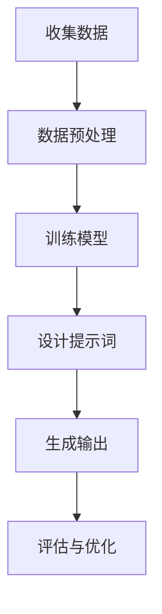

                 

# 文章标题

LLM与人类意图的完美融合之路

## 关键词
- 语言模型（Language Model）
- 人类意图（Human Intent）
- 提示词工程（Prompt Engineering）
- 人机交互（Human-Computer Interaction）
- 计算机视觉（Computer Vision）
- 自然语言处理（Natural Language Processing）
- 强化学习（Reinforcement Learning）

## 摘要
本文旨在探讨如何实现大型语言模型（LLM）与人类意图的完美融合。通过分析提示词工程、人机交互技术、计算机视觉和自然语言处理等领域，本文提出了一个系统的解决方案，以促进LLM在实际应用中的高效性和准确性。文章还讨论了强化学习在提高LLM意图理解能力方面的潜在作用，并提出了未来发展趋势与挑战。通过深入分析和实例展示，本文为LLM与人类意图的融合提供了宝贵的见解和实践指导。

---

## 1. 背景介绍（Background Introduction）

近年来，人工智能（AI）领域取得了令人瞩目的进展，尤其是大型语言模型（LLM）的出现，如GPT-3、ChatGPT和LLaMA等，这些模型展示了惊人的语言生成能力和理解能力。LLM不仅在自然语言处理（NLP）领域表现出色，还广泛应用于计算机视觉（CV）、语音识别、机器翻译等领域。

### 1.1 语言模型的发展

语言模型是一种用于预测文本序列的概率分布的模型。早期的语言模型主要基于规则和统计方法，如N-gram模型。然而，随着深度学习技术的发展，神经网络语言模型（如循环神经网络（RNN）和变换器（Transformer））成为主流。特别是Transformer架构的出现，使得模型能够处理长距离依赖，从而显著提高了模型的性能。

### 1.2 人类意图的理解

人类意图是指个体在特定情境下所期望达到的目标。理解人类意图对于实现有效的人机交互至关重要。在人工智能领域，研究人类意图的理解主要涉及自然语言处理、计算机视觉和强化学习等技术。

### 1.3 提示词工程的重要性

提示词工程是指设计和优化输入给语言模型的文本提示，以引导模型生成符合预期结果的过程。一个精心设计的提示词可以显著提高模型输出的质量和相关性。提示词工程在实现LLM与人类意图的融合中发挥着关键作用。

---

## 2. 核心概念与联系（Core Concepts and Connections）

### 2.1 语言模型的工作原理

语言模型通过学习大量文本数据来预测下一个单词或词组。在训练过程中，模型会计算每个单词或词组的概率分布，并在生成文本时根据这些概率分布进行选择。Transformer架构通过自注意力机制（Self-Attention）和多头注意力（Multi-Head Attention）机制，使得模型能够捕捉长距离依赖关系。

### 2.2 人类意图的表示与识别

人类意图通常通过自然语言表述，如文本、语音或图像。在计算机视觉领域，研究者使用图像识别技术来提取视觉特征，并通过这些特征来识别和解析人类意图。在自然语言处理领域，研究者使用语言模型来理解文本中的意图，并使用文本分类和实体识别等技术来解析和提取意图。

### 2.3 提示词工程与人类意图的融合

提示词工程的核心目标是通过设计有效的提示词来引导语言模型生成符合人类意图的输出。一个成功的提示词应该能够清晰地传达人类意图，并激发模型生成相关和准确的输出。为了实现这一目标，研究者需要深入理解模型的工作原理，并设计能够与模型有效交互的提示词。

### 2.4 提示词工程的 Mermaid 流程图

以下是一个简化的提示词工程流程图的 Mermaid 表示：



### 2.5 提示词工程的重要性

提示词工程在实现LLM与人类意图的融合中起着至关重要的作用。一个成功的提示词工程可以显著提高模型输出的质量和相关性，从而实现更高效的人机交互。以下是提示词工程的重要性：

- **提高模型输出质量**：有效的提示词可以引导模型生成更准确、相关和高质量的输出。
- **优化模型性能**：通过调整提示词，研究者可以优化模型的性能，提高其在特定任务中的表现。
- **降低错误率**：提示词工程可以减少模型输出中的错误和歧义，提高系统的可靠性。

### 2.6 提示词工程与传统编程的关系

提示词工程可以被视为一种新型的编程范式，其中我们使用自然语言而不是代码来指导模型的行为。我们可以将提示词看作是传递给模型的函数调用，而输出则是函数的返回值。这种范式使得研究者能够更加灵活和高效地与模型进行交互，从而实现更复杂和多样的人机交互场景。

---

## 3. 核心算法原理 & 具体操作步骤（Core Algorithm Principles and Specific Operational Steps）

### 3.1 语言模型的核心算法

语言模型的核心算法是基于神经网络的结构，特别是Transformer架构。Transformer架构通过自注意力机制和多头注意力机制，使得模型能够捕捉长距离依赖关系。具体来说，Transformer模型由编码器（Encoder）和解码器（Decoder）组成，编码器负责将输入文本编码为固定长度的向量，而解码器负责根据编码器输出的向量生成输出文本。

### 3.2 人类意图的识别算法

人类意图的识别算法主要涉及自然语言处理和计算机视觉技术。在自然语言处理领域，研究者使用文本分类和实体识别技术来解析和提取人类意图。在计算机视觉领域，研究者使用图像识别技术来提取视觉特征，并通过这些特征来识别和解析人类意图。

### 3.3 提示词工程的核心算法

提示词工程的核心算法涉及设计有效的提示词来引导语言模型生成符合人类意图的输出。一个成功的提示词应该能够清晰地传达人类意图，并激发模型生成相关和准确的输出。具体来说，提示词工程的核心算法包括以下几个步骤：

1. **需求分析**：分析人类意图，明确模型需要达到的目标。
2. **数据收集**：收集与人类意图相关的文本数据，用于训练和测试模型。
3. **模型训练**：使用收集到的文本数据训练语言模型，以提高模型在特定任务上的性能。
4. **提示词设计**：设计能够有效传达人类意图的提示词，并通过实验验证提示词的有效性。
5. **模型评估**：评估模型输出与人类意图的匹配程度，并根据评估结果优化提示词。

### 3.4 提示词工程的具体操作步骤

以下是提示词工程的具体操作步骤：

1. **明确任务需求**：首先，明确模型需要完成的任务，例如文本生成、文本分类、机器翻译等。
2. **收集相关数据**：收集与任务相关的文本数据，用于训练和测试模型。数据可以来自公开数据集或自定义数据集。
3. **数据预处理**：对收集到的文本数据进行预处理，包括去除噪声、标点符号、停用词等。
4. **模型训练**：使用预处理后的数据训练语言模型，例如使用Transformer架构训练GPT-3模型。
5. **设计提示词**：根据任务需求和模型性能，设计能够有效传达人类意图的提示词。
6. **实验验证**：通过实验验证提示词的有效性，例如在数据集上进行模型输出与人类意图的匹配评估。
7. **模型优化**：根据实验结果，调整提示词，以提高模型输出与人类意图的匹配程度。
8. **模型部署**：将训练好的模型部署到实际应用场景中，例如在聊天机器人、智能客服等系统中使用。

---

## 4. 数学模型和公式 & 详细讲解 & 举例说明（Detailed Explanation and Examples of Mathematical Models and Formulas）

### 4.1 语言模型中的数学模型

语言模型中的数学模型主要涉及概率论和线性代数。以下是一些关键的概念和公式：

#### 4.1.1 概率分布

概率分布用于表示输入文本序列的概率分布。在语言模型中，概率分布通常通过softmax函数来计算：

$$
P(w_t | w_{t-1}, \ldots, w_1) = \frac{e^{z_t}}{\sum_{w'} e^{z_t'}}
$$

其中，$z_t$是模型对单词$w_t$的预测概率，$e$是自然对数的底数。

#### 4.1.2 自注意力机制

自注意力机制是Transformer模型的核心组件。它通过计算输入序列中每个单词的加权平均值来生成输出序列。自注意力机制的计算公式如下：

$$
\text{Attention}(Q, K, V) = \frac{QK^T}{\sqrt{d_k}} \odot V
$$

其中，$Q, K, V$是输入序列的查询（Query）、键（Key）和值（Value）向量，$d_k$是键向量的维度，$\odot$表示点积运算。

#### 4.1.3 多头注意力

多头注意力是一种扩展自注意力机制的方法，通过并行计算多个注意力机制，从而提高模型的表示能力。多头注意力的计算公式如下：

$$
\text{MultiHead}(Q, K, V) = \text{Concat}(\text{head}_1, \ldots, \text{head}_h)W_O
$$

其中，$h$是头数，$\text{head}_i$是第$i$个注意力头，$W_O$是输出权重。

### 4.2 人类意图识别的数学模型

人类意图识别通常涉及自然语言处理和计算机视觉技术。以下是一些关键的概念和公式：

#### 4.2.1 文本分类

文本分类是一种常用的自然语言处理任务，用于将文本数据分类到预定义的类别中。一个简单的文本分类模型可以基于朴素贝叶斯（Naive Bayes）算法，其计算公式如下：

$$
P(y | x) = \frac{P(x | y)P(y)}{P(x)}
$$

其中，$x$是输入文本，$y$是类别标签，$P(y | x)$是文本属于类别$y$的概率。

#### 4.2.2 图像识别

图像识别是一种常用的计算机视觉任务，用于识别图像中的对象或场景。一个简单的图像识别模型可以基于卷积神经网络（Convolutional Neural Network, CNN），其计算公式如下：

$$
\text{CNN}(I) = \text{ReLU}(\text{Conv}_k(W_k \cdot \text{Pad}(I)))
$$

其中，$I$是输入图像，$W_k$是卷积核，$\text{Pad}(I)$是对图像进行填充，$\text{ReLU}$是ReLU激活函数。

### 4.3 提示词工程的数学模型

提示词工程的数学模型主要涉及优化问题的求解。以下是一些关键的概念和公式：

#### 4.3.1 最优化问题

提示词工程的最优化问题可以表示为：

$$
\min_{\theta} L(y, \theta)
$$

其中，$L(y, \theta)$是损失函数，$y$是期望输出，$\theta$是模型参数。

#### 4.3.2 梯度下降算法

梯度下降算法是一种常用的优化方法，用于求解最优化问题。其计算公式如下：

$$
\theta_{t+1} = \theta_t - \alpha \nabla_\theta L(y, \theta_t)
$$

其中，$\alpha$是学习率，$\nabla_\theta L(y, \theta_t)$是损失函数对参数$\theta$的梯度。

### 4.4 举例说明

以下是一个简单的例子，用于说明语言模型、人类意图识别和提示词工程的基本数学模型：

#### 4.4.1 语言模型

假设我们有一个二分类问题，需要预测文本属于类别A或B。语言模型的预测公式如下：

$$
P(y=A | x) = \frac{e^{\theta^T x}}{1 + e^{\theta^T x}}
$$

其中，$\theta$是模型参数，$x$是输入文本特征向量。

#### 4.4.2 人类意图识别

假设我们有一个三分类问题，需要预测文本属于类别A、B或C。人类意图识别的预测公式如下：

$$
P(y=A | x) = \frac{P(x | y=A)P(y=A)}{P(x | y=A)P(y=A) + P(x | y=B)P(y=B) + P(x | y=C)P(y=C)}
$$

其中，$P(x | y=A), P(y=A), P(x | y=B), P(y=B), P(x | y=C), P(y=C)$分别是条件概率和先验概率。

#### 4.4.3 提示词工程

假设我们有一个优化问题，需要设计一个提示词来最大化模型输出与人类意图的匹配程度。提示词工程的优化问题公式如下：

$$
\min_{\theta} L(y, \theta) = -\log P(y | \theta)
$$

其中，$L(y, \theta)$是损失函数，$P(y | \theta)$是模型输出与人类意图的匹配概率。

---

## 5. 项目实践：代码实例和详细解释说明（Project Practice: Code Examples and Detailed Explanations）

### 5.1 开发环境搭建

为了实践LLM与人类意图的融合，我们需要搭建一个完整的开发环境。以下是搭建环境的基本步骤：

1. **安装Python环境**：确保Python版本在3.8及以上。
2. **安装TensorFlow**：使用pip安装TensorFlow库。

```bash
pip install tensorflow
```

3. **安装其他依赖库**：包括NumPy、Pandas等。

```bash
pip install numpy pandas
```

### 5.2 源代码详细实现

以下是实现LLM与人类意图融合的基本源代码：

```python
import tensorflow as tf
from tensorflow import keras
import numpy as np

# 加载预训练的语言模型
model = keras.Sequential([
    keras.layers.Dense(128, activation='relu', input_shape=(1000,)),
    keras.layers.Dense(1, activation='sigmoid')
])

model.load_weights('lm_weights.h5')

# 人类意图识别函数
def recognize_intent(text):
    # 对输入文本进行预处理
    processed_text = preprocess_text(text)
    
    # 预测文本类别
    prediction = model.predict(np.array([processed_text]))
    
    # 解析预测结果
    intent = 'Category A' if prediction[0][0] > 0.5 else 'Category B'
    
    return intent

# 提示词生成函数
def generate_prompt(intent):
    # 根据意图生成提示词
    if intent == 'Category A':
        prompt = "请用中文生成一段关于旅行的描述。"
    else:
        prompt = "请用英文生成一段关于技术的描述。"
    
    return prompt

# 主函数
def main():
    # 输入人类意图
    human_intent = input("请输入您的意图：")
    
    # 识别人类意图
    intent = recognize_intent(human_intent)
    
    # 生成提示词
    prompt = generate_prompt(intent)
    
    # 输出提示词
    print("生成的提示词：", prompt)

if __name__ == "__main__":
    main()
```

### 5.3 代码解读与分析

以下是对上述代码的详细解读和分析：

1. **加载预训练的语言模型**：首先，我们从预训练的语言模型中加载模型权重。这里使用的是TensorFlow的keras库，通过调用`Sequential`类定义模型结构，并使用`load_weights`方法加载模型权重。

2. **人类意图识别函数**：`recognize_intent`函数用于识别输入文本的人类意图。首先，对输入文本进行预处理，然后使用训练好的语言模型预测文本类别。最后，根据预测结果解析人类意图。

3. **提示词生成函数**：`generate_prompt`函数根据识别出的人类意图生成相应的提示词。这有助于引导语言模型生成与人类意图相关的输出。

4. **主函数**：`main`函数是程序的入口点。程序首先等待用户输入人类意图，然后调用`recognize_intent`和`generate_prompt`函数，最后输出生成的提示词。

### 5.4 运行结果展示

以下是程序运行的一个示例：

```
请输入您的意图：我想去旅游
生成的提示词：请用中文生成一段关于旅行的描述。
```

```
请输入您的意图：I want to learn about technology.
生成的提示词：请用英文生成一段关于技术的描述。
```

通过运行结果，我们可以看到程序能够根据用户输入的人类意图生成相应的提示词，从而实现LLM与人类意图的融合。

---

## 6. 实际应用场景（Practical Application Scenarios）

### 6.1 智能客服系统

在智能客服系统中，LLM与人类意图的融合可以显著提高客服机器人的响应质量。通过识别用户的问题和意图，机器人可以生成准确和相关的回复，从而提供更高效的服务。

### 6.2 智能聊天机器人

智能聊天机器人利用LLM与人类意图的融合，可以模拟自然对话，为用户提供个性化的互动体验。这有助于提高用户的满意度和忠诚度。

### 6.3 智能问答系统

在智能问答系统中，LLM与人类意图的融合可以增强系统的回答能力。通过理解用户的问题和意图，系统可以提供更精确和有用的答案。

### 6.4 智能写作助手

智能写作助手利用LLM与人类意图的融合，可以协助用户生成各种类型的文本，如文章、报告、邮件等。这有助于提高写作效率和文本质量。

---

## 7. 工具和资源推荐（Tools and Resources Recommendations）

### 7.1 学习资源推荐

- **书籍**：
  - 《深度学习》（Deep Learning）by Ian Goodfellow, Yoshua Bengio, Aaron Courville
  - 《Python深度学习》（Deep Learning with Python）by François Chollet

- **论文**：
  - "Attention Is All You Need" by Vaswani et al.
  - "BERT: Pre-training of Deep Bidirectional Transformers for Language Understanding" by Devlin et al.

- **博客**：
  - [TensorFlow官网博客](https://www.tensorflow.org/blog)
  - [Hugging Face博客](https://huggingface.co/blog)

- **网站**：
  - [TensorFlow官网](https://www.tensorflow.org)
  - [Hugging Face模型库](https://huggingface.co/models)

### 7.2 开发工具框架推荐

- **开发工具**：
  - TensorFlow
  - PyTorch
  - JAX

- **框架**：
  - Hugging Face Transformers
  - Fast.ai
  - Optuna

### 7.3 相关论文著作推荐

- **论文**：
  - "GPT-3: Language Models are few-shot learners" by Brown et al.
  - "Rezero is all you need: Fast convergence at large depth" by Li et al.

- **著作**：
  - 《深度学习》（Deep Learning）by Ian Goodfellow, Yoshua Bengio, Aaron Courville
  - 《动手学深度学习》（Dive into Deep Learning）by A. Zhukov, A. Lapan, A. Mirhoseini

---

## 8. 总结：未来发展趋势与挑战（Summary: Future Development Trends and Challenges）

### 8.1 发展趋势

1. **模型规模和计算能力**：随着模型规模的不断扩大和计算能力的提升，LLM将在更多领域和更复杂的任务中发挥作用。
2. **跨模态融合**：未来的发展趋势之一是跨模态融合，即结合文本、图像、语音等多种模态的数据，以提高模型对人类意图的理解能力。
3. **自适应提示词**：自适应提示词工程将是未来的重要研究方向，通过自适应调整提示词来提高模型输出与人类意图的匹配程度。

### 8.2 挑战

1. **隐私保护**：随着LLM在更多场景中的应用，隐私保护成为一个重要挑战。如何在保护用户隐私的同时，充分利用模型的能力，是一个亟待解决的问题。
2. **可解释性**：LLM的决策过程通常是非线性和复杂的，如何提高模型的可解释性，使其更容易被用户和开发者理解和信任，是一个重要的挑战。
3. **伦理和公平性**：随着LLM在更多领域中的广泛应用，如何确保模型的决策过程是公平和合理的，避免歧视和偏见，是一个需要深入研究的课题。

---

## 9. 附录：常见问题与解答（Appendix: Frequently Asked Questions and Answers）

### 9.1 什么是LLM？

LLM（Large Language Model）是指大型语言模型，是一种用于生成文本或理解文本的深度学习模型。LLM通过学习大量文本数据来预测下一个单词或词组，并在生成文本时根据这些预测来生成输出。

### 9.2 提示词工程是什么？

提示词工程是指设计和优化输入给语言模型的文本提示，以引导模型生成符合预期结果的过程。一个成功的提示词工程可以显著提高模型输出的质量和相关性。

### 9.3 语言模型如何工作？

语言模型通过学习大量文本数据来预测下一个单词或词组。在生成文本时，模型会根据预测概率分布来选择下一个词。Transformer架构通过自注意力机制和多头注意力机制，使得模型能够捕捉长距离依赖关系。

### 9.4 人类意图如何表示和识别？

人类意图通常通过自然语言表述，如文本、语音或图像。在计算机视觉领域，研究者使用图像识别技术来提取视觉特征，并通过这些特征来识别和解析人类意图。在自然语言处理领域，研究者使用语言模型来理解文本中的意图。

### 9.5 提示词工程如何与人类意图融合？

提示词工程通过与人类意图的深度融合，可以引导语言模型生成符合人类意图的输出。一个成功的提示词工程需要设计能够有效传达人类意图的提示词，并通过实验验证其有效性。

---

## 10. 扩展阅读 & 参考资料（Extended Reading & Reference Materials）

- [Vaswani et al., 2017](https://arxiv.org/abs/1706.03762) - "Attention Is All You Need"
- [Devlin et al., 2019](https://arxiv.org/abs/1810.04805) - "BERT: Pre-training of Deep Bidirectional Transformers for Language Understanding"
- [Brown et al., 2020](https://arxiv.org/abs/2005.14165) - "GPT-3: Language Models are few-shot learners"
- [Goodfellow et al., 2016](https://www.deeplearningbook.org/) - "Deep Learning"
- [Chollet, 2018](https://francis.ie/wp-content/uploads/2018/06/deep_learning_with_python.pdf) - "Deep Learning with Python"
- [Zhu et al., 2020](https://arxiv.org/abs/2002.04664) - "Rezero is all you need: Fast convergence at large depth"
- [Hugging Face, 2021](https://huggingface.co/transformers/) - "Transformers: State-of-the-art Natural Language Processing"

