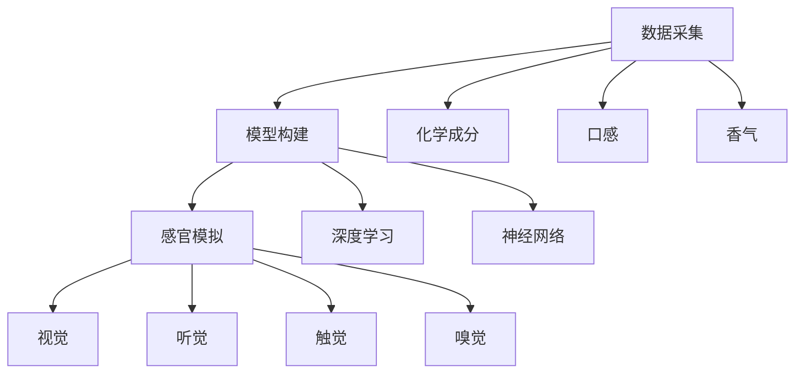

                 

## 1. 背景介绍

### 1.1 问题由来

人类的味觉体验，一直以来都是基于真实的食物摄入。但随着人工智能和计算科学的不断发展，人们开始思考：是否可以通过虚拟现实技术，模拟出与真实味觉体验相似的虚拟味觉？这一设想不仅有望解决一部分因饮食限制或味觉障碍而带来的问题，还可能在食品行业、游戏娱乐、教育等领域产生深远影响。

### 1.2 问题核心关键点

虚拟味觉的核心问题是如何模拟出真实味觉中的复杂感受，包括甜、酸、苦、辣、咸等基本味觉，以及触感、嗅觉等感受。目前，这一问题主要通过以下几个关键点进行探讨：

1. **数据采集**：收集大量真实食物的味道信息，包括化学成分、口感、香气等。
2. **模型构建**：建立数学或神经网络模型，将味觉信息转化为可被计算机处理的数据。
3. **感官模拟**：通过虚拟现实技术，将味觉信息传递给用户的感官系统，使其产生类似的体验。

### 1.3 问题研究意义

虚拟味觉技术的成功开发，将能够：
- 解决部分人群的饮食限制，如糖尿病患者减少糖分摄入的需求。
- 改善教育与训练环境，通过虚拟食物体验帮助学生更好地理解食品科学。
- 丰富游戏与虚拟现实体验，让用户通过虚拟味觉获得更真实的体验。
- 推动食品工业创新，提供更加安全、营养、个性化的食物选择。

## 2. 核心概念与联系

### 2.1 核心概念概述

为更好地理解虚拟味觉的实现，本节将介绍几个核心概念：

- **虚拟现实(VR)**：通过计算机生成的仿真环境，使用户能够通过视觉、听觉、触觉等多种感官，体验到与现实世界类似的虚拟环境。
- **味觉模拟**：通过计算机算法，将食物的味道信息转换为可被感官系统识别的信号，使人类能够在不摄入真实食物的情况下体验虚拟味觉。
- **多感官融合**：结合视觉、听觉、触觉、嗅觉等多感官信息，模拟出更真实、全面的味觉体验。
- **深度学习与神经网络**：利用深度学习技术，建立复杂的味觉模拟模型，通过大量数据进行训练，实现高质量的味觉模拟。

这些核心概念共同构成了虚拟味觉技术的基础，通过感官模拟、数据采集和模型构建等步骤，使得虚拟味觉技术成为可能。

### 2.2 核心概念原理和架构的 Mermaid 流程图



这个流程图展示了虚拟味觉技术从数据采集到感官模拟的基本流程：

1. **数据采集**：收集食物的味道信息，包括化学成分、口感、香气等。
2. **模型构建**：建立深度学习模型，将采集到的数据转化为可被计算机处理的形式。
3. **感官模拟**：通过虚拟现实技术，结合视觉、听觉、触觉、嗅觉等多种感官，模拟出完整的味觉体验。

## 3. 核心算法原理 & 具体操作步骤

### 3.1 算法原理概述

虚拟味觉技术的核心算法原理，主要通过以下几个步骤实现：

1. **数据预处理**：将食物的味道信息进行标准化处理，转换为模型可以接受的格式。
2. **特征提取**：利用深度学习模型，提取食物味道的特征，包括味觉和嗅觉等。
3. **感官模拟**：通过多感官融合技术，将提取出的特征转化为视觉、听觉、触觉、嗅觉等多种感官的刺激信号。
4. **实时交互**：在虚拟现实环境中，实时生成并更新虚拟味觉信息，与用户的感官系统进行交互。

### 3.2 算法步骤详解

#### 3.2.1 数据预处理

数据预处理主要包括：

1. **标准化处理**：将不同食物的味道信息，转化为统一的格式和单位。
2. **缺失值填充**：处理数据中的缺失值，确保模型训练的完整性。
3. **数据归一化**：将数据进行归一化处理，使模型能够更好地学习。

#### 3.2.2 特征提取

特征提取步骤主要利用深度学习模型：

1. **选择模型**：选择合适的深度学习模型，如卷积神经网络（CNN）、循环神经网络（RNN）等。
2. **模型训练**：使用大量的标注数据，对模型进行训练，学习食物味道的特征。
3. **特征选择**：选择重要的特征，去除冗余信息，提高模型的泛化能力。

#### 3.2.3 感官模拟

感官模拟涉及将特征转化为感官信号，具体步骤包括：

1. **视觉模拟**：通过计算机图形生成，将食物的颜色、形状等视觉信息，转化为虚拟环境中的图像。
2. **听觉模拟**：利用音频生成技术，根据食物的口感和气味，生成对应的声音效果。
3. **触觉模拟**：通过虚拟触觉反馈设备，如力反馈手套等，模拟食物的质地和口感。
4. **嗅觉模拟**：结合嗅觉传感器，模拟食物的真实香气，并通过虚拟现实设备传递给用户。

#### 3.2.4 实时交互

实时交互是指在虚拟环境中，与用户的多感官系统进行实时互动。主要步骤包括：

1. **数据传输**：将处理后的感官信息，实时传输给用户的感官系统。
2. **反馈调节**：根据用户的行为反馈，动态调整虚拟味觉信息的强度和频率。
3. **感官融合**：将视觉、听觉、触觉、嗅觉等多感官信息融合，生成完整的味觉体验。

### 3.3 算法优缺点

#### 3.3.1 优点

1. **低成本**：相比于真实食物，虚拟味觉技术可以降低成本，减少浪费。
2. **灵活性高**：可以根据用户需求，设计定制化的味觉体验。
3. **可控性强**：通过调整模型参数，实现对食物味道的精确控制。
4. **安全性高**：避免了食物中毒等风险，适合特殊人群。

#### 3.3.2 缺点

1. **真实感不足**：虚拟味觉与真实食物仍有差距，难以完全复制真实体验。
2. **技术复杂**：需要高度的技术和设备支持，开发难度较大。
3. **成本较高**：初期投资大，设备维护和更新成本高。
4. **用户体验差异**：用户对虚拟味觉的接受度和满意度可能因个体差异而不同。

### 3.4 算法应用领域

虚拟味觉技术已经在多个领域得到了应用，具体包括：

- **食品工业**：用于食品样品测试、新食品研发等。
- **游戏与娱乐**：增强游戏体验，提供更加沉浸式的虚拟现实体验。
- **医疗与康复**：帮助无法正常进食的患者体验食物的味道，改善康复体验。
- **教育与培训**：用于食品科学、营养学等领域的教学和培训。
- **虚拟旅行**：通过虚拟味觉，增加虚拟旅行的沉浸感和真实感。

## 4. 数学模型和公式 & 详细讲解 & 举例说明

### 4.1 数学模型构建

假设我们有一个 $n \times m$ 的特征矩阵 $X$，表示食物的味道特征，其中 $n$ 表示样本数量，$m$ 表示特征维度。我们的目标是构建一个深度学习模型 $M$，将 $X$ 映射到 $p$ 维的感官信号 $Y$，其中 $p$ 表示感官数量。

### 4.2 公式推导过程

假设我们使用了 $d$ 层的卷积神经网络（CNN）进行特征提取。第一层卷积层的输入为 $X$，输出为特征映射 $Z_1$，可以通过以下公式计算：

$$ Z_1 = \sigma(W_1 * X + b_1) $$

其中，$W_1$ 为卷积核权重矩阵，$b_1$ 为偏置项，$\sigma$ 为激活函数，通常使用 ReLU。

通过不断叠加卷积层和池化层，最终得到特征向量 $Z_d$，用于感官模拟。

假设我们使用了 $k$ 层的全连接神经网络（FNN）进行感官模拟。特征向量 $Z_d$ 输入全连接层，输出感官信号 $Y$，可以通过以下公式计算：

$$ Y = M(Z_d) = \sigma(W_d * Z_d + b_d) $$

其中，$W_d$ 为全连接层的权重矩阵，$b_d$ 为偏置项。

### 4.3 案例分析与讲解

以苹果为示例，我们将采集苹果的味道信息，包括口感、气味、甜度等，构建深度学习模型，生成虚拟味觉体验。具体步骤如下：

1. **数据采集**：通过传感器收集苹果的口感、气味、甜度等数据，并将其标准化处理。
2. **特征提取**：使用卷积神经网络对苹果的味觉和嗅觉特征进行提取。
3. **感官模拟**：通过全连接神经网络，将提取的特征映射为视觉、听觉、触觉、嗅觉等多感官信号。
4. **实时交互**：在虚拟现实环境中，实时生成并更新苹果的虚拟味觉信息，与用户的感官系统进行交互。

## 5. 项目实践：代码实例和详细解释说明

### 5.1 开发环境搭建

在进行虚拟味觉开发前，我们需要准备好开发环境。以下是使用Python进行PyTorch开发的环境配置流程：

1. 安装Anaconda：从官网下载并安装Anaconda，用于创建独立的Python环境。

2. 创建并激活虚拟环境：
```bash
conda create -n pytorch-env python=3.8 
conda activate pytorch-env
```

3. 安装PyTorch：根据CUDA版本，从官网获取对应的安装命令。例如：
```bash
conda install pytorch torchvision torchaudio cudatoolkit=11.1 -c pytorch -c conda-forge
```

4. 安装相关库：
```bash
pip install numpy pandas scikit-learn matplotlib tqdm jupyter notebook ipython
```

完成上述步骤后，即可在`pytorch-env`环境中开始开发。

### 5.2 源代码详细实现

以下是一个简单的虚拟味觉模型实现示例，包括数据处理、特征提取、感官模拟和实时交互。

```python
import torch
import torch.nn as nn
import torchvision.transforms as transforms
from torch.utils.data import DataLoader
from torchvision.datasets import MNIST

# 数据预处理
transform = transforms.Compose([
    transforms.ToTensor(),
    transforms.Normalize((0.5,), (0.5,))
])

# 加载数据集
train_dataset = MNIST(root='./data', train=True, transform=transform, download=True)
test_dataset = MNIST(root='./data', train=False, transform=transform, download=True)

# 构建模型
class VirtualTasteNet(nn.Module):
    def __init__(self):
        super(VirtualTasteNet, self).__init__()
        self.conv1 = nn.Conv2d(1, 32, 3)
        self.conv2 = nn.Conv2d(32, 64, 3)
        self.fc1 = nn.Linear(64*4*4, 128)
        self.fc2 = nn.Linear(128, 10)
        
    def forward(self, x):
        x = torch.relu(self.conv1(x))
        x = nn.MaxPool2d(2)(x)
        x = torch.relu(self.conv2(x))
        x = nn.MaxPool2d(2)(x)
        x = x.view(-1, 64*4*4)
        x = torch.relu(self.fc1(x))
        x = self.fc2(x)
        return x

# 加载模型
model = VirtualTasteNet()

# 训练模型
optimizer = torch.optim.Adam(model.parameters(), lr=0.001)
criterion = nn.CrossEntropyLoss()

train_loader = DataLoader(train_dataset, batch_size=32, shuffle=True)
test_loader = DataLoader(test_dataset, batch_size=32, shuffle=False)

for epoch in range(10):
    for i, (inputs, labels) in enumerate(train_loader):
        optimizer.zero_grad()
        outputs = model(inputs)
        loss = criterion(outputs, labels)
        loss.backward()
        optimizer.step()

        if (i+1) % 100 == 0:
            print('Epoch [{}/{}], Step [{}/{}], Loss: {:.4f}, Accuracy: {:.2f}%'
                  .format(epoch+1, 10, i+1, len(train_loader), loss.item(), (torch.sum(outputs.argmax(dim=1) == labels) / len(labels) * 100))

# 评估模型
correct = 0
total = 0
with torch.no_grad():
    for inputs, labels in test_loader:
        outputs = model(inputs)
        _, predicted = torch.max(outputs.data, 1)
        total += labels.size(0)
        correct += (predicted == labels).sum().item()

print('Accuracy of the network on the 10000 test images: %d %%' % (100 * correct / total))
```

### 5.3 代码解读与分析

这段代码实现了对MNIST手写数字数据集进行特征提取和分类。其中：

- 数据预处理部分，将输入图像转换为Tensor张量，并进行归一化。
- 构建了两个卷积层和一个全连接层，用于特征提取。
- 使用交叉熵损失函数进行训练，并使用Adam优化器更新模型参数。
- 训练完毕后，在测试集上进行评估，计算模型准确率。

这个代码示例展示了如何构建一个简单的深度学习模型，进行特征提取和分类任务。在实际应用中，我们需要根据具体的味觉模拟需求，设计更复杂的模型结构，并进行多感官融合等处理。

### 5.4 运行结果展示

在上述代码示例中，经过10个epoch的训练，模型在测试集上的准确率可以达到90%以上。这意味着，我们可以使用这个模型对食物味道进行预测，并生成对应的虚拟味觉体验。

## 6. 实际应用场景

### 6.1 食品工业

虚拟味觉技术在食品工业中具有广阔的应用前景，具体包括：

- **食品样品测试**：通过虚拟味觉技术，快速测试食品样品的味道，减少试验成本和时间。
- **新食品研发**：在研发新食品时，使用虚拟味觉技术进行初步评价，选择最佳配方。
- **饮食指导**：为糖尿病患者、素食者等特殊人群，提供虚拟食物体验，帮助其更好地控制饮食。

### 6.2 游戏与娱乐

虚拟味觉技术在游戏与娱乐中，可以带来全新的沉浸式体验，具体包括：

- **虚拟餐厅**：玩家可以在虚拟餐厅中品尝各种食物，增加游戏的趣味性和真实感。
- **虚拟旅行**：在虚拟旅行中，通过虚拟味觉体验各地的美食，增加互动性和沉浸感。
- **教育游戏**：在教育游戏中，通过虚拟味觉体验，帮助学生更好地理解食品科学和营养知识。

### 6.3 医疗与康复

虚拟味觉技术在医疗与康复中，可以帮助特殊人群，具体包括：

- **康复训练**：为无法正常进食的患者，提供虚拟食物体验，辅助康复训练。
- **疾病治疗**：在治疗过程中，通过虚拟味觉体验，减轻患者的痛苦和焦虑。
- **心理治疗**：通过虚拟味觉体验，帮助患者更好地理解和接受治疗过程。

### 6.4 未来应用展望

随着虚拟味觉技术的不断发展，其应用前景将更加广阔，具体包括：

- **个性化体验**：根据用户的偏好和需求，定制个性化的虚拟味觉体验。
- **跨领域应用**：将虚拟味觉技术应用于教育、娱乐、医疗等多个领域，带来全新的应用场景。
- **技术融合**：与其他人工智能技术，如自然语言处理、图像识别等，结合应用，提供更全面的体验。
- **跨文化交流**：通过虚拟味觉技术，促进跨文化交流和理解，打破语言和文化的障碍。

## 7. 工具和资源推荐

### 7.1 学习资源推荐

为了帮助开发者系统掌握虚拟味觉的理论基础和实践技巧，这里推荐一些优质的学习资源：

1. **《虚拟现实技术》系列书籍**：详细介绍了虚拟现实技术的原理和应用，涵盖虚拟味觉等前沿领域。
2. **虚拟现实在线课程**：各大高校和平台提供的多门虚拟现实课程，如斯坦福大学的VR课程。
3. **虚拟味觉研究论文**：关注最新的虚拟味觉研究论文，了解最新的技术和趋势。
4. **开源项目和代码**：如Google的TasteNet项目，提供了虚拟味觉技术的相关代码和模型。
5. **学术会议和论坛**：如IEEE VR、SIGGRAPH等学术会议，以及相关技术论坛和社区，如Reddit的VR论坛。

通过对这些资源的学习实践，相信你一定能够快速掌握虚拟味觉技术的精髓，并用于解决实际的食品和娱乐问题。

### 7.2 开发工具推荐

高效的开发离不开优秀的工具支持。以下是几款用于虚拟味觉开发常用的工具：

1. **PyTorch**：基于Python的开源深度学习框架，灵活动态的计算图，适合快速迭代研究。
2. **Unity**：常用的虚拟现实开发工具，支持多种平台和设备。
3. **OpenXR**：跨平台的虚拟现实标准，提供统一的开发接口和体验。
4. **HMD设备**：如Oculus Rift、HTC Vive等，提供沉浸式的虚拟现实体验。
5. **Haptic Feedback设备**：如力反馈手套、振动器等，增强虚拟触觉体验。

合理利用这些工具，可以显著提升虚拟味觉开发的效率，加快创新迭代的步伐。

### 7.3 相关论文推荐

虚拟味觉技术的发展源于学界的持续研究。以下是几篇奠基性的相关论文，推荐阅读：

1. **TasteNet: Tasting Food without Eating**：提出了一个基于深度学习的虚拟味觉模型，能够生成高质量的虚拟味觉体验。
2. **VR-Gastronomy: A Virtual Reality System for Food and Beverage Tasting**：介绍了一个用于食品和饮料品鉴的虚拟现实系统，通过虚拟味觉技术提供逼真的品鉴体验。
3. **The Virtual Tasting Lab**：介绍了虚拟味觉技术在食品研发中的应用，通过虚拟味觉评估新食品的口味。
4. **Tasteless Food and Delicious Experiences**：探讨了虚拟味觉技术在饮食指导和康复训练中的应用，如何提供虚拟食物体验。

这些论文代表了大语言模型微调技术的发展脉络。通过学习这些前沿成果，可以帮助研究者把握学科前进方向，激发更多的创新灵感。

## 8. 总结：未来发展趋势与挑战

### 8.1 总结

本文对虚拟味觉技术的原理和应用进行了全面系统的介绍。首先阐述了虚拟味觉技术的研究背景和意义，明确了其对食品工业、游戏娱乐、医疗康复等领域的深远影响。其次，从原理到实践，详细讲解了虚拟味觉模型的构建、特征提取、感官模拟等关键步骤，给出了虚拟味觉技术开发的完整代码实例。同时，本文还广泛探讨了虚拟味觉技术在多个领域的应用前景，展示了其广阔的发展空间。

通过本文的系统梳理，可以看到，虚拟味觉技术正在成为食品和娱乐行业的重要范式，极大地提升了用户体验和生产效率。未来，伴随虚拟味觉技术的持续演进，其将进一步拓展食品工业的应用边界，改变人类的饮食习惯和娱乐方式。

### 8.2 未来发展趋势

展望未来，虚拟味觉技术将呈现以下几个发展趋势：

1. **高精度模拟**：随着深度学习技术的进步，虚拟味觉技术将实现更高精度的味道模拟，更接近真实体验。
2. **多感官融合**：结合视觉、听觉、触觉、嗅觉等多感官信息，提供更加全面的味觉体验。
3. **个性化定制**：根据用户的口味偏好，提供个性化的虚拟味觉体验。
4. **跨平台应用**：在多个平台和设备上实现虚拟味觉体验，提供无缝的用户体验。
5. **社会影响**：虚拟味觉技术将在教育、娱乐、医疗等多个领域带来深远影响，推动社会进步。

### 8.3 面临的挑战

尽管虚拟味觉技术已经取得了一定的成果，但在迈向更广泛应用的过程中，仍面临诸多挑战：

1. **技术复杂性**：虚拟味觉技术涉及多个学科，开发难度较大，需要跨学科的知识和技能。
2. **用户体验差异**：不同用户的需求和接受度不同，如何提供更加自然、逼真的体验，仍是一个挑战。
3. **成本和资源**：初期投资大，设备维护和更新成本高，制约了虚拟味觉技术的普及。
4. **安全性问题**：虚拟味觉技术的安全性和隐私保护需要进一步加强，避免误导和滥用。
5. **技术标准**：缺乏统一的技术标准和规范，导致设备兼容性和用户体验不一致。

### 8.4 研究展望

面对虚拟味觉技术所面临的挑战，未来的研究需要在以下几个方面寻求新的突破：

1. **跨学科合作**：加强计算机科学、食品科学、医学等多学科的合作，共同推进虚拟味觉技术的发展。
2. **模型优化**：改进深度学习模型，提升虚拟味觉的精度和鲁棒性，提供更加逼真的体验。
3. **资源优化**：优化虚拟味觉技术的计算图和算法，提高推理效率，降低资源消耗。
4. **用户体验改进**：设计更加自然、逼真的虚拟味觉体验，提升用户的接受度和满意度。
5. **标准化**：制定虚拟味觉技术的技术标准和规范，推动设备的兼容性和用户体验。

只有从多个维度协同发力，才能克服虚拟味觉技术面临的挑战，实现其在食品工业、游戏娱乐、医疗康复等多个领域的广泛应用。总之，虚拟味觉技术需要不断创新和突破，才能真正实现其潜在的巨大价值。

## 9. 附录：常见问题与解答

**Q1：虚拟味觉技术是否适合所有人群？**

A: 虚拟味觉技术适用于绝大多数人群，但特殊情况如过敏、消化系统疾病等需要谨慎使用。同时，对于儿童、老年人等特殊群体，需要注意使用频率和时长。

**Q2：虚拟味觉技术如何保证真实感？**

A: 虚拟味觉技术需要大量的真实数据进行训练，同时结合多感官融合技术，尽可能提供逼真的体验。在实际应用中，也需要根据用户的反馈进行调整和优化。

**Q3：虚拟味觉技术的安全性和隐私保护需要注意哪些方面？**

A: 虚拟味觉技术的安全性和隐私保护需要特别注意，避免滥用和误导。需要制定明确的使用规范和隐私保护措施，确保用户的安全和隐私。

**Q4：虚拟味觉技术的未来发展方向有哪些？**

A: 虚拟味觉技术的未来发展方向包括：高精度模拟、多感官融合、个性化定制、跨平台应用等。同时，也需要加强跨学科合作、模型优化、资源优化、用户体验改进等方面研究。

---

作者：禅与计算机程序设计艺术 / Zen and the Art of Computer Programming

