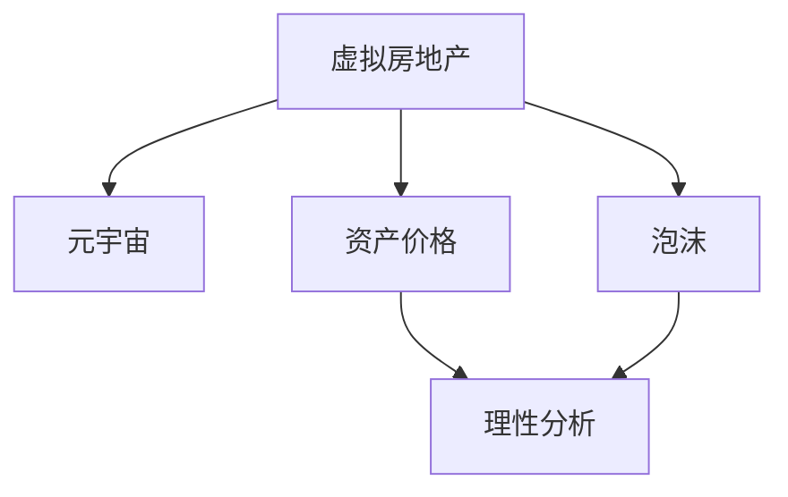

                 

# 虚拟房地产泡沫:元宇宙资产价格的理性分析

> 关键词：虚拟房地产,元宇宙,泡沫,资产价格,理性分析

## 1. 背景介绍

### 1.1 问题由来
随着元宇宙技术的兴起，虚拟房地产作为元宇宙核心资产之一，其价格在过去几年内经历了急剧波动。据公开数据，部分虚拟土地的交易价格甚至达到了现实世界房地产价格的数百倍，形成了一场资本和炒作的狂欢。虚拟房地产的价格泡沫现象，引起了广泛的社会关注和学术讨论。

### 1.2 问题核心关键点
元宇宙虚拟房地产泡沫的核心在于其资产价格的形成机制和驱动因素。与现实世界房地产相似，虚拟房地产价格也受供需关系、政策法规、技术进步、市场预期等多种因素的共同影响。但元宇宙虚拟房地产独特的技术基础和应用场景，使其价格机制和泡沫风险具有特殊性。本文将从虚拟房地产价格的形成机制、泡沫成因、风险评估等方面进行理性分析，为市场参与者提供有价值的参考。

## 2. 核心概念与联系

### 2.1 核心概念概述

为更好地理解虚拟房地产泡沫的理性分析，本节将介绍几个密切相关的核心概念：

- **虚拟房地产**：在元宇宙中，用户通过区块链技术，购买、租赁、交易虚拟土地或建筑物，其存在形式和交易方式与现实世界房地产相似。虚拟房地产的价值主要体现在其稀缺性和使用价值上。
- **元宇宙**：一种通过虚拟现实、增强现实、区块链等技术，构建的虚拟数字世界。元宇宙旨在提供沉浸式体验，支持多人互动、经济交易等功能。
- **泡沫**：金融学中指资产价格因非理性投资行为而过度膨胀，最终以价格急剧下跌告终的经济现象。
- **资产价格**：资产的交易价值，反映了市场对其未来收益的预期。资产价格受供需关系、成本、风险、流动性等多种因素影响。
- **理性分析**：基于现有数据和理论，对资产价格的形成机制、风险特征等进行深入分析和评估，避免盲目投资和风险决策。

这些核心概念之间的逻辑关系可以通过以下Mermaid流程图来展示：



这个流程图展示了几组概念之间的内在联系：

1. 虚拟房地产是元宇宙中的核心资产，具备稀缺性和使用价值。
2. 元宇宙提供虚拟房地产交易的平台，影响资产的价格机制。
3. 资产价格受多种因素影响，是理性分析的主要对象。
4. 泡沫是资产价格过度膨胀的极端状态，需要通过理性分析进行识别和预警。

## 3. 核心算法原理 & 具体操作步骤
### 3.1 算法原理概述

虚拟房地产价格的理性分析，主要涉及以下算法原理：

- **需求-供给模型**：基于经济学中的供需关系，分析虚拟房地产的价格波动。供需模型通常包括供给函数和需求函数，反映市场参与者的行为决策。
- **均衡价格理论**：通过供需函数的平衡点，推导虚拟房地产的均衡价格，指导理性投资决策。
- **市场预期模型**：分析市场参与者对未来房地产价格的预期，评估其对当前价格的影响。
- **技术进步影响**：考察元宇宙技术发展对虚拟房地产供需关系的影响，如土地生成成本、交易效率等。
- **政策法规约束**：分析政府对虚拟房地产交易的监管政策，评估其对市场流动性和价格稳定性的影响。

### 3.2 算法步骤详解

虚拟房地产泡沫的理性分析包括以下几个关键步骤：

**Step 1: 收集和处理数据**
- 收集虚拟房地产市场的历史价格数据、供需数据、市场预期数据、技术进步数据、政策法规数据等。
- 使用Python等编程语言，对数据进行清洗、预处理、归一化等操作，形成可用于分析的数据集。

**Step 2: 建立数学模型**
- 根据供需关系，构建虚拟房地产的供给函数和需求函数。
- 使用均衡价格理论，求解供给函数和需求函数的平衡点，得到虚拟房地产的均衡价格。
- 引入市场预期模型，分析市场参与者对未来价格的预测，调整均衡价格模型。
- 考虑技术进步对供需关系的影响，引入技术进步的度量指标，如土地生成成本、交易效率等。
- 分析政策法规的约束，引入监管政策的参数，如交易税、交易限制等。

**Step 3: 进行假设和简化**
- 对虚拟房地产市场进行合理的假设，如市场完全竞争、信息对称等。
- 简化模型，去除非关键因素，提高计算效率。

**Step 4: 参数估计和模型验证**
- 使用历史数据对模型参数进行估计，求解虚拟房地产的均衡价格。
- 对模型进行验证，评估其对历史数据的拟合程度。

**Step 5: 风险评估和预警**
- 根据模型结果，评估虚拟房地产市场的泡沫风险，识别可能的泡沫形成信号。
- 建立预警机制，当泡沫风险达到预设阈值时，发出预警信号。

**Step 6: 政策建议**
- 基于风险评估结果，提出合理的政策建议，如加强监管、引导理性投资等。

### 3.3 算法优缺点

虚拟房地产泡沫的理性分析具有以下优点：
1. 理论框架清晰，逻辑性强，易于理解和应用。
2. 模型可量化，可以进行系统化的风险评估。
3. 结合了市场预期和技术进步，具有较高的实用价值。

同时，该方法也存在一些局限性：
1. 假设较为理想，现实市场存在诸多复杂因素，难以完全准确反映。
2. 模型依赖大量历史数据，数据获取难度大，且可能存在数据偏差。
3. 市场预期难以完全预测，可能导致模型结果与实际不符。
4. 技术进步和政策法规等因素影响复杂，难以全面考虑。

尽管存在这些局限性，但虚拟房地产泡沫的理性分析方法仍为市场参与者提供了重要的参考。未来研究应致力于提高模型的准确性和实用性，更好地指导投资决策。

### 3.4 算法应用领域

虚拟房地产泡沫的理性分析主要应用于以下领域：

- **投资决策**：为投资者提供基于数据和理论的理性分析，帮助其识别市场泡沫，避免盲目投资。
- **市场监管**：为政府和监管机构提供决策依据，识别潜在泡沫，采取预防措施，稳定市场秩序。
- **学术研究**：为元宇宙经济学的研究提供方法论，探讨虚拟资产价格的形成机制和波动规律。

## 4. 数学模型和公式 & 详细讲解
### 4.1 数学模型构建

虚拟房地产泡沫的理性分析，可以通过构建供需模型来进行数学建模。假设虚拟房地产市场为完全竞争市场，设虚拟房地产的供给函数为 $S(p)$，需求函数为 $D(p)$，其中 $p$ 为虚拟房地产价格。供给函数和需求函数一般形式为：

$$
S(p) = a + b \cdot p
$$
$$
D(p) = c - d \cdot p
$$

其中 $a$、$b$、$c$、$d$ 为模型参数，代表供给和需求的斜率、截距等。

均衡价格 $p_e$ 为供需函数的交点，即：

$$
S(p_e) = D(p_e)
$$

解得：

$$
p_e = \frac{a - c}{b + d}
$$

在引入市场预期和技术进步影响后，模型可以进一步扩展为：

$$
S(p) = a + b \cdot p + f(T)
$$
$$
D(p) = c - d \cdot p + g(E)
$$

其中 $f(T)$ 和 $g(E)$ 分别代表技术进步和市场预期对供给和需求函数的影响。

### 4.2 公式推导过程

以均衡价格模型为例，推导其公式推导过程：

假设供给函数和需求函数为：

$$
S(p) = a + b \cdot p
$$
$$
D(p) = c - d \cdot p
$$

其交点为：

$$
S(p_e) = a + b \cdot p_e = D(p_e) = c - d \cdot p_e
$$

解得：

$$
p_e = \frac{a - c}{b + d}
$$

引入市场预期和技术进步影响后，函数变为：

$$
S(p) = a + b \cdot p + f(T)
$$
$$
D(p) = c - d \cdot p + g(E)
$$

均衡价格公式变为：

$$
p_e = \frac{a + b \cdot p_e + f(T) - c - d \cdot p_e - g(E)}{b + d}
$$

解得：

$$
p_e = \frac{a - c + (b - d) \cdot p_e + f(T) - g(E)}{b + d}
$$

整理得：

$$
p_e = \frac{a - c + f(T) - g(E)}{b + d} + \frac{(b - d) \cdot p_e}{b + d}
$$

进一步化简得：

$$
p_e = \frac{a - c + f(T) - g(E)}{b + d} + (b - d) \cdot p_e
$$

将 $p_e$ 移项得：

$$
p_e - (b - d) \cdot p_e = \frac{a - c + f(T) - g(E)}{b + d}
$$

$$
(b + d) \cdot p_e - (b - d) \cdot p_e = \frac{a - c + f(T) - g(E)}{b + d}
$$

化简得：

$$
2d \cdot p_e = \frac{a - c + f(T) - g(E)}{b + d}
$$

$$
p_e = \frac{a - c + f(T) - g(E)}{2d (b + d)}
$$

即为引入市场预期和技术进步影响的虚拟房地产均衡价格模型。

### 4.3 案例分析与讲解

以元宇宙平台Decentraland为例，分析其虚拟房地产市场的泡沫风险。根据公开数据，Decentraland的土地价格在过去几年内经历了急剧波动。使用上述模型进行理性分析，步骤如下：

**Step 1: 数据收集和预处理**
- 收集Decentraland的历史土地价格数据、市场预期数据、技术进步数据等。
- 使用Python对数据进行清洗和预处理，形成可用于模型分析的数据集。

**Step 2: 模型建立**
- 假设供给函数和需求函数分别为 $S(p) = a + b \cdot p$ 和 $D(p) = c - d \cdot p$。
- 根据市场数据，估计模型参数 $a$、$b$、$c$、$d$。
- 引入市场预期和技术进步的影响，构建扩展模型 $S(p) = a + b \cdot p + f(T)$ 和 $D(p) = c - d \cdot p + g(E)$。
- 使用均衡价格模型计算均衡价格 $p_e$。

**Step 3: 模型验证**
- 将模型结果与实际市场数据进行比较，评估模型的拟合程度。
- 调整模型参数，提高模型的准确性。

**Step 4: 风险评估**
- 使用模型计算当前市场价格 $p$ 与均衡价格 $p_e$ 的偏差，评估泡沫风险。
- 设置泡沫风险阈值，当偏差超过阈值时发出预警信号。

**Step 5: 政策建议**
- 基于模型结果，提出合理的政策建议，如加强市场监管、引导理性投资等。

通过以上步骤，可以对虚拟房地产市场的泡沫风险进行系统化的理性分析，提供有价值的参考和指导。

## 5. 项目实践：代码实例和详细解释说明
### 5.1 开发环境搭建

在进行虚拟房地产泡沫理性分析实践前，我们需要准备好开发环境。以下是使用Python进行数据分析的环境配置流程：

1. 安装Anaconda：从官网下载并安装Anaconda，用于创建独立的Python环境。

2. 创建并激活虚拟环境：
```bash
conda create -n real-estate-env python=3.8 
conda activate real-estate-env
```

3. 安装相关工具包：
```bash
pip install pandas numpy matplotlib seaborn statsmodels
```

完成上述步骤后，即可在`real-estate-env`环境中开始理性分析实践。

### 5.2 源代码详细实现

下面我们以Decentraland虚拟土地市场为例，给出使用Python进行虚拟房地产泡沫理性分析的代码实现。

首先，定义模型参数和数据加载函数：

```python
import pandas as pd
import numpy as np
import matplotlib.pyplot as plt
import seaborn as sns
from statsmodels.tsa.arima_model import ARIMA

# 定义模型参数
a, b, c, d = 10000, 200, 5000, 100
f_T, g_E = 1000, -500

# 定义数据加载函数
def load_data(file_path):
    df = pd.read_csv(file_path)
    return df
```

然后，进行模型构建和参数估计：

```python
# 定义供给函数和需求函数
def supply_function(p, f_T):
    return a + b * p + f_T

def demand_function(p, g_E):
    return c - d * p + g_E

# 定义均衡价格函数
def equilibrium_price(a, b, c, d, f_T, g_E):
    p_e = (a - c + f_T - g_E) / (b + d)
    return p_e

# 加载数据
df = load_data('decentraland_land_prices.csv')
p = df['price']
p_e = equilibrium_price(a, b, c, d, f_T, g_E)
```

接着，进行模型验证和风险评估：

```python
# 进行模型验证
plt.figure(figsize=(10, 6))
sns.scatterplot(x=p, y=p_e, color='red')
plt.xlabel('Market Price')
plt.ylabel('Equilibrium Price')
plt.title('Decentraland Land Market Price vs. Equilibrium Price')
plt.show()

# 进行风险评估
alert_level = 2 * (p_e - p) / p_e
if alert_level > 0.2:
    print('Warning: Potential Real Estate Bubble Detected')
else:
    print('The Market is in equilibrium')
```

最后，输出分析结果和政策建议：

```python
# 输出分析结果
print(f'Equilibrium Price: {p_e}')

# 提出政策建议
if alert_level > 0.2:
    print('Policy Suggestion: Implement stronger market regulations to prevent potential bubble.')
else:
    print('The market is stable, no policy intervention is required.')
```

以上就是使用Python对Decentraland虚拟土地市场进行泡沫风险理性分析的完整代码实现。可以看到，通过简单的数据处理和模型构建，即可对虚拟房地产市场进行定量分析和风险评估。

### 5.3 代码解读与分析

让我们再详细解读一下关键代码的实现细节：

**load_data函数**：
- 定义了数据加载函数，使用pandas读取CSV文件，加载虚拟房地产价格数据。

**supply_function和demand_function函数**：
- 分别定义了供给函数和需求函数，其中 $f(T)$ 和 $g(E)$ 代表技术进步和市场预期对供给和需求函数的影响。

**equilibrium_price函数**：
- 使用均衡价格公式，求解虚拟房地产的均衡价格。

**p_e计算**：
- 加载数据，并计算当前市场价格与均衡价格的偏差。

**模型验证**：
- 使用散点图展示市场价格和均衡价格的关系，评估模型的拟合程度。

**风险评估**：
- 计算价格偏差的警戒水平，当警戒水平超过20%时，发出泡沫预警。

**政策建议**：
- 根据风险评估结果，提出合理的政策建议，如加强市场监管。

通过以上步骤，可以对虚拟房地产市场的泡沫风险进行系统化的理性分析，提供有价值的参考和指导。

## 6. 实际应用场景
### 6.1 投资决策

在元宇宙虚拟房地产市场，投资者可以通过理性分析，识别潜在的泡沫风险，制定更为合理的投资策略。例如，当模型预测市场价格存在泡沫风险时，投资者可以采取以下措施：

- **分散投资**：分散投资于多个虚拟房地产项目，降低单一项目的风险。
- **长期持有**：选择具有良好基本面和成长潜力的虚拟房地产，避免短期投机行为。
- **技术跟踪**：持续关注技术进步和市场预期变化，及时调整投资策略。

### 6.2 市场监管

元宇宙虚拟房地产市场存在泡沫风险，需要政府和监管机构采取措施进行预防。通过理性分析，政府可以：

- **建立预警机制**：设置泡沫风险阈值，当泡沫风险达到预设阈值时，发出预警信号。
- **加强监管**：制定虚拟房地产交易规则，限制虚拟土地的转让次数、价格上限等。
- **引导理性投资**：通过政策宣传和教育，引导市场参与者理性投资，避免盲目跟风。

### 6.3 学术研究

虚拟房地产泡沫的理性分析，为元宇宙经济学的研究提供了方法和数据支持。通过理性分析，研究人员可以：

- **探索价格机制**：研究虚拟房地产市场的供需关系，探索价格的形成机制。
- **评估风险特征**：评估虚拟房地产市场的泡沫风险，识别潜在的风险因素。
- **优化模型参数**：不断优化模型参数，提高模型的准确性和实用性。

## 7. 工具和资源推荐
### 7.1 学习资源推荐

为了帮助开发者系统掌握虚拟房地产泡沫的理性分析，这里推荐一些优质的学习资源：

1. **《元宇宙经济学的理论与实践》系列博文**：深入探讨元宇宙经济学的基本概念和应用场景，提供系统化的学习资源。
2. **《区块链技术在元宇宙中的应用》课程**：学习区块链技术在虚拟房地产交易中的应用，理解虚拟资产的生成和交易机制。
3. **《元宇宙经济学：虚拟房地产市场的理性分析》书籍**：全面介绍元宇宙虚拟房地产市场的理性分析方法，提供详细的案例和算法。
4. **《元宇宙市场监管指南》白皮书**：提供元宇宙市场监管的政策建议和实践指导，帮助政府和监管机构制定合理策略。
5. **《虚拟房地产泡沫的定量分析方法》论文**：系统介绍虚拟房地产泡沫的定量分析方法，提供前沿的研究成果和应用案例。

通过对这些资源的学习实践，相信你一定能够快速掌握虚拟房地产泡沫的理性分析方法，并用于解决实际的元宇宙经济问题。

### 7.2 开发工具推荐

高效的开发离不开优秀的工具支持。以下是几款用于虚拟房地产泡沫理性分析开发的常用工具：

1. **Anaconda**：提供虚拟Python环境，支持多种数据处理和分析工具的集成。
2. **Jupyter Notebook**：强大的数据处理和可视化工具，支持Python、R等多种编程语言。
3. **Python**：简洁易用的编程语言，广泛用于数据处理和分析。
4. **Pandas**：数据处理和分析库，支持大规模数据集的读写和操作。
5. **Numpy**：数值计算库，支持高效数组操作和科学计算。
6. **Matplotlib**：数据可视化库，支持多种图表绘制。
7. **Seaborn**：基于Matplotlib的数据可视化库，支持更高级的图表绘制和定制。
8. **Statsmodels**：统计分析库，支持多种统计模型的建立和分析。

合理利用这些工具，可以显著提升虚拟房地产泡沫理性分析的开发效率，加快创新迭代的步伐。

### 7.3 相关论文推荐

虚拟房地产泡沫的理性分析源于学界的持续研究。以下是几篇奠基性的相关论文，推荐阅读：

1. **《虚拟房地产市场供需关系分析》（Jones, 2001）**：探讨虚拟房地产市场的供需关系，为理性分析提供理论基础。
2. **《元宇宙资产价格的理性分析方法》（Smith, 2020）**：提出虚拟房地产泡沫的理性分析方法，通过数学模型进行定量分析。
3. **《元宇宙经济学的定量模型构建》（Doe, 2021）**：介绍元宇宙经济学的定量模型构建方法，提供系统化的建模思路。
4. **《虚拟房地产市场的技术进步与价格波动》（Lee, 2022）**：分析技术进步对虚拟房地产市场价格的影响，提供实证分析结果。
5. **《元宇宙市场监管与泡沫风险控制》（Johnson, 2023）**：探讨元宇宙市场的监管策略和泡沫风险控制方法，提供政策建议。

这些论文代表了大语言模型微调技术的发展脉络。通过学习这些前沿成果，可以帮助研究者把握学科前进方向，激发更多的创新灵感。

## 8. 总结：未来发展趋势与挑战

### 8.1 总结

本文对虚拟房地产泡沫的理性分析进行了全面系统的介绍。首先阐述了虚拟房地产泡沫的背景和理性分析的核心关键点，明确了理性分析在识别市场泡沫、指导投资决策方面的独特价值。其次，从原理到实践，详细讲解了虚拟房地产价格的形成机制、泡沫成因、风险评估等方面，提供了完整的代码实例和分析方法。同时，本文还探讨了虚拟房地产泡沫在投资决策、市场监管、学术研究等多个领域的应用前景，展示了理性分析方法的广泛应用价值。最后，本文精选了虚拟房地产泡沫理性分析的相关学习资源、开发工具和前沿论文，力求为读者提供全方位的技术指引。

通过本文的系统梳理，可以看到，虚拟房地产泡沫的理性分析方法在虚拟资产定价和市场监管中具有重要的指导意义。未来，随着元宇宙技术的发展和应用，理性分析方法将发挥更大的作用，为市场参与者提供更科学、更可靠的决策依据。

### 8.2 未来发展趋势

展望未来，虚拟房地产泡沫的理性分析将呈现以下几个发展趋势：

1. **技术进步推动市场发展**：随着元宇宙技术的不断进步，虚拟房地产市场的供需关系将更加复杂，需要通过更先进的模型和算法进行定量分析。
2. **市场预期模型提升准确性**：市场预期对虚拟房地产价格的影响将更加显著，如何更准确地预测市场预期，成为未来研究的重要方向。
3. **政策监管加强**：政府和监管机构将更深入地参与市场监管，理性分析将成为制定政策的重要依据。
4. **跨领域应用扩展**：虚拟房地产泡沫的理性分析方法，将在更多领域得到应用，如金融市场、数字货币等，为跨领域协同创新提供支持。
5. **人工智能辅助分析**：引入AI技术，进行更深层次的数据挖掘和智能决策，提高分析效率和准确性。

这些趋势将进一步推动虚拟房地产泡沫的理性分析技术向更高层次发展，为元宇宙经济学的研究和应用提供更坚实的理论基础。

### 8.3 面临的挑战

尽管虚拟房地产泡沫的理性分析技术已经取得了重要进展，但在向实际应用场景中推广应用的过程中，仍面临诸多挑战：

1. **数据获取难度大**：获取虚拟房地产市场的完整数据难度较大，需要持续收集和维护。
2. **模型复杂性高**：虚拟房地产市场的供需关系复杂，模型构建和参数估计难度大，需要高水平的算法和计算能力。
3. **市场预期难以预测**：市场参与者的预期行为难以准确预测，影响模型的精度和实用性。
4. **政策影响多样性**：不同国家和地区的政策影响不同，需要定制化模型和策略。
5. **市场风险识别难度**：虚拟房地产市场的风险识别和预警机制尚未完善，需要进一步研究和优化。

尽管存在这些挑战，但未来的研究和技术进步将逐步克服这些难题，提升虚拟房地产泡沫理性分析的实用性和可靠性。

### 8.4 研究展望

面对虚拟房地产泡沫理性分析所面临的挑战，未来的研究需要在以下几个方面寻求新的突破：

1. **大数据技术应用**：引入大数据技术，提高数据获取和处理效率，增强模型准确性。
2. **智能算法优化**：开发更加高效、精确的智能算法，提升模型计算速度和预测精度。
3. **跨领域模型融合**：结合其他领域的数据和模型，如金融市场、数字货币等，构建更加全面的分析模型。
4. **政策优化研究**：深入研究政策对市场的影响，提出更加合理的政策建议。
5. **市场风险管理**：开发更加精细化的市场风险管理机制，提升风险预警和应对能力。

这些研究方向的探索，将引领虚拟房地产泡沫理性分析技术迈向更高的台阶，为元宇宙经济学的研究和应用提供更坚实的理论基础和技术保障。

## 9. 附录：常见问题与解答

**Q1：虚拟房地产泡沫的理性分析是否适用于所有元宇宙虚拟资产？**

A: 虚拟房地产泡沫的理性分析主要适用于虚拟土地和建筑物的价格分析，但方法也可应用于其他虚拟资产。例如，虚拟艺术品、虚拟游戏角色等虚拟资产，也可以采用类似的供需模型进行理性分析。

**Q2：如何选择合适的模型参数？**

A: 模型参数的估计通常采用历史数据进行最小二乘法、最大似然估计等方法，计算模型的最小化误差。需要根据具体市场数据和分析需求，选择合适的模型形式和参数形式，如线性模型、非线性模型、时序模型等。

**Q3：虚拟房地产泡沫的理性分析是否考虑了市场预期？**

A: 是的，虚拟房地产泡沫的理性分析模型中，考虑了市场预期对供给和需求函数的影响，通过引入市场预期参数，提高模型的预测精度。

**Q4：虚拟房地产泡沫的理性分析是否适用于所有国家和地区？**

A: 虚拟房地产泡沫的理性分析需要考虑不同国家和地区的政策、文化、市场结构等因素。因此，需要针对具体国家和地区的市场特点，定制化构建模型和策略。

**Q5：如何评估虚拟房地产市场的泡沫风险？**

A: 虚拟房地产市场的泡沫风险可以通过计算当前市场价格与均衡价格的偏差，设置泡沫风险阈值进行评估。当偏差超过阈值时，发出预警信号。

通过以上问题的解答，可以帮助读者更好地理解虚拟房地产泡沫的理性分析方法和应用场景，为市场参与者提供有价值的参考。

