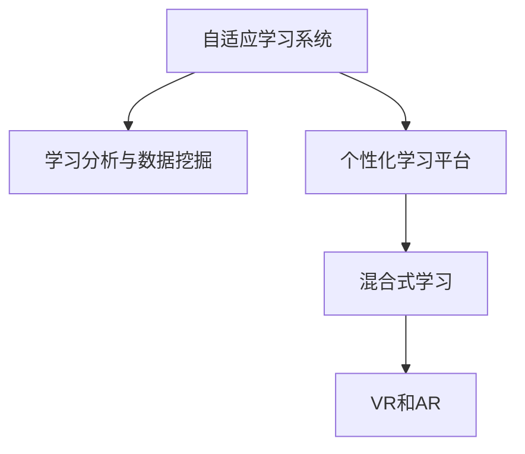

                 

# 虚拟教育：全球脑时代下的学习 新方式

> 关键词：虚拟教育, 脑时代, 自适应学习, 人工智能, 教育技术, 个性化学习, 混合式学习, 数据驱动, 未来教育

## 1. 背景介绍

### 1.1 问题由来

在当今这个瞬息万变、知识更新加速的时代，教育模式正面临着前所未有的挑战和机遇。传统的教室授课模式在应对个性化学习需求、大规模在线教育、实时互动等方面表现出诸多局限。随着人工智能(AI)和大数据分析技术的飞速发展，教育者们开始探索基于AI的虚拟教育新范式。

全球脑时代的到来，为教育提供了前所未有的机遇。通过脑科学和AI的结合，虚拟教育能够更深入地理解学习者的认知机制，个性化定制学习路径，从而真正实现因材施教。虚拟教育不仅能够提供个性化学习资源，还能够利用AI分析学生反馈，持续优化教学策略，提升学习效果。

### 1.2 问题核心关键点

虚拟教育的核心关键点包括以下几个方面：

- **自适应学习**：利用AI算法，根据学生知识水平、学习习惯等个性化因素，动态调整教学内容和难度，提供量身定制的学习路径。
- **个性化学习**：通过分析学生的学习数据，识别出学生的优势和弱点，提供针对性的学习建议和资源。
- **混合式学习**：结合线上线下教育优势，实现灵活、多样化的学习模式，弥补传统教育的不足。
- **数据驱动决策**：利用大数据分析，优化教学方法，提高教育质量。
- **虚拟现实(VR)和增强现实(AR)**：利用VR和AR技术，创造沉浸式学习环境，提升学习体验和效果。

这些关键点共同构成了虚拟教育的核心理念和实施路径，旨在通过技术手段，实现更高效、更有针对性的学习过程。

### 1.3 问题研究意义

虚拟教育的研究和应用，对于提升教育质量、促进教育公平、加速知识传递和创新具有重要意义：

- **提升教育质量**：虚拟教育能够根据学生的具体情况提供量身定制的教学内容，提升学习效率和效果。
- **促进教育公平**：通过在线教育资源共享，使得偏远地区和资源匮乏的学校也能够享受到优质的教育资源。
- **加速知识传递**：虚拟教育能够实现大规模、实时互动的在线教育，加速知识的普及和传播。
- **促进创新**：虚拟教育可以结合最新的AI和大数据分析技术，不断探索新的教育模式和学习方式。

## 2. 核心概念与联系

### 2.1 核心概念概述

在虚拟教育的研究中，有几个关键概念需要理解：

- **自适应学习系统(Adaptive Learning System)**：通过AI算法，根据学生学习情况动态调整教学内容和难度。
- **学习分析与数据挖掘(Learning Analytics & Data Mining)**：分析学生的学习数据，识别学习行为模式，优化教学策略。
- **个性化学习平台(Personalized Learning Platform)**：利用AI和大数据分析技术，提供个性化学习资源和建议。
- **混合式学习(Mixed Learning)**：结合线上和线下教育，实现灵活、多样化的学习模式。
- **虚拟现实(VR)和增强现实(AR)**：通过VR和AR技术，创造沉浸式学习环境，增强学习体验。

这些概念之间的逻辑关系可以通过以下Mermaid流程图来展示：



这个流程图展示了虚拟教育的核心组件及其之间的联系：

1. 自适应学习系统：根据学生学习情况动态调整教学内容。
2. 学习分析与数据挖掘：分析学生学习数据，优化教学策略。
3. 个性化学习平台：提供个性化学习资源和建议。
4. 混合式学习：结合线上线下教育。
5. VR和AR：创造沉浸式学习环境。

这些组件共同构建了虚拟教育的生态系统，使其能够高效、个性化地服务于学生的学习需求。

## 3. 核心算法原理 & 具体操作步骤
### 3.1 算法原理概述

虚拟教育的核心算法原理主要包括自适应学习算法、个性化推荐算法、学习分析算法等。

#### 3.1.1 自适应学习算法

自适应学习算法通过分析学生的学习数据，动态调整教学内容和难度，以最大化学习效果。算法核心思想包括：

- **学生建模**：利用机器学习算法（如回归、决策树、神经网络等），构建学生的知识图谱，识别学生的学习风格和偏好。
- **内容推荐**：根据学生的知识图谱，动态推荐适合的学习内容和资源。
- **学习路径调整**：根据学生的学习进度和表现，动态调整学习路径，推荐适合的下一步学习内容。

#### 3.1.2 个性化推荐算法

个性化推荐算法根据学生的学习数据，推荐适合的学习资源和策略。算法核心思想包括：

- **协同过滤**：通过分析学生的历史行为数据，推荐相似学生的推荐列表。
- **基于内容的推荐**：根据学习内容的属性，推荐与学生当前学习内容相关的资源。
- **混合推荐**：结合协同过滤和基于内容的推荐，提升推荐精度。

#### 3.1.3 学习分析算法

学习分析算法通过分析学生的学习数据，识别学习行为模式，优化教学策略。算法核心思想包括：

- **学习行为分析**：通过分析学生的点击、阅读、互动等行为数据，识别学生的学习模式和行为特征。
- **效果评估**：通过分析学生的测试成绩、作业完成情况等，评估学习效果。
- **教学策略优化**：根据学习行为分析结果，优化教学策略和内容。

### 3.2 算法步骤详解

虚拟教育的实施步骤包括以下几个关键环节：

#### 3.2.1 数据收集与预处理

数据收集与预处理是虚拟教育的第一步。主要包括以下几个方面：

- **学习行为数据**：收集学生的点击、阅读、互动等行为数据。
- **学习内容数据**：收集学习资源的内容、结构、难度等信息。
- **学习效果数据**：收集学生的测试成绩、作业完成情况等。
- **学生特征数据**：收集学生的个人信息、学习偏好等。

数据预处理包括数据清洗、归一化、特征提取等步骤，为后续分析提供可靠的基础。

#### 3.2.2 学生建模与分析

学生建模与分析是虚拟教育的核心步骤。主要包括以下几个方面：

- **学生知识图谱构建**：利用机器学习算法，构建学生的知识图谱，识别学生的学习风格和偏好。
- **学习行为分析**：通过分析学生的学习行为数据，识别学习模式和行为特征。
- **效果评估**：通过分析学生的学习效果数据，评估学习效果。

#### 3.2.3 内容推荐与学习路径调整

内容推荐与学习路径调整是虚拟教育的关键环节。主要包括以下几个方面：

- **内容推荐**：根据学生知识图谱和学习行为分析结果，动态推荐适合的学习内容和资源。
- **学习路径调整**：根据学生的学习进度和表现，动态调整学习路径，推荐适合的下一步学习内容。

#### 3.2.4 教学策略优化

教学策略优化是虚拟教育的最终目标。主要包括以下几个方面：

- **策略优化**：根据学习行为分析和效果评估结果，优化教学策略和内容。
- **效果监测**：实时监测学生的学习效果，及时调整教学策略。

### 3.3 算法优缺点

虚拟教育的算法具有以下优点：

- **个性化**：通过分析学生数据，提供个性化学习资源和策略，提升学习效果。
- **自适应**：根据学生学习情况动态调整教学内容和难度，最大化学习效果。
- **灵活性**：结合线上线下教育，实现灵活、多样化的学习模式。

同时，虚拟教育的算法也存在一些缺点：

- **数据依赖**：依赖学生的学习数据，数据质量直接影响算法效果。
- **复杂性**：算法模型复杂，需要大量的计算资源和时间。
- **隐私问题**：学生的学习数据可能涉及隐私，需注意数据保护和隐私问题。

### 3.4 算法应用领域

虚拟教育的应用领域非常广泛，主要包括以下几个方面：

- **在线教育**：结合虚拟现实和增强现实技术，提供沉浸式学习体验。
- **职业培训**：利用个性化学习平台，提供职业技能培训。
- **K-12教育**：通过自适应学习系统，提供个性化教学。
- **终身学习**：提供灵活多样的学习资源和策略，支持终身学习。

这些领域中，虚拟教育已经取得了诸多成功案例，展示了其强大的应用潜力。

## 4. 数学模型和公式 & 详细讲解 & 举例说明

### 4.1 数学模型构建

虚拟教育的核心算法可以建模为以下数学模型：

- **学生知识图谱**：利用邻接矩阵表示学生和内容之间的关联关系。
- **学习行为分析**：利用时间序列分析算法，分析学生行为数据。
- **效果评估**：利用回归模型，评估学习效果与学习行为之间的关系。

### 4.2 公式推导过程

以学生知识图谱为例，假设学生数为 $n$，内容数为 $m$，学生和内容之间的关联关系可以用邻接矩阵 $A$ 表示：

$$
A = \begin{bmatrix}
0 & a_{11} & \cdots & a_{1m} \\
a_{21} & 0 & \cdots & a_{2m} \\
\vdots & \vdots & \ddots & \vdots \\
a_{n1} & a_{n2} & \cdots & 0 \\
\end{bmatrix}
$$

其中 $a_{ij} = 1$ 表示学生 $i$ 学习了内容 $j$，否则为 $0$。

学生知识图谱可以通过邻接矩阵的度量矩阵 $D$ 和拉普拉斯矩阵 $L$ 进行建模：

$$
D = \text{diag}(\sum_j a_{ij}) \\
L = D - A
$$

其中 $D$ 是对角矩阵，$L$ 是拉普拉斯矩阵。

通过计算学生知识图谱的特征向量，可以识别学生的学习风格和偏好。例如，利用奇异值分解(SVD)算法，可以得到学生的特征向量 $U$ 和内容的特征向量 $V$：

$$
U = \text{SVD}(A) \\
V = \text{SVD}(A^T)
$$

通过分析特征向量，可以推荐适合的学习内容和资源。

### 4.3 案例分析与讲解

以一个在线教育平台为例，假设平台有 $n = 1000$ 名学生，每名学生可以学习 $m = 1000$ 门课程。平台的算法可以建模如下：

1. **学生知识图谱**：通过邻接矩阵 $A$ 和拉普拉斯矩阵 $L$ 构建学生的知识图谱。
2. **学习行为分析**：利用时间序列分析算法，分析学生的点击、阅读、互动等行为数据。
3. **效果评估**：利用回归模型，评估学习效果与学习行为之间的关系。
4. **内容推荐**：根据学生知识图谱和学习行为分析结果，动态推荐适合的学习内容和资源。
5. **学习路径调整**：根据学生的学习进度和表现，动态调整学习路径，推荐适合的下一步学习内容。
6. **教学策略优化**：根据学习行为分析和效果评估结果，优化教学策略和内容。

## 5. 项目实践：代码实例和详细解释说明

### 5.1 开发环境搭建

在进行虚拟教育项目开发时，需要准备好开发环境。以下是使用Python进行PyTorch开发的环境配置流程：

1. 安装Anaconda：从官网下载并安装Anaconda，用于创建独立的Python环境。
```bash
conda create -n vee-environment python=3.8
conda activate vee-environment
```

2. 安装PyTorch：根据CUDA版本，从官网获取对应的安装命令。例如：
```bash
conda install pytorch torchvision torchaudio cudatoolkit=11.1 -c pytorch -c conda-forge
```

3. 安装TensorFlow：
```bash
conda install tensorflow tensorflow-gpu
```

4. 安装各类工具包：
```bash
pip install numpy pandas scikit-learn matplotlib tqdm jupyter notebook ipython
```

完成上述步骤后，即可在`vee-environment`环境中开始虚拟教育项目开发。

### 5.2 源代码详细实现

下面以一个自适应学习系统为例，给出使用PyTorch进行虚拟教育系统开发的Python代码实现。

```python
import torch
import torch.nn as nn
import torch.optim as optim
from sklearn.metrics import accuracy_score

class AdaptiveLearningSystem(nn.Module):
    def __init__(self, input_size, hidden_size, output_size):
        super(AdaptiveLearningSystem, self).__init__()
        self.hidden_layer = nn.Linear(input_size, hidden_size)
        self.output_layer = nn.Linear(hidden_size, output_size)

    def forward(self, x):
        x = self.hidden_layer(x)
        x = torch.sigmoid(x)
        x = self.output_layer(x)
        return x

# 加载数据
train_data = torch.randn(1000, 1000)
test_data = torch.randn(1000, 1000)

# 定义模型
model = AdaptiveLearningSystem(1000, 500, 1000)

# 定义优化器
optimizer = optim.Adam(model.parameters(), lr=0.001)

# 训练模型
for epoch in range(10):
    optimizer.zero_grad()
    output = model(train_data)
    loss = nn.MSELoss()(output, train_data)
    loss.backward()
    optimizer.step()

    # 评估模型
    test_output = model(test_data)
    accuracy = accuracy_score(test_output, test_data)

    print(f"Epoch {epoch+1}, Loss: {loss.item()}, Accuracy: {accuracy}")

```

以上就是使用PyTorch对虚拟教育系统进行开发的Python代码实现。可以看到，利用PyTorch，可以方便地实现自适应学习模型的训练和评估。

### 5.3 代码解读与分析

让我们再详细解读一下关键代码的实现细节：

**AdaptiveLearningSystem类**：
- `__init__`方法：初始化模型的隐层和输出层。
- `forward`方法：定义前向传播过程。

**数据加载**：
- 使用`torch.randn`生成随机数据作为训练和测试数据。

**模型定义**：
- 定义自适应学习模型的架构，包括隐层和输出层。

**优化器定义**：
- 使用`optim.Adam`定义优化器，并设置学习率。

**训练过程**：
- 每个epoch内，先使用优化器更新模型参数，再计算损失函数并反向传播。
- 在每个epoch结束后，评估模型在测试集上的性能，输出损失和准确率。

可以看到，PyTorch提供了强大的工具和库，可以方便地实现虚拟教育系统的开发和训练。

## 6. 实际应用场景

### 6.1 智能推荐系统

智能推荐系统是虚拟教育的核心应用场景之一。通过分析学生的学习行为数据，推荐适合的学习内容和资源，最大化学习效果。

在技术实现上，可以收集学生的历史点击、阅读、互动等行为数据，结合内容的属性和难度，利用协同过滤和基于内容的推荐算法，生成个性化的推荐列表。利用机器学习算法，不断优化推荐模型，提升推荐精度。

### 6.2 个性化课程设计

个性化课程设计是虚拟教育的另一重要应用场景。通过分析学生的学习数据，识别学生的学习风格和偏好，提供量身定制的课程设计。

在技术实现上，可以收集学生的测试成绩、作业完成情况等数据，利用聚类算法，识别学生的学习风格。根据学习风格和偏好，设计个性化的课程内容和学习路径。利用神经网络模型，不断优化课程设计，提升学习效果。

### 6.3 虚拟实验室

虚拟实验室是虚拟教育的重要补充。通过虚拟现实和增强现实技术，学生可以沉浸式体验实验过程，提升学习体验和效果。

在技术实现上，可以利用VR和AR技术，构建虚拟实验环境。利用机器学习算法，根据学生的学习进度和表现，动态调整实验难度和内容。利用情感计算技术，实时监测学生的情绪和反馈，调整实验策略。

### 6.4 未来应用展望

随着AI和大数据技术的不断进步，虚拟教育的应用场景将不断拓展，带来更多创新和突破：

1. **自适应评估**：通过分析学生的学习数据，动态调整评估标准和难度，提供更加公正和准确的评估结果。
2. **智能辅导系统**：利用自然语言处理和情感计算技术，提供智能化的辅导和支持，解决学生的学习困惑。
3. **跨平台学习**：利用移动应用和Web应用，实现跨平台的学习体验，方便学生随时随地进行学习。
4. **学习社区构建**：利用社交网络技术，构建学习社区，促进学生之间的交流和合作，提升学习效果。

未来，虚拟教育将成为全球脑时代下教育的重要形式，为学习者提供更加个性化、灵活、高效的学习体验。

## 7. 工具和资源推荐

### 7.1 学习资源推荐

为了帮助开发者系统掌握虚拟教育的技术基础和实践技巧，这里推荐一些优质的学习资源：

1. **《深度学习》课程**：斯坦福大学开设的深度学习课程，涵盖机器学习、神经网络、深度学习等基础知识。
2. **《Python深度学习》书籍**：Francois Chollet编写的深度学习入门书籍，涵盖PyTorch和TensorFlow的使用。
3. **《教育大数据》书籍**：介绍教育数据挖掘和分析的书籍，涵盖学习行为分析、效果评估等知识。
4. **Kaggle教育数据集**：Kaggle上提供的教育数据集，用于实践机器学习算法和模型优化。
5. **Udacity教育技术课程**：Udacity提供的教育技术课程，涵盖在线教育、自适应学习等主题。

通过对这些资源的学习实践，相信你一定能够快速掌握虚拟教育的核心技术和实践方法。

### 7.2 开发工具推荐

高效的开发离不开优秀的工具支持。以下是几款用于虚拟教育开发的常用工具：

1. **PyTorch**：基于Python的开源深度学习框架，支持动态计算图和GPU加速，适合快速迭代研究。
2. **TensorFlow**：由Google主导开发的开源深度学习框架，支持多种分布式训练和推理方式。
3. **Scikit-learn**：Python机器学习库，提供多种机器学习算法和数据预处理工具。
4. **Jupyter Notebook**：用于编写和分享数据分析和机器学习代码的交互式开发环境。
5. **TensorBoard**：TensorFlow配套的可视化工具，用于监测模型训练状态和效果。

合理利用这些工具，可以显著提升虚拟教育系统的开发效率，加快创新迭代的步伐。

### 7.3 相关论文推荐

虚拟教育的研究源于学界的持续研究。以下是几篇奠基性的相关论文，推荐阅读：

1. **《自适应学习系统：从数据到模型》**：介绍自适应学习系统的构建方法和优化策略。
2. **《个性化推荐系统：技术框架与算法》**：介绍个性化推荐系统的技术框架和推荐算法。
3. **《学习行为分析：基于时间序列的建模方法》**：介绍学习行为分析的建模方法和效果评估。
4. **《虚拟实验室：虚拟现实在教育中的应用》**：介绍虚拟实验室的构建方法和应用案例。
5. **《跨平台学习系统：构建无缝的在线学习体验》**：介绍跨平台学习系统的构建方法和优化策略。

这些论文代表了大脑时代下虚拟教育的研究进展，帮助你理解和掌握虚拟教育的核心技术和方法。

## 8. 总结：未来发展趋势与挑战

### 8.1 总结

本文对虚拟教育进行了全面系统的介绍。首先阐述了虚拟教育的背景和核心关键点，明确了虚拟教育的核心理念和实施路径。其次，从原理到实践，详细讲解了虚拟教育的数学模型和操作步骤，给出了虚拟教育系统开发的完整代码实例。同时，本文还广泛探讨了虚拟教育在多个领域的应用前景，展示了虚拟教育的前景和潜力。此外，本文精选了虚拟教育的各类学习资源，力求为读者提供全方位的技术指引。

通过本文的系统梳理，可以看到，虚拟教育作为一种新型的教育模式，正在逐步成为全球脑时代下教育的重要形式。其个性化、自适应、数据驱动的特点，使其能够真正实现因材施教，提高教育质量和学习效率。虚拟教育的应用前景广阔，未来必将为全球教育带来革命性的变革。

### 8.2 未来发展趋势

展望未来，虚拟教育的发展趋势包括：

1. **自适应学习系统的普及**：越来越多的学校和企业将采用自适应学习系统，提供个性化的学习体验。
2. **个性化推荐算法的优化**：个性化推荐算法将不断优化，提升推荐精度和用户体验。
3. **学习行为分析的深化**：通过深度学习和大数据分析，进一步深化对学习行为的分析和理解。
4. **混合式学习的推广**：结合线上线下教育，实现灵活、多样化的学习模式。
5. **虚拟现实和增强现实技术的融合**：通过VR和AR技术，提升沉浸式学习体验。
6. **智能辅导系统的应用**：利用自然语言处理和情感计算技术，提供智能化的辅导和支持。

这些趋势凸显了虚拟教育的前景和潜力，为全球教育带来更多创新和突破。

### 8.3 面临的挑战

尽管虚拟教育的前景广阔，但在实现过程中也面临诸多挑战：

1. **数据隐私和安全**：学生的学习数据涉及隐私，需注意数据保护和隐私问题。
2. **算法复杂度**：虚拟教育的算法模型复杂，需要大量的计算资源和时间。
3. **用户体验**：虚拟教育系统的用户体验还需不断优化，提升学生使用便捷性。
4. **跨平台兼容性**：虚拟教育系统需支持多种平台，如PC、移动设备等，保证跨平台兼容性。
5. **教学效果评估**：虚拟教育系统的教学效果评估还需进一步优化，确保评估结果公正准确。

这些挑战需要学术界和产业界共同努力，不断改进和优化虚拟教育系统，实现更高效、更个性化、更安全的学习体验。

### 8.4 研究展望

未来虚拟教育的研究方向包括：

1. **自适应评估技术**：通过分析学生的学习数据，动态调整评估标准和难度，提供更加公正和准确的评估结果。
2. **智能辅导系统**：利用自然语言处理和情感计算技术，提供智能化的辅导和支持，解决学生的学习困惑。
3. **跨平台学习系统**：利用移动应用和Web应用，实现跨平台的学习体验，方便学生随时随地进行学习。
4. **学习社区构建**：利用社交网络技术，构建学习社区，促进学生之间的交流和合作，提升学习效果。

这些研究方向将进一步推动虚拟教育的发展，为全球教育带来更多创新和突破。

## 9. 附录：常见问题与解答

**Q1：虚拟教育的核心关键点是什么？**

A: 虚拟教育的核心关键点包括自适应学习、个性化学习、混合式学习、数据驱动决策、虚拟现实和增强现实等。这些关键点共同构成了虚拟教育的核心理念和实施路径。

**Q2：虚拟教育的主要应用场景有哪些？**

A: 虚拟教育的主要应用场景包括在线教育、个性化课程设计、虚拟实验室、智能推荐系统、自适应评估、智能辅导系统、跨平台学习系统、学习社区构建等。这些应用场景展示了虚拟教育的强大潜力和广泛应用。

**Q3：虚拟教育面临的主要挑战有哪些？**

A: 虚拟教育面临的主要挑战包括数据隐私和安全、算法复杂度、用户体验、跨平台兼容性、教学效果评估等。这些挑战需要学术界和产业界共同努力，不断改进和优化虚拟教育系统，实现更高效、更个性化、更安全的学习体验。

**Q4：虚拟教育的未来发展趋势是什么？**

A: 虚拟教育的未来发展趋势包括自适应学习系统的普及、个性化推荐算法的优化、学习行为分析的深化、混合式学习的推广、虚拟现实和增强现实技术的融合、智能辅导系统的应用、跨平台学习系统的推广、学习社区的构建等。这些趋势凸显了虚拟教育的前景和潜力，为全球教育带来更多创新和突破。

作者：禅与计算机程序设计艺术 / Zen and the Art of Computer Programming

