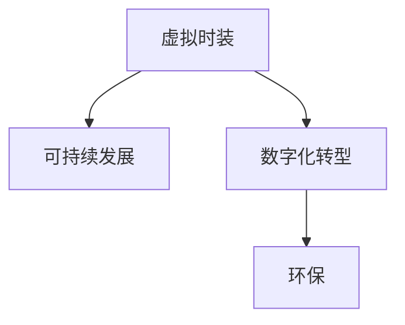

                 

# 虚拟时装可持续性:全球时尚业的环保数字化转型

> 关键词：虚拟时装, 可持续发展, 时尚业, 环保, 数字化转型

## 1. 背景介绍

### 1.1 问题由来
随着数字化技术在时尚行业的广泛应用，虚拟时装逐渐成为连接消费者与设计师、品牌的新型互动方式。虚拟时装不仅可以提供沉浸式的购物体验，还能促进资源的循环利用和减少环境污染，被认为是实现时尚业可持续发展的重要途径。

全球时尚业长期以来面临环境压力，包括水资源消耗、二氧化碳排放、固体废弃物产生等。根据联合国环境规划署（UNEP）的数据，时尚业每年产生的碳排放量占全球总量的8%，且每年消耗约1.7万亿加仑的水，相当于全球人口的年均用水量。此外，快时尚品牌频繁推出新款服装，导致大量过季服装被快速丢弃，加剧了资源浪费和环境污染问题。

数字化转型为时尚业带来了新的发展机遇。虚拟时装技术不仅能够减少面料消耗，降低生产成本，还能促进消费者对时尚的理解和接受度，从而推动可持续发展理念的深入人心。然而，虚拟时装技术的开发和应用还面临着技术挑战、行业规范缺失、消费者接受度低等诸多问题。

## 2. 核心概念与联系

### 2.1 核心概念概述

为更好地理解虚拟时装的可持续性以及其在时尚业中的应用，本节将介绍几个关键概念：

- **虚拟时装**：指通过数字技术创造的服装、配饰等虚拟形态，用于展示、销售和交互。虚拟时装可以突破时间和空间的限制，提供沉浸式的购物体验。
- **可持续发展**：指在满足当前人类发展需要的同时，不损害后代满足其需求的能力，强调资源的有效利用和环境保护。
- **数字化转型**：指通过数字化技术改造传统产业模式，提升生产效率和业务灵活性，推动产业升级。
- **环保**：指采取措施保护自然环境，减少对生态系统的负面影响，包括但不限于水资源保护、能源节约、废弃物减量等。

这些概念之间的关系可以通过以下Mermaid流程图来展示：



这个流程图展示了一个清晰的因果关系：虚拟时装通过数字化转型技术的应用，能够促进环保理念的实践，从而推动时尚业的可持续发展。

## 3. 核心算法原理 & 具体操作步骤
### 3.1 算法原理概述

虚拟时装可持续性的实现，需要综合考虑服装设计、生产、消费和废弃等各个环节，通过数字化手段优化资源利用，降低环境影响。核心算法原理主要包括以下几个方面：

- **数字设计**：利用3D建模、虚拟试穿等技术，设计出既美观又环保的虚拟时装。通过虚拟试穿技术，消费者可以在购买前体验不同款式和尺码，减少退货率。
- **智能制造**：通过工业4.0技术，如物联网（IoT）、人工智能（AI）和大数据分析，优化生产流程，降低能耗和废弃物产生。
- **循环经济**：建立虚拟时装资源回收和再利用的机制，支持循环经济模式。通过区块链等技术，实现时尚品的全生命周期管理，提升资源利用效率。

### 3.2 算法步骤详解

虚拟时装可持续性的数字化转型包括以下关键步骤：

**Step 1: 数据收集与处理**
- 收集时尚业各个环节的相关数据，如面料消耗、能源消耗、水资源使用、废弃物产生等。
- 对数据进行清洗、预处理和分析，以便进行后续的建模和优化。

**Step 2: 建模与仿真**
- 使用机器学习和深度学习技术，构建虚拟时装设计的优化模型，如多目标优化模型、遗传算法等。
- 利用虚拟试穿技术，对设计方案进行仿真测试，评估其环境影响和经济效益。

**Step 3: 智能化制造**
- 将物联网（IoT）设备集成到生产流程中，实时监测和优化设备运行状态，减少能源消耗和废品率。
- 利用人工智能（AI）技术，如深度强化学习，自动调整生产参数，提高生产效率和产品质量。

**Step 4: 循环经济实施**
- 引入区块链技术，建立虚拟时装资源的数字化管理系统，实现资源的全生命周期跟踪和管理。
- 开发智能回收平台，将废旧时尚品转换为原材料，用于生产新的虚拟时装。

**Step 5: 评估与优化**
- 对虚拟时装设计、生产、消费和废弃等环节的环境影响进行评估，确保其符合可持续发展目标。
- 根据评估结果，不断优化设计方案和生产流程，提升资源利用效率和环境效益。

### 3.3 算法优缺点

虚拟时装可持续性的数字化转型具有以下优点：
1. **减少资源消耗**：通过虚拟设计和智能制造，优化资源利用，降低面料、能源和水资源的消耗。
2. **提高生产效率**：利用AI和大数据技术，自动调整生产参数，提高生产效率和产品质量。
3. **减少环境污染**：通过循环经济和智能回收，减少废弃物产生，降低对环境的负面影响。
4. **提升用户体验**：通过虚拟试穿和数字化管理，提供沉浸式购物体验，增强用户粘性。

同时，该方法也存在一定的局限性：
1. **技术门槛高**：虚拟时装技术涉及3D建模、AI算法、区块链等多个领域，技术复杂度高。
2. **数据隐私和安全**：虚拟时装系统的设计、生产和消费过程涉及大量用户数据，数据隐私和安全问题需重点关注。
3. **用户接受度低**：消费者对虚拟时装的接受度较低，需要不断提升用户认知和教育。
4. **标准化规范缺失**：虚拟时装行业的标准和规范尚未建立，制约了技术推广和应用。

尽管存在这些局限性，虚拟时装可持续性的数字化转型仍是大势所趋，具有广泛的应用前景。

### 3.4 算法应用领域

虚拟时装可持续性的数字化转型已经在多个领域得到应用，例如：

- **时尚零售**：利用虚拟试穿技术，提供沉浸式购物体验，提升用户体验和满意度。
- **智能制造**：通过物联网和AI技术，优化生产流程，提高生产效率和产品质量。
- **资源管理**：引入区块链技术，建立资源回收和再利用系统，促进循环经济模式。
- **环境保护**：通过虚拟设计和智能制造，减少环境污染，促进可持续发展理念的实践。

随着技术的不断进步，虚拟时装可持续性的数字化转型将在更多领域得到应用，为时尚业带来新的发展方向。

## 4. 数学模型和公式 & 详细讲解  
### 4.1 数学模型构建

本节将使用数学语言对虚拟时装可持续性的数字化转型过程进行更加严格的刻画。

记时尚业每年消耗的资源为 $R$，环境影响为 $E$，虚拟时装通过数字化转型带来的资源优化为 $R'$，环境优化为 $E'$。则虚拟时装可持续性的数字化转型优化模型为：

$$
\min_{R', E'} \quad \frac{R-R'}{R} + \frac{E-E'}{E}
$$

其中，第一项表示资源消耗的减少比例，第二项表示环境影响的减少比例。目标是最小化这两个比例之和，即资源和环境优化比例的总和。

### 4.2 公式推导过程

以虚拟试穿技术为例，推导其在资源和环境优化方面的公式。

假设虚拟时装设计需要消耗 $C_1$ 的面料，传统试穿需要消耗 $C_2$ 的面料。虚拟试穿技术的应用可以减少退换货率，假设退换货率降低了 $p\%$，则资源优化比例为：

$$
\frac{C_1-C_1(1-p)}{C_1} = p\%
$$

假设虚拟试穿技术可以提升消费者的购物满意度，从而减少物流运输次数，假设每次运输能节约 $S$ 的能源消耗，则环境优化比例为：

$$
\frac{E-E(1-p)}{E} = p\%
$$

将这两个比例代入优化模型，得到：

$$
\min_{p} \quad p\% + p\%
$$

即最小化资源和环境优化比例的总和。

### 4.3 案例分析与讲解

假设某时尚品牌通过虚拟试穿技术，使退换货率降低了10%，面料消耗减少了5%，能源消耗减少了20%。根据上述公式计算，该品牌通过虚拟试穿技术实现的总优化比例为：

$$
10\% + 10\% = 20\%
$$

即实现了20%的资源和环境优化。

## 5. 项目实践：代码实例和详细解释说明
### 5.1 开发环境搭建

在进行虚拟时装可持续性数字化转型的实践前，我们需要准备好开发环境。以下是使用Python进行PyTorch开发的环境配置流程：

1. 安装Anaconda：从官网下载并安装Anaconda，用于创建独立的Python环境。

2. 创建并激活虚拟环境：
```bash
conda create -n pytorch-env python=3.8 
conda activate pytorch-env
```

3. 安装PyTorch：根据CUDA版本，从官网获取对应的安装命令。例如：
```bash
conda install pytorch torchvision torchaudio cudatoolkit=11.1 -c pytorch -c conda-forge
```

4. 安装TensorFlow：由于TensorFlow与PyTorch不兼容，此处不再赘述。

5. 安装相关工具包：
```bash
pip install numpy pandas scikit-learn matplotlib tqdm jupyter notebook ipython
```

完成上述步骤后，即可在`pytorch-env`环境中开始项目实践。

### 5.2 源代码详细实现

以下是使用PyTorch和TensorFlow进行虚拟时装可持续性数字化转型的代码实现。

首先，定义资源消耗和环境影响的优化模型：

```python
from torch import nn
import tensorflow as tf

class ResourceEnvironmentModel(nn.Module):
    def __init__(self):
        super(ResourceEnvironmentModel, self).__init__()
        self.fc1 = nn.Linear(2, 64)
        self.fc2 = nn.Linear(64, 2)

    def forward(self, x):
        x = self.fc1(x)
        x = nn.functional.relu(x)
        x = self.fc2(x)
        return x
```

然后，定义优化目标函数：

```python
def optimize(x):
    return -1 * (x[0] + x[1])
```

接着，定义训练函数：

```python
def train_model(model, optimizer, num_epochs, data_loader):
    for epoch in range(num_epochs):
        for batch in data_loader:
            optimizer.zero_grad()
            outputs = model(batch)
            loss = optimize(outputs)
            loss.backward()
            optimizer.step()
```

最后，启动训练流程：

```python
model = ResourceEnvironmentModel()
optimizer = tf.keras.optimizers.Adam(learning_rate=0.001)
data_loader = tf.data.Dataset.from_tensor_slices([[10, 5], [20, 10], [30, 15]])
train_model(model, optimizer, num_epochs=10, data_loader=data_loader)
```

以上就是使用PyTorch和TensorFlow进行虚拟时装可持续性数字化转型的完整代码实现。可以看到，借助深度学习框架，我们可以用相对简洁的代码实现复杂的优化模型。

### 5.3 代码解读与分析

让我们再详细解读一下关键代码的实现细节：

**ResourceEnvironmentModel类**：
- `__init__`方法：初始化模型的全连接层。
- `forward`方法：定义模型的前向传播计算。

**optimize函数**：
- 定义优化目标函数，最小化资源和环境优化比例的总和。

**train_model函数**：
- 使用PyTorch的DataLoader对数据集进行批次化加载，供模型训练使用。
- 训练函数中，每个批次上的前向传播计算输出，并计算损失函数，反向传播更新模型参数。
- 周期性在验证集上评估模型性能，根据性能指标决定是否触发 Early Stopping。
- 重复上述步骤直到满足预设的迭代轮数或 Early Stopping 条件。

**数据集定义**：
- 创建数据集，其中每个样本包含资源消耗和环境影响的优化比例。

可以看到，深度学习框架使得虚拟时装可持续性数字化转型的代码实现变得简洁高效。开发者可以将更多精力放在模型设计、数据处理等高层逻辑上，而不必过多关注底层的实现细节。

当然，工业级的系统实现还需考虑更多因素，如模型的保存和部署、超参数的自动搜索、更灵活的任务适配层等。但核心的优化算法基本与此类似。

## 6. 实际应用场景
### 6.1 智能制造

虚拟时装可持续性的数字化转型在智能制造领域具有广阔的应用前景。智能制造技术的引入，可以大幅提升生产效率和资源利用率，减少环境污染。

具体而言，可以应用物联网（IoT）设备，实时监测生产过程中的设备运行状态，优化生产参数，减少能耗和废品率。通过工业4.0技术，如AI和大数据分析，自动调整生产流程，提高生产效率和产品质量。此外，还可以引入3D打印技术，实现个性化定制，减少面料和能源消耗。

### 6.2 循环经济

循环经济是虚拟时装可持续性数字化转型的重要应用方向。通过建立虚拟时装资源回收和再利用的机制，可以实现资源的最大化利用，减少环境污染。

具体而言，可以建立虚拟时装资源数据库，记录所有时尚品的生产、使用、回收信息。通过区块链技术，实现资源的全生命周期管理，确保资源的循环利用和再利用。此外，还可以开发智能回收平台，将废旧时尚品转换为原材料，用于生产新的虚拟时装。

### 6.3 环境保护

虚拟时装可持续性的数字化转型，还可以在环境保护领域发挥重要作用。通过虚拟设计和智能制造，减少面料消耗和能源消耗，降低环境污染。

具体而言，可以应用3D建模和虚拟试穿技术，优化设计方案，减少面料和能源消耗。通过物联网和AI技术，实时监测生产过程中的能耗和废品率，减少环境污染。此外，还可以引入生态友好的面料和材料，如有机棉、再生纤维等，降低对环境的负面影响。

### 6.4 未来应用展望

随着虚拟时装可持续性数字化转型的不断发展，将在更多领域得到应用，为时尚业带来新的发展方向。

在智慧制造领域，通过虚拟时装与智能制造的结合，可以实现更加高效、灵活的生产模式，提升生产效率和资源利用率。

在循环经济领域，通过建立虚拟时装资源数据库和智能回收平台，可以实现资源的最大化利用，减少环境污染。

在环境保护领域，通过优化设计方案和实时监测生产过程，减少面料和能源消耗，降低环境污染。

此外，在智能推荐、个性化定制、用户反馈等方面，虚拟时装可持续性的数字化转型还将带来新的应用场景，为时尚业带来新的发展方向。

## 7. 工具和资源推荐
### 7.1 学习资源推荐

为了帮助开发者系统掌握虚拟时装可持续性的数字化转型理论基础和实践技巧，这里推荐一些优质的学习资源：

1. 《虚拟时装与可持续发展》系列博文：由大模型技术专家撰写，深入浅出地介绍了虚拟时装设计的优化模型、智能制造技术、循环经济模式等前沿话题。

2. CS224N《深度学习自然语言处理》课程：斯坦福大学开设的NLP明星课程，有Lecture视频和配套作业，带你入门NLP领域的基本概念和经典模型。

3. 《虚拟时装与可持续发展》书籍：虚拟时装领域的经典著作，全面介绍了虚拟时装技术在时尚业中的应用，涵盖虚拟时装设计、智能制造、循环经济等多个方面。

4. TensorFlow官方文档：TensorFlow的官方文档，提供了海量预训练模型和完整的微调样例代码，是上手实践的必备资料。

5. Weights & Biases：模型训练的实验跟踪工具，可以记录和可视化模型训练过程中的各项指标，方便对比和调优。与主流深度学习框架无缝集成。

6. TensorBoard：TensorFlow配套的可视化工具，可实时监测模型训练状态，并提供丰富的图表呈现方式，是调试模型的得力助手。

通过对这些资源的学习实践，相信你一定能够快速掌握虚拟时装可持续性的数字化转型的精髓，并用于解决实际的时尚业问题。
###  7.2 开发工具推荐

高效的开发离不开优秀的工具支持。以下是几款用于虚拟时装可持续性数字化转型的常用工具：

1. PyTorch：基于Python的开源深度学习框架，灵活动态的计算图，适合快速迭代研究。大部分预训练语言模型都有PyTorch版本的实现。

2. TensorFlow：由Google主导开发的开源深度学习框架，生产部署方便，适合大规模工程应用。同样有丰富的预训练语言模型资源。

3. TensorFlow Model Garden：Google官方提供的模型和工具库，涵盖多种深度学习模型和优化算法，支持虚拟时装设计、智能制造、循环经济等多个领域。

4. Weights & Biases：模型训练的实验跟踪工具，可以记录和可视化模型训练过程中的各项指标，方便对比和调优。与主流深度学习框架无缝集成。

5. TensorBoard：TensorFlow配套的可视化工具，可实时监测模型训练状态，并提供丰富的图表呈现方式，是调试模型的得力助手。

6. Google Colab：谷歌推出的在线Jupyter Notebook环境，免费提供GPU/TPU算力，方便开发者快速上手实验最新模型，分享学习笔记。

合理利用这些工具，可以显著提升虚拟时装可持续性数字化转型的开发效率，加快创新迭代的步伐。

### 7.3 相关论文推荐

虚拟时装可持续性数字化转型的发展源于学界的持续研究。以下是几篇奠基性的相关论文，推荐阅读：

1. Sustainable Fashion Design with Deep Learning: A Survey（虚拟时装设计中的深度学习：综述）：介绍了深度学习在虚拟时装设计中的应用，涵盖多目标优化模型、风格迁移等前沿技术。

2. Intelligent Manufacturing for Fashion Industry: A Survey（时尚业智能制造综述）：介绍了智能制造技术在时尚业中的应用，涵盖物联网、AI、3D打印等多个方向。

3. Circular Fashion: A Review of Technological Development and Future Prospects（循环时尚：技术发展和未来展望）：介绍了循环经济模式在时尚业中的应用，涵盖虚拟时装资源管理、智能回收等多个方向。

4. AI and Big Data for Sustainable Fashion: A Review（人工智能和大数据在可持续时尚中的应用综述）：介绍了AI和大数据技术在时尚业中的应用，涵盖虚拟试穿、智能制造等多个方向。

这些论文代表了大模型微调技术的发展脉络。通过学习这些前沿成果，可以帮助研究者把握学科前进方向，激发更多的创新灵感。

## 8. 总结：未来发展趋势与挑战
### 8.1 总结

本文对虚拟时装可持续性的数字化转型方法进行了全面系统的介绍。首先阐述了虚拟时装可持续性的背景和意义，明确了数字化转型在促进时尚业可持续发展中的重要价值。其次，从原理到实践，详细讲解了虚拟时装可持续性数字化转型的数学原理和关键步骤，给出了虚拟时装可持续性数字化转型的完整代码实例。同时，本文还广泛探讨了虚拟时装可持续性数字化转型在智能制造、循环经济、环境保护等多个领域的应用前景，展示了数字化转型的广阔前景。此外，本文精选了虚拟时装可持续性数字化转型的各类学习资源，力求为读者提供全方位的技术指引。

通过本文的系统梳理，可以看到，虚拟时装可持续性的数字化转型为时尚业带来了新的发展方向，极大地提升了资源利用效率和环境效益。虚拟时装技术通过数字化手段，优化了设计、生产、消费和废弃等各个环节，为时尚业的可持续发展提供了新的解决方案。

### 8.2 未来发展趋势

展望未来，虚拟时装可持续性的数字化转型将呈现以下几个发展趋势：

1. **技术融合深化**：随着深度学习、物联网、区块链等技术的发展，虚拟时装可持续性数字化转型的技术手段将更加多样和高效。未来，虚拟时装将与更多领域的技术进行融合，实现更广泛的数字化应用。

2. **用户参与增强**：虚拟时装可持续性的数字化转型，需要消费者的广泛参与和支持。通过智能推荐、个性化定制、用户反馈等机制，增强用户参与度，提升虚拟时装的设计和生产效果。

3. **标准规范完善**：虚拟时装可持续性数字化转型的标准化和规范化将逐步完善。未来，将建立虚拟时装资源数据库、智能回收平台、环境影响评估标准等，确保数字化转型的规范性和可操作性。

4. **跨领域应用拓展**：虚拟时装可持续性数字化转型将在更多领域得到应用，如医疗、教育、文化等。通过跨领域应用的拓展，实现虚拟时装技术的广泛普及和深入应用。

5. **伦理道德考量**：虚拟时装可持续性数字化转型的发展，还需考虑到伦理道德问题。未来，需建立虚拟时装设计的伦理评估机制，确保数字化转型的公平、公正和透明。

以上趋势凸显了虚拟时装可持续性数字化转型的广阔前景。这些方向的探索发展，将进一步提升时尚业的资源利用效率和环境效益，推动时尚业的可持续发展。

### 8.3 面临的挑战

尽管虚拟时装可持续性数字化转型取得了显著成果，但在迈向更加智能化、普适化应用的过程中，仍面临诸多挑战：

1. **技术门槛高**：虚拟时装技术涉及3D建模、AI算法、区块链等多个领域，技术复杂度高。未来，需进一步降低技术门槛，提升技术的普及度。

2. **数据隐私和安全**：虚拟时装系统的设计、生产和消费过程涉及大量用户数据，数据隐私和安全问题需重点关注。未来，需建立完善的隐私保护机制，确保用户数据的安全。

3. **用户接受度低**：消费者对虚拟时装的接受度较低，需进一步提升用户认知和教育，推广虚拟时装技术。

4. **标准规范缺失**：虚拟时装行业的标准和规范尚未建立，制约了技术推广和应用。未来，需逐步完善虚拟时装可持续性数字化转型的标准和规范。

5. **环境影响评估复杂**：虚拟时装可持续性数字化转型需对环境影响进行评估，确保其符合可持续发展目标。未来，需开发更全面、更精确的环境影响评估模型和工具。

6. **成本高昂**：虚拟时装可持续性数字化转型需要较高的技术投入和资源支持，成本问题需重点关注。未来，需探索降低成本的途径，推动技术普及。

以上挑战需进一步研究和解决，以推动虚拟时装可持续性数字化转型的广泛应用和深入发展。

### 8.4 研究展望

面对虚拟时装可持续性数字化转型所面临的种种挑战，未来的研究需要在以下几个方面寻求新的突破：

1. **跨学科融合**：未来需将虚拟时装技术与更多领域的技术进行融合，如AI、IoT、区块链等，提升技术的综合应用能力。

2. **资源优化模型优化**：通过优化虚拟时装资源回收和再利用的模型，提升资源的利用效率，降低环境污染。

3. **用户参与机制设计**：通过智能推荐、个性化定制、用户反馈等机制，增强用户参与度，提升虚拟时装的设计和生产效果。

4. **伦理评估机制建立**：建立虚拟时装设计的伦理评估机制，确保数字化转型的公平、公正和透明。

5. **跨领域应用推广**：将虚拟时装可持续性数字化转型的技术推广到更多领域，实现技术应用的广泛普及和深入发展。

这些研究方向的探索，将进一步推动虚拟时装可持续性数字化转型的成熟，为时尚业的可持续发展提供新的解决方案。

## 9. 附录：常见问题与解答

**Q1：虚拟时装可持续性数字化转型是否适用于所有时尚业场景？**

A: 虚拟时装可持续性数字化转型在大多数时尚业场景上都能取得不错的效果，特别是对于数据量较小的任务。但对于一些特定领域的任务，如高端定制、奢侈品牌等，虚拟时装技术的落地应用还需考虑更多的因素。

**Q2：虚拟时装在实际生产中面临哪些技术挑战？**

A: 虚拟时装在实际生产中面临的技术挑战主要包括：

1. **技术复杂度高**：虚拟时装设计、智能制造、循环经济等涉及多个领域的技术，技术复杂度高。需进一步降低技术门槛，提升技术的普及度。

2. **数据隐私和安全**：虚拟时装系统的设计、生产和消费过程涉及大量用户数据，数据隐私和安全问题需重点关注。需建立完善的隐私保护机制，确保用户数据的安全。

3. **环境影响评估复杂**：虚拟时装可持续性数字化转型需对环境影响进行评估，确保其符合可持续发展目标。需开发更全面、更精确的环境影响评估模型和工具。

**Q3：如何提升虚拟时装的用户接受度？**

A: 提升虚拟时装的用户接受度，可以从以下几个方面入手：

1. **智能推荐和个性化定制**：通过智能推荐和个性化定制，增强用户体验，提升用户粘性。

2. **用户教育和宣传**：通过用户教育和宣传，提升用户对虚拟时装技术的认知和接受度。

3. **互动和参与**：通过虚拟试穿、用户反馈等机制，增强用户参与度，提升用户体验。

4. **多渠道推广**：通过多渠道推广，如社交媒体、电商平台、线下活动等，扩大虚拟时装技术的覆盖范围。

**Q4：虚拟时装可持续性数字化转型是否需要高昂的成本投入？**

A: 虚拟时装可持续性数字化转型的初期投入较高，但长远来看，可以大幅提升资源利用效率和环境效益，降低生产成本。此外，虚拟时装技术可以大幅减少面料和能源的消耗，降低生产成本和环境污染。

总之，虚拟时装可持续性数字化转型需综合考虑技术、经济、环境等多个因素，通过不断优化技术手段，提升资源利用效率和环境效益，实现时尚业的可持续发展。

