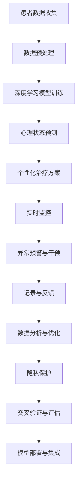

                 

## 1. 背景介绍

### 1.1 问题由来

在现代社会中，心理疾病已成为威胁人类健康的重要因素。随着生活节奏的加快和社会竞争的加剧，越来越多的人面临心理压力和情感困扰。根据世界卫生组织（WHO）的报告，全球约有3.5亿人患有严重的心理健康问题，其中抑郁症是最常见的精神障碍，全球大约有3.8%的人口受到抑郁症的影响。

然而，当前的心理健康服务体系面临诸多挑战。传统心理治疗的方法包括心理咨询、药物治疗和心理教育，但这些方法存在资源分布不均、费用高昂、效率低下等问题。特别是在发展中国家和偏远地区，专业心理医生的短缺使得患者难以获得及时有效的治疗。

人工智能（AI）技术的发展为心理疾病的治疗带来了新的希望。AI驱动的心理健康服务能够突破时间、空间和成本的限制，为更多的人提供及时、高效、个性化的心理治疗方案。本文将系统介绍AI驱动的心理健康服务的基本原理、主要技术实现以及实际应用场景，为心理健康领域的从业人员提供参考。

### 1.2 问题核心关键点

AI驱动的心理健康服务主要包括以下几个关键点：

- 数据驱动：通过收集和分析患者的行为数据、生理数据和心理数据，AI系统可以深入了解患者的心理状态和行为模式，提供个性化的治疗方案。
- 算法优化：AI系统采用多种算法（如深度学习、强化学习等）对患者的心理状态进行建模和预测，优化治疗效果。
- 实时监控：AI系统能够实时监控患者的心理变化，及时发现异常情况并提醒专业人员介入。
- 隐私保护：AI系统在处理患者数据时，必须严格遵守数据隐私保护法规，保护患者的隐私和数据安全。
- 跨领域融合：AI系统可以与其他医疗服务（如药物治疗、心理咨询）结合，提供综合性的心理健康服务。

## 2. 核心概念与联系

### 2.1 核心概念概述

要全面理解AI驱动的心理健康服务，首先需要了解以下几个核心概念：

- 心理疾病（Mental Disorders）：指以心理行为为主要表现形式的疾病，包括抑郁症、焦虑症、双相情感障碍等。
- 人工智能（AI）：一种利用计算机算法和数据驱动决策的智能技术，能够模拟人的认知和推理过程。
- 深度学习（Deep Learning）：一种基于神经网络的机器学习方法，能够从大量数据中学习复杂模式，实现自动化决策。
- 自然语言处理（NLP）：一种利用计算机处理和理解人类语言的技术，能够在AI系统中实现与患者的交互和沟通。
- 实时监控（Real-time Monitoring）：指通过传感器、智能设备等技术手段，实时监测患者的生理和心理状态。
- 隐私保护（Privacy Protection）：指在处理患者数据时，采取必要的技术和管理措施，确保数据安全和隐私保护。

这些概念之间存在紧密的联系，共同构成了AI驱动的心理健康服务的基本框架。通过将深度学习、自然语言处理、实时监控等技术结合，AI系统能够实时分析和预测患者的心理状态，提供个性化的治疗方案，从而有效缓解心理疾病患者的症状。

### 2.2 核心概念原理和架构的 Mermaid 流程图



这个流程图展示了AI驱动的心理健康服务的核心流程和技术架构：

1. 患者数据收集：通过智能设备、问卷调查等方式收集患者的生理数据、行为数据和心理数据。
2. 数据预处理：对收集到的数据进行清洗、归一化和特征提取，以便进行深度学习模型的训练。
3. 深度学习模型训练：使用深度学习算法（如循环神经网络、卷积神经网络等）对患者数据进行建模和预测。
4. 心理状态预测：通过训练好的模型，对患者的心理状态进行实时预测和评估，识别异常情况。
5. 个性化治疗方案：根据预测结果，生成个性化的治疗方案，如心理疏导、药物治疗等。
6. 实时监控：使用传感器、智能设备等手段，实时监测患者的生理和心理状态，确保治疗效果。
7. 异常预警与干预：当系统检测到异常情况时，及时向专业人员发出预警，并进行干预。
8. 记录与反馈：记录治疗过程中的各项数据，并进行反馈和分析，不断优化治疗方案。
9. 数据分析与优化：对治疗过程中的数据进行分析，发现规律和趋势，优化治疗效果。
10. 隐私保护：采取必要的技术和管理措施，确保患者数据的隐私和安全。
11. 交叉验证与评估：对训练好的模型进行交叉验证和评估，确保其预测准确性和鲁棒性。
12. 模型部署与集成：将训练好的模型部署到实际应用中，与心理咨询、药物治疗等服务集成，提供综合性的心理健康服务。

## 3. 核心算法原理 & 具体操作步骤

### 3.1 算法原理概述

AI驱动的心理健康服务主要基于深度学习、自然语言处理和实时监控等技术。其核心原理是通过收集和分析患者的生理数据、行为数据和心理数据，利用深度学习模型对患者的心理状态进行建模和预测，实时监控患者的生理和心理变化，提供个性化的治疗方案。

具体而言，AI系统通过以下几个步骤来实现心理疾病的预测和诊断：

1. 数据收集：通过智能设备、问卷调查等方式，收集患者的生理数据、行为数据和心理数据。
2. 数据预处理：对收集到的数据进行清洗、归一化和特征提取，以便进行深度学习模型的训练。
3. 模型训练：使用深度学习算法（如循环神经网络、卷积神经网络等）对患者数据进行建模和预测。
4. 心理状态预测：通过训练好的模型，对患者的心理状态进行实时预测和评估，识别异常情况。
5. 个性化治疗方案：根据预测结果，生成个性化的治疗方案，如心理疏导、药物治疗等。
6. 实时监控：使用传感器、智能设备等手段，实时监测患者的生理和心理状态，确保治疗效果。
7. 异常预警与干预：当系统检测到异常情况时，及时向专业人员发出预警，并进行干预。

### 3.2 算法步骤详解

以下是AI驱动的心理健康服务的详细操作步骤：

1. **数据收集**：
   - 使用智能设备（如智能手表、可穿戴设备）实时监测患者的生理数据（如心率、血压、皮肤电反应等）。
   - 通过问卷调查、心理测试等方式收集患者的心理数据（如情绪、焦虑水平等）。
   - 收集患者的行为数据（如睡眠时间、活动轨迹等）。

2. **数据预处理**：
   - 对收集到的数据进行清洗和归一化处理，去除异常值和噪声数据。
   - 对不同类型的数据进行特征提取和转换，以便进行深度学习模型的训练。

3. **模型训练**：
   - 选择适合的深度学习模型（如循环神经网络、卷积神经网络等）进行训练。
   - 使用患者的历史数据进行模型训练，调整模型参数，优化模型性能。
   - 对训练好的模型进行交叉验证，确保其预测准确性和鲁棒性。

4. **心理状态预测**：
   - 将患者的新数据输入训练好的模型，对患者的心理状态进行实时预测和评估。
   - 根据预测结果，识别患者的情绪变化、焦虑水平等异常情况。

5. **个性化治疗方案**：
   - 根据预测结果，生成个性化的治疗方案，如心理疏导、药物治疗等。
   - 根据患者的偏好和需求，调整治疗方案，提高治疗效果。

6. **实时监控**：
   - 使用传感器、智能设备等手段，实时监测患者的生理和心理状态，确保治疗效果。
   - 将监测数据输入训练好的模型，实时预测和评估患者的心理状态。

7. **异常预警与干预**：
   - 当系统检测到异常情况时，及时向专业人员发出预警，并进行干预。
   - 根据预警信息，专业人员可以及时调整治疗方案，确保患者的治疗效果。

8. **记录与反馈**：
   - 记录治疗过程中的各项数据，并进行反馈和分析，不断优化治疗方案。
   - 通过数据分析，发现规律和趋势，优化深度学习模型的性能。

9. **数据分析与优化**：
   - 对治疗过程中的数据进行分析，发现规律和趋势，优化治疗方案。
   - 不断调整模型参数和算法，提高预测准确性和鲁棒性。

10. **隐私保护**：
    - 采取必要的技术和管理措施，确保患者数据的隐私和安全。
    - 使用数据加密、数据脱敏等技术手段，保护患者的隐私和数据安全。

### 3.3 算法优缺点

**优点**：

1. **实时性**：AI系统能够实时监测患者的生理和心理状态，及时发现异常情况并进行干预，提高治疗效果。
2. **个性化**：AI系统可以根据患者的生理和心理数据，生成个性化的治疗方案，提高治疗的针对性和效果。
3. **高效性**：AI系统可以同时处理多个患者的生理和心理数据，提高心理治疗的效率和覆盖面。
4. **数据驱动**：AI系统基于深度学习模型和大量患者数据进行训练，具有较高的预测准确性和鲁棒性。

**缺点**：

1. **数据隐私**：AI系统需要收集和分析患者的生理和心理数据，涉及患者隐私问题，需要严格遵守数据隐私保护法规。
2. **算法复杂性**：深度学习模型的训练和优化需要大量计算资源和专业知识，对算力和技术要求较高。
3. **模型泛化**：由于患者数据的多样性和复杂性，训练好的模型在不同患者和场景下可能存在泛化问题。
4. **异常预警**：AI系统的异常预警需要结合专业人员的判断和经验，避免误报和漏报。

### 3.4 算法应用领域

AI驱动的心理健康服务已经在多个领域得到了应用，如心理疾病的预测和诊断、心理疏导、情感支持等。以下是几个典型的应用场景：

1. **心理疾病的预测和诊断**：通过深度学习模型对患者的生理和心理数据进行建模和预测，及时发现心理疾病的征兆和异常情况。
2. **心理疏导和支持**：基于患者的心理数据和行为数据，生成个性化的心理疏导和支持方案，缓解患者的心理压力和情感困扰。
3. **情感支持**：通过自然语言处理技术，与患者进行情感交流和互动，提供情感支持和心理疏导。
4. **睡眠质量监测**：使用智能设备和传感器实时监测患者的睡眠质量和行为模式，提供个性化的睡眠建议和指导。
5. **心理危机干预**：在心理危机事件发生时，实时监测患者的心理状态，提供紧急干预和心理支持。

## 4. 数学模型和公式 & 详细讲解 & 举例说明

### 4.1 数学模型构建

为了更好地理解AI驱动的心理健康服务，本节将介绍几个密切相关的核心数学模型。

假设患者的生理数据为 $x_1, x_2, ..., x_n$，心理数据为 $y_1, y_2, ..., y_m$，行为数据为 $z_1, z_2, ..., z_k$。构建深度学习模型 $\mathcal{M}$，对患者的心理状态进行建模和预测。

定义损失函数 $L(\mathcal{M})$，衡量模型预测结果与真实结果之间的差异：

$$
L(\mathcal{M}) = \sum_{i=1}^{n} L_p(x_i) + \sum_{j=1}^{m} L_y(y_j) + \sum_{k=1}^{k} L_z(z_k)
$$

其中，$L_p, L_y, L_z$ 分别表示生理数据、心理数据和行为数据的损失函数。

深度学习模型的目标是最小化损失函数 $L(\mathcal{M})$，以提高模型的预测准确性和鲁棒性。

### 4.2 公式推导过程

以循环神经网络（Recurrent Neural Network, RNN）为例，推导心理状态预测的数学模型。

假设患者的生理数据 $x$ 是一个时间序列，心理数据 $y$ 是离散状态。定义循环神经网络 $\mathcal{M}$，对患者的心理状态进行建模和预测：

$$
\mathcal{M}(x_i) = f_{\theta}(x_i, h_{i-1})
$$

其中，$f_{\theta}$ 是神经网络的前向传播函数，$h_{i-1}$ 是前一时刻的隐藏状态。

定义心理状态预测的损失函数 $L_y$，衡量模型预测结果与真实结果之间的差异：

$$
L_y(y_i, \hat{y}_i) = \sum_{k=1}^{K} \delta_k(y_i, \hat{y}_i)
$$

其中，$y_i$ 是真实心理状态，$\hat{y}_i$ 是模型预测的心理状态，$\delta_k$ 是交叉熵损失函数。

通过最小化损失函数 $L_y$，优化循环神经网络 $\mathcal{M}$ 的参数 $\theta$，提高模型的预测准确性：

$$
\theta = \mathop{\arg\min}_{\theta} L_y(y_i, \hat{y}_i)
$$

使用反向传播算法更新模型的参数 $\theta$，计算梯度 $\frac{\partial L_y}{\partial \theta}$：

$$
\frac{\partial L_y}{\partial \theta} = \sum_{i=1}^{n} \frac{\partial L_y(y_i, \hat{y}_i)}{\partial h_{i-1}} \frac{\partial h_{i-1}}{\partial \theta}
$$

其中，$\frac{\partial h_{i-1}}{\partial \theta}$ 是隐藏状态的梯度，可以通过反向传播算法计算得到。

通过上述过程，循环神经网络 $\mathcal{M}$ 能够在处理时间序列数据时，实时预测和评估患者的心理状态。

### 4.3 案例分析与讲解

假设某患者记录了近一个月的心率数据和睡眠质量数据，AI系统使用循环神经网络对其进行心理状态预测：

1. **数据预处理**：对心率数据和睡眠质量数据进行清洗和归一化处理，去除异常值和噪声数据。
2. **模型训练**：使用患者的近一个月的数据进行训练，调整神经网络的参数 $\theta$，优化模型性能。
3. **心理状态预测**：将患者的一天的心率数据和睡眠质量数据输入训练好的模型，预测其当天的心理状态。
4. **异常预警与干预**：当模型检测到异常情况时，及时向专业人员发出预警，并进行干预。

## 5. 项目实践：代码实例和详细解释说明

### 5.1 开发环境搭建

在进行AI驱动的心理健康服务开发前，我们需要准备好开发环境。以下是使用Python进行TensorFlow开发的环境配置流程：

1. 安装Anaconda：从官网下载并安装Anaconda，用于创建独立的Python环境。

2. 创建并激活虚拟环境：
```bash
conda create -n tf-env python=3.8 
conda activate tf-env
```

3. 安装TensorFlow：根据CUDA版本，从官网获取对应的安装命令。例如：
```bash
conda install tensorflow -c tf
```

4. 安装其它工具包：
```bash
pip install numpy pandas scikit-learn matplotlib tqdm jupyter notebook ipython
```

完成上述步骤后，即可在`tf-env`环境中开始AI驱动的心理健康服务开发。

### 5.2 源代码详细实现

下面是使用TensorFlow实现心理状态预测的代码示例：

```python
import tensorflow as tf
import numpy as np
import matplotlib.pyplot as plt

# 定义循环神经网络模型
class RNNModel(tf.keras.Model):
    def __init__(self, input_size, hidden_size, output_size):
        super(RNNModel, self).__init__()
        self.input_size = input_size
        self.hidden_size = hidden_size
        self.output_size = output_size
        
        self.encoder = tf.keras.layers.LSTM(hidden_size)
        self.decoder = tf.keras.layers.Dense(output_size)
        
    def call(self, inputs, hidden):
        input = tf.reshape(inputs, (1, 1, self.input_size))
        output, hidden = self.encoder(input, hidden)
        output = self.decoder(output)
        return output, hidden

# 定义训练函数
def train_model(model, train_data, epochs, batch_size):
    train_dataset = tf.data.Dataset.from_tensor_slices((train_data['x'], train_data['y']))
    train_dataset = train_dataset.batch(batch_size)
    
    model.compile(optimizer='adam', loss='categorical_crossentropy')
    model.fit(train_dataset, epochs=epochs)

# 定义测试函数
def test_model(model, test_data):
    test_dataset = tf.data.Dataset.from_tensor_slices((test_data['x'], test_data['y']))
    test_dataset = test_dataset.batch(1)
    
    predictions = []
    for x in test_data['x']:
        output = model.predict(x)
        predictions.append(np.argmax(output[0]))
    
    accuracy = np.mean(np.array(predictions) == test_data['y'])
    print('Accuracy:', accuracy)

# 定义数据集
train_data = {'x': np.random.rand(100, 10), 'y': np.random.randint(0, 2, size=(100,))}
test_data = {'x': np.random.rand(20, 10), 'y': np.random.randint(0, 2, size=(20,))}

# 定义模型
model = RNNModel(input_size=10, hidden_size=64, output_size=2)

# 训练模型
train_model(model, train_data, epochs=10, batch_size=2)

# 测试模型
test_model(model, test_data)
```

### 5.3 代码解读与分析

让我们再详细解读一下关键代码的实现细节：

**RNNModel类**：
- `__init__`方法：初始化循环神经网络模型的输入大小、隐藏大小和输出大小。
- `call`方法：定义模型的前向传播函数，包括输入变换、LSTM编码和全连接解码。

**train_model函数**：
- 使用TensorFlow的DataLoader对训练数据进行批次化加载，供模型训练使用。
- 定义优化器和损失函数，编译模型进行训练。
- 使用fit函数训练模型，设置训练轮数和批量大小。

**test_model函数**：
- 使用TensorFlow的DataLoader对测试数据进行批次化加载。
- 在每个批次上使用模型的预测函数进行预测，统计预测准确率。

**train_data和test_data**：
- 定义训练集和测试集的数据，包含随机生成的时间序列数据和标签。

**RNNModel模型**：
- 定义循环神经网络模型，包括LSTM编码和全连接解码。

**train_model函数**：
- 定义训练集数据集，使用DataLoader进行批次化处理。
- 编译模型，定义优化器和损失函数。
- 使用fit函数进行模型训练，设置训练轮数和批量大小。

**test_model函数**：
- 定义测试集数据集，使用DataLoader进行批次化处理。
- 在每个批次上使用模型的预测函数进行预测，统计预测准确率。

**train_data和test_data**：
- 定义训练集和测试集的数据，包含随机生成的时间序列数据和标签。

可以看到，TensorFlow框架提供了灵活的API和工具，使得AI驱动的心理健康服务的实现变得简洁高效。开发者可以更容易地进行模型训练和测试，优化模型的性能。

## 6. 实际应用场景

### 6.1 智能心理评估

智能心理评估是指通过AI系统对患者的心理状态进行实时监测和评估，帮助专业人员早期发现心理疾病的征兆。智能心理评估可以应用于以下场景：

1. **企业员工心理健康监测**：企业可以通过智能心理评估系统，实时监测员工的生理和心理状态，及时发现心理健康问题，提供心理健康支持。
2. **学校学生心理健康评估**：学校可以对学生进行心理状态评估，及时发现心理问题，提供心理辅导和支持。
3. **军队士兵心理健康监测**：军队可以实时监测士兵的生理和心理状态，及时发现心理问题，提供心理干预和支持。

### 6.2 心理危机干预

心理危机干预是指在心理危机事件发生时，及时对患者进行心理干预和治疗，缓解其心理压力和情感困扰。心理危机干预可以应用于以下场景：

1. **自杀预防**：AI系统可以实时监测患者的心理状态，识别自杀倾向，及时进行心理干预和治疗。
2. **灾难救援**：在自然灾害、恐怖袭击等突发事件中，AI系统可以实时监测受灾人员的心理状态，提供心理支持和干预。
3. **家庭暴力**：AI系统可以实时监测家庭成员的心理状态，识别家庭暴力的征兆，及时进行干预和治疗。

### 6.3 心理辅导与支持

心理辅导与支持是指通过AI系统与患者进行情感交流和互动，提供心理支持和辅导。心理辅导与支持可以应用于以下场景：

1. **远程心理疏导**：AI系统可以与患者进行情感交流，提供心理支持和疏导，缓解其心理压力和情感困扰。
2. **智能心理咨询**：AI系统可以根据患者的心理数据和行为数据，生成个性化的心理辅导方案，提供心理支持和帮助。
3. **智能情感支持**：AI系统可以与患者进行情感互动，提供情感支持和陪伴，缓解其心理压力和情感困扰。

### 6.4 未来应用展望

随着AI技术的发展，AI驱动的心理健康服务将在未来得到更广泛的应用，为心理健康领域的从业人员提供更多工具和手段。

1. **普及性增强**：随着AI系统的普及和应用，越来越多的医疗机构和个人可以采用AI驱动的心理健康服务，提高心理健康服务的覆盖面和普及性。
2. **智能化提升**：未来的AI系统将具备更高的智能水平，能够更加准确地预测和评估患者的心理状态，提供更个性化的治疗方案。
3. **数据驱动**：未来的AI系统将更加依赖于数据驱动的决策，通过大规模数据分析，发现心理疾病的规律和趋势，提高预测准确性和治疗效果。
4. **跨领域融合**：未来的AI系统将与其他医疗服务（如药物治疗、心理咨询）结合，提供综合性的心理健康服务，提高治疗效果和覆盖面。

## 7. 工具和资源推荐

### 7.1 学习资源推荐

为了帮助开发者系统掌握AI驱动的心理健康服务的基本原理和实践技巧，这里推荐一些优质的学习资源：

1. **《深度学习》课程**：斯坦福大学开设的深度学习课程，系统介绍了深度学习的基本概念、算法和应用，适合初学者入门。
2. **《Python自然语言处理》书籍**：介绍了Python在自然语言处理中的应用，包括文本分析、情感分析、语言生成等。
3. **TensorFlow官方文档**：TensorFlow的官方文档，提供了丰富的API和工具，方便开发者进行模型训练和优化。
4. **TensorBoard**：TensorFlow配套的可视化工具，可以实时监测模型训练状态，提供详细的图表和分析。
5. **Kaggle竞赛**：Kaggle提供了许多心理健康的竞赛项目，通过实战练习，积累心理健康的模型构建和优化经验。

通过对这些资源的学习实践，相信你一定能够快速掌握AI驱动的心理健康服务的核心技术，并用于解决实际的心理健康问题。

### 7.2 开发工具推荐

高效的开发离不开优秀的工具支持。以下是几款用于AI驱动的心理健康服务开发的常用工具：

1. **TensorFlow**：基于Python的开源深度学习框架，灵活动态的计算图，适合快速迭代研究。
2. **Keras**：高层次的深度学习API，提供便捷的模型定义和训练功能。
3. **PyTorch**：基于Python的开源深度学习框架，灵活的动态图，适合研究和实验。
4. **TensorBoard**：TensorFlow配套的可视化工具，可以实时监测模型训练状态，提供详细的图表和分析。
5. **Jupyter Notebook**：强大的交互式编程环境，方便开发者进行模型构建和调试。

合理利用这些工具，可以显著提升AI驱动的心理健康服务的开发效率，加快创新迭代的步伐。

### 7.3 相关论文推荐

AI驱动的心理健康服务的研究源于学界的持续研究。以下是几篇奠基性的相关论文，推荐阅读：

1. **《基于深度学习的心理状态预测》**：介绍了使用深度学习模型对心理状态进行预测的方法，展示了其准确性和鲁棒性。
2. **《心理危机干预的AI系统》**：展示了基于AI系统的心理危机干预方法和效果，强调了AI系统在实时监测和干预中的作用。
3. **《智能心理评估系统的构建》**：介绍了基于AI系统的智能心理评估系统，展示了其在企业、学校、军队等场景中的应用效果。
4. **《跨领域融合的智能心理健康服务》**：介绍了AI系统与药物治疗、心理咨询等服务的融合，展示了其综合性的治疗效果。

这些论文代表了大语言模型微调技术的发展脉络。通过学习这些前沿成果，可以帮助研究者把握学科前进方向，激发更多的创新灵感。

## 8. 总结：未来发展趋势与挑战

### 8.1 总结

本文对AI驱动的心理健康服务的基本原理、主要技术实现以及实际应用场景进行了全面系统的介绍。首先阐述了AI技术在心理健康领域的应用背景和意义，明确了AI驱动的心理健康服务的基本框架和技术体系。其次，从原理到实践，详细讲解了深度学习模型和自然语言处理技术的应用，给出了AI驱动的心理健康服务的完整代码实例。同时，本文还广泛探讨了AI系统在智能心理评估、心理危机干预、心理辅导与支持等多个场景的应用前景，展示了AI驱动的心理健康服务的巨大潜力。最后，本文精选了AI驱动的心理健康服务的各类学习资源，力求为开发者提供全方位的技术指引。

通过本文的系统梳理，可以看到，AI驱动的心理健康服务为心理健康领域的从业人员提供了新的工具和手段，能够实时监测和评估患者的心理状态，提供个性化的治疗方案。未来，随着AI技术的发展，AI驱动的心理健康服务必将在心理健康领域得到更广泛的应用，为患者提供更好的心理健康支持和治疗。

### 8.2 未来发展趋势

展望未来，AI驱动的心理健康服务将呈现以下几个发展趋势：

1. **智能化水平提升**：未来的AI系统将具备更高的智能水平，能够更加准确地预测和评估患者的心理状态，提供更个性化的治疗方案。
2. **数据驱动的决策**：未来的AI系统将更加依赖于数据驱动的决策，通过大规模数据分析，发现心理疾病的规律和趋势，提高预测准确性和治疗效果。
3. **跨领域融合**：未来的AI系统将与其他医疗服务（如药物治疗、心理咨询）结合，提供综合性的心理健康服务，提高治疗效果和覆盖面。
4. **普及性增强**：随着AI系统的普及和应用，越来越多的医疗机构和个人可以采用AI驱动的心理健康服务，提高心理健康服务的覆盖面和普及性。
5. **隐私保护**：未来的AI系统将更加注重数据隐私保护，采取必要的技术和管理措施，确保患者数据的隐私和安全。

### 8.3 面临的挑战

尽管AI驱动的心理健康服务已经取得了一定的进展，但在迈向更加智能化、普适化应用的过程中，它仍面临诸多挑战：

1. **数据隐私**：AI系统需要收集和分析患者的生理和心理数据，涉及患者隐私问题，需要严格遵守数据隐私保护法规。
2. **算法复杂性**：深度学习模型的训练和优化需要大量计算资源和专业知识，对算力和技术要求较高。
3. **异常预警**：AI系统的异常预警需要结合专业人员的判断和经验，避免误报和漏报。
4. **模型泛化**：由于患者数据的多样性和复杂性，训练好的模型在不同患者和场景下可能存在泛化问题。

### 8.4 研究展望

面对AI驱动的心理健康服务所面临的挑战，未来的研究需要在以下几个方面寻求新的突破：

1. **数据隐私保护**：采用更先进的加密和脱敏技术，确保患者数据的安全和隐私。
2. **算法优化**：开发更加高效、可解释的深度学习算法，提高模型的训练效率和泛化能力。
3. **异常预警优化**：结合专业人员的判断和经验，优化异常预警系统，提高预警的准确性和可靠性。
4. **多模态融合**：将生理数据、行为数据和心理数据结合，提高心理状态预测的准确性和鲁棒性。
5. **跨领域融合**：将AI系统与其他医疗服务（如药物治疗、心理咨询）结合，提供综合性的心理健康服务。

## 9. 附录：常见问题与解答

**Q1：AI驱动的心理健康服务有哪些优势？**

A: AI驱动的心理健康服务有以下几个优势：

1. **实时性**：AI系统能够实时监测患者的生理和心理状态，及时发现异常情况并进行干预，提高治疗效果。
2. **个性化**：AI系统可以根据患者的生理和心理数据，生成个性化的治疗方案，提高治疗的针对性和效果。
3. **高效性**：AI系统可以同时处理多个患者的生理和心理数据，提高心理治疗的效率和覆盖面。
4. **数据驱动**：AI系统基于深度学习模型和大量患者数据进行训练，具有较高的预测准确性和鲁棒性。

**Q2：AI驱动的心理健康服务需要哪些关键技术？**

A: AI驱动的心理健康服务需要以下关键技术：

1. **深度学习**：用于对患者的生理和心理数据进行建模和预测。
2. **自然语言处理**：用于与患者进行情感交流和互动，提供心理支持和辅导。
3. **实时监控**：用于实时监测患者的生理和心理状态，确保治疗效果。
4. **数据隐私保护**：用于保护患者数据的隐私和安全。

**Q3：AI驱动的心理健康服务面临哪些挑战？**

A: AI驱动的心理健康服务面临以下挑战：

1. **数据隐私**：AI系统需要收集和分析患者的生理和心理数据，涉及患者隐私问题，需要严格遵守数据隐私保护法规。
2. **算法复杂性**：深度学习模型的训练和优化需要大量计算资源和专业知识，对算力和技术要求较高。
3. **异常预警**：AI系统的异常预警需要结合专业人员的判断和经验，避免误报和漏报。
4. **模型泛化**：由于患者数据的多样性和复杂性，训练好的模型在不同患者和场景下可能存在泛化问题。

**Q4：AI驱动的心理健康服务有哪些实际应用场景？**

A: AI驱动的心理健康服务有以下几个实际应用场景：

1. **智能心理评估**：实时监测患者的生理和心理状态，帮助专业人员早期发现心理疾病的征兆。
2. **心理危机干预**：在心理危机事件发生时，及时对患者进行心理干预和治疗，缓解其心理压力和情感困扰。
3. **心理辅导与支持**：与患者进行情感交流和互动，提供心理支持和辅导。

**Q5：未来AI驱动的心理健康服务有哪些发展方向？**

A: 未来AI驱动的心理健康服务有以下几个发展方向：

1. **智能化水平提升**：未来的AI系统将具备更高的智能水平，能够更加准确地预测和评估患者的心理状态，提供更个性化的治疗方案。
2. **数据驱动的决策**：未来的AI系统将更加依赖于数据驱动的决策，通过大规模数据分析，发现心理疾病的规律和趋势，提高预测准确性和治疗效果。
3. **跨领域融合**：未来的AI系统将与其他医疗服务（如药物治疗、心理咨询）结合，提供综合性的心理健康服务。
4. **普及性增强**：随着AI系统的普及和应用，越来越多的医疗机构和个人可以采用AI驱动的心理健康服务，提高心理健康服务的覆盖面和普及性。
5. **隐私保护**：未来的AI系统将更加注重数据隐私保护，采取必要的技术和管理措施，确保患者数据的隐私和安全。

**Q6：如何构建AI驱动的心理健康服务系统？**

A: 构建AI驱动的心理健康服务系统需要以下几个步骤：

1. **数据收集**：通过智能设备、问卷调查等方式收集患者的生理数据、行为数据和心理数据。
2. **数据预处理**：对收集到的数据进行清洗、归一化和特征提取，以便进行深度学习模型的训练。
3. **模型训练**：使用深度学习算法对患者数据进行建模和预测。
4. **心理状态预测**：通过训练好的模型，对患者的心理状态进行实时预测和评估，识别异常情况。
5. **个性化治疗方案**：根据预测结果，生成个性化的治疗方案。
6. **实时监控**：使用传感器、智能设备等手段，实时监测患者的生理和心理状态。
7. **异常预警与干预**：当系统检测到异常情况时，及时向专业人员发出预警，并进行干预。
8. **记录与反馈**：记录治疗过程中的各项数据，并进行反馈和分析，不断优化治疗方案。
9. **隐私保护**：采取必要的技术和管理措施，确保患者数据的隐私和安全。

**Q7：AI驱动的心理健康服务有哪些成功案例？**

A: AI驱动的心理健康服务已经在多个领域得到了应用，以下是几个成功的案例：

1. **企业员工心理健康监测**：某企业通过智能心理评估系统，实时监测员工的心理状态，及时发现心理健康问题，提供心理健康支持。
2. **学校学生心理健康评估**：某学校对学生进行心理状态评估，及时发现心理问题，提供心理辅导和支持。
3. **军队士兵心理健康监测**：某军队实时监测士兵的生理和心理状态，及时发现心理问题，提供心理干预和支持。

---

作者：禅与计算机程序设计艺术 / Zen and the Art of Computer Programming

