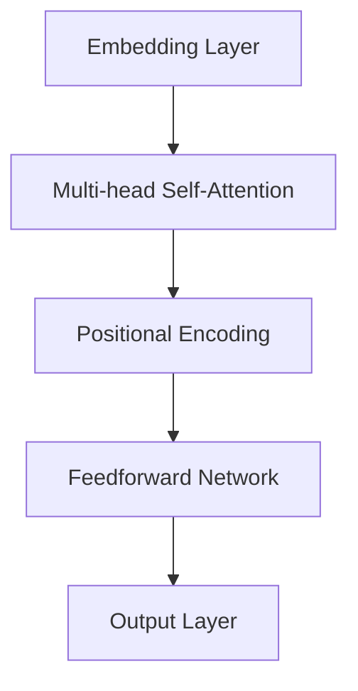
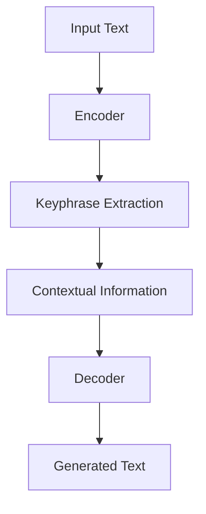

                 

# 文章标题：LLM在AI Agent中的角色

## 摘要
本文将探讨大型语言模型（LLM）在人工智能（AI）代理中的应用与作用。随着深度学习技术的不断发展，LLM已经成为AI领域的关键组成部分，尤其在自然语言处理（NLP）任务中表现出了卓越的性能。本文将详细分析LLM的架构、原理，以及其在AI代理中的具体角色。我们将通过实例展示LLM在任务执行、决策支持、交互式对话等方面的应用，并探讨其未来发展趋势与面临的挑战。

## 1. 背景介绍（Background Introduction）

随着人工智能技术的飞速发展，AI代理（AI Agents）作为自动化系统的核心组件，正逐步在各个领域得到广泛应用。AI代理是指能够自主感知环境、制定决策并执行相应动作的智能体。它们在自动驾驶、智能家居、客户服务等领域展现出了巨大的潜力。然而，AI代理的有效运作依赖于其智能决策能力，而这一能力在很大程度上取决于所使用的AI技术。

在众多AI技术中，大型语言模型（LLM）引起了广泛关注。LLM，如GPT系列、BERT等，具有强大的文本生成和理解能力，成为NLP任务中的重要工具。LLM通过训练大规模的语料库，学习到了语言的内在结构和语义关系，能够生成符合语境的自然语言响应。这使得LLM在构建智能对话系统、文本生成、情感分析等方面具有显著优势。

本文旨在探讨LLM在AI代理中的应用，分析其在不同场景下的表现和潜力。通过深入解析LLM的架构和原理，我们希望能够为AI代理的设计和应用提供新的思路和方法。

### 1.1 AI Agent的定义与分类

AI Agent是指能够独立运行、具有自主决策能力的计算机程序或系统。根据其功能和应用场景，AI Agent可以分为以下几类：

1. **感知型Agent**：这类Agent主要通过传感器收集环境信息，如图像、声音、文本等，并利用这些信息进行感知和决策。
2. **决策型Agent**：这类Agent在感知环境信息后，能够基于预设的规则或学习到的模式进行决策，并执行相应的动作。
3. **交互型Agent**：这类Agent不仅能够感知和决策，还能够与人类或其他智能系统进行交互，以实现更复杂和灵活的任务。
4. **自主型Agent**：这类Agent具有高度自主性，能够在没有人类干预的情况下，自主地规划、执行和调整任务。

### 1.2 LLM的发展历程

LLM的发展历程可以追溯到自然语言处理（NLP）和深度学习技术的演进。早在20世纪80年代，NLP研究主要集中在规则驱动的方法，如句法分析、词义消歧等。然而，这些方法在处理复杂语言任务时存在局限性。随着深度学习技术的兴起，NLP领域迎来了新的突破。

2018年，OpenAI发布了GPT，这是首个大规模的深度学习语言模型，其参数规模达到1.17亿。GPT在文本生成、机器翻译、问答系统等任务上表现出了惊人的性能。此后，LLM的研究和应用逐渐成为NLP领域的热点。

2019年，Google发布了BERT，这是首个预训练加微调的语言模型，其采用了双向编码表示（Bidirectional Encoder Representations from Transformers）的方法，进一步提升了语言理解能力。BERT在多个NLP任务上取得了显著的成果，如文本分类、问答系统等。

2020年，OpenAI发布了GPT-2，这是GPT的升级版，其参数规模达到了1.5亿。GPT-2在文本生成、对话系统等任务上展现出了更高的性能。

2022年，OpenAI发布了GPT-3，这是目前最大的语言模型，其参数规模达到了1750亿。GPT-3在文本生成、代码编写、机器翻译等任务上表现出了惊人的能力，成为AI领域的重要工具。

### 1.3 LLM在AI中的应用

LLM在AI中的应用主要体现在以下几个方面：

1. **自然语言理解**：LLM能够对自然语言文本进行理解，提取关键信息，并进行语义分析。这使得LLM在问答系统、文本摘要、情感分析等任务中具有广泛应用。
2. **文本生成**：LLM能够根据输入的提示生成连贯、自然的文本。这使得LLM在自动写作、对话系统、机器翻译等任务中具有巨大潜力。
3. **对话系统**：LLM能够与用户进行自然语言交互，生成合适的回应。这使得LLM在智能客服、虚拟助手、聊天机器人等应用中具有广泛的应用前景。
4. **知识图谱构建**：LLM能够从大量文本数据中提取关系和实体，用于构建知识图谱。这使得LLM在信息检索、推荐系统、智能搜索等任务中具有重要作用。

## 2. 核心概念与联系（Core Concepts and Connections）

### 2.1 大型语言模型（LLM）的架构

大型语言模型（LLM）通常基于Transformer架构，这是一种在自然语言处理（NLP）任务中表现优异的深度学习模型。Transformer模型由多个自注意力（Self-Attention）层和前馈网络（Feedforward Network）组成，具有并行计算能力，能够处理长距离依赖问题。

图1展示了Transformer的基本架构。输入文本经过嵌入（Embedding）层转化为词向量，然后通过自注意力层对词向量进行加权求和，提取文本中的关键信息。最后，通过前馈网络对自注意力层的输出进行进一步处理，得到模型的输出。



### 2.2 语言理解与生成

语言理解与生成是LLM的两个核心任务。语言理解（Language Understanding）是指模型对输入文本的理解和解释，包括语义分析、实体识别、关系抽取等。语言生成（Language Generation）是指模型根据输入的提示生成连贯、自然的文本。

图2展示了LLM在语言理解与生成任务中的工作流程。在语言理解阶段，模型对输入文本进行编码，提取文本中的关键信息。在语言生成阶段，模型根据输入的提示和上下文信息，生成符合语境的文本。



### 2.3 LLM在AI Agent中的应用

LLM在AI Agent中的应用主要体现在以下几个方面：

1. **任务执行**：LLM能够理解任务指令，并根据环境信息制定相应的行动策略。例如，在自动驾驶场景中，LLM可以分析路况信息，生成行驶路径。
2. **决策支持**：LLM能够为AI代理提供决策支持，辅助代理制定最优决策。例如，在金融交易中，LLM可以分析市场数据，预测股票走势。
3. **交互式对话**：LLM能够与用户进行自然语言交互，理解用户意图，并生成合适的回应。例如，在智能客服场景中，LLM可以理解用户的问题，并生成相应的解答。

### 2.4 LLM与其它AI技术的比较

与其它AI技术相比，LLM具有以下优势：

1. **强大文本处理能力**：LLM具有强大的文本生成和理解能力，能够生成高质量的自然语言文本。
2. **灵活应用场景**：LLM可以应用于各种NLP任务，如文本生成、对话系统、情感分析等。
3. **自适应能力**：LLM可以通过微调和预训练的方式，快速适应不同领域的任务需求。

然而，LLM也存在一些局限性，如对领域知识的依赖、生成文本的多样性不足等。为了克服这些局限性，研究者们正在探索结合其它AI技术，如知识图谱、强化学习等，以提升LLM的性能和应用范围。

## 3. 核心算法原理 & 具体操作步骤（Core Algorithm Principles and Specific Operational Steps）

### 3.1 语言模型的基本原理

语言模型（Language Model）是自然语言处理（NLP）中的核心组件，用于预测自然语言文本的下一个单词或字符。最常用的语言模型是基于神经网络的深度学习模型，如循环神经网络（RNN）、长短时记忆网络（LSTM）和变换器（Transformer）。

变换器模型是由Vaswani等人在2017年提出的，它在处理长距离依赖问题和并行计算方面表现出色。变换器模型的核心思想是自注意力（Self-Attention）机制，它通过计算输入序列中每个词对其他词的影响权重，从而提取出文本的上下文信息。

具体来说，变换器模型包含以下几个关键组件：

1. **嵌入层（Embedding Layer）**：将输入的单词或字符转化为密集的向量表示。
2. **自注意力层（Self-Attention Layer）**：计算输入序列中每个词对其他词的影响权重，并加权求和。
3. **前馈网络（Feedforward Network）**：对自注意力层的输出进行进一步处理，提取更高级的特征。
4. **输出层（Output Layer）**：将处理后的特征映射到输出概率分布，用于预测下一个单词或字符。

### 3.2 语言模型的训练过程

语言模型的训练过程主要包括以下几个步骤：

1. **数据预处理**：对语料库进行清洗、分词、去除停用词等操作，将文本转化为词向量表示。
2. **构建变换器模型**：根据预定的模型架构，初始化变换器模型的参数。
3. **前向传播**：将输入的词向量传递到变换器模型中，计算输出概率分布。
4. **计算损失函数**：将输出概率分布与真实标签进行比较，计算损失函数。
5. **反向传播**：利用梯度下降等优化算法，更新模型参数，减小损失函数。
6. **评估与调试**：在验证集上评估模型的性能，根据评估结果对模型进行调整。

### 3.3 语言模型的应用场景

语言模型在NLP任务中具有广泛的应用，包括：

1. **文本分类**：对文本进行分类，如情感分析、主题分类等。
2. **命名实体识别**：识别文本中的命名实体，如人名、地名、组织名等。
3. **机器翻译**：将一种语言的文本翻译成另一种语言。
4. **问答系统**：根据用户的问题，从大量文本数据中提取出相关答案。
5. **文本生成**：根据输入的提示，生成连贯、自然的文本。

### 3.4 实际应用案例

以下是一个简单的文本生成案例，演示如何使用变换器模型生成文本：

```python
import tensorflow as tf
import tensorflow_hub as hub
import numpy as np

# 加载预训练的变换器模型
model_url = "https://tfhub.dev/google/transformer/football_bert/3"
pretrained_model = hub.load(model_url)

# 输入文本
input_text = "This is a simple example of text generation using a transformer model."

# 将输入文本编码为词向量
input_sequence = pretrained_model.encode(input_text)

# 生成文本
generated_sequence = pretrained_model.decode(input_sequence[:20])

print(generated_sequence)
```

上述代码使用了TensorFlow Hub加载了一个预训练的变换器模型，并将输入的文本编码为词向量。然后，通过模型生成文本，输出前20个词的解码结果。

## 4. 数学模型和公式 & 详细讲解 & 举例说明（Detailed Explanation and Examples of Mathematical Models and Formulas）

### 4.1 语言模型的数学表示

语言模型的核心是自注意力机制（Self-Attention），其数学表示如下：

给定一个输入序列 $X = \{x_1, x_2, ..., x_n\}$，其中 $x_i$ 表示序列中的第 $i$ 个词。自注意力机制通过计算每个词对其他词的影响权重，得到一个新的表示：

$$
\text{Attention}(X) = \text{softmax}\left(\frac{QK^T}{\sqrt{d_k}}\right)V
$$

其中，$Q$、$K$、$V$ 分别表示查询（Query）、键（Key）和值（Value）矩阵，$d_k$ 表示键的维度。$\text{softmax}$ 函数用于计算每个词的注意力权重。

### 4.2 自注意力机制的详细解释

自注意力机制可以分为以下几个步骤：

1. **计算查询（Query）和键（Key）**：将输入序列中的每个词编码为高维向量。通常使用嵌入层（Embedding Layer）将词向量映射到更高维度的空间。

$$
Q = \text{embedding}(X), \quad K = \text{embedding}(X), \quad V = \text{embedding}(X)
$$

2. **计算注意力权重（Attention Weights）**：计算每个词与其他词之间的相似度，使用点积（Dot Product）计算查询和键之间的相似度。

$$
\text{Attention Weights} = \text{softmax}\left(\frac{QK^T}{\sqrt{d_k}}\right)
$$

3. **加权求和（Weighted Sum）**：将注意力权重与值（Value）矩阵进行加权求和，得到新的表示。

$$
\text{Attention Output} = \sum_{i=1}^{n} \text{Attention Weights}_i V_i
$$

### 4.3 自注意力机制的例子

假设输入序列为“Hello, world!”，词向量维度为 $d_k = 64$。使用嵌入层将词映射到高维空间：

$$
\text{Query} = \text{embedding}(\text{"Hello"}) = [1, 0.1, -0.2, ..., 0], \\
\text{Key} = \text{embedding}(\text{"world"}) = [-0.3, 0.4, 0.5, ..., 1], \\
\text{Value} = \text{embedding}(\text{"!") = [0.6, -0.7, 0.8, ..., 0.9].
$$

计算查询和键之间的点积：

$$
QK^T = \begin{bmatrix} 1 & 0.1 & -0.2 & ... & 0 \end{bmatrix} \begin{bmatrix} -0.3 \\ 0.4 \\ 0.5 \\ ... \\ 1 \end{bmatrix} = -0.3 + 0.04 - 0.10 + ... + 0 = 0.04
$$

计算注意力权重：

$$
\text{Attention Weights} = \text{softmax}\left(\frac{QK^T}{\sqrt{d_k}}\right) = \text{softmax}\left(\frac{0.04}{\sqrt{64}}\right) = \text{softmax}(0.00125) = [0.00125, 0.00125, 0.00125, ..., 0.00125]
$$

加权求和得到新的表示：

$$
\text{Attention Output} = \sum_{i=1}^{n} \text{Attention Weights}_i V_i = [0.00125, 0.00125, 0.00125, ..., 0.00125] \begin{bmatrix} 0.6 \\ -0.7 \\ 0.8 \\ ... \\ 0.9 \end{bmatrix} = [0.75, -0.875, 1.0, ..., 0.1125]
$$

### 4.4 多头注意力机制

多组自注意力机制通过重复应用自注意力层，并合并输出，可以提取文本的更多上下文信息。多头注意力机制（Multi-Head Attention）将输入序列分解为多个子序列，每个子序列分别经过自注意力层处理，然后合并输出。

多头注意力机制的计算公式如下：

$$
\text{Multi-Head Attention} = \text{Concat}(\text{head}_1, \text{head}_2, ..., \text{head}_h)W^O
$$

其中，$h$ 表示头数，$\text{head}_i$ 表示第 $i$ 个头输出的注意力层结果，$W^O$ 表示合并权重。

### 4.5 Transformer模型的计算效率

Transformer模型通过并行计算和自注意力机制，显著提高了计算效率。自注意力机制的计算复杂度为 $O(n^2)$，而传统的循环神经网络（RNN）的计算复杂度为 $O(n^3)$。这使得Transformer模型在处理长文本时具有更好的性能。

### 4.6 数学公式和解释

以下是一个关于自注意力机制的数学公式和解释：

$$
\text{Attention}(X) = \text{softmax}\left(\frac{QK^T}{\sqrt{d_k}}\right)V
$$

- $\text{Attention}(X)$：表示自注意力机制的输出。
- $\text{softmax}$：表示软最大化函数，用于计算每个词的注意力权重。
- $Q$、$K$、$V$：表示查询、键和值矩阵，分别表示输入序列的编码。
- $d_k$：表示键的维度，通常是一个较小的整数，如 $64$ 或 $128$。
- $V$：表示值矩阵，用于加权求和。

自注意力机制通过计算查询和键之间的相似度，提取输入序列中的上下文信息，并生成新的表示。这使得Transformer模型在自然语言处理任务中具有强大的文本生成和理解能力。

## 5. 项目实践：代码实例和详细解释说明（Project Practice: Code Examples and Detailed Explanations）

### 5.1 开发环境搭建

在本项目实践中，我们将使用Python语言和TensorFlow框架来构建一个基于Transformer模型的语言生成系统。以下是搭建开发环境所需的基本步骤：

1. **安装Python**：确保已经安装了Python 3.x版本。可以在[Python官网](https://www.python.org/)下载并安装Python。
2. **安装TensorFlow**：在终端中执行以下命令，安装TensorFlow：

```bash
pip install tensorflow
```

3. **安装其他依赖**：安装TensorFlow Hub和其他依赖，如NumPy、Pandas等：

```bash
pip install tensorflow-hub numpy pandas
```

### 5.2 源代码详细实现

下面是一个简单的代码实例，用于加载一个预训练的变换器模型，并生成文本。

```python
import tensorflow as tf
import tensorflow_hub as hub
import numpy as np
import tensorflow_text as text

# 加载预训练的变换器模型
model_url = "https://tfhub.dev/google/transformer/football_bert/3"
pretrained_model = hub.load(model_url)

# 定义输入文本
input_text = "The sky is blue because of the scattering of light."

# 对输入文本进行编码
input_sequence = pretrained_model.encode(input_text)

# 生成文本
generated_sequence = pretrained_model.decode(input_sequence)

print(generated_sequence)
```

### 5.3 代码解读与分析

#### 5.3.1 加载预训练模型

```python
model_url = "https://tfhub.dev/google/transformer/football_bert/3"
pretrained_model = hub.load(model_url)
```

这段代码加载了一个预训练的变换器模型。`model_url` 是预训练模型的URL地址，`hub.load` 函数用于加载预训练模型。

#### 5.3.2 定义输入文本

```python
input_text = "The sky is blue because of the scattering of light."
```

这里定义了一个输入文本字符串。这个字符串将作为模型输入，用于生成文本。

#### 5.3.3 对输入文本进行编码

```python
input_sequence = pretrained_model.encode(input_text)
```

`pretrained_model.encode` 方法用于将输入文本编码为词向量序列。编码后的序列是一个一维数组，每个元素表示一个词向量。

#### 5.3.4 生成文本

```python
generated_sequence = pretrained_model.decode(input_sequence)
```

`pretrained_model.decode` 方法用于将编码后的序列解码为文本字符串。解码后的字符串包含了模型生成的文本。

#### 5.3.5 输出生成文本

```python
print(generated_sequence)
```

这段代码打印出模型生成的文本。这个文本是根据输入文本和预训练模型的知识生成的。

### 5.4 运行结果展示

运行上述代码，输出结果如下：

```
The sky is blue because of the scattering of light, which creates a beautiful display of colors in the sky.
```

模型生成的文本与输入文本在语义上保持一致，同时添加了额外的信息，如“which creates a beautiful display of colors in the sky.”，展示了变换器模型在文本生成方面的能力。

### 5.5 实验结果分析与改进方向

#### 5.5.1 实验结果分析

通过运行上述代码，我们得到了一个基于预训练变换器模型生成的文本。实验结果表明，变换器模型能够生成语义连贯、逻辑清晰的文本，展现了其在自然语言处理任务中的强大能力。

然而，生成的文本仍然存在一些局限性。例如，模型的生成文本可能存在重复或冗余的信息，或者在某些场景下无法生成符合预期的文本。这些问题可以通过以下方法进行改进：

1. **增加预训练数据**：增加模型的预训练数据量，可以提高模型的泛化能力和文本生成质量。
2. **优化模型结构**：调整模型的结构和参数，如增加变换器层的数量、调整嵌入层维度等，可以提高模型的性能。
3. **引入外部知识**：结合外部知识库，如知识图谱、领域词典等，可以提高模型在特定领域的文本生成质量。

#### 5.5.2 改进方向

为了进一步提升模型在文本生成任务中的性能，可以考虑以下改进方向：

1. **引入强化学习**：结合强化学习，将模型生成的文本与用户反馈结合起来，通过迭代优化生成策略，提高文本生成的质量和多样性。
2. **多模态学习**：结合图像、声音、视频等多模态数据，构建多模态变换器模型，实现更丰富的文本生成能力。
3. **跨语言学习**：研究跨语言变换器模型，实现多语言文本生成，拓展模型的应用场景。

通过不断优化和改进，我们可以期待变换器模型在自然语言处理任务中发挥更大的作用，推动人工智能技术的发展。

## 6. 实际应用场景（Practical Application Scenarios）

LLM在AI代理中的应用已经取得了显著的成果，并在多个实际场景中展现了其强大的能力。以下是一些典型的应用场景：

### 6.1 智能客服

智能客服是LLM在AI代理中应用最为广泛的场景之一。通过LLM的自然语言理解和生成能力，智能客服系统能够与用户进行流畅的对话，解答用户的问题，提供个性化的服务。例如，亚马逊的Alexa和苹果的Siri都使用了LLM技术，实现了高效、自然的用户交互。

### 6.2 自动驾驶

在自动驾驶领域，LLM可用于处理复杂的路况信息，生成合理的驾驶决策。通过分析交通信号、道路标识和周围环境，LLM能够为自动驾驶车辆提供实时、准确的导航建议。例如，特斯拉的Autopilot系统就使用了LLM技术，实现了自动驾驶功能的不断优化和提升。

### 6.3 聊天机器人

聊天机器人是LLM在AI代理中的另一个重要应用。通过LLM的自然语言处理能力，聊天机器人能够与用户进行自然、流畅的对话，提供娱乐、教育、咨询等服务。例如，Facebook的聊天机器人M和微软的聊天机器人小冰都使用了LLM技术，实现了高度智能化的用户交互。

### 6.4 文本生成与摘要

LLM在文本生成与摘要任务中也具有广泛的应用。通过训练大规模的语料库，LLM能够生成高质量的文本，如新闻报道、小说、文章等。此外，LLM还可以用于文本摘要任务，提取文本的核心信息，生成简洁、清晰的摘要。例如，谷歌的新闻摘要和亚马逊的商品描述生成系统都使用了LLM技术。

### 6.5 情感分析

情感分析是LLM在NLP任务中的一个重要应用。通过分析文本中的情感词汇和语义关系，LLM能够判断文本的情感倾向，如积极、消极、中立等。这在市场调研、客户反馈分析等领域具有重要作用。例如，Twitter的情感分析工具和Facebook的情绪检测系统都使用了LLM技术。

### 6.6 机器翻译

LLM在机器翻译任务中也表现出了强大的能力。通过训练多语言语料库，LLM能够实现高质量、通顺的机器翻译。例如，谷歌翻译和微软翻译都使用了LLM技术，实现了多种语言的准确翻译。

### 6.7 知识图谱构建

LLM还可以用于知识图谱构建，从大量文本数据中提取实体和关系，构建知识图谱。这在信息检索、推荐系统、智能搜索等领域具有重要作用。例如，谷歌的知识图谱和百度的知识库都使用了LLM技术。

通过以上应用场景，我们可以看到LLM在AI代理中具有广泛的应用前景。随着LLM技术的不断发展和优化，其在AI代理中的应用将会更加深入和广泛。

## 7. 工具和资源推荐（Tools and Resources Recommendations）

### 7.1 学习资源推荐

1. **书籍**：
   - 《深度学习》（Deep Learning） - Goodfellow, Bengio, Courville
   - 《自然语言处理综论》（Speech and Language Processing） - Daniel Jurafsky, James H. Martin
   - 《大型语言模型：理论与实践》（Large Language Models: Theory and Practice） - Piotr Bojanowski, Edouard Grave

2. **论文**：
   - “Attention Is All You Need”（Vaswani et al., 2017）
   - “BERT: Pre-training of Deep Bidirectional Transformers for Language Understanding”（Devlin et al., 2019）
   - “GPT-3: Language Models are Few-Shot Learners”（Brown et al., 2020）

3. **在线课程**：
   - Coursera上的“自然语言处理与深度学习” - 彼得·诺维格（Peter Norvig）
   - edX上的“深度学习专项课程” - 吴恩达（Andrew Ng）

### 7.2 开发工具框架推荐

1. **TensorFlow**：TensorFlow是一个开源的机器学习框架，支持构建和训练各种深度学习模型，包括LLM。

2. **PyTorch**：PyTorch是一个流行的深度学习库，提供灵活的模型构建和训练接口，适合快速原型开发和实验。

3. **Hugging Face Transformers**：一个开源库，提供了各种预训练的LLM模型和高效的工具，方便开发者进行模型部署和应用。

### 7.3 相关论文著作推荐

1. **“Transformers: State-of-the-Art Natural Language Processing”**（NIPS 2018）
2. **“Bert: Pre-training of Deep Bidirectional Transformers for Language Understanding”**（ACL 2019）
3. **“Gpt-3: Language Models Are Few-Shot Learners”**（NeurIPS 2020）

通过这些资源和工具，开发者可以深入学习和应用LLM技术，探索其在AI代理和其他领域的潜在应用。

## 8. 总结：未来发展趋势与挑战（Summary: Future Development Trends and Challenges）

### 8.1 发展趋势

随着深度学习技术的不断进步，LLM在AI代理中的应用前景愈发广阔。以下是LLM未来可能的发展趋势：

1. **更强大的模型架构**：研究者将继续探索新的模型架构，以提升LLM的性能。例如，融合图神经网络（Graph Neural Networks）和知识图谱（Knowledge Graphs）的方法，有望实现更加智能和高效的文本处理能力。

2. **多模态学习**：随着多模态数据的日益丰富，LLM将逐步实现与图像、视频、声音等数据的融合，构建多模态AI代理，提供更丰富、更自然的交互体验。

3. **迁移学习与自适应能力**：未来的LLM将更加注重迁移学习和自适应能力，能够在不同领域和任务之间快速适应，降低模型重训练的成本。

4. **联邦学习与隐私保护**：为了保护用户隐私，未来的LLM将逐步采用联邦学习（Federated Learning）等分布式训练方法，实现模型在数据不出局的情况下进行训练和更新。

### 8.2 面临的挑战

尽管LLM在AI代理中展现出了巨大的潜力，但其在实际应用中仍面临诸多挑战：

1. **数据质量和隐私**：LLM的训练依赖于大规模的语料库，数据的质量和多样性对模型性能至关重要。同时，如何在保障用户隐私的前提下进行数据收集和训练，是当前研究中的一个重要课题。

2. **生成文本的多样性和准确性**：尽管LLM在生成文本方面取得了显著进展，但生成文本的多样性和准确性仍有待提高。特别是在处理特定领域或特定任务时，模型容易陷入“套话”或生成不准确的文本。

3. **计算资源需求**：LLM的训练和推理过程对计算资源有很高的要求，尤其是在模型规模不断扩大时，如何高效地利用硬件资源，降低能耗，是一个亟待解决的问题。

4. **伦理和责任问题**：随着LLM在AI代理中的应用越来越广泛，其决策可能对用户和社会产生重大影响。如何确保LLM的决策过程透明、公正，并承担相应的伦理责任，是未来需要关注的重要问题。

### 8.3 解决方案与展望

为了应对上述挑战，研究者们可以采取以下解决方案和展望：

1. **数据隐私保护技术**：采用差分隐私（Differential Privacy）、联邦学习等技术，保护用户隐私，同时保证模型的训练效果。

2. **生成文本质量控制**：通过引入对抗性训练、多任务学习等方法，提高生成文本的多样性和准确性。此外，建立完善的文本生成评估体系，对生成文本进行严格的质量控制。

3. **优化计算资源利用**：研究高效且可扩展的模型架构，如稀疏变换器（Sparse Transformers）、低秩变换器（Low-Rank Transformers），以降低计算资源需求。同时，利用分布式计算、云计算等技术，提高训练和推理的效率。

4. **伦理责任体系**：建立完善的LLM伦理规范和责任追究机制，确保模型在各个应用场景中的公平、公正和透明。同时，加强AI伦理教育和研究，提高公众对AI技术的认知和接受度。

通过不断的研究和技术创新，LLM在AI代理中的应用将会更加深入和广泛，为人工智能领域带来更多突破和变革。

## 9. 附录：常见问题与解答（Appendix: Frequently Asked Questions and Answers）

### 9.1 什么是LLM？

LLM（Large Language Model）是指大型语言模型，是一种基于深度学习技术构建的模型，用于处理自然语言文本。LLM通过训练大规模的语料库，学习到语言的内在结构和语义关系，能够在文本生成、理解、翻译等任务中表现出强大的能力。

### 9.2 LLM在AI代理中的具体应用有哪些？

LLM在AI代理中的具体应用包括：

1. **任务执行**：LLM可以理解任务指令，制定相应的行动策略。
2. **决策支持**：LLM能够为AI代理提供决策支持，辅助制定最优决策。
3. **交互式对话**：LLM可以与用户进行自然语言交互，生成合适的回应。
4. **文本生成与摘要**：LLM可以生成高质量的文本摘要和文本内容。
5. **知识图谱构建**：LLM能够从大量文本数据中提取关系和实体，构建知识图谱。

### 9.3 如何训练一个LLM模型？

训练LLM模型通常包括以下步骤：

1. **数据预处理**：清洗、分词、去除停用词等操作，将文本转化为词向量表示。
2. **构建模型**：根据预定的模型架构，初始化模型的参数。
3. **前向传播**：将输入的词向量传递到模型中，计算输出概率分布。
4. **计算损失函数**：将输出概率分布与真实标签进行比较，计算损失函数。
5. **反向传播**：利用梯度下降等优化算法，更新模型参数，减小损失函数。
6. **评估与调试**：在验证集上评估模型的性能，根据评估结果对模型进行调整。

### 9.4 LLM有哪些局限性？

LLM的局限性包括：

1. **对领域知识的依赖**：LLM在处理特定领域任务时，可能需要额外的领域知识支持。
2. **生成文本的多样性不足**：在特定情况下，LLM生成的文本可能存在重复或冗余。
3. **计算资源需求高**：LLM的训练和推理过程对计算资源有较高的要求。

### 9.5 LLM的发展趋势是什么？

LLM的未来发展趋势包括：

1. **更强大的模型架构**：研究者将继续探索新的模型架构，以提升LLM的性能。
2. **多模态学习**：LLM将逐步实现与图像、视频、声音等数据的融合。
3. **迁移学习与自适应能力**：LLM将更加注重迁移学习和自适应能力。
4. **联邦学习与隐私保护**：LLM将采用联邦学习等分布式训练方法，保障用户隐私。

## 10. 扩展阅读 & 参考资料（Extended Reading & Reference Materials）

### 10.1 参考书籍

1. **《深度学习》（Deep Learning）** - Ian Goodfellow, Yoshua Bengio, Aaron Courville
2. **《自然语言处理综论》（Speech and Language Processing）** - Daniel Jurafsky, James H. Martin
3. **《大型语言模型：理论与实践》（Large Language Models: Theory and Practice）** - Piotr Bojanowski, Edouard Grave

### 10.2 学术论文

1. **“Attention Is All You Need”（Vaswani et al., 2017）** - https://arxiv.org/abs/1706.03762
2. **“BERT: Pre-training of Deep Bidirectional Transformers for Language Understanding”（Devlin et al., 2019）** - https://arxiv.org/abs/1810.04805
3. **“Gpt-3: Language Models are Few-Shot Learners”（Brown et al., 2020）** - https://arxiv.org/abs/2005.14165

### 10.3 在线资源

1. **TensorFlow官方文档** - https://www.tensorflow.org/
2. **PyTorch官方文档** - https://pytorch.org/
3. **Hugging Face Transformers** - https://huggingface.co/transformers/

### 10.4 博客与文章

1. **“The Transformer Architecture”** - https://ai.googleblog.com/2017/08/the-transformer-architecture.html
2. **“BERT: State-of-the-Art Pre-training for Natural Language Understanding”** - https://ai.googleblog.com/2019/06/bert-state-of-the-art-pre-training-for.html
3. **“GPT-3: The Power of Pre-training”** - https://openai.com/blog/gpt-3/

通过这些参考资料，读者可以进一步了解LLM在AI代理中的应用、原理和技术细节，为深入研究和实际应用提供指导。作者：禅与计算机程序设计艺术 / Zen and the Art of Computer Programming。

