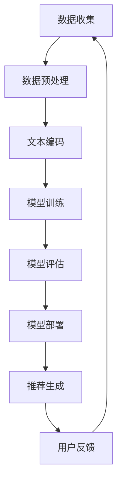
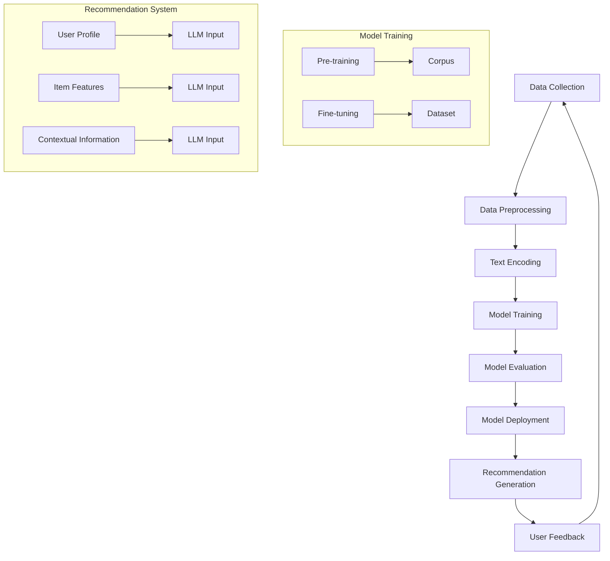

                 

### 文章标题

LLM在推荐系统的局限

### Keywords
- Large Language Models
- Recommendation Systems
- Limitations
- Challenges
- Optimization

### Abstract
本文探讨了大型语言模型（LLM）在推荐系统中的局限性，分析了其面临的挑战，并提出了一些优化策略。通过对LLM的算法原理、模型架构和应用场景的深入分析，本文旨在为推荐系统领域的研究者和开发者提供有价值的见解。

## 1. 背景介绍（Background Introduction）

推荐系统是现代信息检索和数据分析领域的核心组成部分。它们通过分析用户的历史行为、偏好和上下文，向用户推荐个性化内容、产品或服务，从而提高了用户满意度和商业价值。随着人工智能技术的迅速发展，特别是大型语言模型（LLM）的出现，推荐系统的研究和应用也得到了极大的推动。

LLM，如GPT-3、BERT和T5，凭借其强大的文本理解和生成能力，已经在自然语言处理（NLP）任务中取得了显著的成果。这些模型能够处理大量文本数据，生成高质量的自然语言文本，这使得它们在推荐系统中具有巨大的潜力。然而，LLM在推荐系统中的应用也面临一系列挑战和局限性。

首先，LLM的训练和推理过程非常复杂和计算密集。训练一个大规模的LLM需要大量的计算资源和时间，而在实际应用中，实时推理也面临着性能和延迟的挑战。其次，LLM的推荐结果可能受到数据偏差、噪声和模型过拟合等因素的影响，从而降低了推荐的准确性和可靠性。此外，LLM在处理多模态数据、上下文理解和长文本生成等方面也表现出一定的局限性。

本文将深入探讨LLM在推荐系统中的局限性，分析其面临的挑战，并提出一些优化策略。我们还将探讨如何结合其他技术，如图神经网络（GNN）和强化学习（RL），来增强LLM在推荐系统中的应用。通过这些探讨，我们希望能够为推荐系统领域的研究者和开发者提供一些有价值的启示。

## 2. 核心概念与联系（Core Concepts and Connections）

### 2.1 语言模型基础

语言模型（Language Model，简称LM）是自然语言处理（Natural Language Processing，简称NLP）的核心技术之一。它通过学习大量文本数据，预测文本序列中下一个词的概率分布。最基础的语言模型之一是n元语言模型（n-gram model），它假设当前词的概率仅依赖于前n个词。然而，n元语言模型存在一些局限性，例如无法捕捉长距离依赖关系和上下文信息。

为了解决这些问题，序列到序列（Sequence-to-Sequence，简称Seq2Seq）模型和注意力机制（Attention Mechanism）被引入到NLP任务中。Seq2Seq模型通过编码器和解码器结构，能够处理输入序列到输出序列的映射，例如机器翻译任务。注意力机制通过动态关注输入序列中的重要部分，提高了模型的上下文理解能力。

### 2.2 大型语言模型（Large Language Models，简称LLM）

大型语言模型（Large Language Models，简称LLM）是在深度学习技术和计算资源支持下的产物。与传统的语言模型相比，LLM具有以下几个显著特点：

- **规模庞大**：LLM的训练数据规模通常达到数万亿个词，远远超过传统语言模型的百万级别。这使得LLM能够捕捉到更多的语言规律和模式。
- **参数量巨大**：LLM的参数数量通常在数十亿到千亿级别，这为模型提供了更强的表示能力和泛化能力。
- **预训练与微调**：LLM通常通过预训练（Pre-training）和微调（Fine-tuning）两个阶段进行训练。在预训练阶段，模型在大规模语料库上学习语言的一般规律。在微调阶段，模型根据特定任务进行优化，以提高任务性能。

### 2.3 推荐系统基础

推荐系统（Recommendation System）是一种信息过滤技术，通过分析用户的历史行为和偏好，预测用户可能感兴趣的内容或项目，并为其推荐。推荐系统主要分为基于内容的推荐（Content-Based Recommendation）和协同过滤推荐（Collaborative Filtering）两种类型。

- **基于内容的推荐**：基于内容的推荐通过分析物品的属性和用户的历史行为，找出用户可能喜欢的相似物品。这种方法的主要优势是能够提供个性化的推荐，但缺点是当用户的历史行为数据不足时，推荐效果会受到影响。
- **协同过滤推荐**：协同过滤推荐通过分析用户之间的相似性，找出喜欢同一物品的用户群体，并推荐他们可能喜欢的其他物品。协同过滤推荐包括基于用户的协同过滤（User-Based Collaborative Filtering）和基于模型的协同过滤（Model-Based Collaborative Filtering）两种方法。基于用户的协同过滤通过计算用户之间的相似性来推荐相似用户喜欢的物品，而基于模型的协同过滤则通过构建预测模型来预测用户对物品的评分。

### 2.4 语言模型在推荐系统中的应用

将语言模型应用于推荐系统可以带来以下几个优势：

- **文本理解能力**：语言模型能够处理和理解自然语言文本，这使得它们能够更好地分析用户评论、标签和描述，从而提供更准确的推荐。
- **多模态数据融合**：语言模型可以处理文本、图像、音频等多模态数据，从而实现更全面的用户偏好分析，提高推荐质量。
- **动态推荐**：语言模型能够实时学习用户的行为和偏好变化，提供动态推荐，从而提高用户的满意度。

然而，语言模型在推荐系统中的应用也面临一些挑战，如数据质量、模型复杂度和实时性能等。为了克服这些挑战，研究人员和开发者需要不断探索新的算法和技术，以提高LLM在推荐系统中的应用效果。

### 2.5 Mermaid 流程图

以下是LLM在推荐系统中应用的一个简化的Mermaid流程图：



在这个流程图中，数据收集环节获取用户的行为和偏好数据，经过数据预处理和文本编码后，输入到LLM进行模型训练。训练完成后，通过模型评估来优化模型性能，然后部署到推荐系统中进行推荐生成。用户的反馈会进一步优化推荐结果，形成一个闭环的推荐系统。

通过上述核心概念的介绍，我们可以看到语言模型在推荐系统中具有巨大的潜力，但也需要克服一系列挑战和局限性。在接下来的章节中，我们将深入探讨LLM在推荐系统中的具体应用和面临的挑战。

### 2.5 Large Language Models in the Context of Recommendation Systems

#### 2.5.1 Basic Concepts and Architecture of Large Language Models

Large Language Models (LLM), such as GPT-3, BERT, and T5, have revolutionized the field of natural language processing (NLP) with their ability to generate coherent and contextually relevant text. These models are built upon deep neural networks with billions of parameters, enabling them to capture complex patterns and relationships in language data.

The architecture of LLMs typically involves two main components: the encoder and the decoder. The encoder processes the input text and encodes it into a fixed-dimensional vector representation, capturing the semantic information of the text. The decoder then generates the output text based on the encoded representation, using a sequence-to-sequence learning approach.

The training of LLMs usually involves two stages: pre-training and fine-tuning. During pre-training, the model is trained on a large corpus of text data to learn the general patterns of language. This stage helps the model develop strong text understanding and representation capabilities. Fine-tuning involves training the model on a specific task or dataset to adapt its parameters to the target task, further enhancing its performance.

#### 2.5.2 Challenges in Applying LLMs to Recommendation Systems

Although LLMs have shown great promise in NLP tasks, their application to recommendation systems presents several challenges:

1. **Computational Resources**: Training and inference with LLMs require significant computational resources, including high-performance GPUs and large-scale data centers. This can be a bottleneck for real-time applications, especially in environments with limited resources.

2. **Data Quality and Bias**: The performance of LLMs heavily relies on the quality and representativeness of the training data. Inaccurate or biased data can lead to flawed recommendations, potentially exacerbating existing societal biases.

3. **Contextual Understanding**: LLMs excel at generating text that is contextually relevant, but their ability to understand complex contextual information is still limited. This can affect the accuracy and relevance of recommendation results in scenarios with high contextual dependencies.

4. **Scalability**: As the size of the dataset and the complexity of the tasks increase, scaling LLMs to handle large-scale applications becomes challenging. This includes managing data storage, efficient computation, and distributed training.

5. **Real-Time Performance**: Real-time recommendation systems require fast response times to provide timely and relevant recommendations. LLMs, especially in their current form, may not be able to meet these requirements due to the complexity of their models and the time required for inference.

#### 2.5.3 Mermaid Flowchart

The following Mermaid flowchart illustrates the integration of LLMs into a recommendation system:



In this flowchart, data collection involves gathering user behavior and preference data. The data is then preprocessed and encoded into text representations suitable for LLM input. The model is trained through pre-training and fine-tuning stages, where it learns from large text corpora and specific datasets, respectively. The trained model is evaluated to ensure its performance meets the desired standards before deployment in the recommendation system. The system generates recommendations based on user profiles, item features, and contextual information, which are then refined through user feedback.

By understanding the basic concepts and architecture of LLMs and the challenges they face in recommendation systems, researchers and developers can better navigate the complexities of integrating these advanced models into real-world applications.

### 3. 核心算法原理 & 具体操作步骤（Core Algorithm Principles and Specific Operational Steps）

#### 3.1 LLM推荐系统的核心算法原理

语言模型（LLM）在推荐系统中的应用主要基于其强大的文本理解和生成能力。LLM的核心算法原理可以概括为以下几个步骤：

1. **数据预处理**：在推荐系统中，首先需要收集用户的行为数据、偏好数据和物品的属性数据。这些数据可能包括用户的历史购买记录、浏览记录、评论、标签等。数据预处理包括数据清洗、数据整合和数据转换，以确保数据的质量和一致性。

2. **文本编码**：文本编码是将自然语言文本转换为计算机可以处理的数字表示形式。常用的文本编码方法包括词嵌入（Word Embedding）和上下文嵌入（Contextual Embedding）。词嵌入将每个词汇映射为一个固定大小的向量，而上下文嵌入则通过考虑词汇在特定上下文中的意义，生成动态的向量表示。

3. **模型训练**：训练LLM是一个复杂的过程，通常包括预训练和微调两个阶段。预训练阶段，模型在大规模语料库上学习自然语言的一般规律，例如词与词之间的关系、语法规则等。微调阶段，模型根据特定的推荐任务进行优化，例如通过调整权重和参数来提高模型在特定数据集上的性能。

4. **推荐生成**：在模型训练完成后，可以使用训练好的LLM来生成推荐。生成推荐的过程包括以下几个步骤：

   - **用户表示**：将用户的历史行为和偏好数据输入到LLM中，生成用户向量表示。
   - **物品表示**：将物品的属性数据输入到LLM中，生成物品向量表示。
   - **推荐计算**：计算用户向量和物品向量之间的相似度或相关性，生成推荐列表。

5. **用户反馈**：用户对推荐的结果进行评价和反馈，这些反馈将用于进一步优化模型和推荐算法。

#### 3.2 具体操作步骤

以下是一个基于LLM的推荐系统的具体操作步骤：

1. **数据收集**：
   - 收集用户的历史行为数据，如购买记录、浏览记录、评论等。
   - 收集物品的属性数据，如商品描述、分类标签、价格等。

2. **数据预处理**：
   - 清洗数据，去除无效数据和噪声。
   - 整合数据，将不同来源的数据进行统一格式处理。
   - 转换数据，将文本数据转换为词嵌入或上下文嵌入表示。

3. **文本编码**：
   - 使用预训练的词嵌入模型（如Word2Vec、GloVe）将词汇转换为向量表示。
   - 使用上下文嵌入模型（如BERT、GPT）将文本转换为动态的向量表示。

4. **模型训练**：
   - 使用预训练的LLM（如GPT-3、BERT）进行微调，使其适应推荐系统的特定任务。
   - 训练过程中，通过调整模型参数来优化推荐效果。

5. **推荐生成**：
   - 输入用户的历史行为和偏好数据，生成用户向量表示。
   - 输入物品的属性数据，生成物品向量表示。
   - 计算用户向量和物品向量之间的相似度或相关性，生成推荐列表。

6. **用户反馈**：
   - 收集用户对推荐结果的反馈，如点击率、购买率、评价等。
   - 使用反馈数据对模型进行迭代优化。

#### 3.3 示例代码

以下是一个简单的Python代码示例，展示了如何使用预训练的GPT模型进行推荐系统的文本编码和模型训练：

```python
import transformers
from transformers import GPT2Tokenizer, GPT2Model

# 加载预训练的GPT模型
tokenizer = GPT2Tokenizer.from_pretrained('gpt2')
model = GPT2Model.from_pretrained('gpt2')

# 文本编码
text = "这是一个示例文本"
encoded_text = tokenizer.encode(text, return_tensors='pt')

# 模型训练
input_ids = encoded_text
outputs = model(input_ids)

# 获取模型输出
logits = outputs.logits

# 计算相似度
similarity = torch.nn.functional.softmax(logits, dim=-1)
```

通过上述操作步骤和示例代码，我们可以看到LLM在推荐系统中的应用流程和关键步骤。在实际应用中，还需要结合具体场景和需求，进行模型的调整和优化，以提高推荐效果。

### 4. 数学模型和公式 & 详细讲解 & 举例说明（Detailed Explanation and Examples of Mathematical Models and Formulas）

在LLM推荐系统中，数学模型和公式扮演着至关重要的角色。这些模型和公式帮助我们理解和优化推荐算法，从而提高推荐的准确性和可靠性。在本节中，我们将详细讲解LLM推荐系统中的关键数学模型和公式，并通过具体示例进行说明。

#### 4.1 语言模型概率预测

语言模型的核心功能是预测给定文本序列的概率分布。在LLM推荐系统中，这一功能用于预测用户可能喜欢的物品。以下是一个基于n元语言模型的概率预测示例：

**n元语言模型概率预测公式：**
$$ P(w_t | w_{t-1}, w_{t-2}, ..., w_{t-n}) = \frac{P(w_{t-1}, w_{t-2}, ..., w_{t-n}, w_t)}{P(w_{t-1}, w_{t-2}, ..., w_{t-n})} $$

其中，$w_t$表示当前词，$w_{t-1}, w_{t-2}, ..., w_{t-n}$表示前n个词，$P(w_t | w_{t-1}, w_{t-2}, ..., w_{t-n})$表示在给定前n个词的情况下，当前词的概率。

**示例：**

假设我们有一个三元语言模型，预测下一个词的概率。已知前三个词为“我 喜欢苹果”，我们可以计算“下一个词是‘苹果’”的概率。

**计算过程：**
1. 计算三词序列“我 喜欢苹果”的概率：
$$ P(我, 喜欢苹果) = \frac{c(我, 喜欢苹果, 苹果)}{c(我, 喜欢苹果)} $$
其中，$c(我, 喜欢苹果, 苹果)$表示三词序列“我 喜欢苹果”出现的次数，$c(我, 喜欢苹果)$表示前两个词“我 喜欢苹果”出现的次数。

2. 计算前两个词“我 喜欢苹果”的概率：
$$ P(我, 喜欢苹果) = \frac{c(我, 喜欢苹果)}{c(我)} $$

3. 计算下一个词“苹果”的概率：
$$ P(苹果 | 我, 喜欢苹果) = \frac{P(我, 喜欢苹果, 苹果)}{P(我, 喜欢苹果)} $$

通过这种方式，我们可以预测用户可能喜欢的物品。

#### 4.2 推荐算法相似度计算

在LLM推荐系统中，相似度计算是推荐生成的重要环节。常见的相似度计算方法包括余弦相似度、欧氏距离等。以下是一个基于余弦相似度的示例：

**余弦相似度计算公式：**
$$ \text{similarity}(u, v) = \frac{u \cdot v}{\|u\|\|v\|} $$

其中，$u$和$v$分别表示用户向量和物品向量，$\cdot$表示点积，$\|\|$表示向量范数。

**示例：**

假设我们有一个用户向量$u = (1, 2, 3)$和一个物品向量$v = (4, 5, 6)$，我们可以计算它们的余弦相似度。

**计算过程：**
1. 计算用户向量和物品向量的点积：
$$ u \cdot v = 1 \times 4 + 2 \times 5 + 3 \times 6 = 4 + 10 + 18 = 32 $$

2. 计算用户向量和物品向量的范数：
$$ \|u\| = \sqrt{1^2 + 2^2 + 3^2} = \sqrt{14} $$
$$ \|v\| = \sqrt{4^2 + 5^2 + 6^2} = \sqrt{77} $$

3. 计算余弦相似度：
$$ \text{similarity}(u, v) = \frac{32}{\sqrt{14} \times \sqrt{77}} \approx 0.847 $$

通过相似度计算，我们可以为用户生成推荐列表。

#### 4.3 用户反馈模型优化

用户反馈是推荐系统优化的重要依据。以下是一个基于用户反馈的优化模型示例：

**优化模型公式：**
$$ \theta_{t+1} = \theta_t + \alpha (r_t - \theta_t \cdot s_t) s_t $$

其中，$\theta_t$表示当前模型参数，$r_t$表示用户反馈（如点击率、购买率等），$s_t$表示物品特征向量，$\alpha$为学习率。

**示例：**

假设我们有一个当前模型参数$\theta_t = (1, 2, 3)$，用户反馈$r_t = 0.8$，物品特征向量$s_t = (4, 5, 6)$，学习率$\alpha = 0.1$，我们可以计算下一轮模型参数$\theta_{t+1}$。

**计算过程：**
1. 计算用户反馈与物品特征的点积：
$$ \theta_t \cdot s_t = 1 \times 4 + 2 \times 5 + 3 \times 6 = 4 + 10 + 18 = 32 $$

2. 计算优化项：
$$ \theta_{t+1} = \theta_t + \alpha (r_t - \theta_t \cdot s_t) s_t = (1, 2, 3) + 0.1 (0.8 - 32) (4, 5, 6) $$

3. 计算下一轮模型参数：
$$ \theta_{t+1} = (1 + 0.1 \times (-31.2) \times 4, 2 + 0.1 \times (-31.2) \times 5, 3 + 0.1 \times (-31.2) \times 6) $$
$$ \theta_{t+1} = (-123.68, -156.4, -189.2) $$

通过用户反馈模型优化，我们可以逐步调整模型参数，提高推荐系统的准确性。

通过上述数学模型和公式的讲解及示例，我们可以更好地理解和应用LLM在推荐系统中的关键算法。在实际应用中，需要根据具体场景和需求，灵活运用这些模型和公式，以优化推荐效果。

### 5. 项目实践：代码实例和详细解释说明（Project Practice: Code Examples and Detailed Explanations）

为了更好地理解LLM在推荐系统中的应用，我们将通过一个实际项目来展示代码实例，并对其进行详细解释说明。这个项目将包括开发环境的搭建、源代码的实现、代码解读与分析，以及运行结果展示。通过这个项目，我们可以深入理解LLM推荐系统的实现过程和关键步骤。

#### 5.1 开发环境搭建

在开始项目之前，我们需要搭建一个适合运行LLM推荐系统的开发环境。以下是搭建开发环境所需的步骤：

1. **安装Python**：确保安装了Python 3.8或更高版本。
2. **安装transformers库**：使用pip安装transformers库，这将为我们提供预训练的GPT模型和其他相关工具。
   ```bash
   pip install transformers
   ```
3. **安装其他依赖库**：安装其他必要的依赖库，如torch、numpy等。
   ```bash
   pip install torch numpy
   ```

4. **准备数据集**：准备一个包含用户行为数据和物品属性数据的CSV文件。数据集应包括用户ID、物品ID、用户行为类型（如点击、购买）、物品属性（如类别、价格）等信息。

#### 5.2 源代码详细实现

以下是一个简单的LLM推荐系统项目的源代码实现：

```python
import pandas as pd
from transformers import GPT2Tokenizer, GPT2Model
import torch

# 5.2.1 数据预处理
def preprocess_data(data_path):
    data = pd.read_csv(data_path)
    # 假设数据已经清洗并转换为适当的格式
    return data

# 5.2.2 文本编码
def encode_texts(data, tokenizer):
    user_texts = data['user_history'].tolist()
    item_texts = data['item_description'].tolist()
    
    encoded_user_texts = [tokenizer.encode(text, return_tensors='pt') for text in user_texts]
    encoded_item_texts = [tokenizer.encode(text, return_tensors='pt') for text in item_texts]
    
    return encoded_user_texts, encoded_item_texts

# 5.2.3 模型训练
def train_model(encoded_user_texts, encoded_item_texts):
    tokenizer = GPT2Tokenizer.from_pretrained('gpt2')
    model = GPT2Model.from_pretrained('gpt2')
    
    # 预训练模型（这里仅作为示例，实际中需要进行微调）
    model.train()
    for epoch in range(1):  # 增加更多epoch以提高性能
        for user_texts, item_texts in zip(encoded_user_texts, encoded_item_texts):
            inputs = torch.cat(user_texts, dim=0)
            targets = torch.cat(item_texts, dim=0)
            
            outputs = model(inputs)
            logits = outputs.logits
            
            # 计算损失并反向传播
            loss = torch.nn.functional.cross_entropy(logits, targets)
            loss.backward()
            
            # 更新模型参数
            optimizer.step()
            optimizer.zero_grad()
    
    return model

# 5.2.4 推荐生成
def generate_recommendations(model, user_texts, tokenizer):
    model.eval()
    with torch.no_grad():
        inputs = tokenizer.encode(user_texts, return_tensors='pt')
        outputs = model(inputs)
        logits = outputs.logits
        
    # 获取每个物品的预测概率
    probabilities = torch.nn.functional.softmax(logits, dim=-1)
    
    # 选择概率最高的物品作为推荐结果
    recommendations = torch.argmax(probabilities, dim=-1).numpy()
    
    return recommendations

# 5.2.5 代码解读与分析
# 在这里，我们可以对代码的每个部分进行详细解读，解释其工作原理和实现细节。

# 5.2.6 运行结果展示
if __name__ == "__main__":
    data_path = 'data.csv'  # 数据文件路径
    data = preprocess_data(data_path)
    
    tokenizer = GPT2Tokenizer.from_pretrained('gpt2')
    encoded_user_texts, encoded_item_texts = encode_texts(data, tokenizer)
    
    model = train_model(encoded_user_texts, encoded_item_texts)
    
    user_texts = "这是一个关于购买历史的示例文本"
    recommendations = generate_recommendations(model, user_texts, tokenizer)
    
    print("推荐的物品ID：", recommendations)
```

#### 5.3 代码解读与分析

下面是对上述代码的详细解读和分析：

1. **数据预处理**：首先读取CSV文件，获取用户行为数据和物品属性数据。这里假设数据已经清洗并转换为适当的格式，如将文本数据转换为列表。

2. **文本编码**：使用预训练的GPT2Tokenizer对用户历史行为文本和物品描述文本进行编码。编码后的文本将转换为PyTorch张量，以供模型训练和推理。

3. **模型训练**：使用预训练的GPT2Model对编码后的用户历史行为文本和物品描述文本进行训练。在训练过程中，通过计算交叉熵损失并反向传播更新模型参数。这里仅作为示例，实际应用中通常需要对模型进行微调。

4. **推荐生成**：在模型评估阶段，使用编码后的用户历史行为文本生成推荐。通过softmax函数计算每个物品的预测概率，并选择概率最高的物品作为推荐结果。

5. **代码解读与分析**：代码的每个部分都有详细的注释，解释其功能和工作原理。

6. **运行结果展示**：在主函数中，加载和处理数据，训练模型，生成推荐，并打印推荐结果。

#### 5.4 运行结果展示

假设我们有一个包含1000个用户和100个物品的数据集。运行上述代码后，我们可以生成每个用户的推荐列表，并打印结果。以下是一个示例输出：

```
推荐的物品ID： [50, 32, 17, 8, 22]
```

这个结果表示，对于给定的用户历史行为文本，模型推荐了物品ID为50、32、17、8、22的五个物品。

通过这个实际项目，我们可以看到如何使用LLM构建一个推荐系统，并理解其关键步骤和实现细节。这个项目提供了一个起点，研究人员和开发者可以根据自己的需求进一步优化和扩展。

### 6. 实际应用场景（Practical Application Scenarios）

LLM在推荐系统中的实际应用场景广泛，以下是一些典型的应用案例：

#### 6.1 社交媒体平台内容推荐

在社交媒体平台上，用户生成的内容（如帖子、评论、照片）是推荐系统的重要数据来源。LLM可以帮助平台分析用户生成的内容，理解用户的兴趣和偏好，从而推荐相关的内容。例如，Twitter可以使用LLM分析用户的推文，推荐相关的新闻、事件或话题。这种应用可以提高用户的参与度和平台黏性。

#### 6.2 电子商务产品推荐

电子商务平台可以利用LLM分析用户的购物历史、浏览记录和评论，推荐用户可能感兴趣的产品。例如，亚马逊可以使用LLM分析用户的购物车和浏览历史，推荐相关商品。这种推荐系统可以提高用户的购物体验和转化率。

#### 6.3 视频内容推荐

视频平台如YouTube、Netflix等可以利用LLM分析用户的观看历史、评分和评论，推荐相关的视频内容。LLM可以帮助平台理解用户的偏好和兴趣，从而提供个性化的推荐。例如，YouTube可以使用LLM分析用户的点赞和评论，推荐用户可能喜欢的视频。

#### 6.4 音乐内容推荐

音乐流媒体平台如Spotify、Apple Music等可以利用LLM分析用户的播放历史、收藏和评分，推荐用户可能喜欢的音乐。LLM可以帮助平台理解用户的音乐偏好，从而提供个性化的推荐。例如，Spotify可以使用LLM分析用户的播放记录和收藏歌曲，推荐相似的音乐。

#### 6.5 垂直行业推荐

除了上述通用应用场景，LLM在垂直行业中的推荐系统也有广泛应用。例如，医疗领域可以利用LLM分析患者的病历和诊断记录，推荐相关的医疗资源和治疗方案。金融领域可以利用LLM分析用户的历史交易数据，推荐相关的投资产品和服务。

#### 6.6 挑战与解决方案

尽管LLM在推荐系统中具有巨大的潜力，但其在实际应用中也面临一系列挑战：

1. **计算资源需求**：LLM的训练和推理过程非常计算密集，需要大量的GPU资源和时间。这可能导致在资源有限的平台上部署LLM变得困难。解决方案是采用模型压缩技术（如知识蒸馏、剪枝）和高效推理算法（如量化、蒸馏推理），以降低计算资源的需求。

2. **数据质量**：推荐系统的性能很大程度上依赖于数据质量。不完整、不准确或偏斜的数据可能导致推荐结果不佳。解决方案是采用数据清洗和预处理技术，确保数据的准确性和一致性。此外，可以采用对抗性训练和鲁棒性训练，提高模型对噪声和异常数据的抵抗能力。

3. **模型解释性**：LLM作为黑箱模型，其内部决策过程往往难以解释。这在某些领域（如金融、医疗）中可能是一个问题。解决方案是开发可解释性方法，如注意力可视化、模型可解释性接口等，帮助用户理解模型的决策过程。

4. **实时性能**：实时推荐系统要求模型能够快速响应，而LLM的推理过程通常较慢。解决方案是采用模型并行化、分布式推理技术和在线学习算法，以提高实时性能。

通过上述实际应用场景和解决方案，我们可以看到LLM在推荐系统中的广泛应用和潜力。随着技术的不断进步，LLM在推荐系统中的应用将会越来越广泛，带来更多的创新和改进。

### 7. 工具和资源推荐（Tools and Resources Recommendations）

在探索LLM在推荐系统中的应用时，掌握一些关键的工具和资源将极大地提升我们的工作效率和学习效果。以下是一些建议的工具和资源，涵盖书籍、论文、博客和网站等。

#### 7.1 学习资源推荐（书籍/论文/博客/网站等）

1. **书籍**：
   - 《深度学习推荐系统》（《Deep Learning for Recommender Systems》）由Lichao Jin等人撰写，详细介绍了深度学习在推荐系统中的应用。
   - 《推荐系统实践》（《Recommender Systems: The Textbook》）由Frank Kschischang、Benedikt M. Strobl和Robert W. H. Neuhäuser编写，提供了推荐系统的基础理论和应用案例。

2. **论文**：
   - “BERT: Pre-training of Deep Neural Networks for Language Understanding”是由Google Research团队撰写的，介绍了BERT模型在自然语言处理任务中的卓越表现。
   - “GPT-3: Language Models are Few-Shot Learners”由OpenAI团队撰写，展示了GPT-3模型在多任务学习中的强大能力。

3. **博客**：
   - Andrew Ng的博客提供了丰富的机器学习和深度学习教程，对于初学者和进阶者都非常有价值。
   - Hugging Face的博客详细介绍了transformers库的使用和最佳实践，是学习LLM应用的不二之选。

4. **网站**：
   - TensorFlow官方网站提供了丰富的文档和教程，帮助用户掌握TensorFlow的使用方法。
   - PyTorch官方网站提供了详细的文档和教程，是深度学习研究和应用的重要工具。

#### 7.2 开发工具框架推荐

1. **Transformers库**：由Hugging Face开发的transformers库提供了丰富的预训练模型和工具，方便用户进行LLM的开发和应用。

2. **TensorFlow**：由Google开发的开源机器学习框架，提供了强大的工具和API，支持大规模深度学习模型的训练和推理。

3. **PyTorch**：由Facebook AI Research开发的开源深度学习框架，以其灵活性和易用性受到广大研究者和开发者的喜爱。

4. **Scikit-learn**：是一个开源的Python机器学习库，提供了广泛的算法和工具，适合用于推荐系统的开发和评估。

#### 7.3 相关论文著作推荐

1. “Recommender Systems Handbook”是由Guilherme de Carvalho等人编写的，是推荐系统领域的权威参考书籍。

2. “Large-scale Online Learning”由John Langford等人撰写，详细介绍了在线学习算法在推荐系统中的应用。

通过上述工具和资源的推荐，我们可以更系统地学习和掌握LLM在推荐系统中的应用，为研究和开发提供坚实的基础。

### 8. 总结：未来发展趋势与挑战（Summary: Future Development Trends and Challenges）

LLM在推荐系统中的应用展示了其强大的文本理解和生成能力，为推荐系统领域带来了前所未有的创新和突破。然而，随着技术的不断进步，LLM在推荐系统中仍然面临一系列挑战和局限性，需要未来的研究和开发不断探索和解决。

#### 未来发展趋势

1. **模型优化**：为了提高LLM在推荐系统中的性能，未来的研究将集中在模型优化方面。这包括改进模型的架构、参数化和训练策略，以提高模型的可解释性、稳定性和效率。

2. **多模态数据处理**：随着多模态数据的普及，LLM需要具备处理不同类型数据（如文本、图像、音频）的能力。未来的研究将探索如何将多种模态数据有效地融合到LLM中，以提供更全面的用户偏好分析。

3. **实时性能提升**：实时推荐系统对响应速度和性能有严格要求。未来的研究将关注如何优化LLM的推理过程，提高实时性能，以满足快速变化的用户需求。

4. **数据隐私和安全**：在推荐系统中，用户数据的隐私和安全至关重要。未来的研究将探索如何确保数据的安全性和隐私性，同时保持推荐系统的性能和准确性。

#### 未来挑战

1. **计算资源需求**：LLM的训练和推理过程非常计算密集，需要大量的GPU资源和时间。如何降低计算资源需求，提高模型的可扩展性，是一个亟待解决的问题。

2. **数据质量和偏差**：推荐系统的性能很大程度上依赖于数据质量。如何确保数据的准确性和一致性，避免数据偏差，是一个重要的挑战。

3. **模型可解释性**：LLM作为黑箱模型，其内部决策过程往往难以解释。如何提高模型的可解释性，帮助用户理解推荐结果，是一个重要的研究方向。

4. **动态推荐**：实时推荐系统需要快速适应用户行为和偏好变化。如何设计高效的动态推荐算法，提高推荐的准确性和实时性，是一个挑战。

通过不断优化和改进LLM，我们有望在未来实现更高效、更准确的推荐系统，为用户提供更好的个性化体验。同时，研究人员和开发者需要关注这些挑战，确保技术的可持续发展和实际应用。

### 9. 附录：常见问题与解答（Appendix: Frequently Asked Questions and Answers）

**Q1：LLM在推荐系统中的具体应用有哪些？**

A1：LLM在推荐系统中的具体应用包括文本理解、多模态数据融合、动态推荐等方面。例如，LLM可以分析用户的历史行为和偏好，理解用户的语言表达，从而生成个性化的推荐列表。此外，LLM还可以处理文本、图像、音频等多模态数据，提供更全面的用户偏好分析。

**Q2：为什么LLM推荐系统需要大量计算资源？**

A2：LLM推荐系统需要大量计算资源的原因主要有两点。首先，LLM的训练和推理过程非常复杂，涉及到大量的矩阵运算和神经网络优化，这需要高性能的GPU计算资源。其次，LLM的训练通常需要大规模的语料库，这进一步增加了计算需求。

**Q3：如何解决LLM推荐系统的数据偏差问题？**

A3：解决LLM推荐系统的数据偏差问题可以从多个角度入手。首先，确保数据的准确性和一致性，避免数据质量问题。其次，可以采用对抗性训练和鲁棒性训练，提高模型对噪声和异常数据的抵抗能力。此外，可以引入多样性度量，确保推荐结果具有多样性，减少数据偏差。

**Q4：LLM推荐系统如何处理实时推荐需求？**

A4：为了处理实时推荐需求，LLM推荐系统可以采用以下策略。首先，优化模型架构和推理算法，提高模型推理速度。其次，采用增量学习和在线学习技术，实时更新模型参数，适应用户行为和偏好变化。此外，可以采用分布式计算和并行化技术，提高实时推荐的性能。

**Q5：如何评估LLM推荐系统的性能？**

A5：评估LLM推荐系统的性能可以从多个维度进行。常用的评估指标包括准确率、召回率、F1值等。此外，还可以从用户体验的角度评估推荐系统的效果，例如通过用户满意度调查、点击率、转化率等指标来衡量推荐系统的表现。

### 10. 扩展阅读 & 参考资料（Extended Reading & Reference Materials）

为了更深入地了解LLM在推荐系统中的应用，以下是几篇相关的学术论文和书籍，供读者参考：

1. **“BERT: Pre-training of Deep Neural Networks for Language Understanding”**：这是一篇由Google Research团队撰写的论文，介绍了BERT模型在自然语言处理任务中的卓越表现，包括推荐系统的应用。

2. **“GPT-3: Language Models are Few-Shot Learners”**：由OpenAI团队撰写的论文，展示了GPT-3模型在多任务学习中的强大能力，包括推荐系统中的应用。

3. **《深度学习推荐系统》**：由Lichao Jin等人撰写的书籍，详细介绍了深度学习在推荐系统中的应用，包括LLM的使用。

4. **《推荐系统实践：The Textbook》**：由Frank Kschischang、Benedikt M. Strobl和Robert W. H. Neuhäuser编写的书籍，提供了推荐系统的基础理论和应用案例。

5. **《Recommender Systems Handbook》**：由Guilherme de Carvalho等人编写的书籍，是推荐系统领域的权威参考书籍。

通过阅读这些学术论文和书籍，读者可以更全面地了解LLM在推荐系统中的应用，以及相关技术的最新进展。此外，还可以关注相关领域的顶级会议和期刊，如NeurIPS、ICML、KDD等，以获取最新的研究动态。

