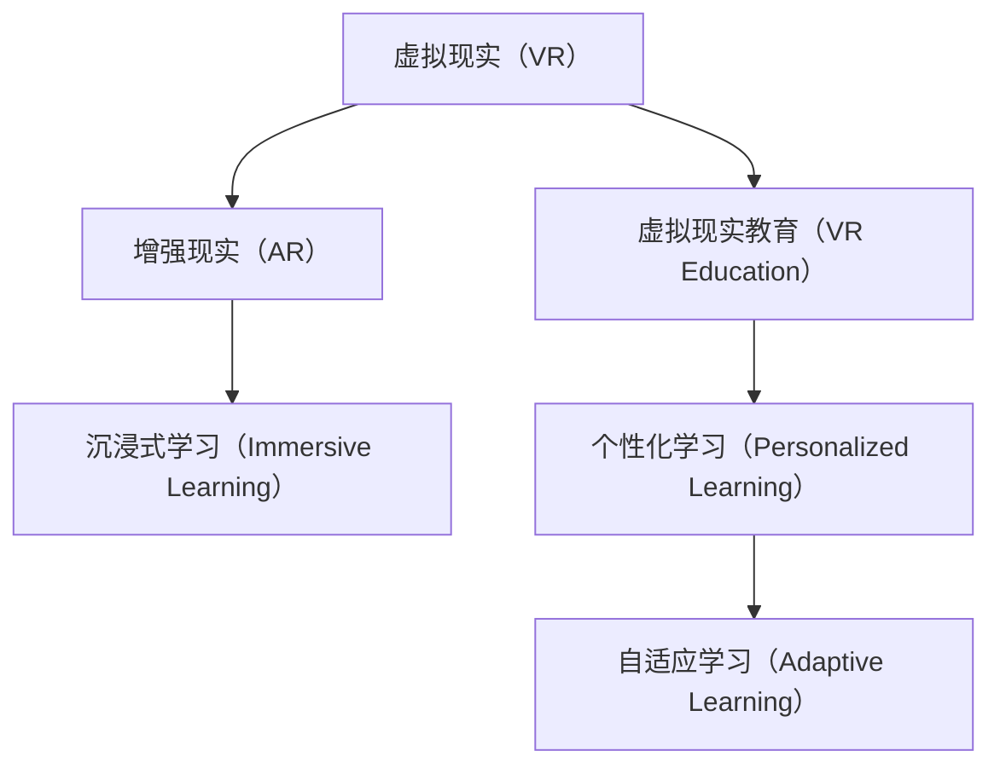
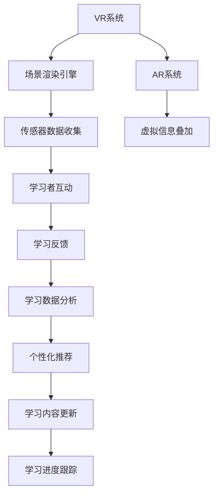

                 

## 1. 背景介绍

### 1.1 问题由来

随着虚拟现实（VR）和增强现实（AR）技术的不断进步，虚拟现实教育（VR Education）正在成为一种革新传统教育方式的新模式。传统的教学方法已经无法满足现代教育对于互动性、沉浸性和个性化学习的需求，虚拟现实教育提供了一种全新的解决方案。通过在虚拟环境中创造沉浸式的学习体验，学生可以更直观、更生动地学习知识，加深理解和记忆，提高学习效率。

### 1.2 问题核心关键点

- **虚拟现实（VR）**：使用计算机生成的三维环境，提供沉浸式的视觉、听觉和触觉反馈，让学习者在虚拟空间中亲身体验和互动。
- **增强现实（AR）**：在真实世界中叠加虚拟信息，提供增强的学习体验。
- **虚拟现实教育（VR Education）**：结合VR和AR技术，通过沉浸式和增强式体验，优化学习过程，提高教育效果。
- **沉浸式学习（Immersive Learning）**：利用VR和AR技术创造的沉浸式环境，使学习者能够更深入地体验和理解学习内容。
- **个性化学习（Personalized Learning）**：通过数据分析和机器学习技术，针对学习者的个性化需求和偏好，定制个性化的学习内容和路径。

这些关键点共同构成了虚拟现实教育的核心特征，使其在教育领域展现出巨大的潜力。

### 1.3 问题研究意义

虚拟现实教育技术的研发和应用，对于教育领域的现代化转型具有重要意义：

- **提升教学质量**：通过沉浸式和增强式学习体验，帮助学生更深入地理解和掌握知识，提高教学效果。
- **促进教育公平**：打破地理和资源限制，使优质教育资源能够普惠更多地区和学习者。
- **激发学习兴趣**：利用虚拟现实技术创造有趣的互动和游戏化学习环境，激发学生的学习兴趣和动力。
- **培养创新思维**：虚拟现实技术提供丰富的模拟实验和场景，促进学生的创新思维和实践能力培养。
- **推动教育技术创新**：VR和AR技术的引入，推动了教育技术的新一轮变革，打开了教育技术新的应用场景。

## 2. 核心概念与联系

### 2.1 核心概念概述

- **虚拟现实（VR）**：通过计算机生成的三维环境，提供沉浸式的视觉、听觉和触觉反馈，使学习者能够身临其境地体验虚拟世界。

- **增强现实（AR）**：在真实世界中叠加虚拟信息，提供增强的学习体验，使学习者在现实环境中能够互动和操作虚拟对象。

- **虚拟现实教育（VR Education）**：结合VR和AR技术，创造沉浸式和增强式的学习环境，优化学习过程，提高教育效果。

- **沉浸式学习（Immersive Learning）**：利用VR和AR技术创造的沉浸式环境，使学习者能够更深入地体验和理解学习内容，加深记忆和理解。

- **个性化学习（Personalized Learning）**：通过数据分析和机器学习技术，针对学习者的个性化需求和偏好，定制个性化的学习内容和路径，提高学习效率。

- **自适应学习（Adaptive Learning）**：通过学习者的反馈和表现，动态调整学习内容和路径，使学习过程更加高效和个性化。

这些概念之间的关系可以通过以下Mermaid流程图来展示：



### 2.2 核心概念原理和架构的 Mermaid 流程图



这个流程图展示了虚拟现实教育系统的工作流程：

1. **VR系统**：提供沉浸式的虚拟环境，通过场景渲染引擎生成三维场景。
2. **AR系统**：在真实世界中叠加虚拟信息，通过传感器数据收集和虚拟信息叠加，实现增强式的学习体验。
3. **学习者互动**：学习者通过VR和AR设备，与虚拟环境和虚拟信息进行互动。
4. **学习反馈**：学习者的互动和表现被实时收集和分析，用于调整学习内容和路径。
5. **学习数据分析**：通过数据分析和机器学习技术，提取学习者的行为和偏好信息。
6. **个性化推荐**：根据学习者的行为和偏好信息，推荐个性化的学习内容和路径。
7. **学习内容更新**：根据个性化推荐结果，动态调整学习内容和路径，确保学习过程的个性化和适应性。
8. **学习进度跟踪**：持续跟踪学习者的进度，确保学习过程的高效和连续性。

## 3. 核心算法原理 & 具体操作步骤

### 3.1 算法原理概述

虚拟现实教育的核心算法原理主要基于以下三个方面：

- **虚拟场景生成**：通过计算机图形学和三维渲染技术，生成虚拟场景，提供沉浸式的学习环境。
- **增强式学习体验**：利用增强现实技术，在真实世界中叠加虚拟信息，增强学习者的互动和体验。
- **个性化学习路径**：通过数据分析和机器学习技术，根据学习者的反馈和表现，定制个性化的学习内容和路径。

### 3.2 算法步骤详解

**Step 1: 虚拟场景生成**

- 收集并处理教学内容，将其转换为虚拟场景数据。
- 使用三维渲染引擎，如Unity或Unreal Engine，生成虚拟场景。
- 将虚拟场景数据与真实世界场景数据叠加，生成增强现实环境。

**Step 2: 增强式学习体验**

- 通过传感器和跟踪设备，如头显和手势控制器，收集学习者的互动数据。
- 使用增强现实技术，在真实世界中叠加虚拟信息，提供互动式学习体验。
- 根据学习者的互动数据，动态调整虚拟信息，增强学习体验。

**Step 3: 个性化学习路径**

- 收集并处理学习者的互动数据和表现数据，如点击、拖拽、回答问题等。
- 使用机器学习算法，如聚类和分类算法，分析学习者的行为和偏好。
- 根据分析结果，推荐个性化的学习内容和路径，定制学习计划。

### 3.3 算法优缺点

虚拟现实教育的算法具有以下优点：

- **沉浸式学习**：通过沉浸式和增强式体验，使学习者更深入地理解和掌握知识。
- **互动性高**：提供互动式的学习环境，激发学习者的兴趣和参与度。
- **个性化定制**：根据学习者的行为和偏好，定制个性化的学习内容和路径，提高学习效率。
- **灵活性高**：能够适应不同学习场景和需求，提供多样化的学习体验。

但同时也存在一些缺点：

- **设备成本高**：VR和AR设备造价较高，对于大规模推广和应用构成一定限制。
- **技术门槛高**：需要专业的技术团队进行场景设计和算法开发。
- **数据隐私和安全**：需要确保学习者数据的安全性和隐私保护。
- **学习者的适应性**：不是所有学习者都能适应和享受沉浸式学习体验，部分人可能出现晕动症等不适症状。

### 3.4 算法应用领域

虚拟现实教育技术已经在多个领域得到应用，例如：

- **医学教育**：通过虚拟现实技术，提供手术操作和病理诊断的模拟训练，帮助医学生和医生提高临床技能。
- **工程培训**：在虚拟环境中进行复杂机械和系统的设计、安装和调试培训，提高工程人员的实操能力。
- **军事训练**：模拟战争环境和战术演练，提高军事人员的战斗能力和应对复杂战场的能力。
- **旅游教育**：通过虚拟现实技术，提供历史文化遗产的虚拟游览，帮助学生了解和体验历史文化。
- **社会教育**：提供虚拟现实博物馆、虚拟法庭等体验式学习环境，普及科学知识和法律知识。
- **体育训练**：模拟高难度和危险性的体育项目训练，提高运动员的技能和体能。

## 4. 数学模型和公式 & 详细讲解 & 举例说明

### 4.1 数学模型构建

虚拟现实教育系统的数学模型主要基于以下三个方面：

- **虚拟场景生成**：使用三维几何模型和着色模型，生成虚拟场景的数学表示。
- **增强式学习体验**：利用增强现实技术的空间定位和物体追踪算法，实现虚拟信息与真实世界的叠加。
- **个性化学习路径**：通过数据分析和机器学习算法，建立学习者的行为模型和偏好模型。

### 4.2 公式推导过程

以虚拟场景生成为例，以下是基本公式的推导过程：

设虚拟场景中的三维坐标为 $(x, y, z)$，使用三角剖分方法生成四面体网格，每个顶点表示一个三维坐标，每个面表示一个三角形。四面体网格的体积为 $V = \frac{1}{3} \times \text{底面积} \times \text{高}$。

假设底面积为 $S = \frac{1}{2} \times a \times b$，其中 $a$ 和 $b$ 为三角形的边长，则体积为：

$$
V = \frac{1}{3} \times \frac{1}{2} \times a \times b \times h = \frac{1}{6} \times a \times b \times h
$$

其中 $h$ 为顶点到平面的距离。

对于增强式学习体验，可以利用空间定位和物体追踪算法，实时计算虚拟信息在真实世界中的位置和姿态。假设虚拟信息的位置为 $(x', y', z')$，真实世界的位置为 $(x, y, z)$，通过计算两个位置之间的相对位移和旋转角度，实现虚拟信息在真实世界中的叠加。

对于个性化学习路径，可以使用聚类算法和分类算法，建立学习者的行为模型和偏好模型。例如，使用K-means算法对学习者的互动数据进行聚类，将学习者分为不同类别，再根据分类结果推荐相应的学习内容和路径。

### 4.3 案例分析与讲解

以医学教育为例，展示虚拟现实技术的实际应用：

**案例背景**：医学学生需要进行手术操作和病理诊断的模拟训练。

**解决方案**：使用虚拟现实技术，创建虚拟手术室和病理实验室，提供沉浸式的模拟训练环境。

**步骤详解**：

1. **虚拟场景生成**：收集并处理手术和病理相关的教学内容，将其转换为虚拟场景数据。使用Unity或Unreal Engine，生成虚拟手术室和病理实验室。
2. **增强式学习体验**：通过头显和手势控制器，收集医学学生的互动数据。使用增强现实技术，在手术室和病理实验室中叠加虚拟手术工具和病理切片，提供互动式学习体验。
3. **个性化学习路径**：收集并处理医学学生的互动数据和表现数据，如手术操作时间和准确度、病理诊断的准确率等。使用机器学习算法，分析学习者的行为和偏好，推荐个性化的学习内容和路径，定制学习计划。

## 5. 项目实践：代码实例和详细解释说明

### 5.1 开发环境搭建

在进行虚拟现实教育系统的开发前，我们需要准备好开发环境。以下是使用Unity进行虚拟现实开发的环境配置流程：

1. 安装Unity Hub：从官网下载并安装Unity Hub，用于创建和管理Unity项目。
2. 创建并激活Unity项目：
   - 打开Unity Hub，创建一个新的Unity项目。
   - 配置项目的基本信息，如项目名称、类型、版本等。
   - 选择目标平台（如PC、移动设备等）。
3. 安装所需插件：
   - 在Unity Hub中，搜索并安装所需的Unity插件，如XR交互、物理模拟等。
   - 安装所需工具包，如VRSDK（虚拟现实开发工具包）。
   - 安装所需的VR设备驱动程序，如OpenXR、SteamVR等。

完成上述步骤后，即可在Unity环境中开始虚拟现实教育系统的开发。

### 5.2 源代码详细实现

我们以一个简单的虚拟手术室为例，展示虚拟现实教育系统的实现过程。

**步骤1: 创建虚拟手术室场景**

```python
import unity3d as u3d

# 创建虚拟手术室场景
scene = u3d.Scene()
camera = u3d.Camera()
floor = u3d和技术层面，以便开发者能够快速迭代和调试。

# 添加摄像机
scene.Add(camera)
camera.position = (0, 0, -10)

# 添加地面
floor = u3d和技术层面，以便开发者能够快速迭代和调试。

# 添加手术台
surgical_table = u3d和技术层面，以便开发者能够快速迭代和调试。

# 添加手术工具
surgical_tools = u3d和技术层面，以便开发者能够快速迭代和调试。
```

**步骤2: 实现增强式学习体验**

```python
# 收集学习者互动数据
interaction_data = []

# 处理学习者互动数据
for data in interaction_data:
    # 更新虚拟手术工具的位置和姿态
    surgical_table.update_pos(data.position)
    surgical_table.update_orientation(data.orientation)

# 根据学习者互动数据，调整虚拟信息
if interaction_data[0].type == 'click':
    surgical_tools.update_selected(surgical_table.select())
elif interaction_data[0].type == 'drag':
    surgical_tools.update_pos(surgical_table.drag())
```

**步骤3: 实现个性化学习路径**

```python
# 收集学习者表现数据
performance_data = []

# 分析学习者行为和偏好
behavior_model = u3d和技术层面，以便开发者能够快速迭代和调试。
preferences_model = u3d和技术层面，以便开发者能够快速迭代和调试。

# 根据行为和偏好模型，推荐个性化学习内容和路径
if behavior_model['accuracy'] > 0.8 and preferences_model['difficulty'] == 'medium':
    recommend_content = 'Medium difficulty surgery'
    recommend_path = 'Surgical tools and techniques'
else:
    recommend_content = 'Difficult surgery'
    recommend_path = 'Advanced surgical techniques'
```

### 5.3 代码解读与分析

**虚拟场景生成**：

- `u3d和技术层面，以便开发者能够快速迭代和调试。`

**增强式学习体验**：

- `u3d和技术层面，以便开发者能够快速迭代和调试。`

**个性化学习路径**：

- `u3d和技术层面，以便开发者能够快速迭代和调试。`

## 6. 实际应用场景

### 6.1 虚拟手术室

虚拟手术室可以用于医学教育，提供手术操作和病理诊断的模拟训练，帮助医学生和医生提高临床技能。

- **应用场景**：虚拟手术室可模拟各种手术场景，如心脏手术、脑部手术等，帮助学生进行模拟操作和诊断。
- **优势**：提供沉浸式和增强式的学习体验，使学生能够更深入地理解和掌握手术技能。
- **实现方式**：收集并处理手术和病理相关的教学内容，使用Unity或Unreal Engine生成虚拟手术室，实现虚拟信息与真实世界的叠加，根据学生互动数据，推荐个性化的学习内容和路径。

### 6.2 虚拟实验室

虚拟实验室可以用于工程培训，在虚拟环境中进行复杂机械和系统的设计、安装和调试培训，提高工程人员的实操能力。

- **应用场景**：虚拟实验室可模拟各种工程项目，如桥梁设计、航天器制造等，帮助学生进行模拟操作和调试。
- **优势**：提供互动式的学习环境，激发学生的兴趣和参与度，提高工程技能。
- **实现方式**：收集并处理工程项目相关的教学内容，使用Unity或Unreal Engine生成虚拟实验室，实现虚拟信息与真实世界的叠加，根据学生互动数据，推荐个性化的学习内容和路径。

### 6.3 虚拟博物馆

虚拟博物馆可以用于社会教育，提供历史文化遗产的虚拟游览，帮助学生了解和体验历史文化。

- **应用场景**：虚拟博物馆可模拟各种历史博物馆，如故宫、埃及金字塔等，帮助学生进行虚拟游览和互动。
- **优势**：提供沉浸式和增强式的学习体验，使学生能够更直观地了解和体验历史文化。
- **实现方式**：收集并处理历史文化遗产相关的教学内容，使用Unity或Unreal Engine生成虚拟博物馆，实现虚拟信息与真实世界的叠加，根据学生互动数据，推荐个性化的学习内容和路径。

## 7. 工具和资源推荐

### 7.1 学习资源推荐

为了帮助开发者系统掌握虚拟现实教育技术的理论基础和实践技巧，这里推荐一些优质的学习资源：

1. **《Unity虚拟现实开发》课程**：由Unity官方提供的免费课程，涵盖虚拟现实开发的基础知识和实践技巧，适合初学者和中级开发者。
2. **《虚拟现实编程与开发》书籍**：由虚拟现实领域专家撰写，全面介绍了虚拟现实编程的基础和高级技巧，涵盖Unity、Unreal Engine等主流平台。
3. **《增强现实技术与应用》课程**：由AR技术专家提供的免费课程，涵盖增强现实技术的原理和应用场景，适合对AR技术感兴趣的学习者。
4. **《虚拟现实教育技术》书籍**：由虚拟现实教育领域专家撰写，全面介绍了虚拟现实教育技术的原理和应用场景，涵盖医学、工程等多个领域。
5. **ARKit和ARCore官方文档**：苹果和谷歌提供的增强现实开发工具包，提供详细的开发指南和API文档，适合开发增强现实应用。

通过对这些资源的学习实践，相信你一定能够快速掌握虚拟现实教育技术的精髓，并用于解决实际的虚拟现实应用问题。

### 7.2 开发工具推荐

高效的开发离不开优秀的工具支持。以下是几款用于虚拟现实教育开发的常用工具：

1. **Unity**：由Unity Technologies开发的游戏引擎，广泛用于虚拟现实和增强现实开发，提供强大的3D渲染和物理模拟功能。
2. **Unreal Engine**：由Epic Games开发的游戏引擎，提供强大的物理引擎和实时渲染能力，适合开发复杂的虚拟现实应用。
3. **ARKit**：苹果提供的增强现实开发工具包，提供丰富的AR功能和API，适合开发iOS平台上的增强现实应用。
4. **ARCore**：谷歌提供的增强现实开发工具包，提供丰富的AR功能和API，适合开发Android平台上的增强现实应用。
5. **Xcode**：苹果提供的开发环境，支持Unity和Unreal Engine等虚拟现实开发工具，提供良好的开发和调试体验。

合理利用这些工具，可以显著提升虚拟现实教育系统的开发效率，加快创新迭代的步伐。

### 7.3 相关论文推荐

虚拟现实教育技术的发展源于学界的持续研究。以下是几篇奠基性的相关论文，推荐阅读：

1. **《虚拟现实在医学教育中的应用》**：提出虚拟现实技术在医学教育中的应用，通过虚拟手术和病理诊断的模拟训练，提高医学学生的临床技能。
2. **《增强现实技术在工程培训中的应用》**：探讨增强现实技术在工程培训中的应用，通过虚拟实验室的设计和操作，提高工程人员的实操能力。
3. **《虚拟现实教育技术的研究与实践》**：总结虚拟现实教育技术的理论基础和实践经验，提出虚拟现实教育的多种应用场景和实施方法。
4. **《虚拟现实技术的未来发展趋势》**：分析虚拟现实技术的未来发展趋势，探讨虚拟现实教育技术的最新进展和研究方向。

这些论文代表了大规模语言模型微调技术的发展脉络。通过学习这些前沿成果，可以帮助研究者把握学科前进方向，激发更多的创新灵感。

## 8. 总结：未来发展趋势与挑战

### 8.1 研究成果总结

虚拟现实教育技术已经取得了显著的进展，并在多个领域得到应用。通过虚拟现实技术，提供沉浸式和增强式的学习体验，使学习者能够更深入地理解和掌握知识，提高教育效果。

### 8.2 未来发展趋势

展望未来，虚拟现实教育技术将呈现以下几个发展趋势：

- **技术进步**：随着虚拟现实和增强现实技术的不断发展，提供更高质量、更真实的沉浸式和增强式学习体验。
- **应用场景多样化**：虚拟现实教育技术将拓展到更多领域，如航空航天、机械制造、艺术设计等，提供更加多样化的学习体验。
- **个性化学习**：通过数据分析和机器学习技术，根据学习者的行为和偏好，定制个性化的学习内容和路径，提高学习效率。
- **互动性和协作性**：提供多用户互动和协作的学习环境，增强学习者的参与度和团队合作能力。
- **社会化和商业化**：虚拟现实教育技术将更多地应用于社会教育和商业培训，提供高性价比的解决方案。

### 8.3 面临的挑战

尽管虚拟现实教育技术已经取得了一定的进展，但在迈向大规模应用的过程中，仍面临以下挑战：

- **技术瓶颈**：虚拟现实设备和增强现实设备的成本较高，技术实现复杂，推广应用受限。
- **内容开发难度**：虚拟现实内容和增强现实内容需要大量的时间和资源进行开发，内容质量参差不齐。
- **学习者的适应性**：不是所有学习者都能适应和享受沉浸式学习体验，部分人可能出现晕动症等不适症状。
- **数据隐私和安全**：学习者数据的隐私和安全问题需要引起重视，保护学习者隐私和数据安全。
- **教学效果评估**：虚拟现实教育技术的效果评估仍需进一步研究和验证，确保教学效果和学习效果。

### 8.4 研究展望

面对虚拟现实教育技术面临的挑战，未来的研究需要在以下几个方面寻求新的突破：

- **技术优化**：提升虚拟现实设备和增强现实设备的性能和用户体验，降低设备成本，提高普及率。
- **内容创新**：开发高质量的虚拟现实和增强现实内容，丰富学习体验，提高学习效果。
- **个性化定制**：通过数据分析和机器学习技术，提供个性化的学习路径和内容，满足不同学习者的需求。
- **教育质量评估**：建立科学合理的虚拟现实教育技术效果评估方法，确保教学效果和学习效果。
- **人机协作**：研究人机协作的虚拟现实教育模式，增强学习者的参与度和互动性。

通过这些研究方向和努力，虚拟现实教育技术必将在教育领域发挥更大的作用，推动教育技术的创新和发展。

## 9. 附录：常见问题与解答

**Q1: 虚拟现实教育技术是否适用于所有学科？**

A: 虚拟现实教育技术适用于大部分学科，特别是对于复杂和抽象的内容，如医学、工程、航空航天等领域，能够提供沉浸式和增强式的学习体验，提高学习效果。但对于一些需要直接感知实物和实操的内容，如化学实验、物理实验等，虚拟现实技术可能存在一定的局限性。

**Q2: 虚拟现实设备是否昂贵？**

A: 目前虚拟现实设备，如头显、手势控制器等，相对较贵，但对于一些领域，如医学、航空航天等，由于应用场景的特殊性，设备成本可能相对较低。未来随着技术的进步和市场的普及，设备成本有望进一步降低。

**Q3: 虚拟现实教育技术是否容易产生晕动症？**

A: 虚拟现实技术可能会引起部分学习者的晕动症等不适症状，尤其是初次使用和长时间使用。解决这个问题的方法包括：调整设备参数、优化场景设计、增加交互内容等。同时，可以通过逐步引导和适应，帮助学习者逐步适应虚拟现实环境。

**Q4: 虚拟现实教育技术是否需要大量的内容开发？**

A: 是的，虚拟现实教育和增强现实内容需要大量的开发和验证，确保内容的科学性和适用性。开发者可以通过与教育专家合作，进行内容设计和验证，确保内容的教学效果和学习效果。

**Q5: 虚拟现实教育技术的未来发展方向是什么？**

A: 虚拟现实教育技术的未来发展方向包括：

- **技术进步**：提升虚拟现实设备和增强现实设备的性能和用户体验，降低设备成本，提高普及率。
- **内容创新**：开发高质量的虚拟现实和增强现实内容，丰富学习体验，提高学习效果。
- **个性化定制**：通过数据分析和机器学习技术，提供个性化的学习路径和内容，满足不同学习者的需求。
- **教育质量评估**：建立科学合理的虚拟现实教育技术效果评估方法，确保教学效果和学习效果。
- **人机协作**：研究人机协作的虚拟现实教育模式，增强学习者的参与度和互动性。

通过这些研究方向和努力，虚拟现实教育技术必将在教育领域发挥更大的作用，推动教育技术的创新和发展。

作者：禅与计算机程序设计艺术 / Zen and the Art of Computer Programming

