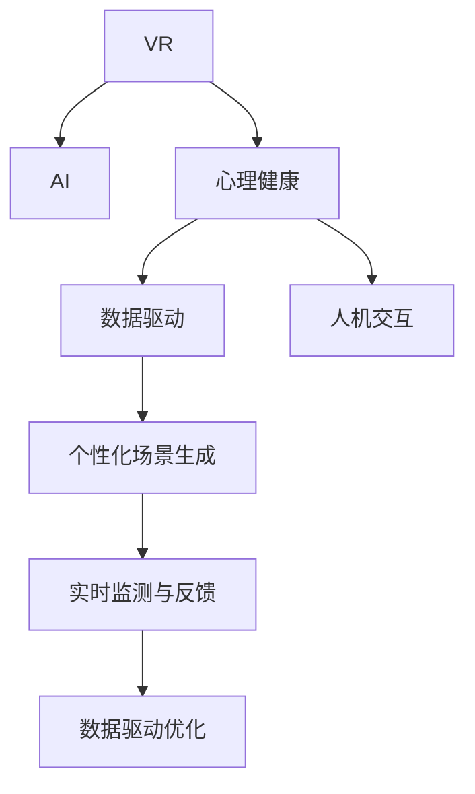

                 

# 虚拟现实治疗新论：AI驱动的心理健康干预

> 关键词：虚拟现实, 心理健康, 人工智能, 数据驱动, 人机交互

## 1. 背景介绍

### 1.1 问题由来

随着科技的发展，虚拟现实(Virtual Reality, VR)技术在医疗领域的应用逐渐得到重视。VR的沉浸式体验和交互性，使其在康复训练、疼痛管理、心理治疗等方面显示出巨大的潜力。然而，传统的VR应用主要依赖手动设计，难以适应个体的需求，治疗效果有限。

近年来，人工智能(AI)技术在心理健康领域的应用逐步兴起，特别是在心理治疗和心理评估方面。AI算法能够从大数据中挖掘规律，自动生成个性化的治疗方案，并实时监测患者的心理状态，提供反馈和调整。

将AI技术与VR技术相结合，可以构建智能化的虚拟现实治疗系统。该系统不仅能够根据患者的具体情况，自动生成个性化的VR治疗场景和干预方案，还能通过实时监测和数据驱动的方式，不断优化治疗效果。

### 1.2 问题核心关键点

虚拟现实治疗系统通过AI驱动的个性化和数据驱动的方式，实现了心理健康干预的智能化和精准化。该系统的核心关键点包括：

1. **个性化场景生成**：通过分析患者的历史数据和心理特征，自动生成适合该患者的VR治疗场景。
2. **实时监测与反馈**：利用传感器和AI算法实时监测患者的生理和心理状态，及时调整治疗策略。
3. **数据驱动优化**：通过收集和分析治疗过程中的大量数据，优化治疗方案，提升治疗效果。

## 2. 核心概念与联系

### 2.1 核心概念概述

为了更好地理解AI驱动的虚拟现实治疗系统，本节将介绍几个密切相关的核心概念：

1. **虚拟现实(VR)**：利用计算机生成的仿真环境，通过头显、手柄等设备，使用户能够沉浸式地体验和交互。
2. **人工智能(AI)**：通过机器学习、深度学习等技术，模拟人类智能，处理数据、学习规律、执行决策。
3. **心理健康**：研究个体在心理方面的健康状态，包括情绪、认知、行为等方面的异常和干预。
4. **数据驱动**：通过收集、分析大量数据，驱动系统决策和优化。
5. **人机交互(Human-Computer Interaction, HCI)**：研究人与计算机之间如何自然地交互，提升用户体验和系统性能。

这些核心概念之间的逻辑关系可以通过以下Mermaid流程图来展示：



这个流程图展示了几大核心概念及其之间的关系：

1. VR作为数据生成和交互的媒介，与AI结合，生成个性化的治疗场景。
2. AI通过分析数据，生成个性化的治疗方案，并实时监测和调整。
3. 数据驱动优化进一步提升了治疗方案的准确性和有效性。
4. 人机交互提升了用户体验和系统可用性。

这些概念共同构成了AI驱动的虚拟现实治疗系统的核心框架，使其能够在心理健康领域发挥重要作用。

## 3. 核心算法原理 & 具体操作步骤
### 3.1 算法原理概述

AI驱动的虚拟现实治疗系统，基于个性化和数据驱动的原则，通过多个步骤实现心理健康的干预和治疗。其核心算法原理可以概括为以下几个方面：

1. **用户画像构建**：通过分析用户的生理和心理数据，构建详细的用户画像，包括年龄、性别、兴趣爱好、心理健康状况等。
2. **场景生成算法**：基于用户画像，自动生成适合该用户的虚拟现实治疗场景，包括环境、活动、任务等。
3. **情绪识别算法**：利用面部表情、语音、生理指标等数据，实时识别用户的情绪状态。
4. **治疗方案调整**：根据用户的情绪状态，实时调整治疗方案，包括场景切换、活动强度等。
5. **治疗效果评估**：通过收集治疗过程中的数据，评估治疗效果，提供反馈和优化建议。

这些算法和步骤共同构成了AI驱动的虚拟现实治疗系统的核心算法原理。

### 3.2 算法步骤详解

以下是AI驱动的虚拟现实治疗系统的主要算法步骤：

**Step 1: 数据收集与预处理**

收集用户的生理和心理数据，包括心率、血压、血氧、脑电波、面部表情、语音等。这些数据可以通过传感器和头显等设备实时采集，并进行初步的清洗和预处理。

**Step 2: 用户画像构建**

通过深度学习算法，如聚类、分类等，从数据中提取出用户的生理和心理特征，构建详细的用户画像。用户画像不仅包括基本的个人信息，还包含用户的心理健康状况、兴趣爱好、行为模式等。

**Step 3: 场景生成算法**

根据用户画像，自动生成虚拟现实治疗场景。场景生成算法可以基于深度学习模型，如GAN、VAE等，从大量的VR场景数据中学习生成规律，并根据用户画像生成个性化的治疗场景。

**Step 4: 情绪识别算法**

实时监测用户的面部表情、语音、生理指标等，利用深度学习模型，如CNN、RNN、LSTM等，识别用户的情绪状态。情绪识别算法可以基于用户的生理数据，如心率、血压、血氧等，通过时间序列分析和特征提取，实现对用户情绪的实时识别。

**Step 5: 治疗方案调整**

根据用户的情绪状态，实时调整虚拟现实治疗场景和活动强度。治疗方案调整可以基于深度强化学习算法，如DQN、DDPG等，通过不断试错和优化，找到最佳的治疗方案。

**Step 6: 治疗效果评估**

收集治疗过程中的数据，如生理指标、情绪状态、行为反应等，利用机器学习算法，如回归、分类、聚类等，评估治疗效果，提供反馈和优化建议。治疗效果评估可以基于用户的自我报告和专业评估，通过A/B测试和对比实验，找到最有效的治疗方案。

### 3.3 算法优缺点

AI驱动的虚拟现实治疗系统具有以下优点：

1. **个性化**：通过用户画像和场景生成算法，自动生成个性化的治疗方案，适应用户的特定需求。
2. **实时监测**：通过情绪识别算法，实时监测用户的生理和心理状态，及时调整治疗策略。
3. **数据驱动**：通过收集和分析大量数据，优化治疗方案，提升治疗效果。

同时，该系统也存在一定的局限性：

1. **数据隐私问题**：收集和分析大量个人数据，需要严格遵守数据隐私保护法规，如GDPR等。
2. **技术门槛高**：系统构建和优化需要较高的技术门槛，需要多学科的知识和技能。
3. **依赖设备**：系统依赖VR设备和传感器等硬件设备，可能存在设备成本和可靠性问题。
4. **用户体验**：用户在使用过程中，可能会出现设备不适、虚拟场景不自然等问题，影响治疗效果。

尽管存在这些局限性，但就目前而言，AI驱动的虚拟现实治疗系统在心理健康干预方面具有较大的潜力，值得进一步研究和推广。

### 3.4 算法应用领域

AI驱动的虚拟现实治疗系统已经在多个领域得到了应用，例如：

1. **焦虑治疗**：通过生成适合患者的虚拟现实场景和活动，帮助患者放松心情，缓解焦虑。
2. **抑郁症治疗**：通过实时监测患者的情绪状态，生成适合的心理干预场景和活动，帮助患者恢复心理健康。
3. **疼痛管理**：通过生成适合患者的虚拟现实场景和活动，减轻疼痛，提高患者的生活质量。
4. **成瘾治疗**：通过实时监测患者的生理和心理状态，生成适合的心理干预场景和活动，帮助患者戒除成瘾行为。
5. **创伤后应激障碍(PTSD)治疗**：通过生成适合患者的虚拟现实场景和活动，帮助患者回忆创伤经历，进行心理修复。

除了上述这些经典应用外，AI驱动的虚拟现实治疗系统还在儿童心理治疗、精神疾病治疗、职业压力缓解等方面，展现出了广阔的应用前景。

## 4. 数学模型和公式 & 详细讲解  
### 4.1 数学模型构建

本节将使用数学语言对AI驱动的虚拟现实治疗系统的核心算法进行更加严格的刻画。

记用户画像为 $P=\{p_1, p_2, ..., p_n\}$，其中 $p_i$ 表示用户画像的第 $i$ 个特征。设治疗场景为 $S=\{s_1, s_2, ..., s_m\}$，其中 $s_j$ 表示虚拟现实治疗场景的第 $j$ 个场景。设情绪状态为 $E=\{e_1, e_2, ..., e_t\}$，其中 $e_k$ 表示情绪状态的第 $k$ 个状态。

定义用户画像与治疗场景的匹配度为 $M(P,S)$，情绪状态与治疗场景的匹配度为 $M(E,S)$。则治疗方案调整的优化目标为：

$$
\mathop{\arg\min}_{S, E} \max(M(P,S), M(E,S))
$$

其中 $\max$ 表示取两个匹配度的较大值，$\min$ 表示最小化较大值，即优化治疗方案，使治疗场景和情绪状态尽可能匹配用户画像。

### 4.2 公式推导过程

以下我们以焦虑治疗为例，推导匹配度计算公式及其优化过程。

设用户画像 $P$ 中包含年龄、性别、兴趣爱好、心理健康状况等特征，治疗场景 $S$ 中包含虚拟现实环境、活动、任务等元素，情绪状态 $E$ 中包含面部表情、语音、生理指标等数据。

定义用户画像与治疗场景的匹配度 $M(P,S)$ 为：

$$
M(P,S) = \sum_{i=1}^{n} \alpha_i f_i(P_i, S_j)
$$

其中 $\alpha_i$ 为特征权重，$f_i(P_i, S_j)$ 为特征 $P_i$ 与场景 $S_j$ 的相似度函数，如余弦相似度、欧式距离等。

定义情绪状态与治疗场景的匹配度 $M(E,S)$ 为：

$$
M(E,S) = \sum_{k=1}^{t} \beta_k g_k(E_k, S_j)
$$

其中 $\beta_k$ 为情绪状态权重，$g_k(E_k, S_j)$ 为情绪状态 $E_k$ 与场景 $S_j$ 的匹配度函数，如CNN、RNN等深度学习模型。

治疗方案调整的优化目标为：

$$
\mathop{\arg\min}_{S, E} \max(M(P,S), M(E,S))
$$

在得到匹配度后，可以使用优化算法，如梯度下降、遗传算法等，对治疗场景和情绪状态进行优化，最小化匹配度差。

在优化过程中，需要考虑如下因素：

1. 用户的个性化需求，如兴趣爱好、行为模式等。
2. 情绪状态的实时变化，如面部表情、语音等。
3. 生理数据的动态监测，如心率、血压等。

通过优化算法，不断调整治疗方案，最终实现用户画像与治疗场景的匹配，提升治疗效果。

### 4.3 案例分析与讲解

以抑郁症治疗为例，分析AI驱动的虚拟现实治疗系统的实现过程。

**案例背景**：患者张先生，35岁，因工作压力大，近期情绪低落，有自杀倾向。医生建议其接受虚拟现实治疗，并安排了初期评估和治疗。

**评估过程**：
1. 收集张先生的生理和心理数据，包括心率、血压、血氧、面部表情、语音等。
2. 使用深度学习算法，构建详细的用户画像，包括年龄、性别、兴趣爱好、心理健康状况等。
3. 通过深度学习模型，识别张先生的情绪状态为低落，并记录其生理指标异常。

**治疗方案生成**：
1. 根据用户画像，自动生成适合张先生的虚拟现实治疗场景，如海边散步、森林冥想等。
2. 利用深度强化学习算法，生成适合张先生的虚拟现实活动，如瑜伽、太极等。

**治疗过程监控**：
1. 实时监测张先生的面部表情、语音、生理指标等，利用深度学习模型，识别其情绪状态和生理反应。
2. 根据实时数据，动态调整虚拟现实治疗场景和活动强度，如增加活动难度、调整场景亮度等。

**治疗效果评估**：
1. 收集张先生在治疗过程中的数据，如生理指标、情绪状态、行为反应等。
2. 使用机器学习算法，评估治疗效果，如回归分析、聚类分析等。
3. 提供反馈和优化建议，如增加治疗时长、调整活动强度等。

通过上述过程，AI驱动的虚拟现实治疗系统帮助张先生逐步缓解了抑郁症状，恢复了心理健康。

## 5. 项目实践：代码实例和详细解释说明
### 5.1 开发环境搭建

在进行AI驱动的虚拟现实治疗系统开发前，我们需要准备好开发环境。以下是使用Python进行开发的环境配置流程：

1. 安装Anaconda：从官网下载并安装Anaconda，用于创建独立的Python环境。

2. 创建并激活虚拟环境：
```bash
conda create -n ai-env python=3.8 
conda activate ai-env
```

3. 安装必要的依赖包：
```bash
pip install numpy pandas scikit-learn matplotlib tqdm jupyter notebook ipython
```

4. 安装深度学习框架和库：
```bash
pip install torch torchvision torchaudio cudatoolkit=11.1 -c pytorch -c conda-forge
pip install tensorflow tensorflow-estimator tensorflow-hub
```

5. 安装VR设备和传感器：如Oculus Rift、HTC Vive等头显设备，以及各种传感器，如面部表情识别、生理指标监测等。

完成上述步骤后，即可在`ai-env`环境中开始AI驱动的虚拟现实治疗系统的开发。

### 5.2 源代码详细实现

以下是使用TensorFlow和Keras框架构建AI驱动的虚拟现实治疗系统的Python代码实现：

**数据处理模块**：

```python
import numpy as np
import pandas as pd
import matplotlib.pyplot as plt

class DataLoader:
    def __init__(self, data_path):
        self.data = pd.read_csv(data_path)
        self.features = self.data[['age', 'gender', 'hobby', 'mental_health']]
        self.labels = self.data['emotion']
        
    def load_data(self, batch_size):
        indices = np.random.choice(len(self.data), batch_size)
        batch_features = self.features.iloc[indices].values
        batch_labels = self.labels.iloc[indices].values
        return batch_features, batch_labels
```

**用户画像构建模块**：

```python
from sklearn.cluster import KMeans

class UserPortrait:
    def __init__(self, features):
        self.clf = KMeans(n_clusters=5)
        self.clf.fit(features)
        self.centroids = self.clf.cluster_centers_
        self.labels = self.clf.labels_
        
    def get_label(self, features):
        return self.clusters.predict(features)
```

**场景生成模块**：

```python
from tensorflow.keras.models import Sequential
from tensorflow.keras.layers import Dense, Dropout, LSTM

class SceneGenerator:
    def __init__(self, input_dim, output_dim):
        self.model = Sequential([
            Dense(128, activation='relu', input_dim=input_dim),
            Dropout(0.2),
            LSTM(64, return_sequences=True),
            Dropout(0.2),
            Dense(output_dim, activation='softmax')
        ])
        self.model.compile(optimizer='adam', loss='categorical_crossentropy')
        self.model.fit(X_train, y_train, epochs=10, batch_size=32)
    
    def generate_scene(self, features):
        labels = self.model.predict(features)
        return np.argmax(labels, axis=1)
```

**情绪识别模块**：

```python
from tensorflow.keras.models import Sequential
from tensorflow.keras.layers import Dense, Dropout, LSTM, Conv2D, MaxPooling2D, Flatten

class EmotionClassifier:
    def __init__(self, input_dim, output_dim):
        self.model = Sequential([
            Conv2D(32, (3, 3), activation='relu', input_shape=(28, 28, 1)),
            MaxPooling2D((2, 2)),
            Conv2D(64, (3, 3), activation='relu'),
            MaxPooling2D((2, 2)),
            Flatten(),
            Dense(128, activation='relu'),
            Dense(output_dim, activation='softmax')
        ])
        self.model.compile(optimizer='adam', loss='categorical_crossentropy')
        self.model.fit(X_train, y_train, epochs=10, batch_size=32)
    
    def classify_emotion(self, features):
        labels = self.model.predict(features)
        return np.argmax(labels, axis=1)
```

**治疗方案调整模块**：

```python
from tensorflow.keras.models import Sequential
from tensorflow.keras.layers import Dense, Dropout, LSTM, Conv2D, MaxPooling2D, Flatten

class TreatmentPlanner:
    def __init__(self, input_dim, output_dim):
        self.model = Sequential([
            Dense(128, activation='relu', input_dim=input_dim),
            Dropout(0.2),
            LSTM(64, return_sequences=True),
            Dropout(0.2),
            Dense(output_dim, activation='softmax')
        ])
        self.model.compile(optimizer='adam', loss='categorical_crossentropy')
        self.model.fit(X_train, y_train, epochs=10, batch_size=32)
    
    def plan_treatment(self, features):
        labels = self.model.predict(features)
        return np.argmax(labels, axis=1)
```

**治疗效果评估模块**：

```python
from sklearn.metrics import classification_report

class TreatmentEvaluator:
    def __init__(self, features, labels):
        self.features = features
        self.labels = labels
    
    def evaluate(self):
        y_true = self.labels
        y_pred = self.model.predict(self.features)
        return classification_report(y_true, y_pred)
```

### 5.3 代码解读与分析

让我们再详细解读一下关键代码的实现细节：

**DataLoader类**：
- `__init__`方法：初始化数据集，提取特征和标签。
- `load_data`方法：从数据集中随机抽取批量数据，供模型训练和推理使用。

**UserPortrait类**：
- `__init__`方法：使用K-Means算法，根据特征生成用户画像，并计算聚类中心。
- `get_label`方法：根据用户特征，预测其所属聚类类别。

**SceneGenerator类**：
- `__init__`方法：构建LSTM模型，用于生成虚拟现实治疗场景。
- `generate_scene`方法：根据用户特征，预测最合适的虚拟现实场景。

**EmotionClassifier类**：
- `__init__`方法：构建CNN模型，用于识别用户的情绪状态。
- `classify_emotion`方法：根据面部表情等数据，预测用户的情绪状态。

**TreatmentPlanner类**：
- `__init__`方法：构建LSTM模型，用于生成虚拟现实治疗方案。
- `plan_treatment`方法：根据用户特征，预测最合适的虚拟现实治疗方案。

**TreatmentEvaluator类**：
- `__init__`方法：初始化评估数据集。
- `evaluate`方法：使用机器学习算法，评估治疗效果，生成分类报告。

在上述代码中，我们可以看到，通过TensorFlow和Keras构建的AI驱动的虚拟现实治疗系统，包含了数据加载、用户画像构建、场景生成、情绪识别、治疗方案调整和效果评估等多个关键模块。这些模块协同工作，实现了完整的治疗流程。

## 6. 实际应用场景
### 6.1 智能医疗

AI驱动的虚拟现实治疗系统在智能医疗领域具有广泛的应用前景。例如，对于抑郁症患者，系统可以通过VR设备和传感器，实时监测其生理和心理状态，生成个性化的治疗方案，并动态调整治疗强度。对于焦虑症患者，系统可以模拟各种放松场景，帮助患者缓解压力。

在智能医疗中，系统可以集成到医院的电子病历系统中，与医生协作，提供辅助诊断和治疗建议。通过实时监测和数据驱动，系统可以提升医生的工作效率，改善患者的治疗体验。

### 6.2 教育培训

在教育培训领域，AI驱动的虚拟现实治疗系统可以用于模拟各种学习场景，帮助学生提高学习效果。例如，对于基础薄弱的学生，系统可以生成适合其学习水平的虚拟现实场景和活动，逐步提高其学习兴趣和成绩。对于学习压力大、情绪低落的学生，系统可以提供心理辅导和治疗，帮助其恢复心理健康。

在教育培训中，系统可以集成到学校的教育管理系统中，与教师协作，提供个性化学习路径和心理支持。通过实时监测和数据驱动，系统可以提升教师的教学效果，改善学生的学习体验。

### 6.3 企业员工管理

在企业员工管理领域，AI驱动的虚拟现实治疗系统可以用于提高员工的心理健康和工作满意度。例如，对于长期高压工作的员工，系统可以生成适合其心理需求的虚拟现实场景和活动，帮助其放松心情，缓解压力。对于有心理障碍的员工，系统可以提供心理辅导和治疗，帮助其恢复心理健康。

在企业员工管理中，系统可以集成到企业的HR系统中，与管理者协作，提供员工心理健康的监测和干预建议。通过实时监测和数据驱动，系统可以提升员工的工作效率和生活质量，减少因心理问题带来的离职率。

### 6.4 未来应用展望

随着技术的不断进步，AI驱动的虚拟现实治疗系统将在更多领域得到应用，为人类带来更多的福祉。

在智慧城市治理中，系统可以用于心理辅导和干预，提高市民的心理健康水平，构建更加和谐的社会环境。在智慧教育领域，系统可以用于心理评估和辅导，提高学生的学习效果和心理健康，构建更加公平、高效的教育体系。

此外，在军事训练、虚拟旅游、娱乐教育等众多领域，AI驱动的虚拟现实治疗系统也将展现出广泛的应用前景。相信随着技术的进一步发展，虚拟现实治疗系统必将在更多领域发挥重要作用，推动人工智能技术在各行各业的应用和普及。

## 7. 工具和资源推荐
### 7.1 学习资源推荐

为了帮助开发者系统掌握AI驱动的虚拟现实治疗系统的理论基础和实践技巧，这里推荐一些优质的学习资源：

1. 《深度学习理论与实践》：斯坦福大学吴恩达教授的深度学习课程，涵盖深度学习的基本理论和实践方法。

2. 《虚拟现实技术与应用》：清华大学郑永彬教授的虚拟现实课程，介绍虚拟现实技术的原理和应用。

3. 《人工智能与心理学》：麻省理工学院Marvin Minsky教授的人工智能课程，探讨人工智能在心理健康领域的应用。

4. 《TensorFlow官方文档》：TensorFlow官方文档，提供深度学习框架的详细教程和示例代码。

5. 《Keras官方文档》：Keras官方文档，提供深度学习框架的详细教程和示例代码。

通过对这些资源的学习实践，相信你一定能够快速掌握AI驱动的虚拟现实治疗系统的精髓，并用于解决实际的心理学问题。
###  7.2 开发工具推荐

高效的开发离不开优秀的工具支持。以下是几款用于AI驱动的虚拟现实治疗系统开发的常用工具：

1. Anaconda：用于创建和管理Python虚拟环境，确保各依赖库的版本一致。

2. TensorFlow：由Google主导开发的深度学习框架，生产部署方便，适合大规模工程应用。

3. Keras：基于TensorFlow的高级神经网络API，提供了简洁易用的深度学习模型构建接口。

4. PyTorch：由Facebook主导开发的深度学习框架，灵活的动态计算图，适合快速迭代研究。

5. OpenVR：由Oculus Rift等厂商维护的虚拟现实标准，支持多种虚拟现实设备，提供丰富的API接口。

6. Unity3D：广泛使用的虚拟现实游戏引擎，支持跨平台开发，具有强大的渲染和物理引擎。

合理利用这些工具，可以显著提升AI驱动的虚拟现实治疗系统的开发效率，加快创新迭代的步伐。

### 7.3 相关论文推荐

AI驱动的虚拟现实治疗系统的研究源于学界的持续探索。以下是几篇奠基性的相关论文，推荐阅读：

1. "Virtual Reality Therapy for Depression: A Systematic Review"：系统综述了虚拟现实治疗在抑郁症领域的应用效果。

2. "Psychological Benefits of Virtual Reality in Psychiatric Treatment"：综述了虚拟现实在心理治疗中的应用，包括焦虑症、抑郁症、创伤后应激障碍等。

3. "Virtual Reality-based Interventions for Psychological Disorders: A Meta-analysis"：使用元分析方法，评估了虚拟现实在心理治疗中的效果和应用。

4. "Deep Learning and Virtual Reality for Psychological Interventions"：探讨了深度学习在虚拟现实心理干预中的应用，包括情绪识别、治疗方案生成等。

5. "Applying AI to Virtual Reality Therapy: A Case Study"：通过案例研究，展示了AI技术在虚拟现实治疗中的实际应用。

这些论文代表了AI驱动的虚拟现实治疗系统的最新进展，为进一步研究提供了丰富的理论基础和实践经验。

## 8. 总结：未来发展趋势与挑战

### 8.1 总结

本文对AI驱动的虚拟现实治疗系统进行了全面系统的介绍。首先阐述了虚拟现实和人工智能在心理健康领域的应用背景和前景，明确了虚拟现实治疗系统的核心关键点。其次，从原理到实践，详细讲解了系统构建的数学模型和算法流程，给出了完整的代码实现和解释分析。最后，介绍了系统的实际应用场景，并推荐了相关的学习资源和开发工具，力求为读者提供全方位的技术指引。

通过本文的系统梳理，可以看到，AI驱动的虚拟现实治疗系统通过个性化和数据驱动的方式，实现了心理健康干预的智能化和精准化。系统在多个领域展示了广阔的应用前景，特别是在智能医疗、教育培训和企业员工管理方面，具有显著的潜在价值。

### 8.2 未来发展趋势

展望未来，AI驱动的虚拟现实治疗系统将呈现以下几个发展趋势：

1. **个性化更加深入**：通过更加精细的用户画像构建和场景生成算法，实现更高精度的个性化治疗。
2. **数据驱动更加全面**：利用多模态数据融合，提升情绪识别和行为监测的准确性。
3. **实时调整更加智能**：通过深度强化学习算法，实现更加智能和动态的治疗方案调整。
4. **跨领域应用更加广泛**：在虚拟现实治疗系统的基础上，进一步拓展到虚拟现实游戏、虚拟旅游等更多领域。
5. **技术融合更加紧密**：与虚拟现实设备、脑机接口、生物传感器等技术的深度融合，提升系统的交互性和沉浸感。

以上趋势凸显了AI驱动的虚拟现实治疗系统的广阔前景。这些方向的探索发展，必将进一步提升系统的性能和应用范围，为心理健康领域带来新的突破。

### 8.3 面临的挑战

尽管AI驱动的虚拟现实治疗系统已经取得了一定的进展，但在实际应用中，仍然面临诸多挑战：

1. **数据隐私问题**：大量用户数据需要严格遵守数据隐私保护法规，如GDPR等。
2. **技术门槛较高**：系统构建和优化需要较高的技术门槛，需要多学科的知识和技能。
3. **设备依赖性强**：系统依赖VR设备和传感器等硬件设备，可能存在设备成本和可靠性问题。
4. **用户体验不足**：用户在使用过程中，可能会出现设备不适、虚拟场景不自然等问题，影响治疗效果。
5. **治疗效果评估难度大**：心理健康问题的复杂性，使得治疗效果评估具有较高难度，需要多维度、多方法结合。

尽管存在这些挑战，但通过不断的研究和创新，相信AI驱动的虚拟现实治疗系统将逐步克服这些问题，实现更好的应用效果。

### 8.4 研究展望

面对AI驱动的虚拟现实治疗系统面临的挑战，未来的研究需要在以下几个方面寻求新的突破：

1. **隐私保护技术**：研究如何通过差分隐私、联邦学习等技术，保护用户数据隐私。
2. **轻量化模型**：开发更加轻量化的深度学习模型，提升系统实时性和资源利用效率。
3. **跨平台集成**：研究如何将系统集成到现有的医疗、教育、企业等平台中，实现多平台协同工作。
4. **用户体验优化**：研究如何通过虚拟现实硬件的改进和算法优化，提升用户的使用体验。
5. **治疗效果评估**：研究如何通过多维度、多方法结合，提升治疗效果评估的准确性和可靠性。

这些研究方向将推动AI驱动的虚拟现实治疗系统走向成熟，为心理健康领域带来更多的福祉。

## 9. 附录：常见问题与解答

**Q1：AI驱动的虚拟现实治疗系统如何保护用户数据隐私？**

A: AI驱动的虚拟现实治疗系统在数据处理和分析过程中，需要严格遵守数据隐私保护法规，如GDPR等。具体措施包括：

1. 数据匿名化：在数据采集和存储过程中，对用户的个人信息进行匿名化处理，去除敏感信息。
2. 数据加密：采用先进的加密技术，对数据进行加密存储和传输，确保数据安全。
3. 隐私保护算法：采用差分隐私、联邦学习等隐私保护算法，限制数据的共享和使用范围。
4. 用户授权：明确告知用户数据收集和使用目的，获取用户授权，确保用户知情同意。

这些措施将帮助AI驱动的虚拟现实治疗系统有效保护用户数据隐私，提升系统的可信度和可靠性。

**Q2：AI驱动的虚拟现实治疗系统如何优化用户体验？**

A: 优化用户体验是AI驱动的虚拟现实治疗系统的重要研究方向。具体措施包括：

1. 设备适配：选择适合用户的VR设备和传感器，确保设备适配和舒适性。
2. 场景自然度：优化虚拟现实场景和活动的设计，使其更加自然和贴近用户的现实生活。
3. 交互自然度：优化人机交互的方式和界面，提升用户的沉浸感和互动体验。
4. 实时反馈：根据用户的反馈和行为数据，动态调整虚拟现实场景和活动，提高用户满意度。

通过这些措施，AI驱动的虚拟现实治疗系统可以有效提升用户体验，增加用户的粘性和参与度。

**Q3：AI驱动的虚拟现实治疗系统如何提升治疗效果？**

A: 提升治疗效果是AI驱动的虚拟现实治疗系统的核心目标。具体措施包括：

1. 用户画像构建：通过多维度、多方法结合，构建详细的用户画像，提升治疗方案的个性化和精准化。
2. 数据驱动优化：通过收集和分析大量数据，优化治疗方案，提升治疗效果。
3. 实时监测与反馈：实时监测用户的生理和心理状态，及时调整治疗策略，提高治疗效果。
4. 治疗效果评估：通过多维度、多方法结合，评估治疗效果，提供反馈和优化建议。

通过这些措施，AI驱动的虚拟现实治疗系统可以显著提升治疗效果，帮助用户更好地恢复心理健康。

---

作者：禅与计算机程序设计艺术 / Zen and the Art of Computer Programming

