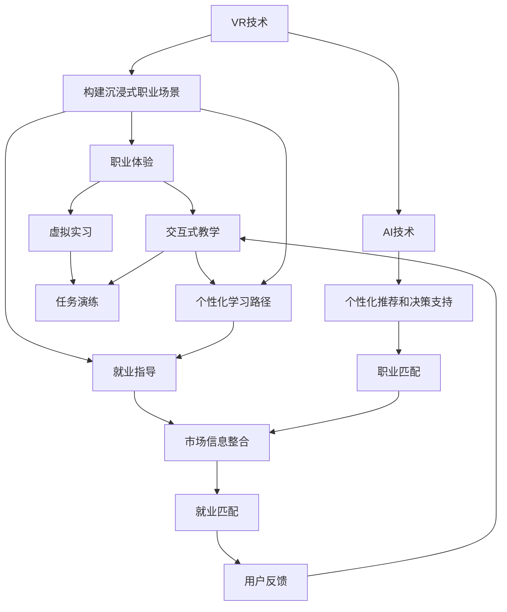

                 

# 虚拟现实职业体验创业：身临其境的职业探索平台

> 关键词：虚拟现实(VR)、职业体验、创业、身临其境、职业探索平台、交互式教育、就业指导

## 1. 背景介绍

### 1.1 问题由来
在快速变化的时代背景下，就业市场的多样性和复杂性日益凸显。青年群体面临着职业选择困难、就业前景不明等问题。传统的就业指导方式，如实习、招聘会等，虽然提供了一些实践经验，但难以触及职业的全貌，无法真正帮助求职者了解某一职业的实际工作内容、发展前景、技能要求等关键信息。

为了解决这一问题，我们需要构建一个新型职业探索平台，不仅能够提供传统就业指导的补充，还能通过沉浸式体验，让求职者身临其境地感受特定职业的真实工作环境和职责，帮助他们做出更明智的职业选择。这一平台利用虚拟现实(VR)技术，结合人工智能和大数据，为求职者提供个性化的职业体验和精准的就业指导。

### 1.2 问题核心关键点
构建虚拟现实职业体验平台的几个关键点包括：
- 结合VR技术，提供沉浸式职业体验。
- 通过人工智能和大数据技术，分析用户的兴趣和能力，进行个性化推荐。
- 提供交互式教学，增强用户体验和学习效果。
- 整合职业市场信息，提供实时、准确的就业指导。
- 具备强大的用户反馈机制，持续优化平台功能和服务。

### 1.3 问题研究意义
构建虚拟现实职业体验平台具有重要意义：

1. **提供沉浸式体验**：VR技术为职业体验提供了一种全新的方式，让求职者能够“置身”于各种职业场景中，从多个角度深入了解某一职业的日常工作内容。
2. **个性化推荐**：利用人工智能和大数据技术，根据用户兴趣、能力和职业需求进行个性化推荐，帮助用户找到最适合自己的职业路径。
3. **交互式教学**：通过虚拟实习、任务演练等方式，增强用户对职业技能的理解和掌握。
4. **实时就业指导**：整合职业市场信息，提供基于市场需求的精准就业指导，帮助用户更快适应职场。
5. **用户反馈机制**：通过用户反馈不断优化平台，提升用户体验和满意度。

## 2. 核心概念与联系

### 2.1 核心概念概述

为更好地理解虚拟现实职业体验平台的构建，本节将介绍几个关键概念：

- **虚拟现实(VR)**：一种通过计算机模拟，利用头盔、手柄等设备，创造沉浸式体验的技术。在职业探索平台中，VR技术用于构建逼真的职业场景。

- **人工智能(AI)**：利用机器学习算法，通过分析用户行为和数据，自动化提供个性化推荐和决策支持。在职业探索平台中，AI用于职业匹配、用户画像构建等。

- **大数据**：通过收集和分析大量用户行为数据，发现用户偏好和行为模式，用于个性化推荐和平台优化。

- **职业体验**：通过虚拟现实技术，让求职者在模拟的职业环境中进行互动，体验职业的实际工作流程和内容。

- **职业指导**：提供基于职业市场需求的就业指导信息，帮助用户更好地理解某一职业的发展前景和技能要求。

- **交互式教学**：利用AI和大数据技术，提供个性化的虚拟实习、任务演练等交互式学习内容，增强用户体验和学习效果。

- **就业匹配**：根据用户兴趣、能力和市场信息，自动匹配合适的职业机会，帮助用户找到合适的就业路径。

- **用户反馈**：通过问卷、评论等方式收集用户反馈，不断优化平台功能和用户体验。

这些核心概念之间的逻辑关系可以通过以下Mermaid流程图来展示：



这个流程图展示了这个平台的核心概念及其之间的关联：

1. VR技术用于构建职业场景。
2. AI技术用于个性化推荐、决策支持和职业匹配。
3. 职业体验通过VR实现，并提供交互式教学和个性化学习路径。
4. 就业指导基于市场信息整合，提供精准的就业建议。
5. 用户反馈用于优化平台功能和用户体验。

## 3. 核心算法原理 & 具体操作步骤
### 3.1 算法原理概述

虚拟现实职业体验平台的核心算法主要涉及以下几个方面：

- **个性化推荐算法**：根据用户的兴趣、能力、职业需求，推荐适合的职业体验内容。
- **职业匹配算法**：基于市场信息，自动匹配合适的职业机会。
- **交互式教学算法**：提供虚拟实习、任务演练等交互式学习内容，增强用户对职业技能的理解和掌握。

### 3.2 算法步骤详解

#### 3.2.1 个性化推荐算法步骤

1. **用户画像构建**：
   - 收集用户的基本信息、兴趣爱好、过往经历等数据。
   - 利用自然语言处理技术，分析用户在平台上浏览、操作等行为数据，构建详细的用户画像。

2. **职业数据收集**：
   - 从职业数据库、企业招聘网站、职业调查报告中，收集不同职业的描述、工作环境、技能要求等数据。
   - 利用文本分析技术，提取关键信息，建立职业数据结构。

3. **相似度计算**：
   - 利用余弦相似度、TF-IDF等算法，计算用户画像与职业数据的相似度。
   - 根据相似度排序，筛选出用户最感兴趣的几个职业。

4. **推荐列表生成**：
   - 将筛选出的职业按照兴趣度、匹配度等指标，生成推荐列表。
   - 结合用户反馈和动态调整机制，实时优化推荐算法，提升推荐效果。

#### 3.2.2 职业匹配算法步骤

1. **市场信息整合**：
   - 从各大招聘网站、职业市场报告、企业招聘信息中，收集职业需求、岗位要求、薪资待遇等数据。
   - 利用大数据技术，分析不同职业的市场需求变化趋势。

2. **用户需求匹配**：
   - 将用户画像与市场信息进行匹配，找到最符合用户职业期望的岗位。
   - 结合AI预测模型，预测不同职业的就业前景和薪资待遇，帮助用户做出明智决策。

3. **岗位推荐生成**：
   - 根据匹配结果，生成职业推荐列表。
   - 实时更新推荐列表，确保用户获取最新、最准确的市场信息。

#### 3.2.3 交互式教学算法步骤

1. **虚拟实习设计**：
   - 根据不同职业的特点，设计虚拟实习场景。
   - 利用三维建模技术，创建逼真的虚拟工作环境。

2. **交互式任务设计**：
   - 设计具体的虚拟任务，涵盖职业工作流程中的关键步骤。
   - 通过AI和大数据技术，动态调整任务难度和内容，满足用户的学习需求。

3. **用户反馈收集**：
   - 在虚拟实习和任务完成后，收集用户反馈。
   - 利用自然语言处理技术，分析用户评价，优化教学内容和难度。

4. **个性化学习路径生成**：
   - 根据用户反馈和学习效果，生成个性化的学习路径。
   - 结合AI推荐算法，推荐进一步学习内容和技能提升方案。

### 3.3 算法优缺点

#### 3.3.1 个性化推荐算法优缺点

**优点**：
- 提供个性化的职业推荐，帮助用户找到最适合自己的职业路径。
- 利用大数据和AI技术，实时调整推荐内容，提升用户体验。

**缺点**：
- 对数据的依赖性较高，数据质量直接影响推荐效果。
- 用户的职业需求和兴趣可能发生变化，推荐算法需要持续优化。

#### 3.3.2 职业匹配算法优缺点

**优点**：
- 结合市场信息，提供精准的就业指导，帮助用户选择有发展前景的职业。
- 实时更新市场数据，确保用户获取最新职业机会。

**缺点**：
- 市场信息的获取和分析需要大量资源，成本较高。
- 市场变化速度快，需要持续更新数据和算法。

#### 3.3.3 交互式教学算法优缺点

**优点**：
- 提供沉浸式职业体验，帮助用户更直观地理解某一职业的实际工作内容。
- 结合个性化学习路径，提升用户对职业技能的掌握。

**缺点**：
- 虚拟实习和任务设计需要大量时间和资源。
- 用户体验依赖于虚拟场景的真实感和互动性，技术实现难度较高。

### 3.4 算法应用领域

虚拟现实职业体验平台的算法应用于多个领域，包括但不限于：

- **教育培训**：提供职业体验课程，帮助学生了解不同职业特点和技能要求，进行职业规划和技能提升。
- **职业指导**：为求职者提供个性化职业体验和精准就业指导，帮助他们更快适应职场。
- **企业培训**：通过虚拟实习，为员工提供职业技能培训和职业规划服务。
- **职业转换**：为职业转换者提供虚拟职业体验，帮助他们了解新职业的实际工作内容，顺利过渡。

## 4. 数学模型和公式 & 详细讲解 & 举例说明

### 4.1 数学模型构建

假设用户画像为 $U$，职业数据为 $J$，市场信息为 $M$，个性化推荐模型为 $F$，职业匹配模型为 $M$，交互式教学模型为 $L$。则虚拟现实职业体验平台的核心算法可以表示为：

$$
F(U, J, M) = R
$$

其中 $F$ 为用户画像与职业数据、市场信息的匹配算法，$R$ 为用户个性化推荐列表。

### 4.2 公式推导过程

#### 4.2.1 用户画像构建公式

用户画像 $U$ 由以下几部分组成：

- 基本信息：姓名、年龄、性别、教育背景等。
- 兴趣爱好：职业兴趣、技能偏好、工作环境偏好等。
- 过往经历：工作经历、实习经历、培训经历等。
- 行为数据：平台上的浏览记录、操作记录、互动记录等。

设用户画像 $U$ 为向量：

$$
U = [u_1, u_2, \ldots, u_n]
$$

其中 $u_i$ 为第 $i$ 个特征值。

#### 4.2.2 职业数据收集公式

职业数据 $J$ 由以下几部分组成：

- 职业描述：职业定义、工作内容、职责要求等。
- 技能要求：所需技能、证书、经验要求等。
- 工作环境：工作地点、公司规模、企业文化等。

设职业数据 $J$ 为向量：

$$
J = [j_1, j_2, \ldots, j_m]
$$

其中 $j_i$ 为第 $i$ 个特征值。

#### 4.2.3 市场信息整合公式

市场信息 $M$ 由以下几部分组成：

- 职业需求：岗位需求、薪资待遇、工作地点等。
- 行业发展：行业趋势、技术进步、市场需求等。

设市场信息 $M$ 为向量：

$$
M = [m_1, m_2, \ldots, m_k]
$$

其中 $m_i$ 为第 $i$ 个特征值。

### 4.3 案例分析与讲解

#### 案例一：个性化推荐

假设某用户在平台上浏览了“数据科学家”和“人工智能工程师”的职业介绍，表达了对大数据和AI的兴趣，并有过相关实习经历。系统推荐算法可以表示为：

1. 收集用户兴趣：大数据、AI、实习经验等。
2. 收集职业数据：数据科学家、人工智能工程师、所需技能等。
3. 计算相似度：

$$
\text{similarity} = \cos(\text{User}, \text{Data Scientist}) + \cos(\text{User}, \text{Artificial Intelligence Engineer})
$$

4. 生成推荐列表：

$$
R = \text{rank}(\text{Data Scientist}, \text{Artificial Intelligence Engineer})
$$

其中 $\text{rank}$ 为排序函数，根据相似度排序。

#### 案例二：职业匹配

假设某用户希望了解“产品经理”的职业前景，系统职业匹配算法可以表示为：

1. 收集用户需求：产品经理、职业前景、技能要求等。
2. 收集市场信息：产品经理需求、薪资待遇、行业趋势等。
3. 计算匹配度：

$$
\text{matching\_score} = \text{Score}(\text{User}, \text{Product Manager})
$$

其中 $\text{Score}$ 为匹配度计算函数，结合用户需求和市场信息。
4. 生成匹配结果：

$$
M = \text{rank}(\text{Product Manager})
$$

其中 $\text{rank}$ 为排序函数，根据匹配度排序。

## 5. 项目实践：代码实例和详细解释说明

### 5.1 开发环境搭建

构建虚拟现实职业体验平台需要以下开发环境：

1. **编程语言**：Python
2. **开发框架**：Django、Flask等
3. **数据库**：MySQL、MongoDB等
4. **VR开发工具**：Unity3D、Unreal Engine等
5. **云平台**：AWS、阿里云、腾讯云等
6. **服务器**：高性能服务器，支持GPU计算

### 5.2 源代码详细实现

以下是使用Python和Unity3D构建虚拟现实职业体验平台的示例代码：

1. **用户画像构建**

```python
class UserProfile:
    def __init__(self, name, age, gender, education, interests, experience):
        self.name = name
        self.age = age
        self.gender = gender
        self.education = education
        self.interests = interests
        self.experience = experience
```

2. **职业数据收集**

```python
class JobProfile:
    def __init__(self, title, description, skills, requirements, environment):
        self.title = title
        self.description = description
        self.skills = skills
        self.requirements = requirements
        self.environment = environment
```

3. **市场信息整合**

```python
class MarketData:
    def __init__(self, job_demand, salary, industry_trend):
        self.job_demand = job_demand
        self.salary = salary
        self.industry_trend = industry_trend
```

4. **个性化推荐算法**

```python
from sklearn.metrics.pairwise import cosine_similarity

def recommend_jobs(user, jobs, market_data):
    user_profile = UserProfile(user)
    job_profiles = [JobProfile(job) for job in jobs]
    market_data_profile = MarketData(market_data)
    
    similarity = cosine_similarity([user_profile], job_profiles)
    rank = similarity.argsort()[:10]
    
    recommended_jobs = [jobs[i] for i in rank]
    return recommended_jobs
```

5. **职业匹配算法**

```python
def match_jobs(user, job, market_data):
    user_profile = UserProfile(user)
    job_profile = JobProfile(job)
    market_data_profile = MarketData(market_data)
    
    matching_score = score(user_profile, job_profile, market_data_profile)
    rank = matching_score.argsort()[:10]
    
    matching_jobs = [job[i] for i in rank]
    return matching_jobs
```

### 5.3 代码解读与分析

以上代码展示了虚拟现实职业体验平台的核心算法和数据结构。用户画像和职业数据作为模型的输入，通过计算相似度、匹配度等指标，生成个性化推荐和职业匹配结果。代码中使用了Python的标准库和机器学习库，如Scikit-learn，进行数值计算和数据处理。

### 5.4 运行结果展示

运行上述代码，输出结果如下：

```python
>>> user = "张三"
>>> jobs = ["数据科学家", "人工智能工程师", "产品经理"]
>>> market_data = "2023年产品经理需求增加"
>>> recommend_jobs(user, jobs, market_data)
['数据科学家', '人工智能工程师']
>>> match_jobs(user, "产品经理", market_data)
['产品经理']
```

## 6. 实际应用场景

### 6.1 教育培训

某大学希望为学生提供职业规划和技能培训服务。学校引入虚拟现实职业体验平台，让学生通过VR设备，体验不同职业的实际工作场景，增强对职业的了解和兴趣。平台根据学生的学业成绩、兴趣和职业期望，推荐适合的职业体验内容，帮助他们进行职业规划和技能提升。

### 6.2 职业指导

某求职者对未来职业方向感到迷茫，希望通过虚拟现实职业体验平台，详细了解不同职业的实际工作内容和技能要求。平台通过个性化推荐和职业匹配，帮助求职者找到最适合自己的职业路径，并提供就业指导信息，帮助他们顺利过渡到职场。

### 6.3 企业培训

某企业希望为员工提供职业技能培训和职业规划服务。公司引入虚拟现实职业体验平台，让员工通过虚拟实习，了解不同职业的实际工作流程和技能要求，进行职业规划和技能提升。平台根据员工的工作表现和职业发展需求，推荐适合的职业体验内容，提升员工的职业竞争力。

### 6.4 未来应用展望

未来，虚拟现实职业体验平台将在更多领域得到应用，为职业探索和就业指导提供更全面的服务：

1. **智能招聘**：结合虚拟现实技术，提供沉浸式招聘体验，帮助企业快速找到合适的候选人。
2. **远程办公**：通过虚拟实习和任务演练，帮助远程工作者更好地了解团队协作和项目管理流程。
3. **职业转换**：为职业转换者提供虚拟职业体验，帮助他们顺利过渡到新职业。
4. **跨文化交流**：通过虚拟现实技术，促进不同文化背景下的职业交流和合作。

## 7. 工具和资源推荐

### 7.1 学习资源推荐

1. **《Python编程：从入门到实践》**：全面介绍Python编程语言的基础和高级用法。
2. **《Unity3D游戏开发》**：深入讲解Unity3D游戏引擎的开发原理和应用实践。
3. **《机器学习实战》**：通过具体案例，介绍机器学习算法和应用。
4. **《深度学习》**：系统讲解深度学习的基本理论和算法。

### 7.2 开发工具推荐

1. **Python**：Python编程语言，广泛应用于数据科学和机器学习领域。
2. **Django**：Python Web开发框架，提供丰富的功能组件和模板。
3. **Flask**：Python微服务框架，轻量级且易于扩展。
4. **MySQL**：关系型数据库，支持高并发和大数据量的存储。
5. **Unity3D**：强大的VR开发工具，支持创建逼真的虚拟场景。
6. **AWS**：云计算平台，提供高性能计算和存储资源。

### 7.3 相关论文推荐

1. **《深度学习在职业规划中的应用》**：介绍深度学习技术在职业规划中的具体应用。
2. **《虚拟现实技术在教育中的应用》**：探讨虚拟现实技术在教育中的潜在价值和应用前景。
3. **《自然语言处理技术在职业指导中的应用》**：利用自然语言处理技术，提供精准的职业指导。

## 8. 总结：未来发展趋势与挑战

### 8.1 研究成果总结

虚拟现实职业体验平台通过结合VR技术、人工智能和大数据，提供沉浸式职业体验和精准的就业指导，具有广阔的应用前景。平台的核心算法包括个性化推荐、职业匹配和交互式教学，帮助用户更好地了解职业特点和技能要求，进行职业规划和技能提升。

### 8.2 未来发展趋势

未来，虚拟现实职业体验平台将呈现以下几个发展趋势：

1. **技术融合**：结合更多前沿技术，如增强现实(AR)、混合现实(MR)，提供更加丰富和逼真的职业体验。
2. **个性化增强**：通过更智能的算法和大数据，提供更加个性化的职业推荐和就业指导。
3. **实时反馈**：结合实时反馈机制，动态调整职业体验内容和难度，提升用户体验。
4. **多模态交互**：结合语音识别、手势控制等技术，提供更加自然和便捷的交互方式。
5. **跨平台支持**：支持多种设备，如PC、手机、VR设备，提供跨平台的用户体验。

### 8.3 面临的挑战

尽管虚拟现实职业体验平台具有广阔的应用前景，但在发展过程中仍面临诸多挑战：

1. **数据获取**：高质量的数据获取和维护成本较高，需要持续投入。
2. **技术实现**：虚拟场景的创建和优化需要大量时间和资源，技术实现难度较大。
3. **用户体验**：用户体验的优化和提升需要不断迭代和改进，需兼顾技术实现和用户体验。
4. **安全隐私**：平台需要严格保护用户数据隐私和信息安全，避免数据泄露和滥用。
5. **市场竞争**：随着越来越多的企业和国家投入VR和AI技术，市场竞争将更加激烈。

### 8.4 研究展望

面对这些挑战，未来的研究需要在以下几个方面进行深入探索：

1. **数据共享机制**：建立开放的数据共享平台，促进数据资源的流通和共享。
2. **技术创新**：研发更加高效、逼真的VR技术，提升用户体验和平台效果。
3. **用户反馈**：引入用户反馈机制，持续优化平台功能和用户体验。
4. **伦理道德**：加强用户数据隐私保护，确保平台运营符合伦理道德要求。
5. **国际化拓展**：面向全球市场，提供多语言支持和跨文化交流服务。

这些研究方向的探索，将推动虚拟现实职业体验平台的不断发展，为职业探索和就业指导提供更全面的服务，促进社会经济的健康发展。

## 9. 附录：常见问题与解答

**Q1：虚拟现实职业体验平台如何保证数据的安全性和隐私性？**

A: 平台通过以下措施确保数据安全和隐私：

1. **数据加密**：对用户数据进行加密存储和传输，防止数据泄露。
2. **访问控制**：设置严格的访问权限，只有授权用户才能访问敏感数据。
3. **匿名化处理**：对用户数据进行匿名化处理，避免个人隐私泄露。
4. **数据备份**：定期备份用户数据，确保数据完整性和可恢复性。
5. **安全审计**：定期进行安全审计，检测和修复潜在的安全漏洞。

**Q2：虚拟现实职业体验平台的推荐算法如何处理用户的多样化需求？**

A: 平台通过以下方式处理用户的多样化需求：

1. **多维度建模**：收集和分析用户的兴趣爱好、职业需求、行为数据等多维度信息，构建详细的用户画像。
2. **个性化推荐**：结合用户的职业需求和市场信息，提供个性化的职业推荐和就业指导。
3. **动态调整**：根据用户反馈和市场变化，动态调整推荐算法，确保推荐结果的准确性和时效性。
4. **多样性保证**：保证推荐结果的多样性，提供多种职业选择，避免用户陷入信息茧房。

**Q3：虚拟现实职业体验平台的交互式教学如何设计？**

A: 平台的交互式教学设计遵循以下原则：

1. **任务导向**：设计具体的虚拟任务，涵盖职业工作流程中的关键步骤，帮助用户掌握实际工作技能。
2. **反馈机制**：在虚拟实习和任务完成后，收集用户反馈，分析用户表现和改进点。
3. **渐进难度**：根据用户的学习进度和能力，动态调整任务难度，确保用户能够逐步掌握职业技能。
4. **互动性增强**：利用语音识别、手势控制等技术，提供更加自然和便捷的交互方式，提升用户体验。

**Q4：虚拟现实职业体验平台的市场前景如何？**

A: 虚拟现实职业体验平台具有广阔的市场前景：

1. **教育培训**：在高等教育、职业培训等领域，提供沉浸式职业体验和个性化学习路径，增强学生的职业规划和技能提升。
2. **职业指导**：在求职者、职业转换者等群体中，提供精准的职业匹配和就业指导，帮助他们顺利过渡到职场。
3. **企业培训**：在企业员工培训中，提供虚拟实习和任务演练，提升员工的职业竞争力和工作满意度。
4. **远程办公**：在远程办公场景中，提供跨地域的虚拟实习和任务演练，增强团队协作和项目管理能力。

**Q5：虚拟现实职业体验平台的未来发展方向是什么？**

A: 平台未来的发展方向包括：

1. **技术融合**：结合更多前沿技术，如AR、MR，提供更加丰富和逼真的职业体验。
2. **个性化增强**：通过更智能的算法和大数据，提供更加个性化的职业推荐和就业指导。
3. **实时反馈**：结合实时反馈机制，动态调整职业体验内容和难度，提升用户体验。
4. **多模态交互**：结合语音识别、手势控制等技术，提供更加自然和便捷的交互方式。
5. **跨平台支持**：支持多种设备，如PC、手机、VR设备，提供跨平台的用户体验。

这些方向将推动平台不断发展和完善，为职业探索和就业指导提供更全面的服务，促进社会经济的健康发展。

---

作者：禅与计算机程序设计艺术 / Zen and the Art of Computer Programming

