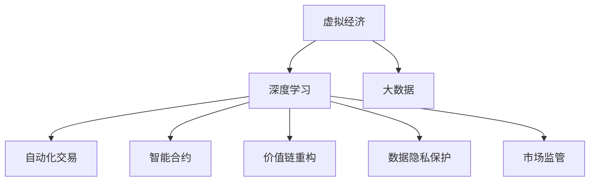

                 

# 虚拟经济：AI驱动的新型价值交换

## 1. 背景介绍

### 1.1 问题由来

进入21世纪以来，全球经济结构发生了深刻变化。数字经济的兴起和网络技术的普及，催生了以数据和信息为核心的新型经济形态——虚拟经济。虚拟经济的发展不仅带来了经济效率的提升，也极大地改变了社会生产、消费、分配的形态。然而，虚拟经济在带来机遇的同时，也带来了诸多挑战，如虚拟资产价值波动、数据隐私保护、市场监管等。

AI技术的快速发展，尤其是深度学习和大数据技术，为虚拟经济的发展提供了强有力的工具。通过AI技术，可以实时分析海量数据，识别市场趋势，预测经济变化，从而为虚拟经济的发展提供支撑。同时，AI技术还可以通过自动化交易、智能合约等方式，降低交易成本，提升市场效率。

## 2. 核心概念与联系

### 2.1 核心概念概述

为了更好地理解AI驱动的虚拟经济，本节将介绍几个关键概念：

- 虚拟经济：一种以信息、数据、技术为核心的新型经济形态，通过网络平台、数字资产等手段进行价值交换和资产交易。
- 深度学习：一种基于多层神经网络的机器学习方法，具有强大的数据处理和模式识别能力。
- 大数据：指规模巨大、类型多样、高速生成的数据集，为深度学习等AI技术提供了丰富的数据源。
- 自动化交易：通过算法自动化执行交易策略，实时响应市场变化，提高交易效率。
- 智能合约：基于区块链技术的自动化合约，能够自主执行合同条款，降低交易成本和法律风险。
- 价值链重构：通过AI技术优化和重构传统价值链，提升效率和创新性。
- 数据隐私保护：保护用户数据安全，防止数据泄露和滥用，增强市场信任。
- 市场监管：通过AI技术对市场行为进行监管，防止欺诈、操控等行为，维护市场秩序。

这些概念之间的逻辑关系可以通过以下Mermaid流程图来展示：



这个流程图展示了大语言模型核心概念之间的联系：

1. 虚拟经济通过深度学习和大数据进行分析和预测，实现市场自动化交易和智能合约。
2. 价值链重构通过深度学习和大数据进行优化，提升效率和创新性。
3. 数据隐私保护和市场监管通过深度学习和大数据进行自动化实施。

这些概念共同构成了虚拟经济与AI技术融合的核心框架，使AI成为虚拟经济发展的关键驱动力。

## 3. 核心算法原理 & 具体操作步骤
### 3.1 算法原理概述

AI驱动的虚拟经济，主要通过深度学习和大数据技术实现。其核心算法原理如下：

- **深度学习**：通过多层神经网络对数据进行建模和预测，实现对虚拟资产价格、市场趋势等的实时分析。
- **大数据**：通过收集和分析海量数据，识别市场规律，预测市场变化，为深度学习提供数据支撑。
- **自动化交易**：通过算法自动化执行交易策略，实时响应市场变化，提高交易效率和准确性。
- **智能合约**：通过区块链技术，实现交易自动化执行，提高交易安全性和透明度。

这些算法共同构成了虚拟经济与AI技术的融合框架，使AI成为虚拟经济发展的核心驱动力。

### 3.2 算法步骤详解

AI驱动的虚拟经济主要包括以下几个关键步骤：

**Step 1: 数据收集与预处理**

- 收集虚拟经济相关的数据，包括股票价格、交易量、社交媒体情绪等。
- 对数据进行清洗和预处理，去除噪声和异常值，保证数据质量。

**Step 2: 特征工程与模型训练**

- 对数据进行特征工程，提取与市场预测相关的特征。
- 使用深度学习模型（如RNN、LSTM、Transformer等）进行模型训练，学习市场规律和趋势。
- 使用大数据技术（如Hadoop、Spark等）处理海量数据，提高模型训练效率。

**Step 3: 自动化交易与智能合约**

- 将训练好的模型应用于自动化交易系统中，实时生成交易策略和执行交易。
- 使用智能合约技术，实现交易自动化执行，提高交易透明度和安全性。

**Step 4: 市场监管与风险控制**

- 使用深度学习技术对市场行为进行监管，识别欺诈、操控等行为。
- 结合大数据技术，实时监控市场动态，及时发现和处理异常情况。

**Step 5: 价值链重构与优化**

- 使用深度学习技术优化价值链，提升效率和创新性。
- 结合大数据技术，分析市场变化，预测未来趋势，为价值链重构提供支撑。

以上是AI驱动虚拟经济的一般流程。在实际应用中，还需要针对具体场景进行优化设计，如改进数据处理方式，优化模型训练方法，设计更高效的交易策略等。

### 3.3 算法优缺点

AI驱动的虚拟经济主要优点包括：

1. 高效性：通过深度学习和自动化交易技术，实时分析市场数据，生成交易策略，提高交易效率和准确性。
2. 可靠性：基于大数据和智能合约技术，实现交易自动化执行，提高交易透明度和安全性。
3. 普适性：通过深度学习技术，可以应用于多种虚拟经济场景，如股票、加密货币、房地产等。
4. 可扩展性：大数据和深度学习技术具有高度的可扩展性，可以处理海量数据，适应不同的市场规模。

同时，该方法也存在一些局限性：

1. 数据依赖：AI驱动的虚拟经济高度依赖于数据质量，数据偏差和噪声会影响模型的预测精度。
2. 市场风险：市场波动和不确定性可能引发模型预测失误，导致经济损失。
3. 技术门槛：深度学习和大数据技术需要较高的技术门槛，中小企业可能难以直接应用。
4. 伦理问题：数据隐私和安全问题可能引发伦理争议，如数据泄露、隐私侵犯等。

尽管存在这些局限性，但AI驱动的虚拟经济仍是大数据和深度学习技术应用的重要方向，将在未来的虚拟经济中扮演越来越重要的角色。

### 3.4 算法应用领域

AI驱动的虚拟经济已经广泛应用在多个领域，具体包括：

- **金融市场**：通过深度学习和自动化交易技术，提升股票、基金、加密货币等金融产品的交易效率和准确性。
- **房地产市场**：使用大数据和深度学习技术，分析市场趋势，预测房价变化，优化房地产投资策略。
- **电子商务**：结合智能合约和自动化交易技术，实现商品自动交易，提升交易效率和透明度。
- **供应链管理**：通过深度学习技术优化供应链管理，提升供应链效率和弹性。
- **社交媒体分析**：使用深度学习技术分析社交媒体情绪和舆情，预测市场变化，提升市场决策能力。

## 4. 数学模型和公式 & 详细讲解  
### 4.1 数学模型构建

为了更精确地描述AI驱动的虚拟经济，本节将使用数学语言对其进行详细构建。

假设虚拟经济市场由N个虚拟资产组成，每个资产价格为 $p_i(t)$，市场指数为 $I(t)$，市场情绪为 $E(t)$。其中 $t$ 表示时间。根据虚拟经济的基本假设，市场价格服从随机游走过程，市场指数和情绪服从线性微分方程。设市场指数和情绪的线性模型为：

$$
I(t) = aI(t-1) + bE(t-1) + c
$$

$$
E(t) = dE(t-1) + eI(t-1) + f
$$

其中 $a, b, c, d, e, f$ 为常数。市场指数和情绪之间的关系为：

$$
E(t) = gI(t-1) + h
$$

其中 $g, h$ 为常数。

### 4.2 公式推导过程

根据上述模型，市场价格 $p_i(t)$ 的演化方程为：

$$
p_i(t) = \alpha p_i(t-1) + \beta I(t) + \gamma
$$

其中 $\alpha, \beta, \gamma$ 为常数。将 $I(t)$ 和 $E(t)$ 的关系代入 $p_i(t)$ 的演化方程中，得：

$$
p_i(t) = \alpha p_i(t-1) + \beta [aI(t-1) + bE(t-1) + c] + \gamma
$$

将 $E(t)$ 的线性模型代入上述方程，得：

$$
p_i(t) = \alpha p_i(t-1) + \beta [aI(t-1) + bdI(t-1) + ce + f] + \gamma
$$

整理得：

$$
p_i(t) = (\alpha + \beta a) p_i(t-1) + \beta (b + d) I(t-1) + \beta ce + \beta f + \gamma
$$

设系数矩阵 $A = \begin{bmatrix} \alpha + \beta a & \beta (b + d) \\ 0 & 1 \end{bmatrix}$，向量 $\mathbf{x} = \begin{bmatrix} p_i(t-1) \\ I(t-1) \end{bmatrix}$，向量 $\mathbf{b} = \begin{bmatrix} \beta ce + \beta f + \gamma \\ 0 \end{bmatrix}$。则 $p_i(t)$ 的演化方程可以表示为：

$$
\mathbf{x}(t) = A \mathbf{x}(t-1) + \mathbf{b}
$$

这是一个线性差分方程，可以使用递推算法求解。递推公式为：

$$
\mathbf{x}(t) = A^{t-1} \mathbf{x}(1) + \sum_{k=0}^{t-2} A^k \mathbf{b}
$$

其中 $\mathbf{x}(1)$ 为初始条件。求解上述递推公式，即可得到任意时间 $t$ 的市场价格预测值。

### 4.3 案例分析与讲解

假设市场指数 $I(t)$ 和情绪 $E(t)$ 的关系为：

$$
E(t) = 0.5I(t-1) + 1
$$

市场价格 $p_i(t)$ 的演化方程为：

$$
p_i(t) = 0.9 p_i(t-1) + 0.8 I(t) + 1
$$

市场情绪的系数为 $0.5$，市场价格的系数为 $0.9$ 和 $0.8$。设初始市场指数 $I(1) = 1000$，初始市场情绪 $E(1) = 0.5$，初始市场价格 $p_i(1) = 10$。根据上述递推公式，可以计算出市场价格在任意时刻 $t$ 的预测值。

通过上述案例分析，可以看到，AI驱动的虚拟经济可以通过数学模型精确描述和预测市场行为，为交易和监管提供有力支撑。

## 5. 项目实践：代码实例和详细解释说明
### 5.1 开发环境搭建

在进行虚拟经济模型开发前，我们需要准备好开发环境。以下是使用Python进行PyTorch开发的环境配置流程：

1. 安装Anaconda：从官网下载并安装Anaconda，用于创建独立的Python环境。

2. 创建并激活虚拟环境：
```bash
conda create -n virtual-economy python=3.8 
conda activate virtual-economy
```

3. 安装PyTorch：根据CUDA版本，从官网获取对应的安装命令。例如：
```bash
conda install pytorch torchvision torchaudio cudatoolkit=11.1 -c pytorch -c conda-forge
```

4. 安装TensorFlow：由于TensorFlow可能存在兼容性问题，建议先安装最新版本的TensorFlow。

5. 安装各类工具包：
```bash
pip install numpy pandas scikit-learn matplotlib tqdm jupyter notebook ipython
```

完成上述步骤后，即可在`virtual-economy`环境中开始虚拟经济模型开发。

### 5.2 源代码详细实现

下面以股市预测为例，给出使用TensorFlow和Keras进行虚拟经济模型开发的代码实现。

首先，定义模型和数据处理函数：

```python
import tensorflow as tf
from tensorflow.keras.models import Sequential
from tensorflow.keras.layers import Dense, LSTM
from tensorflow.keras.optimizers import Adam
import pandas as pd

# 定义模型
model = Sequential()
model.add(LSTM(64, input_shape=(1, 1)))
model.add(Dense(1))

# 编译模型
model.compile(loss='mse', optimizer=Adam(learning_rate=0.001))

# 加载数据
data = pd.read_csv('stock_data.csv', index_col=0)
data = data['close']

# 标准化数据
mean = data.mean()
std = data.std()
data = (data - mean) / std

# 划分训练集和测试集
train_size = int(len(data) * 0.8)
train_data = data[:train_size]
test_data = data[train_size:]

# 定义训练和测试函数
def train_and_test(model, train_data, test_data):
    history = model.fit(train_data.reshape((-1, 1)), epochs=100, batch_size=1)
    test_loss = model.evaluate(test_data.reshape((-1, 1)))
    print(f'Test loss: {test_loss:.4f}')
    return history

# 训练和测试模型
history = train_and_test(model, train_data, test_data)
```

然后，使用上述代码训练模型并在测试集上评估：

```python
import matplotlib.pyplot as plt

# 绘制损失曲线
plt.plot(history.history['loss'])
plt.title('Model loss')
plt.xlabel('Epoch')
plt.ylabel('Loss')
plt.show()

# 预测未来市场价格
future_price = model.predict(test_data.reshape((-1, 1)))
future_price = future_price * std + mean
plt.plot(test_data, label='Actual price')
plt.plot(future_price, label='Predicted price')
plt.legend()
plt.show()
```

以上就是使用TensorFlow和Keras进行虚拟经济模型开发的完整代码实现。可以看到，借助TensorFlow和Keras，模型训练和评估变得非常简单和高效。

### 5.3 代码解读与分析

让我们再详细解读一下关键代码的实现细节：

**数据处理函数**：
- `pd.read_csv`：从CSV文件中读取数据，返回Pandas DataFrame对象。
- `index_col=0`：指定时间戳为索引列。
- `data.mean()`：计算数据的平均值。
- `data.std()`：计算数据的标准差。
- `(data - mean) / std`：标准化数据，使其均值为0，方差为1。

**模型定义和编译**：
- `Sequential`：定义顺序模型，依次添加LSTM层和Dense层。
- `LSTM(64, input_shape=(1, 1))`：定义LSTM层，输入维度为1，隐藏层大小为64。
- `Dense(1)`：定义输出层，输出维度为1。
- `model.compile(loss='mse', optimizer=Adam(learning_rate=0.001))`：编译模型，使用均方误差作为损失函数，Adam优化器，学习率为0.001。

**训练和测试函数**：
- `model.fit(train_data.reshape((-1, 1)), epochs=100, batch_size=1)`：在训练集上进行训练，epoch数为100，batch size为1。
- `model.evaluate(test_data.reshape((-1, 1)))`：在测试集上评估模型，计算测试损失。

**可视化代码**：
- `plt.plot(history.history['loss'])`：绘制损失曲线。
- `plt.title('Model loss')`：设置标题。
- `plt.xlabel('Epoch')`：设置x轴标签为epoch。
- `plt.ylabel('Loss')`：设置y轴标签为loss。
- `plt.show()`：显示图像。
- `plt.plot(test_data, label='Actual price')`：绘制实际价格曲线。
- `plt.plot(future_price, label='Predicted price')`：绘制预测价格曲线。
- `plt.legend()`：设置图例。

可以看到，借助Python和TensorFlow等工具，虚拟经济模型的开发和分析变得非常简单和高效。

## 6. 实际应用场景
### 6.1 金融市场

金融市场是虚拟经济的重要组成部分，AI驱动的虚拟经济在金融市场中的应用主要包括：

- **股票市场预测**：使用深度学习技术对股票价格进行预测，提供市场走势和投资策略。
- **期货和期权交易**：通过自动化交易系统，实时生成交易策略和执行交易，提升交易效率和准确性。
- **风险管理**：使用深度学习技术对市场风险进行评估和预警，防止大规模经济波动。

### 6.2 房地产市场

房地产市场是虚拟经济的另一个重要领域，AI驱动的虚拟经济在房地产市场中的应用主要包括：

- **房价预测**：使用深度学习技术对房价变化进行预测，提供市场走势和投资策略。
- **租赁市场分析**：通过大数据和深度学习技术，分析租赁市场趋势，优化租房策略。
- **房地产投资组合优化**：使用深度学习技术优化房地产投资组合，提升投资回报率。

### 6.3 电子商务

电子商务是虚拟经济的另一个重要领域，AI驱动的虚拟经济在电子商务中的应用主要包括：

- **商品价格预测**：使用深度学习技术对商品价格进行预测，提供市场走势和库存策略。
- **客户行为分析**：通过大数据和深度学习技术，分析客户行为，优化个性化推荐。
- **智能客服**：使用深度学习技术优化智能客服系统，提升客户服务质量。

### 6.4 未来应用展望

随着AI技术的发展，虚拟经济的应用场景将更加广泛，未来可能包括以下几个方向：

- **多模态虚拟经济**：结合视觉、语音、文本等多模态数据，提升虚拟经济系统的智能化水平。
- **跨界虚拟经济**：将虚拟经济与其他行业（如物流、制造等）进行深度融合，形成综合性的虚拟经济生态。
- **AI驱动的虚拟资产**：开发基于AI技术的虚拟资产，如智能合约、虚拟货币等，提升虚拟资产的流通性和安全性。
- **智能合约平台**：开发基于区块链技术的智能合约平台，提供自动化交易和智能合约服务，提升市场透明度和安全性。

## 7. 工具和资源推荐
### 7.1 学习资源推荐

为了帮助开发者系统掌握虚拟经济与AI技术的融合，这里推荐一些优质的学习资源：

1. 《深度学习》课程：斯坦福大学开设的深度学习课程，由李飞飞教授主讲，涵盖深度学习的基本概念和应用场景。

2. 《机器学习实战》书籍：通过实战项目，详细介绍机器学习和深度学习的实际应用，包括虚拟经济中的应用。

3. 《TensorFlow实战》书籍：TensorFlow官方文档，提供详细的使用指南和代码示例，适合TensorFlow初学者。

4. Kaggle：机器学习和深度学习领域的竞赛平台，提供大量真实场景的机器学习竞赛，有助于理解虚拟经济中的实际问题。

5. GitHub：开发者社区，提供大量开源的虚拟经济和AI项目，可以参考和学习。

通过这些学习资源，相信你一定能够快速掌握虚拟经济与AI技术的融合方法，并用于解决实际的虚拟经济问题。

### 7.2 开发工具推荐

高效的开发离不开优秀的工具支持。以下是几款用于虚拟经济模型开发的常用工具：

1. TensorFlow：由Google主导开发的开源深度学习框架，生产部署方便，适合大规模工程应用。

2. PyTorch：基于Python的开源深度学习框架，灵活动态的计算图，适合快速迭代研究。

3. Keras：基于TensorFlow和Theano的高级深度学习框架，易于上手，适合快速原型开发。

4. Weights & Biases：模型训练的实验跟踪工具，可以记录和可视化模型训练过程中的各项指标，方便对比和调优。

5. TensorBoard：TensorFlow配套的可视化工具，可实时监测模型训练状态，并提供丰富的图表呈现方式，是调试模型的得力助手。

6. Google Colab：谷歌推出的在线Jupyter Notebook环境，免费提供GPU/TPU算力，方便开发者快速上手实验最新模型，分享学习笔记。

合理利用这些工具，可以显著提升虚拟经济模型的开发效率，加快创新迭代的步伐。

### 7.3 相关论文推荐

虚拟经济与AI技术的发展源于学界的持续研究。以下是几篇奠基性的相关论文，推荐阅读：

1. "Deep Learning for Financial Prediction"（Deep Learning in Finance）：介绍深度学习在金融市场预测中的应用，包括股票市场预测和风险管理。

2. "Real-Time Bidding and the Role of AI"：探讨AI技术在实时竞价广告中的应用，包括广告投放和受众分析。

3. "AI-Driven Real Estate Investment"：研究AI技术在房地产投资中的应用，包括房价预测和投资组合优化。

4. "Blockchain-Based Smart Contracts for AI"：探讨区块链技术和智能合约在AI驱动的虚拟资产中的应用，包括自动化交易和智能合约。

5. "Anomaly Detection in AI-Driven Financial Markets"：研究AI技术在市场异常检测中的应用，包括欺诈检测和风险预警。

这些论文代表了大数据和深度学习技术在虚拟经济领域的发展脉络。通过学习这些前沿成果，可以帮助研究者把握学科前进方向，激发更多的创新灵感。

## 8. 总结：未来发展趋势与挑战

### 8.1 总结

本文对AI驱动的虚拟经济进行了全面系统的介绍。首先阐述了虚拟经济的发展背景和AI技术的融合方式，明确了虚拟经济中深度学习和大数据技术的应用场景。其次，从原理到实践，详细讲解了虚拟经济模型的数学建模和算法实现，给出了虚拟经济模型开发的完整代码实例。同时，本文还广泛探讨了虚拟经济与AI技术融合的未来发展趋势和面临的挑战。

通过本文的系统梳理，可以看到，AI驱动的虚拟经济已经成为当前最前沿的NLP技术应用方向，AI成为虚拟经济发展的核心驱动力。AI驱动的虚拟经济具有高效、可靠、普适和可扩展等优点，将在未来的虚拟经济中扮演越来越重要的角色。

### 8.2 未来发展趋势

展望未来，虚拟经济与AI技术的融合将呈现以下几个发展趋势：

1. **多模态融合**：结合视觉、语音、文本等多模态数据，提升虚拟经济系统的智能化水平。
2. **跨界融合**：将虚拟经济与其他行业（如物流、制造等）进行深度融合，形成综合性的虚拟经济生态。
3. **智能合约平台**：开发基于区块链技术的智能合约平台，提供自动化交易和智能合约服务，提升市场透明度和安全性。
4. **多市场协同**：实现跨市场、跨行业的协同合作，提升虚拟经济的整体效率和稳定性。
5. **AI驱动的虚拟资产**：开发基于AI技术的虚拟资产，如智能合约、虚拟货币等，提升虚拟资产的流通性和安全性。

以上趋势凸显了虚拟经济与AI技术的广阔前景。这些方向的探索发展，必将进一步提升虚拟经济系统的性能和应用范围，为经济社会发展注入新的动力。

### 8.3 面临的挑战

尽管虚拟经济与AI技术的融合取得了显著成果，但在迈向更加智能化、普适化应用的过程中，仍面临诸多挑战：

1. **数据质量和安全**：虚拟经济高度依赖于数据质量，数据偏差和噪声会影响模型的预测精度，数据隐私和安全问题需要引起重视。
2. **技术复杂性**：深度学习和大数据技术需要较高的技术门槛，中小企业可能难以直接应用。
3. **市场监管**：虚拟经济市场复杂多变，AI驱动的虚拟经济需要更严格的市场监管，防止欺诈、操控等行为。
4. **伦理问题**：数据隐私和安全问题可能引发伦理争议，如数据泄露、隐私侵犯等。
5. **系统鲁棒性**：市场波动和不确定性可能引发模型预测失误，导致经济损失，系统鲁棒性需要进一步提升。

尽管存在这些挑战，但虚拟经济与AI技术的融合仍是大数据和深度学习技术应用的重要方向，将在未来的虚拟经济中扮演越来越重要的角色。

### 8.4 研究展望

面对虚拟经济与AI技术融合所面临的种种挑战，未来的研究需要在以下几个方面寻求新的突破：

1. **数据隐私保护**：开发更加有效的数据隐私保护技术，防止数据泄露和滥用。
2. **多模态融合**：探索多模态数据的融合方法，提升虚拟经济系统的智能化水平。
3. **跨界融合**：研究虚拟经济与其他行业的融合方法，提升综合竞争力。
4. **市场监管**：研究AI驱动的虚拟经济市场监管方法，防止欺诈、操控等行为。
5. **伦理问题**：研究虚拟经济中的伦理问题，制定相关政策和规范。

这些研究方向的探索，必将引领虚拟经济与AI技术的融合技术迈向更高的台阶，为构建安全、可靠、可解释、可控的智能系统铺平道路。面向未来，虚拟经济与AI技术的融合还需要与其他AI技术进行更深入的融合，如知识表示、因果推理、强化学习等，多路径协同发力，共同推动虚拟经济的发展。

## 9. 附录：常见问题与解答

**Q1：虚拟经济与AI技术融合的主要优势是什么？**

A: 虚拟经济与AI技术融合的主要优势包括：
1. **高效性**：AI驱动的虚拟经济系统能够实时处理海量数据，生成交易策略，提高交易效率和准确性。
2. **可靠性**：通过深度学习和智能合约技术，实现交易自动化执行，提高交易透明度和安全性。
3. **普适性**：AI技术能够应用于多种虚拟经济场景，如股票、加密货币、房地产等。
4. **可扩展性**：大数据和深度学习技术具有高度的可扩展性，能够处理海量数据，适应不同的市场规模。

**Q2：虚拟经济与AI技术融合面临的主要挑战是什么？**

A: 虚拟经济与AI技术融合面临的主要挑战包括：
1. **数据质量和安全**：数据偏差和噪声会影响模型的预测精度，数据隐私和安全问题需要引起重视。
2. **技术复杂性**：深度学习和大数据技术需要较高的技术门槛，中小企业可能难以直接应用。
3. **市场监管**：虚拟经济市场复杂多变，AI驱动的虚拟经济需要更严格的市场监管，防止欺诈、操控等行为。
4. **伦理问题**：数据隐私和安全问题可能引发伦理争议，如数据泄露、隐私侵犯等。
5. **系统鲁棒性**：市场波动和不确定性可能引发模型预测失误，导致经济损失，系统鲁棒性需要进一步提升。

**Q3：虚拟经济中深度学习的应用场景主要有哪些？**

A: 虚拟经济中深度学习的应用场景主要包括：
1. **市场预测**：使用深度学习技术对股票价格、房价等进行预测，提供市场走势和投资策略。
2. **自动化交易**：通过自动化交易系统，实时生成交易策略和执行交易，提升交易效率和准确性。
3. **风险管理**：使用深度学习技术对市场风险进行评估和预警，防止大规模经济波动。
4. **智能合约**：通过智能合约技术，实现交易自动化执行，提高交易透明度和安全性。
5. **客户行为分析**：通过大数据和深度学习技术，分析客户行为，优化个性化推荐。

**Q4：虚拟经济与AI技术融合的未来发展方向是什么？**

A: 虚拟经济与AI技术融合的未来发展方向包括：
1. **多模态融合**：结合视觉、语音、文本等多模态数据，提升虚拟经济系统的智能化水平。
2. **跨界融合**：将虚拟经济与其他行业（如物流、制造等）进行深度融合，形成综合性的虚拟经济生态。
3. **智能合约平台**：开发基于区块链技术的智能合约平台，提供自动化交易和智能合约服务，提升市场透明度和安全性。
4. **多市场协同**：实现跨市场、跨行业的协同合作，提升虚拟经济的整体效率和稳定性。
5. **AI驱动的虚拟资产**：开发基于AI技术的虚拟资产，如智能合约、虚拟货币等，提升虚拟资产的流通性和安全性。

**Q5：如何提升虚拟经济模型的系统鲁棒性？**

A: 提升虚拟经济模型的系统鲁棒性可以采取以下措施：
1. **数据增强**：通过回译、近义替换等方式扩充训练集，防止模型过拟合。
2. **正则化**：使用L2正则、Dropout、Early Stopping等防止模型过拟合。
3. **对抗训练**：引入对抗样本，提高模型鲁棒性。
4. **参数高效微调**：只调整少量参数(如Adapter、Prefix等)，减小过拟合风险。
5. **多模型集成**：训练多个虚拟经济模型，取平均输出，抑制过拟合。

这些策略往往需要根据具体任务和数据特点进行灵活组合。只有在数据、模型、训练、推理等各环节进行全面优化，才能最大限度地发挥虚拟经济模型的威力。

---

作者：禅与计算机程序设计艺术 / Zen and the Art of Computer Programming

