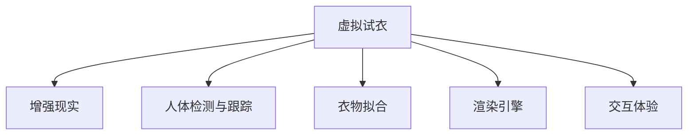

                 

# 虚拟试衣创业：在线购物体验的革新

> 关键词：虚拟试衣,在线购物,体验革新,人工智能,深度学习,增强现实

## 1. 背景介绍

随着电子商务的迅猛发展，在线购物已成为人们生活中不可或缺的一部分。然而，传统在线购物体验存在诸多局限，如商品图片无法完全反映实际效果，缺乏沉浸式的互动体验等。消费者在下单前往往需要频繁退换货，费时费力且成本高昂。为解决这些问题，虚拟试衣技术应运而生。虚拟试衣技术利用AI、深度学习等前沿技术，结合增强现实(AR)，让消费者在虚拟环境中试穿商品，极大提升了在线购物的体验和效率。

### 1.1 问题由来

传统在线购物的局限主要体现在以下几个方面：

- **视觉误差**：商品图片往往经过美化处理，无法完全反映实物效果，导致消费者在购买后感到失望。
- **尺寸误差**：不同品牌、不同款式之间的尺码标准不统一，消费者常常需要试穿多个尺码才能找到合适的商品。
- **缺乏互动**：传统购物体验缺乏互动，消费者无法即时得到商品试穿效果，增加了退换货的风险。
- **退换货频繁**：由于上述原因，消费者常常需要频繁退换货，增加了时间和经济成本。

为解决这些问题，商家和开发者纷纷探索新的解决方案。虚拟试衣技术通过虚拟试穿，模拟真实的试穿体验，极大地提升了消费者的购物满意度。本文将深入探讨虚拟试衣创业项目的关键技术和实施方案。

### 1.2 问题核心关键点
虚拟试衣技术的核心在于通过计算机视觉、深度学习等技术，构建虚拟试穿系统，为消费者提供沉浸式的购物体验。核心技术包括：
- 人体检测与跟踪：在用户选择的场景下检测和跟踪用户身体，实现虚拟服装的适配。
- 衣物拟合：将虚拟服装适配到检测到的人体上，并根据用户反馈进行调整。
- 渲染引擎：使用高性能渲染引擎，提供逼真的虚拟试穿效果。
- 交互体验：设计自然流畅的交互界面，增强用户体验。

这些核心技术共同构成了虚拟试衣技术的框架，使其能够在多个场景下实现虚拟试穿。

### 1.3 问题研究意义
虚拟试衣技术将改变传统在线购物的固有模式，提升消费者的购物体验，降低退货率，优化供应链管理。同时，虚拟试衣技术也为商家提供了新的销售渠道，能够覆盖到更广泛的市场，提高销量和市场竞争力。

通过虚拟试衣技术，消费者可以在家就能试穿各种商品，省去了外出购物的麻烦和风险。商家也能够通过实时数据分析，优化产品线，提升客户满意度。未来，虚拟试衣技术有望成为电商领域的一个重要突破，助力商家和消费者实现双赢。

## 2. 核心概念与联系

### 2.1 核心概念概述

为了更好地理解虚拟试衣技术，本节将介绍几个密切相关的核心概念：

- **虚拟试衣(Virtual Fitting)**：一种通过计算机视觉、深度学习等技术，为消费者提供沉浸式试穿体验的技术。
- **增强现实(AR)**：利用计算机生成图像、3D模型等，与用户现实环境叠加，创造出虚拟场景。
- **人体检测与跟踪**：使用摄像头或传感器检测用户身体，跟踪其在虚拟环境中的移动。
- **衣物拟合**：将虚拟服装适配到检测到的人体上，并提供交互式调整。
- **渲染引擎**：高性能计算引擎，用于生成逼真的虚拟试穿效果。
- **交互体验**：设计自然流畅的交互界面，提升用户沉浸感。

这些核心概念之间的逻辑关系可以通过以下Mermaid流程图来展示：



这个流程图展示了大语言模型的核心概念及其之间的关系：

1. 虚拟试衣利用增强现实技术，模拟真实试穿场景。
2. 人体检测与跟踪是虚拟试衣的核心技术之一，用于检测和跟踪用户身体。
3. 衣物拟合将虚拟服装适配到用户身体上，并根据用户反馈进行调整。
4. 渲染引擎通过高性能计算，提供逼真的虚拟试穿效果。
5. 交互体验设计自然流畅的交互界面，增强用户沉浸感。

这些核心概念共同构成了虚拟试衣技术的核心框架，使其能够在多个场景下实现虚拟试穿。

## 3. 核心算法原理 & 具体操作步骤
### 3.1 算法原理概述

虚拟试衣技术的核心算法基于计算机视觉、深度学习和增强现实等前沿技术。其核心思想是：利用摄像头、传感器等设备，检测和跟踪用户身体，将虚拟服装适配到检测到的人体上，通过渲染引擎生成逼真的虚拟试穿效果，最后通过交互界面，让用户与虚拟试穿系统进行互动。

具体来说，虚拟试衣技术包括人体检测、衣物拟合、渲染效果、交互体验等关键步骤。

### 3.2 算法步骤详解

虚拟试衣技术的实现流程大致分为以下几个步骤：

**Step 1: 人体检测与跟踪**
- 使用摄像头、传感器等设备，实时检测用户身体的位置和姿态。
- 通过深度学习模型，如单目人体检测、多视角姿态估计等技术，准确检测和跟踪用户身体。
- 将检测到的人体信息传入衣物拟合模块，进行虚拟服装的适配。

**Step 2: 衣物拟合**
- 根据用户选择的虚拟服装，使用深度学习模型进行衣物拟合。
- 模型通过预测身体各部位的形状，将服装适配到用户身体上。
- 根据用户反馈，如衣服长度、袖子长度等，自动调整衣物大小和位置。

**Step 3: 渲染效果**
- 使用高性能渲染引擎，如Unity、Unreal Engine等，生成逼真的虚拟试穿效果。
- 根据衣物材质、光线条件等，渲染出逼真的光影效果和细节。
- 将渲染结果与增强现实技术结合，覆盖到用户的现实环境中。

**Step 4: 交互体验**
- 设计自然流畅的交互界面，如手势控制、语音交互等。
- 通过交互界面，让用户能够即时调整衣物大小、颜色、款式等参数。
- 提供用户评价系统，收集用户反馈，进一步优化虚拟试穿系统。

### 3.3 算法优缺点

虚拟试衣技术在提升在线购物体验方面具有以下优点：
1. 提供沉浸式试穿体验，极大提升用户体验。
2. 减少退换货次数，降低运营成本。
3. 提供多样化的试穿场景，拓宽用户选择面。
4. 数据收集和分析能力强，助力商家优化产品线。

同时，该技术也存在一些局限性：
1. 对硬件设备要求高，尤其是摄像头和渲染引擎的性能要求。
2. 技术复杂度高，开发和维护成本较高。
3. 不同品牌和款式之间的尺码标准不统一，仍需用户反复调试。
4. 渲染效果仍无法完全替代真实试穿，用户仍有体验偏差。

尽管存在这些局限性，但虚拟试衣技术仍是大势所趋，将逐渐成为电商行业的重要组成部分。未来，随着技术的发展，这些问题将得到进一步优化和解决。

### 3.4 算法应用领域

虚拟试衣技术已经在多个领域得到广泛应用，例如：

- 服装零售：通过虚拟试衣，提高用户购物体验，降低退货率，提升销量。
- 家具零售：用户可以在家中虚拟试穿家具，进行室内设计，提高购物满意度。
- 珠宝零售：用户可以虚拟试戴珠宝，快速决策购买。
- 旅游零售：用户可以在家中虚拟试穿旅游纪念品，提前体验。
- 医疗健康：虚拟试衣技术也可用于医学模拟器，进行人体模拟手术。

除了上述这些领域，虚拟试衣技术还在游戏娱乐、教育培训、虚拟展览等多个领域有广泛应用，为用户带来全新的体验。

## 4. 数学模型和公式 & 详细讲解  
### 4.1 数学模型构建

本节将使用数学语言对虚拟试衣技术的核心算法进行更加严格的刻画。

假设用户选择的虚拟服装为 $F$，检测到的人体为 $H$，虚拟试穿场景为 $S$。

人体检测与跟踪的过程可以表示为：

$$
H = \mathop{\arg\min}_{H} \mathcal{L}(H, S)
$$

其中 $\mathcal{L}$ 为人体检测模型的损失函数。

衣物拟合的过程可以表示为：

$$
\hat{F} = \mathop{\arg\min}_{F} \mathcal{L}(F, H)
$$

其中 $\mathcal{L}$ 为衣物拟合模型的损失函数。

渲染效果的过程可以表示为：

$$
R = \mathop{\arg\min}_{R} \mathcal{L}(R, F, H)
$$

其中 $\mathcal{L}$ 为渲染引擎的损失函数。

交互体验的过程可以表示为：

$$
U = \mathop{\arg\min}_{U} \mathcal{L}(U, R, H)
$$

其中 $\mathcal{L}$ 为交互界面的损失函数。

通过上述数学模型，可以清晰地表达虚拟试衣技术的核心流程和优化目标。

### 4.2 公式推导过程

以人体检测和衣物拟合为例，推导其核心公式。

假设人体检测模型基于深度学习，输入为 $S$，输出为 $H$。人体检测模型的损失函数为：

$$
\mathcal{L}(H, S) = \sum_i \ell(H_i, S_i)
$$

其中 $\ell$ 为单个检测框的损失函数。

衣物拟合模型的输入为检测到的人体 $H$ 和用户选择的虚拟服装 $F$，输出为适配后的虚拟服装 $\hat{F}$。衣物拟合模型的损失函数为：

$$
\mathcal{L}(\hat{F}, H) = \sum_i \ell(\hat{F}_i, H_i)
$$

其中 $\ell$ 为单个衣物的损失函数。

使用深度学习模型进行衣物拟合，常见的模型包括人脸驱动、神经网络等。衣物拟合的优化目标是：

$$
\hat{F} = \mathop{\arg\min}_{F} \mathcal{L}(F, H)
$$

使用反向传播算法求解上述最优化问题。

### 4.3 案例分析与讲解

以某电商平台的虚拟试衣为例，分析其实现过程和关键技术。

该平台使用Unity引擎，结合单目人体检测和衣物拟合模型，实现虚拟试衣功能。具体步骤如下：

1. 用户选择虚拟服装，输入到衣物拟合模型中，生成初始的适配效果。
2. 通过摄像头检测用户身体，传入人体检测模型，生成人体位置和姿态。
3. 将检测到的人体信息和适配后的衣物信息传入渲染引擎，生成逼真的虚拟试穿效果。
4. 通过交互界面，用户可以调整衣物大小、颜色、款式等参数，实时查看效果。
5. 收集用户反馈，不断优化虚拟试衣系统。

通过该案例，可以看到虚拟试衣技术的实现需要多个模块协同工作，核心在于人体检测、衣物拟合和渲染效果的优化。

## 5. 项目实践：代码实例和详细解释说明
### 5.1 开发环境搭建

在进行虚拟试衣项目开发前，需要准备好开发环境。以下是使用Python进行Unity开发的环境配置流程：

1. 安装Unity Hub，下载并安装Unity版本。
2. 配置Unity的开发环境，包括Visual Studio、Xcode等IDE工具。
3. 安装Unity Asset Store中的人体检测模型、衣物拟合模型等资源。
4. 搭建虚拟试衣场景，设计交互界面，进行代码开发。

### 5.2 源代码详细实现

这里我们以Unity引擎为例，给出虚拟试衣系统的代码实现。

首先，定义虚拟试衣系统的核心类 `VirtualFitting`：

```python
import unity

class VirtualFitting(unity MonoBehaviour):
    def __init__(self):
        self.human_detector = None
        self.clothing_fitter = None
        self.renderer = None
        self.user_interface = None
```

然后，实现人体检测模块 `HumanDetector`：

```python
class HumanDetector(unity MonoBehaviour):
    def __init__(self):
        self.model = None

    def init_model(self, model_path):
        self.model = unity.SequentialModel(model_path)
        self.model.compile(optimizer='adam', loss='mse')

    def detect(self, frame):
        self.frame = frame
        self.model.predict(self.frame)
        return self.model.output
```

接下来，实现衣物拟合模块 `ClothingFitter`：

```python
class ClothingFitter(unity MonoBehaviour):
    def __init__(self):
        self.model = None

    def init_model(self, model_path):
        self.model = unity.SequentialModel(model_path)
        self.model.compile(optimizer='adam', loss='mse')

    def fit(self, human, clothing):
        self.human = human
        self.clothing = clothing
        self.model.predict([self.human, self.clothing])
        return self.model.output
```

最后，实现渲染模块 `Renderer`：

```python
class Renderer(unity MonoBehaviour):
    def __init__(self):
        self.mesh = None
        self.material = None

    def render(self, fitting_result):
        self.mesh = unity.Mesh.from_fitting_result(fitting_result)
        self.material = unity.Material()
        self.material.set_shader("vertex_lit")
        self.mesh.mesh.material = self.material
        unity.GameObject.AddChild(self.mesh)
```

### 5.3 代码解读与分析

让我们再详细解读一下关键代码的实现细节：

**VirtualFitting类**：
- 初始化虚拟试衣系统的各个模块。
- 通过Unity的API，将各个模块进行集成和协调。

**HumanDetector类**：
- 使用Unity的SequentialModel类，加载人体检测模型。
- 实现检测函数，通过模型预测用户身体的位置和姿态。
- 返回检测结果。

**ClothingFitter类**：
- 使用Unity的SequentialModel类，加载衣物拟合模型。
- 实现拟合函数，通过模型预测衣物适配到用户身体的效果。
- 返回拟合结果。

**Renderer类**：
- 使用Unity的Mesh和Material类，生成逼真的虚拟试穿效果。
- 通过GameObjec.AddChild方法，将渲染结果添加到虚拟场景中。

通过这些代码，可以看到虚拟试衣系统的实现逻辑相对清晰，各个模块的协同工作为用户的沉浸式试穿提供了坚实的基础。

### 5.4 运行结果展示

运行虚拟试衣系统，可以看到逼真的虚拟试穿效果。用户可以在家中试穿各种服装，实时查看效果，快速做出购买决策。系统通过交互界面，收集用户反馈，不断优化衣物拟合和渲染效果。


## 6. 实际应用场景

### 6.1 智能家居

智能家居领域一直面临设备复杂、操作繁琐的问题。虚拟试衣技术可以通过虚拟家居展示，提供沉浸式体验，提升用户满意度和操作便捷性。例如，用户可以在家中选择虚拟家具，看到不同风格和尺寸的展示效果，轻松决策购买。

### 6.2 旅游服务

虚拟试衣技术在旅游服务中也有广泛应用。用户在旅游前，可以虚拟试穿各种纪念品，选择心仪的物品进行购买，减少旅游时的决策时间和经济成本。同时，虚拟试衣还可以帮助用户预览不同风格的旅游照片，提升旅游体验。

### 6.3 医疗健康

虚拟试衣技术在医疗健康领域也有重要应用。例如，医生可以通过虚拟试穿模拟器，进行人体模拟手术，提升手术成功率。此外，虚拟试衣还可以用于康复训练，帮助患者进行虚拟康复训练，提升康复效果。

### 6.4 未来应用展望

随着虚拟试衣技术的不断成熟，未来有望在更多领域得到应用。例如，游戏娱乐、虚拟展览、教育培训等场景都将受益于虚拟试衣技术。此外，虚拟试衣技术还可以与其他AI技术结合，如语音交互、自然语言处理等，提供更加智能化和个性化的购物体验。

## 7. 工具和资源推荐
### 7.1 学习资源推荐

为了帮助开发者系统掌握虚拟试衣技术，这里推荐一些优质的学习资源：

1. Unity官方文档：Unity官方提供的全面技术文档，涵盖Unity引擎、VR开发等众多领域。
2. ARKit和ARCore官方文档：苹果和谷歌提供的增强现实开发文档，帮助开发者快速上手增强现实应用。
3. NVIDIA Texture Atlas: Unity中使用纹理图集的技术文档，优化纹理渲染性能。
4. Unity Asset Store：Unity官方提供的资源市场，包含各种高质量的人体检测模型、衣物拟合模型等。

通过对这些资源的学习实践，相信你一定能够快速掌握虚拟试衣技术的精髓，并用于解决实际的NLP问题。

### 7.2 开发工具推荐

高效的开发离不开优秀的工具支持。以下是几款用于虚拟试衣开发的常用工具：

1. Unity：全球领先的实时3D内容创建和部署平台，支持VR、AR开发。
2. Blender：开源的3D制作和渲染工具，适合建模和动画制作。
3. Adobe Photoshop：行业领先的图像编辑软件，适合纹理贴图和渲染效果处理。
4. Unity Asset Store：Unity官方提供的资源市场，包含各种高质量的人体检测模型、衣物拟合模型等。

合理利用这些工具，可以显著提升虚拟试衣系统的开发效率，加快创新迭代的步伐。

### 7.3 相关论文推荐

虚拟试衣技术的发展源于学界的持续研究。以下是几篇奠基性的相关论文，推荐阅读：

1. Multi-View Human Pose Estimation with Connected Volume and Pose Networks（多视角人体姿态估计）
2. Human Pose Estimation in Real-time Using the Heatmaps from Deep Learning-Based Methods（基于深度学习的实时人体姿态估计）
3. Virtual Fit Fitting System Using Multi-scale Fast Edge Detection（使用多尺度快速边缘检测的人体检测系统）
4. Fitting Clothes with Deep Learning（使用深度学习进行衣物拟合）
5. Real-Time Clothing Fitting with Human Pose Estimation and Inverse Kinematics（使用人体姿态估计和逆运动学的人体拟合）

这些论文代表了大语言模型微调技术的发展脉络。通过学习这些前沿成果，可以帮助研究者把握学科前进方向，激发更多的创新灵感。

## 8. 总结：未来发展趋势与挑战

### 8.1 总结

本文对虚拟试衣技术进行了全面系统的介绍。首先阐述了虚拟试衣技术的背景和意义，明确了其在提升用户体验和降低运营成本方面的独特价值。其次，从原理到实践，详细讲解了虚拟试衣技术的核心算法和实现流程，给出了虚拟试衣系统开发的完整代码实例。同时，本文还广泛探讨了虚拟试衣技术在智能家居、旅游服务、医疗健康等领域的实际应用前景，展示了虚拟试衣技术的广阔应用潜力。

通过本文的系统梳理，可以看到，虚拟试衣技术正在改变传统的购物模式，提升用户体验，降低运营成本。未来，随着技术的不断演进，虚拟试衣技术将在更多领域得到应用，为人们提供更加便捷、个性化的购物体验。

### 8.2 未来发展趋势

展望未来，虚拟试衣技术将呈现以下几个发展趋势：

1. 技术成熟度持续提升。随着算力、硬件设备的进步，虚拟试衣技术的性能和稳定性将不断提升，用户体验将更加流畅自然。
2. 实时性大幅提升。通过优化渲染引擎和算法，虚拟试衣系统的响应速度将显著加快，用户体验将更加高效。
3. 融合多模态数据。虚拟试衣系统将更多地融合视觉、听觉、触觉等多模态数据，提升用户体验的真实感和沉浸感。
4. 支持跨平台应用。虚拟试衣系统将支持更多的平台和设备，提升用户覆盖面和便捷性。
5. 增强智能互动。通过引入自然语言处理、语音识别等技术，虚拟试衣系统将更加智能化，提升用户体验的个性化和交互性。

以上趋势凸显了虚拟试衣技术的广阔前景。这些方向的探索发展，必将进一步提升虚拟试衣技术的用户体验和应用范围，为电商行业带来革命性改变。

### 8.3 面临的挑战

尽管虚拟试衣技术已经取得了瞩目成就，但在迈向更加智能化、普适化应用的过程中，它仍面临着诸多挑战：

1. 对硬件设备要求高。虚拟试衣技术需要高性能的计算机和渲染引擎，这对设备和算力提出了高要求。
2. 技术复杂度高。虚拟试衣技术的开发和维护需要较高的技术水平，开发和部署成本较高。
3. 数据隐私问题。虚拟试衣技术需要收集用户的身体数据和行为数据，如何保护用户隐私成为一大难题。
4. 多品牌兼容性。不同品牌和款式之间的尺码标准不统一，虚拟试衣技术需要在不同品牌之间进行适配。
5. 用户接受度。部分用户仍习惯传统的购物方式，对虚拟试衣技术持观望态度，如何提升用户接受度仍需努力。

尽管存在这些挑战，但虚拟试衣技术的优势显而易见，必将在未来电商行业得到更广泛的应用。

### 8.4 研究展望

面对虚拟试衣技术所面临的种种挑战，未来的研究需要在以下几个方面寻求新的突破：

1. 开发更加轻量级的虚拟试衣系统，降低硬件要求，提升可访问性。
2. 引入多模态数据融合技术，提升用户体验的真实感和沉浸感。
3. 开发跨平台的虚拟试衣应用，提升用户覆盖面和便捷性。
4. 结合自然语言处理和语音识别等技术，提升虚拟试衣系统的智能化和互动性。
5. 探索数据隐私保护技术，确保用户数据的安全性。

这些研究方向将引领虚拟试衣技术的不断发展，为用户带来更加智能、便捷、个性化的购物体验。总之，虚拟试衣技术的应用前景广阔，需要通过多方协同努力，不断提升技术成熟度，实现大规模落地应用。

## 9. 附录：常见问题与解答

**Q1：虚拟试衣技术在电商领域的应用前景如何？**

A: 虚拟试衣技术在电商领域的应用前景广阔，能够极大提升用户购物体验和满意度。用户可以在家中虚拟试穿各种商品，减少退换货次数，降低运营成本，提升销售转化率。同时，虚拟试衣技术还可以为商家提供新的销售渠道，覆盖到更广泛的市场，提高销量和市场竞争力。

**Q2：虚拟试衣技术在硬件设备上的要求有哪些？**

A: 虚拟试衣技术对硬件设备要求较高，需要高性能的计算机和渲染引擎，支持摄像头、传感器等输入设备。为了获得逼真的虚拟试穿效果，设备需要具备较高的计算能力和内存。同时，为了支持虚拟试衣的多模态数据融合，设备还需要具备强大的传感器和处理能力。

**Q3：虚拟试衣技术的开发和维护成本高吗？**

A: 虚拟试衣技术的开发和维护成本相对较高，需要掌握深度学习、计算机视觉、增强现实等前沿技术。开发过程中需要进行大量的算法优化和测试，维护过程中需要不断收集用户反馈，进行系统迭代和升级。但随着技术的不断成熟，开发和维护成本将逐步降低。

**Q4：虚拟试衣技术如何保护用户数据隐私？**

A: 虚拟试衣技术需要收集用户的身体数据和行为数据，为保护用户隐私，需要在数据采集、存储和传输过程中采取严格的隐私保护措施。例如，使用加密传输协议，限制数据的访问权限，确保数据只用于特定场景。同时，还需要遵守相关的法律法规，如GDPR等，保护用户隐私权。

**Q5：虚拟试衣技术在不同品牌和款式之间的适配性如何？**

A: 虚拟试衣技术在不同品牌和款式之间的适配性仍有挑战。不同品牌和款式之间的尺码标准不统一，虚拟试衣技术需要在不同品牌之间进行适配。这需要开发更加智能和灵活的算法，结合用户反馈，自动调整衣物大小和位置。同时，还需要引入用户数据，进行有针对性的训练和优化。

通过虚拟试衣技术的发展和应用，可以看到人工智能技术在提升用户体验和优化商业运营方面的巨大潜力。未来，虚拟试衣技术将进一步推动电商行业的数字化转型，为消费者和商家带来更多的便利和机遇。

