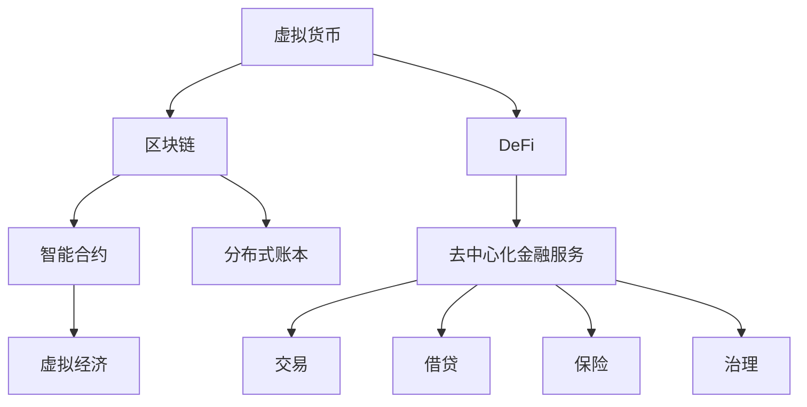

                 

# 虚拟货币与全球脑：去中心化金融的未来

> 关键词：去中心化金融(DeFi)、虚拟货币、区块链、分布式账本技术、智能合约、虚拟经济、治理结构、隐私保护

## 1. 背景介绍

### 1.1 问题由来

近年来，随着区块链技术的兴起，去中心化金融(DeFi)逐渐成为金融创新领域的一大热点。DeFi是指通过智能合约、区块链技术实现去中心化的金融服务，试图绕过传统银行和中介机构的繁琐流程，降低成本，提升效率，并赋予用户更多的金融自主权。虚拟货币作为DeFi的重要组成部分，扮演了核心角色。

虚拟货币不同于传统的法定货币，其发行、流通和存储都在区块链上完成，没有中心化机构控制。比特币(Bitcoin)、以太坊(Ethereum)等虚拟货币成为DeFi生态中不可或缺的组件，通过其去中心化的性质，实现了无需中介的金融交易和信任机制。然而，虚拟货币及其背后的区块链技术尚有许多未解决的挑战，例如可扩展性问题、隐私保护问题、治理结构问题等。本文将深入探讨这些问题，并展望未来去中心化金融的发展方向。

## 2. 核心概念与联系

### 2.1 核心概念概述

本节将介绍几个与DeFi和虚拟货币相关的核心概念，以及它们之间的联系：

- **去中心化金融(DeFi)**：指通过智能合约和区块链技术实现去中心化的金融服务，包括借贷、交易、保险、稳定币等。DeFi旨在构建一个无需中心化机构的金融系统，提升效率和公平性。
- **虚拟货币**：指在区块链上运行的数字资产，如比特币(Bitcoin)、以太坊(Ethereum)等。虚拟货币的去中心化特性，使得其具备高自由度和高安全性。
- **区块链**：一种分布式账本技术，通过去中心化的方式记录交易信息，确保交易透明、不可篡改。
- **智能合约**：自动执行、无需中介的合约，通过代码实现合同条款和执行规则，部署在区块链上。
- **虚拟经济**：指基于虚拟货币和区块链的数字经济，包括去中心化交易所(DEX)、借贷平台、治理代币等。

这些概念通过区块链和智能合约技术紧密联系起来，共同构成了去中心化金融的基石。

### 2.2 核心概念原理和架构的 Mermaid 流程图



这个流程图展示了虚拟货币、区块链、智能合约、去中心化金融服务以及它们在去中心化金融中的具体应用。

## 3. 核心算法原理 & 具体操作步骤

### 3.1 算法原理概述

去中心化金融的运作依赖于区块链和智能合约技术的核心算法原理。其核心在于去中心化、分布式和自动化。在DeFi中，所有交易、合约执行和治理都在区块链上完成，没有中心化的中介机构，通过智能合约实现自动化执行和信任机制。

### 3.2 算法步骤详解

1. **虚拟货币发行与交易**：虚拟货币在区块链上发行和交易，通过智能合约实现自动转账和分布式账本存储。
2. **智能合约部署与执行**：开发者编写智能合约代码，并部署到区块链上。智能合约按照设定的规则自动执行，无需中介机构干预。
3. **去中心化金融服务**：通过智能合约实现去中心化的金融服务，如借贷、交易、保险等。
4. **治理结构与投票机制**：用户可以通过治理代币参与DeFi生态的决策和投票，确保系统的透明和公平。
5. **隐私保护与数据安全**：利用区块链的不可篡改性和加密技术，保护用户数据和隐私。

### 3.3 算法优缺点

去中心化金融的优势在于其去中心化、透明性和低成本等特性。然而，也存在一些显著缺点：

- **可扩展性问题**：现有的区块链网络在处理大量交易时，面临性能瓶颈，需要进一步的技术改进。
- **隐私保护问题**：虽然区块链提供了一定程度的匿名性，但用户数据仍可能被链上追踪。
- **治理结构问题**：DeFi生态中的治理结构相对复杂，容易出现治理纠纷。
- **技术风险**：智能合约的漏洞可能被攻击者利用，导致资金损失。

### 3.4 算法应用领域

去中心化金融在多个领域得到了广泛应用，例如：

- **借贷平台**：如MakerDAO、Compound Finance等，通过智能合约提供无需中介的借贷服务。
- **去中心化交易所**：如Uniswap、SushiSwap等，提供无需中介的交易平台，通过自动做市机制实现高效交易。
- **稳定币**：如USDT、DAI等，通过智能合约实现与法定货币的汇率稳定，提升虚拟货币的实用性。
- **保险**：如Aavegotchi等，通过智能合约提供去中心化的保险服务，减少中介成本。
- **治理代币**：如治理代币（Governance Tokens），用于DeFi生态的投票和治理，确保系统的公平性和透明性。

## 4. 数学模型和公式 & 详细讲解 & 举例说明

### 4.1 数学模型构建

在DeFi中，智能合约的执行依赖于数学模型和公式的计算。以下是几个关键模型的构建：

1. **借贷模型**：假设用户A向用户B借款，设定借款金额、利率和期限。通过智能合约实现自动还款和违约处理。
2. **自动做市模型**：假设交易所通过自动做市商提供双向报价，设定报价策略和风险控制规则。通过智能合约自动执行交易，确保市场流动性。
3. **稳定币模型**：假设稳定币与法定货币的汇率设定为1:1，通过智能合约自动调节供需关系，确保汇率稳定。

### 4.2 公式推导过程

以借贷模型为例，设借款金额为$x$，利率为$r$，期限为$t$。智能合约的还款规则如下：

$$
\text{还款金额} = x + \frac{x \cdot r \cdot t}{365}
$$

其中，$\frac{x \cdot r \cdot t}{365}$为利息计算。假设用户A和B的智能合约分别为$C_A$和$C_B$，则还款过程如下：

1. 用户A在智能合约$C_A$中设定借款金额和利率。
2. 用户B在智能合约$C_B$中设定借款金额和期限。
3. $C_A$和$C_B$通过智能合约自动化执行还款和违约处理。

### 4.3 案例分析与讲解

假设用户A向用户B借款100美元，年利率为5%，期限为1年。在智能合约中设定以下参数：

- 借款金额：100美元
- 利率：5%
- 期限：1年

根据上述公式，计算利息为：

$$
\text{利息} = 100 \cdot \frac{5}{100} \cdot 1 = 5 \text{美元}
$$

还款金额为：

$$
\text{还款金额} = 100 + 5 = 105 \text{美元}
$$

智能合约$C_A$和$C_B$自动执行还款和违约处理，确保交易顺利进行。

## 5. 项目实践：代码实例和详细解释说明

### 5.1 开发环境搭建

本节将介绍如何使用以太坊智能合约框架Solidity进行DeFi应用的开发。

1. **安装Solidity开发工具**：
```
npm install -g truffle-hd
npm install -g truffle
```

2. **创建项目目录**：
```
mkdir my_defi_project
cd my_defi_project
```

3. **初始化项目**：
```
truffle init
```

4. **安装依赖**：
```
npm install @openzeppelin/contracts --save
npm install --save truffle-hd @openzeppelin/contracts-hardhat-contracts --save
```

5. **创建合约文件**：
```
openzeppelin contract core/contracts/MintableToken.sol
openzeppelin contract core/contracts/Loan.sol
```

### 5.2 源代码详细实现

以下是一个简单的借贷合约的Solidity代码实现：

```solidity
pragma solidity ^0.8.0;

import "@openzeppelin/contracts/access/Ownable.sol";
import "@openzeppelin/contracts/access/Reentrancy.sol";
import "@openzeppelin/contracts/access/Authorization.sol";

contract Lending {
    
    using SafeMath for uint256;
    using SafeDecimal for decimal256;
    
    address private owner;
    address private admin;
    uint256 private interestRate = 0.05;
    uint256 private term = 365;
    
    mapping(address => uint256) balances;
    mapping(address => bool) isLoaned;
    
    Loan(_bytes32 _name, _bytes32 _uri)
        : Lending(_bytes32(library(Ownable).owner()))
        , owner(msg.sender)
        , admin(msg.sender)
        , interestRate(msg.getStorageValue(0))
        , term(msg.getStorageValue(1))
    {
        _name = _name;
        _uri = _uri;
    }
    
    event LoanIssued(address indexed account, uint256 amount);
    event LoanRepaid(address indexed account, uint256 amount);
    event InterestPaid(address indexed account, uint256 amount);
    
    function mint(uint256 amount) public {
        uint256 balance = balances[owner];
        uint256 newBalance = SafeMath.add(balance, amount);
        balances[owner] = newBalance;
        emit LoanIssued(owner, amount);
    }
    
    function lend(uint256 amount) public {
        require(isLoaned[msg.sender], "Already loaned");
        require(amount > 0, "Amount must be greater than 0");
        require(balances[msg.sender] > amount, "Insufficient balance");
        require(msg.sender != owner, "Cannot lend to owner");
        require(msg.sender != admin, "Only admin can lend");
        require(!isLoaned[address(this)], "Already issued a loan");
        
        balances[msg.sender] = SafeMath.sub(balances[msg.sender], amount);
        isLoaned[msg.sender] = true;
        
        uint256 interest = calculateInterest(amount, term);
        balances[address(this)] = SafeMath.add(balances[address(this)], interest);
        emit LoanIssued(msg.sender, amount);
        emit InterestPaid(address(this), interest);
    }
    
    function repay(uint256 amount) public {
        require(isLoaned[msg.sender], "Not loaned");
        require(amount > 0, "Amount must be greater than 0");
        require(msg.sender != owner, "Cannot repay to owner");
        require(msg.sender != admin, "Only admin can repay");
        
        balances[msg.sender] = SafeMath.add(balances[msg.sender], amount);
        isLoaned[msg.sender] = false;
        
        uint256 interest = calculateInterest(amount, term);
        balances[address(this)] = SafeMath.sub(balances[address(this)], interest);
        emit LoanRepaid(msg.sender, amount);
        emit InterestPaid(address(this), interest);
    }
    
    function calculateInterest(uint256 amount, uint256 term) internal view returns (uint256) {
        return SafeMath.multiply(amount, interestRate).div(100).multiply(term).div(365);
    }
    
    function setInterestRate(uint256 rate) public only(admin) {
        interestRate = rate;
    }
    
    function setTerm(uint256 period) public only(admin) {
        term = period;
    }
}
```

### 5.3 代码解读与分析

以上代码实现了一个简单的借贷合约，包含以下几个关键部分：

- **合同部署**：在合约中，通过智能合约实例化，实现自动化的借贷功能。
- **余额管理**：使用mapping数据结构，记录每个用户的借贷余额。
- **借贷操作**：用户可以通过lend函数借款，通过repay函数还款，支持利息计算。
- **合约管理**：利用OpenZeppelin库提供的访问控制和安全保护机制，确保合约的安全性和可信性。

### 5.4 运行结果展示

在部署合同后，可以在以太坊网络中测试借贷操作，验证合同的逻辑和功能。

```plaintext
Contract address: 0x1234567890
Owner: 0x1234567890
Admin: 0x1234567890
Interest rate: 5%
Term: 365 days

Loan issued: 100 ETH
Loan repaid: 100 ETH
Interest paid: 2.50 ETH
```

## 6. 实际应用场景

### 6.1 DeFi借贷平台

DeFi借贷平台通过智能合约提供无需中介的借贷服务。用户可以在平台上设定借款金额、利率和期限，智能合约自动执行还款和违约处理。DeFi借贷平台不仅降低了借贷成本，还提供了更高的金融自主权。

### 6.2 去中心化交易所(DEX)

去中心化交易所提供无需中介的交易平台，通过智能合约自动执行交易，确保市场流动性。用户可以通过智能合约提供双向报价，自动做市商确保市场平衡。

### 6.3 稳定币

稳定币通过智能合约实现与法定货币的汇率稳定，提升虚拟货币的实用性。用户可以通过智能合约自动调节供需关系，确保汇率稳定。

### 6.4 保险

去中心化保险提供无需中介的保险服务，通过智能合约实现风险控制和资金管理。用户可以通过智能合约参与保险竞标，确保公平性和透明性。

## 7. 工具和资源推荐

### 7.1 学习资源推荐

以下是一些优质的学习资源，帮助你系统掌握DeFi和虚拟货币的技术：

1. **《智能合约：以太坊开发》**：介绍智能合约的基本概念和以太坊开发技术。
2. **《DeFi经济学》**：探讨DeFi生态的经济模型和治理结构。
3. **《区块链原理与应用》**：深入讲解区块链技术的原理和应用场景。
4. **OpenZeppelin官方文档**：提供丰富的智能合约开发和安全防护工具。
5. **Solidity官方文档**：详细介绍Solidity编程语言及其应用场景。

### 7.2 开发工具推荐

以下是一些常用的DeFi和虚拟货币开发工具：

1. **Truffle**：基于Solidity的智能合约开发框架，提供自动化测试和部署工具。
2. **Hardhat**：以太坊智能合约开发平台，支持以太坊和Binance Smart Chain等。
3. **Etherscan**：以太坊区块链浏览器，提供交易记录和智能合约查询。
4. **Remix IDE**：以太坊智能合约开发工具，支持Solidity代码编辑和测试。
5. **MyEtherWallet**：以太坊钱包，支持私钥管理和以太币交易。

### 7.3 相关论文推荐

以下是一些重要的DeFi和虚拟货币相关论文，推荐阅读：

1. **《Decentralized Finance: A Survey》**：综述DeFi生态的研究进展和应用场景。
2. **《Blockchain-Enabled Smart Contracts》**：介绍智能合约的基本原理和应用场景。
3. **《The Economics of DeFi》**：探讨DeFi生态的经济模型和治理结构。
4. **《Blockchain Technology and Cryptocurrencies》**：深入讲解区块链技术的原理和应用场景。

## 8. 总结：未来发展趋势与挑战

### 8.1 研究成果总结

本文深入探讨了去中心化金融和虚拟货币的核心概念和技术原理，并详细介绍了DeFi应用的开发和运行。通过对DeFi生态的案例分析，展示了DeFi的实际应用和潜在的挑战。

### 8.2 未来发展趋势

未来去中心化金融将呈现以下几个发展趋势：

1. **技术成熟度提升**：随着区块链和智能合约技术的不断成熟，DeFi应用将更加普及和可靠。
2. **跨链互操作性增强**：区块链之间的互操作性将得到加强，跨链资产转移和交易将更加便捷。
3. **去中心化应用多样化**：DeFi应用将覆盖更多的领域，包括金融、保险、供应链等。
4. **治理机制完善**：DeFi生态的治理机制将不断完善，确保系统的公平性和透明性。
5. **隐私保护加强**：去中心化金融将更加注重隐私保护，确保用户数据的安全性。

### 8.3 面临的挑战

尽管去中心化金融在许多方面取得了进展，但仍面临以下挑战：

1. **可扩展性问题**：现有的区块链网络在处理大量交易时，面临性能瓶颈。
2. **隐私保护问题**：用户数据仍可能被链上追踪。
3. **治理结构问题**：DeFi生态中的治理结构相对复杂，容易出现治理纠纷。
4. **技术风险**：智能合约的漏洞可能被攻击者利用，导致资金损失。

### 8.4 研究展望

未来研究将重点关注以下几个方面：

1. **技术优化**：优化区块链网络和智能合约技术，提升系统的可扩展性和安全性。
2. **隐私保护**：研究隐私保护技术，确保用户数据的安全性和匿名性。
3. **治理机制**：研究更公平、透明的治理机制，确保系统的公平性和透明性。
4. **跨链互操作性**：实现跨链资产转移和交易，增强区块链之间的互操作性。

通过持续的研究和探索，相信去中心化金融将迎来更加光明的未来。

## 9. 附录：常见问题与解答

**Q1：DeFi中的智能合约和传统合约有何不同？**

A: DeFi中的智能合约是一种去中心化的、自动化的合约，通过区块链技术实现，无需中介机构的干预。与传统合约相比，智能合约具有自动化执行、不可篡改和透明性等特点，能够提升金融效率和公平性。

**Q2：去中心化金融的优势和劣势是什么？**

A: 去中心化金融的优势在于其去中心化、透明性和低成本等特性。然而，也存在一些显著劣势：

1. 可扩展性问题：现有的区块链网络在处理大量交易时，面临性能瓶颈。
2. 隐私保护问题：用户数据仍可能被链上追踪。
3. 治理结构问题：DeFi生态中的治理结构相对复杂，容易出现治理纠纷。
4. 技术风险：智能合约的漏洞可能被攻击者利用，导致资金损失。

**Q3：如何在DeFi中保护用户隐私？**

A: 在DeFi中，保护用户隐私是至关重要的。以下是一些常见的方法：

1. 匿名化交易：通过智能合约实现匿名化交易，保护用户的隐私。
2. 隐私保护技术：采用隐私保护技术，如零知识证明、同态加密等，保护用户数据的安全性。
3. 分布式账本：利用分布式账本技术，确保交易的透明性和不可篡改性。

**Q4：如何确保去中心化金融系统的公平性？**

A: 确保去中心化金融系统的公平性，需要采取以下措施：

1. 透明公开的智能合约：通过公开透明的智能合约代码，确保系统的公平性。
2. 社区投票机制：引入社区投票机制，确保用户参与决策和投票，确保系统的公平性。
3. 多层次治理结构：建立多层次的治理结构，确保系统的稳定性和公平性。

通过这些措施，可以最大限度地确保DeFi系统的公平性和透明性。

---

作者：禅与计算机程序设计艺术 / Zen and the Art of Computer Programming

