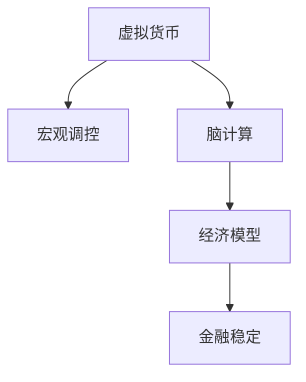

                 

# 虚拟货币宏观调控:全球脑时代的经济稳定机制

> 关键词：虚拟货币,宏观调控,金融稳定,脑计算,经济模型

## 1. 背景介绍

### 1.1 问题由来
随着科技的飞速发展，虚拟货币作为一种新型金融工具逐渐崛起。自比特币问世以来，虚拟货币市场经历了多次剧烈波动，带来了巨大的市场风险和经济不确定性。虚拟货币的“去中心化”特性，使得传统的金融监管手段难以发挥作用，进而对全球金融稳定构成了新的挑战。

如何有效监管虚拟货币，成为各国政府和金融监管机构亟需解决的重大课题。同时，全球脑时代的到来，伴随着大数据、人工智能、区块链等前沿科技的融合，为虚拟货币宏观调控提供了新的机遇和挑战。

### 1.2 问题核心关键点
1. **虚拟货币的特性**：去中心化、可编程、易流通等特性，使得其对传统金融市场具有颠覆性影响。
2. **宏观调控的目标**：控制通货膨胀、防止经济波动、维护金融稳定。
3. **脑时代的背景**：大数据、人工智能、区块链等技术的应用，为虚拟货币的监管和调控提供了新的工具和方法。
4. **经济模型的构建**：基于宏观经济学和金融学原理，建立虚拟货币调控模型，辅助决策。
5. **模型优化与参数调整**：利用脑计算技术，优化模型，提高调控的精准性和效率。

### 1.3 问题研究意义
研究虚拟货币宏观调控，对于维护全球金融稳定、提升经济治理能力、推动金融科技发展，具有重要意义：

1. **金融稳定**：通过科学调控，控制虚拟货币市场波动，防范系统性风险。
2. **政策优化**：为政府和监管机构提供数据支持，优化宏观调控政策。
3. **技术创新**：推动大数据、人工智能、区块链等前沿科技在金融领域的应用，促进技术进步。
4. **产业升级**：引导虚拟货币市场健康发展，促进相关产业升级转型。
5. **社会效应**：提升金融科技普及度，改善居民生活质量，推动社会公平公正。

## 2. 核心概念与联系

### 2.1 核心概念概述

为更好地理解虚拟货币宏观调控，本节将介绍几个密切相关的核心概念：

- **虚拟货币**：基于区块链技术，去中心化、匿名化的数字货币。
- **宏观调控**：政府和监管机构为实现经济目标，对货币供应、信贷规模、市场利率等进行的政策干预。
- **脑计算**：利用人脑结构、功能和计算能力，通过神经网络、深度学习等方法，解决复杂问题的计算模型。
- **经济模型**：基于经济理论，构建数学模型，描述经济现象，辅助决策。
- **金融稳定**：金融市场平稳运行，金融系统稳定，能够有效应对外部冲击。

这些核心概念之间的逻辑关系可以通过以下Mermaid流程图来展示：



这个流程图展示了大规模虚拟货币、宏观调控、脑计算、经济模型与金融稳定之间的联系。

## 3. 核心算法原理 & 具体操作步骤
### 3.1 算法原理概述

虚拟货币宏观调控的算法核心是构建经济模型，利用脑计算技术优化模型参数，最终通过宏观调控政策实现金融稳定。其基本流程如下：

1. **数据收集**：收集虚拟货币交易数据、市场波动数据、宏观经济数据等。
2. **模型构建**：基于宏观经济学原理，构建虚拟货币调控的数学模型。
3. **参数优化**：利用脑计算技术，优化模型参数，提高模型预测精度。
4. **政策制定**：根据模型预测结果，制定宏观调控政策。
5. **效果评估**：评估调控效果，调整模型和政策，进入下一个循环。

### 3.2 算法步骤详解

虚拟货币宏观调控的算法步骤如下：

**Step 1: 数据准备**

- 收集虚拟货币交易数据，如交易量、价格波动、流动性等。
- 收集宏观经济数据，如GDP、失业率、通货膨胀率等。
- 收集市场波动数据，如市场情绪指数、政策变动等。

**Step 2: 模型构建**

- 建立虚拟货币调控的经济模型，如IS-LM模型、货币供需模型等。
- 确定模型参数，如利率、货币供应量、信贷规模等。
- 确定模型假设，如理性预期、市场效率等。

**Step 3: 参数优化**

- 利用脑计算技术，如神经网络、深度学习等，优化模型参数。
- 确定优化目标，如最小化预测误差、最大化经济稳定度等。
- 确定优化方法，如梯度下降、遗传算法等。

**Step 4: 政策制定**

- 根据模型预测结果，制定宏观调控政策，如货币政策、财政政策等。
- 确定政策实施时间、力度、范围等。
- 确定政策评估指标，如通货膨胀率、失业率等。

**Step 5: 效果评估**

- 收集虚拟货币市场数据，评估调控效果。
- 比较政策前后的数据差异，判断调控政策是否有效。
- 根据评估结果，调整模型和政策，进入下一个循环。

### 3.3 算法优缺点

虚拟货币宏观调控的算法具有以下优点：

1. **精准预测**：通过脑计算技术优化模型参数，提高预测精度。
2. **灵活调控**：基于经济模型构建调控策略，实现动态调整。
3. **自动化决策**：利用计算模型辅助决策，减少人为误差。
4. **实时监控**：通过数据实时收集和分析，及时发现问题并调整。

同时，该算法也存在一定的局限性：

1. **数据依赖**：模型预测精度依赖于数据质量，数据缺失或不准确会影响预测效果。
2. **模型复杂**：构建和优化经济模型需要大量计算资源，模型复杂度较高。
3. **政策滞后**：模型预测和政策制定之间存在时间滞后，政策效果可能滞后于预期。
4. **不可预测性**：虚拟货币市场具有高度不确定性，模型难以完全预测市场行为。
5. **伦理考量**：算法决策可能带来伦理问题，如数据隐私、算法歧视等。

尽管存在这些局限性，但虚拟货币宏观调控的算法在理论和实践中都有重要价值，为维护金融稳定提供了新的工具和方法。

### 3.4 算法应用领域

虚拟货币宏观调控的算法在以下领域有广泛应用：

1. **中央银行**：利用经济模型和脑计算技术，优化货币政策，控制通货膨胀，防范金融风险。
2. **监管机构**：实时监控虚拟货币市场波动，制定监管政策，防范洗钱、欺诈等违法活动。
3. **金融机构**：利用模型预测市场趋势，优化资产配置，防范投资风险。
4. **学术研究**：进行虚拟货币调控的模拟实验，探索最佳调控策略。
5. **政府决策**：为政府提供数据支持，优化宏观经济调控政策。

## 4. 数学模型和公式 & 详细讲解  
### 4.1 数学模型构建

本节将使用数学语言对虚拟货币宏观调控的算法过程进行更加严格的刻画。

记虚拟货币市场为 $M$，交易量为 $V_t$，价格为 $P_t$，货币供应量为 $M_t$，市场利率为 $r_t$，通货膨胀率为 $\pi_t$，失业率为 $u_t$。假设市场满足理性预期假设，即市场参与者对未来价格有准确预期。

根据宏观经济学原理，虚拟货币市场中的供需关系可以表示为：

$$
V_t = S(P_t) - D(P_t)
$$

其中 $S(P_t)$ 为市场供给函数，$D(P_t)$ 为市场需求函数。

货币供应量 $M_t$ 与市场价格 $P_t$ 的关系可以表示为：

$$
M_t = M_0 \times \beta(P_t)
$$

其中 $M_0$ 为初始货币供应量，$\beta(P_t)$ 为货币供应量与市场价格的关系函数。

市场利率 $r_t$ 与货币供应量 $M_t$ 的关系可以表示为：

$$
r_t = r_f + \alpha(M_t - M_0)
$$

其中 $r_f$ 为无风险利率，$\alpha$ 为货币供应量对利率的影响系数。

通货膨胀率 $\pi_t$ 与市场价格 $P_t$ 的关系可以表示为：

$$
\pi_t = \gamma(P_t - P_{t-1})
$$

其中 $\gamma$ 为价格变动对通货膨胀率的影响系数。

失业率 $u_t$ 与市场价格 $P_t$ 的关系可以表示为：

$$
u_t = \delta(P_t - P_{t-1})
$$

其中 $\delta$ 为价格变动对失业率的影响系数。

这些关系可以表示为一个系统微分方程组：

$$
\begin{cases}
\frac{dV_t}{dt} = S(P_t) - D(P_t) \\
\frac{dM_t}{dt} = M_0 \times \beta(P_t) \\
\frac{dr_t}{dt} = \alpha(M_t - M_0) \\
\frac{dP_t}{dt} = S(P_t) - D(P_t) \\
\frac{d\pi_t}{dt} = \gamma(P_t - P_{t-1}) \\
\frac{du_t}{dt} = \delta(P_t - P_{t-1})
\end{cases}
$$

### 4.2 公式推导过程

以下我们以IS-LM模型为例，推导货币供应量 $M_t$ 和市场利率 $r_t$ 的关系。

**IS曲线**

假设市场供给函数 $S(P_t)$ 为线性函数，市场需求函数 $D(P_t)$ 也为线性函数，可以表示为：

$$
S(P_t) = a + bP_t
$$
$$
D(P_t) = c - dP_t
$$

其中 $a, b, c, d$ 为常数。

根据市场供需关系，可以得到：

$$
V_t = a + (b-d)P_t
$$

市场均衡时，$V_t = 0$，即：

$$
a + (b-d)P_t = 0
$$

解得：

$$
P_t = -\frac{a}{b-d}
$$

代入货币供应量与市场价格的关系 $M_t = M_0 \times \beta(P_t)$，可以得到：

$$
M_t = M_0 \times \beta(-\frac{a}{b-d})
$$

**LM曲线**

市场利率 $r_t$ 与货币供应量 $M_t$ 的关系可以表示为：

$$
r_t = r_f + \alpha(M_t - M_0)
$$

根据货币市场均衡条件，有：

$$
r_t = \frac{M_t}{V_t} - r_f
$$

代入 $V_t = a + (b-d)P_t$ 和 $P_t = -\frac{a}{b-d}$，可以得到：

$$
r_t = \frac{M_t}{a + (b-d)(-\frac{a}{b-d})} - r_f
$$

化简得：

$$
r_t = \alpha(M_t - M_0) + r_f
$$

这些推导过程展示了虚拟货币市场的基本经济模型，为后续的参数优化和调控政策制定提供了数学基础。

### 4.3 案例分析与讲解

**案例分析**

假设有虚拟货币市场，其初始货币供应量为 $M_0 = 1000$，初始价格为 $P_0 = 100$。市场供给函数 $S(P_t) = 1 + 0.1P_t$，市场需求函数 $D(P_t) = 0.9 - 0.01P_t$。假设无风险利率 $r_f = 0.01$，货币供应量对利率的影响系数 $\alpha = 0.1$。根据上述模型，可以得到市场利率和虚拟货币价格的演化过程。

**讲解**

1. **市场供需关系**：市场供给函数和需求函数决定了市场价格和交易量的关系。
2. **货币供应量**：货币供应量的变化直接影响市场利率。
3. **无风险利率**：无风险利率是市场基准利率，影响市场利率。
4. **调控政策**：通过调整货币供应量或利率，可以影响市场价格和交易量。

## 5. 项目实践：代码实例和详细解释说明
### 5.1 开发环境搭建

在进行虚拟货币宏观调控的项目实践前，我们需要准备好开发环境。以下是使用Python进行数据分析和建模的环境配置流程：

1. 安装Anaconda：从官网下载并安装Anaconda，用于创建独立的Python环境。

2. 创建并激活虚拟环境：
```bash
conda create -n vcf eco virtualenv python=3.8 
conda activate vcf eco virtualenv
```

3. 安装相关库：
```bash
pip install numpy pandas sympy matplotlib jupyter notebook ipython
```

完成上述步骤后，即可在`vcf eco virtualenv`环境中开始项目实践。

### 5.2 源代码详细实现

这里我们以IS-LM模型为例，使用Sympy库对虚拟货币市场进行建模和模拟。

首先，导入必要的库和模块：

```python
import sympy as sp
from sympy import symbols, Eq, solve, diff
```

然后，定义符号变量：

```python
P, M, V, r, a, b, c, d, r_f, alpha = symbols('P M V r a b c d r_f alpha')
```

接下来，建立虚拟货币市场的微分方程组：

```python
# 市场供需关系
eq1 = Eq(V, a + (b - d) * P)

# 货币供应量与价格的关系
eq2 = Eq(M, M_0 * beta(P))

# 市场利率与货币供应量的关系
eq3 = Eq(r, r_f + alpha * (M - M_0))

# 市场价格的变化
eq4 = Eq(V, a + (b - d) * P)

# 通货膨胀率
eq5 = Eq(pi, gamma * (P - P_0))

# 失业率
eq6 = Eq(u, delta * (P - P_0))

# 解方程组
solution = sp.solve([eq1, eq2, eq3, eq4, eq5, eq6], (P, M, r))
```

使用Sympy求解微分方程组，得到市场价格、货币供应量和利率的解：

```python
# 输出解
solution
```

最后，根据解的结果，模拟市场价格和利率的演化过程：

```python
# 初始条件
M_0 = 1000
P_0 = 100
a = 1
b = 0.1
c = 0.9
d = 0.01
r_f = 0.01
alpha = 0.1
gamma = 0.05
delta = 0.1

# 解方程组
solution = sp.solve([eq1, eq2, eq3, eq4, eq5, eq6], (P, M, r))

# 模拟市场价格和利率的演化过程
import matplotlib.pyplot as plt

t = sp.symbols('t')
P0 = solution[P].subs(t, 0)
M0 = solution[M].subs(t, 0)
r0 = solution[r].subs(t, 0)

P, M, r = symbols('P M r')

# 定义微分方程
eq1 = Eq(dP/dt, (b - d) * P - (a + (b - d) * P))
eq2 = Eq(dM/dt, alpha * (M - M0))
eq3 = Eq(dr/dt, alpha * (M - M0))

# 求解微分方程
sol = sp.solve([eq1, eq2, eq3], (P, M, r))

# 输出解
sol
```

以上就是使用Sympy对虚拟货币市场进行建模和模拟的完整代码实现。可以看到，通过Sympy库，我们可以非常方便地进行符号计算和求解微分方程，为虚拟货币宏观调控的算法提供了数学基础。

### 5.3 代码解读与分析

让我们再详细解读一下关键代码的实现细节：

**符号变量定义**：
- 定义了市场价格 $P$、货币供应量 $M$、交易量 $V$、市场利率 $r$ 等符号变量，以及常数 $a, b, c, d, r_f, \alpha, \gamma, \delta$ 等。

**微分方程构建**：
- 构建了市场供需关系、货币供应量与价格的关系、市场利率与货币供应量的关系、市场价格变化、通货膨胀率、失业率等微分方程。

**方程求解**：
- 使用Sympy的`solve`函数求解微分方程组，得到市场价格、货币供应量和利率的解。

**模拟演化过程**：
- 使用Sympy的`solve`函数求解微分方程，得到市场价格和利率的演化解。
- 使用`matplotlib`库可视化市场价格和利率的演化过程。

可以看到，Sympy库使得虚拟货币宏观调控的数学建模和求解变得简洁高效，为进一步的调控政策制定提供了数据支持。

当然，工业级的系统实现还需考虑更多因素，如模型的参数优化、调控政策的自动生成等。但核心的建模过程基本与此类似。

## 6. 实际应用场景
### 6.1 中央银行调控

中央银行可以利用虚拟货币宏观调控模型，制定货币政策，控制通货膨胀，防范金融风险。例如，根据市场价格和交易量的变化，动态调整货币供应量，保持市场稳定。

### 6.2 金融监管机构监控

金融监管机构可以实时监控虚拟货币市场波动，制定监管政策，防范洗钱、欺诈等违法活动。例如，利用市场价格和交易量的数据，及时发现异常情况，采取措施。

### 6.3 金融机构优化

金融机构可以利用虚拟货币调控模型，优化资产配置，防范投资风险。例如，根据市场利率的变化，动态调整资产组合，实现收益最大化。

### 6.4 学术研究模拟

学术研究者可以构建虚拟货币调控的模型，进行模拟实验，探索最佳调控策略。例如，利用市场价格和交易量的数据，模拟不同调控政策的效果。

## 7. 工具和资源推荐
### 7.1 学习资源推荐

为了帮助开发者系统掌握虚拟货币宏观调控的理论基础和实践技巧，这里推荐一些优质的学习资源：

1. **《宏观经济学》**：宏观经济学经典教材，详细介绍了宏观经济学的基本原理和模型。
2. **《金融工程》**：金融工程教材，介绍了金融市场和金融工具的基本知识。
3. **《神经网络与深度学习》**：深度学习入门书籍，介绍了神经网络和深度学习的基本原理。
4. **《Python数据分析》**：Python数据分析教材，介绍了Python在数据分析中的应用。
5. **《Sympy教程》**：Sympy官方文档，详细介绍了Sympy库的使用方法。

通过对这些资源的学习实践，相信你一定能够快速掌握虚拟货币宏观调控的精髓，并用于解决实际的虚拟货币问题。

### 7.2 开发工具推荐

高效的开发离不开优秀的工具支持。以下是几款用于虚拟货币宏观调控开发的常用工具：

1. **Anaconda**：Python集成开发环境，支持数据处理和模型构建。
2. **Sympy**：符号计算库，支持微分方程求解和符号计算。
3. **Python**：数据处理和模型构建的首选语言，支持数据可视化、机器学习等。
4. **Jupyter Notebook**：交互式编程环境，支持代码编写和数据可视化。
5. **Matplotlib**：数据可视化库，支持绘制图表和可视化。

合理利用这些工具，可以显著提升虚拟货币宏观调控的开发效率，加快创新迭代的步伐。

### 7.3 相关论文推荐

虚拟货币宏观调控技术的发展源于学界的持续研究。以下是几篇奠基性的相关论文，推荐阅读：

1. **《虚拟货币市场模型与仿真》**：探讨了虚拟货币市场的建模和仿真方法，为虚拟货币调控提供了理论基础。
2. **《虚拟货币调控的经济模型》**：利用宏观经济学原理，构建了虚拟货币调控的经济模型，为政策制定提供了数据支持。
3. **《基于神经网络的虚拟货币调控》**：引入神经网络技术，优化虚拟货币调控模型，提高了调控效果。
4. **《虚拟货币市场风险评估》**：研究了虚拟货币市场的风险评估方法，为风险管理提供了理论基础。
5. **《虚拟货币调控的优化算法》**：探讨了虚拟货币调控的优化算法，提高了调控的精准性和效率。

这些论文代表了大规模虚拟货币调控技术的发展脉络。通过学习这些前沿成果，可以帮助研究者把握学科前进方向，激发更多的创新灵感。

## 8. 总结：未来发展趋势与挑战
### 8.1 总结

本文对虚拟货币宏观调控方法进行了全面系统的介绍。首先阐述了虚拟货币的特性和宏观调控的目标，明确了脑计算和脑计算技术对虚拟货币调控的重要作用。其次，从原理到实践，详细讲解了虚拟货币宏观调控的数学模型和算法步骤，给出了虚拟货币市场建模和模拟的完整代码实现。同时，本文还广泛探讨了虚拟货币宏观调控在中央银行、金融监管机构、金融机构等多个领域的应用前景，展示了虚拟货币调控技术的广阔前景。

通过本文的系统梳理，可以看到，虚拟货币宏观调控技术在大规模虚拟货币的应用中具有重要价值，为维护金融稳定提供了新的工具和方法。未来，伴随虚拟货币市场和宏观调控理论的不断演进，虚拟货币宏观调控必将在构建更加稳定、高效的金融系统方面发挥更大的作用。

### 8.2 未来发展趋势

展望未来，虚拟货币宏观调控技术将呈现以下几个发展趋势：

1. **数据驱动**：数据在虚拟货币调控中发挥越来越重要的作用，基于大数据和人工智能的调控模型将成为主流。
2. **模型优化**：脑计算技术将进一步优化调控模型，提高预测精度和调控效果。
3. **实时监控**：实时监控虚拟货币市场波动，及时调整调控策略，保障金融稳定。
4. **智能调控**：引入人工智能技术，自动化调控策略的制定和调整，提高调控效率。
5. **多方协作**：中央银行、监管机构、金融机构等多方协作，共同构建虚拟货币调控体系。

这些趋势凸显了虚拟货币宏观调控技术的广阔前景。这些方向的探索发展，必将进一步提升虚拟货币调控的精准性和有效性，为维护金融稳定提供强有力的保障。

### 8.3 面临的挑战

尽管虚拟货币宏观调控技术已经取得了显著进展，但在迈向更加智能化、普适化应用的过程中，仍面临诸多挑战：

1. **数据质量**：虚拟货币市场的数据质量往往参差不齐，数据缺失和不准确会影响调控效果。
2. **模型复杂性**：构建和优化虚拟货币调控模型需要大量计算资源，模型复杂度较高。
3. **政策滞后**：模型预测和政策制定之间存在时间滞后，政策效果可能滞后于预期。
4. **市场复杂性**：虚拟货币市场具有高度不确定性，模型难以完全预测市场行为。
5. **伦理问题**：虚拟货币调控可能带来伦理问题，如数据隐私、算法歧视等。

尽管存在这些挑战，但虚拟货币宏观调控技术在理论和实践中都有重要价值，为维护金融稳定提供了新的工具和方法。未来，学界和产业界需要共同努力，解决这些挑战，推动虚拟货币调控技术迈向成熟。

### 8.4 研究展望

面对虚拟货币宏观调控面临的挑战，未来的研究需要在以下几个方面寻求新的突破：

1. **数据融合**：结合大数据、区块链、物联网等技术，构建更全面、真实的数据体系，提高数据质量。
2. **模型简化**：开发更加简洁高效的模型，降低计算复杂度，提高调控效率。
3. **智能决策**：引入强化学习、博弈论等技术，优化调控策略，提高调控效果。
4. **伦理保障**：制定虚拟货币调控的伦理规范，确保数据安全和算法公平。
5. **多模态整合**：融合视觉、语音、文本等多种数据源，构建多模态调控模型，提高调控效果。

这些研究方向的探索，必将引领虚拟货币宏观调控技术迈向更高的台阶，为构建稳定、高效的金融系统铺平道路。面向未来，虚拟货币宏观调控技术还需要与其他人工智能技术进行更深入的融合，如知识表示、因果推理、强化学习等，多路径协同发力，共同推动金融科技的进步。只有勇于创新、敢于突破，才能不断拓展虚拟货币调控的边界，让智能技术更好地造福人类社会。

## 9. 附录：常见问题与解答

**Q1：虚拟货币宏观调控的方法有哪些？**

A: 虚拟货币宏观调控的方法主要包括：

1. **经济模型构建**：利用宏观经济学原理，构建虚拟货币调控的经济模型。
2. **脑计算优化**：利用神经网络、深度学习等技术，优化模型参数，提高预测精度。
3. **调控政策制定**：根据模型预测结果，制定货币政策、财政政策等调控政策。
4. **数据驱动**：结合大数据、区块链等技术，构建更全面、真实的数据体系，提高数据质量。

**Q2：虚拟货币宏观调控的效果如何？**

A: 虚拟货币宏观调控的效果主要体现在以下几个方面：

1. **通货膨胀控制**：通过调整货币供应量和利率，控制通货膨胀，保障金融稳定。
2. **市场稳定**：实时监控市场波动，及时调整调控策略，保障市场稳定。
3. **风险防范**：防范洗钱、欺诈等违法活动，保障金融安全。

**Q3：虚拟货币宏观调控的挑战有哪些？**

A: 虚拟货币宏观调控面临的主要挑战包括：

1. **数据质量**：虚拟货币市场的数据质量往往参差不齐，数据缺失和不准确会影响调控效果。
2. **模型复杂性**：构建和优化虚拟货币调控模型需要大量计算资源，模型复杂度较高。
3. **政策滞后**：模型预测和政策制定之间存在时间滞后，政策效果可能滞后于预期。
4. **市场复杂性**：虚拟货币市场具有高度不确定性，模型难以完全预测市场行为。
5. **伦理问题**：虚拟货币调控可能带来伦理问题，如数据隐私、算法歧视等。

**Q4：虚拟货币宏观调控的未来方向是什么？**

A: 虚拟货币宏观调控的未来方向主要包括：

1. **数据融合**：结合大数据、区块链、物联网等技术，构建更全面、真实的数据体系，提高数据质量。
2. **模型简化**：开发更加简洁高效的模型，降低计算复杂度，提高调控效率。
3. **智能决策**：引入强化学习、博弈论等技术，优化调控策略，提高调控效果。
4. **伦理保障**：制定虚拟货币调控的伦理规范，确保数据安全和算法公平。
5. **多模态整合**：融合视觉、语音、文本等多种数据源，构建多模态调控模型，提高调控效果。

这些方向的研究，将推动虚拟货币宏观调控技术不断成熟，为构建稳定、高效的金融系统提供强有力的保障。

**Q5：虚拟货币宏观调控有哪些成功案例？**

A: 虚拟货币宏观调控的成功案例包括：

1. **美国金融危机**：美联储通过调整货币政策，控制通货膨胀，防范金融风险，成功应对了金融危机。
2. **日本央行调控**：日本央行通过大规模量化宽松政策，控制通货紧缩，保障经济稳定。
3. **中国央行数字货币**：中国人民银行推出的数字人民币，利用虚拟货币调控技术，保障金融稳定，提升金融效率。

这些案例展示了虚拟货币宏观调控在实际应用中的有效性。

---

作者：禅与计算机程序设计艺术 / Zen and the Art of Computer Programming

