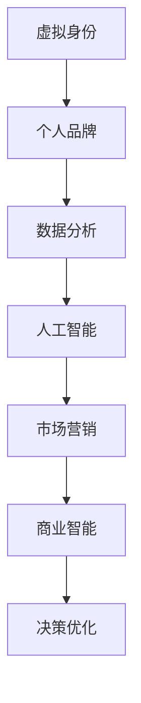

                 

# 虚拟身份市场分析师：AI时代的个人品牌顾问

> 关键词：虚拟身份, 个人品牌, 数据分析, 人工智能, 市场营销, 商业智能

## 1. 背景介绍

在数字经济和网络时代的浪潮中，个人品牌与虚拟身份的塑造变得越来越重要。无论是个人创业者、自媒体人，还是品牌营销经理、市场营销专家，都需要面对庞大的市场数据和复杂的人际网络，如何从中提取有价值的信息，塑造个性化的品牌形象，是每一个身在其中的从业者都必须面对的挑战。

AI技术的飞速发展，尤其是深度学习、自然语言处理、计算机视觉等领域的突破，为个人品牌和虚拟身份的市场分析提供了强大的技术支持。通过大数据分析、智能推荐系统、自然语言处理等技术，我们可以从海量数据中挖掘出隐藏的商业机会，构建独特的个人品牌，并在竞争激烈的市场中脱颖而出。

本文将详细介绍如何利用AI技术进行个人品牌与虚拟身份的市场分析，涵盖核心概念、算法原理、实际操作、应用案例及未来展望。

## 2. 核心概念与联系

### 2.1 核心概念概述

在进行虚拟身份市场分析的过程中，我们需要关注以下几个核心概念：

- **虚拟身份**：指的是在互联网上所呈现的个体形象，包括社交媒体账号、博客、微信公众号等平台上的活跃行为。虚拟身份不仅是个人或品牌的在线展示，更是与客户互动、建立信任的重要工具。
- **个人品牌**：个人品牌是指个体在市场和客户心目中留下的独特印象和价值认知。通过精心设计的个人品牌，可以实现自我营销，吸引目标客户，提升市场竞争力。
- **数据分析**：数据分析是指从大量数据中提取出有价值的信息，为决策提供依据。数据分析可以涵盖定量分析、定性分析、时间序列分析、文本分析等各个方面。
- **人工智能**：AI技术通过模拟人脑的智能行为，实现数据的自动化处理、模式识别、预测分析等。AI在个人品牌分析中主要应用于自然语言处理、图像识别、智能推荐等领域。
- **市场营销**：市场营销是通过策略性地使用各种手段，以达成企业或个人的市场目标。在AI时代，通过数据驱动的智能营销，可以更高效地实现市场目标。
- **商业智能**：商业智能是指利用数据分析和AI技术，对企业数据进行挖掘和整合，支持企业决策和运营优化。商业智能是市场分析和商业决策的重要工具。

这些核心概念之间存在紧密的联系，共同构成了一个系统化的虚拟身份与个人品牌分析框架。利用这些概念，我们可以更系统地进行市场分析，提升个人品牌的价值。

### 2.2 核心概念原理和架构的 Mermaid 流程图(Mermaid 流程节点中不要有括号、逗号等特殊字符)



这个流程图展示了虚拟身份、个人品牌与数据分析、人工智能、市场营销和商业智能之间的联系。虚拟身份和数据是分析的起点，AI技术在其中发挥了核心作用，最终支持市场营销和商业智能决策，从而实现决策优化。

## 3. 核心算法原理 & 具体操作步骤

### 3.1 算法原理概述

虚拟身份和市场分析的核心算法主要包括以下几个方面：

- **数据收集与预处理**：从不同来源收集数据，包括社交媒体、博客、电子邮件、交易记录等。然后对数据进行清洗、去重、归一化等预处理操作，为后续分析做准备。
- **文本分析**：利用自然语言处理技术，对文本数据进行分词、词性标注、实体识别等操作，提取出关键信息。
- **情感分析**：通过机器学习模型，对文本中的情感倾向进行分析，了解公众对品牌、产品或个人的情感态度。
- **社交网络分析**：利用图算法，分析虚拟身份在社交网络中的影响力、连接强度、关系变化等。
- **预测分析**：通过时间序列分析、回归模型等，对市场趋势、用户行为进行预测。
- **推荐系统**：利用协同过滤、内容推荐等算法，为用户推荐合适的品牌和虚拟身份。

这些算法通常集成在统一的数据分析平台上，形成一套完整的虚拟身份与个人品牌分析体系。

### 3.2 算法步骤详解

进行虚拟身份和市场分析的步骤通常包括以下几个方面：

1. **数据收集**：
   - 使用API、网络爬虫等方式从不同平台收集数据，包括社交媒体帖子、博客文章、评论等。
   - 确保数据来源的多样性和覆盖面，避免单一数据源导致的偏差。

2. **数据预处理**：
   - 清洗数据，去除噪声、不相关数据和重复数据。
   - 对文本数据进行分词、去除停用词、词性标注、实体识别等预处理操作。
   - 将数据转化为适合分析的格式，如数据库、数据框等。

3. **特征工程**：
   - 选择与分析目标相关的特征，如关键词频率、情感得分、关注者数量等。
   - 构建特征向量，将特征转化为可供模型处理的输入。

4. **模型选择与训练**：
   - 选择合适的算法模型，如文本分类模型、情感分析模型、社交网络分析模型等。
   - 使用历史数据训练模型，并进行交叉验证和参数调优。

5. **分析与可视化**：
   - 对模型输出进行分析和可视化，生成图表、报告等形式的分析结果。
   - 利用可视化工具如Tableau、Power BI等，展示分析结果，帮助决策者理解数据。

6. **持续优化**：
   - 定期更新数据，重新训练模型，保持分析结果的准确性和时效性。
   - 根据新数据和新目标，调整模型参数和特征工程策略。

### 3.3 算法优缺点

- **优点**：
  - 数据驱动的决策支持，提高决策的科学性和客观性。
  - 自动化分析过程，节省人力和时间成本。
  - 通过大数据分析，挖掘隐藏的商业机会，提升市场竞争力。
  - 能够动态监控市场变化，及时调整营销策略。

- **缺点**：
  - 数据质量对分析结果影响较大，数据不全面或不准确会导致误判。
  - 模型需要大量的历史数据进行训练，对于新数据和新情况适应性有限。
  - 技术门槛较高，需要具备一定的数据科学和编程技能。
  - 数据隐私和伦理问题需妥善处理，确保数据使用的合规性。

### 3.4 算法应用领域

虚拟身份和市场分析的应用领域非常广泛，主要涵盖以下几个方面：

1. **品牌营销**：利用数据分析和AI技术，进行市场调研和竞争对手分析，制定更有效的市场策略。
2. **社交媒体管理**：通过情感分析、社交网络分析等技术，了解公众对品牌的情感态度，优化社交媒体运营策略。
3. **内容创作**：利用自然语言处理技术，分析热门话题和关键词，指导内容创作和选题策划。
4. **用户行为分析**：通过数据分析，了解用户的兴趣和行为模式，制定个性化营销方案。
5. **广告投放优化**：利用预测分析和推荐系统，优化广告投放策略，提高广告效果和ROI。
6. **危机公关管理**：通过情感分析和社交网络分析，及时发现和处理危机事件，保护品牌形象。

## 4. 数学模型和公式 & 详细讲解 & 举例说明

### 4.1 数学模型构建

在进行虚拟身份和市场分析时，常用的数学模型包括但不限于：

- 自然语言处理（NLP）模型：如词袋模型、TF-IDF、BERT等。
- 情感分析模型：如LSTM、GRU、Transformers等。
- 社交网络分析模型：如PageRank、节点嵌入、图神经网络等。
- 时间序列分析模型：如ARIMA、LSTM、RNN等。
- 推荐系统模型：如协同过滤、矩阵分解、深度学习推荐模型等。

### 4.2 公式推导过程

以情感分析为例，常用的情感分类模型是基于RNN的LSTM模型。假设我们有一个长度为T的文本序列 $x_1,x_2,...,x_T$，以及相应的情感标签 $y_1,y_2,...,y_T$。模型的目标是通过学习文本和标签之间的关系，预测新文本的情感类别。

LSTM模型的公式推导如下：

$$
h_t = LSTM(h_{t-1}, x_t; \theta)
$$

其中，$h_t$ 表示第t个时刻的隐状态，$x_t$ 表示第t个时刻的输入文本，$\theta$ 表示模型参数。LSTM模型的核心在于引入了门控机制，可以控制信息的流动，从而更好地处理长序列数据。

### 4.3 案例分析与讲解

以下是一个情感分析的实际案例：

假设我们有一个电商平台的评论数据集，包含用户对产品的评论文本和情感标签。我们的目标是对新用户评论进行情感分析，判断其情感倾向是正面、负面还是中性。

1. **数据预处理**：
   - 将文本数据进行分词，去除停用词。
   - 对文本进行词向量化，使用Word2Vec或GloVe进行词嵌入。
   - 将情感标签转化为one-hot编码。

2. **模型训练**：
   - 使用LSTM模型进行训练，选择适当的LSTM单元数、嵌入维度、隐藏层大小等参数。
   - 使用交叉验证进行参数调优，选择合适的学习率、批量大小等超参数。

3. **模型评估**：
   - 在验证集上评估模型性能，计算准确率、召回率、F1分数等指标。
   - 绘制混淆矩阵，了解模型在不同情感类别上的表现。

4. **预测与可视化**：
   - 对新评论进行情感预测，输出情感分类结果。
   - 利用Tableau等可视化工具，展示情感分类结果的分布情况。

## 5. 项目实践：代码实例和详细解释说明

### 5.1 开发环境搭建

在进行虚拟身份和市场分析的项目实践时，需要搭建合适的开发环境。以下是一个基于Python的开发环境配置流程：

1. **安装Python**：
   - 从官网下载并安装最新版本的Python。
   - 添加Python到系统PATH环境变量，确保系统命令可以调用Python。

2. **安装相关库**：
   - 安装pandas、numpy、scikit-learn、matplotlib等常用库。
   - 安装NLP库，如NLTK、spaCy、gensim等。
   - 安装机器学习库，如scikit-learn、TensorFlow、PyTorch等。

3. **安装数据分析平台**：
   - 安装Jupyter Notebook，用于编写和运行Python代码。
   - 安装RapidMiner等数据分析平台，用于可视化分析和报表生成。

4. **配置虚拟环境**：
   - 使用virtualenv或conda创建虚拟环境，隔离不同项目之间的依赖。
   - 在虚拟环境中安装所需的库和依赖。

### 5.2 源代码详细实现

以下是一个使用LSTM模型进行情感分析的Python代码示例：

```python
import pandas as pd
import numpy as np
from sklearn.model_selection import train_test_split
from tensorflow.keras.models import Sequential
from tensorflow.keras.layers import Dense, LSTM, Embedding
from tensorflow.keras.preprocessing.text import Tokenizer
from tensorflow.keras.preprocessing.sequence import pad_sequences

# 读取数据集
df = pd.read_csv('reviews.csv')

# 预处理文本数据
texts = df['review'].tolist()
labels = df['label'].tolist()

# 分词、词向量化
tokenizer = Tokenizer()
tokenizer.fit_on_texts(texts)
sequences = tokenizer.texts_to_sequences(texts)
word_index = tokenizer.word_index
data = pad_sequences(sequences, maxlen=100)

# 构建LSTM模型
model = Sequential()
model.add(Embedding(len(word_index)+1, 100, input_length=100))
model.add(LSTM(128, dropout=0.2, recurrent_dropout=0.2))
model.add(Dense(3, activation='softmax'))
model.compile(optimizer='adam', loss='categorical_crossentropy', metrics=['accuracy'])

# 划分训练集和验证集
X_train, X_val, y_train, y_val = train_test_split(data, labels, test_size=0.2, random_state=42)

# 训练模型
model.fit(X_train, y_train, epochs=10, validation_data=(X_val, y_val))

# 预测新数据
new_text = ['This product is amazing!']
new_sequence = tokenizer.texts_to_sequences(new_text)
new_data = pad_sequences(new_sequence, maxlen=100)
result = model.predict(new_data)
```

### 5.3 代码解读与分析

以上代码实现了基于LSTM模型的情感分析。以下是代码的详细解读和分析：

1. **数据读取与预处理**：
   - 使用pandas读取数据集，并将其转换为Python列表。
   - 对文本数据进行分词，并使用Tokenizer将其转换为序列形式。
   - 使用pad_sequences函数将序列数据填充到固定长度。

2. **模型构建与训练**：
   - 使用Sequential模型构建LSTM模型，包含嵌入层、LSTM层和全连接层。
   - 定义模型的优化器、损失函数和评价指标。
   - 使用train_test_split函数将数据集划分为训练集和验证集。
   - 使用fit函数训练模型，设置训练轮数和验证集。

3. **模型评估与预测**：
   - 使用evaluate函数评估模型在验证集上的性能。
   - 使用predict函数对新文本进行情感预测，输出概率分布。

## 6. 实际应用场景

### 6.1 品牌营销

在品牌营销中，虚拟身份和市场分析可以帮助企业更好地了解市场和消费者，制定更有效的营销策略。例如：

- 利用社交媒体分析工具，监控品牌在社交媒体上的表现和消费者反馈。
- 分析竞争对手的虚拟身份和市场表现，制定差异化的营销策略。
- 利用情感分析技术，了解消费者对品牌的态度和需求，指导内容创作和广告投放。

### 6.2 社交媒体管理

社交媒体管理是虚拟身份和市场分析的重要应用场景之一。例如：

- 通过情感分析，了解用户对品牌的情感态度，优化社交媒体运营策略。
- 利用社交网络分析，分析用户的影响力和连接强度，指导KOL合作和内容传播。
- 利用数据分析，了解用户的行为模式和兴趣偏好，制定个性化的社交媒体推广方案。

### 6.3 内容创作

内容创作是虚拟身份和市场分析的重要应用场景之一。例如：

- 利用文本分析技术，分析热门话题和关键词，指导内容创作和选题策划。
- 利用情感分析，了解用户对内容的情感态度，优化内容创作策略。
- 利用数据分析，了解用户的兴趣和需求，制定更具有吸引力的内容方案。

### 6.4 未来应用展望

未来，虚拟身份和市场分析将迎来更多创新应用。以下是几个未来应用展望：

1. **实时数据分析**：利用流式处理技术，实现实时数据分析和智能决策。
2. **跨平台分析**：整合不同平台的数据，实现更全面的市场分析。
3. **多模态数据融合**：融合文本、图像、视频等多种数据源，提升分析的准确性和深度。
4. **自动化内容创作**：利用AI生成内容，提高内容创作效率和质量。
5. **增强现实应用**：利用AR技术，增强用户对虚拟身份和市场分析的体验。

## 7. 工具和资源推荐

### 7.1 学习资源推荐

为了帮助开发者系统掌握虚拟身份和市场分析的理论基础和实践技巧，这里推荐一些优质的学习资源：

1. **《Python数据分析与可视化》**：该书系统介绍了Python数据分析和可视化的基本概念和常用工具。
2. **《深度学习入门》**：该书从基础概念出发，深入浅出地介绍了深度学习的基本原理和实践技巧。
3. **Coursera《数据分析与可视化》课程**：由约翰霍普金斯大学提供，涵盖数据分析、可视化、机器学习等多个主题。
4. **Kaggle竞赛**：Kaggle是数据科学和机器学习竞赛平台，通过参与竞赛，可以积累实战经验，提升数据分析能力。
5. **Google Colab**：谷歌提供的免费Jupyter Notebook环境，方便开发者在线实验和分享学习笔记。

通过对这些资源的学习实践，相信你一定能够快速掌握虚拟身份和市场分析的精髓，并用于解决实际的业务问题。

### 7.2 开发工具推荐

高效的开发离不开优秀的工具支持。以下是几款用于虚拟身份和市场分析开发的常用工具：

1. **Python**：作为当前最流行的编程语言之一，Python拥有丰富的库和框架，适合进行数据分析和机器学习。
2. **Jupyter Notebook**：在线的交互式编程环境，方便编写和运行Python代码，支持代码单元格、Markdown等多种格式。
3. **RapidMiner**：商业化的数据分析平台，支持数据预处理、建模、可视化等多种功能。
4. **Tableau**：数据可视化工具，支持多种数据源和图表类型，方便生成报告和分析结果。
5. **Google Colab**：谷歌提供的免费Jupyter Notebook环境，支持GPU、TPU等多种算力，方便进行大规模数据分析和机器学习实验。

合理利用这些工具，可以显著提升虚拟身份和市场分析任务的开发效率，加快创新迭代的步伐。

### 7.3 相关论文推荐

虚拟身份和市场分析的研究源于学界的持续研究。以下是几篇奠基性的相关论文，推荐阅读：

1. **《大数据时代的市场分析：数据挖掘与预测模型》**：介绍了大数据时代市场分析的基本框架和方法。
2. **《自然语言处理在市场分析中的应用》**：探讨了自然语言处理技术在情感分析、主题建模等方面的应用。
3. **《社交网络分析在品牌营销中的应用》**：研究了社交网络分析技术在品牌影响力评估、用户行为分析等方面的应用。
4. **《深度学习在推荐系统中的应用》**：介绍了深度学习在协同过滤、内容推荐等方面的应用。
5. **《情感分析在消费者行为预测中的应用》**：探讨了情感分析技术在消费者行为预测、市场趋势分析等方面的应用。

这些论文代表了大数据和AI时代市场分析的发展脉络。通过学习这些前沿成果，可以帮助研究者把握学科前进方向，激发更多的创新灵感。

## 8. 总结：未来发展趋势与挑战

### 8.1 总结

本文对虚拟身份和市场分析技术进行了全面系统的介绍。首先阐述了虚拟身份和市场分析的研究背景和意义，明确了AI技术在其中的核心作用。其次，从原理到实践，详细讲解了虚拟身份和市场分析的数学模型、算法原理和操作步骤，给出了详细代码实例和解释分析。同时，本文还广泛探讨了虚拟身份和市场分析在品牌营销、社交媒体管理、内容创作等多个领域的应用前景，展示了其广阔的应用空间。此外，本文精选了相关的学习资源和工具，力求为读者提供全方位的技术指引。

通过本文的系统梳理，可以看到，虚拟身份和市场分析技术正在成为AI时代的重要工具，极大地拓展了市场分析和品牌营销的边界，催生了更多的落地场景。利用这些技术，企业可以更系统、更深入地了解市场和消费者，制定更有效的营销策略，从而在激烈的市场竞争中脱颖而出。

### 8.2 未来发展趋势

展望未来，虚拟身份和市场分析技术将呈现以下几个发展趋势：

1. **深度学习与大数据融合**：深度学习和大数据技术的融合将进一步提升虚拟身份和市场分析的准确性和效率。
2. **多模态数据整合**：融合文本、图像、视频等多种数据源，提升分析的深度和广度。
3. **实时数据处理**：利用流式处理技术，实现实时数据分析和智能决策。
4. **自动化内容创作**：利用AI生成内容，提高内容创作效率和质量。
5. **跨平台分析**：整合不同平台的数据，实现更全面的市场分析。
6. **增强现实应用**：利用AR技术，增强用户对虚拟身份和市场分析的体验。

### 8.3 面临的挑战

尽管虚拟身份和市场分析技术已经取得了瞩目成就，但在迈向更加智能化、普适化应用的过程中，它仍面临诸多挑战：

1. **数据质量和隐私问题**：数据质量对分析结果影响较大，数据隐私和伦理问题需妥善处理。
2. **技术门槛较高**：技术门槛较高，需要具备一定的数据科学和编程技能。
3. **模型鲁棒性不足**：模型面对域外数据时，泛化性能往往大打折扣。
4. **自动化与解释性平衡**：如何在提高自动化程度的同时，保证模型输出的可解释性，是一大难题。
5. **跨平台数据整合**：不同平台的数据格式和标准不同，整合难度较大。
6. **应用场景多样性**：不同行业的应用场景差异较大，需针对性地设计和优化模型。

### 8.4 研究展望

面对虚拟身份和市场分析所面临的种种挑战，未来的研究需要在以下几个方面寻求新的突破：

1. **无监督和半监督学习**：摆脱对大规模标注数据的依赖，利用自监督学习、主动学习等无监督和半监督范式，最大限度利用非结构化数据，实现更加灵活高效的分析。
2. **多模态数据融合**：利用图像识别、自然语言处理等技术，融合多种数据源，提升分析的深度和广度。
3. **自动化与解释性结合**：利用可解释性模型，提高模型输出的解释性和可理解性。
4. **实时数据处理与分析**：利用流式处理技术，实现实时数据分析和智能决策。
5. **跨平台数据整合**：研究不同平台数据的标准化和格式转换方法，实现跨平台的数据整合。
6. **自动化内容创作**：利用AI生成内容，提高内容创作效率和质量。

这些研究方向的探索，必将引领虚拟身份和市场分析技术迈向更高的台阶，为构建智能营销系统铺平道路。面向未来，虚拟身份和市场分析技术还需要与其他AI技术进行更深入的融合，如知识表示、因果推理、强化学习等，多路径协同发力，共同推动智能营销的发展。

## 9. 附录：常见问题与解答

**Q1：虚拟身份和市场分析适用于所有行业吗？**

A: 虚拟身份和市场分析技术适用于绝大多数行业，但不同行业的应用场景和需求有所不同。例如，电商行业可以利用情感分析了解用户反馈，提升产品质量；而金融行业可以利用社交网络分析，识别潜在的欺诈行为。

**Q2：如何选择虚拟身份和市场分析的工具和平台？**

A: 选择工具和平台需要考虑多方面因素，包括数据源、分析任务、技术栈、成本等。建议根据具体需求进行比较和选择，可以先尝试使用免费的工具或平台进行小规模实验，验证其适用性。

**Q3：如何进行虚拟身份和市场分析的持续优化？**

A: 虚拟身份和市场分析的持续优化需要不断更新数据、优化模型和调整策略。建议定期进行数据分析和模型评估，结合新数据和新情况，进行调整和优化。

**Q4：虚拟身份和市场分析有哪些应用案例？**

A: 虚拟身份和市场分析的应用案例非常广泛，包括品牌营销、社交媒体管理、内容创作、用户行为分析、广告投放优化、危机公关管理等。通过具体的案例分析，可以更好地理解其应用价值。

**Q5：虚拟身份和市场分析的伦理和安全问题有哪些？**

A: 虚拟身份和市场分析面临的伦理和安全问题包括数据隐私、模型偏见、用户识别等。建议在进行数据分析和应用时，严格遵守相关法律法规，保护用户隐私，避免偏见和歧视，确保系统的安全性和可靠性。

通过本文的系统梳理，可以看到，虚拟身份和市场分析技术正在成为AI时代的重要工具，极大地拓展了市场分析和品牌营销的边界，催生了更多的落地场景。利用这些技术，企业可以更系统、更深入地了解市场和消费者，制定更有效的营销策略，从而在激烈的市场竞争中脱颖而出。未来，随着技术的不断进步和应用的不断扩展，虚拟身份和市场分析必将发挥更大的作用，推动AI技术在各行业的应用和发展。

---

作者：禅与计算机程序设计艺术 / Zen and the Art of Computer Programming

