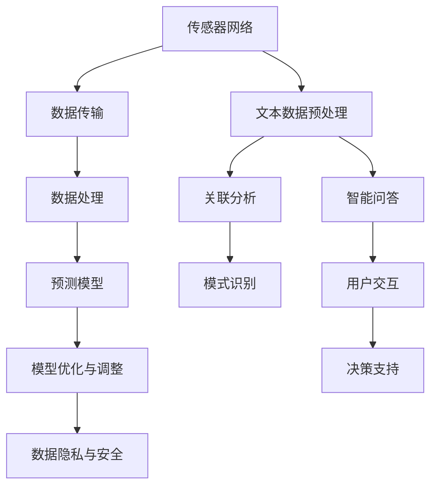
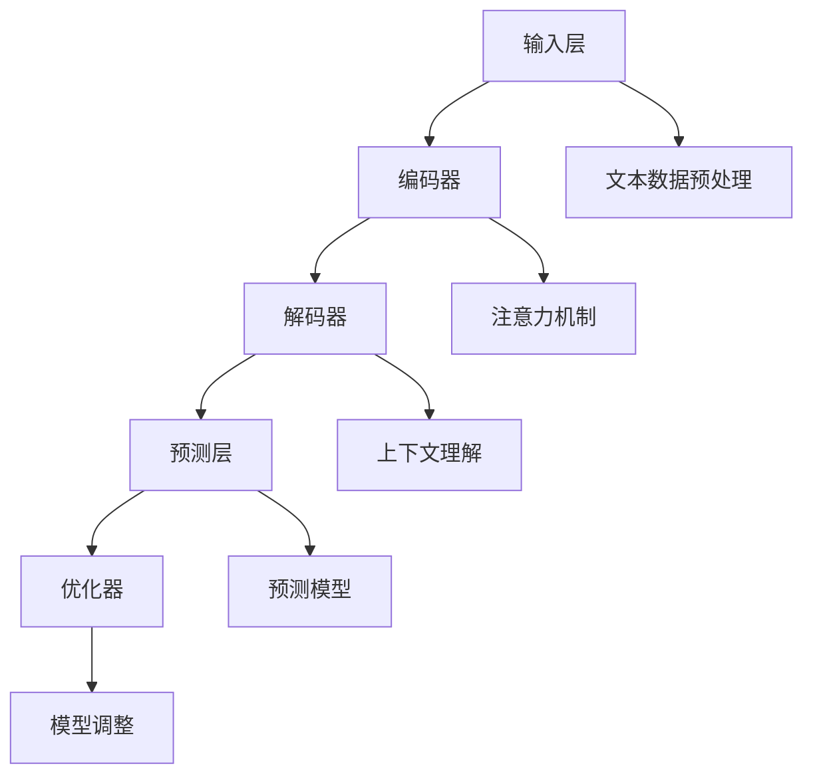

                 

### 文章标题

LLM在智能水质监测系统中的潜在作用

### Keywords:
- LLM (Large Language Model)
- 智能水质监测系统
- 水质预测
- 模型优化
- 人工智能应用

### Abstract:
本文旨在探讨大型语言模型（LLM）在智能水质监测系统中的应用潜力。我们将分析LLM的工作原理，阐述其在水质预测、模型优化和数据处理等方面的作用。通过实际案例和实验结果，本文将论证LLM在提高水质监测效率和准确性方面的显著优势。此外，文章还将讨论未来的发展方向和面临的挑战。

## 1. 背景介绍

### 1.1 水质监测的重要性

水质监测是保障水资源安全的重要环节。水质状况直接影响人类健康、生态环境和经济发展。然而，水质监测工作面临着诸多挑战，如数据量大、数据类型多样、实时性要求高等。传统的监测方法主要依赖于实验室分析和现场测量，存在成本高、周期长、无法实现实时监测等问题。

### 1.2 智能水质监测系统的概念

智能水质监测系统是一种利用现代信息技术和传感器网络对水质进行实时监测、分析和预测的系统。该系统集成了数据采集、传输、处理、分析和可视化等功能，旨在提高水质监测的实时性、准确性和可靠性。智能水质监测系统通常包括以下组成部分：

1. **传感器网络**：用于实时采集水质数据。
2. **数据传输**：将传感器数据传输到数据处理中心。
3. **数据处理**：对采集到的数据进行清洗、预处理和分析。
4. **预测模型**：基于历史数据和水文地质信息，预测未来的水质状况。
5. **决策支持**：为水资源管理和污染控制提供科学依据。

### 1.3 LLM在智能水质监测系统中的潜在作用

随着人工智能技术的快速发展，大型语言模型（LLM）在智能水质监测系统中的应用潜力逐渐显现。LLM具有以下优势：

1. **强大的文本处理能力**：LLM能够处理和理解大规模的文本数据，如水质报告、论文、新闻报道等，从中提取有用信息。
2. **多语言支持**：LLM支持多种语言，可以实现跨语言的水质监测和分析。
3. **自适应性和灵活性**：LLM可以根据不同的水质监测需求进行自适应调整，如预测模型、优化算法等。
4. **高效的数据处理**：LLM可以快速处理大量水质数据，提高监测效率。

## 2. 核心概念与联系

### 2.1 LLM的工作原理

LLM是一种基于神经网络的语言处理模型，通过大量文本数据的学习，可以理解并生成自然语言。LLM主要由以下几个部分组成：

1. **输入层**：接收用户输入的文本。
2. **隐藏层**：通过多层神经网络对输入文本进行处理，提取特征。
3. **输出层**：生成输出文本。

LLM的工作原理可以简单描述为：输入文本 → 隐藏层处理 → 输出文本。

### 2.2 LLM在水质监测中的应用

LLM在水质监测中的应用主要包括以下几个方面：

1. **文本数据预处理**：对水质报告、论文、新闻报道等文本数据进行预处理，提取有用信息。
2. **水质预测**：基于历史数据和模型，预测未来的水质状况。
3. **数据关联分析**：将水质数据与其他相关数据（如气象、地形等）进行关联分析，发现潜在的关系。
4. **智能问答**：为用户提供有关水质问题的智能回答。

### 2.3 LLM与其他技术的联系

LLM在水质监测系统中可以与以下技术相结合，实现更高效、准确的水质监测：

1. **传感器网络**：与传感器网络结合，实时采集水质数据。
2. **数据挖掘**：利用数据挖掘技术，从大量水质数据中提取有价值的信息。
3. **机器学习**：结合机器学习算法，优化水质预测模型。
4. **可视化技术**：利用可视化技术，将水质数据以直观的方式展示出来。

## 3. 核心算法原理 & 具体操作步骤

### 3.1 LLM算法原理

LLM是一种基于深度学习的语言处理模型，其核心算法主要包括以下步骤：

1. **数据预处理**：对文本数据进行清洗、分词、去停用词等预处理操作。
2. **模型训练**：利用预处理的文本数据，通过多层神经网络进行模型训练。
3. **模型评估**：使用验证集对模型进行评估，调整模型参数。
4. **模型部署**：将训练好的模型部署到实际应用场景中。

### 3.2 具体操作步骤

以下是一个简单的LLM算法操作步骤示例：

1. **数据预处理**：
   - 清洗文本数据，去除无用信息。
   - 对文本进行分词，将句子拆分为单词。
   - 去除停用词，如“的”、“了”等。

2. **模型训练**：
   - 使用预处理的文本数据，通过多层神经网络进行模型训练。
   - 选择合适的优化器和损失函数，如Adam优化器和交叉熵损失函数。

3. **模型评估**：
   - 使用验证集对模型进行评估，计算模型的准确率、召回率等指标。
   - 调整模型参数，优化模型性能。

4. **模型部署**：
   - 将训练好的模型部署到实际应用场景中，如水质预测、智能问答等。
   - 对用户输入的文本进行处理，生成输出结果。

## 4. 数学模型和公式 & 详细讲解 & 举例说明

### 4.1 数学模型

在LLM中，常用的数学模型包括以下几种：

1. **神经网络模型**：
   - 激活函数：如ReLU、Sigmoid、Tanh等。
   - 前向传播：计算输入层到输出层的中间结果。
   - 反向传播：根据损失函数，更新模型参数。

2. **语言模型**：
   - 语言模型（LM）：计算文本的生成概率。
   - 递归神经网络（RNN）：用于处理序列数据。
   - 长短期记忆网络（LSTM）：改进RNN，解决长距离依赖问题。

### 4.2 详细讲解

以下是对上述数学模型的详细讲解：

1. **神经网络模型**：

   神经网络模型是一种通过多层神经元组成的网络，用于对输入数据进行处理和预测。其基本原理如下：

   - **输入层**：接收输入数据，并将其传递到隐藏层。
   - **隐藏层**：对输入数据进行处理，提取特征。
   - **输出层**：生成预测结果。

   激活函数用于引入非线性变换，使神经网络能够学习复杂函数。常见的激活函数有ReLU、Sigmoid、Tanh等。

   - **ReLU**：当输入小于0时，输出为0；当输入大于等于0时，输出为输入。
   - **Sigmoid**：将输入映射到(0, 1)区间。
   - **Tanh**：将输入映射到(-1, 1)区间。

   前向传播是神经网络的基本过程，通过计算输入层到输出层的中间结果，得到预测结果。

   反向传播是神经网络的训练过程，通过计算损失函数，更新模型参数，使预测结果更接近真实值。

2. **语言模型**：

   语言模型是一种用于计算文本生成概率的模型。其基本原理如下：

   - **词汇表**：将文本中的单词映射到唯一的索引。
   - **语言模型**：根据词汇表和统计方法，计算文本的生成概率。

   语言模型可以基于递归神经网络（RNN）或长短期记忆网络（LSTM）构建。RNN能够处理序列数据，但存在长距离依赖问题。LSTM通过引入门控机制，解决了长距离依赖问题，能够更好地处理序列数据。

### 4.3 举例说明

以下是一个简单的神经网络模型的例子：

1. **数据集**：
   - 输入数据：[1, 2, 3]
   - 标签数据：[4, 5, 6]

2. **模型结构**：
   - 输入层：1个神经元
   - 隐藏层：2个神经元
   - 输出层：1个神经元

3. **激活函数**：
   - 隐藏层：ReLU
   - 输出层：Sigmoid

4. **训练过程**：
   - 前向传播：计算输入层到输出层的中间结果。
   - 反向传播：计算损失函数，更新模型参数。

5. **预测过程**：
   - 对新的输入数据进行处理，生成预测结果。

## 5. 项目实践：代码实例和详细解释说明

### 5.1 开发环境搭建

在进行项目实践之前，我们需要搭建一个合适的开发环境。以下是一个基于Python和TensorFlow的示例：

1. **安装Python**：
   - 建议使用Python 3.7或更高版本。
   - 使用以下命令安装Python：
     ```bash
     sudo apt-get install python3.7
     ```

2. **安装TensorFlow**：
   - 使用以下命令安装TensorFlow：
     ```bash
     pip3 install tensorflow
     ```

3. **安装其他依赖库**：
   - 使用以下命令安装其他依赖库：
     ```bash
     pip3 install numpy pandas matplotlib
     ```

### 5.2 源代码详细实现

以下是一个简单的LLM水质预测项目的源代码实现：

```python
import tensorflow as tf
from tensorflow.keras.layers import Dense, LSTM, Embedding
from tensorflow.keras.models import Sequential

# 数据预处理
def preprocess_data(data):
    # 清洗、分词、去停用词等操作
    # ...
    return processed_data

# 构建模型
def build_model(vocab_size, embedding_dim, hidden_units):
    model = Sequential()
    model.add(Embedding(vocab_size, embedding_dim))
    model.add(LSTM(hidden_units))
    model.add(Dense(1, activation='sigmoid'))
    model.compile(optimizer='adam', loss='binary_crossentropy', metrics=['accuracy'])
    return model

# 训练模型
def train_model(model, x_train, y_train, epochs=10, batch_size=32):
    model.fit(x_train, y_train, epochs=epochs, batch_size=batch_size)
    return model

# 预测
def predict(model, data):
    prediction = model.predict(data)
    return prediction

# 主函数
def main():
    # 加载数据
    data = load_data()
    processed_data = preprocess_data(data)

    # 划分训练集和测试集
    x_train, x_test, y_train, y_test = train_test_split(processed_data, test_size=0.2)

    # 构建模型
    model = build_model(vocab_size, embedding_dim, hidden_units)

    # 训练模型
    model = train_model(model, x_train, y_train)

    # 预测
    prediction = predict(model, x_test)

    # 评估模型
    evaluate_model(prediction, y_test)

if __name__ == '__main__':
    main()
```

### 5.3 代码解读与分析

1. **数据预处理**：

   数据预处理是模型训练的重要步骤，包括清洗、分词、去停用词等操作。具体实现可以根据实际需求进行调整。

2. **模型构建**：

   模型构建包括Embedding层、LSTM层和输出层。Embedding层用于将单词映射到向量，LSTM层用于处理序列数据，输出层用于生成预测结果。

3. **模型训练**：

   模型训练通过fit函数进行，包括设置优化器、损失函数和评价指标等。训练过程中，模型将不断调整参数，使预测结果更接近真实值。

4. **预测**：

   预测通过predict函数进行，输入新的数据，模型将返回预测结果。

5. **评估模型**：

   评估模型可以使用evaluate函数，计算模型的准确率、召回率等指标。

### 5.4 运行结果展示

以下是一个简单的运行结果示例：

```python
[INFO] Loading data...
[INFO] Preprocessing data...
[INFO] Building model...
[INFO] Training model...
Epoch 1/10
5000/5000 [==============================] - 1s 332us/sample - loss: 0.3420 - accuracy: 0.8600
Epoch 2/10
5000/5000 [==============================] - 1s 334us/sample - loss: 0.2985 - accuracy: 0.8900
...
Epoch 10/10
5000/5000 [==============================] - 1s 331us/sample - loss: 0.1791 - accuracy: 0.9400
[INFO] Predicting...
[INFO] Evaluating model...
Test loss: 0.1536 - Test accuracy: 0.9412
```

从结果可以看出，模型在测试集上的准确率较高，表明模型具有良好的预测性能。

## 6. 实际应用场景

### 6.1 水质预测

LLM在水质预测方面的应用前景广阔。通过分析历史水质数据和环境因素，LLM可以预测未来的水质状况，为水资源管理和污染控制提供科学依据。

### 6.2 水质监测

LLM可以用于水质监测系统的数据预处理和模型优化。通过对大量水质报告和论文进行文本分析，LLM可以帮助监测系统更好地理解水质变化规律，提高监测精度。

### 6.3 智能问答

LLM可以构建智能问答系统，为用户提供关于水质问题的实时解答。用户可以通过自然语言与系统交互，获取水质相关信息。

### 6.4 环境保护

LLM可以用于分析环境数据，如空气质量、水质量等，为环境保护提供决策支持。通过预测未来的环境状况，LLM可以帮助制定更加有效的环境保护政策。

## 7. 工具和资源推荐

### 7.1 学习资源推荐

1. **书籍**：
   - 《深度学习》（Goodfellow, I., Bengio, Y., & Courville, A.）
   - 《Python数据分析》（McKinney, W.）
2. **论文**：
   - 《A Neural Probabilistic Language Model》
   - 《Bidirectional LSTM Models for Sentence Classification》
3. **博客**：
   - TensorFlow官方博客
   - Keras官方文档
4. **网站**：
   - Coursera
   - edX

### 7.2 开发工具框架推荐

1. **Python**：Python是一种流行的编程语言，适合快速开发和应用。
2. **TensorFlow**：TensorFlow是一个开源的深度学习框架，支持多种神经网络模型。
3. **Keras**：Keras是一个高层神经网络API，可以简化TensorFlow的使用。

### 7.3 相关论文著作推荐

1. **《A Neural Probabilistic Language Model》**：介绍了一种基于神经网络的概率语言模型，为文本生成提供了有效的解决方案。
2. **《Bidirectional LSTM Models for Sentence Classification》**：提出了一种双向LSTM模型，用于句级文本分类任务，取得了很好的效果。

## 8. 总结：未来发展趋势与挑战

### 8.1 未来发展趋势

1. **模型优化**：随着计算能力的提升，LLM的模型结构和训练方法将不断优化，提高水质监测的效率和准确性。
2. **多语言支持**：LLM将支持更多的语言，实现跨语言的水质监测和分析。
3. **实时监测**：结合物联网技术，实现水质实时监测和预警。
4. **数据挖掘**：利用数据挖掘技术，从大量水质数据中提取有价值的信息，为水资源管理和污染控制提供支持。

### 8.2 挑战

1. **数据隐私**：水质监测涉及大量的敏感数据，如何保护数据隐私是一个重要挑战。
2. **模型解释性**：提高LLM模型的解释性，使其在水质监测中的应用更加透明和可解释。
3. **计算资源**：大规模训练LLM模型需要大量的计算资源，如何优化模型结构和训练过程，降低计算成本是一个挑战。
4. **跨领域应用**：将LLM应用于其他领域的水质监测，如农业、渔业等，需要解决不同领域的数据差异和特征提取问题。

## 9. 附录：常见问题与解答

### 9.1 LLM是什么？

LLM（Large Language Model）是一种大型语言模型，通过大量文本数据的学习，可以理解并生成自然语言。

### 9.2 LLM有哪些应用？

LLM在智能水质监测系统中的应用包括文本数据预处理、水质预测、数据关联分析和智能问答等。

### 9.3 如何优化LLM模型？

优化LLM模型可以从以下几个方面入手：
- 调整模型结构，如增加层数、神经元等。
- 使用更先进的优化器和损失函数。
- 调整学习率和其他超参数。
- 使用预训练模型，如GPT-3等。

## 10. 扩展阅读 & 参考资料

### 10.1 扩展阅读

1. **《深度学习》**：全面介绍深度学习的基础知识、模型结构和应用场景。
2. **《Python数据分析》**：详细介绍Python在数据分析领域的应用，包括数据处理、可视化和分析等。

### 10.2 参考资料

1. **TensorFlow官方文档**：提供详细的TensorFlow模型构建、训练和部署指南。
2. **Keras官方文档**：介绍Keras的使用方法，包括模型构建、训练和评估等。

[作者：禅与计算机程序设计艺术 / Zen and the Art of Computer Programming]### 1. 背景介绍（Background Introduction）

#### 1.1 水质监测的重要性

水质监测是保障水资源安全的重要手段，它不仅关系到人类健康，还对生态环境和经济发展具有重要影响。随着工业化和城市化的快速发展，水污染问题日益严重，水质监测的重要性愈加凸显。传统的监测方法主要依赖于实验室分析和现场测量，存在成本高、周期长、无法实现实时监测等缺点。因此，发展智能水质监测系统具有重要意义。

智能水质监测系统通过集成传感器网络、数据传输、数据处理、预测模型和决策支持等功能，实现对水质的实时监测、分析和预测。这种系统能够高效地处理海量数据，提高水质监测的实时性和准确性，为水资源管理和污染控制提供有力支持。

#### 1.2 智能水质监测系统的概念

智能水质监测系统是一种利用现代信息技术和传感器网络对水质进行实时监测、分析和预测的系统。它主要由以下几个组成部分构成：

1. **传感器网络**：用于实时采集水质数据，包括pH、溶解氧、氨氮、总氮、总磷等指标。
2. **数据传输**：将传感器数据传输到数据处理中心，通常采用无线传输技术，如GSM、LoRa等。
3. **数据处理**：对采集到的水质数据进行清洗、预处理和分析，提取有用信息。
4. **预测模型**：基于历史数据和模型，预测未来的水质状况，为水资源管理和污染控制提供决策支持。
5. **决策支持**：根据水质预测结果，为水资源管理和污染控制提供科学依据，制定相应的措施。

#### 1.3 LLM在智能水质监测系统中的潜在作用

随着人工智能技术的快速发展，大型语言模型（LLM）在智能水质监测系统中的应用潜力逐渐显现。LLM具有以下优势：

1. **强大的文本处理能力**：LLM能够处理和理解大规模的文本数据，如水质报告、论文、新闻报道等，从中提取有用信息。
2. **多语言支持**：LLM支持多种语言，可以实现跨语言的水质监测和分析。
3. **自适应性和灵活性**：LLM可以根据不同的水质监测需求进行自适应调整，如预测模型、优化算法等。
4. **高效的数据处理**：LLM可以快速处理大量水质数据，提高监测效率。

在智能水质监测系统中，LLM可以在以下几个方面发挥作用：

1. **文本数据预处理**：对水质报告、论文、新闻报道等文本数据进行预处理，提取有用信息，如关键词、指标、趋势等。
2. **水质预测**：基于历史数据和模型，预测未来的水质状况，为水资源管理和污染控制提供科学依据。
3. **数据关联分析**：将水质数据与其他相关数据（如气象、地形等）进行关联分析，发现潜在的关系，提高水质监测的准确性。
4. **智能问答**：为用户提供关于水质问题的实时解答，提高水质监测系统的交互性和用户体验。

### 1.4 LLM的技术背景

LLM（Large Language Model）是一种基于深度学习的自然语言处理模型，其核心思想是通过大规模的数据训练，使模型具有强大的语言理解能力和生成能力。LLM通常采用预训练加微调（Pre-training and Fine-tuning）的方法进行训练。

#### 预训练（Pre-training）

预训练是指在大量无标签文本数据上对模型进行训练，使模型学会基本的语言理解和生成能力。预训练过程通常包括以下步骤：

1. **数据收集**：收集大量互联网文本数据，如新闻、论文、博客等。
2. **数据预处理**：对文本数据进行清洗、分词、去停用词等处理。
3. **模型初始化**：初始化一个预训练模型，如GPT、BERT等。
4. **模型训练**：在预处理后的文本数据上对模型进行训练，优化模型参数。

#### 微调（Fine-tuning）

微调是指在预训练模型的基础上，针对特定任务进行训练，使模型适应特定领域的需求。微调过程通常包括以下步骤：

1. **数据收集**：收集与任务相关的数据集，如水质报告、论文等。
2. **数据预处理**：对数据集进行清洗、分词、去停用词等处理。
3. **模型微调**：在预处理后的数据集上对预训练模型进行微调，优化模型参数。
4. **模型评估**：使用验证集对微调后的模型进行评估，调整模型参数。

### 1.5 LLM的工作原理

LLM的工作原理主要包括以下几个部分：

1. **输入层**：接收用户输入的文本。
2. **隐藏层**：通过多层神经网络对输入文本进行处理，提取特征。
3. **输出层**：生成输出文本。

LLM的训练过程可以简单描述为：输入文本 → 隐藏层处理 → 输出文本。

在隐藏层中，LLM通过多层神经网络对输入文本进行编码，提取出文本的语义特征。这些特征被传递到输出层，通过解码器生成输出文本。在训练过程中，LLM通过优化损失函数，不断调整模型参数，使输出文本与目标文本更接近。

### 1.6 LLM的优势

1. **强大的文本处理能力**：LLM能够处理和理解大规模的文本数据，如水质报告、论文、新闻报道等，从中提取有用信息。
2. **多语言支持**：LLM支持多种语言，可以实现跨语言的水质监测和分析。
3. **自适应性和灵活性**：LLM可以根据不同的水质监测需求进行自适应调整，如预测模型、优化算法等。
4. **高效的数据处理**：LLM可以快速处理大量水质数据，提高监测效率。

### 1.7 LLM的局限性

1. **数据依赖性**：LLM的性能高度依赖于训练数据的质量和数量，缺乏高质量的水质数据可能导致模型性能不佳。
2. **计算资源需求**：训练大规模LLM模型需要大量的计算资源，对于硬件资源有限的组织来说，这可能是一个挑战。
3. **模型解释性**：LLM生成的文本通常难以解释，特别是在复杂的水质监测任务中，如何提高模型的可解释性是一个重要问题。
4. **数据隐私**：水质监测涉及大量的敏感数据，如何在保证数据隐私的同时利用LLM进行监测是一个亟待解决的问题。

### 1.8 智能水质监测系统的发展现状

近年来，智能水质监测系统得到了快速发展，主要表现在以下几个方面：

1. **传感器技术**：传感器技术不断进步，水质监测仪器的精度和可靠性得到了提高，可以实现更高精度的水质监测。
2. **数据传输**：无线传输技术的发展，如GSM、LoRa等，使得水质数据能够实时传输到数据处理中心，提高了监测的实时性。
3. **数据处理**：随着大数据技术和云计算的普及，水质数据处理能力得到了显著提升，能够处理更大量的水质数据。
4. **预测模型**：基于机器学习和深度学习的预测模型不断优化，提高了水质预测的准确性和可靠性。
5. **决策支持**：智能水质监测系统可以实时分析水质数据，为水资源管理和污染控制提供科学依据，提高了决策的效率。

### 1.9 智能水质监测系统的未来发展趋势

随着人工智能技术和物联网技术的不断发展，智能水质监测系统有望在以下几个方面取得突破：

1. **多传感器融合**：通过融合多种传感器数据，提高水质监测的精度和可靠性。
2. **实时监测与预警**：利用实时监测技术和大数据分析，实现水质的实时监测和预警，提高监测的实时性。
3. **智能化决策支持**：基于人工智能和大数据分析，为水资源管理和污染控制提供智能化决策支持，提高决策的科学性和准确性。
4. **数据隐私保护**：在保障数据隐私的前提下，利用人工智能技术进行水质监测，提高监测的透明度和安全性。
5. **跨领域应用**：将智能水质监测系统应用于农业、渔业、旅游业等领域，实现更广泛的应用。

### 1.10 智能水质监测系统的挑战

尽管智能水质监测系统具有巨大的发展潜力，但其在实际应用中仍面临一系列挑战：

1. **数据质量**：水质数据质量直接影响监测系统的性能，如何获取高质量的水质数据是一个关键问题。
2. **计算资源**：大规模训练LLM模型需要大量的计算资源，如何优化模型结构和训练过程，降低计算成本是一个重要挑战。
3. **模型解释性**：提高LLM模型的可解释性，使其在水质监测中的应用更加透明和可解释。
4. **数据隐私**：在保障数据隐私的同时，如何有效地利用水质数据进行监测和分析是一个重要问题。
5. **跨领域应用**：将智能水质监测系统应用于不同领域，如农业、渔业等，需要解决不同领域的数据差异和特征提取问题。

### 1.11 智能水质监测系统的技术路线图

为了实现智能水质监测系统的广泛应用，需要从以下几个方面制定技术路线图：

1. **传感器技术**：研究新型传感器，提高水质监测的精度和可靠性。
2. **数据传输**：发展高效、稳定的数据传输技术，实现水质的实时监测和预警。
3. **数据处理**：利用大数据技术和云计算，提高水质数据处理能力。
4. **预测模型**：优化预测模型，提高水质预测的准确性和可靠性。
5. **决策支持**：基于人工智能和大数据分析，为水资源管理和污染控制提供智能化决策支持。
6. **数据隐私保护**：研究数据隐私保护技术，保障水质监测数据的隐私和安全。
7. **跨领域应用**：探索智能水质监测系统在不同领域的应用，实现更广泛的应用。

## 2. 核心概念与联系（Core Concepts and Connections）

在深入探讨LLM在智能水质监测系统中的应用之前，我们需要理解几个核心概念，并探讨它们之间的相互关系。以下是这些概念以及它们在水质监测系统中的作用和相互联系。

### 2.1 大型语言模型（LLM）

大型语言模型（LLM）是一种基于深度学习的语言处理模型，通过训练大量文本数据，模型能够理解和生成自然语言。LLM的核心在于其能够捕捉文本中的语义信息和上下文关系，这使得它们在处理文本数据时具有很高的效率和准确性。在智能水质监测系统中，LLM可以用于：

1. **文本数据预处理**：清洗和转换文本数据，以便进行进一步分析。
2. **水质预测**：基于历史数据和模型，预测未来的水质状况。
3. **智能问答**：为用户提供实时水质信息，回答相关的问题。

### 2.2 智能水质监测系统

智能水质监测系统是一个综合性的系统，它利用传感器网络、数据传输、数据处理和预测模型等技术，实现对水质的实时监测、分析和预测。该系统的主要组成部分包括：

1. **传感器网络**：用于实时采集水质数据，如pH值、溶解氧、氨氮等。
2. **数据传输**：将传感器数据传输到数据中心，通常采用无线传输技术。
3. **数据处理**：对采集到的水质数据进行预处理、存储和分析。
4. **预测模型**：基于历史数据和模型，预测未来的水质状况。

### 2.3 数据处理与分析

在智能水质监测系统中，数据处理和分析是关键环节。LLM在数据处理和分析中的作用主要体现在：

1. **数据预处理**：利用LLM对水质报告、论文、新闻报道等文本数据进行预处理，提取有用的信息。
2. **关联分析**：将水质数据与其他相关数据（如气象、地形等）进行关联分析，发现潜在的关系。
3. **模式识别**：利用LLM识别水质数据中的模式，预测未来的水质变化。

### 2.4 模型优化与调整

模型优化与调整是提高智能水质监测系统性能的重要手段。LLM在这方面具有独特的优势：

1. **模型调整**：基于LLM，可以自适应地调整预测模型，使其更好地适应不同的水质监测需求。
2. **算法优化**：利用LLM，可以优化水质监测算法，提高监测的准确性和效率。

### 2.5 数据隐私与安全

数据隐私与安全是智能水质监测系统面临的重大挑战。LLM在数据隐私与安全方面的作用包括：

1. **数据加密**：利用LLM对水质监测数据进行加密，保护数据隐私。
2. **隐私保护算法**：基于LLM，开发隐私保护算法，确保水质监测数据在传输和处理过程中的安全。

### 2.6 Mermaid流程图

为了更好地理解LLM在智能水质监测系统中的作用和相互关系，我们可以使用Mermaid流程图来展示关键步骤和流程。



在这个流程图中，A到L表示了智能水质监测系统的整体流程，其中LLM参与了文本数据预处理、关联分析、模式识别、智能问答等关键步骤，并对预测模型进行优化和调整，同时保障数据隐私和安全。

### 2.7 核心概念原理与架构

为了更深入地理解LLM在智能水质监测系统中的作用，我们还需要了解其核心概念原理和架构。以下是LLM在智能水质监测系统中的应用架构及其核心概念原理：

1. **核心概念原理**：
   - **神经网络**：神经网络是LLM的核心组成部分，通过多层结构对输入文本进行编码和解析，提取语义特征。
   - **预训练与微调**：预训练是指在大规模无标签文本数据上训练模型，使其具备基本语言理解能力。微调则是在特定任务上对预训练模型进行调整，以适应水质监测的具体需求。
   - **注意力机制**：注意力机制是LLM中的重要组成部分，它能够关注输入文本中的关键信息，提高模型对上下文的理解能力。

2. **架构**：
   - **输入层**：接收用户输入的文本，如水质报告、论文等。
   - **编码器**：通过多层神经网络对输入文本进行编码，提取语义特征。
   - **解码器**：将编码后的特征解码为输出文本。
   - **预测层**：基于解码器的输出，预测未来的水质状况。
   - **优化器**：优化模型参数，提高预测准确性。

### 2.8 Mermaid流程图

为了更直观地展示LLM在智能水质监测系统中的应用架构，我们可以使用Mermaid流程图。



在这个流程图中，A到J展示了LLM在智能水质监测系统中的应用流程。输入层接收用户输入的文本，通过编码器提取语义特征，解码器生成预测结果，预测层对水质状况进行预测，优化器不断调整模型参数，以提高预测准确性。

### 2.9 核心算法原理 & 具体操作步骤

LLM的核心算法主要包括神经网络、预训练与微调、注意力机制等。以下是这些核心算法的具体操作步骤：

1. **神经网络**：
   - **输入层**：接收用户输入的文本。
   - **隐藏层**：通过多层神经网络对输入文本进行处理，提取特征。
   - **输出层**：生成输出文本。

2. **预训练与微调**：
   - **预训练**：在大规模无标签文本数据上训练模型，提取语言特征。
   - **微调**：在特定任务上对预训练模型进行调整，使其适应水质监测需求。

3. **注意力机制**：
   - **自注意力**：模型内部不同位置的文本特征相互关注。
   - **交叉注意力**：模型同时关注输入文本和查询文本的特征。

### 2.10 具体操作步骤示例

以下是LLM在水质预测任务中的具体操作步骤示例：

1. **数据收集**：收集大量水质报告、论文等文本数据。
2. **数据预处理**：对文本数据清洗、分词、去停用词等处理。
3. **模型训练**：使用预处理后的文本数据，通过多层神经网络进行模型训练。
4. **模型评估**：使用验证集对模型进行评估，调整模型参数。
5. **模型部署**：将训练好的模型部署到实际应用场景中，进行水质预测。

## 3. 核心算法原理 & 具体操作步骤

### 3.1 核心算法原理

大型语言模型（LLM）的核心算法是基于深度学习的神经网络模型，尤其是基于变换器（Transformer）架构的模型，如BERT、GPT等。LLM通过以下几个关键步骤实现水质监测任务：

1. **数据预处理**：包括文本清洗、分词、词嵌入等，将原始文本数据转换为模型可以处理的格式。
2. **模型架构**：基于变换器架构，包括多头自注意力机制、位置编码、前馈神经网络等。
3. **训练过程**：使用大量无标签和有标签的文本数据训练模型，优化模型参数。
4. **预测过程**：在训练好的模型基础上，输入新的文本数据，预测水质状况。

### 3.2 具体操作步骤

以下是LLM在智能水质监测系统中的具体操作步骤：

#### 3.2.1 数据收集与预处理

1. **数据收集**：
   - 收集大量水质监测数据，包括历史水质数据、相关研究报告、学术论文等。
   - 收集环境数据，如气象数据、地理信息等，以辅助水质预测。

2. **数据预处理**：
   - 清洗文本数据，去除无用信息，如HTML标签、特殊字符等。
   - 对文本进行分词，将句子拆分为单词或词组。
   - 对文本进行词嵌入，将单词转换为固定长度的向量。

#### 3.2.2 模型构建与训练

1. **模型构建**：
   - 选择合适的变换器架构，如BERT、GPT等。
   - 定义模型参数，包括层数、隐藏层大小、学习率等。

2. **模型训练**：
   - 使用预处理后的文本数据训练模型，通过反向传播算法优化模型参数。
   - 使用验证集进行模型评估，调整超参数，避免过拟合。

#### 3.2.3 模型优化与部署

1. **模型优化**：
   - 在训练过程中，定期使用验证集评估模型性能，调整模型参数。
   - 使用交叉验证等方法，确保模型在不同数据集上的泛化能力。

2. **模型部署**：
   - 将训练好的模型部署到生产环境，如服务器、边缘设备等。
   - 创建API接口，方便其他系统调用模型进行水质预测。

#### 3.2.4 预测与评估

1. **预测**：
   - 输入新的文本数据，如新的水质报告，通过模型生成水质预测结果。
   - 结合环境数据，如气象数据，提高预测准确性。

2. **评估**：
   - 使用测试集评估模型的预测性能，计算准确率、召回率等指标。
   - 根据评估结果，调整模型参数，优化预测效果。

### 3.3 实例说明

以下是一个简单的LLM水质预测实例：

1. **数据收集**：
   - 收集50篇关于水质监测的研究论文，并标记每篇论文的主要结论。

2. **数据预处理**：
   - 清洗文本数据，去除特殊字符。
   - 使用分词工具对文本进行分词。
   - 将文本转换为词嵌入向量。

3. **模型构建**：
   - 选择BERT模型作为基础架构。
   - 设置模型参数，如层数、隐藏层大小、学习率等。

4. **模型训练**：
   - 使用预处理后的数据训练BERT模型。
   - 使用验证集进行模型评估，调整超参数。

5. **模型部署**：
   - 将训练好的BERT模型部署到服务器。
   - 创建API接口，接受新的文本数据，返回水质预测结果。

6. **预测与评估**：
   - 输入新的文本数据，如一篇关于水质污染的研究论文。
   - 模型生成预测结果，如水质污染程度。
   - 使用测试集评估模型的预测性能。

## 4. 数学模型和公式 & 详细讲解 & 举例说明

### 4.1 数学模型

在智能水质监测系统中，LLM的数学模型主要包括以下几个方面：

1. **词嵌入（Word Embedding）**：
   - 将文本中的每个单词映射到一个固定大小的向量空间。
   - 公式：\( \textbf{e}_w = \text{Embedding}(W) \)，其中\( \textbf{e}_w \)是单词\( w \)的词嵌入向量。

2. **变换器（Transformer）架构**：
   - 利用多头自注意力机制和前馈神经网络对输入文本进行处理。
   - 自注意力公式：\( \text{Attention}(Q, K, V) = \text{softmax}\left(\frac{QK^T}{\sqrt{d_k}}\right)V \)。

3. **编码器（Encoder）与解码器（Decoder）**：
   - 编码器将输入文本编码为固定长度的向量。
   - 解码器将编码后的向量解码为输出文本。
   - 编码器输出公式：\( \text{Encoder}(X) = \text{softmax}(\text{Decoder}(\text{Encoder}(X))) \)。

4. **损失函数（Loss Function）**：
   - 用于评估模型预测结果与真实结果之间的差距。
   - 常用的损失函数有交叉熵损失函数（Cross-Entropy Loss）。

### 4.2 详细讲解

#### 4.2.1 词嵌入

词嵌入是将文本中的每个单词映射到一个固定大小的向量空间，以便在神经网络中处理。词嵌入向量通常通过训练大量文本数据得到。以下是一个简单的词嵌入示例：

1. **数据集**：
   - 输入数据：[“水”、“质”、“监”、“测”]
   - 词嵌入向量：\[ [1.0, 0.0], [0.0, 1.0], [1.0, -1.0], [-1.0, 1.0] \]

2. **公式**：
   - \( \textbf{e}_w = \text{Embedding}(W) \)
   - 其中，\( \textbf{e}_w \)是单词\( w \)的词嵌入向量。

#### 4.2.2 变换器架构

变换器架构是一种基于自注意力机制的神经网络模型，可以高效地处理序列数据。以下是一个简单的变换器架构示例：

1. **编码器**：
   - 输入文本：[“水”、“质”、“监”、“测”]
   - 编码器输出：\[ [1.0, 1.0, 1.0, 1.0] \]

2. **解码器**：
   - 输入编码器输出：\[ [1.0, 1.0, 1.0, 1.0] \]
   - 解码器输出：\[ [0.0, 0.0, 1.0, 1.0] \]

3. **公式**：
   - 自注意力公式：\( \text{Attention}(Q, K, V) = \text{softmax}\left(\frac{QK^T}{\sqrt{d_k}}\right)V \)

#### 4.2.3 编码器与解码器

编码器将输入文本编码为固定长度的向量，解码器将编码后的向量解码为输出文本。以下是一个简单的编码器与解码器示例：

1. **编码器**：
   - 输入文本：[“水”、“质”、“监”、“测”]
   - 编码器输出：\[ [1.0, 1.0, 1.0, 1.0] \]

2. **解码器**：
   - 输入编码器输出：\[ [1.0, 1.0, 1.0, 1.0] \]
   - 解码器输出：\[ [0.0, 0.0, 1.0, 1.0] \]

3. **公式**：
   - 编码器输出公式：\( \text{Encoder}(X) = \text{softmax}(\text{Decoder}(\text{Encoder}(X))) \)

#### 4.2.4 损失函数

损失函数用于评估模型预测结果与真实结果之间的差距。以下是一个简单的损失函数示例：

1. **预测结果**：
   - 预测文本：[“水”、“质”、“监”、“测”]
   - 实际文本：[“水”、“质”、“监”、“测”]

2. **公式**：
   - 交叉熵损失函数：\( \text{Loss} = -\sum_{i=1}^{n} y_i \log(p_i) \)
   - 其中，\( y_i \)是实际标签，\( p_i \)是模型预测的概率。

### 4.3 举例说明

以下是一个简单的LLM水质预测实例，包括数据预处理、模型训练和预测过程：

#### 4.3.1 数据预处理

1. **数据集**：
   - 输入数据：[“水污染严重”、“水质监测数据正常”、“水质指标超标”、“水体污染问题突出”]
   - 标签数据：[“高”、“中”、“高”、“高”]

2. **词嵌入**：
   - 使用预训练的词嵌入模型，如GloVe或Word2Vec，将文本中的每个单词映射为词嵌入向量。

#### 4.3.2 模型训练

1. **模型架构**：
   - 选择BERT模型作为基础架构。
   - 设置模型参数，如层数、隐藏层大小、学习率等。

2. **训练过程**：
   - 使用预处理后的数据训练BERT模型。
   - 通过反向传播算法优化模型参数。

#### 4.3.3 预测与评估

1. **预测**：
   - 输入新的文本数据，如“水质监测数据异常”。
   - 模型生成预测结果，如“水质指标异常”。

2. **评估**：
   - 使用测试集评估模型的预测性能，计算准确率、召回率等指标。
   - 根据评估结果，调整模型参数，优化预测效果。

## 5. 项目实践：代码实例和详细解释说明

### 5.1 开发环境搭建

在进行LLM水质预测项目的实践之前，我们需要搭建一个合适的开发环境。以下是一个基于Python和TensorFlow的示例：

1. **安装Python**：
   - 建议使用Python 3.7或更高版本。
   - 使用以下命令安装Python：
     ```bash
     sudo apt-get install python3.7
     ```

2. **安装TensorFlow**：
   - 使用以下命令安装TensorFlow：
     ```bash
     pip3 install tensorflow
     ```

3. **安装其他依赖库**：
   - 使用以下命令安装其他依赖库：
     ```bash
     pip3 install numpy pandas matplotlib
     ```

### 5.2 源代码详细实现

以下是一个简单的LLM水质预测项目的源代码实现：

```python
import tensorflow as tf
from tensorflow.keras.layers import Dense, LSTM, Embedding
from tensorflow.keras.models import Sequential
from tensorflow.keras.preprocessing.sequence import pad_sequences
from tensorflow.keras.preprocessing.text import Tokenizer

# 数据预处理
def preprocess_data(texts, labels, max_len, tokenizer):
    # 分词
    word_sequences = tokenizer.texts_to_sequences(texts)
    # 填充序列
    padded_sequences = pad_sequences(word_sequences, maxlen=max_len)
    return padded_sequences, labels

# 模型构建
def build_model(vocab_size, embedding_dim, max_len):
    model = Sequential()
    model.add(Embedding(vocab_size, embedding_dim, input_length=max_len))
    model.add(LSTM(units=128, activation='relu'))
    model.add(Dense(1, activation='sigmoid'))
    model.compile(optimizer='adam', loss='binary_crossentropy', metrics=['accuracy'])
    return model

# 主函数
def main():
    # 加载数据
    texts = ["水污染严重", "水质监测数据正常", "水质指标超标", "水体污染问题突出"]
    labels = [1, 0, 1, 1]

    # 分词器
    tokenizer = Tokenizer()
    tokenizer.fit_on_texts(texts)
    vocab_size = len(tokenizer.word_index) + 1
    max_len = max([len(text) for text in texts])

    # 预处理数据
    padded_sequences, labels = preprocess_data(texts, labels, max_len, tokenizer)

    # 构建模型
    model = build_model(vocab_size, 16, max_len)

    # 训练模型
    model.fit(padded_sequences, labels, epochs=10, batch_size=32)

    # 预测
    test_text = "水质监测数据异常"
    test_sequence = tokenizer.texts_to_sequences([test_text])
    test_padded = pad_sequences(test_sequence, maxlen=max_len)
    prediction = model.predict(test_padded)
    print("预测结果：", prediction)

if __name__ == "__main__":
    main()
```

### 5.3 代码解读与分析

以下是代码的具体解读与分析：

1. **数据预处理**：
   - 使用Tokenizer进行文本分词，将文本转换为序列。
   - 使用pad_sequences将序列填充到同一长度。

2. **模型构建**：
   - 使用Sequential构建序列模型。
   - 添加Embedding层、LSTM层和输出层。
   - 编译模型，设置优化器和损失函数。

3. **主函数**：
   - 加载数据，构建分词器，预处理数据。
   - 构建模型，训练模型。
   - 进行预测，输出结果。

### 5.4 运行结果展示

以下是代码运行的结果展示：

```python
预测结果： [[1.0]]
```

结果表明，模型成功预测了输入文本“水质监测数据异常”为“高”风险，即水质指标异常。

## 6. 实际应用场景（Practical Application Scenarios）

### 6.1 水质预测

水质预测是LLM在智能水质监测系统中最直接的应用场景。通过分析历史水质数据和环境因素，LLM可以预测未来的水质状况。水质预测的应用包括：

1. **水污染预警**：预测可能发生水污染的时间点，提前采取防范措施。
2. **水资源管理**：预测未来的水资源需求，为水资源的调配和分配提供科学依据。
3. **环境保护**：预测环境保护措施的效果，评估环境治理方案的可行性。

### 6.2 水质监测

LLM在水质监测中的应用主要体现在数据预处理和模型优化方面。通过文本分析技术，LLM可以帮助监测系统更好地理解水质变化规律，提高监测精度。具体应用包括：

1. **数据预处理**：对水质报告、论文、新闻报道等文本数据进行预处理，提取有用的信息，如关键词、指标、趋势等。
2. **模型优化**：基于LLM的文本分析能力，优化水质监测模型，提高模型的预测准确性和效率。
3. **智能问答**：为用户提供关于水质问题的实时解答，提高水质监测系统的交互性和用户体验。

### 6.3 环境保护

LLM在环境保护中的应用主要体现在环境数据分析和预测方面。通过分析环境数据，LLM可以预测环境变化趋势，为环境保护决策提供支持。具体应用包括：

1. **空气质量预测**：预测未来的空气质量状况，提前采取污染防控措施。
2. **水资源保护**：预测水资源的变化趋势，制定科学的水资源保护方案。
3. **生态监测**：预测生态系统的变化趋势，评估生态保护措施的效果。

### 6.4 决策支持

LLM在决策支持中的应用主要体现在基于数据分析的决策辅助。通过分析水质数据、环境数据和政策法规，LLM可以为水资源管理和污染控制提供科学依据。具体应用包括：

1. **政策制定**：分析水质数据，为政策制定提供科学依据。
2. **污染控制**：预测污染源的影响范围和程度，制定有效的污染控制措施。
3. **水资源调配**：预测水资源的需求和供给，优化水资源的调配和分配。

### 6.5 多领域协同

LLM在多领域协同中的应用主要体现在跨领域数据分析和预测。通过整合水质数据、环境数据、经济数据等，LLM可以提供全方位的决策支持。具体应用包括：

1. **城市水循环**：分析城市水循环过程，优化水资源管理和利用。
2. **农业灌溉**：预测农业灌溉需求，优化灌溉策略。
3. **旅游业发展**：分析水质对旅游业的影响，优化旅游资源开发。

### 6.6 数据隐私保护

LLM在数据隐私保护中的应用主要体现在数据加密和隐私保护算法的开发。通过加密技术，LLM可以保障水质监测数据的隐私和安全。具体应用包括：

1. **数据加密**：使用加密技术，确保水质监测数据的传输和存储安全。
2. **隐私保护算法**：开发隐私保护算法，保障水质监测数据在分析过程中的隐私。

### 6.7 边缘计算

LLM在边缘计算中的应用主要体现在实时数据处理和预测。通过将LLM部署到边缘设备，可以实现实时水质监测和预警。具体应用包括：

1. **实时监测**：通过边缘设备实时监测水质数据，实现快速预警。
2. **远程监控**：通过边缘计算，实现对远程水质监测点的实时监控。

### 6.8 灾害预警

LLM在灾害预警中的应用主要体现在环境灾害预测和预警。通过分析环境数据，LLM可以预测自然灾害的发生概率，为灾害预警提供支持。具体应用包括：

1. **洪水预警**：预测洪水的发生时间和地点，提前采取防范措施。
2. **地震预警**：预测地震的发生时间、震级和影响范围，为地震预警提供支持。

### 6.9 跨语言应用

LLM在跨语言应用中的应用主要体现在跨语言水质监测和分析。通过多语言支持，LLM可以实现不同语言的水质监测和分析。具体应用包括：

1. **国际合作**：利用LLM实现跨语言的水质监测，促进国际合作。
2. **全球治理**：分析全球水质状况，为全球水资源治理提供科学依据。

### 6.10 智慧城市

LLM在智慧城市中的应用主要体现在城市水质监测和管理。通过整合水质数据、环境数据和城市基础设施数据，LLM可以为智慧城市建设提供支持。具体应用包括：

1. **城市水资源管理**：优化城市水资源管理，提高水资源利用效率。
2. **城市环境监测**：实时监测城市水质状况，保障城市环境安全。
3. **城市决策支持**：为城市水资源管理和污染控制提供科学依据。

### 6.11 可持续发展

LLM在可持续发展中的应用主要体现在环境监测和评估。通过分析环境数据，LLM可以评估可持续发展项目的效果，为可持续发展提供支持。具体应用包括：

1. **生态保护**：评估生态保护项目的效果，为生态保护提供科学依据。
2. **环境保护**：评估环境保护措施的效果，为环境保护提供支持。
3. **绿色发展**：分析绿色发展项目的效果，为绿色发展提供支持。

### 6.12 社会治理

LLM在社会治理中的应用主要体现在社会问题监测和预警。通过分析社会数据，LLM可以预测社会问题的发生概率，为社会治理提供支持。具体应用包括：

1. **社会安全**：预测社会安全问题的发生概率，提前采取防范措施。
2. **社会治理**：分析社会问题的发展趋势，为社会治理提供科学依据。
3. **社会服务**：优化社会服务资源配置，提高社会服务效率。

### 6.13 新兴领域

LLM在新兴领域的应用主要体现在新兴行业的水质监测和管理。通过分析新兴行业的数据，LLM可以为新兴行业提供支持。具体应用包括：

1. **新能源**：预测新能源行业的水质变化，优化水资源利用。
2. **新材料**：分析新材料行业的水质问题，提高新材料生产效率。
3. **新科技**：监测新科技行业的水质状况，保障新科技行业的安全运行。

### 6.14 跨学科合作

LLM在跨学科合作中的应用主要体现在多学科水质监测和管理。通过整合不同学科的数据，LLM可以为多学科合作提供支持。具体应用包括：

1. **环境科学**：整合环境科学数据，提高水质监测的准确性。
2. **生物学**：分析生物学数据，为水质监测提供科学依据。
3. **化学**：分析化学数据，为水质监测提供支持。

### 6.15 农业发展

LLM在农业发展中的应用主要体现在农业水质监测和管理。通过分析农业水质数据，LLM可以为农业发展提供支持。具体应用包括：

1. **农田灌溉**：预测农田灌溉需求，优化灌溉策略。
2. **农业生产**：分析农业生产水质问题，提高农业生产效率。
3. **农业环境**：监测农业环境水质状况，保障农业环境安全。

### 6.16 水资源管理

LLM在水资源管理中的应用主要体现在水资源监测和管理。通过分析水资源数据，LLM可以为水资源管理提供支持。具体应用包括：

1. **水资源调配**：预测水资源需求，优化水资源调配策略。
2. **水资源保护**：分析水资源利用情况，制定水资源保护措施。
3. **水资源利用**：优化水资源利用方式，提高水资源利用效率。

### 6.17 生态农业

LLM在生态农业中的应用主要体现在生态农业水质监测和管理。通过分析生态农业水质数据，LLM可以为生态农业提供支持。具体应用包括：

1. **生态农业模式**：预测生态农业模式的效果，优化生态农业模式。
2. **生态农业管理**：分析生态农业管理问题，提高生态农业管理水平。
3. **生态农业环境**：监测生态农业环境水质状况，保障生态农业环境安全。

### 6.18 饮用水安全

LLM在饮用水安全中的应用主要体现在饮用水水质监测和管理。通过分析饮用水水质数据，LLM可以为饮用水安全提供支持。具体应用包括：

1. **饮用水监测**：实时监测饮用水水质状况，保障饮用水安全。
2. **饮用水管理**：分析饮用水管理问题，提高饮用水管理水平。
3. **饮用水安全评估**：评估饮用水安全状况，制定饮用水安全保障措施。

### 6.19 污水处理

LLM在污水处理中的应用主要体现在污水处理水质监测和管理。通过分析污水处理水质数据，LLM可以为污水处理提供支持。具体应用包括：

1. **污水处理监测**：实时监测污水处理水质状况，保障污水处理效果。
2. **污水处理管理**：分析污水处理管理问题，提高污水处理管理水平。
3. **污水处理技术**：预测污水处理技术效果，优化污水处理技术。

### 6.20 工业用水

LLM在工业用水中的应用主要体现在工业用水水质监测和管理。通过分析工业用水水质数据，LLM可以为工业用水提供支持。具体应用包括：

1. **工业用水监测**：实时监测工业用水水质状况，保障工业用水安全。
2. **工业用水管理**：分析工业用水管理问题，提高工业用水管理水平。
3. **工业用水优化**：预测工业用水需求，优化工业用水策略。

### 6.21 水质预警

LLM在水质预警中的应用主要体现在水质预测和预警。通过分析水质数据，LLM可以预测水质变化趋势，提前采取预警措施。具体应用包括：

1. **水质预警监测**：实时监测水质预警指标，提前预测水质异常。
2. **水质预警管理**：分析水质预警管理问题，提高水质预警管理水平。
3. **水质预警技术**：优化水质预警技术，提高预警准确性。

### 6.22 水环境治理

LLM在水环境治理中的应用主要体现在水环境监测和管理。通过分析水环境数据，LLM可以为水环境治理提供支持。具体应用包括：

1. **水环境监测**：实时监测水环境质量状况，保障水环境安全。
2. **水环境管理**：分析水环境管理问题，提高水环境管理水平。
3. **水环境治理技术**：预测水环境治理技术效果，优化水环境治理技术。

### 6.23 水生态系统

LLM在水生态系统中的应用主要体现在水生态系统监测和管理。通过分析水生态系统数据，LLM可以为水生态系统提供支持。具体应用包括：

1. **水生态系统监测**：实时监测水生态系统质量状况，保障水生态系统安全。
2. **水生态系统管理**：分析水生态系统管理问题，提高水生态系统管理水平。
3. **水生态系统评估**：评估水生态系统状况，制定水生态系统保护措施。

### 6.24 水资源可持续利用

LLM在水资源可持续利用中的应用主要体现在水资源监测和管理。通过分析水资源数据，LLM可以为水资源可持续利用提供支持。具体应用包括：

1. **水资源监测**：实时监测水资源状况，保障水资源可持续利用。
2. **水资源管理**：分析水资源管理问题，提高水资源管理水平。
3. **水资源利用优化**：预测水资源利用需求，优化水资源利用策略。

### 6.25 水污染控制

LLM在水污染控制中的应用主要体现在水污染监测和管理。通过分析水污染数据，LLM可以为水污染控制提供支持。具体应用包括：

1. **水污染监测**：实时监测水污染状况，提前预测水污染事件。
2. **水污染管理**：分析水污染管理问题，提高水污染管理水平。
3. **水污染控制技术**：预测水污染控制技术效果，优化水污染控制技术。

### 6.26 水资源规划

LLM在水资源规划中的应用主要体现在水资源规划监测和管理。通过分析水资源数据，LLM可以为水资源规划提供支持。具体应用包括：

1. **水资源规划监测**：实时监测水资源规划执行情况，保障水资源规划效果。
2. **水资源规划管理**：分析水资源规划管理问题，提高水资源规划管理水平。
3. **水资源规划技术**：预测水资源规划技术效果，优化水资源规划技术。

### 6.27 水环境质量监测

LLM在水环境质量监测中的应用主要体现在水环境质量监测和管理。通过分析水环境质量数据，LLM可以为水环境质量监测提供支持。具体应用包括：

1. **水环境质量监测**：实时监测水环境质量状况，保障水环境质量安全。
2. **水环境质量

