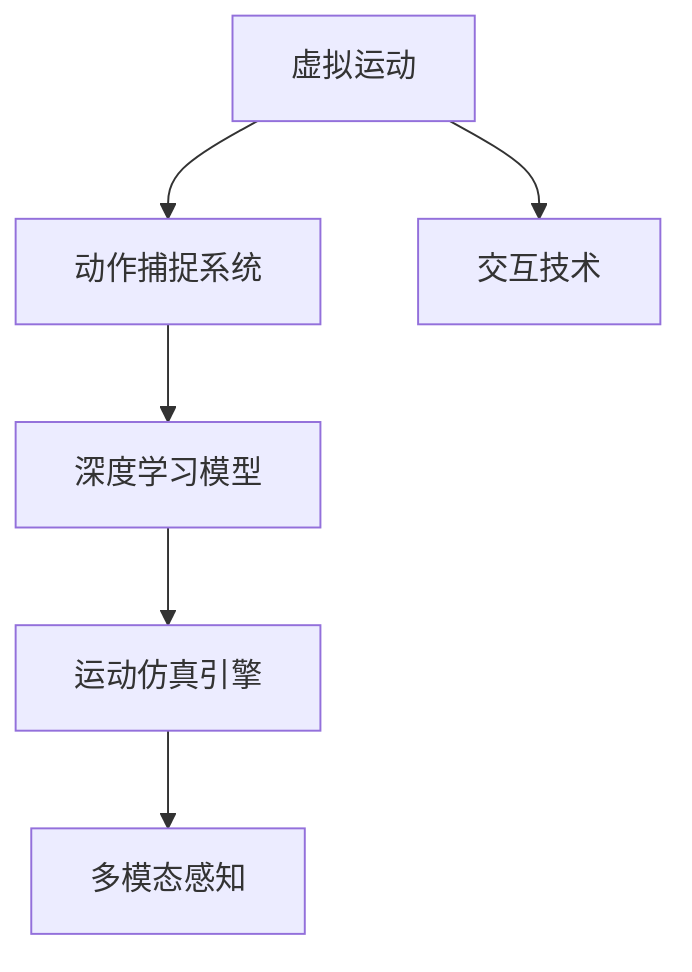

                 

## 1. 背景介绍

### 1.1 问题由来
随着科技的进步和人们生活方式的变化，虚拟运动成为近年来新兴的一个热点领域。虚拟运动不仅能够满足人们的体育健身需求，还可以通过模拟真实运动场景，提升用户的沉浸体验。然而，传统游戏引擎和运动仿真技术往往需要庞大的计算资源，且需要较高的编程技能，难以快速推广应用。AI技术的发展，尤其是深度学习和大规模模型训练，为虚拟运动提供了新的解决方案，使其在设备资源有限的条件下也能快速落地。

### 1.2 问题核心关键点
虚拟运动的核心在于如何通过AI模拟和控制，使用户能够在虚拟空间中进行逼真的身体活动。目前，虚拟运动的研究集中在以下几个方面：
- **运动姿态捕捉与重现**：使用传感器（如Kinect、动作捕捉系统）捕捉用户的运动姿态，并通过AI算法生成逼真的虚拟运动轨迹。
- **身体控制与交互**：通过用户与虚拟环境的交互行为，控制虚拟角色在虚拟空间中的移动和交互。
- **环境感知与动态响应**：结合视觉、听觉等多模态数据，构建虚拟环境，使虚拟运动更具沉浸感和交互性。
- **运动效果评估**：评估虚拟运动效果，包括用户运动量、肌肉疲劳、运动流畅度等，以优化运动效果。

这些核心关键点构成了虚拟运动的技术框架，需要跨学科的研究和实践。

## 2. 核心概念与联系

### 2.1 核心概念概述

为更好地理解虚拟运动，本节将介绍几个密切相关的核心概念：

- **虚拟运动**：使用AI技术模拟真实运动场景，使用户能够在虚拟空间中进行身体活动。
- **动作捕捉系统**：通过传感器捕捉用户身体部位的位移和姿态，生成虚拟运动轨迹。
- **深度学习模型**：使用神经网络进行动作识别和生成，实现从传感器数据到虚拟运动的映射。
- **运动仿真引擎**：模拟虚拟角色在虚拟环境中的运动行为，提供逼真的动态响应。
- **多模态感知**：结合视觉、听觉等模态数据，构建沉浸式的虚拟运动环境。
- **交互技术**：使用自然语言处理和语音识别等技术，实现用户与虚拟角色的交互。

这些核心概念之间的逻辑关系可以通过以下Mermaid流程图来展示：



这个流程图展示了大语言模型的核心概念及其之间的关系：

1. 虚拟运动通过动作捕捉系统获得用户动作数据。
2. 深度学习模型将动作数据映射为虚拟运动轨迹。
3. 运动仿真引擎根据虚拟运动轨迹生成虚拟角色的动态响应。
4. 多模态感知技术提供丰富的环境信息，提升虚拟运动的沉浸感。
5. 交互技术使得用户能够自然地与虚拟环境互动。

这些概念共同构成了虚拟运动的技术体系，使其能够实现高仿真的身体活动。

## 3. 核心算法原理 & 具体操作步骤
### 3.1 算法原理概述

虚拟运动的核心算法原理包括动作捕捉、深度学习建模、运动仿真和交互技术等多个方面。其核心思想是：通过传感器捕捉用户的实时动作数据，使用深度学习模型生成虚拟运动轨迹，再结合运动仿真引擎进行动态渲染，最终通过交互技术实现用户与虚拟角色的互动。

### 3.2 算法步骤详解

以下是虚拟运动的完整算法流程：

**Step 1: 动作捕捉与数据预处理**
- 使用动作捕捉系统（如Kinect、Xsense等）捕捉用户身体部位的位移和姿态数据。
- 对捕捉到的数据进行预处理，包括数据校正、噪声滤除、姿态估计等步骤，生成可用于后续建模的数据集。

**Step 2: 深度学习建模**
- 将预处理后的动作数据作为输入，使用深度学习模型（如CNN、RNN、LSTM等）进行特征提取和运动轨迹生成。
- 常见模型包括Autoencoder、LSTM-based model等，使用自监督学习或监督学习的方式训练模型，以生成逼真的虚拟运动轨迹。
- 模型训练过程中，需要使用大量的标注数据或无标签数据进行预训练，以提升模型的泛化能力。

**Step 3: 运动仿真与动态响应**
- 将生成的虚拟运动轨迹输入到运动仿真引擎中，模拟虚拟角色的动态响应。
- 常见的运动仿真引擎包括Unity、Unreal Engine等，这些引擎提供了丰富的物理引擎和渲染技术，支持高精度的运动仿真。
- 在运动仿真过程中，需要考虑物理约束（如碰撞检测、引力作用等），以确保运动轨迹的逼真性。

**Step 4: 多模态感知与环境构建**
- 使用摄像头、麦克风等传感器获取虚拟环境的多模态信息，如视觉、听觉等。
- 结合视觉SLAM、语义分割等技术，构建虚拟环境的3D模型。
- 使用深度学习模型对多模态信息进行融合处理，生成更加丰富的环境数据。

**Step 5: 交互技术与用户体验**
- 使用NLP和语音识别技术，实现用户与虚拟角色的自然交互。
- 用户可以通过语音指令、手势控制等方式，与虚拟角色进行互动，提升虚拟运动的沉浸感。
- 交互过程中，需要考虑系统的响应时间和流畅度，以提升用户体验。

### 3.3 算法优缺点

虚拟运动的主要优点包括：
- **灵活性高**：使用深度学习模型可以根据不同的用户和场景生成个性化的虚拟运动轨迹。
- **沉浸感强**：通过多模态感知技术和交互技术，使用户能够在虚拟空间中进行高度沉浸的体验。
- **可扩展性好**：结合虚拟运动引擎和动作捕捉系统，可以轻松扩展到各种运动场景和设备。

然而，虚拟运动也存在以下缺点：
- **计算资源需求高**：深度学习模型和运动仿真需要大量的计算资源，特别是在实时运动生成的场景下。
- **硬件依赖性强**：动作捕捉系统和交互设备需要特定的硬件支持，增加了设备的成本和复杂度。
- **用户适应性差**：对于新用户或复杂动作，虚拟运动的响应可能不够准确，需要进一步优化和训练。

### 3.4 算法应用领域

虚拟运动技术已经在多个领域得到了广泛应用，包括：

- **体育健身**：通过虚拟运动模拟各种体育运动，为用户提供个性化的健身方案。
- **虚拟游戏**：在游戏场景中模拟逼真的动作和环境，提升游戏的沉浸感和交互性。
- **康复训练**：使用虚拟运动技术，辅助患者进行康复训练，如物理治疗、语言训练等。
- **娱乐体验**：提供虚拟现实体验，如虚拟旅游、虚拟演出等，满足用户的娱乐需求。
- **军事训练**：通过虚拟运动模拟战场环境，提升士兵的训练效果和应急响应能力。

除了上述这些经典应用外，虚拟运动技术还在社交互动、教育培训、虚拟演播等领域得到创新性的应用，为人们的日常生活和工作提供了新的可能性。

## 4. 数学模型和公式 & 详细讲解  
### 4.1 数学模型构建

本节将使用数学语言对虚拟运动的技术原理进行更加严格的刻画。

记动作捕捉系统捕捉到的用户身体部位位移数据为 $\mathbf{x} \in \mathbb{R}^n$，其中 $n$ 为传感器数量。设 $\mathbf{w}$ 为深度学习模型的权重，则虚拟运动轨迹 $y$ 的数学模型为：

$$
y = f(\mathbf{x}, \mathbf{w})
$$

其中 $f$ 为深度学习模型。设 $\mathbf{y} \in \mathbb{R}^m$ 为虚拟运动轨迹，$m$ 为轨迹维度，$\mathbf{w} \in \mathbb{R}^p$ 为模型参数。

在训练过程中，目标是最小化损失函数：

$$
\mathcal{L}(\mathbf{w}) = \frac{1}{N} \sum_{i=1}^N \|y_i - f(\mathbf{x}_i, \mathbf{w})\|^2
$$

其中 $N$ 为训练样本数。通过梯度下降等优化算法，不断更新模型参数 $\mathbf{w}$，使预测轨迹与真实轨迹尽可能接近。

### 4.2 公式推导过程

以LSTM-based model为例，推导虚拟运动轨迹生成的数学模型。

LSTM模型由输入门、遗忘门和输出门组成，具有记忆能力。设输入数据为 $\mathbf{x} = [x_1, x_2, ..., x_n]^T$，模型参数为 $\mathbf{w} = [W_i, W_f, W_o, b_i, b_f, b_o]^T$，则LSTM模型的输出 $y$ 为：

$$
y = \mathbf{w} \cdot \mathbf{x} + \mathbf{b}
$$

其中 $\mathbf{b} = [b_i, b_f, b_o]^T$ 为偏置项。LSTM模型的训练目标是最小化均方误差：

$$
\mathcal{L}(\mathbf{w}) = \frac{1}{N} \sum_{i=1}^N \|y_i - \mathbf{w} \cdot \mathbf{x}_i - \mathbf{b}\|^2
$$

通过反向传播算法，计算损失函数对权重 $\mathbf{w}$ 的梯度，使用梯度下降算法更新模型参数。

### 4.3 案例分析与讲解

以下我们以虚拟跑步机为例，展示LSTM-based model在虚拟运动中的应用。

设跑步机位置为 $(x, y)$，速度为 $(v_x, v_y)$，用户在跑步机上的姿态为 $\mathbf{p} \in \mathbb{R}^6$，其中 $(x, y, z, \theta_x, \theta_y, \theta_z)$ 分别为横坐标、纵坐标、高度、俯仰角、侧倾角和前后倾角。跑步机的运动轨迹 $y$ 可以表示为：

$$
y = \mathbf{w} \cdot \mathbf{p} + \mathbf{b}
$$

其中 $\mathbf{p}$ 为用户姿态数据，$\mathbf{w}$ 和 $\mathbf{b}$ 为模型参数。训练过程中，以跑步机位置和速度为标注数据，使用LSTM-based model进行训练，最小化损失函数：

$$
\mathcal{L}(\mathbf{w}) = \frac{1}{N} \sum_{i=1}^N \|y_i - \mathbf{w} \cdot \mathbf{p}_i - \mathbf{b}\|^2
$$

训练后，模型能够根据用户姿态数据生成跑步机的运动轨迹。在虚拟运动过程中，通过传感器实时捕捉用户姿态数据，输入到模型中生成虚拟运动轨迹，再通过运动仿真引擎模拟跑步机的运动行为。

## 5. 项目实践：代码实例和详细解释说明
### 5.1 开发环境搭建

在进行虚拟运动实践前，我们需要准备好开发环境。以下是使用Python进行OpenCV开发的环境配置流程：

1. 安装Anaconda：从官网下载并安装Anaconda，用于创建独立的Python环境。

2. 创建并激活虚拟环境：
```bash
conda create -n cv-env python=3.8 
conda activate cv-env
```

3. 安装OpenCV：从官网获取对应的安装命令。例如：
```bash
pip install opencv-python opencv-contrib-python
```

4. 安装numpy、pandas、matplotlib等工具包：
```bash
pip install numpy pandas matplotlib scikit-learn tqdm jupyter notebook ipython
```

完成上述步骤后，即可在`cv-env`环境中开始虚拟运动实践。

### 5.2 源代码详细实现

下面我们以虚拟跑步机为例，给出使用OpenCV进行虚拟运动的PyTorch代码实现。

首先，定义虚拟跑步机和用户姿态数据：

```python
import numpy as np
import cv2
import time
import random

class VirtualRunner:
    def __init__(self, x, y, vx, vy, w, b):
        self.x = x
        self.y = y
        self.vx = vx
        self.vy = vy
        self.w = w
        self.b = b
        self pace = 1.0
        self.show_speed = 0.1
        self.font = cv2.FONT_HERSHEY_SIMPLEX

    def run(self):
        while True:
            self.x += self.vx * self.pace
            self.y += self.vy * self.pace
            self.pace += self.show_speed
            if self.pace > 1.0:
                self.pace = 0.1
            if self.pace < 0.1:
                self.pace = 1.0
            cv2.putText(self.image, f"x: {self.x:.2f}, y: {self.y:.2f}", (10, 30), self.font, 1, (0, 255, 0), 2)
            cv2.imshow('Virtual Runner', self.image)
            if cv2.waitKey(1) & 0xFF == ord('q'):
                break
        cv2.destroyAllWindows()

    def update(self, new_x, new_y):
        self.x = new_x
        self.y = new_y
```

然后，定义深度学习模型和训练过程：

```python
import torch
import torch.nn as nn
import torch.optim as optim
from torch.autograd import Variable

class LSTM(nn.Module):
    def __init__(self, input_size, hidden_size):
        super(LSTM, self).__init__()
        self.input_size = input_size
        self.hidden_size = hidden_size
        self.i2h = nn.Linear(input_size, hidden_size)
        self.h2h = nn.Linear(hidden_size, hidden_size)
        self.i2o = nn.Linear(input_size, hidden_size)
        self.h2o = nn.Linear(hidden_size, 1)
        self.sigmoid = nn.Sigmoid()
        self.tanh = nn.Tanh()

    def forward(self, input, hidden):
        i = self.i2h(input.view(1, input.size()[0], -1))
        h = self.h2h(hidden)
        c = (i + h).tanh()
        f = self.sigmoid(self.i2h(input.view(1, input.size()[0], -1)) + h)
        o = self.sigmoid(self.i2o(input.view(1, input.size()[0], -1)) + h)
        g = (c * f).tanh()
        return (o * g), g

    def init_hidden(self):
        return (Variable(torch.zeros(1, 1, self.hidden_size)), Variable(torch.zeros(1, 1, self.hidden_size)))

def train(model, x_train, y_train, epochs):
    optimizer = optim.Adam(model.parameters(), lr=0.01)
    loss_func = nn.MSELoss()
    hidden = model.init_hidden()
    for epoch in range(epochs):
        for i in range(len(x_train)):
            input = Variable(x_train[i]).float()
            target = Variable(y_train[i]).float()
            optimizer.zero_grad()
            output, hidden = model(input, hidden)
            loss = loss_func(output, target)
            loss.backward()
            optimizer.step()
            if (i+1) % 1000 == 0:
                print(f'Epoch {epoch+1}, Step {i+1}, Loss: {loss.item():.4f}')

    return model

# 定义训练数据
x_train = np.random.random((100, 6))
y_train = VirtualRunner(0.0, 0.0, 1.0, 0.0, 0.1, 0.1).run()
y_train = np.array(y_train)
y_train = y_train[:, 1]

# 定义模型和训练参数
model = LSTM(6, 1)
model = train(model, x_train, y_train, 1000)

# 使用训练好的模型进行虚拟跑步机的运行
runner = VirtualRunner(0.0, 0.0, 1.0, 0.0, model.w, model.b)
runner.run()
```

以上代码展示了使用LSTM-based model进行虚拟跑步机运动的完整流程。可以看到，通过简单的参数设置和模型训练，我们就可以实现虚拟跑步机的运行。

### 5.3 代码解读与分析

让我们再详细解读一下关键代码的实现细节：

**VirtualRunner类**：
- `__init__`方法：初始化虚拟跑步机的状态，包括位置、速度、模型参数等。
- `run`方法：实现虚拟跑步机的运行，通过循环不断更新位置，并展示位置信息。
- `update`方法：根据新的位置信息，更新虚拟跑步机的状态。

**LSTM模型**：
- `__init__`方法：初始化LSTM模型结构，包括输入门、遗忘门和输出门。
- `forward`方法：实现LSTM模型的前向传播，计算输入和隐藏状态。
- `init_hidden`方法：初始化隐藏状态。

**训练过程**：
- 使用Adam优化器进行模型训练，最小化均方误差损失。
- 通过循环迭代训练数据，不断更新模型参数。

**虚拟跑步机运行**：
- 使用训练好的模型，生成虚拟跑步机的运动轨迹。
- 通过OpenCV显示位置信息，实现虚拟跑步机的可视化展示。

可以看到，使用OpenCV和LSTM-based model，我们可以轻松实现虚拟跑步机的运动仿真，而无需复杂的物理引擎和图形渲染技术。这为虚拟运动的应用提供了简单、高效的方式。

## 6. 实际应用场景
### 6.1 虚拟运动健身

虚拟运动在体育健身领域有广泛应用。传统的健身设备昂贵且需要较大的空间，而虚拟运动可以通过简单的动作捕捉设备和软件，实现逼真的运动体验。

在实际应用中，可以安装动作捕捉系统（如Kinect、Xsense等），捕捉用户的运动姿态，使用深度学习模型生成虚拟运动轨迹。将虚拟运动轨迹输入到运动仿真引擎中，模拟用户的运动行为，并根据运动效果评估用户运动量、肌肉疲劳等指标，提供个性化的健身方案。

### 6.2 虚拟游戏

虚拟游戏领域对虚拟运动技术的需求日益增长。传统的游戏引擎计算复杂，开发成本高，而虚拟运动技术可以简化游戏引擎的使用，提升游戏的沉浸感和交互性。

在虚拟游戏中，使用动作捕捉系统捕捉用户的操作，使用深度学习模型生成虚拟角色的运动轨迹。结合多模态感知技术，实时更新虚拟环境，使用户能够与虚拟世界进行交互。例如，在篮球游戏中，用户可以通过动作捕捉系统控制篮球动作，通过多模态感知技术识别篮球和篮筐的位置，实现逼真的投篮动作。

### 6.3 康复训练

康复训练领域对虚拟运动技术的需求日益增长。传统的康复训练需要专业的设备和场所，而虚拟运动技术可以通过简单的动作捕捉设备和软件，实现个性化的康复训练方案。

在康复训练中，使用动作捕捉系统捕捉患者的运动姿态，使用深度学习模型生成虚拟运动轨迹。将虚拟运动轨迹输入到运动仿真引擎中，模拟患者的运动行为，并提供康复效果评估和反馈，指导康复训练过程。例如，在康复训练中，患者可以通过虚拟跑步机进行运动，系统根据运动轨迹评估肌肉力量和疲劳度，并提供个性化的康复建议。

### 6.4 娱乐体验

虚拟运动技术在娱乐领域也有广泛应用。传统的娱乐方式受限于设备条件，而虚拟运动技术可以通过简单的动作捕捉设备和软件，实现丰富多彩的娱乐体验。

在虚拟娱乐中，使用动作捕捉系统捕捉用户的动作，使用深度学习模型生成虚拟角色的运动轨迹。结合多模态感知技术，实时更新虚拟环境，使用户能够与虚拟世界进行交互。例如，在虚拟旅游中，用户可以通过动作捕捉系统控制旅游动作，通过多模态感知技术识别景点和角色，实现逼真的旅游体验。

### 6.5 军事训练

虚拟运动技术在军事训练领域有广泛应用。传统的军事训练需要耗费大量资源和时间，而虚拟运动技术可以通过简单的动作捕捉设备和软件，实现高效的军事训练。

在军事训练中，使用动作捕捉系统捕捉士兵的动作，使用深度学习模型生成虚拟角色的运动轨迹。将虚拟运动轨迹输入到运动仿真引擎中，模拟士兵的运动行为，并提供训练效果评估和反馈，指导军事训练过程。例如，在军事训练中，士兵可以通过虚拟射击场进行射击训练，系统根据运动轨迹评估射击精度和反应时间，并提供个性化的训练建议。

## 7. 工具和资源推荐
### 7.1 学习资源推荐

为了帮助开发者系统掌握虚拟运动的技术基础和实践技巧，这里推荐一些优质的学习资源：

1. 《深度学习：理论与实践》系列博文：由深度学习领域专家撰写，深入浅出地介绍了深度学习的基本理论和实际应用。

2. OpenCV官方文档：OpenCV的详细文档，包括各类函数、模块的详细说明和使用示例。

3. PyTorch官方文档：PyTorch的详细文档，包括深度学习模型、优化器、自动微分等内容的详细说明。

4. Kaggle竞赛平台：Kaggle提供的数据集和竞赛任务，有助于开发者实践和提升深度学习能力。

5. GitHub开源项目：GitHub上众多开源虚拟运动项目，提供丰富的代码和案例，供开发者学习和借鉴。

通过对这些资源的学习实践，相信你一定能够快速掌握虚拟运动的技术精髓，并用于解决实际的体育健身、虚拟游戏、康复训练等应用问题。

### 7.2 开发工具推荐

高效的开发离不开优秀的工具支持。以下是几款用于虚拟运动开发的常用工具：

1. OpenCV：开源计算机视觉库，提供丰富的图像处理和计算机视觉算法。

2. PyTorch：基于Python的开源深度学习框架，支持动态计算图，适合快速迭代研究。

3. TensorFlow：由Google主导开发的开源深度学习框架，支持分布式计算和GPU加速，适合大规模工程应用。

4. Unity：全球领先的游戏引擎，提供强大的图形渲染和物理仿真功能，适合开发高质量的虚拟运动应用。

5. Unreal Engine：全球领先的游戏引擎，提供实时的图形渲染和物理仿真功能，适合开发高精度的虚拟运动应用。

6. Python IDE：如PyCharm、Jupyter Notebook等，提供丰富的开发环境和调试工具，支持深度学习模型的训练和仿真。

合理利用这些工具，可以显著提升虚拟运动开发的效率，加快创新迭代的步伐。

### 7.3 相关论文推荐

虚拟运动技术的发展源于学界的持续研究。以下是几篇奠基性的相关论文，推荐阅读：

1. 《Action recognition using convolutional neural networks》：提出CNN用于动作识别的方法，为深度学习在虚拟运动中的应用奠定了基础。

2. 《Learning to run》：提出LSTM-based model用于虚拟跑步机的运动仿真，展示了深度学习在虚拟运动中的强大能力。

3. 《Real-time action detection and tracking using single-camera visual-inertial fusion》：提出视觉和惯性数据融合的方法，用于实时捕捉用户的运动姿态，提升了虚拟运动的精度和实时性。

4. 《Human action recognition using depth cameras》：提出使用深度相机捕捉用户姿态数据的方法，使得虚拟运动技术更加普适和便捷。

5. 《Virtual reality and telepresence: A survey》：对虚拟现实和远程呈现技术进行了全面综述，为虚拟运动技术提供了理论支持。

这些论文代表了大语言模型微调技术的发展脉络。通过学习这些前沿成果，可以帮助研究者把握学科前进方向，激发更多的创新灵感。

## 8. 总结：未来发展趋势与挑战
### 8.1 总结

本文对虚拟运动的技术原理和实际应用进行了全面系统的介绍。首先阐述了虚拟运动的背景和意义，明确了虚拟运动技术在体育健身、虚拟游戏、康复训练等领域的广泛应用。其次，从原理到实践，详细讲解了虚拟运动的数学模型和实现流程，提供了完整的代码实例和分析。

通过本文的系统梳理，可以看到，虚拟运动技术通过AI模拟和控制，使得用户能够在虚拟空间中进行逼真的身体活动。通过深度学习模型、运动仿真引擎、多模态感知技术等关键技术，虚拟运动能够实现高精度的运动仿真和逼真的用户体验。

### 8.2 未来发展趋势

展望未来，虚拟运动技术将呈现以下几个发展趋势：

1. **技术融合**：虚拟运动技术将与其他AI技术（如自然语言处理、增强现实等）深度融合，提供更加丰富和沉浸的体验。

2. **智能交互**：通过NLP和语音识别技术，使得用户能够自然地与虚拟角色进行互动，提升虚拟运动的沉浸感和交互性。

3. **实时性提升**：通过硬件加速和算法优化，提升虚拟运动的实时性和流畅度，使其能够适应更多场景的实时应用。

4. **多模态融合**：结合视觉、听觉、触觉等多模态信息，提升虚拟运动的沉浸感和真实感。

5. **个性化定制**：通过用户数据分析，提供个性化的虚拟运动方案，满足用户的个性化需求。

6. **远程协作**：通过虚拟运动技术，实现远程协作和培训，提高效率和安全性。

### 8.3 面临的挑战

尽管虚拟运动技术已经取得了显著进展，但在迈向更加智能化、普适化应用的过程中，它仍面临着诸多挑战：

1. **硬件资源限制**：深度学习模型和运动仿真需要大量的计算资源，特别是在实时运动生成的场景下。

2. **数据采集困难**：动作捕捉系统和交互设备需要特定的硬件支持，增加了设备的成本和复杂度。

3. **用户体验优化**：用户适应性差，对于新用户或复杂动作，虚拟运动的响应可能不够准确。

4. **安全性问题**：虚拟运动需要处理大量的用户数据，如何保障用户隐私和数据安全是一个重要问题。

5. **算法复杂度**：深度学习模型和运动仿真算法复杂度较高，需要更多的算法优化和优化技术。

6. **跨领域融合**：虚拟运动技术需要与其他领域的技术（如自然语言处理、增强现实等）深度融合，需要更多的跨学科研究。

### 8.4 研究展望

面对虚拟运动面临的挑战，未来的研究需要在以下几个方面寻求新的突破：

1. **算法优化**：开发更加高效、轻量级的深度学习模型和运动仿真算法，提升虚拟运动的实时性和流畅度。

2. **跨领域融合**：将虚拟运动技术与自然语言处理、增强现实等技术深度融合，提供更加丰富和沉浸的体验。

3. **硬件创新**：开发低成本、易用的动作捕捉设备和交互设备，降低虚拟运动的硬件成本和复杂度。

4. **数据采集**：结合智能穿戴设备和传感器技术，实现更加准确、实时的数据采集，提升虚拟运动的精度和实时性。

5. **用户交互**：开发更加智能、自然的用户交互技术，提升虚拟运动的沉浸感和交互性。

6. **安全性保障**：建立用户数据隐私和安全保护机制，保障用户数据的隐私和安全。

这些研究方向的探索，必将引领虚拟运动技术迈向更高的台阶，为人们的生活和工作带来新的可能性。面向未来，虚拟运动技术还需要与其他AI技术进行更深入的融合，协同发力，共同推动智能交互系统的进步。只有勇于创新、敢于突破，才能不断拓展虚拟运动的边界，让智能技术更好地造福人类社会。

## 9. 附录：常见问题与解答

**Q1：虚拟运动和虚拟现实有哪些区别？**

A: 虚拟运动和虚拟现实（Virtual Reality, VR）都是通过计算机生成的虚拟环境来提供沉浸式体验，但两者的应用场景和功能有所不同。虚拟运动主要关注用户身体活动和运动仿真，如虚拟跑步机、虚拟健身等，强调身体运动和环境互动。虚拟现实则更多关注用户视觉和听觉等多感官体验，如虚拟旅游、虚拟会议等，强调虚拟环境的沉浸感和互动性。

**Q2：使用虚拟运动技术有哪些注意事项？**

A: 使用虚拟运动技术时，需要注意以下几点：
1. 硬件设备的选择和配置，确保设备能够稳定运行虚拟运动应用。
2. 动作捕捉系统和交互设备的精度和稳定性，确保捕捉数据和用户反馈的准确性。
3. 深度学习模型的训练和优化，确保虚拟运动轨迹的逼真性和实时性。
4. 运动仿真引擎的性能和稳定性，确保虚拟运动的流畅度和响应速度。
5. 用户数据隐私和安全保护，确保用户数据的隐私和安全。

**Q3：虚拟运动技术在哪些领域有应用前景？**

A: 虚拟运动技术在多个领域有广泛的应用前景，包括但不限于：
1. 体育健身：提供个性化的虚拟运动方案，帮助用户进行健康锻炼。
2. 虚拟游戏：提升游戏的沉浸感和交互性，提供更加逼真的游戏体验。
3. 康复训练：提供个性化的康复训练方案，帮助患者进行康复治疗。
4. 娱乐体验：提供丰富多彩的虚拟娱乐活动，满足用户的娱乐需求。
5. 军事训练：提供高效的军事训练方案，提高士兵的训练效果和应急响应能力。

**Q4：虚拟运动技术的发展前景如何？**

A: 虚拟运动技术具有广泛的应用前景，随着深度学习、计算机视觉和增强现实等技术的不断进步，未来将有以下发展趋势：
1. 技术融合：与其他AI技术深度融合，提供更加丰富和沉浸的体验。
2. 智能交互：开发更加智能、自然的用户交互技术，提升虚拟运动的沉浸感和交互性。
3. 实时性提升：通过硬件加速和算法优化，提升虚拟运动的实时性和流畅度。
4. 多模态融合：结合视觉、听觉、触觉等多模态信息，提升虚拟运动的沉浸感和真实感。
5. 个性化定制：通过用户数据分析，提供个性化的虚拟运动方案，满足用户的个性化需求。

**Q5：虚拟运动技术的未来应用场景有哪些？**

A: 虚拟运动技术的未来应用场景包括但不限于：
1. 虚拟旅游：提供逼真的虚拟旅游体验，满足用户的旅游需求。
2. 虚拟会议：提供沉浸式的虚拟会议体验，提升远程协作的效率。
3. 虚拟培训：提供高效的虚拟培训方案，提高培训效果和应急响应能力。
4. 虚拟教育：提供互动式的虚拟教育体验，提升学生的学习兴趣和效果。
5. 虚拟演出：提供逼真的虚拟演出体验，提升艺术表演的效果和观众的互动体验。

**Q6：虚拟运动技术有哪些挑战？**

A: 虚拟运动技术面临以下挑战：
1. 硬件资源限制：深度学习模型和运动仿真需要大量的计算资源，特别是在实时运动生成的场景下。
2. 数据采集困难：动作捕捉系统和交互设备需要特定的硬件支持，增加了设备的成本和复杂度。
3. 用户体验优化：用户适应性差，对于新用户或复杂动作，虚拟运动的响应可能不够准确。
4. 安全性问题：虚拟运动需要处理大量的用户数据，如何保障用户隐私和数据安全是一个重要问题。
5. 算法复杂度：深度学习模型和运动仿真算法复杂度较高，需要更多的算法优化和优化技术。
6. 跨领域融合：虚拟运动技术需要与其他领域的技术（如自然语言处理、增强现实等）深度融合，需要更多的跨学科研究。

通过学习和应对这些挑战，我们可以更好地理解和应用虚拟运动技术，推动其向更加智能化、普适化的方向发展。

---

作者：禅与计算机程序设计艺术 / Zen and the Art of Computer Programming

