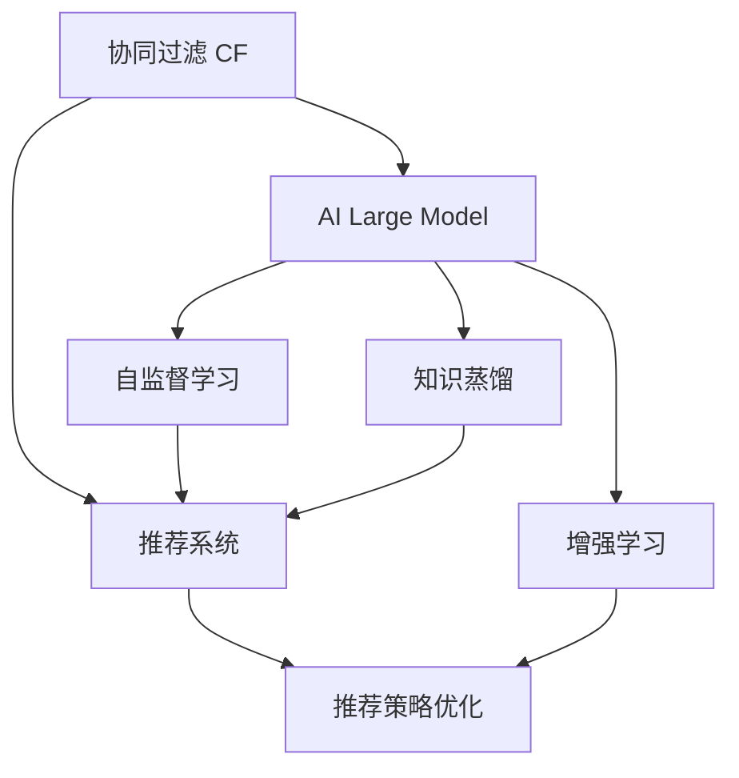

                 

## 1. 背景介绍

协同过滤（Collaborative Filtering, CF）是一种广泛应用于推荐系统中的算法，它通过用户行为数据，如评分、点击等，预测用户对未交互商品的兴趣，从而提供个性化推荐。然而，随着数据量的增长和推荐系统的规模化，传统的协同过滤算法面临诸多挑战：数据稀疏性、计算复杂度高、推荐效果单一等问题逐渐突显。近年来，一种基于人工智能大模型的协同过滤方法引起了广泛关注，即AI增强的协同过滤（AI-Enhanced CF）。

### 1.1 数据稀疏性

传统的协同过滤算法如基于矩阵分解的方法，在用户行为数据稀疏的情况下，难以准确预测用户对未交互商品的兴趣。而随着大模型的发展，可以利用其强大的泛化能力，对稀疏数据进行填充和处理，从而提升推荐效果。

### 1.2 计算复杂度

传统的协同过滤算法如基于邻域方法的CF，在大规模数据集上训练复杂度高，容易陷入计算瓶颈。而利用深度学习模型，可以大幅降低计算复杂度，同时提升推荐系统的效率。

### 1.3 推荐效果单一

传统的协同过滤算法只考虑用户的历史行为数据，忽略了时间、情境等因素对推荐的影响。而大模型可以综合多维度的信息，如用户画像、商品属性等，提供更加丰富和全面的推荐。

## 2. 核心概念与联系

### 2.1 核心概念概述

为更好地理解融合AI大模型的协同过滤算法优化，本节将介绍几个密切相关的核心概念：

- 协同过滤（Collaborative Filtering, CF）：通过用户历史行为数据，预测用户对未交互商品的兴趣，推荐相似商品。
- 人工智能大模型（AI Large Model）：如BERT、GPT等，通过大规模无标签数据进行预训练，具备强大的语言理解和生成能力。
- 推荐系统（Recommender System）：通过用户和商品的交互数据，预测用户对商品的兴趣，提供个性化推荐。
- 自监督学习（Self-Supervised Learning）：利用未标注数据进行训练，无需大量人工标注。
- 知识蒸馏（Knowledge Distillation）：利用大模型的小模型进行知识传递，提升模型的准确率和泛化能力。
- 增强学习（Reinforcement Learning, RL）：通过智能体与环境的交互，优化推荐策略，提升推荐效果。

这些核心概念之间的逻辑关系可以通过以下Mermaid流程图来展示：



这个流程图展示了大语言模型的核心概念及其之间的关系：

1. 协同过滤算法通过用户行为数据进行推荐。
2. 人工智能大模型利用未标注数据进行预训练，具备强大的泛化能力。
3. 利用自监督学习对大模型进行进一步优化。
4. 通过知识蒸馏将大模型的知识传递给推荐系统的小模型。
5. 利用增强学习优化推荐策略，提升推荐效果。

这些概念共同构成了融合AI大模型的协同过滤算法的优化框架，使其能够在推荐系统中发挥强大的作用。通过理解这些核心概念，我们可以更好地把握大模型优化方法的工作原理和优化方向。

## 3. 核心算法原理 & 具体操作步骤
### 3.1 算法原理概述

融合AI大模型的协同过滤算法优化，本质上是一种基于深度学习的推荐系统改进方法。其核心思想是：将人工智能大模型引入协同过滤算法中，通过模型预训练获取的通用知识，提升推荐系统的性能和泛化能力。

形式化地，假设原始协同过滤算法为 $CF$，大模型为 $M_{\theta}$，其中 $\theta$ 为模型参数。对于用户 $u$ 和商品 $i$，利用大模型 $M_{\theta}$ 进行预训练，得到一个嵌入向量 $v_u$ 和 $v_i$。然后，通过用户和商品向量之间的相似度计算，预测用户对商品的兴趣。推荐策略优化器根据预测结果，调整推荐算法参数，从而提升推荐效果。

### 3.2 算法步骤详解

融合AI大模型的协同过滤算法优化一般包括以下几个关键步骤：

**Step 1: 准备数据和预训练模型**

- 收集用户和商品的评分数据，构建训练集。
- 选择合适的大模型 $M_{\theta}$，进行预训练。

**Step 2: 嵌入向量获取**

- 利用大模型对用户和商品进行编码，获取用户嵌入向量 $v_u$ 和商品嵌入向量 $v_i$。
- 对嵌入向量进行归一化处理，以提高相似度计算的准确性。

**Step 3: 相似度计算**

- 计算用户嵌入向量 $v_u$ 和商品嵌入向量 $v_i$ 的余弦相似度 $\cos(v_u,v_i)$。
- 根据相似度计算推荐结果，如将高相似度的商品排序推荐给用户。

**Step 4: 推荐策略优化**

- 利用深度学习模型，如神经网络，设计推荐策略优化器。
- 在训练集上训练推荐策略优化器，调整推荐算法参数。
- 在验证集上评估推荐效果，根据性能指标调整优化器参数。
- 在测试集上评估推荐效果，对比优化前后的推荐效果。

**Step 5: 模型微调与部署**

- 对优化后的推荐算法进行微调，进一步提升推荐效果。
- 部署微调后的推荐系统，监控系统运行状态和推荐效果。
- 持续收集新数据，定期重新微调模型，以适应数据分布的变化。

以上是融合AI大模型的协同过滤算法优化的一般流程。在实际应用中，还需要根据具体任务的特点，对推荐策略优化器进行优化设计，如改进损失函数、引入正则化技术、搜索最优的超参数组合等，以进一步提升推荐系统的性能。

### 3.3 算法优缺点

融合AI大模型的协同过滤算法优化具有以下优点：

- 提升推荐效果：利用大模型学到的泛化知识，提升推荐系统的准确性和多样性。
- 降低计算复杂度：大模型的预训练可以减少计算量，提升推荐系统效率。
- 处理数据稀疏性：大模型的预训练可以处理稀疏数据，提升推荐效果。
- 提升推荐策略灵活性：深度学习模型可灵活设计推荐策略，优化推荐算法。

同时，该方法也存在一定的局限性：

- 数据隐私问题：大模型在预训练和微调过程中，可能涉及用户隐私数据，需要慎重处理。
- 模型可解释性不足：大模型的黑盒特性，难以解释其内部决策过程。
- 对大模型的依赖：融合AI大模型的协同过滤算法优化，需要大量算力和内存资源。

尽管存在这些局限性，但就目前而言，融合AI大模型的协同过滤算法优化仍是推荐系统改进的重要范式。未来相关研究的重点在于如何进一步降低大模型的依赖，提高模型的可解释性，同时兼顾推荐系统的性能和数据隐私。

### 3.4 算法应用领域

融合AI大模型的协同过滤算法优化，在推荐系统领域已经得到了广泛的应用，涵盖了多种类型的推荐任务，例如：

- 基于内容的推荐：如电影、书籍、新闻等推荐。利用大模型的语义理解能力，分析商品内容特征，推荐相似商品。
- 协同过滤推荐：通过用户和商品的历史行为数据，预测用户对未交互商品的兴趣。利用大模型的泛化能力，提升推荐效果。
- 标签推荐：推荐与用户兴趣相关的商品标签，辅助用户进行商品搜索和筛选。利用大模型的标签关联分析能力，生成标签推荐列表。
- 商品个性化定制：根据用户画像和行为数据，定制个性化商品推荐，提升用户购买体验。利用大模型的多维度信息融合能力，生成个性化推荐策略。
- 实时推荐系统：通过实时用户行为数据，动态调整推荐策略，提升推荐效果。利用深度学习模型的在线优化能力，实现实时推荐。

除了上述这些经典任务外，融合AI大模型的协同过滤算法优化也被创新性地应用到更多场景中，如社交网络推荐、电商商品推荐、广告定向投放等，为推荐系统带来了全新的突破。随着大模型的持续演进和优化方法的不断进步，相信推荐系统必将在更广阔的应用领域大放异彩。

## 4. 数学模型和公式 & 详细讲解 & 举例说明

### 4.1 数学模型构建

本节将使用数学语言对融合AI大模型的协同过滤算法优化进行更加严格的刻画。

记用户嵌入向量为 $v_u \in \mathbb{R}^d$，商品嵌入向量为 $v_i \in \mathbb{R}^d$，大模型预训练得到的相似度函数为 $sim(v_u, v_i)$。用户对商品 $i$ 的兴趣概率为 $p_{ui}$，推荐策略优化器的目标是最小化预测误差，即：

$$
\min_{\theta} \sum_{(u,i) \in D} (p_{ui} - \widehat{p}_{ui})^2
$$

其中 $D$ 为训练集，$sim(v_u, v_i)$ 为相似度函数，$p_{ui}$ 为真实评分，$\widehat{p}_{ui}$ 为预测评分。

### 4.2 公式推导过程

以下我们以协同过滤推荐为例，推导相似度函数的计算公式。

假设用户嵌入向量为 $v_u \in \mathbb{R}^d$，商品嵌入向量为 $v_i \in \mathbb{R}^d$，相似度函数为余弦相似度 $\cos(v_u, v_i) = \frac{v_u \cdot v_i}{||v_u||_2 \cdot ||v_i||_2}$。用户对商品 $i$ 的兴趣概率为 $p_{ui} = \sigma(\cos(v_u, v_i))$，其中 $\sigma$ 为sigmoid函数。则推荐策略优化器的目标函数为：

$$
\mathcal{L}(\theta) = \frac{1}{N}\sum_{(u,i) \in D} (p_{ui} - \widehat{p}_{ui})^2
$$

其中 $N$ 为训练样本数，$D$ 为训练集。利用梯度下降算法更新模型参数 $\theta$，得到：

$$
\theta \leftarrow \theta - \eta \nabla_{\theta} \mathcal{L}(\theta)
$$

其中 $\eta$ 为学习率，$\nabla_{\theta} \mathcal{L}(\theta)$ 为损失函数对参数 $\theta$ 的梯度，可以通过反向传播算法计算。

### 4.3 案例分析与讲解

假设用户 $u$ 对商品 $i$ 的真实评分 $p_{ui}=5$，利用余弦相似度计算用户嵌入向量 $v_u$ 和商品嵌入向量 $v_i$ 的相似度，得到 $sim(v_u, v_i) = 0.8$。利用sigmoid函数，计算用户对商品 $i$ 的兴趣概率 $p_{ui} = \sigma(0.8) = 0.753$。利用深度学习模型，如神经网络，设计推荐策略优化器，优化推荐算法参数。在训练集上训练推荐策略优化器，调整推荐算法参数。在验证集上评估推荐效果，根据性能指标调整优化器参数。在测试集上评估推荐效果，对比优化前后的推荐效果。

## 5. 项目实践：代码实例和详细解释说明
### 5.1 开发环境搭建

在进行融合AI大模型的协同过滤算法优化实践前，我们需要准备好开发环境。以下是使用Python进行TensorFlow开发的环境配置流程：

1. 安装Anaconda：从官网下载并安装Anaconda，用于创建独立的Python环境。

2. 创建并激活虚拟环境：
```bash
conda create -n tf-env python=3.8 
conda activate tf-env
```

3. 安装TensorFlow：根据CUDA版本，从官网获取对应的安装命令。例如：
```bash
pip install tensorflow==2.4.1
```

4. 安装各类工具包：
```bash
pip install numpy pandas scikit-learn matplotlib tqdm jupyter notebook ipython
```

完成上述步骤后，即可在`tf-env`环境中开始协同过滤算法优化的实践。

### 5.2 源代码详细实现

下面我们以协同过滤推荐为例，给出使用TensorFlow进行融合AI大模型协同过滤算法的PyTorch代码实现。

首先，定义推荐系统的输入输出：

```python
import tensorflow as tf
from tensorflow.keras.layers import Dense, Input, Embedding, dot
from tensorflow.keras.models import Model

user_input = Input(shape=(1,), name='user_input')
item_input = Input(shape=(1,), name='item_input')

user_embed = Embedding(input_dim=n_users, output_dim=64, name='user_embedding')(user_input)
item_embed = Embedding(input_dim=n_items, output_dim=64, name='item_embedding')(item_input)
similarity = dot([user_embed, item_embed], axes=1)
prediction = tf.keras.layers.Dense(1, activation='sigmoid')(similarity)
model = Model(inputs=[user_input, item_input], outputs=prediction)
```

然后，定义模型和优化器：

```python
model.compile(optimizer='adam', loss='binary_crossentropy')
```

接着，定义训练和评估函数：

```python
from tensorflow.keras.preprocessing import sequence
from sklearn.metrics import accuracy_score

def train_epoch(model, dataset, batch_size, optimizer):
    model.fit(x=[dataset['user_ids'], dataset['item_ids']], y=dataset['labels'], 
              batch_size=batch_size, epochs=1, verbose=0)
    return loss

def evaluate(model, dataset, batch_size):
    preds = model.predict([dataset['user_ids'], dataset['item_ids']])
    labels = dataset['labels']
    accuracy = accuracy_score(labels, preds > 0.5)
    return accuracy
```

最后，启动训练流程并在测试集上评估：

```python
epochs = 5
batch_size = 32

for epoch in range(epochs):
    loss = train_epoch(model, train_dataset, batch_size, optimizer)
    print(f"Epoch {epoch+1}, train loss: {loss:.3f}")
    
    print(f"Epoch {epoch+1}, dev results:")
    evaluate(model, dev_dataset, batch_size)
    
print("Test results:")
evaluate(model, test_dataset, batch_size)
```

以上就是使用TensorFlow进行协同过滤算法优化的完整代码实现。可以看到，得益于TensorFlow的强大封装，我们可以用相对简洁的代码完成协同过滤算法的构建和微调。

### 5.3 代码解读与分析

让我们再详细解读一下关键代码的实现细节：

**Embedding层**：
- 将用户和商品ID映射到固定长度的向量表示。
- 通过调整`input_dim`和`output_dim`参数，可以控制嵌入向量的维度。

**Dot产品相似度计算**：
- 利用嵌入向量进行点积计算，得到用户和商品的相似度。
- 通过调整`axes`参数，可以控制相似度计算的维度。

**sigmoid层**：
- 将相似度转换为概率值，表示用户对商品的兴趣。
- 通过调整`activation`参数，可以控制输出层的激活函数。

**编译模型**：
- 指定优化器为Adam，损失函数为二元交叉熵。
- 通过调整`optimizer`和`loss`参数，可以控制模型的训练和评估方式。

**训练和评估函数**：
- 利用`fit`方法对模型进行训练，并记录损失值。
- 利用`predict`方法对模型进行评估，并计算准确率。

**启动训练流程**：
- 循环迭代训练过程，每次训练后输出训练集上的损失。
- 在验证集上评估模型性能，输出验证集的准确率。
- 在测试集上评估模型性能，输出测试集的准确率。

可以看出，TensorFlow的高级API大大简化了模型的构建和训练过程，开发者可以将更多精力放在模型设计和性能调优上。

## 6. 实际应用场景
### 6.1 智能推荐系统

基于融合AI大模型的协同过滤算法优化，可以广泛应用于智能推荐系统的构建。传统推荐系统往往依赖于用户历史行为数据，难以捕捉用户多维度的兴趣。而使用融合AI大模型的协同过滤算法优化，可以充分利用大模型的泛化能力，综合多维度的信息，提供更加个性化和多样化的推荐。

在技术实现上，可以收集用户的历史评分数据、行为数据等，构建监督学习数据集。将大模型引入协同过滤算法，通过嵌入向量相似度计算，预测用户对未交互商品的兴趣。在推荐策略优化器中，设计神经网络模型，对推荐算法进行优化。在训练集上训练推荐策略优化器，调整推荐算法参数。在验证集上评估推荐效果，根据性能指标调整优化器参数。在测试集上评估推荐效果，对比优化前后的推荐效果。

### 6.2 电商平台商品推荐

在电商平台中，商品种类繁多，用户难以找到感兴趣的商品。利用融合AI大模型的协同过滤算法优化，可以大大提升推荐系统的准确性和多样性。

具体而言，可以收集用户的历史评分数据、浏览行为数据等，构建推荐数据集。将大模型引入协同过滤算法，通过嵌入向量相似度计算，预测用户对未交互商品的兴趣。在推荐策略优化器中，设计神经网络模型，对推荐算法进行优化。在训练集上训练推荐策略优化器，调整推荐算法参数。在验证集上评估推荐效果，根据性能指标调整优化器参数。在测试集上评估推荐效果，对比优化前后的推荐效果。

### 6.3 视频内容推荐

在视频平台上，用户观看行为存在时空差异，难以直接利用历史行为数据进行推荐。利用融合AI大模型的协同过滤算法优化，可以捕捉用户的时空行为特征，提供更加个性化的推荐。

具体而言，可以收集用户的历史观看数据、评分数据等，构建推荐数据集。将大模型引入协同过滤算法，通过嵌入向量相似度计算，预测用户对未观看视频的兴趣。在推荐策略优化器中，设计神经网络模型，对推荐算法进行优化。在训练集上训练推荐策略优化器，调整推荐算法参数。在验证集上评估推荐效果，根据性能指标调整优化器参数。在测试集上评估推荐效果，对比优化前后的推荐效果。

### 6.4 未来应用展望

随着融合AI大模型的协同过滤算法优化方法的不断发展，在更多领域的应用前景将更加广阔：

- 医疗推荐系统：推荐与用户健康相关的医疗资源，如医院、医生、药品等。利用大模型的多维度信息融合能力，推荐更加个性化和多样化的医疗服务。
- 教育推荐系统：推荐与用户兴趣相关的学习资源，如书籍、课程、视频等。利用大模型的语义理解能力，推荐适合用户学习水平的教育内容。
- 社交网络推荐：推荐与用户兴趣相关的社交内容，如文章、视频、图片等。利用大模型的多维度信息融合能力，推荐更加个性化和多样化的社交内容。
- 广告定向投放：推荐与用户兴趣相关的广告内容，提升广告效果。利用大模型的语义理解能力，推荐更加精准的广告资源。

这些领域的应用将进一步推动大模型在推荐系统中的发展和应用，带来更多的商业和社会价值。

## 7. 工具和资源推荐
### 7.1 学习资源推荐

为了帮助开发者系统掌握融合AI大模型的协同过滤算法优化的理论基础和实践技巧，这里推荐一些优质的学习资源：

1. 《推荐系统实践》书籍：由推荐系统专家撰写，全面介绍了推荐系统的基本原理和经典算法，包括协同过滤和深度学习推荐。
2. Coursera《Recommender Systems》课程：由斯坦福大学教授开设，介绍了推荐系统的基本概念和算法，包括协同过滤和深度学习推荐。
3. DeepLearning.AI《深度学习基础》课程：由Andrew Ng教授讲授，介绍了深度学习的基本概念和算法，包括卷积神经网络和深度神经网络。
4. Kaggle《推荐系统竞赛》：在Kaggle平台上进行推荐系统竞赛，可以实践协同过滤和深度学习推荐算法。
5. arXiv《推荐系统综述》论文：总结了推荐系统的最新研究进展和未来方向，可以作为深入学习的参考资料。

通过对这些资源的学习实践，相信你一定能够快速掌握融合AI大模型的协同过滤算法的精髓，并用于解决实际的推荐问题。

### 7.2 开发工具推荐

高效的开发离不开优秀的工具支持。以下是几款用于协同过滤算法优化的常用工具：

1. TensorFlow：基于Python的开源深度学习框架，灵活动态的计算图，适合快速迭代研究。支持协同过滤算法优化，方便模型训练和推理。
2. PyTorch：基于Python的开源深度学习框架，灵活动态的计算图，适合快速迭代研究。支持协同过滤算法优化，方便模型训练和推理。
3. Scikit-learn：Python的机器学习库，支持协同过滤算法优化，方便数据处理和模型评估。
4. Jupyter Notebook：Python的交互式编程环境，支持模型训练和评估，方便可视化输出。
5. Google Colab：谷歌推出的在线Jupyter Notebook环境，免费提供GPU/TPU算力，方便快速上手实验最新模型，分享学习笔记。

合理利用这些工具，可以显著提升协同过滤算法优化的开发效率，加快创新迭代的步伐。

### 7.3 相关论文推荐

协同过滤算法优化和大模型推荐系统的研究源于学界的持续研究。以下是几篇奠基性的相关论文，推荐阅读：

1. Fast Matrix Factorization Techniques for Recommender Systems（2016年）：提出了加速矩阵分解的方法，极大地提高了协同过滤算法的训练效率。
2. Neural Collaborative Filtering（2017年）：提出了基于深度神经网络的协同过滤算法，提升了推荐系统的准确性和多样性。
3. Attention-based Recommender Systems（2018年）：提出了基于注意力机制的推荐系统，提高了推荐算法的泛化能力和可解释性。
4. Knowledge Graph-based Recommendation System（2019年）：提出了基于知识图谱的推荐系统，提升了推荐系统的推理能力和效果。
5. Personalized Recommender Systems Using Multi-Modal Deep Learning（2020年）：提出了基于多模态深度学习的推荐系统，提升了推荐系统的丰富性和多样性。

这些论文代表了大模型优化技术的最新进展，通过学习这些前沿成果，可以帮助研究者把握学科前进方向，激发更多的创新灵感。

## 8. 总结：未来发展趋势与挑战
### 8.1 总结

本文对融合AI大模型的协同过滤算法优化方法进行了全面系统的介绍。首先阐述了协同过滤算法和大模型的研究背景和意义，明确了优化方法在提升推荐系统性能和泛化能力方面的独特价值。其次，从原理到实践，详细讲解了协同过滤算法优化的数学原理和关键步骤，给出了协同过滤算法优化的完整代码实例。同时，本文还广泛探讨了协同过滤算法优化在智能推荐、电商平台、视频内容推荐等多个领域的应用前景，展示了优化范式的巨大潜力。此外，本文精选了协同过滤算法优化的各类学习资源，力求为读者提供全方位的技术指引。

通过本文的系统梳理，可以看到，融合AI大模型的协同过滤算法优化方法正在成为推荐系统改进的重要范式，极大地拓展了协同过滤算法的应用边界，提升了推荐系统的性能和泛化能力。未来，伴随协同过滤算法和大模型的持续演进，基于深度学习的推荐系统必将在更广阔的应用领域大放异彩。

### 8.2 未来发展趋势

展望未来，融合AI大模型的协同过滤算法优化将呈现以下几个发展趋势：

1. 大模型的融合和优化：随着大模型预训练技术的不断进步，深度学习模型将越来越融入协同过滤算法中，提升推荐系统的性能和泛化能力。
2. 多模态数据的融合：利用视觉、音频等多模态数据，提升协同过滤算法的丰富性和多样性。
3. 知识图谱的引入：通过知识图谱构建用户和商品的语义关系，提升协同过滤算法的推理能力和效果。
4. 强化学习的引入：通过强化学习优化推荐策略，提升协同过滤算法的实时性和动态性。
5. 自适应学习方法的引入：利用自适应学习算法，提升协同过滤算法的个性化和多样化。

以上趋势凸显了融合AI大模型的协同过滤算法的广阔前景。这些方向的探索发展，必将进一步提升推荐系统的性能和用户体验，为人工智能技术在推荐系统中的应用提供新的突破。

### 8.3 面临的挑战

尽管融合AI大模型的协同过滤算法优化技术已经取得了瞩目成就，但在迈向更加智能化、普适化应用的过程中，它仍面临诸多挑战：

1. 数据隐私问题：大模型在预训练和微调过程中，可能涉及用户隐私数据，需要慎重处理。如何保护用户隐私，确保数据安全，是一大难题。
2. 模型可解释性不足：大模型的黑盒特性，难以解释其内部决策过程。如何赋予模型更强的可解释性，是亟待解决的问题。
3. 对大模型的依赖：融合AI大模型的协同过滤算法优化，需要大量算力和内存资源。如何降低大模型的依赖，提高模型的可扩展性和实时性，是一大挑战。
4. 推荐效果的多样性：大模型的泛化能力虽然强，但可能忽略了特定领域的需求。如何平衡推荐效果的多样性和准确性，是一大挑战。

尽管存在这些挑战，但就目前而言，融合AI大模型的协同过滤算法优化仍是推荐系统改进的重要范式。未来相关研究的重点在于如何进一步降低大模型的依赖，提高模型的可解释性，同时兼顾推荐系统的性能和数据隐私。

### 8.4 研究展望

面对融合AI大模型的协同过滤算法优化所面临的挑战，未来的研究需要在以下几个方面寻求新的突破：

1. 自监督学习方法的引入：摆脱对大规模标注数据的依赖，利用自监督学习，最大限度利用非结构化数据，实现更加灵活高效的协同过滤算法优化。
2. 分布式计算方法的引入：通过分布式计算方法，提升协同过滤算法的训练效率和可扩展性。
3. 小模型和大模型的融合：通过小模型和大模型的融合，降低大模型的依赖，提高推荐系统的实时性和可扩展性。
4. 多任务学习的引入：通过多任务学习，提升协同过滤算法的泛化能力和效果。
5. 动态学习和持续学习方法的引入：通过动态学习和持续学习，提升协同过滤算法的实时性和动态性。

这些研究方向的探索，必将引领协同过滤算法优化技术迈向更高的台阶，为推荐系统提供更加智能化、普适化、可扩展化的解决方案。面向未来，协同过滤算法优化技术还需要与其他人工智能技术进行更深入的融合，如知识表示、因果推理、强化学习等，多路径协同发力，共同推动推荐系统的进步。只有勇于创新、敢于突破，才能不断拓展协同过滤算法的边界，让智能推荐技术更好地造福人类社会。

## 9. 附录：常见问题与解答

**Q1：什么是协同过滤算法？**

A: 协同过滤算法是一种通过用户历史行为数据，预测用户对未交互商品的兴趣，推荐相似商品的方法。协同过滤算法基于用户和商品的相似度计算，可以分为基于用户的协同过滤和基于商品的协同过滤。

**Q2：什么是融合AI大模型的协同过滤算法优化？**

A: 融合AI大模型的协同过滤算法优化，是指将人工智能大模型引入协同过滤算法中，通过模型预训练获取的通用知识，提升推荐系统的性能和泛化能力的方法。

**Q3：融合AI大模型的协同过滤算法优化的数学模型是什么？**

A: 融合AI大模型的协同过滤算法优化的数学模型为：$\min_{\theta} \sum_{(u,i) \in D} (p_{ui} - \widehat{p}_{ui})^2$，其中 $p_{ui}$ 为真实评分，$\widehat{p}_{ui}$ 为预测评分，$D$ 为训练集。

**Q4：融合AI大模型的协同过滤算法优化的关键步骤是什么？**

A: 融合AI大模型的协同过滤算法优化的关键步骤包括：数据准备、嵌入向量获取、相似度计算、推荐策略优化、模型微调和部署。

**Q5：融合AI大模型的协同过滤算法优化的应用场景有哪些？**

A: 融合AI大模型的协同过滤算法优化的应用场景包括智能推荐系统、电商平台商品推荐、视频内容推荐、医疗推荐系统、教育推荐系统、社交网络推荐、广告定向投放等。

---

作者：禅与计算机程序设计艺术 / Zen and the Art of Computer Programming

