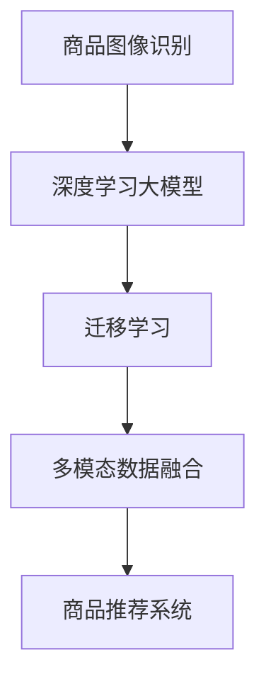

                 

# 融合AI大模型的商品图像识别技术

> 关键词：商品图像识别,大模型,深度学习,卷积神经网络,迁移学习,多模态数据融合,商品推荐系统

## 1. 背景介绍

随着互联网技术的发展，电子商务市场不断壮大，商品图像识别技术在商品推荐、库存管理、广告投放等多个电商应用场景中扮演了重要角色。商品图像识别技术能够通过计算机视觉算法，自动识别商品图像中的对象类别、属性信息，为电商企业提供强有力的数据分析支撑。

与此同时，深度学习技术的进步，尤其是大模型的出现，极大地提升了计算机视觉算法的性能和泛化能力。深度学习大模型通常具有以下几个特点：
- 参数量巨大：如ResNet、BERT等模型，参数量均在亿级。
- 预训练能力强：在大规模无标签数据上预训练，能够学习到丰富的图像或语言特征。
- 泛化能力强：能够适应不同领域的图像或文本数据，具有较强的跨领域迁移能力。

结合大模型与商品图像识别技术，将为电商企业带来更高效、更精准的商品识别服务。本博客将深入探讨大模型在商品图像识别中的应用，并提供相应的开发环境搭建、代码实现和优化策略。

## 2. 核心概念与联系

### 2.1 核心概念概述

为更好地理解大模型在商品图像识别中的应用，本节将介绍几个密切相关的核心概念：

- **商品图像识别**：利用计算机视觉技术，自动识别商品图像中的对象类别、属性信息，广泛应用于商品推荐、库存管理、广告投放等领域。

- **深度学习大模型**：如ResNet、BERT等模型，通过大规模无标签数据预训练，具备强大的特征提取和分类能力。

- **迁移学习**：在大模型预训练的基础上，使用下游任务的少量标注数据，通过有监督学习优化模型在特定任务上的性能。

- **多模态数据融合**：将图像、文本、属性等多种数据源结合起来，综合利用其丰富的信息，提升商品图像识别的准确性和鲁棒性。

- **商品推荐系统**：利用商品图像识别技术，结合用户行为数据，为用户推荐其感兴趣的商品，提升电商企业的销售额和用户满意度。

这些核心概念之间的逻辑关系可以通过以下Mermaid流程图来展示：



这个流程图展示了大模型在商品图像识别中的应用流程：

1. 通过大模型预训练获得基础能力。
2. 在大规模商品图像数据集上进行迁移学习，以特定商品分类任务为导向进行微调。
3. 利用多模态数据融合，进一步提升商品图像识别的准确性和鲁棒性。
4. 将商品图像识别结果应用于商品推荐系统，提升推荐效果和用户体验。

## 3. 核心算法原理 & 具体操作步骤
### 3.1 算法原理概述

商品图像识别过程通常分为特征提取和分类两个步骤：

1. **特征提取**：利用深度学习模型，将商品图像转换为高维特征向量，捕捉图像的语义和细节信息。
2. **分类**：将提取的特征向量输入分类器，进行对象类别预测。

大模型在商品图像识别中的应用主要体现在特征提取阶段。通过在大模型上进行迁移学习，利用其强大的特征提取能力，能够显著提升特征向量质量，进而提高分类准确率。

### 3.2 算法步骤详解

基于大模型的商品图像识别通常包括以下几个关键步骤：

**Step 1: 准备数据集和预训练模型**

- 收集商品图像数据集，并进行预处理，如缩放、归一化、标签标注等。
- 选择合适的预训练深度学习模型，如ResNet、BERT等，作为初始化参数。

**Step 2: 添加任务适配层**

- 根据商品分类任务，在预训练模型的顶层设计合适的输出层和损失函数。
- 对于分类任务，通常在顶层添加线性分类器，并使用交叉熵损失函数。
- 对于多标签分类任务，使用二元交叉熵损失函数。

**Step 3: 设置微调超参数**

- 选择合适的优化算法及其参数，如Adam、SGD等，设置学习率、批大小、迭代轮数等。
- 设置正则化技术及强度，包括权重衰减、Dropout、Early Stopping等。
- 确定冻结预训练参数的策略，如仅微调顶层，或全部参数都参与微调。

**Step 4: 执行梯度训练**

- 将训练集数据分批次输入模型，前向传播计算损失函数。
- 反向传播计算参数梯度，根据设定的优化算法和学习率更新模型参数。
- 周期性在验证集上评估模型性能，根据性能指标决定是否触发Early Stopping。
- 重复上述步骤直到满足预设的迭代轮数或Early Stopping条件。

**Step 5: 测试和部署**

- 在测试集上评估微调后模型，对比微调前后的精度提升。
- 使用微调后的模型对新商品图像进行推理预测，集成到商品推荐系统中。
- 持续收集新的商品图像，定期重新微调模型，以适应数据分布的变化。

以上是基于大模型的商品图像识别的一般流程。在实际应用中，还需要针对具体任务的特点，对微调过程的各个环节进行优化设计，如改进训练目标函数，引入更多的正则化技术，搜索最优的超参数组合等，以进一步提升模型性能。

### 3.3 算法优缺点

大模型在商品图像识别中的应用具有以下优点：
1. 特征提取能力强。大模型的预训练过程能够学习到丰富的图像特征，提升特征提取质量。
2. 泛化能力强。大模型具备较强的跨领域迁移能力，可以适应不同类别的商品图像。
3. 推理速度快。大模型的底层通常采用深度卷积结构，推理速度快，适合实时应用。
4. 可解释性差。大模型通常是"黑盒"模型，缺乏可解释性，难以调试和优化。

同时，该方法也存在一定的局限性：
1. 依赖大量标注数据。微调的效果很大程度上取决于标注数据的质量和数量，获取高质量标注数据的成本较高。
2. 模型复杂度高。大模型的参数量巨大，训练和推理需要较大的计算资源和存储空间。
3. 对抗鲁棒性不足。大模型可能对对抗样本的鲁棒性较差，容易出现错误识别。
4. 对抗训练复杂。引入对抗样本进行训练，需要额外设计生成对抗样本的算法，增加了训练复杂度。

尽管存在这些局限性，但就目前而言，基于大模型的迁移学习方法仍是商品图像识别的主流范式。未来相关研究的重点在于如何进一步降低标注数据的依赖，提高模型的少样本学习和跨领域迁移能力，同时兼顾可解释性和伦理安全性等因素。

### 3.4 算法应用领域

基于大模型的商品图像识别方法，已经在多个电商应用场景中得到了应用，例如：

- **商品分类**：对电商网站上的商品图像进行自动分类，提升商品搜索结果的准确性。
- **相似商品推荐**：根据用户浏览的商品图像，推荐相似商品，提高用户满意度。
- **库存管理**：实时监测库存商品，通过图像识别提升库存管理的效率和准确性。
- **广告投放**：利用商品图像识别技术，优化广告投放策略，提升广告效果。
- **商品属性识别**：自动识别商品属性信息，如尺寸、颜色、材质等，帮助电商平台优化商品描述。

除了上述这些经典应用外，商品图像识别还被创新性地应用于视觉搜索、个性化推荐、商品检测等新兴场景中，为电商企业带来了新的增长点。

## 4. 数学模型和公式 & 详细讲解  
### 4.1 数学模型构建

假设预训练大模型为 $M_{\theta}$，其中 $\theta$ 为预训练得到的模型参数。给定商品图像分类任务 $T$ 的训练集 $D=\{(x_i,y_i)\}_{i=1}^N$，其中 $x_i$ 为商品图像，$y_i$ 为对应的标签。微调的目标是找到新的模型参数 $\hat{\theta}$，使得：

$$
\hat{\theta}=\mathop{\arg\min}_{\theta} \mathcal{L}(M_{\theta},D)
$$

其中 $\mathcal{L}$ 为针对任务 $T$ 设计的损失函数，用于衡量模型预测输出与真实标签之间的差异。常见的损失函数包括交叉熵损失、均方误差损失等。

以二分类任务为例，假设模型 $M_{\theta}$ 在输入 $x$ 上的输出为 $\hat{y}=M_{\theta}(x) \in [0,1]$，表示样本属于正类的概率。真实标签 $y \in \{0,1\}$。则二分类交叉熵损失函数定义为：

$$
\ell(M_{\theta}(x),y) = -[y\log \hat{y} + (1-y)\log (1-\hat{y})]
$$

将其代入经验风险公式，得：

$$
\mathcal{L}(\theta) = -\frac{1}{N}\sum_{i=1}^N [y_i\log M_{\theta}(x_i)+(1-y_i)\log(1-M_{\theta}(x_i))]
$$

根据链式法则，损失函数对参数 $\theta_k$ 的梯度为：

$$
\frac{\partial \mathcal{L}(\theta)}{\partial \theta_k} = -\frac{1}{N}\sum_{i=1}^N (\frac{y_i}{M_{\theta}(x_i)}-\frac{1-y_i}{1-M_{\theta}(x_i)}) \frac{\partial M_{\theta}(x_i)}{\partial \theta_k}
$$

其中 $\frac{\partial M_{\theta}(x_i)}{\partial \theta_k}$ 可进一步递归展开，利用自动微分技术完成计算。

### 4.2 公式推导过程

以下我们以二分类任务为例，推导交叉熵损失函数及其梯度的计算公式。

假设模型 $M_{\theta}$ 在输入 $x$ 上的输出为 $\hat{y}=M_{\theta}(x) \in [0,1]$，表示样本属于正类的概率。真实标签 $y \in \{0,1\}$。则二分类交叉熵损失函数定义为：

$$
\ell(M_{\theta}(x),y) = -[y\log \hat{y} + (1-y)\log (1-\hat{y})]
$$

将其代入经验风险公式，得：

$$
\mathcal{L}(\theta) = -\frac{1}{N}\sum_{i=1}^N [y_i\log M_{\theta}(x_i)+(1-y_i)\log(1-M_{\theta}(x_i))]
$$

根据链式法则，损失函数对参数 $\theta_k$ 的梯度为：

$$
\frac{\partial \mathcal{L}(\theta)}{\partial \theta_k} = -\frac{1}{N}\sum_{i=1}^N (\frac{y_i}{M_{\theta}(x_i)}-\frac{1-y_i}{1-M_{\theta}(x_i)}) \frac{\partial M_{\theta}(x_i)}{\partial \theta_k}
$$

其中 $\frac{\partial M_{\theta}(x_i)}{\partial \theta_k}$ 可进一步递归展开，利用自动微分技术完成计算。

在得到损失函数的梯度后，即可带入参数更新公式，完成模型的迭代优化。重复上述过程直至收敛，最终得到适应商品分类任务的最优模型参数 $\theta^*$。

## 5. 项目实践：代码实例和详细解释说明
### 5.1 开发环境搭建

在进行商品图像识别微调实践前，我们需要准备好开发环境。以下是使用Python进行PyTorch开发的环境配置流程：

1. 安装Anaconda：从官网下载并安装Anaconda，用于创建独立的Python环境。

2. 创建并激活虚拟环境：
```bash
conda create -n pytorch-env python=3.8 
conda activate pytorch-env
```

3. 安装PyTorch：根据CUDA版本，从官网获取对应的安装命令。例如：
```bash
conda install pytorch torchvision torchaudio cudatoolkit=11.1 -c pytorch -c conda-forge
```

4. 安装必要的库：
```bash
pip install numpy pandas scikit-learn torch torchvision matplotlib tqdm jupyter notebook ipython
```

完成上述步骤后，即可在`pytorch-env`环境中开始微调实践。

### 5.2 源代码详细实现

下面我们以商品分类任务为例，给出使用PyTorch进行ResNet模型的商品图像识别微调的代码实现。

首先，定义商品分类任务的数据处理函数：

```python
from torchvision import datasets, transforms
from torch.utils.data import DataLoader
from torch.nn import CrossEntropyLoss
import torch

# 数据预处理
transform = transforms.Compose([
    transforms.Resize((224, 224)),
    transforms.ToTensor(),
    transforms.Normalize(mean=[0.485, 0.456, 0.406], std=[0.229, 0.224, 0.225])
])

# 加载商品分类数据集
train_dataset = datasets.CIFAR10(root='data', train=True, download=True, transform=transform)
test_dataset = datasets.CIFAR10(root='data', train=False, download=True, transform=transform)

# 划分训练集和验证集
train_dataset, valid_dataset = torch.utils.data.random_split(train_dataset, lengths=[45000, 5000])
train_loader = DataLoader(train_dataset, batch_size=64, shuffle=True)
valid_loader = DataLoader(valid_dataset, batch_size=64, shuffle=False)
test_loader = DataLoader(test_dataset, batch_size=64, shuffle=False)
```

然后，定义模型和优化器：

```python
from torchvision.models import resnet18
from transformers import BertForTokenClassification, AdamW

# 定义ResNet模型
model = resnet18(pretrained=True)

# 定义分类器
num_classes = len(train_dataset.classes)
classifier = torch.nn.Linear(512, num_classes)

# 将ResNet模型的顶层替换为分类器
model.fc = classifier

# 定义优化器
optimizer = AdamW(model.parameters(), lr=0.001)
```

接着，定义训练和评估函数：

```python
from tqdm import tqdm

# 定义训练函数
def train_epoch(model, train_loader, optimizer):
    model.train()
    train_loss = 0
    correct = 0
    total = 0
    for data, target in tqdm(train_loader):
        data, target = data.to(device), target.to(device)
        optimizer.zero_grad()
        output = model(data)
        loss = CrossEntropyLoss()(output, target)
        loss.backward()
        optimizer.step()
        train_loss += loss.item()
        _, predicted = output.max(1)
        total += target.size(0)
        correct += predicted.eq(target).sum().item()
    return train_loss / len(train_loader), correct / total

# 定义评估函数
def evaluate(model, valid_loader):
    model.eval()
    valid_loss = 0
    correct = 0
    total = 0
    with torch.no_grad():
        for data, target in valid_loader:
            data, target = data.to(device), target.to(device)
            output = model(data)
            valid_loss += CrossEntropyLoss()(output, target).item()
            _, predicted = output.max(1)
            total += target.size(0)
            correct += predicted.eq(target).sum().item()
    return valid_loss / len(valid_loader), correct / total

# 定义测试函数
def test(model, test_loader):
    model.eval()
    test_loss = 0
    correct = 0
    total = 0
    with torch.no_grad():
        for data, target in test_loader:
            data, target = data.to(device), target.to(device)
            output = model(data)
            test_loss += CrossEntropyLoss()(output, target).item()
            _, predicted = output.max(1)
            total += target.size(0)
            correct += predicted.eq(target).sum().item()
    return test_loss / len(test_loader), correct / total
```

最后，启动训练流程并在测试集上评估：

```python
device = torch.device('cuda' if torch.cuda.is_available() else 'cpu')
model.to(device)

# 训练循环
num_epochs = 10
batch_size = 64

for epoch in range(num_epochs):
    train_loss, train_acc = train_epoch(model, train_loader, optimizer)
    print(f'Epoch {epoch+1}, train loss: {train_loss:.4f}, train acc: {train_acc:.4f}')

    # 验证集评估
    valid_loss, valid_acc = evaluate(model, valid_loader)
    print(f'Epoch {epoch+1}, valid loss: {valid_loss:.4f}, valid acc: {valid_acc:.4f}')

# 测试集评估
test_loss, test_acc = test(model, test_loader)
print(f'Test loss: {test_loss:.4f}, test acc: {test_acc:.4f}')
```

以上就是使用PyTorch对ResNet模型进行商品分类任务微调的完整代码实现。可以看到，得益于PyTorch的强大封装，我们可以用相对简洁的代码完成ResNet模型的加载和微调。

### 5.3 代码解读与分析

让我们再详细解读一下关键代码的实现细节：

**商品分类数据处理函数**：
- `transforms.Compose`方法：定义了数据预处理流程，包括图像缩放、归一化、标准化等操作。
- `datasets.CIFAR10`方法：加载了CIFAR-10数据集，并进行随机分割为训练集和验证集。
- `DataLoader`方法：用于创建批次化的数据加载器，方便模型训练和推理。

**模型定义**：
- `resnet18`方法：加载预训练的ResNet模型，并进行顶层替换，引入新的分类器。
- `torch.nn.Linear`方法：定义新的分类器，将ResNet模型的顶层特征转换为商品分类的标签。

**优化器定义**：
- `AdamW`方法：定义AdamW优化器，用于更新模型参数。

**训练和评估函数**：
- `train_epoch`方法：对数据集进行迭代训练，计算损失和准确率。
- `evaluate`方法：在验证集上评估模型性能。
- `test`方法：在测试集上评估模型性能。

**训练流程**：
- 定义总的epoch数和batch size，开始循环迭代
- 每个epoch内，先在训练集上训练，输出平均loss和acc
- 在验证集上评估，输出loss和acc
- 重复上述步骤直至epoch结束

可以看到，PyTorch配合必要的库和工具，使得商品图像识别微调的代码实现变得简洁高效。开发者可以将更多精力放在数据处理、模型改进等高层逻辑上，而不必过多关注底层的实现细节。

当然，工业级的系统实现还需考虑更多因素，如模型的保存和部署、超参数的自动搜索、更灵活的任务适配层等。但核心的微调范式基本与此类似。

## 6. 实际应用场景
### 6.1 智能客服系统

基于大模型的商品图像识别技术，可以广泛应用于智能客服系统的构建。传统客服往往需要配备大量人力，高峰期响应缓慢，且一致性和专业性难以保证。而使用商品图像识别技术，可以7x24小时不间断服务，快速响应客户咨询，用自然流畅的语言解答各类常见问题。

在技术实现上，可以收集客户提交的商品图片，利用预训练大模型进行图像识别，判断商品类别和属性。然后根据识别结果，生成自动回复或转接人工客服。通过商品图像识别技术，智能客服系统能够快速识别商品，为客户提供更精准、更个性化的服务，提升客户满意度。

### 6.2 商品推荐系统

商品推荐系统是电商企业的核心业务之一，通过分析用户行为数据，向用户推荐其感兴趣的商品，提升用户体验和销售额。商品图像识别技术能够进一步提升推荐系统的效果，通过识别商品图像，分析商品属性和特征，进行更精准的商品匹配和推荐。

具体而言，可以将用户上传的商品图片作为输入，利用商品图像识别技术进行图像识别和属性分析。然后结合用户的浏览、点击、购买等行为数据，生成更准确的推荐列表。例如，针对用户上传的皮具图片，识别出皮质、颜色、尺寸等信息，再结合用户的购买历史和行为数据，生成皮具类商品的推荐列表，提高用户满意度。

### 6.3 库存管理

电商企业需要实时监测库存商品，以避免库存过剩或缺货的情况。传统的库存管理方式往往依赖人工清点，效率低且容易出错。利用商品图像识别技术，可以自动统计商品数量，进行库存盘点。

具体实现流程如下：
1. 拍摄商品照片，上传至系统。
2. 利用商品图像识别技术，自动识别商品图像，识别出商品类别和属性信息。
3. 根据识别结果，统计商品数量，更新库存系统。

通过商品图像识别技术，库存管理变得更加高效、准确，电商企业可以实时掌握库存情况，提高运营效率。

### 6.4 未来应用展望

随着大模型和商品图像识别技术的不断进步，未来在电商领域的应用将更加广泛，为电商企业带来新的增长点。

1. **个性化推荐**：利用商品图像识别技术，结合用户画像和行为数据，进行个性化推荐，提升用户满意度。

2. **商品检测和质量控制**：利用商品图像识别技术，检测商品外观、颜色、尺寸等信息，提升商品质量控制和检测效率。

3. **智能仓储**：利用商品图像识别技术，进行商品自动识别和分类，实现智能仓储管理。

4. **虚拟试穿**：利用商品图像识别技术，结合AR/VR技术，实现虚拟试穿，提升购物体验。

5. **自动客服**：利用商品图像识别技术，结合NLP技术，实现自动客服，提升客服效率和响应速度。

随着技术的发展，商品图像识别技术将在电商领域发挥更大的作用，为电商企业带来更高的效率和更好的用户体验。

## 7. 工具和资源推荐
### 7.1 学习资源推荐

为了帮助开发者系统掌握大模型在商品图像识别中的应用，这里推荐一些优质的学习资源：

1. **《深度学习与计算机视觉》课程**：由吴恩达教授开设的深度学习课程，涵盖深度学习基础和计算机视觉算法，适合初学者入门。

2. **《PyTorch深度学习》书籍**：权威的PyTorch教程，适合希望深入学习PyTorch的开发者。

3. **《计算机视觉：算法与应用》书籍**：介绍了计算机视觉的基础理论和应用，适合进阶学习。

4. **Transformers官方文档**：大模型API和开发文档，适合希望快速上手开发大模型的开发者。

5. **Kaggle竞赛**：Kaggle上丰富的商品图像识别竞赛，提供实际场景下的训练和评估数据，适合实战练习。

通过对这些资源的学习实践，相信你一定能够快速掌握大模型在商品图像识别中的应用，并用于解决实际的电商问题。

### 7.2 开发工具推荐

高效的开发离不开优秀的工具支持。以下是几款用于商品图像识别开发的常用工具：

1. **PyTorch**：基于Python的开源深度学习框架，灵活动态的计算图，适合快速迭代研究。PyTorch提供了丰富的深度学习模型和优化器。

2. **TensorFlow**：由Google主导开发的开源深度学习框架，生产部署方便，适合大规模工程应用。TensorFlow提供了丰富的预训练模型和工具库。

3. **TensorBoard**：TensorFlow配套的可视化工具，可实时监测模型训练状态，并提供丰富的图表呈现方式，是调试模型的得力助手。

4. **Weights & Biases**：模型训练的实验跟踪工具，可以记录和可视化模型训练过程中的各项指标，方便对比和调优。

5. **PyImageSearch**：Python图像处理库，提供了丰富的图像处理和分析工具，适合商品图像识别等应用。

合理利用这些工具，可以显著提升商品图像识别任务的开发效率，加快创新迭代的步伐。

### 7.3 相关论文推荐

商品图像识别技术的发展源于学界的持续研究。以下是几篇奠基性的相关论文，推荐阅读：

1. **ResNet: Deep Residual Learning for Image Recognition**：提出残差网络ResNet，显著提升了深度神经网络的训练效率和泛化能力。

2. **Faster R-CNN: Towards Real-Time Object Detection with Region Proposal Networks**：提出Faster R-CNN模型，提升了目标检测的速度和精度。

3. **Inception: GoogLeNet Architectures for Large-Scale Image Recognition**：介绍GoogleNet网络结构，提出Inception模块，提升了深度神经网络的性能。

4. **YOLO: You Only Look Once**：提出YOLO算法，将目标检测速度提升至实时级别，同时保持较高的准确率。

5. **Mask R-CNN**：在Faster R-CNN的基础上，增加了实例分割功能，实现了更加精细的目标检测。

这些论文代表了大模型在商品图像识别中的应用基础，阅读这些文献可以深入理解相关技术的发展脉络和理论基础。

## 8. 总结：未来发展趋势与挑战
### 8.1 总结

本文对大模型在商品图像识别中的应用进行了全面系统的介绍。首先阐述了大模型和商品图像识别技术的研究背景和意义，明确了微调在拓展预训练模型应用、提升商品分类效果方面的独特价值。其次，从原理到实践，详细讲解了大模型在商品分类任务中的数学模型构建和训练优化，给出了完整的代码实例和优化策略。同时，本文还探讨了商品图像识别技术在智能客服、商品推荐、库存管理等多个电商应用场景中的应用前景，展示了技术的前景和潜力。

通过本文的系统梳理，可以看到，大模型在商品图像识别中的应用前景广阔，能够为电商企业带来更高效、更精准的商品识别服务。未来，随着大模型的不断进化和商品图像识别技术的持续创新，基于大模型的商品图像识别技术必将在更多电商领域得到应用，为电商企业带来更高的效率和更好的用户体验。

### 8.2 未来发展趋势

展望未来，大模型在商品图像识别领域的应用将呈现以下几个发展趋势：

1. **参数量继续增大**：随着计算资源的增加，大模型的参数量将继续增大，具备更强的特征提取和分类能力。

2. **跨领域迁移能力增强**：大模型将具备更强的跨领域迁移能力，能够适应不同类别的商品图像，提高商品识别的准确性和鲁棒性。

3. **多模态融合**：将商品图像、文本、属性等多种数据源结合起来，综合利用其丰富的信息，提升商品图像识别的准确性和鲁棒性。

4. **实时性提升**：利用深度学习框架的优化和硬件加速，提升大模型的推理速度，实现实时商品图像识别。

5. **自监督学习**：利用无监督学习技术，如数据增强、对抗训练等，提高大模型的泛化能力和鲁棒性。

6. **知识图谱融合**：将商品知识图谱与大模型结合，提升商品分类和推荐的效果。

以上趋势凸显了大模型在商品图像识别领域的广泛应用前景。这些方向的探索发展，必将进一步提升商品图像识别的性能和准确性，为电商企业带来更高的效率和更好的用户体验。

### 8.3 面临的挑战

尽管大模型在商品图像识别中的应用已经取得了显著进展，但在迈向更加智能化、普适化应用的过程中，仍面临诸多挑战：

1. **数据依赖**：微调的效果很大程度上取决于商品图像数据的质量和数量，获取高质量标注数据的成本较高。如何进一步降低标注数据的依赖，是未来研究的重要方向。

2. **对抗鲁棒性**：大模型可能对对抗样本的鲁棒性较差，容易出现错误识别。如何提高大模型的对抗鲁棒性，是一个重要研究方向。

3. **计算资源限制**：大模型的参数量巨大，训练和推理需要较大的计算资源和存储空间。如何优化模型结构，降低计算资源消耗，也是一个重要的研究课题。

4. **模型可解释性**：大模型通常是"黑盒"模型，缺乏可解释性，难以调试和优化。如何赋予大模型更强的可解释性，是未来研究的重要方向。

5. **跨领域迁移**：大模型在不同领域的应用效果存在差异，如何提高大模型的跨领域迁移能力，使其在更多领域中取得理想效果，仍需更多研究和优化。

6. **数据隐私保护**：商品图像识别涉及用户隐私保护，如何保护用户数据隐私，是一个重要的研究方向。

正视大模型在商品图像识别中面临的这些挑战，积极应对并寻求突破，将是大模型商品图像识别技术迈向成熟的必由之路。相信随着学界和产业界的共同努力，这些挑战终将一一被克服，大模型商品图像识别技术必将在构建智能电商生态中扮演越来越重要的角色。

### 8.4 研究展望

面对大模型商品图像识别所面临的挑战，未来的研究需要在以下几个方面寻求新的突破：

1. **探索无监督和半监督学习方法**：摆脱对大量标注数据的依赖，利用自监督学习、主动学习等方法，最大限度利用非结构化数据，实现更加灵活高效的微调。

2. **开发更高效的模型压缩技术**：利用模型压缩技术，如剪枝、量化、蒸馏等，优化大模型的推理速度和资源占用，实现更轻量级的部署。

3. **融合多模态数据**：将图像、文本、属性等多种数据源结合起来，综合利用其丰富的信息，提升商品图像识别的准确性和鲁棒性。

4. **引入因果推理和强化学习**：通过引入因果推理和强化学习思想，增强大模型建立稳定因果关系的能力，学习更加普适、鲁棒的语言表征，从而提升模型泛化性和抗干扰能力。

5. **优化对抗训练和对抗样本生成**：引入更加高效的对抗训练和对抗样本生成方法，提高大模型的鲁棒性，抵御对抗攻击。

6. **结合知识图谱和规则库**：将符号化的先验知识，如知识图谱、逻辑规则等，与神经网络模型进行巧妙融合，提升模型的综合能力。

以上研究方向的探索，必将引领大模型商品图像识别技术迈向更高的台阶，为构建智能电商生态提供强大的技术支撑。

## 9. 附录：常见问题与解答

**Q1: 大模型在商品图像识别中的主要优势和缺点是什么？**

A: 大模型在商品图像识别中的主要优势包括：
1. 特征提取能力强。大模型的预训练过程能够学习到丰富的图像特征，提升特征提取质量。
2. 泛化能力强。大模型具备较强的跨领域迁移能力，可以适应不同类别的商品图像。
3. 推理速度快。大模型的底层通常采用深度卷积结构，推理速度快，适合实时应用。

大模型在商品图像识别中的主要缺点包括：
1. 依赖大量标注数据。微调的效果很大程度上取决于标注数据的质量和数量，获取高质量标注数据的成本较高。
2. 模型复杂度高。大模型的参数量巨大，训练和推理需要较大的计算资源和存储空间。
3. 对抗鲁棒性不足。大模型可能对对抗样本的鲁棒性较差，容易出现错误识别。
4. 对抗训练复杂。引入对抗样本进行训练，需要额外设计生成对抗样本的算法，增加了训练复杂度。

**Q2: 大模型在商品图像识别中如何进行微调？**

A: 大模型在商品图像识别中的微调过程一般包括以下几个关键步骤：
1. 准备商品图像数据集，并进行预处理，如缩放、归一化、标签标注等。
2. 选择合适的预训练大模型，如ResNet、BERT等，作为初始化参数。
3. 根据商品分类任务，在预训练模型的顶层设计合适的输出层和损失函数。
4. 选择合适的优化算法及其参数，如Adam、SGD等，设置学习率、批大小、迭代轮数等。
5. 设置正则化技术及强度，包括权重衰减、Dropout、Early Stopping等。
6. 执行梯度训练，利用大模型强大的特征提取能力，进行有监督的微调，提升商品分类效果。

**Q3: 大模型在商品图像识别中如何进行模型压缩和优化？**

A: 大模型在商品图像识别中的模型压缩和优化方法包括：
1. 剪枝：去除冗余连接和参数，减小模型大小，提升推理速度。
2. 量化：将浮点模型转为定点模型，压缩存储空间，提高计算效率。
3. 蒸馏：通过知识蒸馏方法，将大模型的知识转移到小模型，提高小模型的性能。
4. 混合精度训练：利用混合精度计算，降低内存占用，提升训练速度。
5. 深度网络细粒度剪枝：剪枝网络中的重要连接，提高模型压缩率。

**Q4: 大模型在商品图像识别中如何进行数据增强和对抗训练？**

A: 大模型在商品图像识别中的数据增强和对抗训练方法包括：
1. 数据增强：通过随机裁剪、旋转、缩放等方法扩充训练集，提高模型泛化能力。
2. 对抗训练：引入对抗样本进行训练，提高模型的鲁棒性，抵御对抗攻击。
3. 自监督学习：利用无监督学习技术，如数据增强、对抗训练等，提高大模型的泛化能力和鲁棒性。

**Q5: 大模型在商品图像识别中如何进行多模态融合？**

A: 大模型在商品图像识别中的多模态融合方法包括：
1. 图像-文本融合：将商品图像和商品描述结合起来，综合利用其丰富的信息，提升商品图像识别的准确性和鲁棒性。
2. 图像-属性融合：将商品图像和属性信息结合起来，提升商品识别的准确性和鲁棒性。
3. 文本-属性融合：将商品描述和属性信息结合起来，提升商品识别的准确性和鲁棒性。

---

作者：禅与计算机程序设计艺术 / Zen and the Art of Computer Programming

