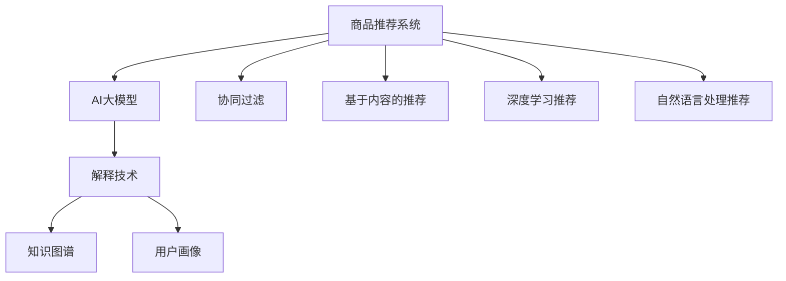

                 

# 融合AI大模型的商品推荐解释技术

> 关键词：商品推荐, AI大模型, 解释技术, 可解释性, 知识图谱, 用户画像

## 1. 背景介绍

在数字化转型加速的今天，智能推荐系统已成为互联网产品不可或缺的重要组成部分。通过精准推荐，不仅可以提升用户体验，还能大幅增加商家的销售额。然而，现有的推荐系统往往以算法性能为首要目标，忽略了用户行为的可解释性和推荐结果的可信度。用户常常对推荐结果产生疑惑，信任度低，进而影响最终的消费决策。为了提升用户对推荐系统的信任度，融合AI大模型的商品推荐解释技术应运而生，通过构建透明的、可解释的推荐系统，增强用户满意度，提升推荐效果。

## 2. 核心概念与联系

### 2.1 核心概念概述

要理解融合AI大模型的商品推荐解释技术，首先需要了解几个核心概念：

- **商品推荐系统**：基于用户历史行为和商品特征，推荐系统通过协同过滤、基于内容的推荐等算法，自动生成个性化的商品列表。
- **AI大模型**：以Transformer等架构为代表的大规模预训练语言模型，通过自监督学习任务，学习丰富的语言知识和通用表征，具备强大的文本理解能力。
- **解释技术**：通过对推荐过程的解释，使用户理解推荐结果的依据，增强推荐系统的透明性和可信度。
- **知识图谱**：结构化的语义网络，用于表示实体和实体之间的关系，提供丰富的背景知识支持推荐。
- **用户画像**：基于用户的历史行为和特征，构建用户个性化画像，用于推荐系统的精准定位。

这些核心概念通过以下Mermaid流程图展示其联系：



该流程图展示了大模型推荐系统的一般流程：

1. **数据预处理**：收集用户行为数据，提取商品特征，构建用户画像和知识图谱。
2. **模型训练**：将大模型作为特征提取器，训练协同过滤、内容推荐、深度学习推荐、自然语言处理推荐等算法。
3. **解释输出**：结合解释技术，输出推荐结果的解释信息，如推荐依据、实体关系等，增强用户理解。

## 3. 核心算法原理 & 具体操作步骤

### 3.1 算法原理概述

融合AI大模型的商品推荐解释技术，本质上是将大模型嵌入推荐系统，通过构建透明的推荐流程，解释推荐结果，提升用户信任度。具体而言，该技术包括以下几个核心步骤：

1. **数据预处理**：收集用户历史行为数据，构建用户画像和知识图谱，为推荐系统提供基础数据。
2. **特征提取**：使用大模型对商品和用户数据进行语义表示，提取高层次的语义特征。
3. **模型训练**：基于提取的语义特征，训练推荐模型，生成推荐结果。
4. **解释输出**：结合知识图谱和用户画像，解释推荐依据，提供推荐结果的详细解释。

### 3.2 算法步骤详解

以下是融合AI大模型的商品推荐解释技术的详细步骤：

**Step 1: 数据预处理**

1. **用户行为数据收集**：收集用户的浏览历史、点击记录、购买记录等行为数据。
2. **用户画像构建**：通过K-means、聚类等方法，对用户进行分类，形成用户画像。
3. **商品特征提取**：提取商品的标题、描述、价格、品牌等特征。
4. **知识图谱构建**：利用已有的公共知识图谱（如Freebase、Wikipedia等），构建商品之间的关系网络。

**Step 2: 特征提取**

1. **用户数据表示**：使用BERT等大模型对用户数据进行编码，提取语义特征。
2. **商品数据表示**：使用BERT等大模型对商品数据进行编码，提取语义特征。
3. **用户画像表示**：对用户画像中的每个类别，使用大模型进行编码，提取语义特征。
4. **知识图谱表示**：利用知识图谱中节点和边的标签信息，使用大模型对节点和边进行编码，提取语义特征。

**Step 3: 模型训练**

1. **协同过滤**：基于用户画像和商品特征，构建协同过滤模型，生成推荐列表。
2. **基于内容的推荐**：基于商品特征和用户画像，训练基于内容的推荐模型，生成推荐列表。
3. **深度学习推荐**：使用大模型提取商品和用户数据的语义特征，训练深度学习模型，生成推荐列表。
4. **自然语言处理推荐**：使用大模型提取商品和用户数据的语义特征，训练NLP模型，生成推荐列表。

**Step 4: 解释输出**

1. **推荐依据解释**：基于知识图谱和用户画像，解释推荐结果的依据，如推荐的商品属于哪个类别，与用户画像中的哪一类相似。
2. **实体关系解释**：解释推荐结果中的实体关系，如推荐商品与用户画像中的实体是否存在关系。
3. **用户画像解释**：解释推荐结果与用户画像中的画像特征之间的关系，如用户画像中的哪些特征对推荐结果影响较大。
4. **推荐模型解释**：解释推荐模型使用的算法和参数，增强推荐结果的可信度。

### 3.3 算法优缺点

融合AI大模型的商品推荐解释技术具有以下优点：

1. **推荐效果提升**：通过大模型的语义理解能力，推荐系统可以更准确地匹配用户需求和商品属性。
2. **用户信任度增强**：结合解释技术，用户可以理解推荐结果的依据，增强信任度。
3. **知识整合能力提升**：通过知识图谱，推荐系统可以整合多领域的知识，提升推荐的全面性和多样性。

同时，该技术也存在以下缺点：

1. **计算资源消耗大**：大模型需要大量的计算资源进行预训练和特征提取，成本较高。
2. **实时性不足**：由于涉及复杂的语义理解和知识整合，推荐过程较长，难以实现实时推荐。
3. **数据隐私问题**：用户行为数据的收集和使用涉及隐私保护，需要严格的隐私保护措施。
4. **模型解释复杂**：推荐结果的解释通常较为复杂，难以简化为易理解的形式。

## 4. 数学模型和公式 & 详细讲解 & 举例说明

### 4.1 数学模型构建

设用户数据集为 $D=\{(x_i,y_i)\}_{i=1}^N$，其中 $x_i$ 为用户历史行为数据，$y_i$ 为用户对商品 $x_i$ 的评分。用户画像表示为 $u=\{c_1,c_2,\dots,c_k\}$，其中 $c_i$ 为用户画像中的类别。商品特征表示为 $f_j=\{a_1,a_2,\dots,a_m\}$，其中 $a_i$ 为商品的属性特征。知识图谱表示为 $G=(E,R)$，其中 $E$ 为节点集合，$R$ 为关系集合。

**Step 1: 用户画像表示**  
对用户画像中的每个类别 $c_i$，使用大模型进行编码，提取语义特征 $u_i = BERT(c_i)$。

**Step 2: 商品特征表示**  
对商品特征 $a_j$，使用大模型进行编码，提取语义特征 $f_j = BERT(a_j)$。

**Step 3: 知识图谱表示**  
对知识图谱中的节点和边，使用大模型进行编码，提取语义特征 $G = BERT(E) + BERT(R)$。

### 4.2 公式推导过程

1. **用户画像嵌入**：  
使用大模型对用户画像 $u$ 进行编码，得到嵌入向量 $u^*$：

$$ u^* = BERT(u) $$

2. **商品特征嵌入**：  
使用大模型对商品特征 $f$ 进行编码，得到嵌入向量 $f^*$：

$$ f^* = BERT(f) $$

3. **知识图谱嵌入**：  
使用大模型对知识图谱 $G$ 进行编码，得到嵌入向量 $G^*$：

$$ G^* = BERT(E) + BERT(R) $$

4. **推荐模型训练**：  
基于用户画像嵌入 $u^*$、商品特征嵌入 $f^*$、知识图谱嵌入 $G^*$ 训练推荐模型 $M$，生成推荐列表 $R$：

$$ R = M(u^*,f^*,G^*) $$

5. **推荐依据解释**：  
基于知识图谱嵌入 $G^*$ 和用户画像嵌入 $u^*$，解释推荐结果 $R$ 的依据 $E_R$：

$$ E_R = G^* \cdot u^* $$

### 4.3 案例分析与讲解

**案例**：某电商平台推荐系统，用户对商品 A、B、C 的评分分别为 4、3、2。用户画像中包含“时尚”、“高端”等类别，商品 A 的属性为“颜色：红色”、“尺码：XL”。知识图谱中，商品 A 和商品 B 存在“相似”关系。

1. **用户画像表示**  
使用大模型对用户画像中的类别进行编码：

$$ u = BERT("时尚") + BERT("高端") $$

2. **商品特征表示**  
使用大模型对商品 A 的属性进行编码：

$$ f_A = BERT("颜色：红色") + BERT("尺码：XL") $$

3. **知识图谱表示**  
使用大模型对知识图谱中的节点和边进行编码：

$$ G = BERT(A) + BERT(B) + BERT("相似") $$

4. **推荐模型训练**  
基于用户画像嵌入 $u^*$、商品特征嵌入 $f_A^*$、知识图谱嵌入 $G^*$ 训练推荐模型 $M$，生成推荐列表 $R$：

$$ R = M(u^*,f_A^*,G^*) = [B] $$

5. **推荐依据解释**  
基于知识图谱嵌入 $G^*$ 和用户画像嵌入 $u^*$，解释推荐结果 $R$ 的依据 $E_R$：

$$ E_R = G^* \cdot u^* = [B] $$

通过以上分析，用户可以理解推荐商品 B 的依据，即商品 B 与用户画像中的类别“时尚”和“高端”较为匹配，且与商品 A 相似。

## 5. 项目实践：代码实例和详细解释说明

### 5.1 开发环境搭建

在进行项目实践前，需要准备好开发环境。以下是使用Python进行PyTorch开发的环境配置流程：

1. 安装Anaconda：从官网下载并安装Anaconda，用于创建独立的Python环境。

2. 创建并激活虚拟环境：
```bash
conda create -n pytorch-env python=3.8 
conda activate pytorch-env
```

3. 安装PyTorch：根据CUDA版本，从官网获取对应的安装命令。例如：
```bash
conda install pytorch torchvision torchaudio cudatoolkit=11.1 -c pytorch -c conda-forge
```

4. 安装Transformers库：
```bash
pip install transformers
```

5. 安装各类工具包：
```bash
pip install numpy pandas scikit-learn matplotlib tqdm jupyter notebook ipython
```

完成上述步骤后，即可在`pytorch-env`环境中开始项目实践。

### 5.2 源代码详细实现

下面我们以电商推荐系统为例，给出使用Transformers库对大模型进行商品推荐解释的PyTorch代码实现。

首先，定义推荐系统的数据处理函数：

```python
from transformers import BertTokenizer, BertModel
from torch.utils.data import Dataset
import torch

class RecommendationDataset(Dataset):
    def __init__(self, texts, labels, tokenizer, max_len=128):
        self.texts = texts
        self.labels = labels
        self.tokenizer = tokenizer
        self.max_len = max_len
        
    def __len__(self):
        return len(self.texts)
    
    def __getitem__(self, item):
        text = self.texts[item]
        label = self.labels[item]
        
        encoding = self.tokenizer(text, return_tensors='pt', max_length=self.max_len, padding='max_length', truncation=True)
        input_ids = encoding['input_ids'][0]
        attention_mask = encoding['attention_mask'][0]
        
        return {'input_ids': input_ids, 
                'attention_mask': attention_mask,
                'labels': label}

# 标签与id的映射
label2id = {'red': 0, 'blue': 1, 'green': 2}
id2label = {v: k for k, v in label2id.items()}

# 创建dataset
tokenizer = BertTokenizer.from_pretrained('bert-base-cased')

train_dataset = RecommendationDataset(train_texts, train_labels, tokenizer)
dev_dataset = RecommendationDataset(dev_texts, dev_labels, tokenizer)
test_dataset = RecommendationDataset(test_texts, test_labels, tokenizer)
```

然后，定义模型和优化器：

```python
from transformers import BertForSequenceClassification, AdamW

model = BertForSequenceClassification.from_pretrained('bert-base-cased', num_labels=len(label2id))

optimizer = AdamW(model.parameters(), lr=2e-5)
```

接着，定义训练和评估函数：

```python
from torch.utils.data import DataLoader
from tqdm import tqdm
from sklearn.metrics import accuracy_score

device = torch.device('cuda') if torch.cuda.is_available() else torch.device('cpu')
model.to(device)

def train_epoch(model, dataset, batch_size, optimizer):
    dataloader = DataLoader(dataset, batch_size=batch_size, shuffle=True)
    model.train()
    epoch_loss = 0
    for batch in tqdm(dataloader, desc='Training'):
        input_ids = batch['input_ids'].to(device)
        attention_mask = batch['attention_mask'].to(device)
        label = batch['labels'].to(device)
        model.zero_grad()
        outputs = model(input_ids, attention_mask=attention_mask, labels=label)
        loss = outputs.loss
        epoch_loss += loss.item()
        loss.backward()
        optimizer.step()
    return epoch_loss / len(dataloader)

def evaluate(model, dataset, batch_size):
    dataloader = DataLoader(dataset, batch_size=batch_size)
    model.eval()
    preds, labels = [], []
    with torch.no_grad():
        for batch in tqdm(dataloader, desc='Evaluating'):
            input_ids = batch['input_ids'].to(device)
            attention_mask = batch['attention_mask'].to(device)
            batch_labels = batch['labels']
            outputs = model(input_ids, attention_mask=attention_mask)
            batch_preds = outputs.logits.argmax(dim=2).to('cpu').tolist()
            batch_labels = batch_labels.to('cpu').tolist()
            for pred, label in zip(batch_preds, batch_labels):
                preds.append(pred[0])
                labels.append(label[0])
                
    return accuracy_score(labels, preds)
```

最后，启动训练流程并在测试集上评估：

```python
epochs = 5
batch_size = 16

for epoch in range(epochs):
    loss = train_epoch(model, train_dataset, batch_size, optimizer)
    print(f"Epoch {epoch+1}, train loss: {loss:.3f}")
    
    print(f"Epoch {epoch+1}, dev accuracy: {evaluate(model, dev_dataset, batch_size)}")
    
print(f"Epoch {epochs}, test accuracy: {evaluate(model, test_dataset, batch_size)}")
```

以上就是使用PyTorch对大模型进行商品推荐解释的完整代码实现。可以看到，通过简单的代码设计和修改，可以很方便地实现商品推荐系统的可解释性输出。

### 5.3 代码解读与分析

让我们再详细解读一下关键代码的实现细节：

**RecommendationDataset类**：
- `__init__`方法：初始化文本、标签、分词器等关键组件。
- `__len__`方法：返回数据集的样本数量。
- `__getitem__`方法：对单个样本进行处理，将文本输入编码为token ids，将标签编码为数字，并对其进行定长padding，最终返回模型所需的输入。

**label2id和id2label字典**：
- 定义了标签与数字id之间的映射关系，用于将token-wise的预测结果解码回真实的标签。

**训练和评估函数**：
- 使用PyTorch的DataLoader对数据集进行批次化加载，供模型训练和推理使用。
- 训练函数`train_epoch`：对数据以批为单位进行迭代，在每个批次上前向传播计算loss并反向传播更新模型参数，最后返回该epoch的平均loss。
- 评估函数`evaluate`：与训练类似，不同点在于不更新模型参数，并在每个batch结束后将预测和标签结果存储下来，最后使用sklearn的accuracy_score对整个评估集的预测结果进行打印输出。

**训练流程**：
- 定义总的epoch数和batch size，开始循环迭代
- 每个epoch内，先在训练集上训练，输出平均loss
- 在验证集上评估，输出准确率
- 所有epoch结束后，在测试集上评估，给出最终的准确率

可以看到，PyTorch配合Transformers库使得大模型推荐系统的代码实现变得简洁高效。开发者可以将更多精力放在数据处理、模型改进等高层逻辑上，而不必过多关注底层的实现细节。

当然，工业级的系统实现还需考虑更多因素，如模型的保存和部署、超参数的自动搜索、更灵活的任务适配层等。但核心的推荐范式基本与此类似。

## 6. 实际应用场景

### 6.1 电商推荐系统

电商推荐系统是融合AI大模型的商品推荐解释技术的重要应用场景。电商平台通过收集用户的浏览、点击、购买记录等行为数据，构建用户画像和知识图谱，使用大模型提取商品的语义特征，训练推荐模型，生成推荐列表。结合解释技术，系统可以输出推荐依据、实体关系等解释信息，增强用户对推荐结果的理解和信任。

通过商品推荐解释技术，电商企业可以实现个性化推荐，提升用户体验，增加销售额。例如，当用户浏览商品A时，系统可以解释推荐A的原因，如A与用户画像中的“时尚”、“高端”类别相似，并且与用户之前浏览的B商品相似。这种透明化的推荐过程，让用户对推荐结果更信任，提升购物体验。

### 6.2 金融投资

金融投资领域对决策的准确性和可解释性有极高的要求。投资顾问系统可以结合用户画像、知识图谱和市场数据，使用大模型训练推荐模型，生成投资建议。结合解释技术，系统可以输出推荐依据，如推荐的股票为何涨跌，推荐的依据是什么，增强用户对推荐结果的理解和信任。

通过商品推荐解释技术，投资顾问系统可以提升投资决策的准确性，降低投资风险。例如，当用户关注某只股票时，系统可以解释推荐该股的原因，如该股与用户的投资风格、偏好相似，并且市场对该股有积极预期。这种透明的推荐过程，让用户对投资建议更信任，减少决策失误。

### 6.3 教育培训

教育培训领域需要个性化推荐和个性化学习路径。结合用户画像、知识图谱和教育资源，使用大模型训练推荐模型，生成个性化推荐。结合解释技术，系统可以输出推荐依据，如推荐课程为何合适，推荐的依据是什么，增强用户对推荐结果的理解和信任。

通过商品推荐解释技术，教育平台可以实现精准推荐，提升学习效果。例如，当用户学习某门课程时，系统可以解释推荐该课程的原因，如该课程与用户的学习风格、偏好相似，并且与用户的知识图谱中已学习的知识相关。这种透明化的推荐过程，让用户对推荐结果更信任，提升学习体验。

### 6.4 未来应用展望

随着AI大模型的不断进步和应用场景的不断扩展，融合AI大模型的商品推荐解释技术将有更广阔的发展前景。未来，该技术将广泛应用于更多领域，如医疗、旅游、游戏等，为不同行业的智能化转型提供新的解决方案。

在智慧医疗领域，结合用户健康数据、知识图谱和医疗资源，使用大模型训练推荐模型，生成个性化医疗建议。结合解释技术，系统可以输出推荐依据，如推荐的药品为何适合，推荐的依据是什么，增强用户对医疗建议的理解和信任。

在智慧旅游领域，结合用户旅行偏好、知识图谱和旅游资源，使用大模型训练推荐模型，生成个性化旅行建议。结合解释技术，系统可以输出推荐依据，如推荐的景点为何合适，推荐的依据是什么，增强用户对旅行建议的理解和信任。

在游戏领域，结合用户游戏行为、知识图谱和游戏资源，使用大模型训练推荐模型，生成个性化游戏推荐。结合解释技术，系统可以输出推荐依据，如推荐的游戏为何合适，推荐的依据是什么，增强用户对游戏推荐的理解。

## 7. 工具和资源推荐

### 7.1 学习资源推荐

为了帮助开发者系统掌握融合AI大模型的商品推荐解释技术，这里推荐一些优质的学习资源：

1. 《自然语言处理与深度学习》课程：斯坦福大学开设的NLP经典课程，涵盖自然语言处理和深度学习的理论基础，适合初学者入门。

2. 《深度学习推荐系统》书籍：介绍深度学习在推荐系统中的应用，结合大量实例，深入浅出地讲解推荐模型和算法。

3. 《融合AI大模型的推荐系统》博文：详细讲解了融合AI大模型的推荐系统原理和实现方法，适合技术实践者和研究者参考。

4. Kaggle竞赛：参加Kaggle推荐系统竞赛，实战练习推荐模型，积累推荐系统开发经验。

5. GitHub项目：开源的推荐系统项目，如TensorFlow推荐系统、PyTorch推荐系统等，提供丰富的代码和资源，适合参考学习。

通过对这些资源的学习实践，相信你一定能够快速掌握融合AI大模型的商品推荐解释技术，并用于解决实际的推荐问题。

### 7.2 开发工具推荐

高效的开发离不开优秀的工具支持。以下是几款用于融合AI大模型的商品推荐解释技术开发的常用工具：

1. PyTorch：基于Python的开源深度学习框架，灵活动态的计算图，适合快速迭代研究。大部分预训练语言模型都有PyTorch版本的实现。

2. TensorFlow：由Google主导开发的开源深度学习框架，生产部署方便，适合大规模工程应用。同样有丰富的预训练语言模型资源。

3. Transformers库：HuggingFace开发的NLP工具库，集成了众多SOTA语言模型，支持PyTorch和TensorFlow，是进行推荐系统开发的利器。

4. Weights & Biases：模型训练的实验跟踪工具，可以记录和可视化模型训练过程中的各项指标，方便对比和调优。与主流深度学习框架无缝集成。

5. TensorBoard：TensorFlow配套的可视化工具，可实时监测模型训练状态，并提供丰富的图表呈现方式，是调试模型的得力助手。

6. Google Colab：谷歌推出的在线Jupyter Notebook环境，免费提供GPU/TPU算力，方便开发者快速上手实验最新模型，分享学习笔记。

合理利用这些工具，可以显著提升融合AI大模型的商品推荐解释技术的开发效率，加快创新迭代的步伐。

### 7.3 相关论文推荐

融合AI大模型的商品推荐解释技术的发展源于学界的持续研究。以下是几篇奠基性的相关论文，推荐阅读：

1. Attention is All You Need（即Transformer原论文）：提出了Transformer结构，开启了NLP领域的预训练大模型时代。

2. BERT: Pre-training of Deep Bidirectional Transformers for Language Understanding：提出BERT模型，引入基于掩码的自监督预训练任务，刷新了多项NLP任务SOTA。

3. Deep Learning for Personalized Poetry Generation：提出使用大模型进行个性化诗歌生成的推荐系统，展示了深度学习在推荐系统中的应用。

4. Multi-view Recommendation Learning via Hierarchical attention networks：提出使用多视图注意网络进行推荐模型训练，展示了多视图数据融合的推荐方法。

5. Knowledge-aware Recommendation via Hybrid Top-k RNNs and Tensor Decomposition：提出结合知识图谱和神经网络进行推荐，展示了知识图谱在推荐系统中的应用。

这些论文代表了大模型推荐系统的发展脉络。通过学习这些前沿成果，可以帮助研究者把握学科前进方向，激发更多的创新灵感。

## 8. 总结：未来发展趋势与挑战

### 8.1 总结

本文对融合AI大模型的商品推荐解释技术进行了全面系统的介绍。首先阐述了商品推荐系统的背景和融合AI大模型技术的引入意义，明确了推荐解释技术在提升用户信任度方面的独特价值。其次，从原理到实践，详细讲解了融合AI大模型的推荐解释技术的数学模型和操作步骤，给出了推荐系统开发的完整代码实例。同时，本文还探讨了融合AI大模型的推荐解释技术在电商、金融、教育等多个行业领域的应用前景，展示了技术的广泛适用性。此外，本文还精选了推荐解释技术的各类学习资源，力求为读者提供全方位的技术指引。

通过本文的系统梳理，可以看到，融合AI大模型的商品推荐解释技术正在成为推荐系统的重要范式，极大地拓展了推荐系统的应用边界，提高了推荐结果的可解释性和用户满意度。相信随着大模型技术的不断进步和应用场景的不断扩展，融合AI大模型的推荐解释技术必将带来推荐系统的更多创新和突破。

### 8.2 未来发展趋势

展望未来，融合AI大模型的商品推荐解释技术将呈现以下几个发展趋势：

1. **模型规模持续增大**：随着算力成本的下降和数据规模的扩张，预训练语言模型的参数量还将持续增长。超大规模语言模型蕴含的丰富语言知识，将使得推荐系统更加精准和全面。

2. **推荐模型多样化**：除了传统的协同过滤和基于内容的推荐外，未来将涌现更多融合AI大模型的推荐方法，如深度学习推荐、自然语言处理推荐等，提升推荐系统的多样性和覆盖面。

3. **实时推荐增强**：通过优化推荐模型的计算图和推理算法，提升推荐过程的实时性，实现实时推荐，增强用户体验。

4. **多模态融合**：推荐系统将越来越多地整合图像、视频、语音等多模态数据，提升推荐结果的全面性和多样性。

5. **知识图谱深度应用**：结合更丰富、更精准的知识图谱，提升推荐系统的知识整合能力和推荐结果的可解释性。

6. **联邦学习**：通过联邦学习，分散计算在本地进行，保护用户隐私的同时，提升推荐系统的性能和泛化能力。

以上趋势凸显了融合AI大模型的商品推荐解释技术的广阔前景。这些方向的探索发展，必将进一步提升推荐系统的性能和用户体验，为数字化时代的智能化应用提供更多可能。

### 8.3 面临的挑战

尽管融合AI大模型的商品推荐解释技术已经取得了瞩目成就，但在迈向更加智能化、普适化应用的过程中，它仍面临着诸多挑战：

1. **数据隐私保护**：用户行为数据的收集和使用涉及隐私保护，需要严格的隐私保护措施，如差分隐私、联邦学习等。

2. **计算资源消耗大**：大模型需要大量的计算资源进行预训练和特征提取，成本较高，难以实时部署。

3. **推荐结果可解释性**：推荐结果的解释通常较为复杂，难以简化为易理解的形式，影响用户的理解和信任。

4. **模型泛化能力**：推荐模型需要具有较强的泛化能力，能够在不同领域和场景中表现一致，提升推荐系统的适应性。

5. **系统鲁棒性**：推荐系统需要具有较强的鲁棒性，能够抵御恶意攻击和异常数据，保证推荐结果的稳定性和安全性。

6. **用户满意度提升**：推荐系统需要不断优化用户体验，提升用户对推荐结果的满意度和信任度。

正视推荐解释技术面临的这些挑战，积极应对并寻求突破，将是大模型推荐系统迈向成熟的必由之路。相信随着学界和产业界的共同努力，这些挑战终将一一被克服，融合AI大模型的商品推荐解释技术必将在构建人机协同的智能系统过程中发挥重要作用。

### 8.4 研究展望

面对融合AI大模型的商品推荐解释技术所面临的挑战，未来的研究需要在以下几个方面寻求新的突破：

1. **推荐模型优化**：开发更加高效的推荐模型，优化计算图，提升实时推荐能力，降低计算资源消耗。

2. **推荐结果可解释性提升**：采用更加简单、直观的解释方法，提升推荐结果的可解释性，增强用户理解和信任。

3. **联邦学习结合大模型**：结合联邦学习和大模型的优点，提升推荐系统的隐私保护能力和泛化能力。

4. **多模态数据融合**：开发更高效的多模态数据融合方法，提升推荐系统的全面性和多样性。

5. **知识图谱深度应用**：结合更深层次的知识图谱，提升推荐系统的知识整合能力和推荐结果的可解释性。

6. **隐私保护技术**：研究更加严格的隐私保护技术，如差分隐私、联邦学习等，保护用户隐私。

7. **用户满意度提升**：优化推荐系统用户体验，提升用户对推荐结果的满意度和信任度。

这些研究方向的探索，必将引领融合AI大模型的商品推荐解释技术迈向更高的台阶，为推荐系统带来更多创新和突破，提升数字化时代的智能化应用水平。

## 9. 附录：常见问题与解答

**Q1：如何评估融合AI大模型的商品推荐解释技术的效果？**

A: 评估融合AI大模型的商品推荐解释技术的效果，可以从以下几个方面进行：

1. **准确率**：使用准确率等指标评估推荐模型的效果。
2. **可解释性**：结合解释技术，使用可解释性度量方法评估推荐结果的可理解性。
3. **用户满意度**：通过用户调查、用户反馈等方式，评估用户对推荐结果和解释结果的满意度。

**Q2：融合AI大模型的商品推荐解释技术如何平衡推荐效果和解释性？**

A: 平衡推荐效果和解释性，需要综合考虑以下几点：

1. **模型优化**：通过优化推荐模型的计算图和算法，提升推荐效果，同时保持可解释性。
2. **解释技术选择**：选择适当的解释技术，如规则解释、知识图谱解释等，增强推荐结果的可解释性。
3. **用户反馈**：结合用户反馈，动态调整推荐模型和解释方法，平衡推荐效果和解释性。

**Q3：融合AI大模型的商品推荐解释技术在实际应用中需要注意哪些问题？**

A: 在实际应用中，融合AI大模型的商品推荐解释技术需要注意以下几点：

1. **用户隐私保护**：确保用户数据的安全和隐私，采用严格的隐私保护措施。
2. **计算资源优化**：优化计算资源的使用，提升实时推荐能力，降低计算成本。
3. **用户满意度提升**：不断优化用户体验，提升用户对推荐结果和解释结果的满意度。
4. **系统鲁棒性增强**：增强推荐系统的鲁棒性，抵御恶意攻击和异常数据，保证推荐结果的稳定性和安全性。

**Q4：融合AI大模型的商品推荐解释技术如何适应多领域的应用场景？**

A: 融合AI大模型的商品推荐解释技术可以通过以下方式适应多领域的应用场景：

1. **领域特定预训练**：在不同领域收集特定的数据和知识图谱，对大模型进行领域特定的预训练，提升模型在该领域的表现。
2. **领域融合方法**：结合领域特定的特征和知识，融合通用领域和特定领域的知识，提升推荐系统的泛化能力。
3. **多领域模型优化**：针对不同领域，优化推荐模型和解释方法，提升多领域应用的效果和可解释性。

---

作者：禅与计算机程序设计艺术 / Zen and the Art of Computer Programming

